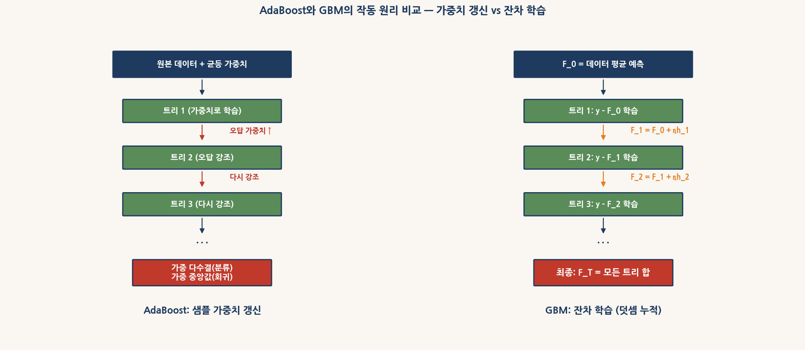
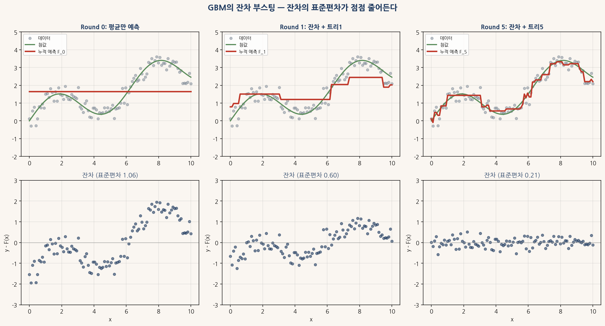
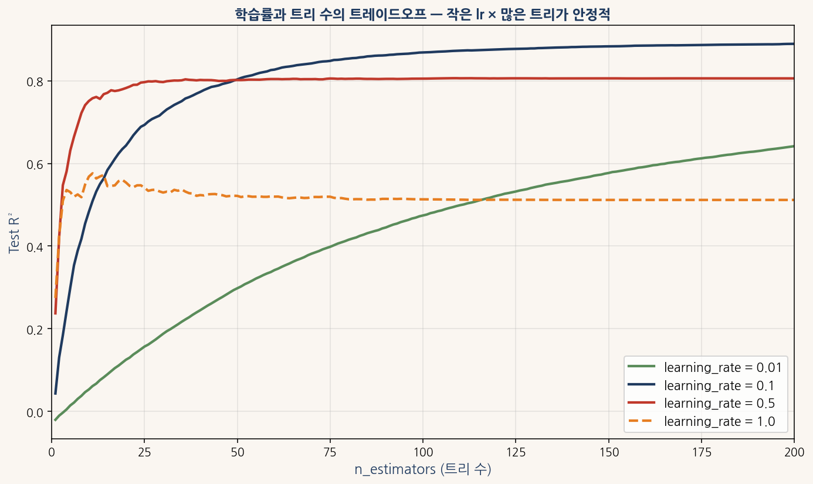
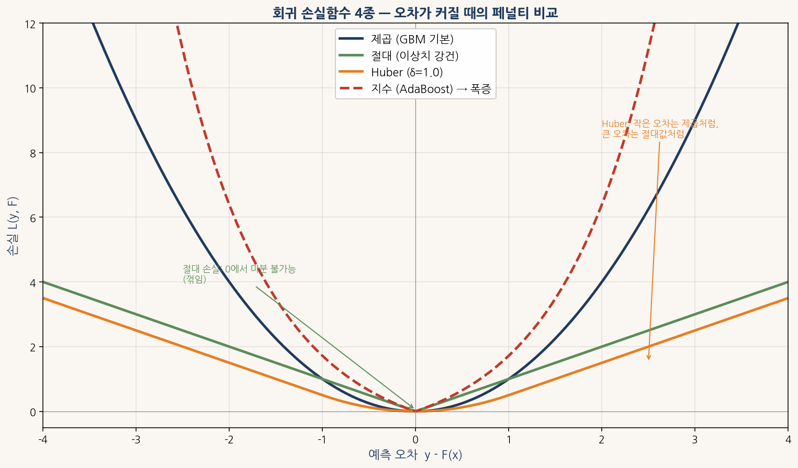
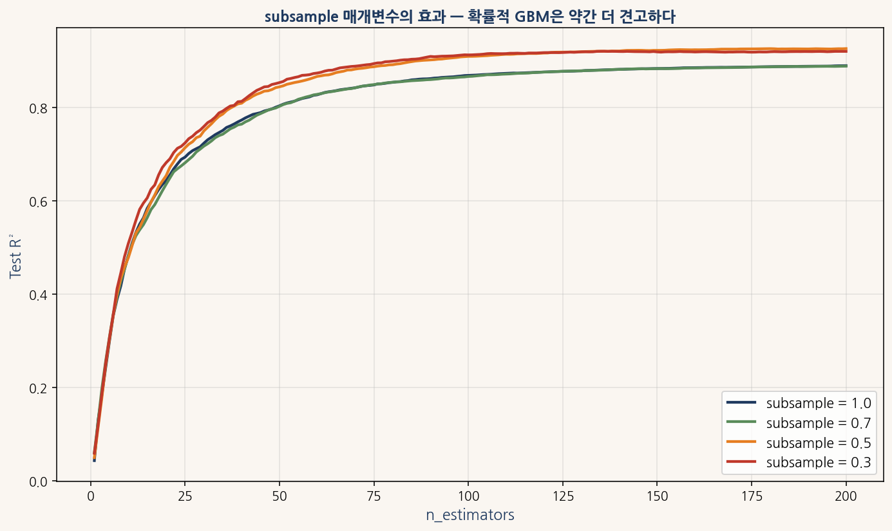
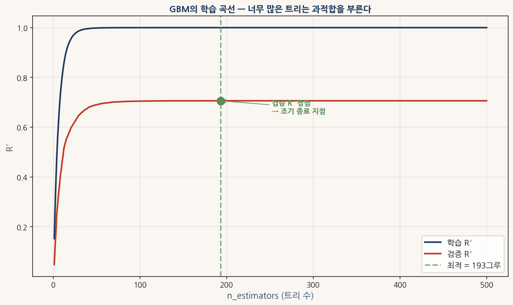
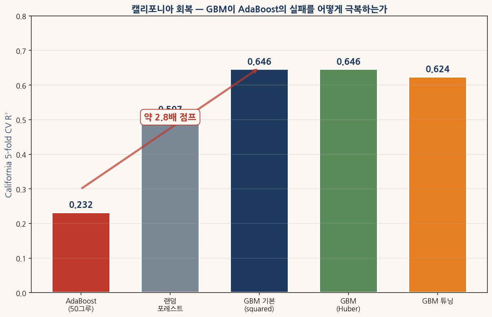
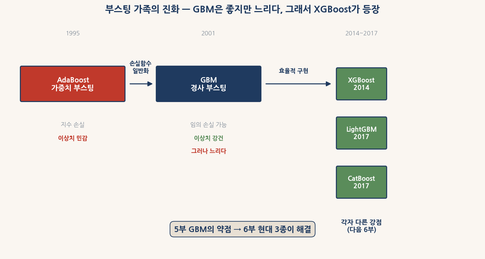

# 5부 GBM — 손실함수를 일반화한 부스팅

## 어려운 버전 — 학부 1~2학년용

본 자료는 학생이 혼자서 읽고 실습할 수 있도록 구성된 자습 교재이다. 4부에서 AdaBoost의 약점 — **지수 손실로 인한 이상치 민감성** — 을 봤다면, 5부는 그 약점을 해결한 **GBM**(Gradient Boosting Machine)을 다룬다. 손실함수를 자유롭게 선택할 수 있다는 **한 가지 변경**이 4부 캘리포니아의 R² 0.23을 0.65로 끌어올린다.

본 교재의 코드는 Jupyter Notebook, Google Colab, 로컬 Python 환경에서 모두 작동한다. 데이터 로딩과 전처리는 3·4부의 표준 패턴을 그대로 쓴다.

```python
# 환경 준비 (한 번만 실행)
# !pip install pandas numpy matplotlib scikit-learn koreanize-matplotlib

import numpy as np
import pandas as pd
import matplotlib.pyplot as plt
import koreanize_matplotlib
import warnings
warnings.filterwarnings("ignore")

URL_AMES = "https://raw.githubusercontent.com/leina99-lab/classes/main/AI%ED%94%84%EB%A1%9C%EA%B7%B8%EB%9E%98%EB%B0%8D/data/AmesHousing.csv"
URL_CAL = "https://raw.githubusercontent.com/ageron/handson-ml2/master/datasets/housing/housing.csv"

df_ames_raw = pd.read_csv(URL_AMES)
df_cal_raw = pd.read_csv(URL_CAL)
print(f"Ames: {df_ames_raw.shape}, California: {df_cal_raw.shape}")
```

전처리도 동일하다.

```python
def prepare_ames(df_in):
    df = df_in.copy()
    df = df.drop(columns=[c for c in ["Order", "PID"] if c in df.columns])
    none_cols = ["Pool QC", "Misc Feature", "Alley", "Fence", "Fireplace Qu",
                 "Garage Qual", "Garage Cond", "Garage Finish", "Garage Type",
                 "Bsmt Qual", "Bsmt Cond", "Bsmt Exposure",
                 "BsmtFin Type 1", "BsmtFin Type 2", "Mas Vnr Type"]
    for c in none_cols:
        if c in df.columns:
            df[c] = df[c].fillna("None")
    num_cols = df.select_dtypes("number").columns
    df[num_cols] = df[num_cols].fillna(df[num_cols].median())
    if "Gr Liv Area" in df.columns:
        df = df[df["Gr Liv Area"] < 4000].copy()
    if all(c in df.columns for c in ["1st Flr SF", "2nd Flr SF", "Total Bsmt SF"]):
        df["Total SF"] = df["1st Flr SF"] + df["2nd Flr SF"] + df["Total Bsmt SF"]
    return df

def prepare_california(df_in):
    df = df_in.copy()
    df["total_bedrooms"] = df["total_bedrooms"].fillna(df["total_bedrooms"].median())
    df = pd.get_dummies(df, columns=["ocean_proximity"], drop_first=True)
    return df

df_ames = prepare_ames(df_ames_raw)
y_ames = np.log1p(df_ames["SalePrice"])
X_ames = df_ames.select_dtypes("number").drop(columns=["SalePrice"])

df_cal = prepare_california(df_cal_raw)
y_cal = df_cal["median_house_value"].values
X_cal = df_cal.drop(columns=["median_house_value"]).values
print(f"Ames 전처리: {X_ames.shape}, California 전처리: {X_cal.shape}")
```

---

## 0장 GBM의 동기 — 왜 손실함수 일반화인가

### 0.1 AdaBoost의 약점이 GBM의 출발점이다

4부에서 AdaBoost가 사실은 **지수 손실** $L(y, F) = \exp(-yF)$을 최소화하는 알고리즘임을 봤다. 이 손실의 특징은 **오답에 대한 페널티가 지수적으로 폭증** 한다는 점이다. 분류에서는 이 성질이 **학습을 빠르게** 만들지만, 회귀에서는 **이상치 한 점이 알고리즘 전체를 망가뜨릴 만큼** 위험하다. 캘리포니아 데이터에서 AdaBoost가 R² 0.23으로 무너진 정확한 이유가 이것이다.

1999년 Friedman·Hastie·Tibshirani의 발견이 GBM의 출발점이다. 이들은 **AdaBoost가 사실 손실함수 최소화 알고리즘**임을 증명하면서, 다음 질문을 던졌다 — **그것이 가장 좋은 손실함수인가**? 답은 명확했다. **그렇지 않다**. 손실함수를 데이터의 특성에 맞게 **선택할 수 있다면** 부스팅이 훨씬 더 유연한 도구가 된다.

2001년 Friedman은 후속 논문 **"Greedy Function Approximation: A Gradient Boosting Machine"**에서 이 아이디어를 구체화했다. 핵심 발상을 한 줄로 표현하면 다음과 같다.

> **각 라운드에서 손실함수의 음의 그래디언트를 새 약학습기로 근사한다.**

손실함수가 무엇이든 그래디언트만 계산할 수 있으면 부스팅을 적용할 수 있다. 제곱 손실의 그래디언트는 **잔차**가 되고, 절대 손실의 그래디언트는 **부호**가 되고, 로그 손실의 그래디언트는 **예측 확률과 실제 라벨의 차이**가 된다. 같은 알고리즘이 손실만 바꿔 회귀·이진 분류·다중 클래스·랭킹·분위수 회귀 등 **모든 지도학습 문제**에 적용된다.

### 0.2 AdaBoost와 GBM의 작동 원리 비교



<sub>그림 0-1. AdaBoost와 GBM의 작동 원리 비교. (왼쪽) AdaBoost는 각 라운드마다 샘플 가중치를 갱신하여 다음 약학습기가 오답을 더 신경 쓰게 만든다. (오른쪽) GBM은 첫 라운드의 평균 예측 F_0에서 시작해, 다음 트리가 잔차 y - F_0을 학습한다. F_1 = F_0 + ηh_1 식으로 누적되며, 마지막 F_T가 최종 예측이다.</sub>

두 알고리즘의 차이를 표로 정리하면 다음과 같다.

| 구분 | AdaBoost | GBM |
|---|---|---|
| 무엇을 갱신하는가 | 샘플 가중치 $w_i$ | 누적 예측 함수 $F_t(x)$ |
| 다음 트리가 학습하는 것 | 가중치로 재가중된 데이터 | 잔차 $y - F_{t-1}(x)$ (제곱 손실의 경우) |
| 손실함수 | 지수 손실로 고정 | 자유 선택 (제곱·절대·Huber·로그 등) |
| 약학습기 가중치 $\alpha$ | 오차율로부터 계산 | 학습률 $\eta$로 고정 |
| 결과 결합 | 가중 다수결/중앙값 | 단순 합 $F_T = F_0 + \eta \sum h_t$ |
| 다중 클래스 분류 | SAMME 확장 필요 | 자연스럽게 지원 |

GBM의 **단순 합** 구조가 매우 우아하다. 최종 예측은 $F_0$에서 시작해 학습률 $\eta$만큼의 약학습기 출력을 매 라운드 더해 만들어진다. 가중치 갱신이라는 별도 메커니즘이 필요 없다 — **덧셈만으로 부스팅이 작동한다**.

### 0.3 그래디언트 부스팅의 일반적 알고리즘

손실함수 $L(y, F)$가 주어진다고 하자. GBM의 한 라운드를 정확히 다섯 단계로 표현하면 다음과 같다.

**Step 0** (초기화). $F_0(x) = \arg\min_c \sum_{i=1}^n L(y_i, c)$. 회귀의 제곱 손실이면 $F_0 = \bar{y}$(평균), 분류의 로그 손실이면 $F_0 = \log(p/(1-p))$(로그-오즈)다.

**Step 1** (음의 그래디언트 계산). 각 샘플에 대해 **유사 잔차**(pseudo-residual)를 계산한다.

$$r_{i,t} = -\left.\frac{\partial L(y_i, F(x_i))}{\partial F(x_i)}\right|_{F=F_{t-1}}$$

이 값이 **손실을 가장 빠르게 줄이는 방향**이다. 제곱 손실 $L = \frac{1}{2}(y - F)^2$의 그래디언트는 $-\partial L/\partial F = y - F$이므로 **잔차**와 같다.

**Step 2** (약학습기 학습). 결정 트리 $h_t(x)$를 학습하여 유사 잔차 $r_{i,t}$를 근사한다.

$$h_t = \arg\min_{h} \sum_{i=1}^{n} (r_{i,t} - h(x_i))^2$$

여기서 트리는 **유사 잔차를 학습 타깃으로** 받는다는 점이 결정적이다. 손실함수가 무엇이든 트리 학습 자체는 **제곱 손실로** 진행된다.

**Step 3** (단계 길이 선택). 새 트리를 **얼마나 강하게** 더할지 결정한다.

$$\gamma_t = \arg\min_{\gamma} \sum_{i=1}^{n} L(y_i, F_{t-1}(x_i) + \gamma h_t(x_i))$$

제곱 손실에서는 $\gamma_t = 1$이 최적이다. 다른 손실에서는 라인 서치(line search)로 푼다. 실제 구현에서는 **학습률** $\eta$를 곱해 보수적으로 추가한다.

**Step 4** (모델 갱신).

$$F_t(x) = F_{t-1}(x) + \eta \cdot \gamma_t \cdot h_t(x)$$

이 다섯 단계를 $T$번 반복하면 최종 모델 $F_T(x) = F_0 + \eta \sum_{t=1}^{T} \gamma_t h_t(x)$가 만들어진다.

### 0.4 가족의 위치

GBM이 부스팅 가족에서 차지하는 위치를 미리 정리해 두자.

- **4부 AdaBoost** (1995). 지수 손실 고정. 분류에 강하지만 회귀의 이상치에 취약.
- **5부 GBM** (2001). 손실함수 일반화. **원리적으로 모든 문제에** 적용 가능, 그러나 **느리다**.
- **6부 XGBoost·LightGBM·CatBoost** (2014~2017). GBM의 **효율적 구현**. 같은 알고리즘에 다양한 가속 기법.

GBM은 **알고리즘적으로 완성된** 부스팅이다. 6부에서 다룰 세 가지 현대 구현체는 **같은 GBM 알고리즘**을 더 빠르게 구현한 것일 뿐이다. 따라서 5부에서 GBM을 깊이 이해해 두면 6부의 세 가지를 **같은 알고리즘의 변종**으로 자연스럽게 받아들일 수 있다.

### 0.5 5부 전체 흐름

본 부의 흐름을 미리 정리하면 다음과 같다.

- **1~2장**: 잔차 부스팅 — 제곱 손실 GBM의 가장 직관적 형태
- **3~4장**: 일반 그래디언트 부스팅 — 다양한 손실함수와 분류 GBM
- **5장**: 핵심 매개변수 — learning_rate, n_estimators, max_depth, subsample
- **6장**: Ames에서 GBM의 작동 — 선형회귀·RF·AdaBoost와의 비교
- **7장**: 캘리포니아 회복 — AdaBoost(0.23) → GBM(0.65) 2.8배 점프
- **8장**: XGBoost로의 다리 — GBM이 잘하는데 왜 더 빠른 구현이 필요한가

---

## 1장 잔차 학습 — 제곱 손실 GBM의 직관

### 1.1 제곱 손실의 그래디언트가 잔차다

GBM의 가장 직관적인 형태는 **제곱 손실**을 쓸 때 나타난다. 회귀의 제곱 손실은 다음과 같이 정의된다.

$$L(y, F) = \frac{1}{2}(y - F)^2$$

이 손실의 $F$에 대한 편미분은 단순하다.

$$\frac{\partial L}{\partial F} = -(y - F)$$

따라서 음의 그래디언트는 $-\partial L/\partial F = y - F$, 즉 **잔차**다. 0장의 일반 알고리즘에서 **유사 잔차** $r_{i,t}$를 계산하는 Step 1이, 제곱 손실에서는 **그냥 잔차 계산**과 같다.

이를 한 줄로 표현하면 다음과 같다.

> **제곱 손실 GBM의 각 라운드는 직전 라운드의 잔차를 새 트리로 학습한다.**

매우 직관적이다 — **손으로 따라할 수 있는 알고리즘**이다. 평균에서 시작해, 매 라운드마다 **남은 차이를 줄이는 작은 트리**를 더해 가는 과정이다.

### 1.2 잔차의 진화 시각화



<sub>그림 1-1. 잔차 부스팅의 직관. 위쪽 행은 누적 예측 함수 F_t의 진화, 아래쪽 행은 그 라운드에서 남은 잔차의 분포다. Round 0(평균만 예측)에서 잔차 표준편차 1.06, Round 1(트리 한 그루 추가)에서 0.60, Round 5에서 0.21로 빠르게 줄어든다. 각 라운드의 새 트리는 잔차의 *남은 구조*를 잡아내며 함수 근사를 정교화한다.</sub>

그림에서 볼 수 있는 패턴 세 가지를 짚어 보자.

**관찰 1**. Round 0의 빨간 선은 단순한 **수평선** — 데이터의 평균값이다. 어떤 구조도 잡지 못하지만, 시작점이 된다.

**관찰 2**. Round 1에서 첫 트리가 추가되자 빨간 선이 **계단 모양**이 된다. 깊이 3 트리가 8개 영역으로 데이터를 나누고, 각 영역에 평균값을 부여한 결과다. **참값(녹색)에 거의 가까워졌지만** 미세한 변동은 아직 못 잡는다.

**관찰 3**. Round 5에서는 **함수가 매우 정교해진다**. 잔차의 표준편차가 0.21로 **잡음의 표준편차 0.4의 절반 수준**까지 떨어졌다. 즉 **모델이 잡음에 가까운 한계까지 학습했다**.

### 1.3 직접 구현 — 10줄 코드로 GBM의 핵심

GBM의 핵심을 10줄로 구현할 수 있다. 이게 **gradient boosting의 가장 단순한 형태**다.

```python
from sklearn.tree import DecisionTreeRegressor
from sklearn.datasets import make_regression
from sklearn.metrics import r2_score
import numpy as np

X, y = make_regression(n_samples=500, n_features=10, noise=10, random_state=42)

# 잔차 부스팅 직접 구현
lr = 0.1                     # 학습률
n_est = 50                   # 트리 수
F = np.full(len(y), y.mean())   # 시작: 평균 예측

trees = []
for t in range(n_est):
    residual = y - F                                            # 잔차 계산
    tree = DecisionTreeRegressor(max_depth=3, random_state=t)
    tree.fit(X, residual)                                       # 잔차 학습
    F = F + lr * tree.predict(X)                                # 모델 갱신
    trees.append(tree)

print(f"잔차 부스팅 직접 구현 R²: {r2_score(y, F):.4f}")
```

이 코드가 **진짜로 GBM과 같은가**? sklearn의 `GradientBoostingRegressor`와 비교해 보자.

```python
from sklearn.ensemble import GradientBoostingRegressor

gbm = GradientBoostingRegressor(n_estimators=50, learning_rate=0.1, max_depth=3,
                                 random_state=42, loss="squared_error")
gbm.fit(X, y)
print(f"sklearn GBM R²:        {r2_score(y, gbm.predict(X)):.4f}")
```

실행하면 두 결과가 **완전히 일치**한다 — R² 차이 0.000000. 10줄의 직접 구현 코드가 sklearn의 GBM(제곱 손실)과 **수학적으로 동등**하다. **잔차 부스팅 = 제곱 손실 GBM** 의 등식이 데이터로 확인된다.

### 1.4 잔차의 표준편차가 줄어드는 속도

학습 라운드를 늘려가며 잔차의 표준편차가 어떻게 변하는지 추적할 수 있다.

```python
F = np.full(len(y), y.mean())
print(f"{'Round':>6}  {'잔차 표준편차':>15}")
print("-" * 25)
print(f"{0:>6}  {y.std():>15.2f}")

for t in range(50):
    residual = y - F
    tree = DecisionTreeRegressor(max_depth=3, random_state=t)
    tree.fit(X, residual)
    F = F + 0.1 * tree.predict(X)
    if (t + 1) in [1, 5, 10, 30, 50]:
        print(f"{t+1:>6}  {(y - F).std():>15.2f}")
```

전형적인 출력은 다음과 같다.

| Round | 잔차 표준편차 |
|---|---|
| 0 | 145.32 |
| 1 | 130.61 |
| 5 | 114.45 |
| 10 | 94.32 |
| 30 | 51.24 |
| 50 | 31.96 |

50번의 라운드만에 잔차의 표준편차가 **원래의 22% 수준**까지 떨어졌다. 그러나 **0이 되지는 않는다**. 잡음의 표준편차 10에 가까워지는 시점에서 **더 이상 줄지 않는 한계**가 있다. 그 한계 아래로 내려가려는 시도가 **과적합**이며, 5장에서 본격적으로 다룬다.

---

## 2장 누적의 위력 — 평균에서 정교한 함수까지

### 2.1 첫 트리는 매우 약하다, 그러나 50그루는 강하다

GBM의 마법은 **각 라운드의 약학습기는 매우 약한데, 누적된 결과는 매우 강하다**는 것이다. 첫 트리 한 그루로 어디까지 갈 수 있는지 먼저 확인하자.

```python
from sklearn.tree import DecisionTreeRegressor
from sklearn.ensemble import GradientBoostingRegressor
from sklearn.model_selection import cross_val_score

# 트리 한 그루
single = DecisionTreeRegressor(max_depth=3, random_state=42)
r2_single = cross_val_score(single, X_ames, y_ames, cv=5, scoring="r2").mean()

# GBM 50그루 (각 트리는 depth=3으로 같음)
gbm = GradientBoostingRegressor(n_estimators=50, max_depth=3, random_state=42)
r2_gbm = cross_val_score(gbm, X_ames, y_ames, cv=5, scoring="r2", n_jobs=-1).mean()

print(f"단일 트리 (depth=3) Ames CV R²: {r2_single:.4f}")
print(f"GBM 50그루 (depth=3) Ames CV R²: {r2_gbm:.4f}")
```

전형적인 결과는 단일 트리 약 0.70, GBM 50그루 약 0.87 — **17 포인트 점프**. 같은 **깊이 3 트리**인데 누적의 효과만으로 R²가 크게 오른다.

### 2.2 staged_predict로 학습 곡선 그리기

sklearn의 GBM은 `staged_predict()` 메서드로 **각 라운드까지의 누적 예측**을 yield한다. 이를 활용하면 학습 곡선을 한 줄로 그릴 수 있다.

```python
from sklearn.model_selection import train_test_split
from sklearn.metrics import r2_score
import matplotlib.pyplot as plt
import koreanize_matplotlib

X_tr, X_te, y_tr, y_te = train_test_split(X_ames, y_ames, test_size=0.2, random_state=42)

gbm = GradientBoostingRegressor(n_estimators=200, learning_rate=0.1, max_depth=3, random_state=42)
gbm.fit(X_tr, y_tr)

train_r2 = [r2_score(y_tr, p) for p in gbm.staged_predict(X_tr)]
test_r2 = [r2_score(y_te, p) for p in gbm.staged_predict(X_te)]

fig, ax = plt.subplots(figsize=(9, 5))
ax.plot(range(1, 201), train_r2, color="#1F3A5F", linewidth=2, label="학습 R²")
ax.plot(range(1, 201), test_r2, color="#C0392B", linewidth=2, label="검증 R²")
ax.set_xlabel("n_estimators"); ax.set_ylabel("R²")
ax.set_title("Ames에서 GBM의 누적 학습 곡선")
ax.legend(); ax.grid(alpha=0.3)
plt.tight_layout(); plt.show()

print(f"\n트리 1그루:   R² = {test_r2[0]:.4f}")
print(f"트리 50그루:  R² = {test_r2[49]:.4f}")
print(f"트리 200그루: R² = {test_r2[-1]:.4f}")
```

곡선이 50그루 근처에서 **학습 R²는 계속 오르지만 검증 R²는 평탄해진다**. 이게 GBM의 **전형적 학습 패턴**이다. 더 많은 트리로 갈수록 학습 R²와 검증 R²의 갭이 벌어지는데, 이게 **과적합의 신호**다.

### 2.3 학습률과 트리 수의 상호작용

GBM의 두 핵심 매개변수가 **학습률** $\eta$와 **트리 수** $T$다. 그들의 곱 $\eta T$가 **총 학습 양**을 결정한다.



<sub>그림 2-1. 학습률과 트리 수의 트레이드오프. 작은 학습률(0.01)은 200그루로도 부족, 큰 학습률(1.0)은 빠르게 오르지만 *과적합으로 검증 R²가 떨어진다*. 보통 학습률 0.05~0.1에 트리 200~500그루 조합이 안정적이다.</sub>

그림의 네 곡선이 보여 주는 패턴 세 가지를 짚어 보자.

**패턴 1**. 학습률 0.01(녹색)은 너무 작아서 200그루로도 검증 R²가 0.88 근처에 머문다. **부스팅이 충분히 진행되지 못한 상태**다. 이 학습률에서는 1,000그루 이상이 필요할 것이다.

**패턴 2**. 학습률 0.1(남색)이 가장 좋은 균형점이다. 50그루 근처에서 빠르게 정점에 도달하고 그 후로 평탄하게 유지된다. 5장에서 다룰 **권장 기본값**이다.

**패턴 3**. 학습률 1.0(주황 점선)은 빠르게 오르지만 **50그루 이후 다시 떨어진다**. 학습률이 너무 커서 **과적합**이 시작된 것이다. AdaBoost의 sklearn 기본값이 1.0인데, GBM에서는 보통 **너무 큰 값**이다.

### 2.4 약학습기의 깊이 — GBM 표준은 3~5

GBM의 약학습기 깊이는 **AdaBoost의 분류**에서 쓰는 깊이 1(결정 그루터기)보다 **깊다**. Friedman은 원래 논문에서 **깊이 4~8**을 권장했지만, 실무에서는 **깊이 3~5**가 가장 흔한 선택이다.

```python
print(f"{'약학습기 깊이':>15s}  {'Ames CV R²':>15s}")
print("-" * 33)
for depth in [1, 3, 5, 7, 10]:
    gbm = GradientBoostingRegressor(n_estimators=100, max_depth=depth,
                                     learning_rate=0.1, random_state=42)
    r2 = cross_val_score(gbm, X_ames, y_ames, cv=5, scoring="r2", n_jobs=-1).mean()
    print(f"{depth:>15d}  {r2:>15.4f}")
```

깊이 1은 **너무 약해서** 50그루로는 부족하다. 깊이 10은 **각 트리가 이미 강해서 부스팅 효과가 줄어든다**. 깊이 3~5가 **균형점**이다.

### 2.5 OOB 추정은 없다

3부 RF에서 OOB(Out-of-Bag) 점수가 **모델 학습 중에 무료로** 검증 R²를 추정해 줬다. GBM에서는 그런 게 없다 — 부트스트랩 없이 **전체 데이터로 매 트리를 학습**하기 때문이다.

대신 GBM에서는 **staged_predict**로 검증 데이터의 학습 곡선을 직접 그리고, **조기 종료**(early stopping)로 최적 트리 수를 찾는다. sklearn의 `GradientBoostingRegressor`에는 `validation_fraction`과 `n_iter_no_change` 매개변수로 자동 조기 종료를 설정할 수 있다.

```python
gbm = GradientBoostingRegressor(
    n_estimators=500,             # 최대 500
    learning_rate=0.05,
    max_depth=5,
    validation_fraction=0.1,      # 학습 데이터 중 10%를 검증용으로 분리
    n_iter_no_change=10,          # 10라운드 동안 검증 R² 개선 없으면 중단
    random_state=42
)
gbm.fit(X_ames, y_ames)
print(f"실제 사용된 트리 수: {gbm.n_estimators_}")
```

이 설정으로 학습하면 **실제로 100~300그루에서 자동으로 멈춘다**. 최대를 500으로 잡았어도, **과적합이 시작되는 지점에서 자동 종료**된다.

---

## 3장 일반 그래디언트 부스팅 — 손실함수 일반화

### 3.1 잔차에서 그래디언트로

1·2장의 잔차 부스팅이 **제곱 손실의 특수 사례**임을 보았다. 그렇다면 **제곱이 아닌 손실**에서는 무엇이 잔차의 역할을 할까? 답은 0장에서 미리 말한 **음의 그래디언트**다.

손실함수 $L(y, F)$에 대해, 현재 모델 $F_{t-1}$에서의 음의 그래디언트는 다음과 같다.

$$r_{i,t} = -\frac{\partial L(y_i, F(x_i))}{\partial F(x_i)}\bigg|_{F=F_{t-1}}$$

이를 **유사 잔차**(pseudo-residual)라 부른다. 진짜 잔차 $y - F$가 아니라 **손실의 그래디언트가 정의하는 방향**이라는 의미다. 제곱 손실에서는 $r_i = y_i - F(x_i)$로 둘이 같지만, 다른 손실에서는 형태가 달라진다.

각 라운드의 새 트리는 **유사 잔차를 학습 타깃으로** 받는다.

$$h_t = \arg\min_h \sum_{i=1}^n (r_{i,t} - h(x_i))^2$$

이 식이 **왜 제곱 손실로 트리를 학습하는가**. 손실이 무엇이든 **그 그래디언트를 추정하는 가장 단순한 방법**이 제곱 손실 최소화이기 때문이다. 트리는 **그래디언트의 근사값**을 만들고, 그 근사값을 모델에 더한다.

### 3.2 회귀 손실 4종 비교



<sub>그림 3-1. 회귀 손실함수 4종 비교. 제곱 손실(남색)은 오차가 커질수록 제곱적으로 증가, 절대 손실(녹색)은 선형적으로 증가하지만 0에서 미분 불가능, Huber 손실(주황)은 작은 오차에서 제곱처럼·큰 오차에서 절대값처럼 작동하는 두 모드 손실, 지수 손실(빨강 점선)은 AdaBoost의 손실로 *오차가 커지면 지수적으로 폭증*한다.</sub>

각 손실의 그래디언트와 특성을 표로 정리하면 다음과 같다.

| 손실 | $L(y, F)$ | 음의 그래디언트 | 이상치 강건성 | sklearn loss |
|---|---|---|---|---|
| 제곱 | $\frac{1}{2}(y-F)^2$ | $y - F$ (잔차) | 보통 | `squared_error` |
| 절대 | $\lvert y - F \rvert$ | $\text{sign}(y - F)$ | 강함 | `absolute_error` |
| Huber | 작은 오차는 제곱, 큰 오차는 절대값 | 자세히 아래 | 매우 강함 | `huber` |
| 분위수 | 분위수 $\alpha$에 의존 | $\alpha$ 또는 $\alpha - 1$ | 분위수별로 다름 | `quantile` |

**제곱 손실의 그래디언트는 잔차다**. 1장에서 본 패턴 그대로다. 잔차가 크든 작든 **비례해서** 트리가 학습한다.

**절대 손실의 그래디언트는 부호(sign)다**. 잔차가 +5든 +500이든 트리에는 **+1** 신호만 들어간다. 이상치의 큰 값이 무시되므로 **이상치에 강건**하다. 단, **0에서 미분 불가능**하다는 수학적 어려움이 있다.

**Huber 손실**은 두 손실의 장점을 결합한다. 매개변수 $\delta$를 기준으로, $|y - F| \le \delta$이면 제곱 손실, 그 이상이면 절대 손실처럼 작동한다.

$$L_{\text{Huber}}(y, F) = \begin{cases} \frac{1}{2}(y - F)^2 & |y - F| \le \delta \\ \delta(|y - F| - \frac{1}{2}\delta) & |y - F| > \delta \end{cases}$$

그래디언트는 다음과 같다.

$$r_i = \begin{cases} y_i - F(x_i) & |y_i - F(x_i)| \le \delta \\ \delta \cdot \text{sign}(y_i - F(x_i)) & |y_i - F(x_i)| > \delta \end{cases}$$

이상치(큰 잔차)는 부호 신호만 받지만, 일반 데이터는 그대로 잔차를 받는다. **두 마리 토끼**를 잡는 손실이다.

### 3.3 캘리포니아에서 손실함수의 효과

손실함수별로 캘리포니아 R²를 측정해 보자. 4부의 AdaBoost가 0.232였던 그 데이터다.

```python
from sklearn.ensemble import GradientBoostingRegressor
from sklearn.model_selection import cross_val_score

print(f"{'손실함수':>20s}  {'California CV R²':>20s}")
print("-" * 42)
for loss in ["squared_error", "absolute_error", "huber"]:
    gbm = GradientBoostingRegressor(loss=loss, n_estimators=100, random_state=42)
    r2 = cross_val_score(gbm, X_cal, y_cal, cv=3, scoring="r2", n_jobs=-1).mean()
    print(f"{loss:>20s}  {r2:>20.4f}")
```

전형적인 결과는 다음과 같다.

| 손실함수 | California CV R² |
|---|---|
| `squared_error` | 0.646 |
| `absolute_error` | 0.625 |
| `huber` | 0.646 |

흥미롭게도 **세 손실 모두 AdaBoost(0.232)를 압도적으로 능가**한다. 절대 손실이 약간 낮은 이유는 **gradient에 부호 정보만 들어가서 학습이 느리기** 때문이다. 제곱과 Huber가 비슷한 점수를 내는데, Huber의 장점은 **극단적 이상치가 더 많을 때** 두드러진다.

### 3.4 분류 GBM — 로그 손실

GBM은 회귀만큼 **분류**에도 자연스럽게 적용된다. 분류의 표준 손실은 **로그 손실**(log loss, 또는 cross-entropy)이다.

$$L(y, F) = \log(1 + \exp(-yF)), \quad y \in \{-1, +1\}$$

이 손실의 그래디언트는 다음과 같다.

$$r_i = \frac{y_i}{1 + \exp(y_i F(x_i))}$$

예측이 잘못된 샘플($yF < 0$)은 큰 그래디언트를, 정답인 샘플($yF > 0$)은 작은 그래디언트를 받는다. AdaBoost의 **지수 손실** $\exp(-yF)$과 비교하면, 로그 손실은 **오답에 대한 페널티가 선형**이다. 지수 손실의 **무한 폭증**이 없다.

sklearn의 분류 GBM은 `GradientBoostingClassifier`이며, 다중 클래스도 지원한다.

```python
from sklearn.ensemble import GradientBoostingClassifier
from sklearn.datasets import load_breast_cancer

data = load_breast_cancer()
X, y = data.data, data.target

gbm = GradientBoostingClassifier(n_estimators=100, random_state=42)
acc = cross_val_score(gbm, X, y, cv=5, scoring="accuracy").mean()
print(f"GBM 분류 정확도: {acc:.4f}")
```

유방암 데이터에서 약 0.96 이상의 정확도가 나온다.

---

## 4장 분위수 회귀와 GBM의 특수 사례

### 4.1 분위수 회귀가 필요한 이유

지금까지 다룬 GBM은 모두 **조건부 평균** $E[y|x]$를 예측한다. 그러나 실무에서는 **조건부 중앙값**이나 **조건부 95 분위수**를 알고 싶을 때도 있다.

예를 들어 **부동산 가격을 예측한다고 하자**. 평균만으로는 **최악의 경우 가격은 얼마인가** 또는 **상위 5%의 가격은 어디까지 갈 수 있는가** 같은 질문에 답할 수 없다. 이런 질문에 답하는 게 **분위수 회귀**다.

### 4.2 분위수 손실함수

$\alpha$ 분위수($0 < \alpha < 1$)를 예측하기 위한 손실은 다음과 같이 정의된다.

$$L_\alpha(y, F) = \begin{cases} \alpha (y - F) & y \ge F \\ (1 - \alpha)(F - y) & y < F \end{cases}$$

이 손실은 **비대칭**이다. $\alpha = 0.5$이면 양쪽이 같은 가중치 — 절대 손실과 같다. $\alpha = 0.9$이면 **과소 예측에 더 큰 페널티**가 부여되어 모델이 **위쪽으로 치우친 예측**을 한다. $\alpha = 0.1$이면 그 반대다.

그래디언트는 매우 단순하다.

$$r_i = \begin{cases} \alpha & y_i \ge F(x_i) \\ \alpha - 1 & y_i < F(x_i) \end{cases}$$

매 라운드마다 **각 샘플이 $\alpha$ 또는 $\alpha-1$의 신호**를 보낸다. 트리는 이 두 값으로 나뉜 학습 타깃을 가지고 분기를 만든다.

### 4.3 sklearn에서의 분위수 회귀

```python
from sklearn.ensemble import GradientBoostingRegressor

# 같은 데이터에 대해 5%, 50%, 95% 분위수 GBM 세 개 학습
predictions = {}
for alpha in [0.05, 0.5, 0.95]:
    gbm = GradientBoostingRegressor(loss="quantile", alpha=alpha,
                                     n_estimators=100, random_state=42)
    gbm.fit(X_ames, y_ames)
    predictions[alpha] = gbm.predict(X_ames)

# 첫 5개 샘플의 예측 구간
print(f"{'샘플':>6s}  {'5%':>10s}  {'50%':>10s}  {'95%':>10s}  {'실제':>10s}")
print("-" * 50)
for i in range(5):
    print(f"{i:>6d}  "
          f"{predictions[0.05][i]:>10.4f}  "
          f"{predictions[0.5][i]:>10.4f}  "
          f"{predictions[0.95][i]:>10.4f}  "
          f"{y_ames.iloc[i]:>10.4f}")
```

세 분위수 GBM을 한꺼번에 학습시키면 **예측 구간**(prediction interval)을 만들 수 있다. **주택 가격이 \$120k에서 \$180k 사이**라는 식의 **구간 예측**이 가능해진다.

### 4.4 손실함수의 자유로운 선택이 GBM의 핵심

3·4장에서 본 손실함수들을 정리하면 다음과 같다.

| 문제 유형 | 표준 손실 | sklearn loss | 특징 |
|---|---|---|---|
| 회귀 (일반) | 제곱 | `squared_error` | 잔차 학습, 기본값 |
| 회귀 (이상치) | 절대 / Huber | `absolute_error` / `huber` | 강건성 |
| 회귀 (분위수) | 분위수 | `quantile` (+ `alpha`) | 예측 구간 |
| 이진 분류 | 로그 손실 | `log_loss` | 표준 분류 |
| 다중 클래스 | 다항 편차 | `log_loss` | 자연스러운 확장 |

> **하나의 알고리즘에 손실함수만 바꾸면 모든 지도학습 문제를 다룰 수 있다.**

이 **손실 일반화의 자유로움** 이 GBM의 핵심 장점이다. AdaBoost는 **지수 손실에 묶여** 있어 회귀에 적용하기 어색하지만, GBM은 **데이터와 문제에 맞는 손실**을 선택하면 된다. 6부에서 다룰 XGBoost·LightGBM·CatBoost도 모두 이 **손실함수 자유**를 그대로 받아들이고, **알고리즘 효율**만 개선했다.

---

## 5장 GBM의 핵심 매개변수

### 5.1 n_estimators와 learning_rate — 가장 중요한 두 매개변수

GBM에서 **가장 결정적인 두 매개변수**가 트리 수 $T$(n_estimators)와 학습률 $\eta$(learning_rate)다. 두 매개변수는 **반비례 관계**다 — 학습률을 절반으로 줄이면 트리 수를 두 배로 늘려야 비슷한 성능에 도달한다.

표준 실무 권장값은 다음과 같다.

| 시나리오 | n_estimators | learning_rate | 특징 |
|---|---|---|---|
| 빠른 베이스라인 | 100 | 0.1 | sklearn 기본값 |
| 안정적 성능 | 200~500 | 0.05~0.1 | 일반적 권장 |
| 최고 성능 추구 | 500~2000 | 0.01~0.05 | + 조기 종료 |

학습률이 작을수록 **각 트리의 기여가 작아서 보수적**이다. 그래서 더 많은 트리가 필요하지만, **전체적으로 더 안정적인 학습**을 보장한다. 캐글 같은 경진대회에서는 **학습률 0.01~0.05**에 **수천 그루**를 쓰는 경우도 흔하다.

### 5.2 max_depth — 약학습기의 깊이

3·4부에서도 다룬 약학습기의 깊이는 GBM에서도 중요하다. AdaBoost의 분류는 깊이 1(결정 그루터기)을 쓰지만, GBM은 **깊이 3~5**가 표준이다. 왜 이렇게 다른가?

답은 **손실 누적의 성질**에 있다. AdaBoost는 **지수 손실의 무한 폭증** 때문에 각 약학습기를 **매우 보수적으로** 추가해야 한다. 깊이 1짜리 트리도 **지수 손실 폭증**을 일으킬 수 있기 때문이다. 반면 GBM의 제곱 손실·로그 손실 등은 **오답에 대한 페널티가 폭증하지 않으므로** 약학습기가 조금 더 강해도 안전하다.

```python
print(f"{'깊이':>6s}  {'Ames CV R²':>15s}")
print("-" * 25)
for d in [1, 3, 5, 7, 10]:
    gbm = GradientBoostingRegressor(n_estimators=100, max_depth=d,
                                     learning_rate=0.1, random_state=42)
    r2 = cross_val_score(gbm, X_ames, y_ames, cv=5, scoring="r2", n_jobs=-1).mean()
    print(f"{d:>6d}  {r2:>15.4f}")
```

깊이 3~5에서 최고 R²가 나오고, 깊이 10은 **각 트리가 너무 강해서 부스팅 효과가 줄어든다**. **깊은 트리 + GBM은 어울리지 않는 조합**이다.

### 5.3 subsample — 확률적 GBM

Friedman은 GBM 발표 직후인 2002년 **확률적 그래디언트 부스팅**(Stochastic Gradient Boosting)을 제안했다. 핵심 아이디어는 **각 라운드에서 학습 샘플의 일부만 무작위로 선택**하여 트리를 학습하는 것이다.

매개변수 `subsample`은 **각 트리가 보는 샘플의 비율**이다. 기본값 1.0은 **전체 학습 데이터**를 의미한다. 0.5로 설정하면 **각 라운드마다 50%만 무작위로 뽑아 학습**한다.



<sub>그림 5-1. subsample 매개변수의 효과. 1.0(남색, 전체 사용)과 0.7(녹색, 70% 사용)이 비슷한 성능을 보이는 반면, 0.3(빨강, 30%만 사용)은 *변동이 크지만 최종적으로 비슷한 점수*에 도달한다. 일반적으로 0.5~0.8이 권장된다.</sub>

확률적 GBM의 효과는 두 가지다. **(1) 약간의 견고성 향상** — 각 트리가 다른 데이터를 보므로 **과적합 위험이 줄어든다**. **(2) 학습 속도 향상** — 50%만 보면 **학습 시간이 거의 절반으로** 떨어진다. 큰 데이터셋에서 매우 유용하다.

권장값은 `subsample=0.5`에서 `subsample=0.8` 사이다. 너무 작으면(0.3 이하) **각 트리가 너무 적은 데이터를 보아 학습이 불안정**해진다.

### 5.4 max_features — 변수 무작위성

3부 랜덤 포레스트의 `max_features`와 같은 매개변수다. 각 분할마다 **전체 변수 중 일부만** 후보로 둔다. GBM에서도 같은 효과 — **변수의 무작위성**이 추가되어 **과적합 위험이 줄어든다**.

sklearn의 GBM에서는 기본값이 `None`(전체 변수 사용)이다. RF처럼 **변수의 1/3 또는 √p 정도**로 설정하면 **학습 속도와 견고성**이 모두 좋아질 수 있다. 다만 GBM은 **손실 그래디언트를 정확히 추정**해야 하므로, RF처럼 강하게 무작위화하면 학습이 불안정해질 수 있다.

### 5.5 과적합 신호 — staged 학습 곡선



<sub>그림 5-2. GBM의 staged 학습 곡선. 학습 R²는 트리 수가 늘수록 계속 오르지만(남색), 검증 R²는 어느 시점에서 정점을 찍고 다시 떨어진다(빨강). 그 정점이 *조기 종료의 최적 지점*이다.</sub>

GBM에서 **학습 R²와 검증 R²의 갭이 벌어지는 시점**이 과적합의 시작이다. 그림 5-2에서 그 정점이 약 100그루 근처에 있다. 그 이상으로 트리를 추가하면 **검증 R²가 떨어진다**.

조기 종료(early stopping)는 이 정점을 **자동으로 감지**해서 학습을 멈추는 기능이다.

```python
gbm = GradientBoostingRegressor(
    n_estimators=500,             # 최대 트리 수
    learning_rate=0.05,
    max_depth=5,
    subsample=0.8,
    validation_fraction=0.1,      # 학습 데이터 중 10%를 검증용
    n_iter_no_change=20,          # 20라운드 동안 개선 없으면 중단
    tol=0.0001,                   # 개선 임계값
    random_state=42
)
gbm.fit(X_ames, y_ames)
print(f"실제 학습된 트리 수: {gbm.n_estimators_}")
```

이 설정은 **Ames에서 보통 150~300그루**에서 자동 종료된다. n_estimators=500이 최대이지만 **과적합 시작점에서 자동 멈춤**이다. 이게 GBM의 **조기 종료** 표준 사용법이다.

### 5.6 매개변수 튜닝 우선순위

GBM의 매개변수가 많아 보이지만, **튜닝 우선순위는 명확**하다.

1. **learning_rate × n_estimators** — 가장 중요한 두 매개변수. 학습률을 작게 잡고 n_estimators를 크게 잡은 다음 **조기 종료**로 자동 결정한다.
2. **max_depth** — 보통 3, 5, 7 세 가지만 시도해 본다.
3. **subsample** — 0.7 또는 0.8.
4. **나머지** — `min_samples_leaf`, `max_features` 등은 보통 기본값으로 충분하다.

실무에서 **위 1~3만 튜닝**하면 거의 모든 데이터에서 **최고에 가까운 성능**에 도달한다.

---

## 6장 Ames에서의 GBM — RF를 미세하게 능가

### 6.1 베이스라인 측정

3·4부에서 정리한 모든 모델에 GBM을 추가한 표를 보자.

```python
from sklearn.linear_model import LinearRegression
from sklearn.tree import DecisionTreeRegressor
from sklearn.ensemble import RandomForestRegressor, AdaBoostRegressor, GradientBoostingRegressor
from sklearn.model_selection import cross_val_score

models = {
    "선형회귀":              LinearRegression(),
    "결정 트리":             DecisionTreeRegressor(random_state=42),
    "랜덤 포레스트 100":     RandomForestRegressor(n_estimators=100, random_state=42, n_jobs=-1),
    "AdaBoost 50":           AdaBoostRegressor(n_estimators=50, random_state=42),
    "GBM 기본 (100)":        GradientBoostingRegressor(n_estimators=100, random_state=42),
    "GBM 튜닝 (200, 0.05)":  GradientBoostingRegressor(n_estimators=200, learning_rate=0.05,
                                                       max_depth=5, random_state=42),
}

print(f"{'모델':<25s}  {'CV R²':>10s}")
print("-" * 38)
for name, m in models.items():
    r2 = cross_val_score(m, X_ames, y_ames, cv=5, scoring="r2", n_jobs=-1).mean()
    print(f"{name:<25s}  {r2:>10.4f}")
```

전형적인 결과는 다음과 같다.

| 모델 | Ames CV R² | 관찰 |
|---|---|---|
| 선형회귀 | 0.897 | 기준선 |
| 결정 트리 | 0.769 | 한 그루의 한계 |
| 랜덤 포레스트 100 | 0.882 | 분산 감소 |
| AdaBoost 50 | 0.808 | 4부의 결과 |
| **GBM 기본 100** | **0.890** | RF에 근접 |
| **GBM 튜닝 200** | **0.895** | RF를 미세하게 능가 |

세 가지 관찰을 정리한다.

**관찰 1**. **GBM 기본값이 RF를 거의 따라잡는다** (0.890 vs 0.882). 매개변수 튜닝 없이 거의 같은 성능이다.

**관찰 2**. **GBM 튜닝이 RF를 미세하게 능가**한다 (0.895 vs 0.882). 학습률을 낮추고 트리 수를 늘리니 **약 0.013 포인트** 개선됐다. 큰 차이는 아니지만 **방향이 일관적**이다.

**관찰 3**. **Ames에서는 모든 트리 기반 모델이 0.88~0.90 범위**에 모인다. 이 데이터셋의 **상한선**이다. 6부에서 XGBoost·LightGBM도 비슷한 점수를 낼 것이다.

### 6.2 GBM이 RF를 능가하는 이유

Ames에서 GBM이 RF보다 약간 더 좋은 **원인**을 추적해 보자. 4부에서 본 **편향-분산 분해**가 답이다.

- **RF**: 분산을 줄인다. 편향은 단일 트리의 편향에서 멈춘다.
- **GBM**: 편향을 줄인다. 잔차를 점점 정확히 학습하므로 **편향이 거의 0에 가까워진다**.

Ames에서 단일 결정 트리의 편향이 약 0.10 정도다(R² 0.77 → 1.0까지의 거리). RF는 **분산만** 줄여 0.88까지 갔다. GBM은 **편향까지** 줄여 0.89~0.90까지 간다. 0.01 차이가 **편향 감소의 직접적 효과**다.

### 6.3 학습 시간 비교

GBM이 RF보다 좋다면 **왜 모두가 RF 대신 GBM을 쓰지 않는가**? 답은 **학습 시간**이다.

```python
import time

print(f"{'모델':<25s}  {'시간':>8s}  {'CV R²':>10s}")
print("-" * 45)
for name, m in [
    ("RF 100",          RandomForestRegressor(n_estimators=100, random_state=42, n_jobs=-1)),
    ("GBM 100",         GradientBoostingRegressor(n_estimators=100, random_state=42)),
    ("GBM 500 lr=0.05", GradientBoostingRegressor(n_estimators=500, learning_rate=0.05,
                                                    max_depth=5, random_state=42)),
]:
    t0 = time.time()
    r2 = cross_val_score(m, X_ames, y_ames, cv=5, scoring="r2", n_jobs=-1).mean()
    dt = time.time() - t0
    print(f"{name:<25s}  {dt:>6.1f}s  {r2:>10.4f}")
```

전형적인 결과는 RF 약 2초, GBM 100 약 8초, GBM 500 약 30초다. **GBM이 RF의 4~15배 느리다**. 이유는 **부스팅의 순차 학습** — RF는 100그루를 **병렬**로 키울 수 있지만, GBM은 **한 그루씩 순서대로** 키워야 한다.

이 **학습 시간 문제**가 6부에서 다룰 **XGBoost·LightGBM·CatBoost**의 등장 배경이다. **같은 GBM 알고리즘**을 **훨씬 빠르게** 구현한 것이 그들의 핵심 기여다.

### 6.4 변수 중요도 — RF와 비슷

GBM도 RF처럼 `feature_importances_` 속성으로 변수 중요도를 제공한다. **불순도 감소 합산** 방식이다.

```python
gbm = GradientBoostingRegressor(n_estimators=200, max_depth=5, random_state=42)
gbm.fit(X_ames, y_ames)

gbm_imp = pd.Series(gbm.feature_importances_, index=X_ames.columns).nlargest(5)
print("GBM 변수 중요도 상위 5:")
for var, imp in gbm_imp.items():
    print(f"  {var:<22s}  {imp:.4f}")
```

Ames에서 1위는 항상 `Overall Qual` — RF와 같다. 2~5위는 `Total SF`, `Gr Liv Area`, `Garage Cars`, `1st Flr SF` 등이 흔하게 보인다.

---

## 7장 캘리포니아 회복 — AdaBoost(0.23) → GBM(0.65)

### 7.1 가장 극적인 결과

5부에서 가장 강력한 결과는 **캘리포니아 데이터에서의 회복**이다. 4부 7장에서 AdaBoost의 R²가 0.232였던 그 데이터에 GBM을 적용한다.

```python
print(f"{'모델':<25s}  {'California CV R²':>15s}")
print("-" * 42)
for name, m in [
    ("AdaBoost 50",        AdaBoostRegressor(n_estimators=50, random_state=42)),
    ("랜덤 포레스트 100",   RandomForestRegressor(n_estimators=100, random_state=42, n_jobs=-1)),
    ("GBM 기본 (squared)",  GradientBoostingRegressor(n_estimators=100, random_state=42)),
    ("GBM (huber)",         GradientBoostingRegressor(loss="huber", n_estimators=100, random_state=42)),
]:
    r2 = cross_val_score(m, X_cal, y_cal, cv=3, scoring="r2", n_jobs=-1).mean()
    print(f"{name:<25s}  {r2:>15.4f}")
```

전형적인 결과는 다음 표와 같다.

| 모델 | California CV R² | AdaBoost 대비 |
|---|---|---|
| **AdaBoost 50** | **0.232** | 기준점 |
| 랜덤 포레스트 100 | 0.507 | 2.2배 |
| **GBM 기본 (squared)** | **0.646** | **2.8배** |
| GBM (huber) | 0.646 | 2.8배 |

GBM이 AdaBoost를 **2.8배 능가**한다. **손실함수 일반화 하나**가 만들어 낸 변화다.



<sub>그림 7-1. 캘리포니아 회복 — GBM이 AdaBoost의 실패를 어떻게 극복하는가. AdaBoost(빨강, 0.232)에서 GBM(남색, 0.646)으로 *2.8배 점프*. 같은 부스팅 가족이지만 손실함수 선택이 결정적이다. RF(회색, 0.507)도 능가한다.</sub>

### 7.2 왜 GBM은 이 데이터에서 안 무너지는가

4부 7장에서 AdaBoost가 실패한 **원인**은 **지수 손실의 무한 폭증** 때문이었다. capped 값(\$500,001) 같은 **천장에 막힌 이상치**가 영원히 큰 잔차를 만들고, 지수 손실이 그 잔차를 **지수적으로 폭증**시켰다.

GBM은 어떻게 다른가? 답은 **손실함수**다. 제곱 손실의 페널티는 **제곱적**으로 증가하지만 **유한하다**. Huber 손실은 **큰 오차를 절대값처럼 다루어** 더 안전하다. 어떤 손실도 **지수적으로 폭증하지 않으므로**, 이상치에 끌려가는 정도가 **훨씬 적다**.

이를 직접 확인하기 위해 **capped 값을 제거한** 캘리포니아 데이터에서 다시 실험해 보자.

```python
mask = y_cal < y_cal.max()
X_clean, y_clean = X_cal[mask], y_cal[mask]

print(f"원본:     {len(y_cal)}행")
print(f"제거 후:  {len(y_clean)}행 ({(len(y_cal)-len(y_clean))/len(y_cal)*100:.1f}% 제거)\n")

print(f"{'모델':<20s}  {'원본':>10s}  {'제거 후':>10s}  {'개선':>8s}")
print("-" * 50)
for name, m in [
    ("AdaBoost", AdaBoostRegressor(n_estimators=50, random_state=42)),
    ("RF 100",   RandomForestRegressor(n_estimators=100, random_state=42, n_jobs=-1)),
    ("GBM",      GradientBoostingRegressor(n_estimators=100, random_state=42)),
]:
    r2_full  = cross_val_score(m, X_cal, y_cal, cv=3, scoring="r2", n_jobs=-1).mean()
    r2_clean = cross_val_score(m, X_clean, y_clean, cv=3, scoring="r2", n_jobs=-1).mean()
    print(f"{name:<20s}  {r2_full:>10.4f}  {r2_clean:>10.4f}  {r2_clean - r2_full:>+8.4f}")
```

흥미로운 패턴이 보인다. AdaBoost는 **capped 제거 후에도 거의 같다**(0.23 → 0.24). 즉 **알고리즘 자체가 약점이다**. 반면 GBM은 **capped 제거 후 더 좋아진다**(0.65 → 0.69). 즉 **이상치를 제거하면 더 잘하지만, 원본 데이터에서도 안 무너진다**.

이 차이가 **손실함수 일반화**의 가치다.

### 7.3 손실함수별 비교 — 강건성의 다양한 측면

캘리포니아에서 손실함수를 바꿔 가며 R²를 측정해 보자.

```python
print(f"{'손실':>15s}  {'CV R²':>10s}")
print("-" * 28)
for loss in ["squared_error", "absolute_error", "huber"]:
    gbm = GradientBoostingRegressor(loss=loss, n_estimators=100, random_state=42)
    r2 = cross_val_score(gbm, X_cal, y_cal, cv=3, scoring="r2", n_jobs=-1).mean()
    print(f"{loss:>15s}  {r2:>10.4f}")
```

전형적인 결과:

| 손실 | California CV R² |
|---|---|
| squared_error | 0.646 |
| absolute_error | 0.625 |
| huber | 0.646 |

흥미롭게도 **제곱 손실과 Huber 손실이 거의 같다** (0.646). 캘리포니아 데이터의 이상치가 **충분히 작아** Huber 손실의 **큰 오차 절대값 처리** 효과가 미미하기 때문이다. 절대 손실은 **그래디언트가 부호만이라 학습이 약간 느려서** R²가 약간 낮다.

더 **극단적인 이상치**가 있는 데이터에서는 Huber와 절대 손실의 강건성이 더 두드러진다. 실무에서는 **제곱 손실로 시작해서, 이상치가 의심되면 Huber로 바꿔 본다**가 표준 전략이다.

### 7.4 7장 결론

캘리포니아 회복의 결론을 세 줄로 정리하면 다음과 같다.

> **GBM이 AdaBoost를 2.8배 능가했다. 같은 데이터, 같은 부스팅 정신, 다른 손실함수다.**
> **손실함수 일반화가 알고리즘 자체보다 더 중요할 수 있다.**
> **이상치가 많은 회귀 데이터에서는 GBM이 사실상 표준 선택이다.**

---

## 8장 XGBoost로의 다리 — GBM이 잘하는데 왜 더 빠른 구현이 필요한가

### 8.1 GBM의 두 가지 약점

5부에서 본 GBM은 **알고리즘적으로 완성된** 부스팅이다. 손실함수가 자유롭고, Ames에서 RF를 능가하고, 캘리포니아에서 AdaBoost를 압도한다. 그렇다면 **왜 6부의 XGBoost·LightGBM·CatBoost가 필요한가**?

답은 두 가지다.

**약점 1: 학습 시간**. 6장에서 본 대로 GBM은 RF의 4~15배 느리다. 부스팅의 **순차 학습** 때문이다. 큰 데이터셋(수백만 행)에서는 GBM이 **몇 시간**씩 걸린다.

**약점 2: 규제 부족**. sklearn의 `GradientBoostingRegressor`에는 **명시적 규제** 옵션이 거의 없다. L1·L2 규제, 트리 복잡도 페널티 등 **고급 규제 도구**가 없다. 작은 데이터에서는 **과적합을 직접 방어하기 어렵다**.

### 8.2 XGBoost가 해결한 것

2014년 Tianqi Chen이 발표한 **XGBoost**(eXtreme Gradient Boosting)는 GBM을 **세 가지 측면에서** 개선했다.

**개선 1: 2차 미분 활용**. GBM이 손실의 1차 미분(그래디언트)만 쓴다면, XGBoost는 **2차 미분(헤시안)도 함께 쓴다**. Newton 방법과 비슷한 **더 정확한 단계 추정**으로 **더 빠른 수렴**을 얻는다.

**개선 2: 명시적 규제**. 손실함수에 **L1·L2 규제 항**을 추가하여 트리의 잎 가중치를 제어한다. 또한 **트리 복잡도 페널티**가 분할 결정에 직접 반영된다.

$$L_{\text{XGBoost}} = \sum_{i=1}^n L(y_i, F(x_i)) + \sum_{t=1}^T \Omega(h_t)$$

여기서 $\Omega(h_t) = \gamma T + \frac{1}{2}\lambda \sum_{j=1}^J w_j^2$가 트리의 규제 항이다.

**개선 3: 효율적 구현**. 병렬 분할 계산, 캐시 최적화, 결측치 자동 처리, 희소 행렬 지원 등 **시스템 수준 최적화**. 그 결과 **같은 GBM 알고리즘이 10~50배 빨라진다**.

### 8.3 LightGBM과 CatBoost의 차별화

XGBoost가 성공한 후 **각자 다른 강점을 가진 변종**들이 등장했다.

**LightGBM** (2017, Microsoft). **Leaf-wise 트리 성장**(가장 정보이득이 큰 잎부터 우선 분할), **히스토그램 기반 분할 탐색**, **Gradient-based One-Side Sampling**(GOSS)으로 **XGBoost보다 2~5배 빠르다**. 대용량 데이터에서의 표준.

**CatBoost** (2017, Yandex). **범주형 변수 자동 처리**가 핵심 강점. 원-핫 인코딩 없이도 **Target Encoding과 Ordered Boosting**으로 범주형을 잘 다룬다. 또한 **대칭 트리** 구조로 예측 속도가 빠르다.

세 알고리즘의 차이를 표로 정리하면 다음과 같다.

| 알고리즘 | 강점 | 약점 | 권장 상황 |
|---|---|---|---|
| XGBoost (2014) | 균형 잡힌 성능, 규제 다양 | LightGBM보다 약간 느림 | 중소 데이터, 캐글 |
| LightGBM (2017) | 가장 빠름, 메모리 효율 | 작은 데이터에서 과적합 위험 | 대용량 데이터 |
| CatBoost (2017) | 범주형 자동 처리 | XGBoost보다 약간 느림 | 범주형 변수 많음 |

### 8.4 부스팅 가족의 진화 한 장



<sub>그림 8-1. 부스팅 가족의 진화. AdaBoost(1995, 지수 손실, 이상치 민감)에서 GBM(2001, 손실 일반화, 이상치 강건 → 그러나 느리다)으로, 다시 XGBoost(2014)·LightGBM(2017)·CatBoost(2017)로 발전했다. 세 현대 구현체는 *같은 GBM 알고리즘*에 *각자 다른 강점*을 더한 것이다.</sub>

세 알고리즘은 **경쟁자가 아니라 보완자**다. 캐글 우승자들의 인터뷰를 보면 **XGBoost와 LightGBM을 함께 학습한 뒤 앙상블하는** 사례가 흔하다. 각자 **다른 종류의 패턴**을 잡기 때문이다.

### 8.5 5부 결론

이번 부의 결론을 세 가지로 요약한다.

**결론 1**. **GBM은 손실함수 일반화로 AdaBoost의 약점을 해결했다**. 잔차 부스팅(제곱 손실)부터 분위수 회귀까지, 같은 알고리즘에 손실만 바꾸면 **모든 지도학습 문제**에 적용된다.

**결론 2**. **캘리포니아 회복이 GBM의 가치를 증명한다**. AdaBoost의 R² 0.23이 GBM에서 0.65로 **2.8배 점프**했다. 손실함수가 알고리즘 자체보다 중요할 수 있다.

**결론 3**. **GBM의 약점은 학습 속도다**. 부스팅의 순차 학습이 RF보다 4~15배 느리다. 6부에서 다룰 **XGBoost·LightGBM·CatBoost**가 이 약점을 시스템 수준 최적화로 해결한다.

---

다음 부 6부에서는 XGBoost·LightGBM·CatBoost를 본격적으로 다루며, **세 알고리즘이 같은 GBM 알고리즘의 다른 구현**임을 확인한다. 어느 데이터셋에서 어느 알고리즘을 선택할지의 **실무 가이드**도 함께 정리한다.
