<!-- TITLE -->
# 문과생을 위한 선형판별분석(LDA)

### 라벨이 있을 때 무리를 가장 잘 가르는 축을 찾는 이야기

---

# 0부 · 평균과 흩어짐을 한 점·한 수로 보기

## 0.1 평균은 한 무리의 중심 한 점이다

여러 점이 흩어져 있을 때, 그 점들을 대표하는 한 점을 고른다면 **평균**이 가장 자연스럽다. 가로 위치끼리 평균을 내고 세로 위치끼리 평균을 내면, 무리 한가운데에 점 하나가 찍힌다. 이 점이 그 무리의 **중심**이다.

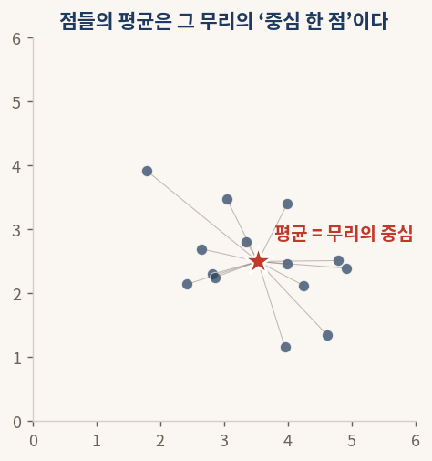

#### § 0.1 결과 해석

점들이 제각기 흩어져 있어도 평균을 내면 무리 한가운데에 별표 하나로 모인다. 어느 한 점이 무리에서 멀리 떨어져 있어도, 중심은 전체를 고르게 반영한 위치에 놓인다. 앞으로 "무리의 중심"이라 하면 언제나 이 평균 점을 가리킨다.

## 0.2 흩어짐은 중심에서 점들이 퍼진 정도다

같은 중심을 가진 두 무리라도 한쪽은 중심 가까이 옹기종기 모여 있고, 다른 쪽은 멀리까지 넓게 퍼져 있을 수 있다. 중심에서 점들이 얼마나 멀리까지 퍼졌는지를 한 수로 나타낸 것이 **흩어짐**이다. 점들이 중심 가까이 모이면 흩어짐이 작고, 멀리까지 번지면 흩어짐이 크다.

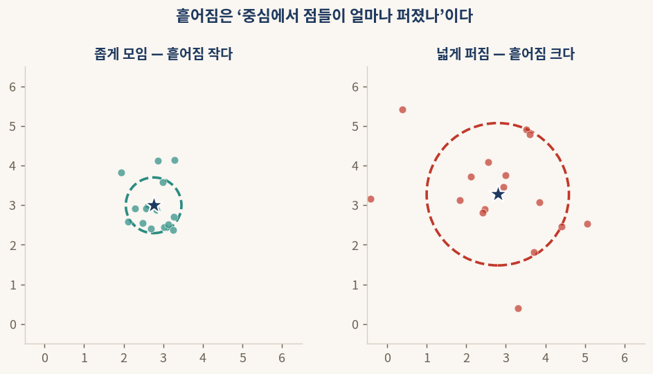

#### § 0.2 결과 해석

왼쪽 무리는 점들이 중심 둘레에 좁게 모여 흩어짐이 작다. 오른쪽 무리는 같은 중심을 가졌지만 점들이 멀리까지 번져 흩어짐이 크다. 흩어짐은 무리가 얼마나 "뭉쳐 있나 흩날리나"를 한 수로 요약한 것이다.

## 0.3 두 무리를 가를 때는 중심 사이 거리와 각자의 퍼짐을 함께 본다

무리가 둘로 나뉘어 있을 때, 두 무리가 "잘 갈렸는가"를 따지려면 두 가지를 함께 봐야 한다. 하나는 두 무리의 **중심이 얼마나 멀리 떨어졌나**이고, 다른 하나는 각 무리가 **자기 중심 둘레에 얼마나 좁게 모였나**이다.

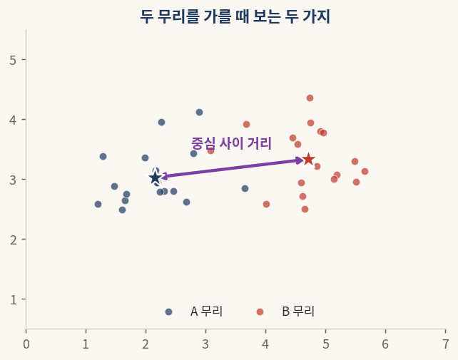

#### § 0.3 결과 해석

두 무리의 중심이 멀리 떨어질수록 잘 갈린 것이다. 그러나 중심이 멀어도 각 무리가 넓게 번져 서로 겹치면 깨끗이 갈렸다고 하기 어렵다. 그래서 "중심 사이 거리는 멀게, 각자의 퍼짐은 좁게"라는 두 조건을 함께 본다. 이 두 가지가 다음에 만날 LDA 의 핵심 잣대가 된다.

---

# 1부 · 라벨이 있을 때 PCA 로는 아쉬운 점

## 1.1 자료에 무리 라벨이 붙어 있을 때

어떤 자료에는 각 점이 어느 무리에 속하는지를 적은 **라벨**이 함께 있다. 학생들의 공부 시간과 출석률을 점으로 찍었는데, 각 점이 "합격"인지 "불합격"인지가 표시돼 있는 경우다. 라벨이 있으면 점을 무리별로 다른 색으로 칠할 수 있다.

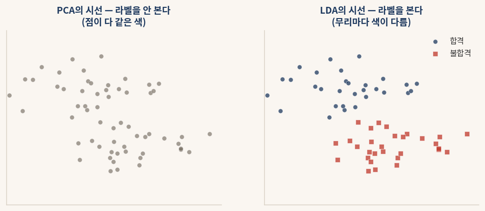

#### § 1.1 결과 해석

왼쪽은 라벨을 무시하고 점을 모두 한 색으로 본 모습이다. **PCA**(주성분분석)가 자료를 보는 방식이 이렇다. PCA 는 라벨을 쓰지 않으므로, 어느 점이 합격이고 불합격인지 구분하지 않는다. 오른쪽은 라벨을 살려 무리마다 색을 달리한 모습이다. **LDA**(선형판별분석)는 이렇게 라벨을 적극 활용한다.

## 1.2 PCA 의 축과 LDA 의 축은 다를 수 있다

PCA 는 라벨을 보지 않고 자료 전체가 가장 넓게 퍼지는 방향을 고른다. 그런데 라벨이 있는 자료에서는, 전체가 가장 넓게 퍼지는 방향과 두 무리가 가장 잘 갈라지는 방향이 서로 다를 수 있다.

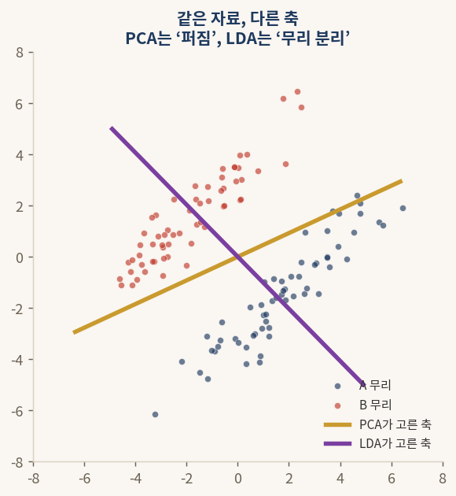

#### § 1.2 결과 해석

금색 선은 PCA 가 고른 축으로, 두 무리를 가로질러 전체가 가장 길게 늘어선 방향이다. 보라 선은 LDA 가 고른 축으로, 두 무리 사이를 가르는 방향이다. PCA 의 금색 축에 점들을 비추면 두 무리가 뒤섞이지만, LDA 의 보라 축에 비추면 두 무리가 깨끗이 갈라진다. 무리를 가르는 것이 목적이라면 라벨을 쓰는 LDA 의 축이 훨씬 쓸모 있다.

운동장의 두 팀에 비유하면 이렇다. 빨간 조끼 팀과 파란 조끼 팀이 섞여 있을 때, **PCA 는 사람들이 가장 넓게 퍼져 보이는 각도**로 사진을 찍고, **LDA 는 두 팀이 가장 깔끔하게 갈라져 보이는 각도**로 사진을 찍는다. 같은 사람들이지만 고르는 각도가 다르다.

---

# 2부 · LDA 의 여섯 단계 한눈에 보기

LDA 는 여섯 개의 작은 단계로 이루어진다. 각 단계가 무엇을 하는지 한 줄씩, 일상의 비유 한 줄씩으로 먼저 훑는다.

| 단계 | 이름 | 한 줄 설명 | 한 줄 비유 |
|---|---|---|---|
| 1 | **무리 중심** | 무리마다 평균을, 그리고 전체 평균을 구한다 | 각 팀의 한가운데와 운동장 전체의 한가운데를 찍는다 |
| 2 | **클래스 내 흩어짐** | 각 무리 안에서 중심까지의 퍼짐을 모은다 | 한 팀이 얼마나 옹기종기 모였나 |
| 3 | **클래스 간 흩어짐** | 무리 중심들이 전체 중심에서 떨어진 정도를 모은다 | 두 팀의 한가운데가 얼마나 멀리 떨어졌나 |
| 4 | **판별 방향** | 간÷내 비율을 가장 크게 하는 방향을 찾는다 | 두 팀이 가장 잘 갈라져 보이는 각도를 찾는다 |
| 5 | **사영** | 각 점을 그 방향 위의 값으로 옮긴다 | 점을 그 각도의 선 위에 비춘다 |
| 6 | **무리 가르기** | 비춘 값으로 무리를 나눈다 | 선 위에서 왼쪽·오른쪽으로 갈린다 |

#### § 2 결과 해석

여섯 단계는 크게 두 묶음으로 읽으면 편하다. 1·2·3단계는 **무리의 모양을 재는 준비**다. 무리마다 중심을 찍고, 각 무리가 얼마나 모였는지(클래스 내)와 무리 중심들이 얼마나 떨어졌는지(클래스 간)를 잰다. 4·5·6단계는 **방향을 골라 비추는 실행**으로, "간은 멀고 내는 좁은" 비율이 가장 큰 방향을 찾아 점들을 그 위에 비추고 무리를 가른다.

PCA 의 일곱 단계와 견주면 자리가 비슷하다. PCA 가 "전체 퍼짐"을 재서 가장 퍼진 방향을 골랐다면, LDA 는 "무리 간 ÷ 무리 내"를 재서 가장 잘 갈리는 방향을 고른다. 무엇을 재느냐만 다를 뿐, 재서 방향을 고르고 비춘다는 큰 흐름은 같다.
---

# 3부 · 여섯 단계를 차례로 풀기

## 3.1 (1단계) 무리 중심과 전체 중심을 구한다

가장 먼저 무리마다 중심을 찍는다. A 무리의 점들로 평균을 내면 A 의 중심이, B 무리의 점들로 평균을 내면 B 의 중심이 나온다. 여기에 더해, 무리를 가리지 않고 모든 점으로 평균을 낸 **전체 중심**도 하나 구한다.

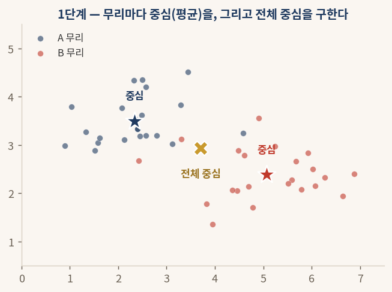

#### § 3.1 결과 해석

별표는 각 무리의 중심이고, 가운데 ✕ 표는 모든 점을 합쳐 구한 전체 중심이다. 전체 중심은 두 무리 중심의 사이 어딘가에 놓인다. 이 세 점, 곧 A 중심·B 중심·전체 중심이 다음 두 단계에서 흩어짐을 재는 기준이 된다.

## 3.2 (2단계) 클래스 내 흩어짐 — 각 무리가 얼마나 모였나

이제 무리 안을 들여다본다. A 무리의 점들이 A 의 중심에서 얼마나 퍼졌는지, B 무리의 점들이 B 의 중심에서 얼마나 퍼졌는지를 재서 모두 더한다. 이것이 **클래스 내 흩어짐**(within-class scatter)이다.

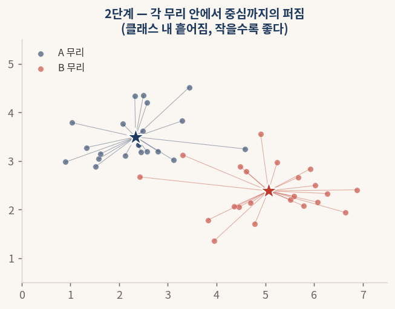

<div class="formula">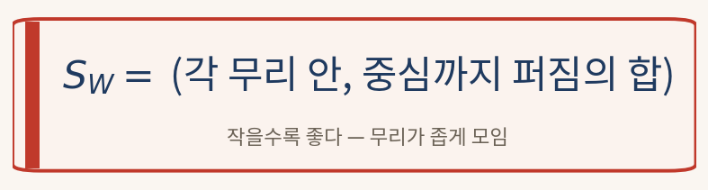</div>

#### § 3.2 결과 해석

각 점에서 자기 무리 중심까지 이은 선들이 모두 짧으면 클래스 내 흩어짐이 작다. 이는 각 무리가 옹기종기 모여 있다는 뜻이다. LDA 는 이 흩어짐이 **작을수록** 좋다고 본다. 무리가 좁게 모여 있어야 다른 무리와 겹치지 않기 때문이다.

## 3.3 (3단계) 클래스 간 흩어짐 — 무리 중심들이 얼마나 떨어졌나

다음으로 무리 사이를 본다. 각 무리의 중심이 전체 중심에서 얼마나 멀리 떨어졌는지를 재서 모은다. 이것이 **클래스 간 흩어짐**(between-class scatter)이다.

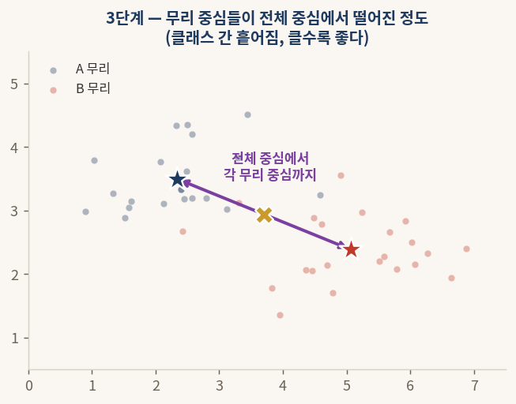

<div class="formula">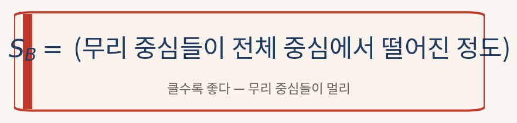</div>

#### § 3.3 결과 해석

전체 중심에서 각 무리 중심으로 그은 보라 화살표가 길수록 클래스 간 흩어짐이 크다. 이는 무리 중심들이 서로 멀리 떨어져 있다는 뜻이다. LDA 는 이 흩어짐이 **클수록** 좋다고 본다. 무리 중심들이 멀리 떨어져야 무리가 잘 갈리기 때문이다.

## 3.4 (4단계) 판별 방향 — 비율을 가장 크게 하는 축

이제 두 흩어짐을 한 비율로 묶는다. **클래스 간 흩어짐을 클래스 내 흩어짐으로 나눈 비율**이다. 이 비율이 클수록 "무리 중심은 멀고, 각 무리는 좁게 모인" 좋은 상태다. LDA 는 이 비율을 가장 크게 만드는 방향을 찾고, 그 방향을 **판별 방향**(LD1)이라 한다.

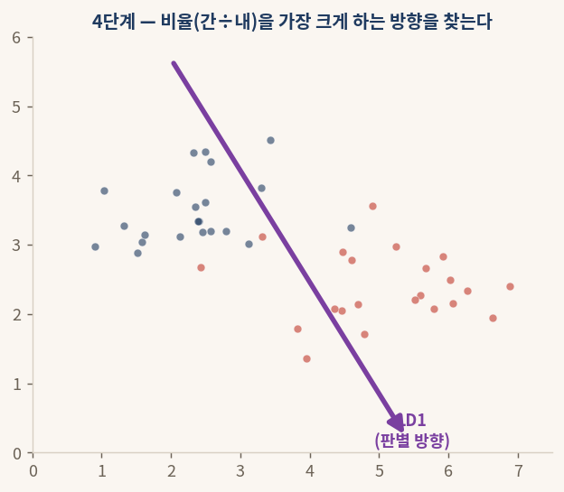

<div class="formula">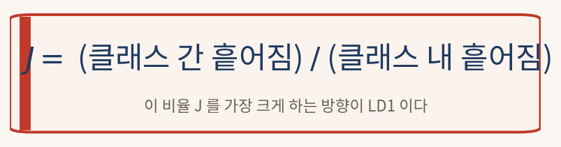</div>

#### § 3.4 결과 해석

보라 화살표가 LDA 가 찾은 판별 방향이다. 이 방향은 두 무리의 중심을 잇는 쪽에 가깝게 놓여, 두 무리를 가르는 데 가장 알맞다. 비율을 가장 크게 하는 방향을 손으로 찾는 일은 까다롭지만, 그 계산은 컴퓨터가 한순간에 해 준다. 우리가 할 일은 "무리가 가장 잘 갈리는 방향을 찾아 줘"라고 부탁하는 것뿐이다.

## 3.5 (5·6단계) 사영과 무리 가르기

방향을 찾았으면, 각 점을 그 방향 위에 비춘다. 점을 한 방향 위의 값으로 옮기는 일을 **사영**이라 하고, 그렇게 얻은 값을 **LD 스코어**라 한다. 비춘 값만 보면 각 점이 선 위 어디에 놓이는지가 한 수로 정해진다.

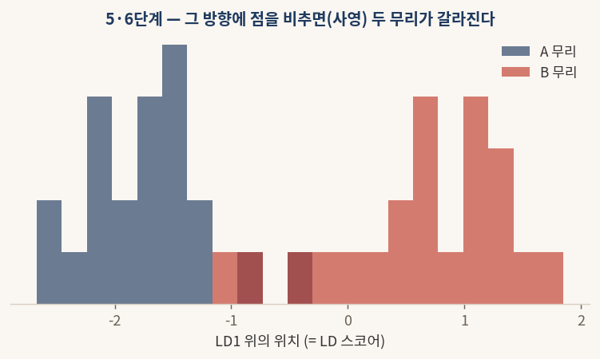

<div class="formula"></div>

#### § 3.5 결과 해석

점들을 판별 방향에 비추면 A 무리는 한쪽으로, B 무리는 다른 쪽으로 몰려 둘이 거의 겹치지 않는다. 이제 선 위에서 어느 지점을 경계로 삼으면 두 무리를 깔끔하게 나눌 수 있다. 2차원이던 자료를 단 한 축으로 줄였는데도, 무리를 가르는 정보는 고스란히 남았다.

---

# 4부 · 새 축의 개수와 PCA 와의 한눈 비교

## 4.1 LDA 가 만들 수 있는 새 축은 클래스 수에서 하나를 뺀 만큼이다

PCA 는 원래 변수의 개수만큼 새 축(주성분)을 만들 수 있었다. 그러나 LDA 가 만들 수 있는 새 축의 개수는 **무리(클래스)의 개수에서 하나를 뺀 값**까지다.


<div class="formula">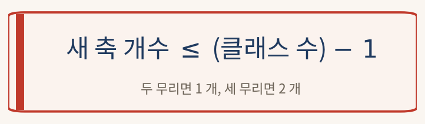</div>

#### § 4.1 결과 해석

두 무리를 가르는 데에는 칸막이 하나, 곧 방향 하나면 충분하다. 그래서 무리가 둘이면 LDA 축은 1 개다. 무리가 셋이면 2 개, 넷이면 3 개다. 변수가 아무리 많아도 이 개수를 넘지 못한다. LDA 의 목적이 자료를 충실히 재현하는 것이 아니라 무리를 가르는 것이므로, 무리를 가르는 데 필요한 만큼의 방향만 만드는 것이다.

## 4.2 PCA 와 LDA 를 한 표로

| 견주는 점 | PCA | LDA |
|---|---|---|
| 라벨 사용 | 쓰지 않는다 (비지도) | 쓴다 (지도) |
| 고르는 기준 | 전체가 가장 넓게 퍼지는 방향 | 무리가 가장 잘 갈라지는 방향 |
| 무엇을 크게 | 전체 퍼짐 | 클래스 간 흩어짐 ÷ 클래스 내 흩어짐 |
| 새 축 최대 개수 | 변수 개수 | 클래스 수 − 1 |
| 라벨 없는 자료 | 쓸 수 있다 | 쓸 수 없다 |
| 주된 쓰임 | 압축·시각화 | 무리 판별·분류 전 차원 축소 |

#### § 4.2 결과 해석

한 문장으로 줄이면, **PCA 는 "자료를 가장 잘 보존하는" 방향을 찾고, LDA 는 "무리를 가장 잘 가르는" 방향을 찾는다.** 라벨이 없거나 자료의 큰 구조를 살피려면 PCA 를, 라벨이 있고 그 무리를 잘 가르는 것이 목적이면 LDA 를 고른다. 두 방법은 경쟁 관계라기보다 목적에 따라 골라 쓰는 도구다.

---

# 5부 · iris 자료로 처음부터 끝까지

## 5.1 자료 가져오기와 LDA 한 줄

붓꽃 자료(150 송이, 4 변수, 3 품종)를 표준화한 뒤 LDA 를 적용한다. PCA 와 달리 LDA 는 품종 라벨 `y` 를 반드시 함께 넣는다.

```python
# iris 에 LDA 적용 — 라벨 y 를 함께 넣는다 (sklearn)
from sklearn.datasets import load_iris
from sklearn.preprocessing import StandardScaler
from sklearn.discriminant_analysis import LinearDiscriminantAnalysis

iris = load_iris()
Z = StandardScaler().fit_transform(iris.data)
y = iris.target                       # 품종 라벨 (LDA 에 꼭 필요)
lds = LinearDiscriminantAnalysis(n_components=2).fit_transform(Z, y)
print(lds.shape)                      # (150, 2)
```

#### § 5.1 결과 해석

코드 한 줄로 150 송이가 새 좌표(LD1, LD2)로 옮겨졌다. PCA 와 거의 같은 모양의 코드지만, `fit_transform(Z, y)` 에 라벨 `y` 가 들어간 점이 결정적으로 다르다. 라벨을 빼면 LDA 는 동작하지 않는다.

## 5.2 LDA 평면에 세 품종 그리기

옮긴 좌표를 LD1·LD2 평면에 찍어 세 품종을 본다.

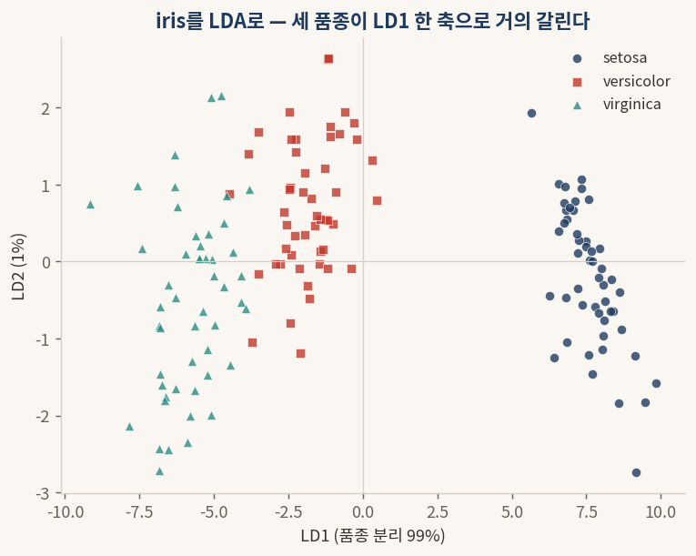

#### § 5.2 결과 해석

세 품종이 뚜렷한 세 덩어리로 갈린다. 특히 가로축 LD1 하나만으로도 품종이 거의 다 나뉜다. LDA 가 라벨을 보고 "품종이 가장 잘 갈리는 방향"을 골랐기 때문이다. 붓꽃은 품종이 셋이므로 LDA 축은 최대 2 개인데(4.1절), 그중 LD1 이 품종 분리의 약 99% 를 담당한다.

## 5.3 PCA 와 LDA 를 한 축으로 견주기

같은 iris 를 PCA 의 한 축(PC1)과 LDA 의 한 축(LD1)으로 각각 압축해, 품종이 얼마나 갈리는지 견준다.

```python
# PCA 한 축 vs LDA 한 축 (sklearn)
from sklearn.decomposition import PCA
pc1 = PCA(n_components=2).fit_transform(Z)[:, 0]            # 라벨 없이
ld1 = LinearDiscriminantAnalysis(n_components=2).fit_transform(Z, y)[:, 0]  # 라벨 함께
print("PCA 첫 꽃 PC1:", pc1[0].round(2))
print("LDA 첫 꽃 LD1:", ld1[0].round(2))
```

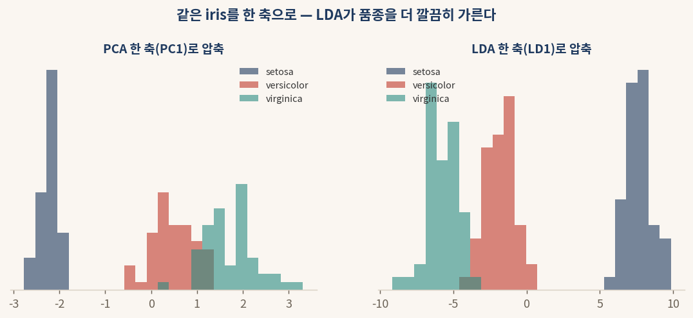

#### § 5.3 결과 해석

PCA 의 한 축(PC1)으로 압축하면 versicolor 와 virginica 가 가운데서 제법 겹친다. PCA 는 라벨을 보지 않고 전체 퍼짐만으로 축을 골랐기 때문이다. LDA 의 한 축(LD1)으로 압축하면 세 품종이 좌·중·우로 거의 겹치지 않고 갈린다. 라벨을 길잡이로 삼아 품종이 갈리는 방향을 곧장 골랐기 때문이다. 무리를 가르는 일이 목적이라면, 같은 한 축이라도 LDA 가 더 깔끔하다.
