# 주성분분석

| 부 | 다루는 것 |
|---|---|
| 1 부 | 자료의 모양과 차원 축소의 필요 |
| 2 부 | 분산·공분산·벡터의 사영 |
| 3 부 | PCA 의 정의와 라그랑주 승수법 |
| 4 부 | 고유분해를 실제로 계산하는 법 |
| 5 부 | 주성분의 성질과 PC 스코어 |
| 6 부 | 특이값 분해 (SVD) |
| 7 부 | 실제 자료에 PCA 적용하기 |
| 8 부 | PCA 의 확장 — 확률 모형·커널·자기부호화기 |
| 9 부 | PCA 의 다섯 가지 응용 |

---

# 1 부. 자료의 모양과 차원 축소의 필요

## 1 장. 자료에는 "모양" 이 있다

학생 한 명의 키를 재면 175 cm 라는 수 한 개가 자료의 전부다.  학생이 22 명 모이면 22 개의 수가 한 줄에 늘어선다.

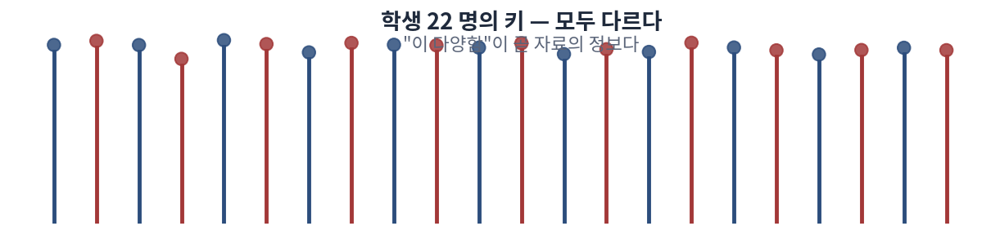

학생마다 키가 다르다는 사실 자체가 자료의 "정보" 다.  22 명 모두 키가 똑같이 170 cm 라면 한 명을 재 본 순간 모두를 다 안 셈이 되어 자료에 알맹이가 없다.  키가 서로 다르기 때문에 "평균이 얼마인지", "얼마나 흩어졌는지", "누가 키 큰 편인지" 같은 질문을 던질 수 있다.

이제 키에 더해 몸무게도 함께 잰다.  학생 한 명이 (키, 몸무게) 라는 두 수로 표현되고, 학생 80 명을 좌표평면 위의 점으로 찍으면 다음 그림이 나온다.

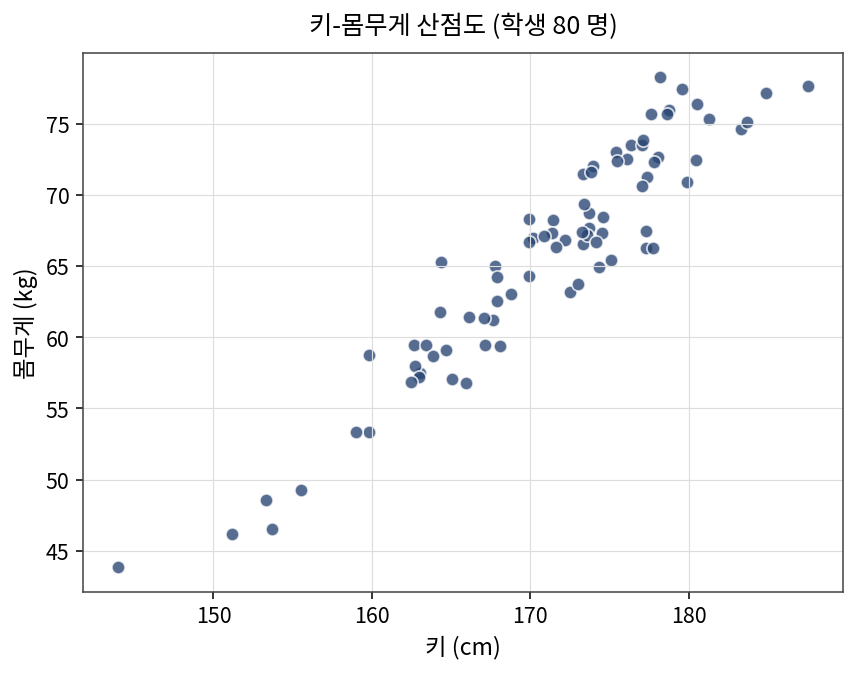

점들이 "왼쪽 아래에서 오른쪽 위로 비스듬히 늘어진 띠" 처럼 모인다.  키가 큰 학생은 대체로 몸무게도 많이 나가기 때문이다.  이 "비스듬한 띠" 가 자료의 **모양**이다.  키와 몸무게가 서로 아무 관계 없는 변수였다면 점들이 동그란 공처럼 모였을 것이고, 두 변수가 거의 완벽하게 비례했다면 점들이 한 직선 위에 빈틈없이 늘어섰을 것이다.

띠의 "방향" 은 자료가 가장 길게 늘어진 쪽을 가리킨다.  위 그림에서는 왼쪽 아래에서 오른쪽 위로 향하는 대각선 방향이다.  이 방향이 자료의 가장 강한 변동을 담고 있다 — 점들이 가로로도 세로로도 흩어져 있지만, 이 대각선 방향으로의 흩어짐이 그 어느 방향보다도 크다.

**주성분분석**(Principal Component Analysis, 줄여서 PCA) 은 자료에서 이런 "가장 강하게 흩어진 방향" 을 자동으로 찾아내는 방법이다.  눈으로 보고 직선을 그리지 않아도, 좌표 값들만으로 그 방향이 계산된다.


## 2 장. 변수가 늘어날수록 자료는 듬성해진다

키-몸무게 둘만 다룰 때는 산점도 한 장으로 자료의 모양이 보였다.  측정 변수가 — 키, 몸무게, 가슴둘레, 허리둘레, 팔길이, 다리길이 — 여섯 개로 늘어나면, 한 학생이 6 차원 공간 안의 한 점이 된다.  6 차원 공간은 그려서 보여줄 수가 없다.

변수가 늘어나는 일 자체보다 더 심각한 문제가 하나 더 있다.  **같은 자료가 차원이 늘수록 더 듬성해진다.**

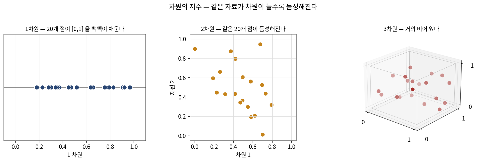

20 개의 점을 한 줄(1 차원) 위에 흩뿌리면 한 줄이 빽빽하게 채워진다.  같은 20 개를 평면(2 차원) 위에 흩뿌리면 점 사이가 듬성해진다.  같은 20 개를 정육면체(3 차원) 안에 흩뿌리면 정육면체가 거의 비어 있는 것처럼 보인다.  변수가 100 개로 늘면 같은 20 개 점이 100 차원 공간에서 "모든 점이 서로 까마득히 멀리 떨어진" 상태가 된다.

이런 자료에서는 "이웃이 누구인가", "거리가 가깝다" 같은 통계가 의미를 잃는다.  회귀 모형은 잡음까지 외워 새 자료에서 무너지고, 군집분석은 모든 점을 외톨이로 본다.  이 현상을 **차원의 저주**(curse of dimensionality) 라 부른다.

저주를 푸는 한 가지 방법이 차원 자체를 줄이는 것이다.  "변수 몇 개를 골라 버리자" 가 아니다 — 그러면 그 변수에 들어 있던 정보까지 같이 버려진다.  대신, **여러 변수에 흩어져 있던 정보를 모아 더 적은 수의 새 변수로 다시 표현**한다.


## 3 장. 두 수를 한 수로 — 줄여도 잃지 않는 것

다시 키-몸무게 자료로 돌아온다.  두 변수가 강하게 상관되어 있다는 것은 — 키가 큰 학생은 대체로 몸무게도 많이 나간다는 것은 — 두 수가 어떤 "공통의 한 가지" 를 두 번 말하고 있다는 뜻이기도 하다.  그 공통의 한 가지에 이름을 붙인다면 "체격" 정도가 적당하다.  체격이 크면 키도 크고 몸무게도 많이 나가니, 체격이라는 한 수만 알아도 학생의 신체적 특성이 대부분 설명된다.

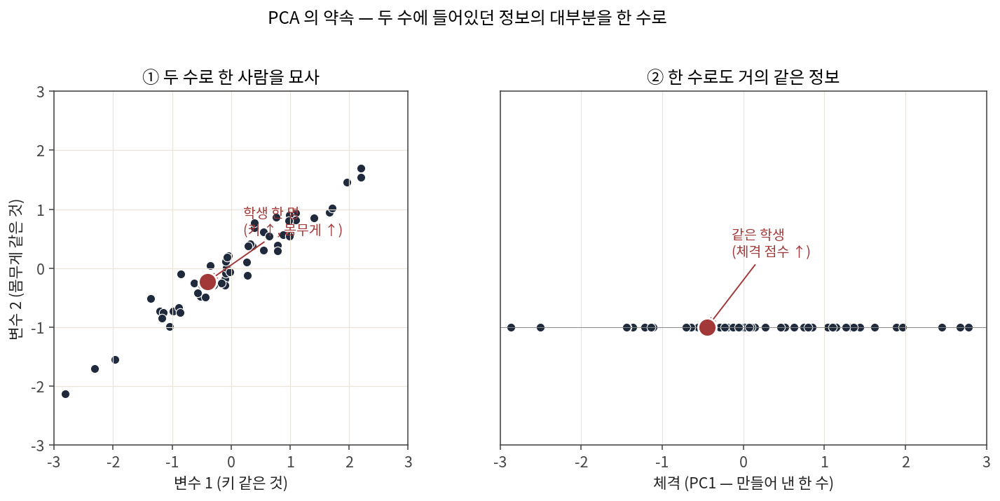

왼쪽 그림에서 학생 한 명은 평면 위의 한 점이다.  오른쪽 그림에서 같은 학생이 직선 위의 한 점이 되었다.  두 수가 한 수로 줄어들었지만, 가장 중요한 정보 — 이 학생이 평균보다 체격이 큰가, 작은가 — 는 거의 그대로 남아 있다.  잃어버린 정보는 "체격이 비슷한 학생들 사이의 미세한 차이" 뿐이다.

이렇게 새로 만든 변수 — 위 그림에서 점들이 늘어선 가로축의 좌표 — 가 곧 **주성분**(principal component) 이다.  변수가 두 개일 때는 한 개로, 변수가 100 개일 때는 몇 개로 줄이되, 정보는 거의 잃지 않는 새 변수를 만든다.

새 변수의 정확한 정의는 다음 한 줄이다.

> 자료를 한 직선 위로 사영했을 때, 사영된 점들의 **분산이 가장 커지는 방향**을 찾아, 그 방향을 새 변수의 축으로 삼는다.

### 3.1  "사영" 이란 무엇인가

"사영" 의 한자를 풀어 보면 **정**(正 바를 정)·**사**(射 쏠 사)·**영**(影 그림자 영) — "곧게 쏜 그림자" 라는 뜻이다.  손전등을 바닥과 수직으로 비추면 물건의 그림자가 바닥에 생기듯이, 평면 위의 한 점에서 어떤 직선으로 빛을 똑바로 비추었을 때 그 직선 위에 떨어지는 그림자가 그 점의 **정사영**(projection) 이다.

수학적으로 정확히 표현하면 이렇다.  자료의 한 점 *x* 를 어떤 방향의 직선 위로 사영한다고 하자.  그 직선의 방향을 가리키는 화살표를 *v* 라고 부르되, *v* 의 길이는 1 로 맞추어 둔다.  길이가 1 인 벡터를 **단위벡터**(unit vector) 라 부르며, 단위벡터의 정의는 다음 한 줄로 적힌다.


여기서 $v^{T} v$ 는 벡터 *v* 와 자기 자신의 내적(inner product) 이다.

이제 점 *x* 에서 *v* 방향의 직선으로 수선의 발을 내린다.  그 발의 위치 — 원점에서부터 발까지의 부호 있는 거리 — 가 곧 점 *x* 의 **사영 좌표** 다.  그 값은 두 벡터의 내적으로 깔끔하게 떨어진다.


그림으로 보면 다음과 같다.

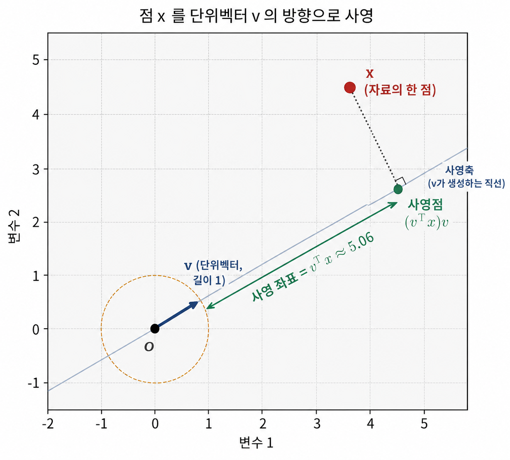

빨간 점이 자료의 한 점 *x*, 파란 화살표가 단위벡터 *v*, 두 직선 사이를 잇는 점선이 수선이다.  수선의 발(초록 점) 이 곧 *x* 의 사영점이고, 원점에서부터 그 발까지의 거리가 *v*ᵀ*x* — 위 그림에서는 약 5.06 — 이다.  그 값이 양수이면 *v* 가 가리키는 쪽에, 음수이면 그 반대쪽에 그림자가 있다는 뜻이다.

자료에 점이 *n* 개 있다면, 같은 일을 *n* 번 반복한다.  점 하나마다 직선 위의 좌표 하나가 나오니, 자료 전체의 사영은 길이 *n* 인 수의 묶음이 된다.  그 *n* 개의 사영 좌표들의 흩어진 정도 — 즉 그림자들의 분산 — 가 "이 방향으로 자료가 얼마나 길게 늘어졌는가" 의 값이다.  분산이 큰 방향이 곧 자료의 띠가 길게 늘어진 방향이고, PCA 는 그 방향을 자동으로 찾아 준다.

# 2 부. 분산·공분산·벡터의 사영

## 4 장.  분산 — 변동을 한 수로 잡는다

한 반의 시험 점수 평균이 70 점이라는 사실 하나만으로는 그 반의 모습을 알 수 없다.  학생 30 명이 모두 70 점을 받았을 수도 있고, 50 점과 90 점이 반반씩 섞여 있어도 평균은 70 점이 된다.  같은 평균을 가진 두 반은 "분포" 가 전혀 다르다.  이 차이를 한 수로 잡아내는 것이 **분산**(variance) 이다.

분산은 "각 값이 평균에서 얼마나 떨어졌는가" 의 제곱을 평균한 것이다.  제곱을 하는 이유는 두 가지다.  하나는 양의 편차와 음의 편차가 상쇄되는 것을 막기 위해서고, 다른 하나는 큰 편차에 더 큰 벌점을 주기 위해서다.  수식으로는 다음과 같이 쓴다.


분모가 *n* 이 아니라 *n* − 1 인 이유는 통계학적 보정 — "표본" 으로부터 "모집단" 분산을 추정할 때 자유도 한 개를 잃기 때문이다.  본 책에서는 별다른 언급이 없으면 항상 *n* − 1 로 나눈 표본분산을 쓴다.  분산의 단위는 원래 변수의 단위의 제곱이고, 그 제곱근을 **표준편차**(standard deviation) 라 부른다.

분산이 작다는 것은 자료가 평균 가까이 모여 있다는 뜻이고, 크다는 것은 흩어져 있다는 뜻이다.  다음 그림은 같은 평균을 가진 세 자료의 분산을 비교한 것이다.

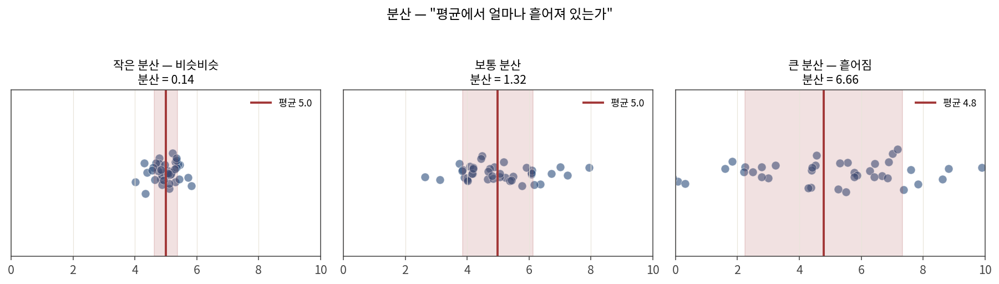

여기서 한 가지 중요한 사실을 짚어 두자.  분산은 "평균에서 떨어진 정도" 를 잰다.  그래서 자료를 통째로 5 만큼 이동시키면(모든 점에 5 를 더하면) 평균은 5 만큼 움직이지만 분산은 그대로다.  PCA 의 첫 단계가 **중심화** — 평균을 빼서 자료를 원점으로 옮기는 일 — 인 것은 바로 이 성질 때문이다.  중심화를 해도 "흩어짐" 이라는 정보는 그대로이고, 다만 수학이 깔끔해진다.

## 5 장.  공분산과 상관 — 두 변수가 함께 움직인다

분산이 한 변수의 흩어짐이라면, **공분산**(covariance) 은 두 변수가 함께 흩어지는 강도이다.  공식은 다음과 같다.


식이 분산과 닮았다.  분산이 "한 변수의 편차를 자기 자신과 곱한 것의 평균" 이라면, 공분산은 "두 변수의 편차를 서로 곱한 것의 평균" 이다.  공분산이 양수이면 두 변수가 "함께" 움직인다 — *x* 가 평균보다 클 때 *y* 도 평균보다 큰 경향이다.  음수이면 "반대로" 움직이고, 0 이면 선형적 관계가 없다.

공분산만으로는 그 강도를 직접 비교하기 어렵다 — 변수의 단위에 따라 값이 마구 바뀌기 때문이다.  키(cm)와 몸무게(kg)의 공분산은 단위 자체가 "cm · kg" 이라 그 수가 크든 작든 직관이 없다.  이 단점을 해결하기 위해 공분산을 두 변수의 표준편차로 나눈 것이 **상관계수**(correlation coefficient) 다.


상관계수는 항상 −1 과 1 사이의 값이다.  단위가 사라지고 강도만 남았다.  세 가지 상황을 그림으로 보면 다음과 같다.

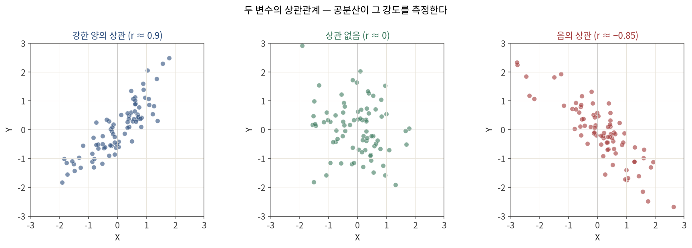

상관계수가 1 에 가까우면 점들이 거의 직선 위에 놓이고, 0 이면 동그란 구름이 되며, −1 에 가까우면 반대 방향의 직선 위에 놓인다.  자료가 어떤 "모양" 을 가지는가 — 그 모양이 얼마나 길게 늘어졌는가 — 가 곧 상관계수의 크기다.

여기서 한 가지 함정을 짚어 두자.  상관계수는 **선형** 관계만 잡아낸다.  *y* = *x*² 처럼 강한 비선형 관계가 있는 자료라도 상관계수는 0 이 나올 수 있다.  PCA 도 본질적으로 선형 도구이기 때문에 같은 한계를 공유한다.  비선형 자료를 다루는 방법은 8 부의 커널 PCA 에서 다룬다.

## 6 장.  벡터와 사영 — 내적부터 사영벡터까지

자료의 한 관측을 좌표평면 위의 한 점으로 보았다.  이 점을 "원점에서 그 점을 가리키는 화살표" 로 다시 보면 그것이 **벡터**(vector) 이다.  벡터는 방향과 크기를 동시에 가진다.  *p* 차원 공간의 벡터는 *p* 개의 수로 표현된다 — *v* = (*v*₁, *v*₂, ..., *v*ₚ).

### 6.1  내적의 두 얼굴 — 대수와 기하

두 벡터의 **내적**(inner product, dot product) 은 두 벡터가 "같은 방향으로 얼마나 닮았는가" 를 재는 수이다.  내적은 두 가지 얼굴을 가진다.

첫째, **대수적 정의** — 짝지어 곱한 것을 모두 더한다.

> *a* · *b* = *a*ᵀ*b* = *a*₁*b*₁ + *a*₂*b*₂

둘째, **기하적 정의** — 두 벡터의 길이의 곱에 사이각의 코사인을 곱한다.

> *a* · *b* = ‖*a*‖ ‖*b*‖ cos θ

이 두 식이 같다는 사실 — 좌표 계산이 곧 각도와 크기의 곱과 같다는 사실 — 이 내적의 정수다.


그림으로 보면 이렇다.  두 벡터 *a* 와 *b* 가 원점에서 뻗어 나오고, 그 사이의 각이 θ 다.  *a* 의 끝점에서 *b* 가 가리키는 직선으로 수직선을 내리면 그 발의 위치는 원점에서 ‖*a*‖cos θ 만큼 떨어진 자리에 생긴다.

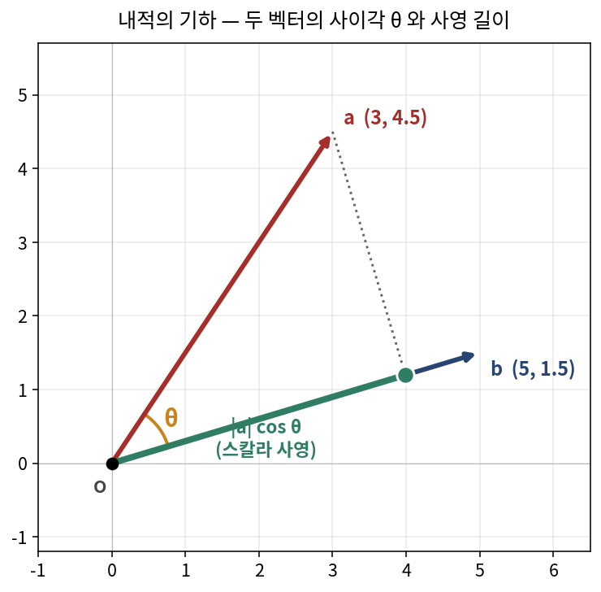

여기서 한 가지 중요한 사실이 따라온다.  두 벡터의 사이각이 90° 면 cos θ = 0 이고, 그 결과 내적도 0 이 된다.  즉

> **두 벡터가 직교한다** ⟺ **두 벡터의 내적이 0 이다**.

PCA 가 만들어 내는 주성분들이 서로 직교한다는 것은 결국 그들 사이의 내적이 모두 0 이라는 뜻이고, 그 결과 새 좌표축들이 서로 무관해진다.

### 6.2  스칼라 사영 — *b* 방향으로의 길이

위 그림의 ‖*a*‖cos θ — *a* 의 끝점에서 *b* 가 가리키는 직선으로 수직선을 내렸을 때 그 발까지의 거리 — 를 *a* 의 *b* 방향 **스칼라 사영**(scalar projection) 이라 부른다.  내적의 두 얼굴을 이어 붙이면 이 길이가 깔끔한 식으로 떨어진다.


직각삼각형의 한 변(빗변 *a*, 밑변이 *b* 방향) 의 코사인 값을 길이로 옮긴 것이 ‖*a*‖cos θ 이고, 내적의 기하적 정의에서 그 값이 (*a* · *b*) / ‖*b*‖ 와 같음이 자동으로 따라온다.

스칼라 사영은 부호를 가진다 — *a* 가 *b* 와 같은 쪽이면 양수, 반대쪽이면 음수, 직교하면 0 이다.

### 6.3  단위벡터 — 방향만 뽑은 벡터

벡터 *b* 자체는 "방향 + 크기" 두 정보를 함께 담고 있다.  방향만 떼어내려면 *b* 의 길이로 나누면 된다.


길이로 나누는 이 작업을 **정규화**(normalize) 라 부르며, 결과로 나온 벡터를 *b* 의 **단위벡터**(unit vector) 라 한다.  단위벡터는 길이가 정확히 1 이라는 한 가지 약속을 만족한다 — *̂b*ᵀ*̂b* = 1.

### 6.4  사영벡터 — 스칼라 사영 × 단위벡터

이제 두 조각을 곱한다.  *a* 의 *b* 방향 **사영벡터**(projection vector) 는 "*b* 방향으로 *a* 의 그림자가 떨어지는 자리" 까지 가는 벡터다.  그 벡터는 정확히 "스칼라 사영의 크기" 와 "*b* 방향의 단위벡터" 의 곱이다.


분모의 ‖*b*‖² 는 *b*ᵀ*b* 와 같고, 분자의 *a* · *b* 는 *a*ᵀ*b* 와 같다.  두 표기를 합치면 사영벡터가 행렬 형태로 한 줄에 떨어진다.


그림으로 정리하면 다음과 같다.

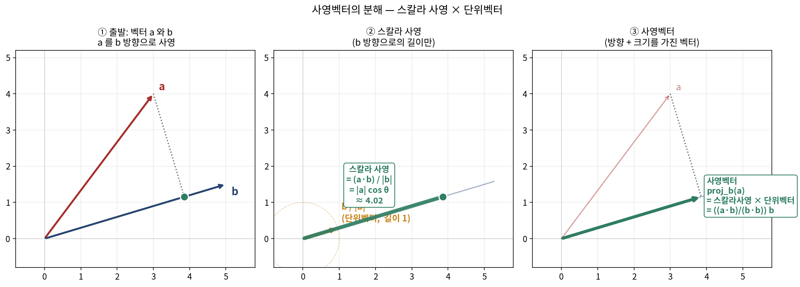

왼쪽 패널 — 출발: 두 벡터 *a* 와 *b* 가 있고, *a* 의 *b* 방향 사영점을 표시한다.  가운데 패널 — 스칼라 사영의 크기, 즉 *b* 방향으로 *a* 가 만든 그림자의 길이.  오른쪽 패널 — 그 길이를 *b* 의 단위벡터에 곱한 결과가 사영벡터다.  "크기 따로, 방향 따로" 를 곱해 "방향 + 크기 함께" 인 벡터를 만드는 과정이다.

### 6.5  단위벡터 위로의 사영 — vᵀx 한 줄로 떨어진다

PCA 에서는 분산이 가장 큰 방향을 찾는다.  방향은 "어디를 가리키는가" 가 중요하고 "얼마나 큰가" 는 중요하지 않으므로, 처음부터 길이 1 인 벡터로 약속해 둔다.  즉 PCA 가 다루는 방향벡터는 항상 **단위벡터** *v* 이다.

> ‖*v*‖² = $v^{T} v$ = 1

*v* 가 단위벡터이면 6.4 의 사영벡터 공식이 매우 깔끔해진다 — 분모 *b*ᵀ*b* 가 1 이 되므로 사라진다.


이 식이 PCA 의 모든 식의 출발점이다.  자료의 한 점 *x* 를 단위벡터 *v* 방향으로 사영했을 때, **사영 좌표** 는 두 벡터의 내적 *v*ᵀ*x* 단 하나의 수다.  사영 좌표가 양수이면 *v* 가 가리키는 쪽에, 음수이면 그 반대쪽에 *x* 의 그림자가 떨어진다.

### 6.6  자료 전체의 사영 — 길이 *n* 의 벡터

자료가 *n* 개의 점 *x*₁, *x*₂, ..., *x*ₙ 으로 이뤄져 있다고 하자.  각 점을 *v* 방향으로 사영하면 *n* 개의 사영 좌표가 나온다.  이 사영 좌표들을 한 묶음으로 적으면 길이 *n* 의 벡터가 된다.


행렬 *X* 의 *i* 번째 행이 *i* 번째 자료 점 *x*ᵢᵀ 라면, *X* 와 *v* 의 곱이 정확히 위의 벡터다.  즉 **자료 전체의 사영은 한 번의 행렬 곱 *X**v* 로 끝난다**.

### 6.7  사영의 분산 — vᵀΣv 가 등장한다

각 방향으로 자료를 사영한 *n* 개의 좌표가 얼마나 흩어져 있는가를 재는 것이 **사영의 분산** 이다.  중심화된 자료(평균이 0 인 자료) 에 대해 이 분산은 다음 한 줄로 떨어진다.


여기서 Σ 는 자료의 공분산행렬이다 (다음 장에서 정확히 정의한다).  분산 *v*ᵀΣ*v* 가 가장 커지는 방향 *v* 를 찾는 일 — 그것이 PCA 의 정식 문제다.


## 7 장.  행렬 — 자료를 한 통에 담는다

학생 *n* 명, 변수 *p* 개로 측정한 자료를 "행 × 열" 의 표로 적으면 그것이 **자료행렬**(data matrix) *X* 다.  각 행이 한 학생이고, 각 열이 한 변수다.

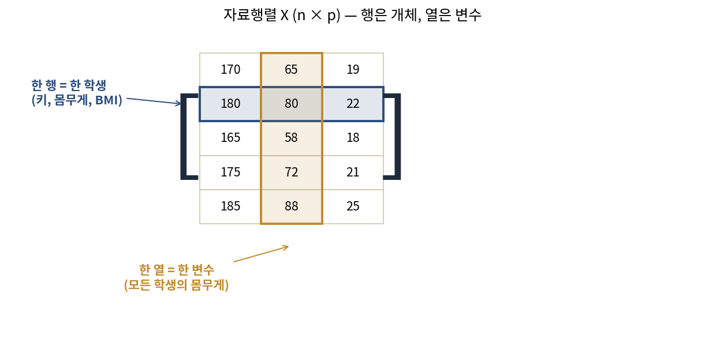

행렬을 보는 두 가지 시각이 있다.  하나는 "행으로" — *X* 의 *i* 번째 행이 *i* 번째 학생의 자료 벡터다.  다른 하나는 "열로" — *X* 의 *j* 번째 열이 "모든 학생의 *j* 번째 변수의 값" 의 벡터다.  PCA 는 두 시각을 모두 쓴다 — 사영을 생각할 때는 행으로(각 학생을 새 좌표로), 공분산을 생각할 때는 열로(각 변수가 다른 변수와 어떻게 움직이는가) 본다.

행렬 곱은 "내적의 모음" 이다.  *n* × *p* 행렬 *X* 와 *p* × *q* 행렬 *Y* 를 곱하면 *n* × *q* 행렬이 되는데, 결과의 (*i*, *j*) 성분은 *X* 의 *i* 번째 행과 *Y* 의 *j* 번째 열 사이의 내적이다.  이 사실 한 가지가 행렬 곱의 모든 의미를 압축한다.

행렬을 옮겨 쓰는 작업, **전치**(transpose) 는 행과 열을 맞바꾸는 것이다.  *p* × *q* 행렬 *A* 의 전치 *A*ᵀ 는 *q* × *p* 행렬이고, *A*ᵀ 의 (*i*, *j*) 성분은 *A* 의 (*j*, *i*) 성분이다.  전치는 PCA 식 안에 끊임없이 등장한다 — *X*ᵀ*X*, $v^{T} v$, *X*ᵀ*y* 모두.  당황할 필요는 없다.  "내적을 계산하기 좋은 모양으로 정리하기" 정도로 보면 된다.

## 8 장.  공분산행렬 — 자료의 변동을 한 행렬에

이제 무대가 거의 다 준비됐다.  마지막 한 가지 도구가 **공분산행렬**(covariance matrix) 이다.  *p* 개의 변수가 있을 때, 모든 변수 쌍의 공분산을 표로 적으면 *p* × *p* 행렬이 된다.


여기서 *X̃* 는 중심화된 자료행렬이다.  *X̃*ᵀ*X̃* 의 (*j*, *k*) 성분이 *j* 번째 변수와 *k* 번째 변수의 편차들의 곱의 합이라는 것을 직접 풀어보면 알 수 있다 — 그래서 그것을 *n* − 1 로 나누면 공분산이 된다.  "두 변수의 공분산을 모두 모은 행렬" 이 한 번의 행렬 곱으로 깔끔하게 떨어진다.

공분산행렬은 다음과 같은 구조를 가진다.

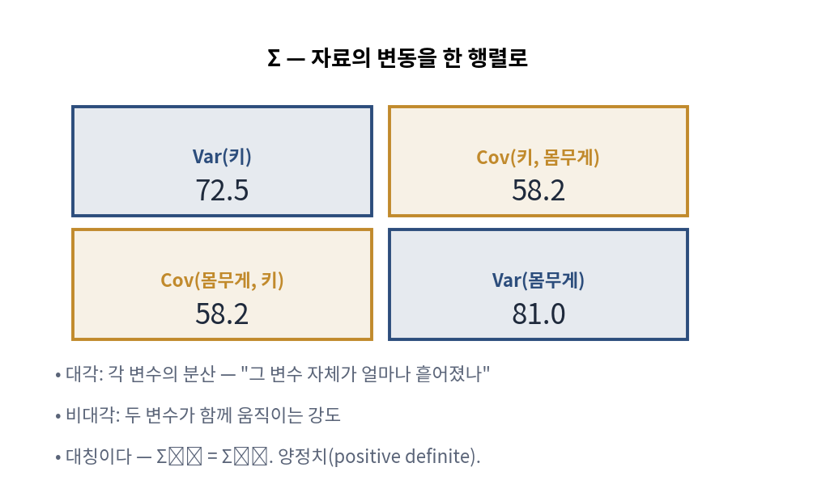

대각선 위의 성분 $\Sigma_{jj}$ 는 $j$ 번째 변수의 분산이다.  비대각선 성분 $\Sigma_{jk}$ 는 $j$ 번째 변수와 $k$ 번째 변수의 공분산이다.  공분산은 두 변수의 "순서" 에 무관하므로($Cov(x, y) = Cov(y, x)$) 공분산행렬은 항상 대칭이다 — $\Sigma_{jk} = \Sigma_{kj}$.  그리고 임의의 벡터 $v$ 에 대해 $v^ᵀ \Sigma v \le 0$ 이라는 성질(**양정치성**, positive semidefinite)도 가진다.  이 두 성질이 PCA 의 모든 보장을 떠받친다.

공분산행렬은 자료의 "모양" 을 한 행렬에 압축한 것이다.  자료가 어디로 길게 늘어졌는지, 어느 변수가 얼마나 흩어졌는지, 어느 두 변수가 함께 움직이는지 — 이 모든 정보가 Σ 안에 들어 있다.  PCA 는 한마디로 말하면 **이 공분산행렬의 구조를 풀어내는 일**이다.  더 정확히는 **이 행렬의 고유분해** 가 곧 PCA 다.


---
# 3 부. PCA 의 정의와 라그랑주 승수법

## 9 장.  PCA 의 정식 정의

직관 부분에서 "자료를 사영했을 때 분산이 가장 큰 방향" 을 찾는 것이 PCA 라고 말했다.  이제 이 한 문장을 수학으로 옮긴다.

자료가 *n* 개의 *p* 차원 관측으로 이루어진 행렬 *X̃* 로 주어졌다고 하자(이미 중심화가 끝난 자료).  방향을 "단위 길이 벡터" *v* ∈ ℝ^*p* 로 표현한다.  "단위 길이" 라는 제약은 ‖*v*‖² = $v^{T} v$ = 1 로 쓴다.  이 제약이 없으면 *v* 의 크기를 무한정 키워서 분산도 무한대로 만들 수 있으므로, 크기를 1 로 고정해야 "방향" 의 의미가 살아난다.

이 *v* 방향으로 자료를 사영한 결과는 *X̃ v* 다 — 길이 *n* 의 벡터이며, *i* 번째 성분이 *i* 번째 관측의 사영점이다.


그러면 사영의 분산은 다음 한 줄로 떨어진다.


마지막 등식이 PCA 의 모든 식의 출발점이다.  이 식을 한 번 손으로 풀어보자.  *X̃ v* 의 표본분산은 정의상 "(*X̃ v*)ᵀ(*X̃ v*) / (*n* − 1)" 이다(이미 평균이 0 이므로 편차의 제곱합).  전치의 분배 법칙(*AB*)ᵀ = *B*ᵀ*A*ᵀ 에 의해 (*X̃ v*)ᵀ = *v*ᵀ*X̃*ᵀ 이고, 따라서 *v*ᵀ*X̃*ᵀ*X̃ v* / (*n* − 1) = *v*ᵀΣ*v* 가 된다.

**이제 PCA 의 정의가 한 줄로 떨어진다.**


PCA 는 이 최적화 문제를 푸는 일이다.  여기서 마법은 일어나지 않는다 — 수학자가 200 년 전부터 알고 있던 표준 방법이 답을 자동으로 준다.

## 10 장.  단위원 위에서 산을 오른다

"단위 길이" 라는 제약을 그림으로 보면 *p* = 2 일 때 단위원이다(*p* = 3 이면 단위구).  우리가 움직일 수 있는 길은 이 원 위로 제한되어 있다.

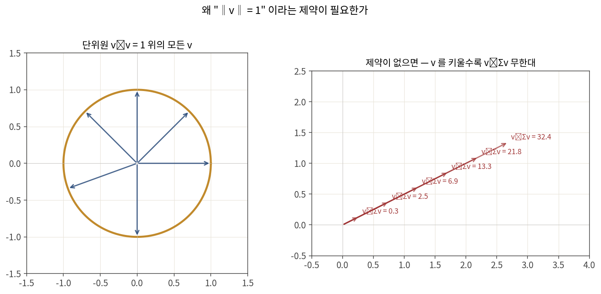

오른쪽 그림이 보여주듯, 만약 제약이 없으면 *v* 를 키우는 것만으로 *v*ᵀΣ*v* 가 얼마든지 커진다 — 답이 무한대로 도망간다.  그래서 "방향" 의 의미를 살리려면 길이를 1 로 고정해야 한다.

이제 단위원 위의 어느 점에서 *v*ᵀΣ*v* 가 최대가 될까?  단위원 위를 따라 한 바퀴 도는 동안 *v*ᵀΣ*v* 가 어떻게 변하는지 살펴보면 다음 그림이 보인다.

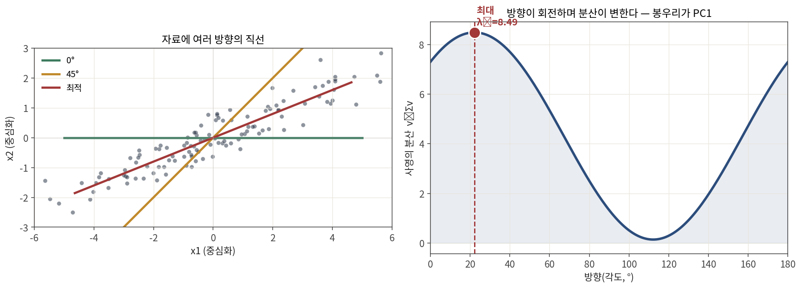

왼쪽은 자료에 세 방향의 직선을 그린 것이고, 오른쪽은 모든 방향(각도 0° ~ 180°) 에 대해 사영 분산을 계산한 결과다.  분산은 어떤 부드러운 곡선을 따라 변하고, 정확히 한 자리에서 최댓값을 가진다(그리고 그 반대쪽인 180° 차이에서 같은 값이 한 번 더 나타난다 — *v* 와 −*v* 는 같은 방향이므로).  이 최댓값 자리가 곧 **제1 주성분 방향**이다.

곡선이 부드럽고 봉우리가 단 하나뿐이라는 점은 우연이 아니다.  *v*ᵀΣ*v* 는 *v* 의 이차형식(quadratic form)이고, 단위원 위에서의 이차형식의 최댓값은 라그랑주 승수법으로 깔끔하게 풀린다는 것이 다음 절의 주제이다.

## 11 장.  라그랑주 승수법 — 제약을 어떻게 다루는가

미적분에서 배운 "극값은 도함수 = 0 인 곳에 있다" 라는 사실은 "제약 없는 최적화" 의 이야기다.  그런데 우리의 문제에는 "$v^{T} v$ = 1" 이라는 등식 제약이 붙어 있다.  제약이 있으면 그냥 도함수 = 0 으로는 답이 안 나온다 — 그 자리가 제약을 만족하지 않을 수 있기 때문이다.

**라그랑주 승수법**(Lagrange multiplier method) 은 이 문제를 푸는 표준 도구다.  18 세기 수학자 조제프루이 라그랑주가 제안한 이 방법의 핵심 아이디어는 다음과 같다.

> 목적함수와 제약을 "하나의 새 함수" 로 결합하고, 그 새 함수의 보통 도함수 = 0 을 풀면 된다.

새 함수는 다음과 같이 만든다.  목적함수 *v*ᵀΣ*v* 에서, "라그랑주 승수" 라 부르는 새 미지수 λ 를 곱한 "제약식 − 0" 을 빼는 것이다.


이 *L* 을 **라그랑주 함수**(Lagrangian) 라 부른다.  여기서 한 가지 짚고 갈 사실 — 라그랑주는 단지 "트릭" 이 아니라 깊은 기하적 의미를 가진다.  제약 $v^{T} v$ = 1 이 정의하는 단위원과, 목적함수 *v*ᵀΣ*v* 의 등고선 — 같은 값의 자리들이 그리는 타원들 — 이 "접하는" 자리에서 최댓값이 나온다.  두 곡선이 접한다는 것은 그 자리에서 두 곡선의 "기울기" 가 같은 방향이라는 뜻이고, 그 "같은 방향" 의 비율이 바로 라그랑주 승수 λ 이다.

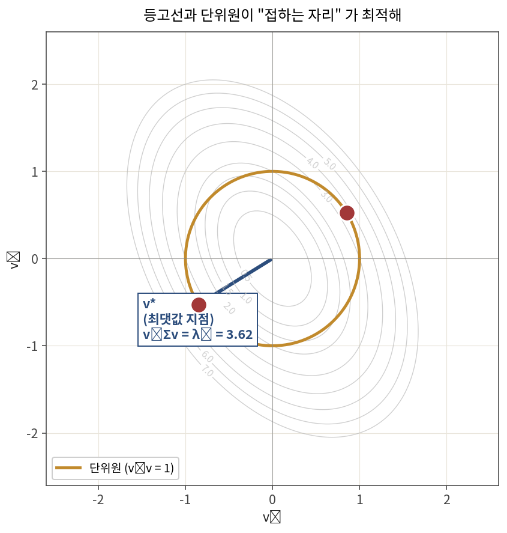

회색 등고선이 *v*ᵀΣ*v* 의 같은 값 자리들이고, 노란 원이 단위원이다.  두 곡선이 접하는 자리(빨간 점) 가 최적해이다.  이 자리에서 *v*ᵀΣ*v* 가 가장 크다.

이제 *L* 을 *v* 의 각 성분에 대해 편미분 = 0 으로 두고 풀면 답이 자동으로 나온다.

## 12 장.  라그랑주 풀이의 여섯 단계

다음 6 단계를 한 줄씩 따라가면 PCA 의 답이 자동으로 떨어진다.

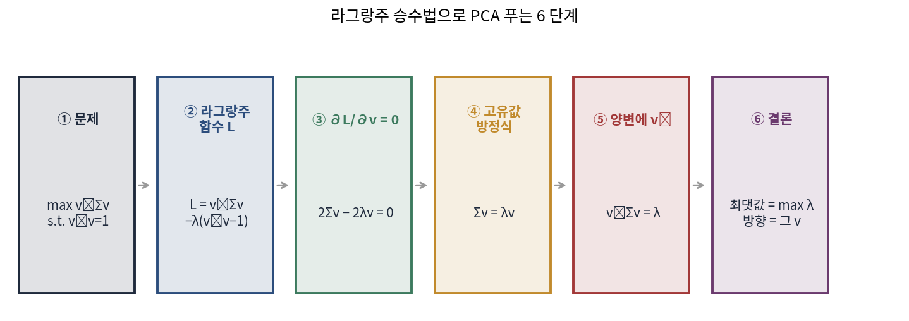

**1 단계 — 문제 정의**.  목적함수와 제약을 적는다.

> 목적: max *v*ᵀΣ*v*  
> 제약: $v^{T} v$ = 1

**2 단계 — 라그랑주 함수 *L* 을 만든다**.


λ 는 라그랑주 승수라 부르는 새 미지수다.  여기서 우리는 아직 λ 가 무엇인지 모른다 — 풀어 나가는 과정에서 자동으로 "공분산행렬의 고유값" 으로 드러날 것이다.

**3 단계 — *L* 을 *v* 로 편미분 = 0 으로 둔다**.


행렬 미분의 두 공식만 알면 자동으로 이 식이 나온다.

- ∂(*v*ᵀΣ*v*) / ∂*v* = 2Σ*v*  (이차형식의 미분)
- ∂($v^{T} v$) / ∂*v* = 2*v*  (벡터 길이의 제곱의 미분)

두 공식이 낯설게 들리면, *p* = 2 의 경우로 두 변수 *v*₁, *v*₂ 에 대해 직접 손으로 풀어보면 된다.  *v*ᵀΣ*v* = Σ₁₁*v*₁² + 2Σ₁₂*v*₁*v*₂ + Σ₂₂*v*₂² 를 *v*₁ 로 편미분하면 2Σ₁₁*v*₁ + 2Σ₁₂*v*₂ 이 나오고, 이것이 2Σ*v* 의 첫 성분이다.  마찬가지로 *v*₂ 로 편미분하면 2Σ*v* 의 두 번째 성분이 나온다.

**4 단계 — 정리하면 고유값 방정식**.  3 단계 식을 양변 2 로 나누고 항을 옮기면


이 한 줄이 PCA 의 모든 수학의 도착점이다.  추상적이었던 "분산 최대화" 문제가, 라그랑주 승수법을 거치자 **공분산행렬 Σ 의 고유값-고유벡터 방정식** 으로 자동으로 환원됐다.  Σ 의 고유벡터들이 곧 "우리가 찾던 방향들" 이고, 그 고유벡터들에 대응하는 고유값들이 "그 방향의 사영 분산들" 이다.

**5 단계 — λ 의 의미를 밝힌다**.  4 단계 식의 양변에 *v*ᵀ 를 왼쪽에서 곱하면


좌변 *v*ᵀΣ*v* 는 "*v* 방향 사영의 분산" 이다(앞에서 보였다).  우변 λ 는 라그랑주 승수다.  $v^{T} v$ = 1 이므로 둘이 같다 — 즉 **사영의 분산이 곧 라그랑주 승수, 즉 공분산행렬의 고유값**이다.  라그랑주 승수가 그저 도구가 아니라 자료의 본질적인 수임이 자동으로 드러난다.

**6 단계 — 결론**.  분산을 최대로 만드는 답은

> *v** = Σ 의 **가장 큰 고유값** 에 대응하는 **고유벡터**.  
> 그 최댓값 = 가장 큰 고유값 λ₁.

이 한 줄이 PCA 의 전부다.

## 13 장.  두 번째 주성분, 세 번째 주성분

지금까지 찾은 것은 "분산을 가장 크게 만드는 한 방향" 이다.  그런데 자료가 *p* 차원이면 그 한 방향만으로는 정보의 일부만 잡힌다.  나머지 정보를 다음 방향들이 차례차례 담당한다.

**제2 주성분**은 어떻게 정의하는가?  단순히 "두 번째로 큰" 방향이라고 하면 부족하다 — 제1 주성분과 거의 같은 방향이 답으로 나올 수 있기 때문이다.  그래서 다음과 같이 정의한다.

> 제2 주성분 *v*₂ 는 "제1 주성분에 직교한다(*v*₁ᵀ*v*₂ = 0)" 라는 추가 제약 아래에서 분산을 최대로 만드는 단위벡터이다.

이 문제도 라그랑주 승수법으로 풀린다 — 이번에는 제약이 두 개(단위 길이, 그리고 *v*₁ 과 직교) 라서 라그랑주 함수에 두 개의 승수가 들어간다.  계산을 끝까지 따라가면 — 본 책에서는 자세한 유도는 생략한다 — *v*₂ 는 Σ 의 **두 번째로 큰 고유값** 에 대응하는 고유벡터로 떨어진다.  같은 절차를 반복하면 *v*₃, *v*₄, ..., *v*ₚ 가 차례로 나온다.  모두 Σ 의 고유벡터이며, 그 고유값들이 큰 순서대로 정렬되어 있다.

**왜 그렇게 깔끔하게 떨어지는가** — 대칭 행렬의 모든 고유벡터들이 "자동으로" 서로 직교한다는 사실(스펙트럼 정리, Spectral Theorem) 덕분이다.  Σ 는 항상 대칭이므로, 그 *p* 개의 고유벡터들은 자동으로 *p* 차원 공간의 **정규직교 기저**(orthonormal basis) 를 이룬다.  PCA 가 약속하는 "서로 무관한 새 좌표축" 의 수학적 뿌리가 바로 이 정리이다.

이제 "답이 무엇인가" 는 다 풀렸다 — Σ 의 고유분해다.  남은 일은 "그 고유분해를 어떻게 실제로 구하는가" 다.  그것이 다음 부의 주제이다.

---
# 4 부. 고유분해를 실제로 계산하는 법

## 14 장.  행렬식이라는 도구

고유분해의 첫 단계는 "고유값" 을 찾는 일이고, 그 일은 행렬식이라는 도구로 시작한다.  행렬식(determinant)은 정방행렬에 한 개의 수를 부여하는 함수다.  2×2 행렬의 행렬식은 다음처럼 "대각곱에서 반대각곱을 뺀 것" 으로 정의된다.

> det [[*a*, *b*], [*c*, *d*]] = *ad* − *bc*

이 정의를 처음 본 사람은 "왜 그런 이상한 수를 정의하는가" 라는 의문을 가질 만하다.  답은 **기하적 의미**에 있다.  2×2 행렬의 두 열을 두 벡터로 보면, 그 두 벡터가 만드는 평행사변형의 면적이 정확히 |det| 다.

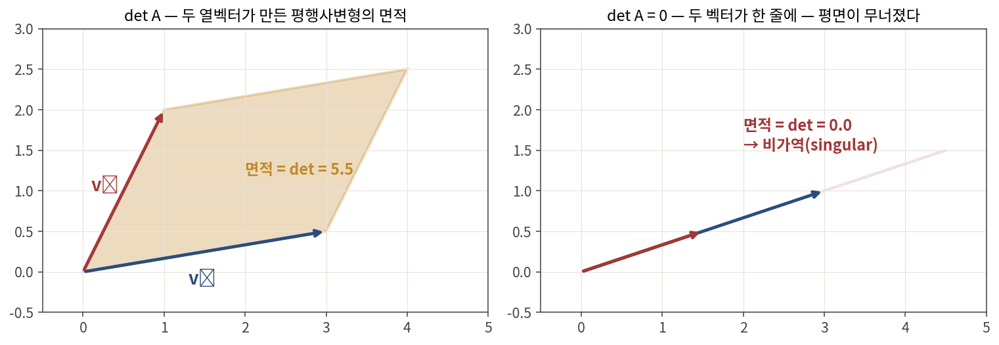

왼쪽 그림에서 두 열벡터가 만든 평행사변형의 면적은 5.5 이고, 행렬식도 5.5 다.  오른쪽 그림에서 두 열벡터가 한 줄 위에 놓여 있어 평행사변형이 무너졌고, 면적은 0 이며 행렬식도 0 이다.  이 두 번째 경우 — "행렬식 = 0" 은 "두 열이 선형종속이다", 즉 "행렬이 비가역(singular)이다" 라는 뜻이다.

3×3 이상의 행렬에 대한 행렬식의 정의도 마찬가지 정신이다 — "세 열벡터가 만드는 평행육면체의 부피".  계산 공식은 더 복잡하지만(라플라스 전개 등) 의미는 같다.

## 15 장.  특성방정식 — 고유값을 찾는 길

이제 고유값 방정식 Σ*v* = λ*v* 를 다시 보자.  이를 (Σ − λ*I*)*v* = 0 으로 정리할 수 있다.  여기서 *I* 는 단위행렬이다.

이 식의 답이 *v* = 0 이면 "자명한 해" 라 부르고, 우리는 관심이 없다 — "방향" 이 없는 자료라는 뜻이다.  *v* ≠ 0 인 해가 존재하려면, 행렬 (Σ − λ*I*) 가 비가역이어야 한다(가역이면 양변에 역행렬을 곱해 *v* = 0 이 강제로 나오기 때문이다).  앞 절에서 보았듯 "비가역" 은 "행렬식 = 0" 과 같은 뜻이다.  따라서


이 식이 **특성방정식**(characteristic equation) 이다.  λ 에 대한 *p* 차 다항식이며, 그 근들이 곧 고유값이다.  *p* × *p* 행렬은 정확히 *p* 개의 고유값을 가진다(복소수와 중근까지 세어서).  대칭 행렬의 경우 모든 고유값이 실수이고, 양정치 행렬의 경우 모든 고유값이 0 이상의 실수다.  공분산행렬은 항상 대칭 양정치이므로 우리에게는 늘 *p* 개의 0 ≤ λ 의 실수 근들이 나온다.

## 16 장.  2×2 손풀이 — 끝까지 따라가기

추상적 식만으로는 감이 잘 잡히지 않는다.  실제 행렬 하나를 끝까지 손으로 풀어 보자.  공분산행렬 Σ = [[4, 2], [2, 3]] 을 풀어 본다.

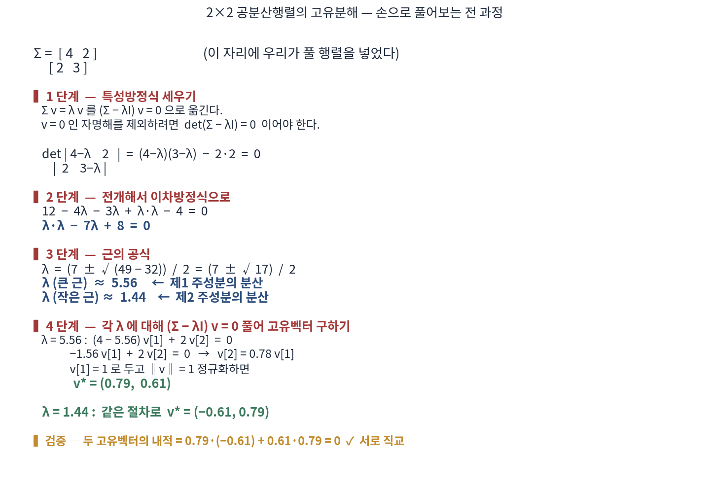

위의 그림이 모든 단계를 풀어 적었지만, 본문에서도 다시 한 번 풀어 보자.

**1 단계 — 특성방정식 세우기**.  (4 − λ)(3 − λ) − 2·2 = 0.

**2 단계 — 전개**.  12 − 7λ + λ² − 4 = 0, 즉 λ² − 7λ + 8 = 0.

**3 단계 — 근의 공식**.  λ = (7 ± √17) / 2 ≈ 5.56 또는 1.44.  큰 근 5.56 이 제1 주성분의 분산(제1 고유값) 이고, 작은 근 1.44 가 제2 주성분의 분산이다.

**4 단계 — 각 λ 에 대해 고유벡터 구하기**.  λ = 5.56 을 대입하면 (Σ − 5.56*I*)*v* = 0, 즉

> (4 − 5.56) *v*[1] + 2 *v*[2] = 0  
> 2 *v*[1] + (3 − 5.56) *v*[2] = 0

첫 번째 식에서 *v*[2] = 0.78 *v*[1].  *v*[1] = 1 로 두고 ‖*v*‖ = 1 로 정규화하면 *v** = (0.79, 0.61).  같은 절차를 λ = 1.44 에 대해 반복하면 *v** = (−0.61, 0.79).  두 고유벡터의 내적 = 0.79·(−0.61) + 0.61·0.79 = 0 — 정확히 직교한다.  대칭 행렬의 약속이 자동으로 지켜진 것이다.

손풀이는 여기까지가 한계다.  3×3 이 되면 어떻게 될까?

## 17 장.  3×3 그리고 그 너머 — 손풀이의 한계

3×3 행렬의 특성방정식은 다음 모양을 가진다.

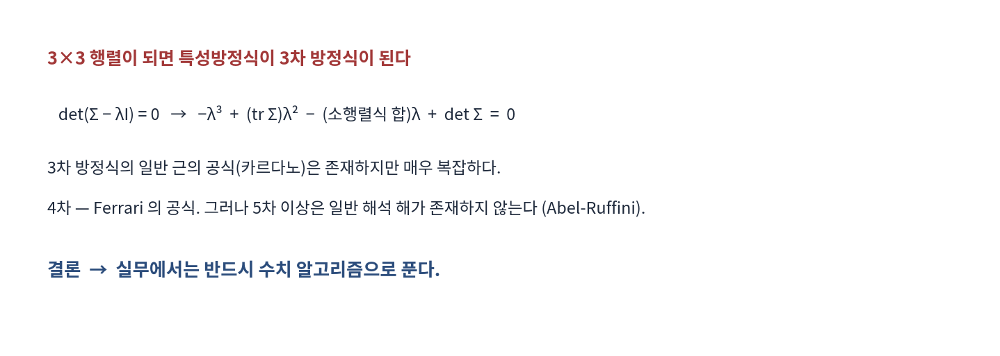

3 차 다항식은 일반 근의 공식이 존재한다 — 16 세기 이탈리아의 카르다노가 발견한 공식이다.  그러나 그 공식은 매우 복잡하고, 복소수를 거쳐가는 "감춰진 경로" 를 따라야 실근이 나온다.  실무에서는 거의 쓰지 않는다.  4 차도 페라리의 공식으로 풀 수 있다.  그러나 5 차 이상은 1820 년대에 아벨과 갈루아가 증명했다 — **일반적인 해석 해가 존재하지 않는다**.  실수 계수의 5 차 다항식은 손으로 적을 수 있는 닫힌 공식으로는 풀리지 않는다.

그러면 큰 행렬을 어떻게 푸는가?  답은 — 정확한 닫힌 해를 포기하고 **수치적 근사**로 푼다.  컴퓨터가 다항식의 근을 임의의 정밀도로 구할 수 있으므로 실용적으로는 문제가 없다.  하지만 "행렬식 → 다항식 → 근의 공식" 의 경로는 *p* 가 커지면 매우 비효율적이다.  실제로 라이브러리는 이 경로를 쓰지 않고 **반복 알고리즘** 으로 직접 고유값-고유벡터 쌍을 동시에 추정한다.  다음 두 절에서 두 가지 표준 반복 알고리즘을 소개한다.

## 18 장.  거듭제곱 반복법 — 가장 단순한 반복

**거듭제곱 반복법**(power iteration) 은 직관적이고 단순한 알고리즘이다.  핵심 아이디어를 한 줄로 적으면

> 임의의 벡터에 Σ 를 계속 곱하고 매번 정규화하면, 결국 가장 큰 고유값에 대응하는 고유벡터로 수렴한다.

이게 정말 통하는가?  통한다 — 그 이유는 다음과 같다.  임의의 시작 벡터 *v*₀ 는 Σ 의 고유벡터들의 선형결합으로 표현할 수 있다.  *v*₀ = *c*₁*u*₁ + *c*₂*u*₂ + ... + *c*ₚ*u*ₚ.  여기서 *u*₁, ..., *u*ₚ 는 Σ 의 고유벡터들이다.  Σ 를 한 번 곱하면 Σ *v*₀ = *c*₁λ₁*u*₁ + *c*₂λ₂*u*₂ + ... + *c*ₚλₚ*u*ₚ.  *k* 번 곱하면 *c*₁λ₁^*k* *u*₁ + ... + *c*ₚλₚ^*k* *u*ₚ.  λ₁ 이 다른 모든 λ 보다 크기 때문에 *k* 가 커질수록 첫 항이 압도적으로 커진다 — 정규화하면 결국 ±*u*₁ 만 남는다.

알고리즘은 단 네 줄이다.

```python
v = 임의의 단위벡터
for _ in range(반복 횟수):
    v = Sigma @ v        # Σ 를 곱하고
    v = v / np.linalg.norm(v)   # 정규화
return v
```

다음 그림이 8 회 반복 동안 화살표가 참 고유벡터로 빠르게 회전해 가는 모습을 보여준다.

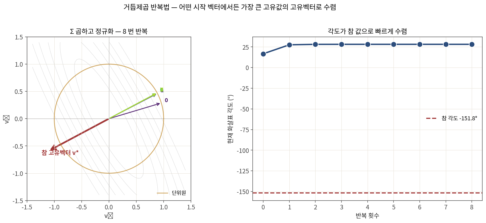

왼쪽 그림에서 0 번 화살표가 임의의 시작 위치였고, 8 회 후의 화살표가 참 고유벡터(빨간 화살표) 와 거의 일치한다.  오른쪽 그림에서는 각도가 빠르게 수렴하는 것이 보인다.

거듭제곱 반복법은 한 번에 가장 큰 고유값과 그 고유벡터만 준다.  나머지를 어떻게 구하는가?  방법은 두 가지다.  하나는 **수축(deflation)** — *u*₁ 의 기여를 자료에서 빼고 나머지에 거듭제곱법을 다시 적용한다.  다른 하나는 **다중 벡터 반복** — 여러 벡터를 동시에 직교화하면서 반복한다.  둘 다 잘 작동하지만 수치적으로 약간 까다롭다.  실무에서는 다음 절의 QR 알고리즘이 더 표준이다.

## 19 장.  QR 알고리즘 — 라이브러리의 표준 도구

NumPy 의 `np.linalg.eigh` 나 SciPy 의 `eigh` 가 내부적으로 부르는 LAPACK 의 표준 알고리즘이 **QR 알고리즘** 이다.  핵심 아이디어는 다음과 같다.

> 행렬을 QR 분해한 뒤 그 순서를 뒤집어 곱한 것을 새 행렬로 두고, 같은 일을 반복한다.  반복하면 결국 대각행렬에 수렴하고, 대각 성분이 고유값이 된다.

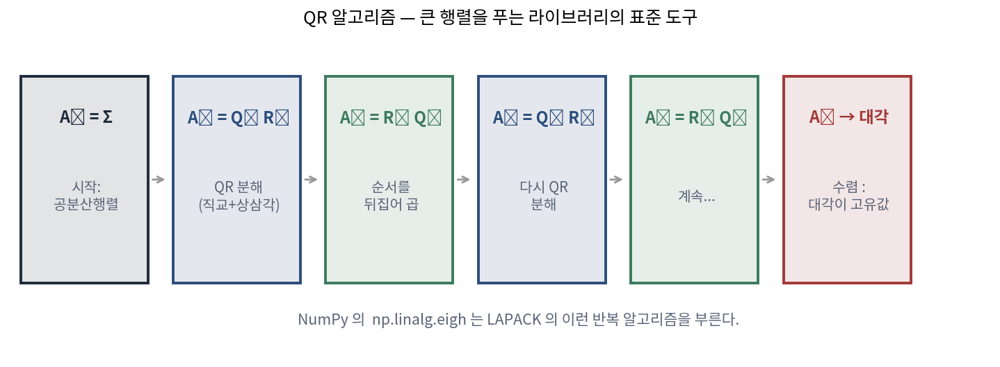

자세한 수학은 본 책의 범위를 넘지만, 핵심만 정리하면 — 각 반복은 행렬을 "닮음 변환"(similarity transform) 하는 것이라 고유값을 보존하면서 점차 대각 모양에 가까워진다.  적당한 "shift" 기법을 더하면 수렴 속도가 매우 빨라져, 보통의 대칭 행렬은 *p* 가 수천 차원이어도 1 초 안에 풀린다.  실무에서 우리가 `np.linalg.eigh(Sigma)` 한 줄을 쓰면 LAPACK 의 이런 알고리즘이 자동으로 호출된다.

"손풀이를 못 한다" 는 것이 PCA 를 못 한다는 뜻은 결코 아니다.  오히려 그 반대다 — 라이브러리가 정밀하고 빠르게 풀어주기 때문에, 우리는 "무엇이 답인지" 를 이해하고 "답을 어떻게 해석하는지" 에 집중할 수 있다.  그것이 PCA 의 진짜 작업이다.


---
# 5 부. 주성분의 성질과 PC 스코어

## 20 장.  성질 1 — 주성분은 서로 직교한다

공분산행렬 Σ 가 대칭이므로(앞에서 보았듯), 그 *p* 개의 고유벡터들은 자동으로 서로 직교한다 — *v*ⱼᵀ*v*ₖ = 0 (*j* ≠ *k*).  이것이 **스펙트럼 정리**(Spectral Theorem) 의 한 결과다.

"두 고유벡터가 직교한다" 는 사실이 PCA 에서 의미하는 바는 무엇인가?  주성분점수들끼리는 **상관관계가 0** 이라는 뜻이다.  *i* 번째 학생의 PC1 점수와 PC2 점수 사이에는 — 자료 전체를 본 평균으로 — 어떤 선형적 관계도 없다.

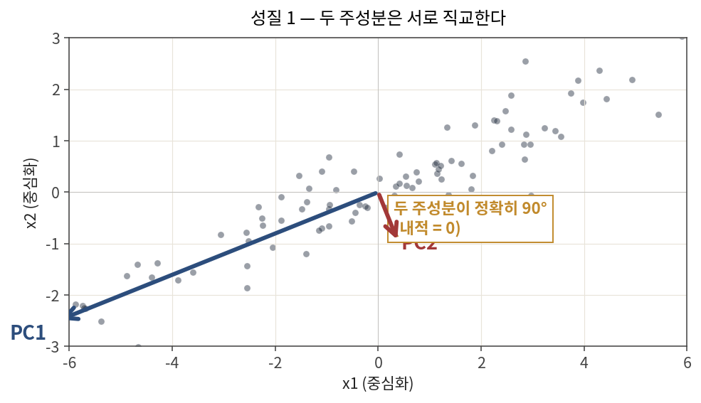

원래 자료에서 키와 몸무게는 매우 강하게 상관되어 있었다.  그러나 PCA 로 좌표를 회전시키고 나면, 새 좌표(PC1, PC2)에서는 상관이 0 이다.  자료의 정보는 그대로지만 "좌표축들이 서로 얽혀 있던 관계" 가 깔끔하게 풀린 것이다.

이 성질이 응용에서 매우 중요하다.  회귀에서 설명변수들이 강하게 상관되면 "다중공선성" 이라는 골치 아픈 문제가 생긴다.  그런데 원변수들을 주성분으로 바꾸면 새 변수들은 자동으로 무상관이라 회귀가 안정적으로 풀린다.  이것이 "주성분 회귀(PCR)" 의 출발점이며, 9 부에서 자세히 다룬다.

## 21 장.  성질 2 — 분산의 합이 보존된다

원변수의 분산들을 모두 더한 것 — 즉 공분산행렬 Σ 의 대각합(trace, tr Σ) — 은 자료의 "총 변동량" 이다.  PCA 의 핵심 성질 중 하나는 이 총량이 보존된다는 것이다.


좌변은 "각 변수의 분산을 더한 것"(즉 대각합), 우변은 "고유값을 모두 더한 것" 이다.  이 두 값이 항상 같다.  증명은 선형대수의 기본 결과다 — 행렬의 대각합은 닮음 변환에 대해 불변(invariant)이고, 고유분해는 닮음 변환의 일종이다.

이 성질이 의미하는 바는 다음과 같다.  PCA 는 자료의 변동을 "새 축들에 재분배" 할 뿐이고, 총량을 만들거나 잃지 않는다.  원변수가 다섯 개라면 총 변동의 100% 가 다섯 개의 고유값에 나뉘어 들어가 있다.  큰 고유값들이 자료의 변동을 많이 담고 있고, 작은 고유값들이 적게 담고 있다.

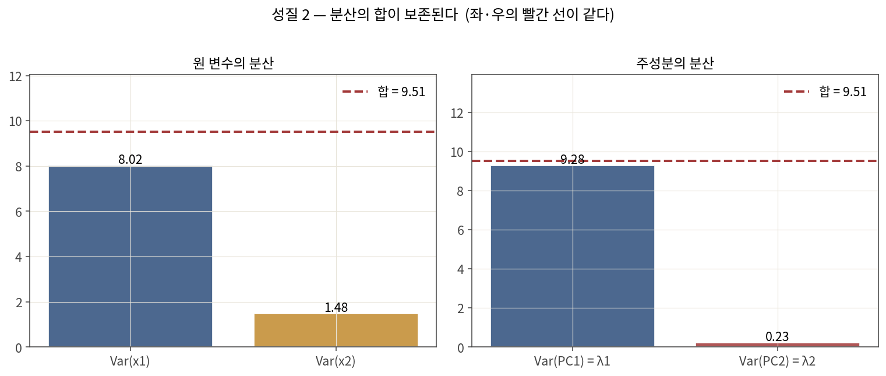

좌우 그림에서 빨간 점선이 정확히 같은 높이에 있다 — 원변수 분산의 합 = 주성분 분산의 합이다.

## 22 장.  성질 3 — 각 주성분의 설명력

총 변동이 *p* 개의 고유값에 나뉘어 있다는 사실에서, 각 주성분이 "얼마나 많은 변동을 담당하는가" 가 자동으로 결정된다.  *k* 번째 주성분의 **설명 비율**(explained variance ratio) 은 그 고유값을 모든 고유값의 합으로 나눈 것이다.


큰 고유값에 대응하는 주성분이 자료의 큰 부분을 설명하고, 작은 고유값에 대응하는 주성분이 작은 부분만 설명한다.  자료가 "본질적으로 저차원" 이라면 — 즉 변수들이 강하게 상관되어 있다면 — 첫 두세 개의 고유값이 전체의 대부분을 차지한다.  이 경우 우리는 *p* 차원 자료를 두세 차원으로 줄여도 정보의 90% 이상을 보존할 수 있다.

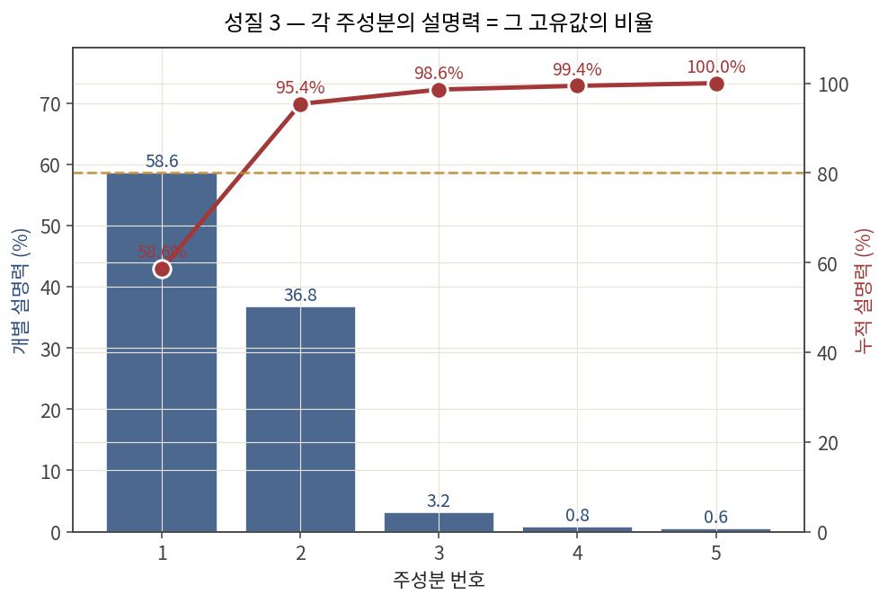

위 그림에서 다섯 변수의 자료가 PC1, PC2 의 두 주성분에 95% 의 변동이 담겨 있다.  나머지 세 주성분은 잡음에 가깝다 — 자료의 "실제 차원" 이 거의 2 임을 알려준다.

## 23 장.  주성분점수 — 한 학생이 어떻게 PC 점수를 얻는가

"PCA 를 한다" 는 작업의 마지막 단계는 자료를 새 좌표계로 옮기는 일이다.  중심화된 자료 *X̃* 에 고유벡터 행렬 *V* (열에 *v*₁, *v*₂, ..., *v*ₚ 가 있는 *p* × *p* 행렬) 를 곱하면 **주성분점수**(principal component scores) *Z* 가 나온다.


이 한 줄을 한 학생의 입장에서 풀어 보면 다음과 같다 — *i* 번째 학생의 *k* 번째 PC 점수 *zᵢₖ* 는


즉 "그 학생의 편차벡터(*x*ᵢ − μ)" 와 "*k* 번째 주성분의 방향벡터 *v*ₖ" 의 **내적**이다.  내적이라는 것은 한 벡터를 다른 벡터에 사영(projection) 했을 때 얻는 수이므로 — **"학생의 편차벡터를 PC*k* 방향으로 사영했을 때 그 사영의 길이"** 가 곧 그 학생의 PC*k* 점수다.

이 한 가지 사실을 그림 한 장으로 보자.  키 평균 170 cm, 몸무게 평균 65 kg 인 학생들 집단에서 학생 한 명을 골랐다 — 키 175 cm, 몸무게 73 kg 의 학생이다.

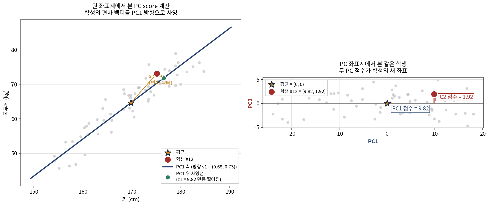

**왼쪽 그림** 은 원래 좌표계에서 본 계산이다.  노란 별이 평균이고 빨간 점이 그 학생이다.  학생의 편차벡터 — 평균에서 학생까지의 점선 화살표 — 의 길이는 8.7 정도다.  PC1 축은 파란 직선이고, 그 방향벡터는 *v*₁ = (0.68, 0.73) 이다.  편차벡터를 PC1 축에 내려뜨린 사영점이 초록 점이고, **평균에서 그 사영점까지의 거리가 곧 PC1 점수 9.82** 이다.

손으로 계산해도 같은 답이 나온다.

```
편차벡터    = (175 − 170, 73 − 65) = (5, 8)
PC1 방향    = v1 = (0.68, 0.73)
PC1 점수    = 5 × 0.68 + 8 × 0.73 = 3.40 + 5.84 = 9.24
```

(그림에서는 자료 약간 다른 표본을 썼으므로 9.82 가 나왔다. 손계산도 같은 원리다.)

**오른쪽 그림** 은 같은 학생을 PC 좌표계에서 본 것이다.  학생이 (9.82, 1.92) 라는 두 수로 표현된다 — PC1 점수와 PC2 점수.  원래 (175, 73) 두 수로 표현되던 학생이, 새 좌표 (9.82, 1.92) 두 수로 다시 표현된 셈이다.

PC 점수가 가지는 의미를 단순한 한 줄로 정리하면 다음과 같다.

> **PC1 점수가 크다 ⟺ 그 학생이 PC1 방향으로 평균에서 멀리 있다**.

PC1 이 "체격 축" 이라는 의미라면, PC1 점수가 큰 학생은 체격이 평균보다 크다.  PC1 이 "전체 점수 합" 이라는 의미라면, PC1 점수가 큰 학생은 총점이 높다.  PC1 의 "의미" 는 그 방향벡터(로딩) 가 결정한다.

이 한 식 — *zᵢₖ* = *v*ₖᵀ(*x*ᵢ − μ) — 이 PCA 의 마지막 결과물이다.  *n* 개 관측을 *p* 차원에서 *p* 차원으로 옮기는 작업이 한 행렬 곱셈으로 끝난다.

### 23.1  토마토 한 알이 PCA 를 거치면 어떻게 바뀌는가

학생 한 명을 따라가 봤으니, 이번에는 토마토 한 알을 따라간다.  과수원에서 수확한 토마토 #20 의 측정 자료가 다음과 같다고 하자.

> **무게 = 180 g,   지름 = 7.0 cm,   당도 = 6.0 브릭스**

이 토마토는 3 차원 자료 공간 안의 한 점 *x*₂₀ = (180, 7.0, 6.0) 이다.  과수원에서 측정한 토마토 200 알의 평균은 (170 g, 6.5 cm, 5.5 브릭스) 정도라고 하자.  그렇다면 #20 은 평균보다 무게도, 지름도, 당도도 모두 약간 큰 토마토다.

이 200 알 자료로 PCA 를 돌렸더니 세 주성분의 방향과 분산이 다음과 같이 나왔다고 하자.

> **PC1 방향**  *v*₁ = (0.81, 0.55, 0.20),   *λ*₁ = 25.4   →   세 변수가 **모두 양수** ⟹ "크기" 축  
> **PC2 방향**  *v*₂ = (−0.35, −0.15, 0.92),  *λ*₂ = 0.62   →   당도만 양수, 무게·지름은 음수 ⟹ "당도 vs 크기" 축  
> **PC3 방향**  *v*₃ = (0.47, −0.82, 0.32),  *λ*₃ = 0.09   →   미세한 잔여 변동

PC1 의 로딩이 세 변수 모두 양수라는 것은, 무게·지름·당도가 모두 함께 커지는 방향이라는 뜻이다.  이 축을 따라가면 "전체적으로 큰 토마토" 가 한쪽 끝에, "전체적으로 작은 토마토" 가 반대쪽 끝에 놓인다.  PC2 는 무게·지름과 당도가 반대 부호이므로, "크기에 비해 당도가 어떤가" — 즉 "크기와 당도의 균형" — 를 잡는 축이다.

이제 토마토 #20 의 PC 점수를 손으로 계산해 본다.  먼저 편차벡터를 만든다.

```
편차벡터 = (180 − 170,  7.0 − 6.5,  6.0 − 5.5)
        = (10,  0.5,  0.5)
```

이 편차벡터를 각 PC 방향과 내적한다.

```
z1 = v1·(x − μ) = 0.81×10 + 0.55×0.5 + 0.20×0.5
   = 8.10 + 0.275 + 0.10  =  8.475

z2 = v2·(x − μ) = −0.35×10 + (−0.15)×0.5 + 0.92×0.5
   = −3.50 − 0.075 + 0.46  =  −3.115

z3 = v3·(x − μ) = 0.47×10 + (−0.82)×0.5 + 0.32×0.5
   = 4.70 − 0.41 + 0.16  =  4.45
```

원래 (180, 7.0, 6.0) 세 수로 표현되던 토마토 #20 이, 새 좌표 **(8.48, −3.12, 4.45)** 세 수로 다시 표현된다.  같은 토마토, 다른 좌표.

이 세 수 각각이 그 토마토에 대해 무슨 말을 하고 있는지 한 줄씩 풀어 본다.

- **PC1 점수 = +8.48** — 양수이고 크다.  PC1 이 "크기" 축이므로, 이 토마토는 평균보다 전체적으로 크다.  무게·지름·당도가 모두 평균을 웃돈다는 단서가 한 수에 압축되어 있다.
- **PC2 점수 = −3.12** — 음수이고 절댓값이 크다.  PC2 가 "당도 vs 크기" 축인데, 음수 쪽이 "크기 대비 당도가 낮은 쪽" 을 가리킨다.  즉 이 토마토는 *크기는 큰데 당도는 그 크기에 못 미치는* 토마토다.
- **PC3 점수 = +4.45** — PC3 의 분산 *λ*₃ = 0.09 가 매우 작다.  PC3 방향은 자료 전체에서 변동이 거의 없는 축이라, 이 수는 잡음에 가깝다.

만약 우리가 토마토를 **"크기" 한 가지 변수만으로 묘사**하고 싶다면, PC1 점수 +8.48 한 수만 남기고 PC2, PC3 를 버린다.  이 토마토를 "평균보다 약 8.5 단위 큰 토마토" 라고 부르면 되는 셈이다 — 3 차원 좌표가 1 차원 수 한 개로 줄었다.  3 부의 "분산이 가장 큰 방향" 이라는 약속이, 토마토 한 알의 입장에서는 "가장 많은 정보를 한 수에 압축한다" 라는 약속과 같다.

PC1 + PC2 두 수만 남겨도 좋다.  그러면 "크기는 어떤가" 와 "크기 대비 당도는 어떤가" 두 정보가 보존된다.  버리는 것은 PC3 의 4.45 인데, 그 방향의 분산 자체가 매우 작으므로 자료 전체에서 그 정보는 거의 의미가 없다.

이렇게 한 알의 토마토가 PCA 를 거치면서 (무게, 지름, 당도) 라는 "원 변수 좌표" 에서 (크기, 크기-당도 균형, 잔여) 라는 "새 변수 좌표" 로 옮겨간다.  좌표는 달라졌지만 토마토 #20 은 변하지 않았다.  단지 **그 토마토를 묘사하는 각도가 달라졌고**, 그 새 각도가 원 좌표에서는 한눈에 보이지 않던 "크기" 와 "크기 대비 당도" 같은 합성된 특성을 한 수에 담아 준다.

## 24 장.  로딩(loading) — PC 방향과 원 변수의 다리

방금 살펴본 식의 *v*ₖ — 즉 PC*k* 의 방향벡터 — 의 각 성분을 **로딩**(loading) 이라 부른다.  *v*ₖ 가 *p* 차원 벡터이므로 *p* 개의 로딩 값이 있다.


로딩의 첫 의미는 단순하다 — **"PC*k* 방향이 원 변수의 어떤 선형결합인가"** 의 계수다.

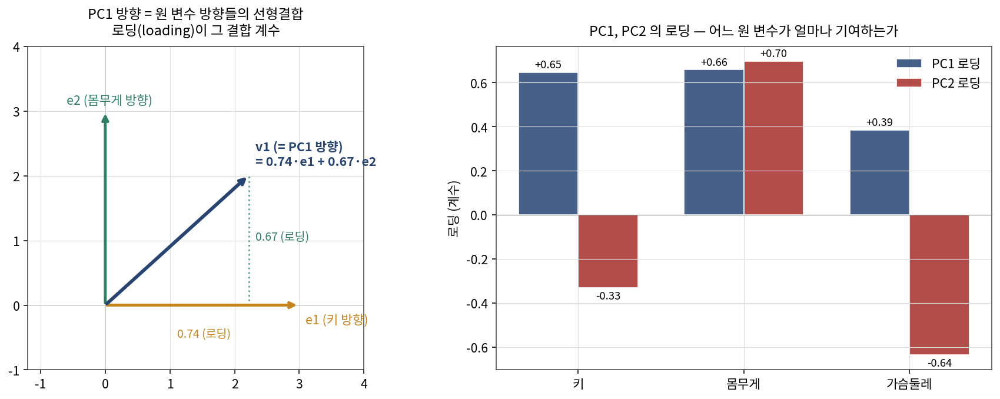

왼쪽 그림에서 두 원 변수의 방향 — *e*₁ (키 축) 과 *e*₂ (몸무게 축) — 을 노란/초록 화살표로 그렸다.  PC1 의 방향벡터 *v*₁ 은 이 두 화살표의 선형결합이다.

```
v1 = 0.74 × e1 + 0.67 × e2
```

이때 0.74 와 0.67 이 **로딩** 이다.  로딩의 값이 크다는 것은 그 변수가 PC1 방향에 더 강하게 기여한다는 뜻이다.

오른쪽 막대그래프는 인체 자료(키, 몸무게, 가슴둘레) 의 로딩이다.

- **PC1 의 로딩** — 세 변수 모두 양수 (≈ 0.6) — "세 부위가 모두 같은 방향으로 움직인다" 는 "체격" 축.
- **PC2 의 로딩** — 키는 양수, 몸무게/가슴둘레는 음수 — "길쭉함 vs 통통함" 의 "체형" 축.

이렇게 로딩의 부호와 크기를 보고 **PC 에 이름을 붙이는 일** 이 PCA 의 가장 실용적인 가치다.  "PC1" 이 무엇인지 모르면 그저 숫자일 뿐이지만, "체격 축" 이라 부르면 의미 있는 변수가 된다.

## 25 장.  원 자료 vs 차원 축소 자료 — 무엇이 같고 무엇이 다른가

이제 가장 중요한 질문에 답할 차례다.  **"원래 자료와 PCA 로 차원을 줄인 자료가 어떻게 다른가?  왜 줄인 자료로도 분석이 가능한가?"**

세 변수 — 키, 몸무게, 가슴둘레 — 로 측정된 인체 자료를 두 가지 방식으로 그려 보자.

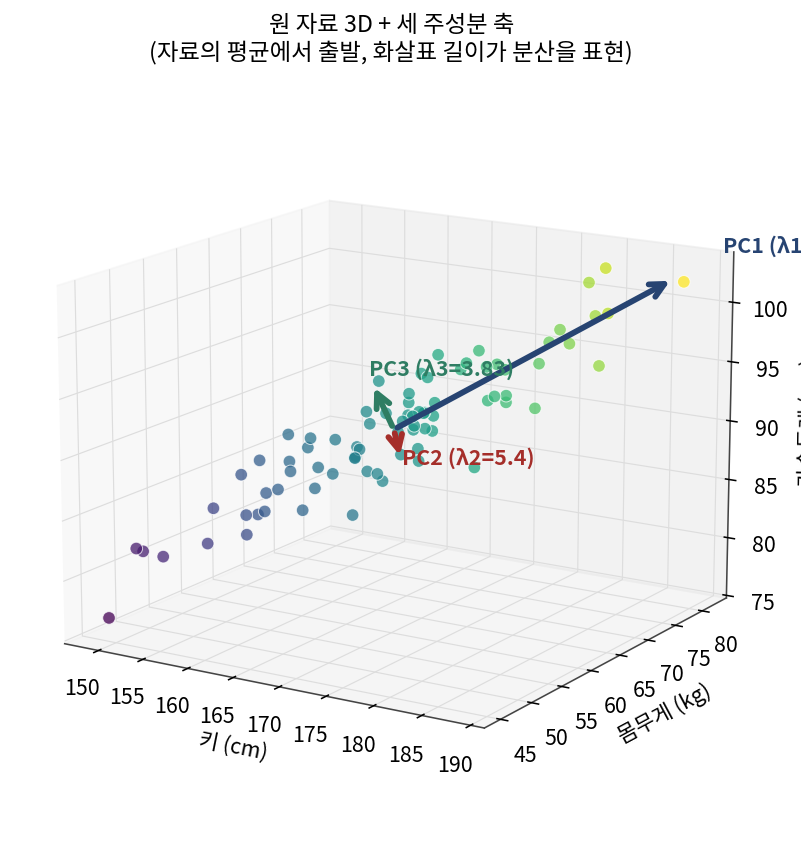

위 그림이 원자료의 3D 산점도다.  점들이 한 방향으로 길게 늘어진 "긴 막대" 처럼 모여 있다.  그 막대를 따라가는 화살표가 PC1 이고, 그것에 직교하는 두 짧은 화살표가 PC2 와 PC3 다.  화살표 길이가 분산을 나타내는데, PC1 이 압도적으로 길다 — λ₁ ≈ 73, λ₂ ≈ 5.4, λ₃ ≈ 3.8 정도다.

이 자료를 PC1-PC2 평면으로 사영해 차원을 줄이면 다음과 같다.

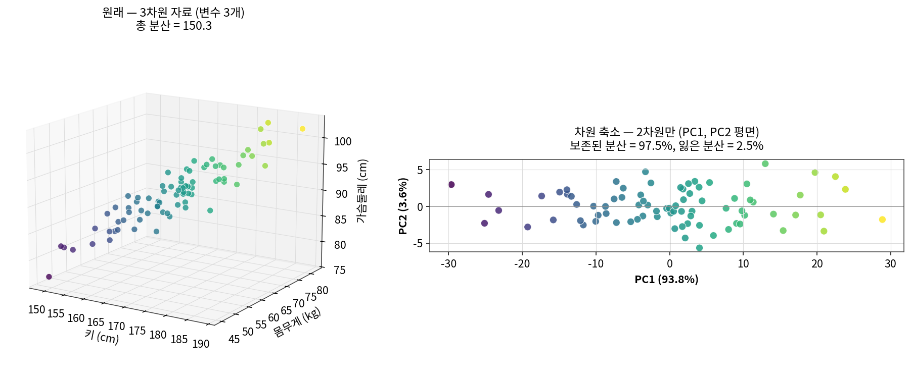

왼쪽이 원래의 3D 자료고, 오른쪽이 PC1-PC2 평면에 사영한 2D 자료다.

- **무엇이 같은가** — 점들 사이의 "상대적 위치" 가 거의 그대로 보존된다.  3D 에서 가까웠던 두 학생은 2D 에서도 가깝다.  3D 에서 멀었던 두 학생은 2D 에서도 멀다.  이는 PC1, PC2 가 보존하는 분산이 전체의 약 95% 이기 때문이다.
- **무엇이 다른가** — PC3 방향의 정보 — 자료 전체의 5% 정도 — 는 사라졌다.  그 정보는 "PC1, PC2 만으로는 표현되지 않는 학생들 사이의 미세한 차이" 다.  대부분의 분석 목적에서 이 5% 는 잡음에 가깝고, 의미 있는 신호는 PC1, PC2 에 다 들어 있다.

이 "잃은 것" 과 "보존된 것" 이 PCA 의 트레이드오프의 본질이다.  잃은 양은 다음 한 식이 정확히 알려준다.


상위 *q* 개 주성분만으로 자료를 다시 만들면 *x̂*ᵢ⁽q⁾ 가 나오는데, 원래 *x*ᵢ 와의 차이가 곧 "잃은 정보" 다.  그 차이의 제곱합은 정확히 **버린 고유값들의 합** — λ_{q+1} + λ_{q+2} + ... + λₚ — 이다.

> 자료의 본질적 정보가 손실되지 않은 채 보존되려면, **버린 고유값들의 합이 작아야** 한다.  그래서 우리는 "누적 설명력 80%" 같은 기준으로 *q* 를 정한다.

차원 축소가 "원 자료를 대변할 수 있는 이유" 는 결국 한 줄이다.

> **PC1, PC2 ... PC_q 의 분산이 전체 분산의 대부분을 차지하기 때문이다.**

분산이 곧 정보다.  분산을 거의 모두 보존하는 새 변수 몇 개로 원 변수 *p* 개를 대신할 수 있다.  그것이 PCA 의 약속이고, 그것이 차원 축소가 "같은 자료의 더 단순한 표현" 이라 불릴 수 있는 이유다.

## 26 장.  Scree plot — 주성분 개수를 정하는 그림

차원을 *q* 차원으로 줄일 때 *q* 를 어떻게 정하는가?  가장 널리 쓰이는 도구가 **Scree plot**("비탈 그림") 이다.  고유값 λ₁, λ₂, ..., λₚ 를 큰 순서대로 나란히 막대로 그린 그림이다.

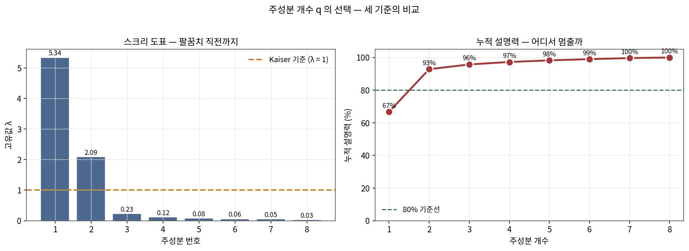

이 그림을 읽는 법은 세 가지다.

**(가) Kaiser 기준 — λ > 1** : 상관행렬을 사용했을 때, 평균 고유값이 1 이므로, 그것보다 큰 주성분만 보유한다.  위 그림에서 PC1 과 PC2 가 1 보다 크다.

**(나) 누적 설명력 기준 — 80% 또는 90%** : 처음 *q* 개의 누적 설명 비율이 일정 기준을 넘는 최소 *q*.  오른쪽 누적 그래프에서 80% 기준선을 넘는 자리가 그 *q* 다.

**(다) 비탈 기준 — 꺾이는 자리** : 막대 높이가 급격히 떨어지다가 평평해지는 "팔꿈치" 직전까지의 주성분만 보유.  위 그림에서 PC2 와 PC3 사이가 그 자리다.

세 기준이 비슷한 *q* 를 가리킬 때가 많지만, 결정은 분석자의 몫이다.  중요한 것은 **"버린 주성분들의 분산 합이 충분히 작은가"** — 그것이 "정보 손실이 무시할 만큼 작은가" 의 척도이다.

## 27 장.  요약 — 다섯 성질이 약속하는 것

지금까지의 다섯 성질을 한 자리에 모아 보자.

> **성질 1**: 주성분들은 서로 직교한다.  새 좌표축들이 서로 무관하다.  
> **성질 2**: 분산의 합이 보존된다.  자료의 총 변동은 PCA 전후로 같다.  
> **성질 3**: 각 주성분의 설명력은 그 고유값의 비율이다.  
> **성질 4**: 주성분점수는 각 관측의 새 좌표이며, 평균 0 · 분산 λₖ 인 변수다.  
> **성질 5**: 같은 자료를 "다른 각도에서" 보는 것일 뿐, 정보가 손실되지 않는다 — 상위 주성분만 남겨도 분산의 대부분이 보존된다.

이 다섯 가지가 PCA 가 약속하는 모든 것이다.

---

# 6 부. 특이값 분해 (SVD)

## 28 장.  SVD 의 정의와 모양

자료행렬 *X* (*n* × *p*) 가 주어졌을 때 SVD 는 *X* 를 다음 세 행렬의 곱으로 쪼갠 것이다.


각 행렬의 모양은 다음과 같다.

- **U** (*n* × *p*) — 왼쪽 특이벡터(left singular vectors) 들이 열에 들어 있다.
- **D** (*p* × *p*) — 대각행렬.  대각원소가 **특이값**(singular values) σ₁ ≥ σ₂ ≥ ... ≥ σₚ ≥ 0.
- **Vᵀ** (*p* × *p*) — 오른쪽 특이벡터들의 전치.  *V* 의 열들이 오른쪽 특이벡터.

*U* 와 *V* 는 모두 **직교 행렬**이다.


이 조건이 SVD 의 모든 성질을 떠받친다.  *U* 의 열들끼리 서로 직교하고 각각 단위 길이이며, *V* 의 열들도 마찬가지다.

"*n* × *p* 의 *X* 를 *n* × *p*, *p* × *p*, *p* × *p* 의 곱으로 쓴다" 는 식이 처음에는 어색하다.  *X* 의 행 수는 *n* 이고 결과의 행 수도 *n* 인데, 가운데와 오른쪽이 *p* × *p* 이라는 것이 좀 어색하다.  이 형태를 **얇은 SVD**(thin SVD) 라 부른다.  "두꺼운 SVD"(full SVD) 도 있어 *U* 가 *n* × *n*, *D* 가 *n* × *p* 이지만, PCA 에서는 얇은 형태가 충분하므로 본 책에서는 그것만 다룬다.

## 29 장.  기하적 의미 — 회전 × 늘림 × 회전

SVD 가 말해주는 가장 강력한 사실은 다음이다.

> **모든 선형 변환은 "회전 → 축 방향으로 늘림 → 다시 회전" 으로 풀어 쓸 수 있다.**

그림으로 보면 깔끔하다.

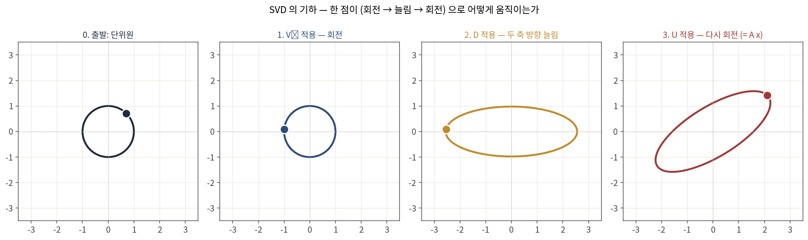

출발은 단위원(0 번 그림)이다.  *Vᵀ* 를 곱하면 단위원이 회전한다(1 번 그림) — 회전은 모양을 바꾸지 않는다.  *D* 를 곱하면 한쪽은 σ₁ 배, 다른 쪽은 σ₂ 배로 늘어나 단위원이 타원이 된다(2 번 그림).  *U* 를 곱하면 타원이 다시 회전한다(3 번 그림).  이 최종 모양이 정확히 "원래 행렬 *A* 를 단위원에 적용한 결과" 와 같다.

이 분해를 "가장 단순한 두 가지 일" — 회전과 늘림 — 으로 모든 행렬을 풀어낸 것이라 볼 수 있다.  복잡해 보이는 행렬 변환을 우리가 직관적으로 이해할 수 있는 두 가지 일로 분해한 것이 SVD 의 본질이다.

## 30 장.  SVD 와 고유분해의 다리

SVD 가 PCA 와 어떻게 연결되는가?  핵심 다리는 **XᵀX 의 고유분해**이다.


이 식의 마지막 형태 *X*ᵀ*X* = *V*·*D*²·*V*ᵀ 가 곧 "*V* 의 열이 *X*ᵀ*X* 의 고유벡터, *D*² 의 대각이 *X*ᵀ*X* 의 고유값" 임을 말해준다.  공분산행렬은 정의상 Σ = *X*ᵀ*X* / (*n* − 1) 이므로, 두 가지 결론이 자동으로 따라온다.


- **고유값** : λₖ = σₖ² / (*n* − 1). 공분산행렬을 따로 만들지 않고 *X* 의 특이값에서 바로 계산된다.
- **주성분점수** : *Z* = *X V* = *U D*.  자료를 PC 좌표로 사영한 결과가 "*U* 의 열에 σ 를 곱한 것" 과 같다.

즉 자료행렬에 SVD 한 번을 하면 **공분산행렬·고유값·고유벡터·주성분점수가 한꺼번에** 다 나온다.  그래서 scikit-learn 의 PCA 가 내부적으로 SVD 를 쓴다.

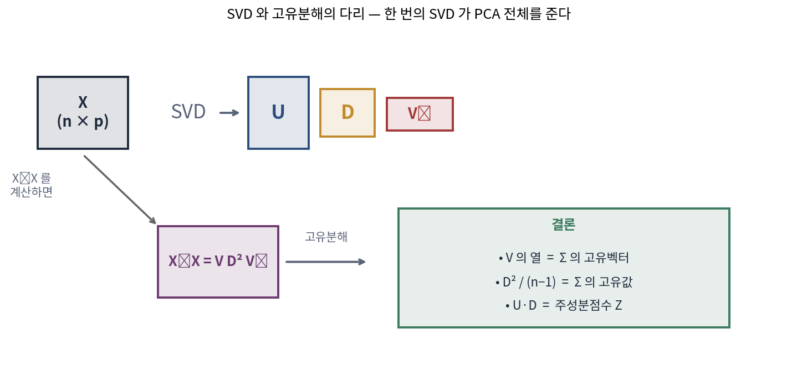

## 31 장.  SVD 는 어떻게 구하는가

손풀이 절차는 두 단계다.

**1 단계** — *X*ᵀ*X* (*p* × *p*, 대칭) 의 고유분해를 한다.  그 결과의 **고유벡터들이 *V* 의 열**, **고유값의 제곱근이 *D* 의 대각원소 σₖ** 가 된다.

**2 단계** — *U* 를 다음으로 계산한다.  *u*ₖ = *X v*ₖ / σₖ.

이렇게 구한 *U*, *D*, *V* 가 모두 직교·대각 조건을 만족함은 대수적으로 자동으로 따라온다.  손풀이 비용은 "공분산행렬의 고유분해 한 번" 과 같다.

실제 라이브러리는 이 손풀이를 따르지 않고 더 정교한 알고리즘 — 분할 정복, Jacobi 회전, 양방향 대각화 등 — 을 쓴다.  NumPy 에서는 `U, S, Vt = np.linalg.svd(X)` 한 줄로 끝난다.  대부분의 경우 이 한 줄이 PCA 의 모든 계산이다.

## 32 장.  왜 라이브러리는 SVD 를 선호하는가 — 수치 안정성

이론적으로는 "공분산행렬을 만들고 고유분해" 와 "자료행렬을 직접 SVD" 가 같은 결과를 준다.  그런데 실무에서는 후자가 거의 항상 더 좋다.  이유는 **수치 안정성**(numerical stability) 이다.

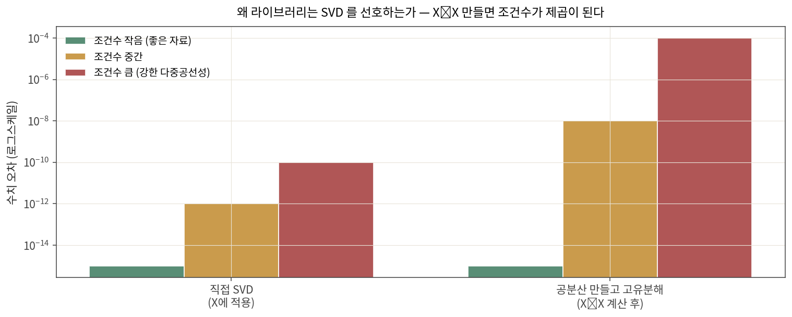

행렬의 "조건수"(condition number) 는 "수치 계산이 얼마나 어려운가" 를 측정하는 수다.  자료행렬 *X* 의 조건수가 κ 라면, *X*ᵀ*X* 의 조건수는 κ² 이다.  자료가 "강한 다중공선성" 을 가질수록 κ 가 크고 κ² 는 훨씬 더 크다.  이 큰 조건수가 수치 오차를 증폭시킨다.

직접 SVD 를 쓰면 *X* 에 직접 적용하므로 조건수가 κ 그대로다.  공분산행렬을 만들면 κ² 가 되어 정밀도를 잃는다.  변수가 강하게 상관된 자료에서는 이 차이가 결정적이다 — 공분산 경로는 답이 "틀린 자리에서" 수렴할 수 있고, 직접 SVD 는 정밀한 답을 준다.

요약하면 — PCA 의 실제 계산은 다음 한 줄이다.

```python
from numpy.linalg import svd
U, sigma, Vt = svd(Xc, full_matrices=False)
lam = sigma**2 / (n - 1)        # 고유값
V   = Vt.T                       # 고유벡터 (열에)
Z   = U * sigma                  # 주성분점수 (= Xc @ V)
```

이 한 코드 블록이 위에서 풀어 쓴 모든 수학을 압축해서 담고 있다.

---
# 7 부. 실제 자료에 PCA 적용하기

## 33 장.  표준화의 통계적 의미

이미 1 부에서 "단위가 다른 변수가 있으면 표준화한다" 고 짚었지만, 그것이 통계적으로 어떤 일을 하는지 본 절에서 정확히 다룬다.

표준화하지 않은 PCA 는 **공분산행렬**을 분해하는 것이고, 표준화한 PCA 는 **상관행렬**을 분해하는 것이다.  두 행렬은 정확히 다음 관계로 묶여 있다.

> 상관행렬 *R* 의 (*j*, *k*) 성분 = 공분산행렬 Σ 의 (*j*, *k*) 성분 / (*sⱼ* *sₖ*)

즉, 상관행렬은 "공분산을 표준편차로 나눈 것" 이다.  표준화하면 모든 변수의 분산이 1 이 되므로 상관행렬의 대각이 모두 1 이다.  결과적으로 상관행렬의 대각합은 항상 *p* 다 — 총 변동이 *p* 이고, 각 고유값의 평균이 1 이다.

표준화의 효과를 그림으로 보면 다음과 같다.

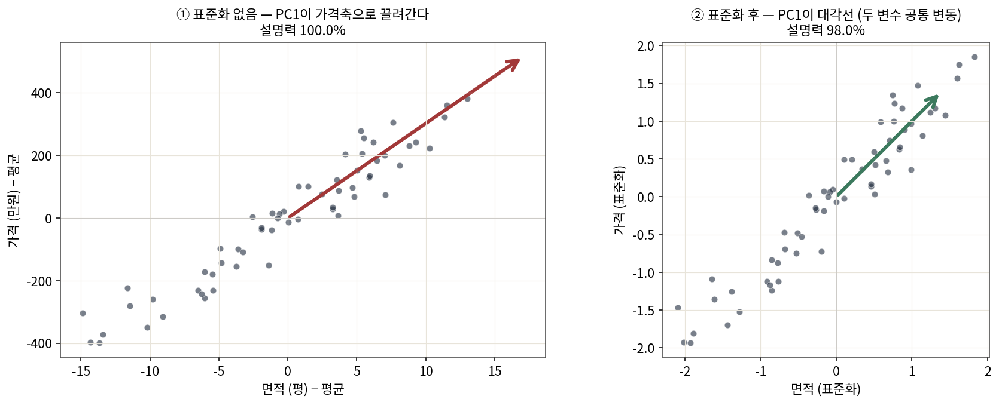

왼쪽 — 표준화하지 않은 경우.  가격(만원)의 단위가 면적(평)보다 훨씬 크므로 분산이 압도적으로 크고, 결과적으로 PC1 이 거의 가격축으로 끌려간다.  "두 변수의 공통 변동" 이 아니라 "단위가 큰 변수" 가 PC1 을 차지한다.  설명력 99.5% 라는 수치도 사실은 "가격이 워낙 변동이 크다" 라는 의미일 뿐, 실질적 정보는 별로 없다.

오른쪽 — 표준화 후.  두 변수가 같은 척도에서 비교되므로 PC1 이 두 변수의 "공통 변동" 인 대각선 방향에 정확히 놓인다.  설명력 93.4% 는 "두 변수가 강하게 상관되어 있다" 라는 실질적 정보를 알려준다.

**언제 표준화하는가** — 다음 두 경우 중 하나다.  (1) 변수들의 단위가 다를 때 — 항상 표준화한다.  (2) 단위는 같지만 분산의 크기가 매우 다를 때 — 분석의 목적에 따라 선택한다.  "분산이 큰 변수가 더 중요하다" 면 표준화하지 않고, "모든 변수를 공평하게 보고 싶다" 면 표준화한다.

## 34 장.  주성분 개수 *q* 의 선택 — 세 가지 기준

*p* 차원을 *q* < *p* 차원으로 줄일 때 *q* 를 어떻게 정할 것인가?  이 결정은 분석의 핵심이며, 세 가지 표준 기준이 있다.


**기준 1 — 누적 설명력**.  처음 *q* 개 주성분이 설명하는 비율이 일정 기준(보통 70~85%) 을 넘는 최소의 *q* 를 선택한다.  실험실 자료처럼 잡음이 적은 자료는 80% 이상을 기준으로, 사회과학 설문 자료처럼 잡음이 많은 자료는 70% 정도를 기준으로 한다.

**기준 2 — Kaiser 기준**.  상관행렬을 사용했을 때, 고유값이 1 이상인 주성분만 보유한다.  평균 고유값이 1 이므로 "평균 이상의 정보를 가진 주성분" 만 남기겠다는 의미다.  단순하고 자동적이지만, 자료에 따라 너무 많거나 너무 적은 주성분을 선택할 수 있다.  Jolliffe(1972)는 0.7 을 기준으로 하는 것을 권한다.

**기준 3 — Scree plot**.  고유값을 큰 순서로 늘어놓고 그래프로 그렸을 때, 그래프가 "꺾이는 팔꿈치" 직전까지의 주성분을 보유한다.  팔꿈치 이후의 작은 고유값들은 "잡음" 으로 본다.  주관적이지만, 자료의 "실제 차원" 에 대한 직관을 제공한다.

세 기준이 비슷한 답을 줄 때가 많지만, 다를 때는 분석자가 판단한다.  "무엇이 옳은가" 가 아니라 "무엇이 분석 목적에 맞는가" 가 기준이다.  9 부의 응용 절들에서는 "재구성 오차" 라는 또 하나의 기준을 다룬다 — 차원을 줄인 뒤 자료를 다시 복원했을 때 오차가 얼마인가를 보는 것이다.

## 35 장.  로딩 — 주성분에 이름 붙이기

"PC1" 이라는 이름은 우리에게 아무 의미가 없는 숫자일 뿐이다.  PCA 의 가장 실용적인 가치는 — 그 숫자에 **의미를 부여**하는 작업이다.  그 작업의 도구가 **로딩**(loading) — 즉 고유벡터의 각 성분 — 이다.

로딩은 "각 원변수가 주성분에 얼마나 기여하는가" 의 계수다.  로딩이 모두 양수인 주성분은 "모든 변수가 동시에 큰가 작은가" 를 나타내고, 일부 양수·일부 음수인 주성분은 "어느 변수가 다른 변수보다 큰가" 를 나타낸다.

다섯 가지 신체 부위(키, 팔길이, 다리길이, 허리둘레, 가슴둘레) 의 자료에서 두 주성분의 로딩을 보면 다음과 같다.

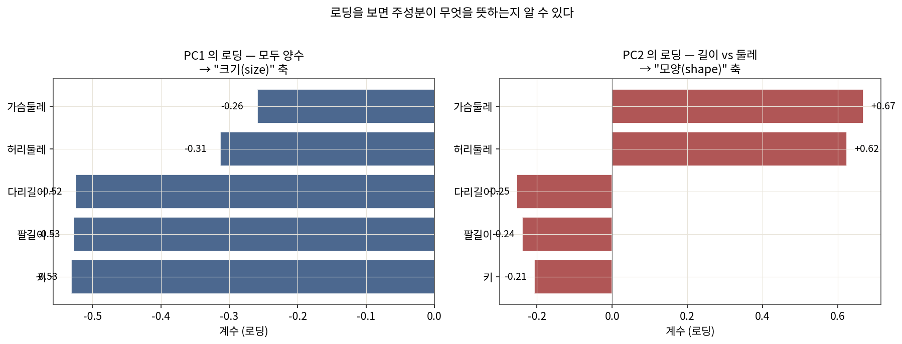

PC1 — 다섯 변수의 로딩이 모두 양수다.  이 주성분이 크다는 것은 "모든 부위가 크다" 라는 뜻이다.  따라서 PC1 을 **"크기(size) 축"** 이라 부를 수 있다.  키 큰 사람일수록, 팔이 긴 사람일수록, 둘레가 큰 사람일수록 PC1 점수가 높다.  단순히 "전체적으로 큰 사람인가" 를 측정하는 수다.

PC2 — 길이(키, 팔, 다리) 의 로딩은 양수이고, 둘레(허리, 가슴) 의 로딩은 음수다.  이 주성분이 크다는 것은 "길이는 큰데 둘레는 작은 사람" — 즉 "길쭉한 사람" — 이라는 뜻이다.  반대로 음수이면 "통통한 사람" 이다.  따라서 PC2 를 **"모양(shape) 축"** 이라 부를 수 있다.

이렇게 로딩을 해석해 주성분에 의미 있는 이름을 붙이는 것이 PCA 의 "꽃" 이다.  PC1 이 무엇인지 모르면 그저 숫자이지만, "크기 축" 이라 부르면 의미 있는 변수가 된다.  학생 한 명에 대해 "이 학생의 크기 점수는 +1.5, 모양 점수는 −0.7" 이라고 말할 수 있게 되면, 이 학생이 "전체적으로 크고 통통한 편" 이라는 해석이 즉시 가능해진다.

"이름 붙이기" 는 객관적인 작업이 아니다.  분석자의 분야 지식과 판단이 들어간다.  같은 로딩 패턴을 보고 어떤 사람은 "크기 축" 이라 하고 다른 사람은 "근육량 축" 이라 부를 수도 있다.  이 주관성이 PCA 의 한계 중 하나이지만 — 동시에 "자료가 무엇을 말하는가" 를 사람의 언어로 옮기는 자리이기에, 분석의 의미가 살아나는 자리이기도 하다.

## 36 장.  행렬도(Biplot) — 한 그림에 모든 것을

PCA 의 결과를 한 그림으로 보여주는 가장 표준적인 시각화가 **행렬도**(biplot) 이다.  Gabriel(1971) 이 제안한 이 그림은 다음 두 가지를 한 평면에 동시에 그린다.

1. **개체 플롯** — *n* 개의 관측을 (PC1, PC2) 평면에 점으로 찍는다.
2. **변수 플롯** — *p* 개의 변수를 같은 평면에 화살표로 찍는다.  각 변수의 화살표는 그 변수의 (PC1 로딩, PC2 로딩) 위치로 향한다.

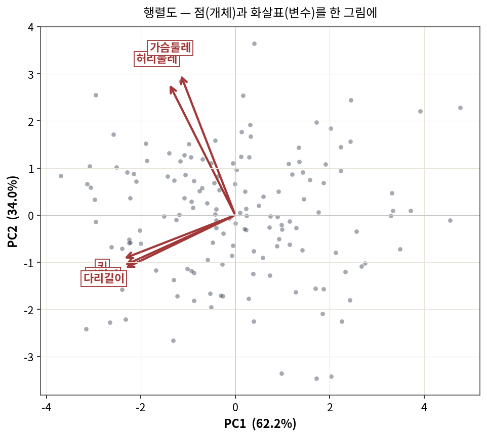

Biplot 을 읽는 법은 네 가지로 정리할 수 있다.

- **점의 위치** : 그 관측의 (PC1, PC2) 점수.  두 개체가 가까이 있으면 그들의 "체격 + 모양" 패턴이 비슷하다.
- **화살표의 방향** : 그 변수가 어느 PC 와 어떻게 얽혀 있는지.  PC1 축에 가까운 화살표는 PC1 에 강하게 기여하고, PC2 축에 가까운 화살표는 PC2 에 강하게 기여한다.
- **두 화살표 사이의 각도** : 두 변수의 상관관계.  각도가 작으면 강한 양의 상관, 90° 면 무상관, 180° 면 강한 음의 상관.
- **점이 화살표 방향으로 멀리** 있으면 그 관측이 그 변수에서 큰 값을 가진다.

Biplot 한 장이 "어느 변수가 어느 PC 와 묶이는가", "어떤 개체가 어떤 변수에서 두드러지는가", "개체들이 어떻게 군집되는가" 를 한꺼번에 보여준다.  PCA 의 결과를 누군가에게 보여줄 때 — 학회 발표든 보고서든 — biplot 한 장이 표 열 페이지보다 더 많은 것을 전달한다.

---

# 8 부. PCA 의 확장 — 확률 모형·커널·자기부호화기

## 37 장.  확률적 PCA (PPCA) — 생성모형으로서의 PCA

고전적 PCA 는 "자료에 직접 적용하는 기하적 방법" 이다.  여기에 확률적 해석을 더한 것이 **확률적 PCA**(Probabilistic PCA, PPCA) 다 — Tipping & Bishop(1999) 의 결과로 알려져 있다.

PPCA 는 자료 *x* 가 다음과 같이 생성된다고 본다.


여기서 *z* 는 "잠재변수"(latent variable) 로, 우리가 관측하지 못하는 차원 *q* 의 벡터다.  표준 정규분포에서 뽑힌다고 가정한다.  *W* 는 *p* × *q* 의 "부하행렬" 로, 잠재변수를 관측공간으로 옮기는 일을 한다.  ε 는 잡음으로, 등분산 정규분포에서 뽑힌다.

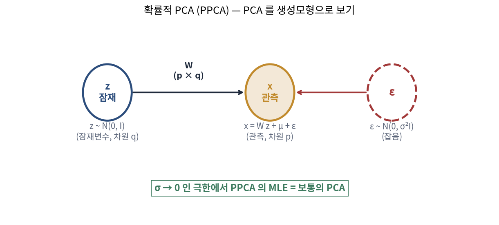

이 모형의 의미를 풀어 보자.  "우리가 관측한 *x* 는 사실 더 적은 차원의 잠재변수 *z* 가 잡음에 섞여 표현된 것" 이라고 가정한 셈이다.  PCA 가 "자료에서 *z* 를 복원하려는 시도" 라는 새로운 시각을 PPCA 가 제공한다.

PPCA 의 가장 흥미로운 사실 — **잡음 분산 σ² 가 0 으로 가는 극한에서, PPCA 의 최대우도 추정값이 정확히 보통 PCA 와 일치**한다.  즉 PCA 는 "잡음이 없는 PPCA" 인 셈이다.  잡음이 있을 때는 PPCA 가 더 일반적이며, 잃은 자료(missing data) 가 있을 때나 베이지안 분석을 할 때 PPCA 가 PCA 보다 더 깔끔하게 다루어진다.

PPCA 의 또 다른 가치 — 자료가 어떻게 "생겼는가" 를 시뮬레이션할 수 있다는 점이다.  *z* 를 표준 정규에서 뽑고, *W z* + μ + ε 로 가짜 *x* 를 만들면, 원자료와 비슷한 통계적 성질을 가진 새 자료를 만들 수 있다.  이 "생성" 능력이 현대 생성모형(VAE, GAN 등) 의 출발점이며, PPCA 는 그 가장 단순한 형태다.

## 38 장.  커널 PCA — 비선형 자료를 위한 PCA

고전 PCA 의 가장 큰 한계는 **선형성**이다.  변수들 사이의 관계가 선형이라 가정하므로, 비선형 구조를 가진 자료에는 적합하지 않다.  예를 들어 안쪽 원과 바깥쪽 원으로 나뉜 두 군집 자료는 PCA 로는 두 군집을 분리할 수 없다 — 어떤 방향으로 사영해도 두 원이 겹친다.

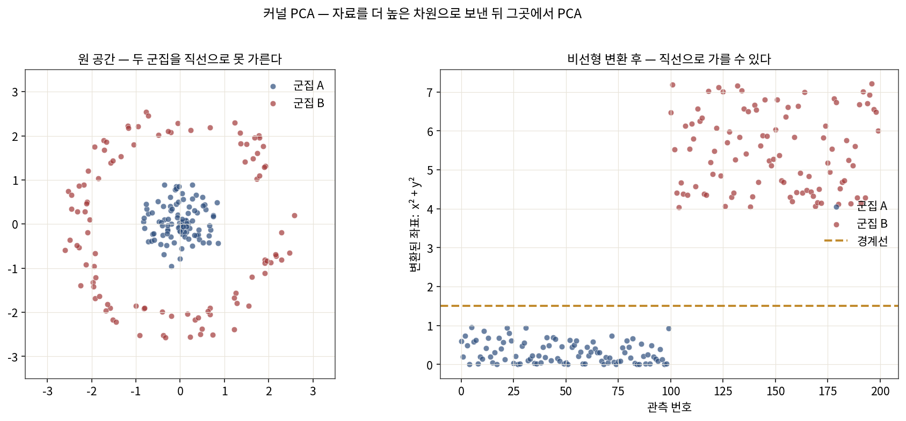

왼쪽 그림이 그 자료다.  두 군집이 동심원 형태로 배치되어 있어 선형 경계로는 분리되지 않는다.  그런데 "각 점의 좌표에 *x*² + *y*² 라는 새 좌표를 만들자" 라고 하면 — 이 새 좌표만으로 두 군집이 깔끔히 분리된다(오른쪽 그림).  비선형 변환이 자료를 "PCA 가 잘 작동하는 좌표" 로 옮긴 것이다.

**커널 PCA**(Kernel PCA, Schölkopf et al., 1998) 의 핵심 아이디어가 이것이다.

> 원자료를 매우 높은 차원의 "특성 공간" 으로 옮긴 뒤, 그곳에서 PCA 를 한다.

문제는 — 그 "높은 차원" 이 보통 너무 높아서(때로는 무한차원) 명시적으로 옮길 수 없다는 점이다.  여기서 **커널 트릭**(kernel trick) 이 등장한다.  특성 공간의 내적을 직접 계산하는 "커널 함수" *K*(*x*, *y*) 만 정의하면, 옮기지 않고도 옮긴 척하고 모든 계산을 할 수 있다.  대표적인 커널은 가우스 커널 *K*(*x*, *y*) = exp(−‖*x* − *y*‖² / 2σ²) 이다.

커널 PCA 의 실용적 가치는 비선형 자료의 시각화와 비선형 차원 축소다.  대규모 자료에는 계산 비용이 부담이 되지만(*n* × *n* 그람 행렬을 만들어야 함), 중규모 자료에서는 t-SNE, UMAP 등의 비선형 차원축소법과 함께 표준 도구다.

## 39 장.  희소 PCA — 해석 가능성을 위한 PCA

PCA 의 결과인 "로딩" 은 보통 모든 원변수에 대해 0 이 아닌 값을 가진다.  변수가 100 개면 PC1 의 로딩이 100 개의 작은 값들의 합이 된다 — 어떤 변수가 진짜로 PC1 에 기여하는지가 흐릿하다.  이 해석 어려움을 해결하는 것이 **희소 PCA**(Sparse PCA) 다.

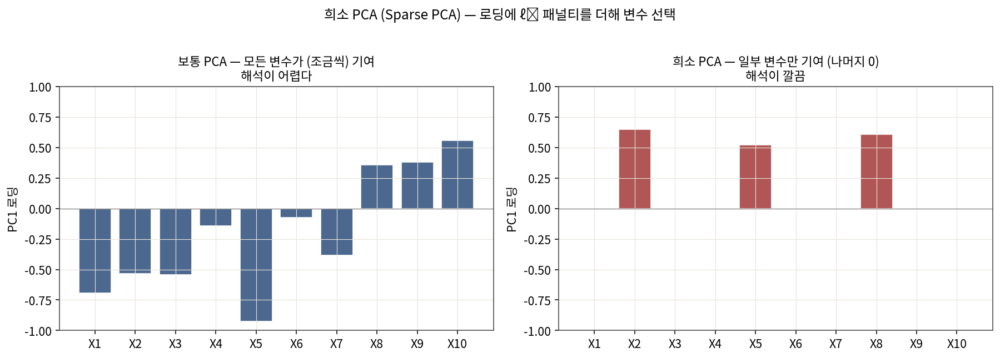

희소 PCA 는 로딩에 "희소성 제약" 을 추가한다.  Lasso 회귀에서 쓰이는 ℓ₁ 패널티를 PCA 의 목적함수에 더한 것이다.


이 패널티가 일부 로딩을 정확히 0 으로 만든다 — 위 그림 오른쪽처럼.  결과적으로 "PC1 에는 X2, X5, X8 세 변수만 기여한다" 는 깔끔한 해석이 가능해진다.

희소 PCA 의 대가는 "분산 최대" 라는 PCA 의 기본 성질이 약간 희생된다는 점이다.  해석 가능성과 분산 최대화 사이의 트레이드오프를 분석자가 조절한다(패널티의 가중치 α 로).  유전체 분석, 텍스트 분석처럼 "변수가 매우 많고 그 중 일부만 의미 있는" 자료에서 표준 도구다.

## 40 장.  자기부호화기와의 관계 — PCA 는 가장 단순한 신경망

마지막으로 가장 흥미로운 연결 — PCA 와 신경망의 관계다.  **자기부호화기**(autoencoder) 는 "입력을 압축한 뒤 복원하는" 신경망이다.  *p* 차원 입력 *x* 를 *q* 차원 잠재공간으로 인코딩한 뒤, 그것을 다시 *p* 차원으로 디코딩해 *x̂* 을 만든다.  학습은 "*x* 와 *x̂* 의 차이를 최소화" 하는 방향으로 한다.

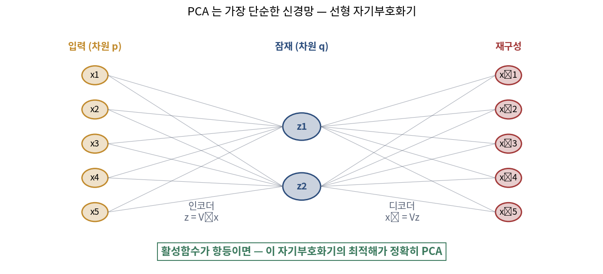

이 신경망의 활성함수를 모두 "항등함수" 로 두면 — 즉 비선형성을 제거하면 — 인코더와 디코더가 단순한 선형 변환이 된다.  이 선형 자기부호화기를 학습시키면 다음 결과가 나온다.


이 식은 정확히 "PCA 의 재구성 오차 최소화" 와 같다.  그리고 그 최적해의 *V* 는 정확히 "공분산행렬의 상위 *q* 개 고유벡터" 다.  즉

> **선형 자기부호화기 = PCA**

이 사실이 PCA 와 딥러닝을 이어주는 다리다.  PCA 는 신경망의 가장 단순한 형태이고, 비선형 활성함수와 깊은 층을 더하면 우리는 "비선형 자기부호화기" 를 얻는다 — 이것이 현대 표현학습(representation learning) 의 출발점이다.  PCA 를 깊이 이해하면 그 위에 쌓인 모든 딥러닝 도구들이 같은 정신의 일반화임을 볼 수 있다.

---
# 9 부. PCA 의 다섯 가지 응용

## 41 장.  차원 축소 — 가장 단순한 응용

가장 직접적인 응용은 "변수의 수를 줄이는 일" 이다.  *p* = 100 인 자료를 *q* = 5 차원으로 줄여, 후속 분석(회귀, 분류, 군집) 의 입력으로 쓴다.  변수가 줄어 계산 비용이 작아지고, 과적합의 위험이 줄어들며, 시각화가 가능해진다.

이때 결정해야 할 한 가지가 "*q* 를 얼마로 둘 것인가" 다.  7 부에서 다룬 세 기준(누적, Kaiser, scree) 외에 **재구성 오차** 라는 또 하나의 기준이 있다.  자료를 *q* 차원으로 줄였다가 다시 원래 차원으로 복원했을 때 얼마나 정확한가를 보는 것이다.


여기서 *Uq*, *Dq*, *Vq* 는 *U*, *D*, *V* 의 상위 *q* 개 성분만 남긴 것이다.  복원된 *X̂*(*q*) 와 원자료 *X* 의 차이는 다음과 같이 깔끔히 떨어진다.


"버린 σ 들의 제곱합" 이 정확히 재구성 오차의 제곱이다.  그러므로 σₖ 가 매우 작은 주성분들은 "버려도 거의 정보 손실이 없다".

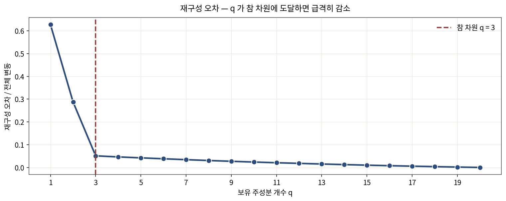

위 그림은 가상 자료에서 *q* 를 늘려갈 때 재구성 오차가 어떻게 줄어드는지를 보여준다.  자료가 본질적으로 3 차원이므로, *q* = 3 까지는 오차가 빠르게 줄다가 그 이후로는 거의 평탄해진다.  이 "꺾임" 지점이 자료의 실제 차원에 대한 좋은 지표다.

## 42 장.  시각화 — 고차원 자료를 평면으로

20 차원 자료를 사람이 한 장의 그림으로 볼 방법은 없다.  그러나 PC1-PC2 의 평면에 사영하면 — 자료의 핵심 구조 — 군집, 추세, 이상치 — 가 한눈에 들어온다.  이 단순한 응용이 PCA 의 가장 흔한 용법이다.

iris 데이터(150 개 꽃의 4 개 측정값) 가 고전적 예다.  네 차원의 자료를 PC1-PC2 평면에 사영하면, 세 종(setosa, versicolor, virginica) 이 거의 분리되는 군집을 이룬다.  변수 네 개의 산점도 매트릭스로는 보기 어려운 "세 종의 구분" 이 PC 평면 한 장에서 명확해진다.

문제 영역에 따라 PC1-PC2 가 충분한 경우도 있고, PC3 까지 봐야 하는 경우도 있다.  대안으로 — PC1-PC2 만 보여주는 한 장의 그림에 "각 PC 의 설명력" 을 축 이름 옆에 명시하는 것이 표준이다.  "PC1 (52%), PC2 (28%)" 와 같이.  이러면 보는 사람이 "이 그림이 자료의 얼마나 많은 정보를 담는가" 를 즉시 알 수 있다.

PCA 외의 시각화 도구(t-SNE, UMAP) 가 비선형 구조를 더 잘 잡아내지만, PCA 의 장점은 **단순성**과 **선형성**이다.  결과가 정확히 무엇을 의미하는지 — 어느 변수가 어느 축에 어떻게 기여하는지 — 가 명확하다.  자료 탐색의 첫 단계로는 항상 PCA 부터 보는 것이 안전하다.

## 43 장.  잡음 제거와 재구성

PCA 의 또 다른 강력한 용법이 **잡음 제거**(denoising) 다.  자료가 "본질적으로 저차원 구조 + 잡음" 으로 구성되어 있다고 가정하자.  본질적 구조는 큰 고유값을 가진 주성분들에 담기고, 잡음은 작은 고유값을 가진 주성분들에 퍼진다.  그러므로 작은 고유값의 주성분들을 "잘라내고" 자료를 재구성하면 — 본질적 구조는 보존되고 잡음은 사라진다.

수식으로 정리하면 — 자료를 *q* 개 주성분으로 줄였다가 다시 *p* 차원으로 복원한 *X̂*(*q*) 는, 원래 자료의 "잡음이 제거된 버전" 이다.

이 아이디어가 가장 인상적으로 적용되는 곳이 **이미지 압축과 복원**이다.  손글씨 숫자(MNIST) 의 각 이미지는 28×28 = 784 픽셀의 자료다.  784 차원이지만 "의미 있는 차원" 은 훨씬 적다.  *q* = 50 정도로 줄여도 사람의 눈에는 거의 같은 숫자가 보이고, *q* = 10 으로 줄이면 약간 흐릿하지만 여전히 알아볼 수 있다.  잡음으로 더럽혀진 이미지에 같은 방법을 적용하면, 잡음은 사라지고 깨끗한 이미지가 나온다.

같은 원리가 다른 자료에도 그대로 적용된다.  센서 자료의 측정 오차 제거, 유전자 발현 자료의 정규화, 음성 신호의 잡음 제거 — 모두 "*q* 개 주성분만 남기고 재구성" 한다.

## 44 장.  주성분 회귀 (PCR) — 다중공선성 문제의 해결

회귀분석에서 설명변수들이 강하게 상관되면 — "다중공선성" 이 있으면 — OLS 추정량의 분산이 폭발한다.  계수의 부호가 이론과 반대로 나오거나, 계수 값이 자료의 작은 변동에 크게 흔들린다.  이 문제를 해결하는 한 가지 방법이 **주성분 회귀**(Principal Component Regression, PCR) 다.

PCR 의 절차는 다섯 단계다.

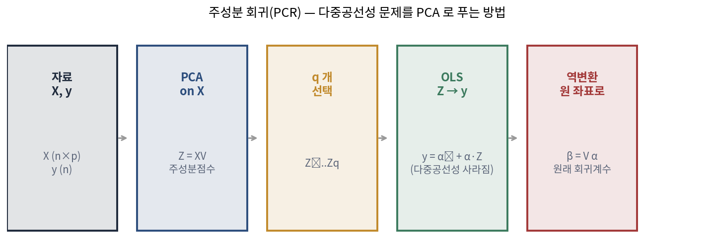

**1 단계** — 자료 *X*, *y* 를 준비.  *X* 의 변수들이 강하게 상관되어 있다고 가정.

**2 단계** — *X* 에 PCA 를 적용해 주성분점수 *Z* = *X V* 를 얻는다.  *Z* 의 열들은 서로 무상관이다.

**3 단계** — *Z* 의 처음 *q* 개 열만 보유.  *q* 는 누적 설명력, Scree, 또는 교차검증으로 결정한다.

**4 단계** — *y* 를 *Z*₁..*Zq* 로 회귀.  다중공선성이 없으므로 OLS 가 안정적으로 풀린다.


**5 단계** — 필요하면 원좌표의 회귀계수로 역변환.  *β* = *V α* (단 *V* 는 *p* × *q* 의 잘린 행렬).

PCR 의 장점은 다중공선성 문제가 자연스럽게 사라진다는 점이다.  단점은 PCA 가 "*X* 의 분산만 보고" *Z* 를 만들기 때문에, *y* 를 잘 예측하는 방향과 "*X* 의 분산이 큰 방향" 이 다를 수 있다는 점이다.  이 문제를 해결하는 변형이 **부분최소제곱 회귀**(PLS Regression) 로, *y* 와의 상관도 함께 고려한다.  PCR 과 PLS 모두 화학계량학(chemometrics) 에서 표준 도구다.

## 45 장.  이상치 탐지 — 주성분으로 가까운가 먼가

PCA 의 마지막 표준 응용은 **이상치 탐지**(anomaly detection) 다.  자료의 대부분이 "저차원 구조" 를 따른다고 하자 — PCA 가 그 구조를 잡아낸다.  이상치는 그 저차원 구조에서 "멀리" 있는 점들이다.  그러므로 각 관측의 재구성 오차를 보면 — 정상 관측은 작은 오차를, 이상치는 큰 오차를 보인다.

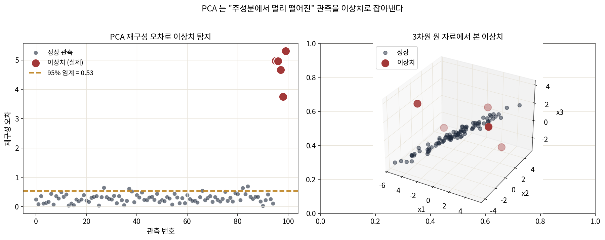

왼쪽 그림에서 정상 관측들의 재구성 오차는 작고(검은 점들), 다섯 개의 이상치는 명확히 큰 오차를 보인다(빨간 점들).  적절한 임계값을 정하면 — 보통 정상 관측 95% 분위수 — 이상치가 자동으로 잡힌다.  오른쪽 3D 그림에서 보듯, 이 이상치들은 정상 자료가 형성한 "평면" 에서 멀리 떨어진 점들이다.

같은 아이디어가 신용카드 부정 사용 탐지, 네트워크 침입 탐지, 제조 공정의 결함 탐지 등에 쓰인다.  최근의 딥러닝 기반 이상치 탐지(예: VAE 를 이용한 방법) 도 본질적으로 같은 정신 — "정상 자료의 저차원 구조" 를 학습하고 "그 구조에서 멀리 있는 것" 을 이상치로 잡는 — 의 일반화다.

## 46 장.  회귀 가족 안에서의 자리

여기까지의 모든 응용을 통해 PCA 의 "넓은 영토" 가 보였다.  그 영토는 회귀 가족 — OLS, Ridge, Lasso, Deming, PCR — 와 어떻게 연결되는가?

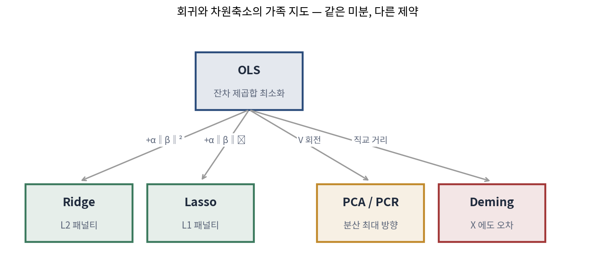

이 가족의 공통 정신은 "손실함수를 정의하고, 그 함수의 미분으로 답을 찾는다" 라는 한 가지다.

- **OLS** 는 잔차 제곱합을 최소화한다.  손실함수에 다른 항이 없다.
- **Ridge** 는 잔차 제곱합 + L2 패널티.  계수의 크기를 제한하여 다중공선성 완화.
- **Lasso** 는 잔차 제곱합 + L1 패널티.  일부 계수를 정확히 0 으로 만들어 변수 선택.
- **PCA / PCR** 는 자료의 분산을 최대화하는 새 변수를 만들고, 그것을 회귀의 입력으로 쓴다.
- **Deming** 은 X 에도 오차가 있을 때 직교 거리를 최소화한다.  특별한 경우(분산 비 = 1) 가 정확히 PC1 방향이다.

다른 손실함수를 정의하고, 다른 제약을 두며, 다른 미분으로 풀 뿐이다.  본질은 같다.  PCA 를 깊이 이해하면 이 가족의 다른 구성원들도 같은 정신의 변주임을 볼 수 있다.

## 47 장.  PCA 절차 한 장 정리

마지막으로 — PCA 를 실제 자료에 적용하는 절차를 한 장에 정리한다.

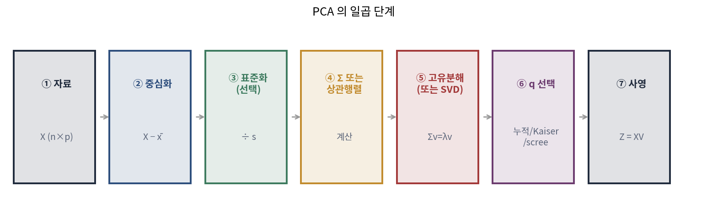

```python
# Python 으로는 단 몇 줄
from sklearn.preprocessing import StandardScaler
from sklearn.decomposition import PCA

# 단계 2, 3 : 중심화 + 표준화
Xs = StandardScaler().fit_transform(X)

# 단계 4, 5, 6, 7 : PCA 가 한꺼번에 처리 (내부적으로 SVD)
pca = PCA(n_components=2).fit(Xs)
Z   = pca.transform(Xs)

# 결과 해석
print(pca.explained_variance_ratio_)   # 각 PC 의 설명력
print(pca.components_)                  # 고유벡터 (행이 v₁, v₂)
```

이 한 코드 블록이 본 책 전체의 수학을 압축해서 담고 있다.  분산 최대화 → 라그랑주 → 고유분해 → SVD 의 길이, scikit-learn 의 두 줄 함수 호출 뒤에 깔려 있다.

---

## 끝맺으며 — 한 문장으로

PCA 는 "자료를 사영했을 때 분산이 가장 큰 방향을 찾는 일" 이다.  라그랑주 승수법이 그 답을 "공분산행렬의 고유분해" 로 환원시키고, 실제 계산은 자료행렬의 "SVD 한 번" 으로 처리된다.  이 한 가지 아이디어 위에 — 시각화, 잡음 제거, 회귀 안정화, 이상치 탐지, 확률적 생성모형, 비선형 일반화, 그리고 현대 딥러닝의 자기부호화기까지 — 모든 응용과 확장이 자라난다.

이 책의 목표는 그 "한 가지 아이디어" 가 어디서 왔고 무엇으로 가는지를 한 흐름으로 보여주는 것이었다.  중학생도 따라올 직관에서 시작해 대학원생이 다루는 수학까지, 같은 책의 같은 흐름 안에 놓일 수 있도록.  그 자리에서 시작해 자기가 갈 수 있는 곳까지 가면 된다 — 그것이 학습의 모든 자유이다.

---

*— 이 책은 강의용 교재로 만들어졌습니다.  오류나 더 풀어쓸 자리가 있으면 알려주세요.*
