<!-- TITLE -->
# 문과생을 위한 주성분분석(PCA)

### 행렬을 처음 보는 사람도 끝까지 따라오는 차원 축소 이야기

---

# 0부 · 숫자의 표로서의 행렬 — 곱셈·전치·대칭·직교

## 0.1 행렬은 숫자를 칸칸이 담은 표다

엑셀이나 성적표를 떠올리면 된다. 가로줄과 세로줄로 칸을 나누고, 칸마다 숫자를 하나씩 적어 넣은 표가 곧 **행렬**(matrix)이다. 수학 기호처럼 보이지만 정체는 그저 **숫자의 표**다.

붓꽃 자료(iris)를 보자. 꽃 한 송이를 재면 네 가지 숫자가 나온다. 꽃받침의 길이와 너비, 꽃잎의 길이와 너비다. 꽃 여섯 송이를 재서 표로 적으면 가로줄 여섯 개, 세로줄 네 개짜리 표가 된다. 이 표가 바로 행렬이다.

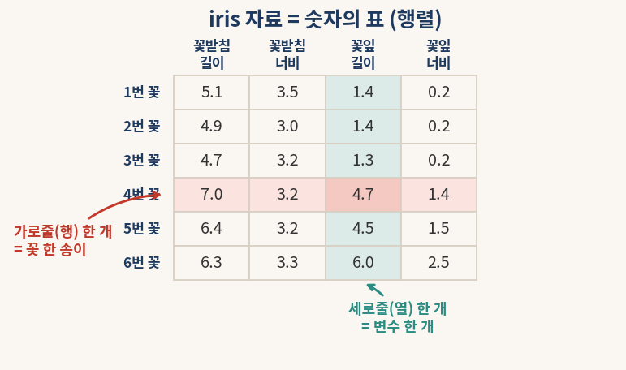

#### § 0.1 결과 해석

표에서 **가로줄**(행, row) 하나는 꽃 한 송이를 가리킨다. 위에서 네 번째 가로줄은 네 번째 꽃 한 송이의 기록이다. **세로줄**(열, column) 하나는 한 가지 변수를 가리킨다. 세 번째 세로줄은 모든 꽃의 꽃잎 길이만 모아 둔 칸이다.

기억할 약속은 단 하나다. **행은 한 사례, 열은 한 변수다.** 꽃 150송이를 재면 가로줄 150개, 세로줄 4개짜리 표가 되고, 이것을 "150 × 4 행렬"이라 부른다. 자료를 모았다는 말은 곧 이런 표 한 장을 손에 쥐었다는 말이다.

## 0.2 행렬 곱셈은 한 행과 한 열을 짝지어 새 칸을 만든다

두 표를 곱한다는 말은 낯설게 들린다. 그러나 규칙은 한 문장으로 끝난다. **한 행의 수들과 한 열의 수들을 차례로 짝지어 곱한 뒤 모두 더하면 새 칸 하나가 나온다.**

가로줄 하나가 (2, 1, 3)이고 세로줄 하나가 (4, 5, 1)이라 하자. 첫 칸끼리 곱하면 2 × 4 = 8, 둘째 칸끼리 곱하면 1 × 5 = 5, 셋째 칸끼리 곱하면 3 × 1 = 3이다. 이 셋을 더한 8 + 5 + 3 = 16이 새 표의 칸 하나가 된다.

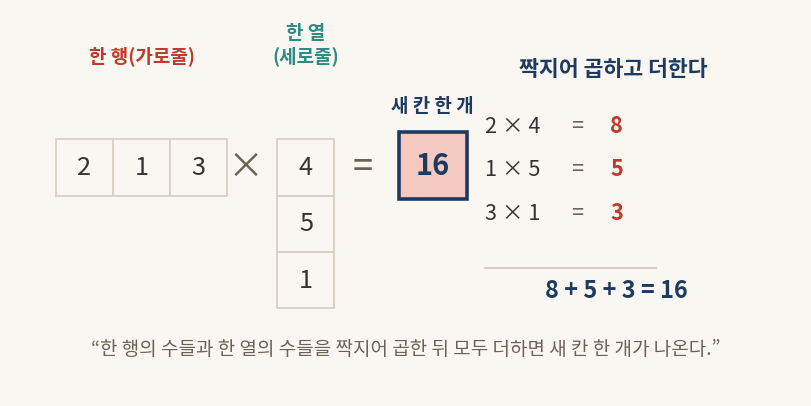

#### § 0.2 결과 해석

새 표의 모든 칸은 똑같은 방식으로 채워진다. 새 표에서 둘째 줄 셋째 칸이 궁금하면, 왼쪽 표의 둘째 가로줄과 오른쪽 표의 셋째 세로줄을 짝지어 곱하고 더하면 된다. 곱셈의 본질은 "짝지어 곱하고 더하기" 한 가지뿐이며, 칸이 많아져도 이 동작을 반복할 뿐이다.

이 단순한 동작이 PCA에서 중요한 까닭이 있다. 뒤에서 자료 표에 어떤 방향을 곱해 "그 방향으로 본 값"을 한 번에 뽑아내는데, 그 계산이 바로 이 짝지어 곱하고 더하기다.

## 0.3 전치는 표를 90도로 돌려 행과 열을 맞바꾼다

같은 자료라도 보는 방향을 바꿀 수 있다. 시험 결과표를 "학생별"로 정리할 수도 있고, "과목별"로 정리할 수도 있다. 표를 90도로 돌려 가로줄과 세로줄을 맞바꾸는 일을 **전치**(transpose)라 하고, 행렬 *A* 의 전치를 *A*ᵀ 로 적는다.

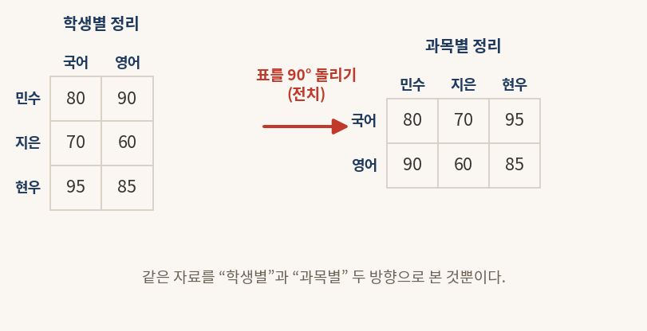

#### § 0.3 결과 해석

왼쪽 표에서 가로줄은 학생, 세로줄은 과목이었다. 90도로 돌리면 가로줄이 과목, 세로줄이 학생으로 바뀐다. 담긴 숫자는 하나도 변하지 않았고, 보는 방향만 달라졌다. 민수의 국어 점수는 어느 표에서도 80점 그대로다.

전치는 PCA의 마지막 대목에서 깜짝 놀랄 역할을 한다. 어떤 특별한 표(직교 행렬)는 90도로 한 번 돌리기만 하면 "되돌리는 표"가 되는데, 그 사정은 0.6절과 4부에서 다시 만난다.

## 0.4 단위행렬은 행렬 세계의 1이고, 역행렬은 되돌리는 표다

수의 세계에는 1이 있다. 어떤 수에 1을 곱해도 그 수는 변하지 않는다. 행렬의 세계에도 똑같은 구실을 하는 표가 있다. 대각선만 1이고 나머지가 0인 표인데, 이것을 **단위행렬**(identity matrix) *I* 라 부른다. 어떤 표에 *I* 를 곱해도 표는 그대로다.

수의 세계에는 또 "되돌리는 수"가 있다. 8에 1/8을 곱하면 1로 돌아온다. 이때 1/8을 8의 역수라 한다. 행렬에도 "되돌리는 표"가 있어 이것을 **역행렬**(inverse matrix) *A*⁻¹ 라 적는다. 어떤 표 *A* 에 그 역행렬을 곱하면 단위행렬 *I* 로 돌아온다.

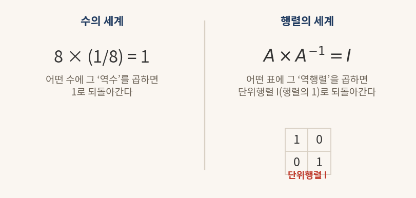

#### § 0.4 결과 해석

*A* × *A*⁻¹ = *I* 라는 식은 "어떤 표에 그 되돌리는 표를 곱하면 행렬 세계의 1로 돌아온다"는 뜻이다. 수에서 8 × (1/8) = 1이 성립하는 것과 똑같은 이야기다.

역행렬을 구하는 일은 보통 손으로 하기 까다롭다. 그런데 PCA가 다루는 표는 아주 특별해서, 까다로운 계산 없이 그저 90도로 돌리기(전치)만 하면 역행렬이 된다. 그 행운의 정체가 다음 두 절의 주제다.

## 0.5 대칭 행렬은 대각선을 거울 삼아 위아래가 같다

표의 왼쪽 위에서 오른쪽 아래로 가는 대각선을 거울이라 생각하자. 거울을 사이에 두고 위쪽 숫자와 아래쪽 숫자가 똑같으면, 그 표를 **대칭 행렬**(symmetric matrix)이라 한다. 식으로는 *A*ᵢⱼ = *A*ⱼᵢ 인데, 풀어 쓰면 "*i* 번째 줄 *j* 번째 칸의 값이 *j* 번째 줄 *i* 번째 칸의 값과 같다"는 말이다.

친구 관계도가 좋은 비유다. A와 B가 친하면 B와 A도 친하다. 친함은 한쪽 방향만 성립하는 일이 없고 언제나 양방향이다. 이 양방향성이 곧 대칭이다.

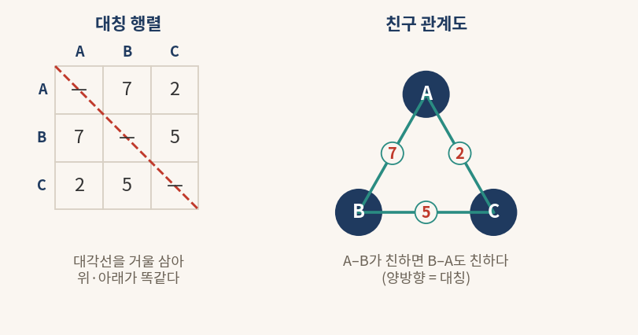

#### § 0.5 결과 해석

왼쪽 표에서 A행 B열의 값 7과 B행 A열의 값 7이 같다. A행 C열의 2와 C행 A열의 2도 같다. 대각선을 거울 삼아 접으면 위아래가 포개진다.

PCA에서 변수끼리의 관계를 모은 표(공분산행렬)는 언제나 이 대칭의 모습을 띤다. "키가 몸무게와 함께 움직이는 정도"는 "몸무게가 키와 함께 움직이는 정도"와 같은 한 숫자이기 때문이다. 대칭이라는 성질이 PCA를 놀랄 만큼 깔끔하게 만드는 출발점이 된다.

## 0.6 직교는 두 화살표가 직각으로 만나 서로 간섭하지 않는 일이다

동쪽으로 한 걸음 가는 일과 북쪽으로 한 걸음 가는 일은 서로 아무 상관이 없다. 동쪽으로 아무리 걸어도 북쪽 위치는 꿈쩍하지 않는다. 두 방향이 직각(90도)으로 만나 서로 간섭하지 않는 이런 관계를 **직교**(orthogonal)라 한다.

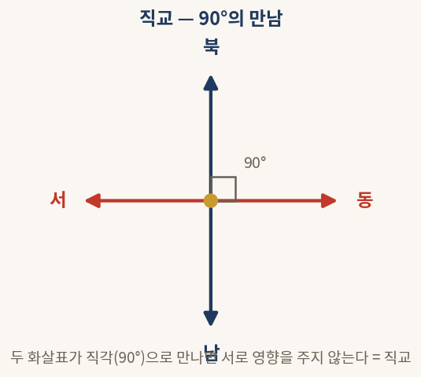

#### § 0.6 결과 해석

동·서·남·북 네 방향에서 동서를 잇는 화살표와 남북을 잇는 화살표는 정확히 90도로 만난다. 한 방향의 움직임이 다른 방향의 값에 전혀 영향을 주지 않는다. 이것이 직교의 핵심이다.

PCA가 자료를 새로운 방향들로 다시 그릴 때, 그 새 방향들은 모두 서로 직교하도록 잡는다. 직교한 방향들은 서로 정보를 겹쳐 담지 않으므로, 새 변수들이 같은 이야기를 중복해서 말하는 일이 없다. 또한 직교한 방향들을 세로줄로 모은 표는 "되돌리기가 곧 90도 돌리기(전치)"인 특별한 표가 되어, 0.4절에서 미뤄 둔 역행렬 문제를 한 번에 풀어 준다.

---

# 1부 · 변수가 많아질 때 생기는 문제와 PCA의 역할

## 1.1 변수 하나가 늘 때마다 차원이 하나씩 늘어난다

사람을 키 하나로만 설명하면, 모든 사람을 수직선 위의 점 하나로 찍을 수 있다. 이때 자료는 1차원이다. 키와 몸무게 두 가지로 설명하면, 가로축에 키, 세로축에 몸무게를 두고 평면 위의 점으로 찍는다. 자료가 2차원이 된 것이다. 허리둘레까지 더해 셋이 되면 입체 공간 속의 점이 되어 3차원이 된다.

여기까지는 그림으로 그릴 수 있다. 그러나 신발 크기까지 더해 변수가 넷이 되는 순간 문제가 생긴다. 4차원 공간은 종이에도 화면에도 그릴 방법이 없다.

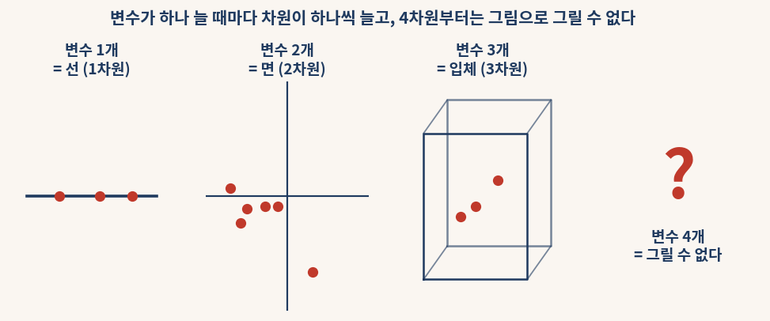

#### § 1.1 결과 해석

변수가 하나 늘 때마다 자료가 사는 공간의 차원도 하나씩 늘어난다. 변수 네 개짜리 붓꽃 자료는 4차원에 살고, 그래서 우리는 붓꽃 150송이가 어떻게 흩어져 있는지를 한눈에 그려 볼 수가 없다.

눈으로 볼 수 없다는 것은 단지 답답한 문제가 아니다. 자료의 모양을 못 보면 어떤 꽃들이 서로 닮았는지, 품종이 몇 덩어리로 나뉘는지를 직관으로 파악하기 어렵다. 그래서 차원을 2차원이나 3차원으로 낮춰 눈앞에 펼쳐 놓는 일이 필요해진다.

## 1.2 PCA는 비슷하게 움직이는 변수들을 새 변수 몇 개로 묶는다

차원을 줄이는 가장 거친 방법은 변수를 그냥 버리는 것이다. 신발 크기와 허리둘레를 지워 키와 몸무게만 남기면 2차원이 된다. 그러나 버린 변수에 담겨 있던 정보도 함께 사라진다.

**주성분분석**(PCA, Principal Component Analysis)은 더 영리하게 움직인다. 변수를 버리는 대신, 서로 비슷하게 움직이는 변수들을 묶어 새로운 변수 몇 개로 합친다. 키·몸무게·허리둘레·신발 크기는 대체로 "몸집이 큰 사람은 다 같이 크다"는 식으로 함께 움직인다. 그렇다면 이 네 가지를 "몸집 크기"라는 새 변수 하나로 거의 대신할 수 있다.

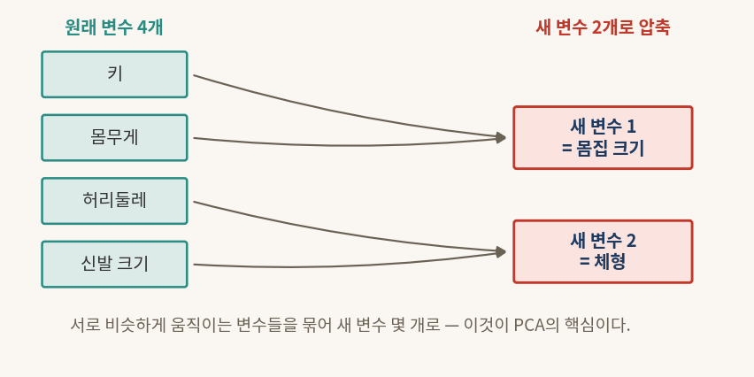

#### § 1.2 결과 해석

원래 변수 네 개가 "새 변수 1 = 몸집 크기"와 "새 변수 2 = 체형" 두 개로 압축됐다. 새 변수는 원래 변수들을 적절히 섞어 만든 것이라, 원래 정보의 거의 전부를 그대로 품고 있다. 정보는 거의 잃지 않으면서 차원만 넷에서 둘로 줄어든 셈이다.

PCA가 만드는 이 새 변수를 **주성분**(principal component, PC)이라 부른다. 첫째 주성분 PC1은 자료가 가장 넓게 퍼지는 방향, 즉 정보를 가장 많이 담은 방향이고, 둘째 주성분 PC2는 PC1과 직각을 이루면서 그다음으로 많이 퍼지는 방향이다. 변수를 버리지 않고 똑똑하게 섞어 차원을 줄이는 일, 그것이 PCA가 하는 일의 전부다.

---

# 2부 · PCA의 일곱 단계 한눈에 보기

PCA는 일곱 개의 작은 단계로 이루어진다. 각 단계가 무엇을 하는지 한 줄씩, 그리고 일상의 비유 한 줄씩으로 먼저 훑는다. 단계의 속을 끝까지 푸는 일은 3부에서 차례로 한다.

| 단계 | 이름 | 한 줄 설명 | 한 줄 비유 |
|---|---|---|---|
| 1 | **센터링**(centering) | 모든 값에서 평균을 뺀다 | 반 평균을 빼면 "평균보다 얼마나 잘했나"가 한 수로 나온다 |
| 2 | **표준화**(standardization) | 단위를 같은 척도로 맞춘다 | 키(cm)와 연봉(만원)을 같은 저울에 올린다 |
| 3 | **공분산행렬**(covariance matrix) | 변수끼리 함께 움직이는 정도를 표로 모은다 | 변수들의 "친한 정도" 표를 만든다 |
| 4 | **고유치 분해**(eigen-decomposition) | 자료가 늘어진 방향과 그 크기를 찾는다 | 타원에서 긴 축과 짧은 축을 찾는다 |
| 5 | **대칭의 마법** | 대칭이라 방향 표를 90도 돌리기만 하면 되돌릴 수 있다 | 직교 행렬은 뒤집기가 곧 되돌리기다 |
| 6 | **PC 스코어**(score) | 각 사례를 새 좌표(주성분) 값으로 옮긴다 | 한 꽃을 새 지도 위의 위치로 찍는다 |
| 7 | **차원 축소** | 큰 방향 몇 개만 남기고 나머지는 버린다 | 누적 정보가 80~95%에 닿을 때까지만 남긴다 |

#### § 2 결과 해석

일곱 단계는 크게 세 묶음으로 읽으면 편하다. 1·2단계는 자료를 **공평하게 다듬는 준비**다. 평균을 빼고 단위를 맞춰, 어느 한 변수가 단지 숫자가 크다는 이유로 분석을 독차지하지 못하게 한다. 3·4·5단계는 PCA의 **심장**으로, 변수들의 관계를 표로 모으고 그 표에서 자료가 가장 넓게 퍼지는 방향들을 뽑아낸다. 6·7단계는 **마무리**로, 각 사례를 새 방향 위의 값으로 옮겨 적고 중요한 방향만 남긴다.

세 단계 4·5·6에는 행렬이 등장하지만 겁낼 것 없다. 4단계의 "방향 찾기"는 컴퓨터가 대신 해 주고, 5단계의 "되돌리기"는 0.6절의 직교 덕분에 90도 돌리기로 끝나며, 6단계의 "좌표 옮기기"는 0.2절의 짝지어 곱하고 더하기일 뿐이다.
---

# 3부 · 공분산부터 차원 축소까지 — 일곱 단계를 차례로 풀기

## 3.0 공분산은 두 변수가 함께 움직이는 정도를 한 숫자로 적은 것이다

PCA의 심장으로 들어가기 전에 **공분산**(covariance)이라는 말 한 가지를 먼저 익혀 둔다. 공분산은 어렵게 들리지만 뜻은 소박하다. **두 변수가 함께 움직이는 정도**를 숫자 하나로 적은 것이다.

키와 몸무게를 생각하자. 대체로 키가 큰 사람은 몸무게도 많이 나간다. 한쪽이 커질 때 다른 쪽도 같이 커지면 공분산은 **양수**가 된다. 반대로 한쪽이 커질 때 다른 쪽이 작아지면 공분산은 음수가 되고, 두 변수가 아무 상관 없이 따로 놀면 공분산은 **0에 가까워진다**.

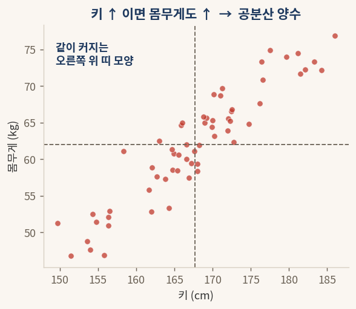

#### § 3.0 결과 해석 (양의 공분산)

키와 몸무게를 점으로 찍으면 점들이 왼쪽 아래에서 오른쪽 위로 비스듬히 누운 띠 모양을 이룬다. 키가 큰 쪽으로 갈수록 몸무게도 함께 커지는 이 동행을 한 숫자로 요약한 것이 양의 공분산이다.

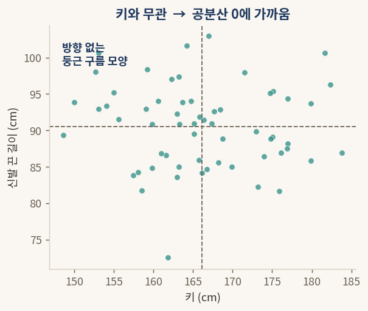

#### § 3.0 결과 해석 (공분산 0)

반면 키와 신발 끈 길이를 점으로 찍으면 점들이 한쪽으로 누운 모양 없이 둥근 구름처럼 흩어진다. 키가 커도 신발 끈 길이는 따라 변하지 않으니, 함께 움직이는 정도가 거의 없어 공분산이 0에 가깝다.

여기서 한 가지 약속을 덧붙인다. 어떤 변수를 **자기 자신과** 짝지어 공분산을 재면, 그것은 그 변수가 평균을 중심으로 얼마나 넓게 퍼져 있는지를 뜻하는 **분산**(variance)이 된다.

<div class="formula">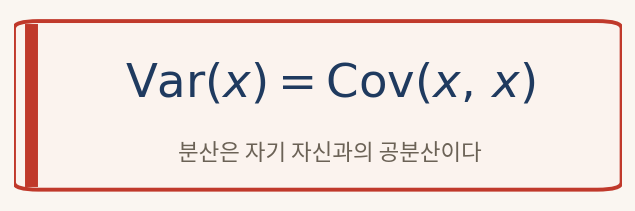</div>

분산은 공분산의 한 특별한 경우, 곧 "자기 자신과의 공분산"인 셈이다. 이 약속을 알아 두면 다음 단계의 표가 한결 쉽게 읽힌다.

## 3.1 (1단계) 센터링 — 평균을 빼서 새 기준점을 0으로 옮긴다

시험에서 80점을 받았다고 하자. 이 80점이 잘한 것인지 못한 것인지는 그 자체로는 알 수 없다. 반 평균이 60점이면 잘한 것이고, 95점이면 못한 것이다. 그래서 점수에서 반 평균을 빼면 "평균보다 얼마나 위인가 아래인가"가 한 숫자로 분명해진다. 평균이 60점일 때 80점은 +20, 평균이 95점일 때 80점은 −15가 된다.

모든 값에서 그 변수의 평균을 빼는 일을 **센터링**(centering)이라 한다. 센터링을 마치면 자료의 새 중심, 곧 평균이 정확히 0이 된다.

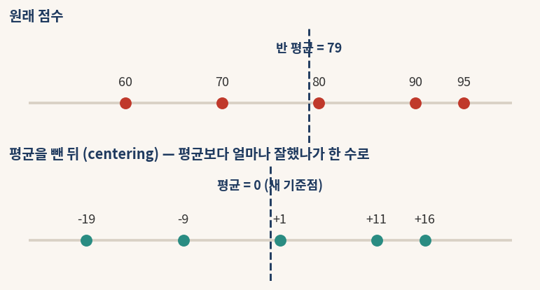

<div class="formula"></div>

```python
# 평균을 빼면 새 평균은 0이 된다 (numpy)
import numpy as np
scores = np.array([60, 70, 80, 90, 95])
centered = scores - scores.mean()
print(centered)        # [-19.  -9.   1.  11.  16.]
print(centered.mean()) # 0.0
```

#### § 3.1 결과 해석

원래 점수 60, 70, 80, 90, 95의 평균은 79점이다. 각 점수에서 79를 빼면 −19, −9, +1, +11, +16이 되고, 이 새 값들의 평균은 정확히 0이다. 숫자들의 서로 간 간격은 하나도 변하지 않았고, 기준점만 평균 자리로 옮겨 갔다.

센터링이 필요한 까닭은 PCA가 "자료가 어느 방향으로 퍼지는가"를 보기 때문이다. 퍼짐을 재려면 먼저 중심을 정해야 하고, 그 중심으로는 평균이 가장 자연스럽다. 그래서 모든 PCA는 평균을 0으로 옮기는 일에서 출발한다.

## 3.2 (2단계) 표준화 — 단위가 다른 변수들을 같은 척도로 맞춘다

키는 보통 170 언저리의 숫자이고 연봉은 5000 언저리의 숫자다. 두 변수를 그대로 한 분석에 넣으면, 단지 숫자가 크다는 이유만으로 연봉이 키를 압도해 버린다. 마치 작은 사과와 거대한 코끼리의 무게를 같은 저울에 그냥 올려놓고 견주는 일과 같다.

이를 막으려면 각 변수를 같은 척도로 다시 적어야 한다. 평균을 빼서 중심을 0으로 옮긴 뒤, 그 변수의 퍼진 정도(표준편차)로 나눈다. 이렇게 단위를 지운 값을 **z값**이라 하고, 이 작업을 **표준화**(standardization)라 한다.

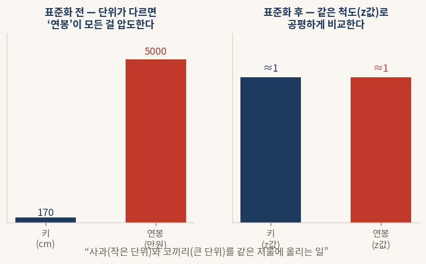

<div class="formula">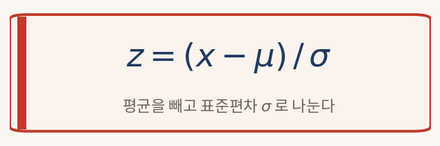</div>

```python
# 표준화: 평균 0, 표준편차 1로 (sklearn)
from sklearn.preprocessing import StandardScaler
import numpy as np
X = np.array([[170., 5000.], [160., 3000.], [180., 8000.]])
Z = StandardScaler().fit_transform(X)
print(Z.std(axis=0))   # [1. 1.] — 두 변수 모두 같은 척도
```

#### § 3.2 결과 해석

표준화를 마치면 키든 연봉이든 모두 평균 0, 표준편차 1짜리 값이 된다. 더는 어느 한 변수가 숫자가 크다는 이유로 분석을 독차지하지 못한다. 사과와 코끼리를 각자의 평균과 퍼짐으로 환산해 공평한 저울에 올려놓은 것이다.

표준화를 거친 자료로 공분산행렬을 만들면, 그것은 **상관행렬**(correlation matrix)과 같아진다. 그래서 다음 단계의 표는 −1과 +1 사이의 친숙한 값들로 채워진다.

## 3.3 (3단계) 공분산행렬 — 변수끼리의 친한 정도를 모은 표

이제 변수가 둘이 아니라 넷이라면, 공분산은 변수의 모든 짝마다 하나씩 생긴다. 꽃받침 길이와 꽃잎 길이의 공분산, 꽃받침 너비와 꽃잎 너비의 공분산, … 이렇게 짝마다 나온 숫자들을 한 장의 표로 모은 것이 **공분산행렬**(covariance matrix)이다. 변수가 *p* 개면 *p* × *p* 짜리 정사각형 표가 된다(표의 생김새는 0.1절 참고).

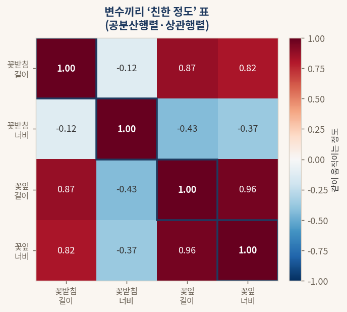

<div class="formula">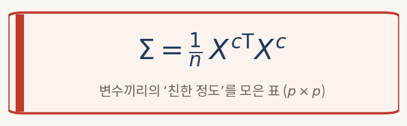</div>

```python
# 표준화한 자료의 공분산행렬 = 상관행렬 (numpy)
import numpy as np
from sklearn.datasets import load_iris
from sklearn.preprocessing import StandardScaler
Z = StandardScaler().fit_transform(load_iris().data)
C = np.cov(Z, rowvar=False)   # 4 x 4 표
print(np.round(C, 2))
```

#### § 3.3 결과 해석

표의 대각선은 각 변수가 자기 자신과 맺는 공분산, 곧 분산이다(3.0절의 약속). 표준화를 했으므로 대각선은 모두 1이다. 대각선 바깥의 칸은 두 변수가 함께 움직이는 정도를 나타낸다. 꽃잎 길이와 꽃잎 너비 칸은 0.96으로 매우 크다. 두 변수가 거의 한 몸처럼 함께 움직인다는 뜻이다. 반대로 꽃받침 너비는 다른 변수들과 음수나 작은 값으로 얽혀, 다소 따로 노는 변수임을 알 수 있다.

이 표가 대칭이라는 점도 눈여겨볼 만하다(0.5절 참고). 꽃잎 길이와 꽃잎 너비의 관계는 꽃잎 너비와 꽃잎 길이의 관계와 같은 한 숫자이므로, 대각선을 거울 삼아 위아래가 포개진다. 이 대칭성이 다음 단계들을 깔끔하게 만든다.

## 3.4 (4단계) 고유치 분해 — 자료가 늘어진 방향과 그 크기를 찾는다

공분산행렬은 자료가 어느 방향으로 얼마나 퍼져 있는지를 품고 있다. 점들의 구름을 보면 가장 길게 늘어진 방향이 하나 있고, 그와 직각을 이루며 그보다 짧게 늘어진 방향이 있다. 이 **늘어진 방향**과 그 방향으로 **얼마나 늘어났는지의 크기**를 공분산행렬에서 뽑아내는 일을 **고유치 분해**(eigen-decomposition)라 한다.

뽑아낸 방향을 **고유벡터**(eigenvector), 그 방향의 크기를 **고유치**(eigenvalue)라 부른다. 가장 큰 고유치를 가진 방향이 자료가 가장 넓게 퍼지는 방향, 곧 PC1이다.

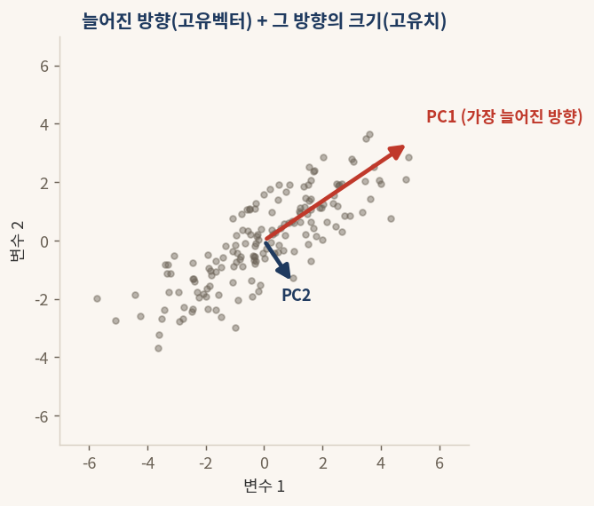

<div class="formula">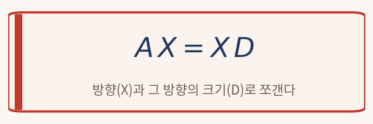</div>

```python
# 가장 많이 퍼진 방향(PC1)부터 차례로 찾기 (sklearn)
from sklearn.decomposition import PCA
from sklearn.preprocessing import StandardScaler
from sklearn.datasets import load_iris
Z = StandardScaler().fit_transform(load_iris().data)
pca = PCA().fit(Z)
print(pca.explained_variance_)   # 각 방향의 크기(고유치), 큰 순서
```

#### § 3.4 결과 해석

그림에서 붉은 화살표는 점들의 구름이 가장 길게 늘어진 방향(PC1)을 가리키고, 남색 화살표는 그와 직각으로 만나는 둘째 방향(PC2)을 가리킨다. 붉은 화살표가 더 긴 까닭은 그 방향의 고유치가 더 크기 때문이며, 그것은 곧 그 방향에 자료의 정보가 더 많이 담겨 있다는 뜻이다.

손으로 고유벡터와 고유치를 구하는 일은 까다롭지만, 그 계산은 컴퓨터가 한순간에 해 준다. 우리가 할 일은 "가장 많이 퍼진 방향부터 차례로 찾아 줘"라고 부탁하는 것뿐이고, 그 부탁이 위 코드의 `PCA().fit` 한 줄이다.

## 3.5 (5단계) 대칭의 마법 — 90도 돌리기만으로 되돌릴 수 있다

0.4절에서 역행렬, 곧 "되돌리는 표"를 구하는 일이 까다롭다고 했다. 그런데 PCA가 찾은 방향들을 세로줄로 모아 만든 표 *X* 는 특별하다. 방향들이 모두 서로 직교하기 때문에(0.6절), 이 표는 **직교 행렬**(orthogonal matrix)이 된다.

직교 행렬에는 마법 같은 성질이 있다. 까다로운 역행렬을 구할 필요 없이, 그저 90도로 돌리기(전치)만 하면 그것이 곧 역행렬이 된다. 식으로는 *X*ᵀ = *X*⁻¹ 이다.

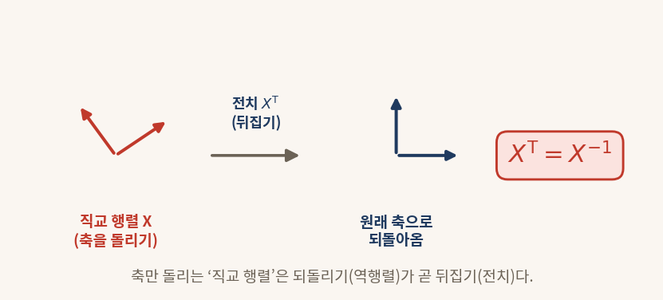

<div class="formula"></div>

```python
# 직교 행렬은 전치가 곧 역행렬: X^T X = 단위행렬 I (numpy)
import numpy as np
from sklearn.decomposition import PCA
from sklearn.preprocessing import StandardScaler
from sklearn.datasets import load_iris
Z = StandardScaler().fit_transform(load_iris().data)
X = PCA().fit(Z).components_.T   # 방향들을 세로줄로 모은 표
print(np.round(X.T @ X, 2))      # 단위행렬 I 가 나온다
```

#### § 3.5 결과 해석

코드의 결과는 대각선만 1이고 나머지가 0인 단위행렬이다. 방향 표 *X* 를 90도 돌린 *X*ᵀ 와 *X* 를 곱했더니 행렬 세계의 1로 돌아온 것이다. 이는 *X*ᵀ 가 곧 *X* 의 역행렬임을 보여 준다.

이 마법 덕분에 공분산행렬은 *A* = *X D X*ᵀ 라는 아주 깔끔한 모습으로 쪼개진다. 가운데의 *D* 는 고유치들만 대각선에 늘어놓은 표로 "각 방향의 크기"를 담고, 양옆의 *X* 와 *X*ᵀ 는 "방향을 돌렸다가 되돌리는" 구실을 한다. 까다로운 역행렬 계산이 90도 돌리기 한 번으로 끝났기에 가능한 분해다.

## 3.6 (6단계) PC 스코어 — 한 사례를 새 좌표 위의 값으로 옮긴다

방향을 다 찾았으면, 이제 꽃 한 송이 한 송이를 새 좌표 위로 옮겨 적을 차례다. 원래는 "꽃받침 길이, 꽃받침 너비, 꽃잎 길이, 꽃잎 너비"라는 네 숫자로 적던 꽃을, 이제 "PC1 방향으로 얼마, PC2 방향으로 얼마"라는 새 숫자들로 다시 적는다. 이 새 숫자들을 **PC 스코어**(score)라 한다.

한 꽃을 한 방향 위의 값으로 옮기는 계산은 그 꽃의 값들과 그 방향의 값들을 짝지어 곱하고 더하는 일, 곧 0.2절의 행렬 곱셈 그대로다.

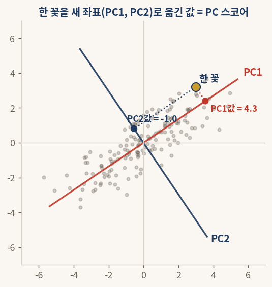

<div class="formula">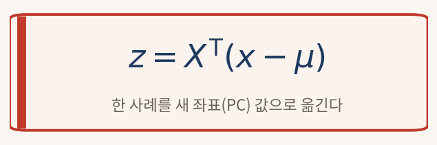</div>

```python
# 각 꽃을 새 좌표(PC) 값으로 옮기기 (sklearn)
from sklearn.decomposition import PCA
from sklearn.preprocessing import StandardScaler
from sklearn.datasets import load_iris
Z = StandardScaler().fit_transform(load_iris().data)
scores = PCA().fit_transform(Z)   # 150송이 x 4개 PC 값
print(scores[0].round(2))         # 첫 꽃의 PC 스코어
```

#### § 3.6 결과 해석

그림에서 노란 점은 꽃 한 송이다. 이 꽃을 PC1 방향으로 비추면(붉은 점선) 그 방향에서의 값 4.3이 나오고, PC2 방향으로 비추면(남색 점선) 그 방향에서의 값 −1.0이 나온다. 그러므로 이 꽃의 새 좌표는 (PC1 = 4.3, PC2 = −1.0)이다.

좌표를 바꿨을 뿐 꽃 자체는 그대로다. 다만 새 좌표에서는 PC1 한 축만 봐도 그 꽃이 전체적으로 큰 꽃인지 작은 꽃인지를 곧장 읽을 수 있다. 정보를 가장 많이 담은 방향을 첫 축으로 삼았기 때문이다.

## 3.7 (7단계) 차원 축소 — 큰 방향 몇 개만 남기고 나머지는 버린다

방향마다 고유치, 곧 그 방향에 담긴 정보의 양이 다르다. 큰 방향부터 차례로 줄을 세운 뒤, 정보의 양을 위에서부터 더해 나가다 보면 어느 지점에서 누적이 자료 전체 정보의 80~95%에 닿는다. 그 지점까지의 방향만 남기고 나머지는 버리면, 정보는 거의 잃지 않으면서 차원만 크게 줄어든다. 이것이 **차원 축소**다.

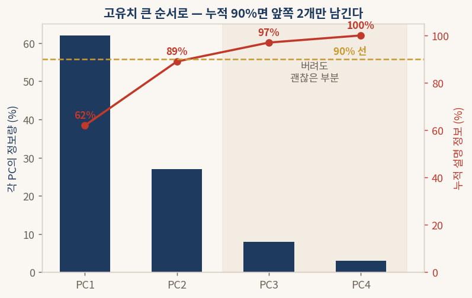

```python
# 누적 정보가 얼마나 되는지 확인 (sklearn)
import numpy as np
from sklearn.decomposition import PCA
from sklearn.preprocessing import StandardScaler
from sklearn.datasets import load_iris
Z = StandardScaler().fit_transform(load_iris().data)
ratio = PCA().fit(Z).explained_variance_ratio_
print(np.round(np.cumsum(ratio), 3))  # 누적 설명 비율
```

#### § 3.7 결과 해석

막대는 각 방향이 홀로 설명하는 정보의 비율이고, 붉은 선은 위에서부터 더해 간 누적 비율이다. 그림의 예에서는 앞쪽 두 방향만으로 누적이 89%에 닿고, 90% 선을 거의 채운다. 그러므로 셋째·넷째 방향은 버려도 잃는 정보가 10% 남짓에 불과하다.

차원을 어디까지 줄일지는 이 누적선을 보고 정한다. 흔히 80%나 90% 같은 선을 그어 두고, 누적이 그 선을 넘는 가장 앞쪽 지점까지만 남긴다. 네 방향을 두 방향으로 줄이면, 4차원이라 그릴 수 없던 자료를 2차원 평면에 펼쳐 한눈에 볼 수 있게 된다.
---

# 4부 · 공분산이 대칭이라서 전치가 곧 역행렬이 되는 일

## 4.1 공분산행렬은 언제나 대칭이다

3부에서 만든 공분산행렬을 다시 떠올린다. 그 표의 어느 칸이든 "변수 A와 변수 B가 함께 움직이는 정도"를 담는다. 그런데 "A가 B와 함께 움직이는 정도"와 "B가 A와 함께 움직이는 정도"는 같은 한 가지 사실을 양쪽에서 말한 것일 뿐, 같은 숫자다. 친구 관계가 언제나 양방향인 것과 똑같다(0.5절 참고).

그러므로 공분산행렬은 대각선을 거울 삼아 위아래가 포개지는 대칭 행렬이다. 이것은 우연이 아니라, 공분산이라는 양이 두 변수의 순서를 따지지 않는 데서 반드시 따라 나오는 성질이다.

## 4.2 대칭 행렬의 고유벡터들은 서로 직각으로 만난다

대칭 행렬에는 그림처럼 깨끗한 성질이 하나 더 있다. 대칭 행렬에서 뽑아낸 고유벡터, 곧 자료가 늘어진 방향들은 **언제나 서로 직각(90도)으로 만난다.**

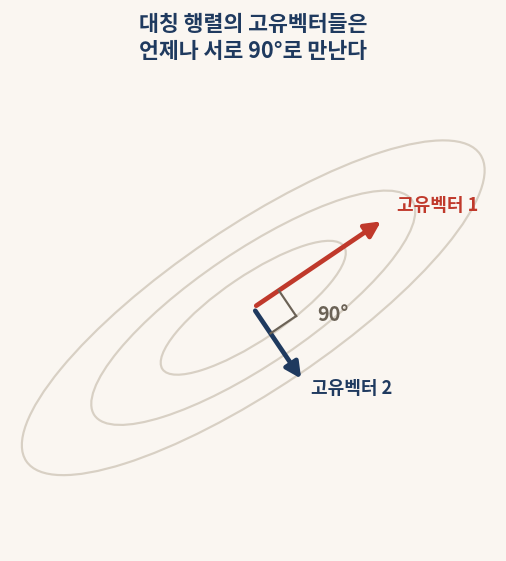

#### § 4.2 결과 해석

타원처럼 늘어진 자료의 구름에서, 가장 길게 늘어진 방향(고유벡터 1)과 그다음으로 늘어진 방향(고유벡터 2)은 정확히 90도를 이룬다. 한 방향이 아무리 길어도 다른 방향과는 직각을 지킨다.

이 성질이 왜 반가운지는 0.6절에서 이미 보았다. 직교한 방향들은 서로 정보를 겹쳐 담지 않으므로, 이 방향들로 만든 새 변수 PC1, PC2, …는 같은 이야기를 중복하지 않는다. PCA가 변수를 깔끔하게 압축할 수 있는 까닭이 바로 여기에 있다. 까다로운 증명 없이, "대칭이면 고유벡터가 직교한다"는 사실 하나만 성질로 받아들이면 충분하다.

## 4.3 그래서 역행렬 대신 전치를 써도 된다

직각으로 만나는 방향들을 세로줄로 모아 표 *X* 를 만들면, 그 표는 직교 행렬이 된다. 그리고 0.6절과 3.5절에서 보았듯, 직교 행렬은 까다로운 역행렬을 구할 필요 없이 90도로 돌리기(전치)만 하면 그것이 곧 역행렬이 된다. 곧 *X*⁻¹ 대신 *X*ᵀ 를 그대로 쓸 수 있다.

세 가지 사실이 하나로 맞물린 셈이다. 공분산행렬이 **대칭**이라서(4.1), 그 고유벡터들이 서로 **직교**하고(4.2), 직교하기에 방향 표를 **전치**하기만 하면 되돌릴 수 있다(4.3). 이 맞물림 덕분에 공분산행렬은 다음 한 줄로 깨끗이 쪼개진다.

<div class="formula"></div>

이 한 장의 공식 카드 안에 PCA의 수학이 거의 다 들어 있다. *X* 는 직교하는 방향들(고유벡터), *D* 는 각 방향의 크기(고유치), *X*ᵀ 는 전치로 얻은 되돌리기다. 손으로 풀어야 할 어려운 대목은 모두 컴퓨터와 직교의 마법이 대신 처리한다.

---

# 5부 · iris 자료로 일곱 단계를 처음부터 끝까지 실행하기

## 5.1 자료 가져오기와 한눈에 보기

붓꽃 자료는 별도의 파일을 내려받을 필요 없이 한 줄로 불러온다. 꽃 150송이를 네 가지 변수로 잰 표(150 × 4 행렬)와, 각 꽃이 세 품종(setosa, versicolor, virginica) 가운데 무엇인지를 적은 정답표가 함께 들어 있다.

```python
# iris 자료를 polars 표로 불러와 앞 5줄 보기
import polars as pl
from sklearn.datasets import load_iris
iris = load_iris()
df = pl.DataFrame(iris.data, schema=["꽃받침길이", "꽃받침너비", "꽃잎길이", "꽃잎너비"])
df = df.with_columns(pl.Series("품종", [iris.target_names[i] for i in iris.target]))
print(df.head())
```

#### § 5.1 결과 해석

표의 가로줄 하나가 꽃 한 송이, 세로줄 하나가 한 변수다(0.1절). 앞쪽 50송이는 setosa, 가운데 50송이는 versicolor, 뒤쪽 50송이는 virginica다. 네 변수의 단위는 모두 센티미터지만 값의 크기가 제각각이라, 본격적인 분석에 앞서 다듬는 손질이 필요하다.

## 5.2 (1·2단계) 센터링과 표준화 — 네 변수를 같은 척도로

먼저 네 변수를 같은 척도로 맞춘다. 표준화는 평균을 빼는 센터링(1단계)과 표준편차로 나누는 일(2단계)을 한 번에 처리한다.

```python
# 표준화: 네 변수를 평균 0, 표준편차 1로 (sklearn)
from sklearn.preprocessing import StandardScaler
Z = StandardScaler().fit_transform(iris.data)
print(Z.mean(axis=0).round(2))  # [0. 0. 0. 0.]
print(Z.std(axis=0).round(2))   # [1. 1. 1. 1.]
```

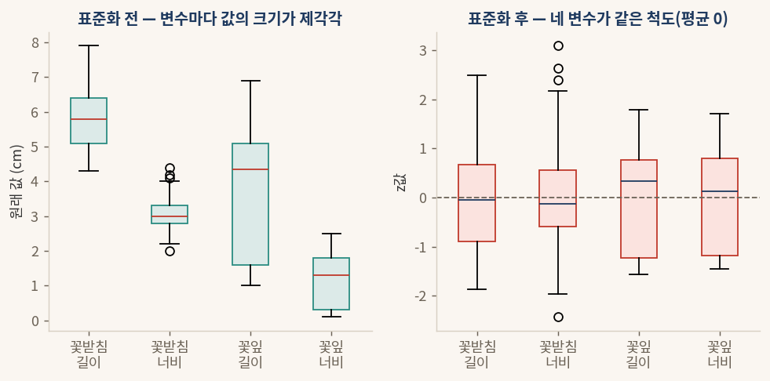

#### § 5.2 결과 해석

왼쪽 그림은 표준화 전이다. 꽃받침 길이는 5 언저리, 꽃잎 너비는 1 언저리로 변수마다 값의 크기가 달라, 그대로 두면 숫자가 큰 변수가 분석을 더 많이 좌우한다. 오른쪽은 표준화 후다. 네 변수가 모두 평균 0을 중심으로 비슷한 폭으로 퍼져, 어느 변수도 단지 단위가 크다는 이유로 특별 대접을 받지 않는다. 사과와 코끼리를 같은 저울에 올린 셈이다(3.2절).

## 5.3 (3·4·5단계) 방향 찾기 — PCA 한 줄

다듬은 자료에서 공분산행렬을 만들고(3단계), 자료가 늘어진 방향들을 찾고(4단계), 대칭의 마법으로 그것을 깔끔하게 쪼개는(5단계) 일은 모두 `PCA().fit` 한 줄 안에서 일어난다.

```python
# 방향 찾기: 큰 순서로 PC1, PC2, ... (sklearn)
from sklearn.decomposition import PCA
pca = PCA().fit(Z)
print(pca.explained_variance_ratio_.round(4))
# [0.7296 0.2285 0.0367 0.0052]
```

#### § 5.3 결과 해석

네 방향이 설명하는 정보의 비율이 큰 순서로 0.73, 0.23, 0.04, 0.01로 나왔다. 앞쪽 두 방향이 73%와 23%를 차지하고, 뒤쪽 두 방향은 합쳐도 5%에 불과하다. 자료가 사실상 두 방향으로 거의 다 설명된다는 신호다.

## 5.4 (6단계) PC 스코어 — 각 꽃을 새 좌표로 옮기기

이제 꽃 150송이를 새 좌표 위로 옮긴다. 원래는 네 숫자로 적던 꽃을, PC1 값과 PC2 값을 비롯한 새 숫자들로 다시 적는다.

```python
# 각 꽃의 PC 스코어를 polars 표로 보기
import polars as pl
scores = pca.transform(Z)
sc = pl.DataFrame(scores[:, :2], schema=["PC1", "PC2"])
sc = sc.with_columns(pl.Series("품종", [iris.target_names[i] for i in iris.target]))
print(sc.head())
```

#### § 5.4 결과 해석

표의 PC1 칸은 각 꽃이 PC1 방향에서 갖는 값이다. 앞쪽 setosa 꽃들은 PC1 값이 크게 음수로 나오고, 뒤쪽 virginica 꽃들은 크게 양수로 나온다. 네 숫자로 적던 꽃을 단 두 숫자(PC1, PC2)로 거의 손실 없이 다시 적은 것이다.

## 5.5 (7단계) 차원 축소와 결과 그림

마지막으로 큰 방향 둘만 남긴다. 네 방향 가운데 앞쪽 둘만 골라도 정보가 얼마나 보존되는지를 누적 비율로 확인한다.

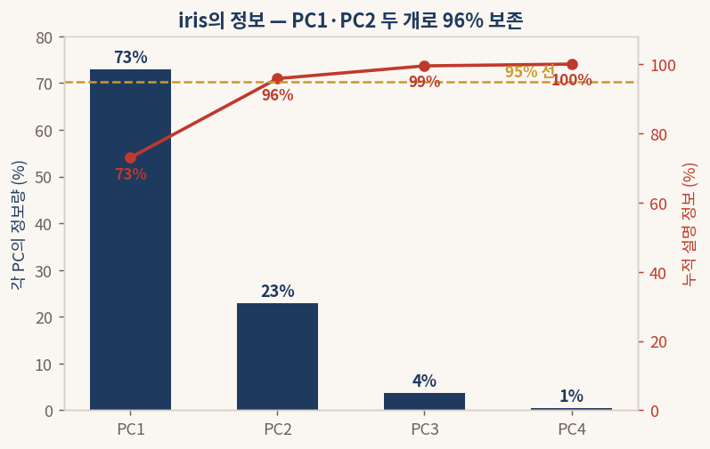

#### § 5.5 결과 해석 (정보 보존)

PC1이 73%, PC2가 23%를 설명하므로 둘을 더하면 96%다. 95% 선을 가뿐히 넘긴다. 따라서 PC3와 PC4를 버리고 PC1·PC2 두 방향만 남겨도, 잃는 정보는 4%에 지나지 않는다. 4차원이라 그릴 수 없던 자료를 이제 2차원 평면에 펼칠 수 있다.

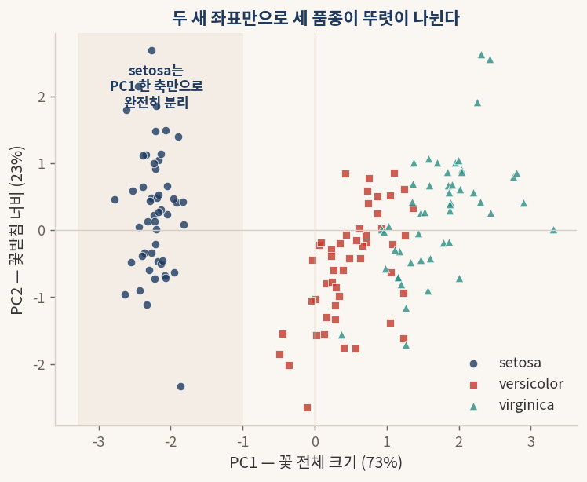

#### § 5.5 결과 해석 (품종 분리)

PC1을 가로축, PC2를 세로축으로 삼아 150송이를 평면에 찍으면 세 품종이 뚜렷이 갈라진다. 특히 setosa는 PC1 값이 모두 −1보다 작은 왼쪽 영역에 뭉쳐, **PC1 한 축만으로 다른 두 품종과 완전히 분리된다.** versicolor와 virginica는 약간 겹치지만 대체로 PC1을 따라 차례로 늘어선다.

이 그림이 PCA의 결실이다. 변수 넷을 둘로 줄였는데도, 줄인 두 축이 품종을 가르는 핵심 정보를 거의 그대로 품고 있다. 차원을 줄이면서도 자료의 핵심 구조를 잃지 않은 것이다.

## 5.6 새 축은 무엇을 뜻하는가 — PC1과 PC2의 정체

마지막 물음이 남는다. PC1과 PC2는 도대체 어떤 변수인가. 각 변수가 새 축에 얼마나 기여하는지를 보면 그 정체가 드러난다.

```python
# 각 변수가 PC1, PC2에 기여하는 정도
import numpy as np
print(np.round(pca.components_[0], 2))  # PC1: [0.52 -0.27 0.58 0.57]
print(np.round(pca.components_[1], 2))  # PC2: [0.38  0.92 0.02 0.07]
```

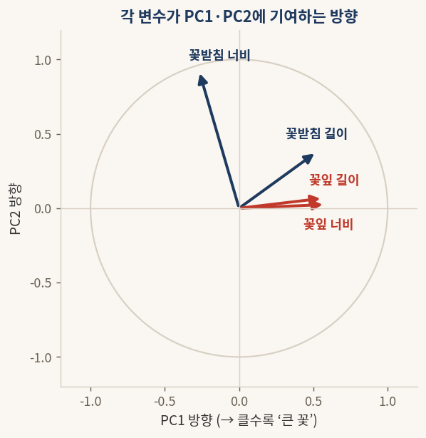

#### § 5.6 결과 해석

PC1 쪽 숫자를 보면 꽃받침 길이, 꽃잎 길이, 꽃잎 너비가 모두 크게 양수로 함께 기여한다. 곧 PC1이 큰 꽃은 이 세 가지가 모두 크다. 그래서 PC1은 **"꽃 전체 크기"** 축이라 읽을 수 있다. PC1이 클수록 전체적으로 큰 꽃이다.

PC2 쪽 숫자는 꽃받침 너비 하나가 0.92로 압도적이다. 그래서 PC2는 사실상 **"꽃받침 너비"** 축이다. 정리하면 붓꽃 한 송이는 "전체적으로 얼마나 큰가(PC1)"와 "꽃받침이 얼마나 넓은가(PC2)" 두 가지로 거의 다 설명되며, 이 두 축만으로 세 품종이 갈린다. 네 개의 변수를 두 개의 뜻 있는 새 변수로 압축해 낸 것, 이것이 주성분분석이 해낸 일의 전부다.
