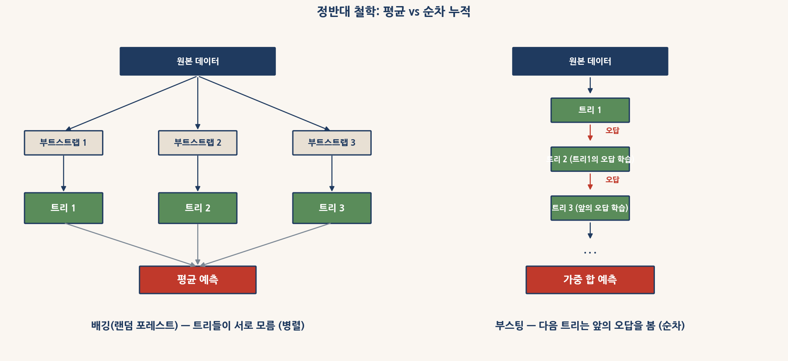
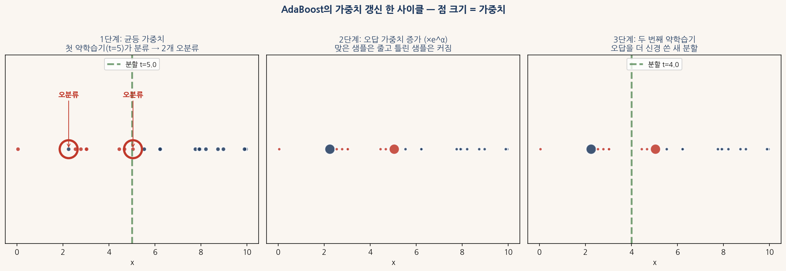
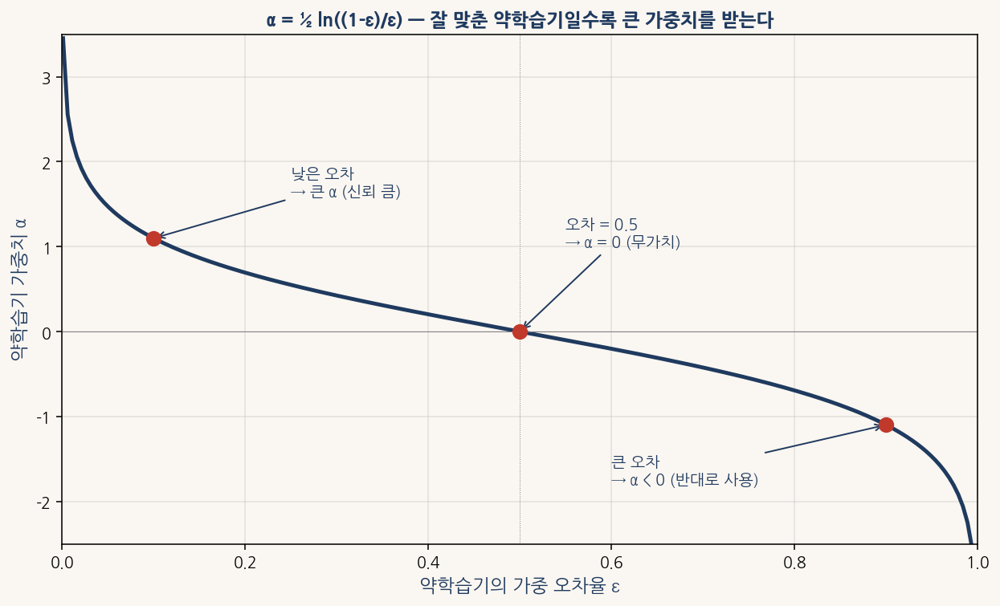
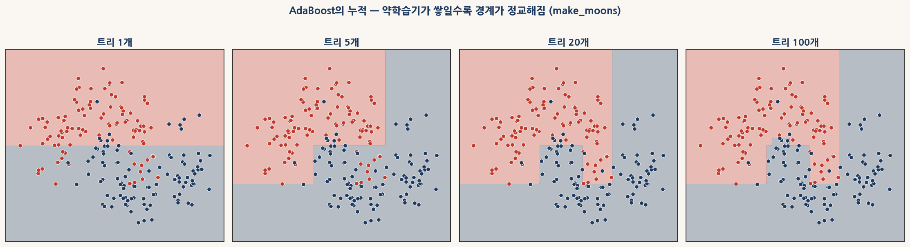
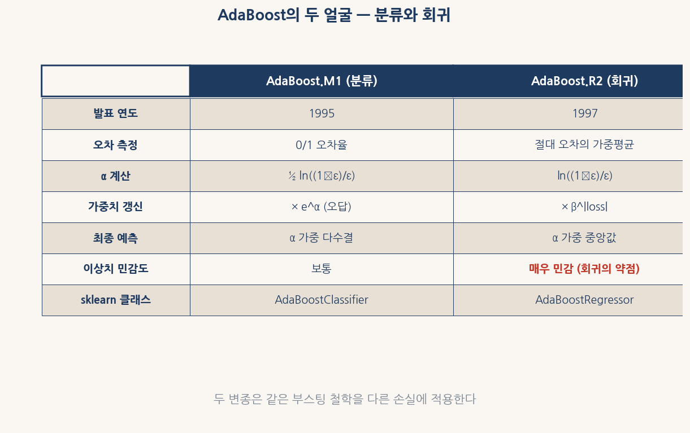
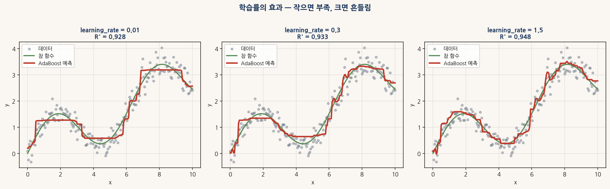
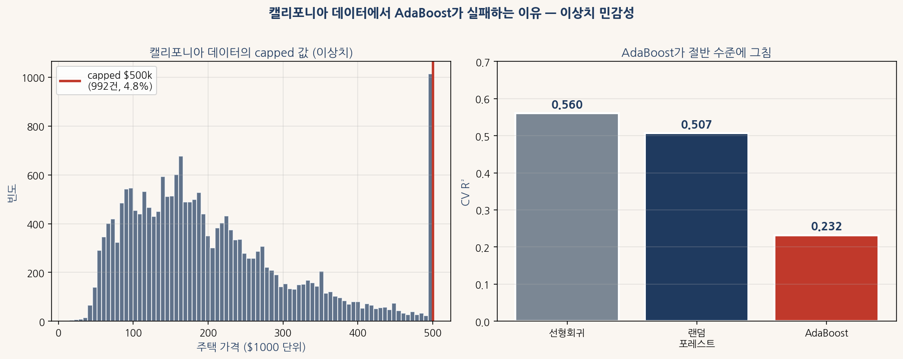
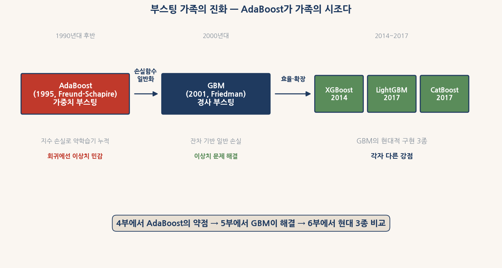

# 4부 학생 워크북 — AdaBoost

## 어려운 버전 — 학부 1~2학년용

이 워크북은 이론 교재 `00_adaboost_theory_HARD.md`를 읽으면서 함께 채우는 자가학습 자료이다. 교재의 0~8장 흐름을 그대로 따라가며, 각 장의 핵심 개념과 코드를 빈칸으로 두었다. 빈칸을 채운 뒤 바로 아래의 **정답 보기**를 펼쳐 확인할 수 있다.

이름: ____________________   학번: ____________________   날짜: ____________________

---

## 0장 분산 감소에서 편향 감소로 — 부스팅의 정신



<sub>그림 0-1. 배깅과 부스팅의 정반대 철학.</sub>

**개념 1.** 3부 마지막에서 랜덤 포레스트의 R²가 더 이상 안 오르는 한계를 봤다. 남은 R² 격차는 **분산이 아니라** ____________________ 에서 온다. 트리 한 그루가 충분히 깊이 자라도 잡지 못하는 패턴이 있다는 뜻이다.

<details><summary>▶ 정답 보기</summary>

편향(bias)

</details>

**개념 2.** 부스팅의 핵심 한 줄을 요약하면 — 트리를 한 그루씩 ____________________ 으로 키우면서, 앞선 트리들이 잡지 못한 패턴을 다음 트리가 ____________________ 한다.

<details><summary>▶ 정답 보기</summary>

순차적(sequential) / 보정

</details>

**개념 3.** 배깅과 부스팅의 차이를 표로 완성하라.

| 구분 | 배깅 | 부스팅 |
|---|---|---|
| 다음 트리의 입력 | 새 부트스트랩 (이전 트리와 ____________________) | 앞 트리의 ____________________ 정보 |
| 줄이는 오차 | ____________________ | ____________________ |
| 트리 깊이 권장값 | ____________________ | ____________________ |
| 병렬 처리 | ____________________ | ____________________ |


<details><summary>▶ 정답 보기</summary>

| 구분 | 배깅 | 부스팅 |
|---|---|---|
| 다음 트리의 입력 | 새 부트스트랩 (이전 트리와 **무관**) | 앞 트리의 **오답** 정보 |
| 줄이는 오차 | **분산** | **편향** |
| 트리 깊이 권장값 | **깊게** | **얕게** |
| 병렬 처리 | **가능** | **불가능** |


</details>

**개념 4.** 부스팅의 빌딩 블록을 ____________________ (weak learner)라 부른다. 무작위 예측보다 약간 나은 정도의 단순한 모델이다. AdaBoost에서 가장 흔히 쓰이는 약학습기는 깊이 ____ 짜리 결정 트리, 즉 ____________________ 다.

<details><summary>▶ 정답 보기</summary>

약학습기 / 1 / 결정 그루터기(decision stump)

</details>

**개념 5.** **AdaBoost**(Adaptive Boosting)는 ____________________ 년 Yoav ____________________ 와 Robert ____________________ 가 발표한, 부스팅 가족의 시조다. 손실함수를 일반화한 후속 알고리즘이 ____________________ (2001, Friedman)이고, 그 현대적 구현 셋이 XGBoost, ____________________, ____________________ 다.

<details><summary>▶ 정답 보기</summary>

1995 / Freund / Schapire / GBM / LightGBM / CatBoost

</details>

**코드 빈칸 1.** 결정 그루터기와 보통 트리의 단독 성능 비교.

```python
from sklearn.tree import DecisionTreeRegressor
from sklearn.model_selection import cross_val_score

stump = DecisionTreeRegressor(max_depth=____, random_state=42)
normal = DecisionTreeRegressor(max_depth=____, random_state=42)

r2_stump = cross_val_score(stump, X_ames, y_ames, cv=5, scoring="r2").mean()
r2_normal = cross_val_score(normal, X_ames, y_ames, cv=5, scoring="r2").mean()
```

<details><summary>▶ 정답 보기</summary>

```python
stump = DecisionTreeRegressor(max_depth=1, ...)    # 결정 그루터기
normal = DecisionTreeRegressor(max_depth=10, ...)  # 보통 트리
```

결정 그루터기 단독은 R² 약 0.45로 매우 약하지만, **이런 약학습기를 50~100개 누적**하면 R² 0.80 이상으로 점프한다. AdaBoost의 마법이다.

</details>

---

## 1장 가중치 갱신 — 다음 트리가 무엇을 보고 학습하나



<sub>그림 1-1. AdaBoost의 가중치 갱신 한 사이클 — 점 크기가 곧 가중치다.</sub>

**개념 6.** AdaBoost는 학습 샘플마다 ____________________ 를 둔다. 처음에는 모두 ____ 로 같은 값을 가진다. 첫 약학습기 학습 후, **틀린 샘플의 가중치는** ____________________ 하고 **맞은 샘플의 가중치는** ____________________ 한다.

<details><summary>▶ 정답 보기</summary>

가중치(weight) / $1/n$ (균등) / 증가 / 감소

</details>

**개념 7.** AdaBoost.M1의 가중치 갱신 식은 다음과 같다.

$$w_i^{(t+1)} = \frac{w_i^{(t)} \cdot \exp(\_\_\_\_\_\_\_\_\_\_\_\_)}{Z_t}$$

식의 지수 부분이 **맞은 샘플은 음수**, **틀린 샘플은 양수**가 되어야 한다.

<details><summary>▶ 정답 보기</summary>

$-\alpha_t \cdot y_i \cdot h_t(x_i)$

예측이 맞으면 $y_i \cdot h_t(x_i) = +1$이므로 지수가 $-\alpha_t < 0$ → 가중치 감소.
예측이 틀리면 $y_i \cdot h_t(x_i) = -1$이므로 지수가 $+\alpha_t > 0$ → 가중치 증가.

</details>




<sub>그림 1-2. 약학습기 가중치 α는 가중 오차율 ε의 함수다.</sub>

**개념 8.** 약학습기 가중치 α의 식은 가중 오차율 ε에서 다음과 같이 결정된다.

$$\alpha_t = \frac{1}{2} \ln\left(\frac{\_\_\_\_\_\_\_\_}{\_\_\_\_\_\_\_\_}\right)$$

이 식의 세 가지 특징:

- ε = 0.5에서 α = ____ 
- ε → 0이면 α → ____________________ 
- ε > 0.5이면 α는 ____________________ (양수/음수)

<details><summary>▶ 정답 보기</summary>

$1 - \epsilon_t$ / $\epsilon_t$ / 0 / 무한대 (+∞) / 음수

</details>

**개념 9.** AdaBoost가 사실은 ____________________ 손실 $L(y, F) = \exp(-yF)$를 최소화하는 알고리즘이라는 사실이 1999년 Friedman·Hastie·Tibshirani에 의해 밝혀졌다. 이 손실의 특징은 오답에 대한 페널티가 ____________________ 로 폭증한다는 것이다.

<details><summary>▶ 정답 보기</summary>

지수(exponential) / 지수적(무한대)

</details>

**코드 빈칸 2.** AdaBoost 첫 라운드의 가중치 갱신 직접 구현.

```python
from sklearn.tree import DecisionTreeClassifier
import numpy as np

n = len(y)
w = np.____(n) / n              # 균등 가중치로 시작

stump = DecisionTreeClassifier(max_depth=1, random_state=0)
stump.fit(X, y, sample_weight=w)
pred1 = stump.predict(X)

err = np.sum(w * (pred1 != y))   # 가중 오차율
alpha1 = ____ * np.log((1 - err) / err)

w_new = w * np.exp(____)         # 가중치 갱신
w_new /= w_new.sum()             # 정규화
```

<details><summary>▶ 정답 보기</summary>

```python
w = np.ones(n) / n
alpha1 = 0.5 * np.log((1 - err) / err)
w_new = w * np.exp(-alpha1 * y * pred1)
```

</details>

---

## 2장 약학습기의 누적 — 결정 경계가 어떻게 정교해지나



<sub>그림 2-1. AdaBoost의 누적 — 약학습기가 쌓일수록 경계가 정교해짐 (make_moons).</sub>

**개념 10.** 분류에서 AdaBoost의 최종 예측은 모든 약학습기의 ____________________ 다.

$$H(x) = \text{sign}\left(\sum_{t=1}^{T} \_\_\_\_\_\_\_\_ \cdot h_t(x)\right)$$

여기서 $h_t \in \{-1, +1\}$이고, **잘 맞춘 약학습기**(α가 큰)의 의견이 더 큰 영향력을 갖는다.

<details><summary>▶ 정답 보기</summary>

가중 다수결(weighted majority vote) / $\alpha_t$

</details>

**개념 11.** 그림 2-1을 보고 답하라. 결정 그루터기 한 개는 결정 경계가 ____________________ 한 줄뿐이다. 그런데 100개를 누적하면 초승달 모양을 잡아내는 ____________________ 한 경계가 만들어진다. 부스팅의 핵심 통찰은 — 단순한 모델 여러 개의 ____________________ 이 복잡한 모델 하나의 효과를 낸다는 것이다.

<details><summary>▶ 정답 보기</summary>

직선(축에 평행한 분할) / 정교(복잡) / 가중 합(weighted sum)

</details>

**코드 빈칸 3.** AdaBoost.classifier의 약학습기 가중치 직접 확인.

```python
from sklearn.ensemble import AdaBoostClassifier

clf = AdaBoostClassifier(n_estimators=50, random_state=42)
clf.fit(X_moon, y_moon)

alphas = clf.____________________   # 각 약학습기의 α
errors = clf.____________________    # 각 약학습기의 가중 오차율

print(f"α 최댓값: {alphas.max():.4f}")
print(f"α 최솟값: {alphas.min():.4f}")
```

<details><summary>▶ 정답 보기</summary>

```python
alphas = clf.estimator_weights_
errors = clf.estimator_errors_
```

학습이 진행될수록 약학습기의 가중 오차율이 **0.5에 가까워진다**. 남은 오답이 점점 어려운 샘플들이기 때문이다.

</details>

---

## 3장 AdaBoost.R2 — 회귀로의 확장
**개념 12.** 분류에서는 **맞았나 틀렸나**의 0/1 신호이지만, 회귀에서는 **얼마나 빗나갔는지**가 연속 값이다. ____________________ 년 ____________________ 가 제안한 **AdaBoost.R2** 가 회귀로의 확장이다.

<details><summary>▶ 정답 보기</summary>

1997 / Drucker

</details>

**개념 13.** AdaBoost.R2의 손실 측정 — 각 샘플의 손실은 절대 오차를 그 라운드의 ____________________ 로 정규화한 값이다.

$$L_i = \frac{|y_i - h_t(x_i)|}{\_\_\_\_\_\_\_\_}$$

모든 $L_i$는 ____________________ 범위에 들어간다.

<details><summary>▶ 정답 보기</summary>

최대 오차(maximum absolute error) / $\max_i |y_i - h_t(x_i)|$ / $[0, 1]$

</details>

**개념 14.** AdaBoost.R2의 최종 예측은 분류의 가중 다수결에 해당하는 ____________________ 이다. 이를 쓰는 이유는 **평균 대비 ____________________ 에 강한 통계량**이기 때문이다.

<details><summary>▶ 정답 보기</summary>

가중 중앙값(weighted median) / 이상치(outlier)

</details>

**개념 15.** sklearn의 `AdaBoostRegressor`는 기본 약학습기로 깊이 ____ 결정 트리를 쓴다. 깊이 1(결정 그루터기)은 분류의 표준이지만 회귀에서는 ____________________ 다.

<details><summary>▶ 정답 보기</summary>

3 / 너무 약함(weak)

</details>

**코드 빈칸 4.** AdaBoostRegressor의 약학습기 깊이 변경.

```python
from sklearn.tree import DecisionTreeRegressor
from sklearn.ensemble import AdaBoostRegressor

base = DecisionTreeRegressor(max_depth=____, random_state=42)
ada = AdaBoostRegressor(____________________=base,    # 약학습기 지정 매개변수
                         n_estimators=50, random_state=42)
r2 = cross_val_score(ada, X_ames, y_ames, cv=5, scoring="r2", n_jobs=-1).mean()
```

<details><summary>▶ 정답 보기</summary>

```python
base = DecisionTreeRegressor(max_depth=5, random_state=42)
ada = AdaBoostRegressor(estimator=base, ...)
```

sklearn 1.4 이전은 `base_estimator=base`였으나 1.4부터 `estimator=base`로 변경되었다.

</details>

---

## 4장 AdaBoost.M1과 AdaBoost.R2 — 두 변종의 차이



<sub>그림 4-1. AdaBoost.M1(분류)과 AdaBoost.R2(회귀)의 비교 표.</sub>

**개념 1.** 두 변종의 차이를 표로 완성하라.

| 항목 | AdaBoost.M1 | AdaBoost.R2 |
|---|---|---|
| 용도 | ____________________ | ____________________ |
| 발표 연도 | 1995 | ____________________ |
| 오차 측정 | 0/1 오차율 | ____________________ |
| 최종 예측 | α 가중 ____________________ | α 가중 ____________________ |
| 이상치 민감도 | 보통 | ____________________ |


<details><summary>▶ 정답 보기</summary>

| 항목 | AdaBoost.M1 | AdaBoost.R2 |
|---|---|---|
| 용도 | **분류** | **회귀** |
| 발표 연도 | 1995 | **1997** |
| 오차 측정 | 0/1 오차율 | **절대 오차의 가중평균** |
| 최종 예측 | α 가중 **다수결** | α 가중 **중앙값** |
| 이상치 민감도 | 보통 | **매우 민감** |


</details>

**개념 2.** AdaBoost.M1의 이상치 처리에 대한 한 줄 설명: 분류에서는 각 샘플이 **맞았나 틀렸나**의 ____________________ 신호만 받는다. 이상치 한 점이 **틀렸다**는 사실만 전해질 뿐, 그 **얼마나 비싼 이상치인가**는 알고리즘에 들어가지 않는다.

<details><summary>▶ 정답 보기</summary>

0/1 (binary)

</details>

**개념 3.** AdaBoost.R2의 이상치 민감성에 대한 한 줄 설명: 회귀는 ____________________ 손실 |y - h(x)|을 직접 가중치 갱신에 쓴다. 손실이 100배 큰 이상치는 가중치도 ____________________ 배 가까이 부풀어 오른다.

<details><summary>▶ 정답 보기</summary>

연속(continuous) / 100

</details>

**개념 4.** 2009년 Zhu et al.이 AdaBoost.M1을 다중 클래스로 확장한 알고리즘을 ____________________ 이라 부른다. α 식에 $\ln(K-1)$ 항을 더하여, ____________________ (K가 클 때) 무작위 수준의 약학습기도 양의 α를 갖도록 했다.

<details><summary>▶ 정답 보기</summary>

SAMME / 다중 클래스(multi-class)

</details>

**개념 5.** 두 변종에 대한 한 줄 요약을 적어 보자.

- AdaBoost.M1은 분류의 ____________________ 신호를 받아 잘 작동한다.
- AdaBoost.R2는 회귀의 ____________________ 손실을 받는데, ____________________ 에 민감하다.

<details><summary>▶ 정답 보기</summary>

0/1 (binary) / 연속(continuous) / 이상치(outlier)

</details>

---

## 5장 AdaBoost의 핵심 매개변수
**개념 6.** AdaBoost의 두 핵심 매개변수는 ____________________ (약학습기 수)와 ____________________ (학습률)이다. 두 매개변수는 ____________________ 관계로, 한쪽을 절반으로 줄이면 다른 쪽을 두 배로 늘려야 비슷한 성능에 도달한다.

<details><summary>▶ 정답 보기</summary>

n_estimators / learning_rate / 반비례(trade-off)

</details>

**개념 7.** 3부의 RF와 달리 AdaBoost는 n_estimators가 너무 크면 ____________________ 의 위험이 있다. 학습 데이터의 **잡음**까지 학습하기 시작하기 때문이다.

<details><summary>▶ 정답 보기</summary>

과적합(overfitting)

</details>




<sub>그림 5-1. 학습률의 효과 — 작으면 부족, 크면 흔들림.</sub>

**개념 8.** 그림 5-1의 세 학습률 결과를 한 단어로 평가하라.

- learning_rate = 0.01: ____________________ (부스팅이 시작도 못 함)
- learning_rate = 0.3: ____________________ (좋은 균형점)
- learning_rate = 1.5: ____________________ (예측이 흔들림)

<details><summary>▶ 정답 보기</summary>

부족(underfitting) / 균형(optimal) / 과적합(overfitting)

</details>

**개념 9.** 두 매개변수의 곱 $T \cdot \eta$가 ____________________ 을 결정한다고 생각할 수 있다. 예를 들어 (n=50, lr=1.0)과 (n=100, lr=0.5)는 거의 같은 R²에 도달한다 — 곱이 같으므로.

<details><summary>▶ 정답 보기</summary>

총 부스팅 양

</details>

**개념 10.** 실무 권장 조합을 적어 보자. 안정적 성능을 원할 때 n_estimators = ____________________, learning_rate = ____________________, base_estimator depth = ____________________ 가 좋은 출발점이다.

<details><summary>▶ 정답 보기</summary>

100~200 / 0.3~0.5 / 3~5

</details>

**코드 빈칸 1.** n_estimators × learning_rate 트레이드오프 직접 확인.

```python
from sklearn.ensemble import AdaBoostRegressor

# 총 부스팅 양 n*lr = 50으로 통일
combinations = [(50, 1.0), (100, 0.5), (200, ____), (500, 0.1)]

for n, lr in combinations:
    ada = AdaBoostRegressor(n_estimators=____, learning_rate=____, random_state=42)
    r2 = cross_val_score(ada, X_ames, y_ames, cv=5, scoring="r2", n_jobs=-1).mean()
    print(f"n={n:>5}, lr={lr:>4.2f}: R² = {r2:.4f}")
```

<details><summary>▶ 정답 보기</summary>

```python
(200, 0.25)        # n*lr = 50 유지
ada = AdaBoostRegressor(n_estimators=n, learning_rate=lr, ...)
```

네 조합 모두 **총 부스팅 양** n·lr = 50으로 같다. R²가 거의 같은 수준에 도달한다 — 학습률 작고 약학습기 많은 조합이 일반적으로 약간 더 안정적이다.

</details>

---

## 6장 Ames에서의 AdaBoost — 잘 작동하는 사례
**개념 11.** Ames에서 AdaBoost의 CV R²는 약 ____________________ 로, 선형회귀와 비슷하지만 **랜덤 포레스트**(0.88)에 약 ____________________ 포인트 뒤진다. 분산 감소 전략이 **이 데이터에서는** AdaBoost의 편향 감소 전략보다 효과적이다.

<details><summary>▶ 정답 보기</summary>

0.80~0.81 / 0.07~0.08

</details>

**개념 12.** Ames에서 AdaBoost와 RF의 변수 중요도를 비교하면, 둘 다 ____________________ 이 압도적 1위다. 그러나 2~5위는 약간 다르며, 부스팅 계열이 **덜 강한 변수의 기여도**를 ____________________ (잘 / 못) 잡아낸다는 점이 알려져 있다.

<details><summary>▶ 정답 보기</summary>

Overall Qual / 잘

</details>

**코드 빈칸 2.** staged_predict로 누적 학습 곡선 그리기.

```python
from sklearn.ensemble import AdaBoostRegressor
from sklearn.metrics import r2_score

X_tr, X_te, y_tr, y_te = train_test_split(X_ames, y_ames, test_size=0.2, random_state=42)

ada = AdaBoostRegressor(n_estimators=100, random_state=42)
ada.fit(X_tr, y_tr)

# staged_predict로 약학습기 1~100그루까지의 누적 예측
staged_r2 = []
for i, pred in enumerate(ada.____________________(X_te), 1):
    staged_r2.append(r2_score(y_te, pred))

print(f"약학습기  1개: R² = {staged_r2[0]:.4f}")
print(f"약학습기 100개: R² = {staged_r2[-1]:.4f}")
```

<details><summary>▶ 정답 보기</summary>

```python
for i, pred in enumerate(ada.staged_predict(X_te), 1):
```

`staged_predict()`는 각 라운드까지의 누적 예측을 yield하는 generator다. 학습 곡선을 그릴 때 매우 유용하다.

</details>

---

## 7장 캘리포니아에서의 실패 — AdaBoost의 약점



<sub>그림 7-1. 캘리포니아 데이터에서 AdaBoost가 실패하는 이유 — 이상치 민감성.</sub>

**개념 1.** 캘리포니아 데이터에서 세 모델의 CV R²를 적어 보자.

| 모델 | CV R² |
|---|---|
| 선형회귀 | ____________________ |
| 랜덤 포레스트 100 | ____________________ |
| AdaBoost 50 | ____________________ |

AdaBoost가 **선형회귀의 절반**에도 못 미치는 충격적 결과다.

<details><summary>▶ 정답 보기</summary>

| 모델 | CV R² |
|---|---|
| 선형회귀 | **0.560** |
| 랜덤 포레스트 100 | **0.507** |
| AdaBoost 50 | **0.232** |


</details>

**개념 2.** 캘리포니아 데이터의 결정적 특징은 ____________________ 이다. 1990년 미국 인구조사 수집 당시 **주택가격이 \$500,000 이상**인 경우 모두 \$500,001로 **천장에 막혔다**(censored). 데이터의 약 ____________________ % 가 이런 거짓 값이다.

<details><summary>▶ 정답 보기</summary>

capped 값 / 4.7

</details>

**개념 3.** AdaBoost가 **왜 RF나 선형회귀보다 더 심하게 실패하는가**. 답은 AdaBoost.R2의 ____________________ 식에 있다.

```
w_i^(t+1) = w_i^(t) * β^(1 - L_i)
```

이상치는 $L_i$가 ____ 에 가까우므로 가중치가 거의 **유지**된다. 그런데 다른 정상 샘플들의 가중치는 ____________________ 하므로, 정규화 후 **이상치의 상대적 가중치가 부풀어 오른다**.

<details><summary>▶ 정답 보기</summary>

가중치 갱신(weight update) / 1 / 줄어든다

</details>

**개념 4.** capped 값 965건(4.7%)을 제거하고 다시 학습해도 AdaBoost R²가 거의 같다(0.23 → 0.24 정도). 이는 **capped 값이 유일한 문제가 아니라** 데이터 자체에 다른 ____________________ 가 있고, AdaBoost가 그 모두에 ____________________ 반응한다는 신호다.

<details><summary>▶ 정답 보기</summary>

미세한 이상치 구조 / 민감하게

</details>

**개념 5.** 7장의 결론을 한 줄로: AdaBoost.R2는 ____________________ 와 이상치에 매우 민감하다. 깨끗한 데이터에서는 RF와 비슷하지만, 노이즈가 많으면 RF에 ____________________ 뒤진다. 이 약점이 **실용적으로 산업에서 거의 안 쓰이는** 이유다.

<details><summary>▶ 정답 보기</summary>

잡음(noise) / 크게

</details>

**코드 빈칸 1.** capped 값 제거 전후 비교.

```python
mask = y_cal < y_cal.max()       # capped 값 제거 마스크
X_cal_clean = X_cal[____]
y_cal_clean = y_cal[____]

for name, m in models.items():
    r2_full = cross_val_score(m, X_cal, y_cal, cv=5, scoring="r2", n_jobs=-1).____()
    r2_clean = cross_val_score(m, X_cal_clean, y_cal_clean, cv=5, scoring="r2", n_jobs=-1).mean()
    print(f"{name}: 원본 {r2_full:.4f} → 제거 후 {r2_clean:.4f}")
```

<details><summary>▶ 정답 보기</summary>

```python
X_cal_clean = X_cal[mask]
y_cal_clean = y_cal[mask]
r2_full = cross_val_score(...).mean()
```

capped 4.7%를 제거해도 AdaBoost R²가 거의 안 좋아진다. 알고리즘 자체의 약점이라는 확실한 증거다.

</details>

---

## 8장 GBM으로의 다리 — 손실함수 일반화



<sub>그림 8-1. 부스팅 가족의 진화 — AdaBoost(1995) → GBM(2001) → 현대 3종.</sub>

**개념 6.** 1999년 Friedman·Hastie·Tibshirani의 발견 — AdaBoost가 사실 ____________________ 손실 $L(y, F) = e^{-yF}$를 최소화하는 알고리즘이다. 이 손실의 **이상치 민감성**이 바로 **지수 함수의** ____________________ 에서 온다.

<details><summary>▶ 정답 보기</summary>

지수(exponential) / 무한 폭증(exponential blow-up)

</details>

**개념 7.** 2001년 Friedman의 답 — **다른 손실함수를 쓰자**. 이것이 ____________________ (Gradient Boosting Machine)이다. 알고리즘의 핵심을 한 줄로 표현하면 — 각 라운드에서 손실함수의 ____________________ 를 새 약학습기로 근사한다.

<details><summary>▶ 정답 보기</summary>

GBM / 음의 그래디언트(negative gradient)

</details>

**개념 8.** 회귀의 흔한 손실함수와 그 특성을 표로:

| 손실 | 식 | 이상치 견고성 |
|---|---|---|
| 지수 (AdaBoost) | ____________________ | 매우 약함 |
| 제곱 (GBM 기본) | ____________________ | 보통 |
| 절대 | ____________________ | 강함 |
| Huber | 작은 오차는 제곱, 큰 오차는 절대값 | ____________________ |


<details><summary>▶ 정답 보기</summary>

| 손실 | 식 | 이상치 견고성 |
|---|---|---|
| 지수 | $\exp(-yF)$ | 매우 약함 |
| 제곱 | $(y - F)^2$ | 보통 |
| 절대 | $|y - F|$ | 강함 |
| Huber | ... | **두 마리 토끼** (일반은 잘 학습, 이상치는 강건) |


</details>

**개념 9.** GBM의 가장 직관적 형태 — 제곱 손실의 경우 그래디언트는 $-(y - F) = -$ ____________________ 다. 즉 **GBM이 새 약학습기로 학습하는 것은 직전 라운드의** ____________________ 다.

<details><summary>▶ 정답 보기</summary>

잔차(residual) / 잔차

</details>

**개념 10.** 부스팅 가족 진화를 시간 순으로:

____________________ (1995, Freund-Schapire, 가중치 부스팅) → ____________________ (2001, Friedman, 경사 부스팅) → ____________________ (2014, GBM의 효율적 구현) → LightGBM (2017, Microsoft) → CatBoost (2017, Yandex).

<details><summary>▶ 정답 보기</summary>

AdaBoost / GBM / XGBoost

</details>

---

## 응용 문제 — 직접 실행하며 풀기

각 문제의 코드를 실행하여 출력을 직접 확인한 뒤 정답 토글로 비교한다.

**문제 1.** 결정 그루터기 한 그루의 단독 R²와 그것을 50개 누적한 AdaBoost의 R² 차이를 측정하라.

<details><summary>▶ 정답 보기</summary>

```python
from sklearn.tree import DecisionTreeRegressor
from sklearn.ensemble import AdaBoostRegressor
from sklearn.model_selection import cross_val_score

stump = DecisionTreeRegressor(max_depth=1, random_state=42)
ada = AdaBoostRegressor(estimator=DecisionTreeRegressor(max_depth=1, random_state=42),
                         n_estimators=50, random_state=42)

r2_stump = cross_val_score(stump, X_ames, y_ames, cv=5, scoring="r2").mean()
r2_ada = cross_val_score(ada, X_ames, y_ames, cv=5, scoring="r2").mean()

print(f"결정 그루터기 단독:  {r2_stump:.4f}")
print(f"AdaBoost 50개:      {r2_ada:.4f}")
print(f"차이:                {r2_ada - r2_stump:.4f}")
```

단독은 R² 약 0.40, 50개 누적은 약 0.75 — **약 0.35 점프**. 약학습기 누적의 위력이 한 표로 확인된다.

</details>

**문제 2.** AdaBoost.R2 100그루의 staged_predict로 학습 곡선을 그리고, R²가 최고에 도달하는 약학습기 수를 찾아라.

<details><summary>▶ 정답 보기</summary>

```python
from sklearn.ensemble import AdaBoostRegressor
from sklearn.metrics import r2_score
from sklearn.model_selection import train_test_split

X_tr, X_te, y_tr, y_te = train_test_split(X_ames, y_ames, test_size=0.2, random_state=42)
ada = AdaBoostRegressor(n_estimators=100, random_state=42)
ada.fit(X_tr, y_tr)

staged_r2 = [r2_score(y_te, p) for p in ada.staged_predict(X_te)]
best_idx = max(range(len(staged_r2)), key=lambda i: staged_r2[i])
print(f"최고 R²: {staged_r2[best_idx]:.4f} (약학습기 {best_idx+1}개에서)")
```

보통 30~50개 근처에서 정점을 찍고 이후 약간 떨어진다. AdaBoost는 **너무 많은 약학습기가 과적합을 유발**하는 알고리즘이다.

</details>

**문제 3.** Ames에서 AdaBoost와 RF의 **변수 중요도 상위 5위**를 비교하라.

<details><summary>▶ 정답 보기</summary>

```python
from sklearn.ensemble import AdaBoostRegressor, RandomForestRegressor

ada = AdaBoostRegressor(n_estimators=100, random_state=42)
ada.fit(X_ames, y_ames)
rf = RandomForestRegressor(n_estimators=100, random_state=42, n_jobs=-1)
rf.fit(X_ames, y_ames)

ada_imp = pd.Series(ada.feature_importances_, index=X_ames.columns).nlargest(5)
rf_imp = pd.Series(rf.feature_importances_, index=X_ames.columns).nlargest(5)

print("AdaBoost:", ada_imp.to_dict())
print("RF:", rf_imp.to_dict())
```

둘 다 `Overall Qual`이 1위지만, 2~5위에서 차이가 난다. AdaBoost는 **덜 강한 변수의 기여도**도 잡아낸다.

</details>

**문제 4.** 캘리포니아 데이터에서 capped 값(\$500,001)을 제거한 뒤 AdaBoost R²가 얼마나 개선되는지 측정하라.

<details><summary>▶ 정답 보기</summary>

```python
from sklearn.ensemble import AdaBoostRegressor

mask = y_cal < y_cal.max()
X_clean, y_clean = X_cal[mask], y_cal[mask]

ada = AdaBoostRegressor(n_estimators=50, random_state=42)
r2_full = cross_val_score(ada, X_cal, y_cal, cv=5, scoring="r2", n_jobs=-1).mean()
r2_clean = cross_val_score(ada, X_clean, y_clean, cv=5, scoring="r2", n_jobs=-1).mean()

print(f"원본:    {r2_full:.4f}")
print(f"제거 후: {r2_clean:.4f}")
print(f"개선:    {r2_clean - r2_full:.4f}")
```

개선이 **거의 없다** (보통 0.01 미만). capped 값 제거가 AdaBoost의 실패를 해결하지 못한다 — 알고리즘 자체의 약점이다.

</details>

**문제 5.** AdaBoostRegressor의 learning_rate를 1.0, 0.5, 0.1로 바꿔가며 R²와 누적 학습 곡선을 비교하라.

<details><summary>▶ 정답 보기</summary>

```python
import matplotlib.pyplot as plt
import koreanize_matplotlib

X_tr, X_te, y_tr, y_te = train_test_split(X_ames, y_ames, test_size=0.2, random_state=42)

fig, ax = plt.subplots(figsize=(9, 5))
for lr in [1.0, 0.5, 0.1]:
    ada = AdaBoostRegressor(n_estimators=100, learning_rate=lr, random_state=42)
    ada.fit(X_tr, y_tr)
    staged_r2 = [r2_score(y_te, p) for p in ada.staged_predict(X_te)]
    ax.plot(range(1, 101), staged_r2, label=f"lr={lr}", linewidth=2)
    print(f"lr={lr}: 최종 R² = {staged_r2[-1]:.4f}")

ax.set_xlabel("약학습기 수"); ax.set_ylabel("Test R²")
ax.set_title("학습률에 따른 누적 학습 곡선")
ax.legend(); ax.grid(alpha=0.3)
plt.show()
```

lr=0.1은 100그루로는 부족하여 가장 낮은 R². lr=1.0은 빠르게 오르지만 **과적합**으로 다시 떨어지기도 한다. lr=0.5가 가장 안정적이다.

</details>

---

## 다음 부 예고 — 5부 GBM

다음 부에서는 **AdaBoost의 손실함수를 일반화한** **GBM**(Gradient Boosting Machine)을 다룬다. 같은 부스팅 정신이지만, **이상치에 강건한 손실함수**(제곱·절대·Huber)를 자유롭게 선택할 수 있다는 점이 결정적 차이다.

미리 던지는 흥미로운 질문 하나 — 캘리포니아 데이터에서 **AdaBoost R²가 0.23**이었던 그 데이터에 GBM을 적용하면 R²가 어디까지 오를까?

<details><summary>▶ 정답 보기</summary>

GBM 기본값(100그루, lr=0.1, depth=3)에서 약 R² 0.59로 점프한다. 매개변수 조정(300그루, lr=0.05, depth=5)하면 약 0.62까지 오른다. **AdaBoost(0.23)에서 GBM(0.59~0.62)으로 2.5배 이상 개선**되며, RF(0.51)보다도 명확히 앞선다.

이게 5부의 핵심 결론이다 — **손실함수 선택이 알고리즘 자체보다 더 중요할 수 있다**.

</details>
