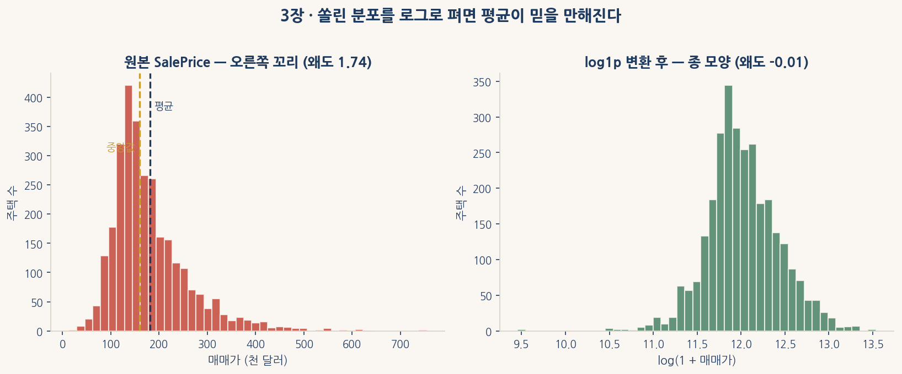
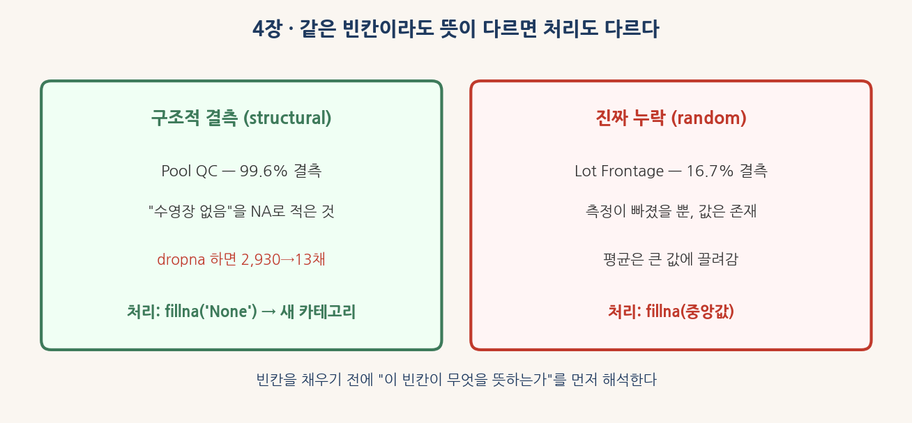
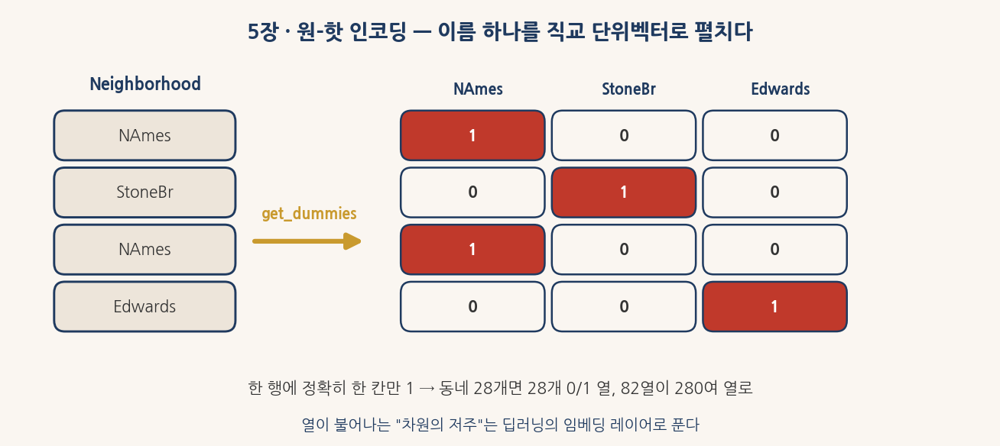
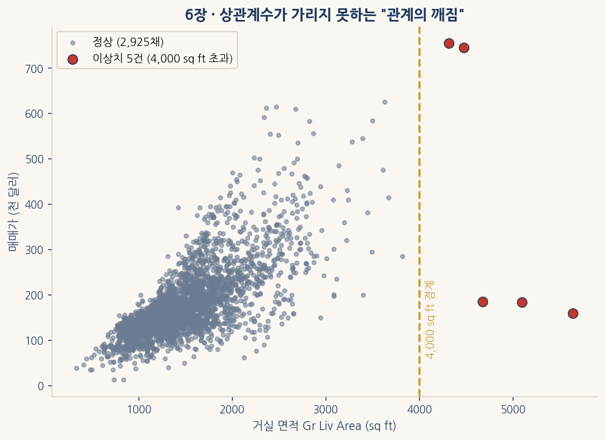
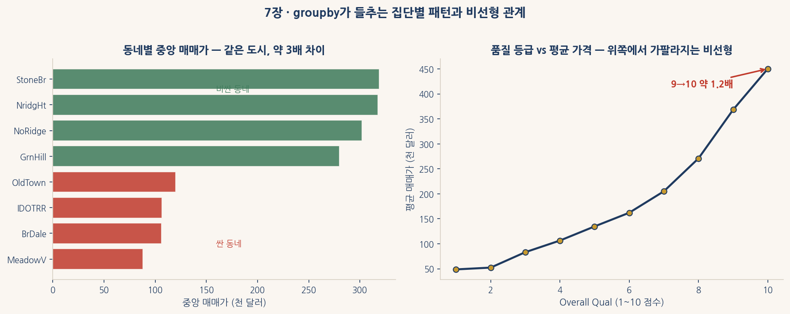
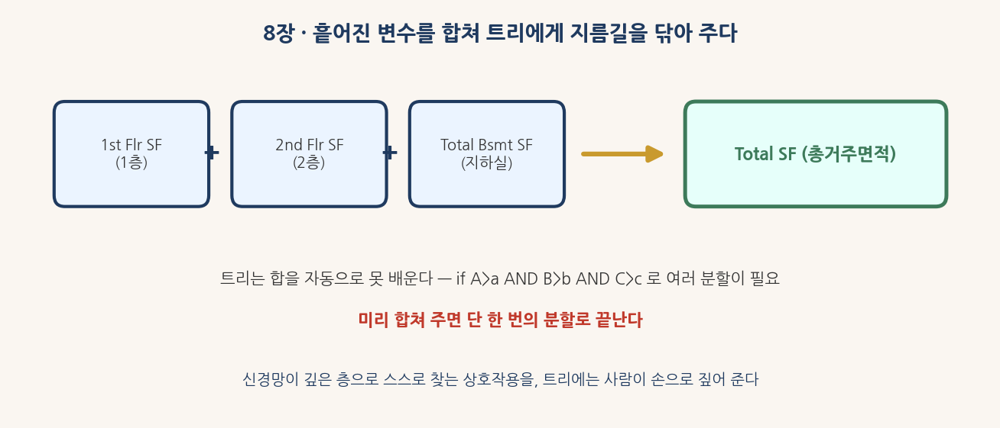

# 1부 읽기 자료 — Ames 주택가격 데이터로 익히는 데이터 마이닝과 pandas

미국 아이오와주 Ames시는 2006년부터 2010년까지 팔린 집 2,930채의 기록을 한 표로 남겼다. 한 줄에 집 한 채가 들어가고, 그 옆으로 거실 면적·차고 종류·지하실 마감·이웃 동네 같은 82개의 항목이 늘어선다. 부동산 가치를 흔드는 거의 모든 요인이 이 한 표에 담겨 있으며, 맨 끝 열 `SalePrice`(매매가)가 우리가 맞히려는 값이다. 이 자료는 캐글 House Prices 경진대회의 정식판(De Cock, 2011)이기도 하다.

트리 한 그루를 키우기 전에 흙부터 만진다. 결측이 어디에 얼마나 숨어 있는지, 변수의 타입이 어떻게 뒤섞여 있는지, 맞혀야 할 가격이 한쪽으로 쏠려 있는지, 어떤 항목이 가격과 손잡고 함께 움직이는지 — 이 네 가지를 손끝으로 알고 나면 어떤 모델이든 제대로 자란다. 자료는 다음 주소에서 직접 읽어 온다.

```
https://raw.githubusercontent.com/leina99-lab/classes/main/AI프로그래밍/data/AmesHousing.csv
```

---

## 1장 데이터의 형태를 한눈에 읽는 법

표 하나를 처음 받으면 가장 먼저 묻는 것은 "얼마나 큰가"다. `df.shape`은 이 물음에 `(2930, 82)`라는 **튜플**(tuple) 하나로 답한다. 앞의 2,930은 행의 수, 뒤의 82는 열의 수다. 행 하나는 집 한 채이고, 열 하나는 그 집을 묘사하는 한 가지 특징이다.

머신러닝의 말로 옮기면 행은 **샘플**(sample), 열은 **피처**(feature)다. 다만 82개 열 가운데 맨 끝 `SalePrice`는 맞혀야 할 정답이므로, 모델에 입력으로 들어가는 피처는 정확히 81개다. 정답 열을 입력에 섞어 넣으면 모델이 답을 베끼는 셈이 되므로, 이 한 칸을 따로 떼어 두는 습관이 첫 단추다.

크기를 알았으면 안을 들여다본다. `df.head(10)`은 위에서 열 줄을, `df.tail(5)`은 아래에서 다섯 줄을 보여 준다. 위아래를 함께 보는 까닭은, 어떤 자료는 정렬되어 있어 앞쪽과 뒤쪽의 성격이 다르기 때문이다. 이어서 `df.info()`는 열마다 비결측 값의 개수와 타입을 한 줄씩 적어 준다. 여기서 타입이 `object`로 적힌 열은 문자열, 곧 범주형 변수다.

`info()`를 읽다 보면 작은 수수께끼 하나를 만난다. 건축 연도 `Year Built`는 `int64`인데, 차고 건축 연도 `Garage Yr Blt`는 `float64`다. 둘 다 연도인데 왜 한쪽만 실수일까. 답은 결측에 있다. `NaN`(Not a Number)은 실수 전용 기호라서, 정수 열에 결측이 단 한 칸만 들어와도 그 열 전체가 `float64`로 끌려 내려간다. 차고가 없는 집은 차고 건축 연도가 비어 있으므로, 그 한 칸의 `NaN`이 열 전체의 타입을 바꿔 놓은 것이다. 타입의 변화는 결측의 그림자다.

마지막으로 `df.describe()`는 수치형 열마다 평균·표준편차·사분위수를 한 표로 정리한다. 이 표에서 평균과 중앙값(50% 분위수)이 크게 벌어진 열을 찾으면, 그 열의 분포가 한쪽으로 쏠려 있다는 신호를 미리 읽을 수 있다.

---

## 2장 수치형과 범주형, 두 종류의 변수

같은 표 안에 살아도 수치형과 범주형은 다른 언어를 쓴다. 거실 면적 1,800은 1,200보다 600만큼 더 넓다는 뜻이 분명하다. 그러나 동네 이름 `NAmes`와 `StoneBr` 사이에는 더하거나 뺄 수 있는 거리가 없다. 앞은 크기를 재는 수치형, 뒤는 이름을 붙이는 범주형이다.

이 둘을 가르는 도구가 `select_dtypes`다. `include="number"`를 주면 수치형 열만, `include="object"`를 주면 문자열 열만 추려 낸다. Ames의 82개 열은 이 잣대로 수치형 39개와 범주형 43개로 갈린다. 두 무리를 깨끗이 나누는 일이 전처리의 출발점인 까닭은, 머신러닝이 둘을 전혀 다른 도구로 다루기 때문이다. 수치형은 그대로 모델에 들어가지만, 범주형은 **원-핫 인코딩**(one-hot encoding)이나 **임베딩**(embedding)을 한 번 거쳐야 비로소 숫자가 된다.

여기에 함정이 하나 숨어 있다. `MS SubClass`는 60, 20, 120 같은 숫자로 적혀 있어 수치형처럼 보이지만, 사실은 주택 유형을 가리키는 **코드**다. 60은 20의 세 배가 아니라 그저 다른 종류라는 뜻이다. 이런 변수를 그대로 두면 모델은 60을 20보다 큰 양으로 오해한다. 그래서 모델에 넣기 전 `astype(str)`로 문자열로 바꾸어 범주형임을 분명히 알려 준다. 숫자처럼 생겼다고 모두 수치형은 아니다 — 그 숫자에 크기의 의미가 있는지를 매번 되묻는다.

---

## 3장 타깃 SalePrice의 비뚤어진 분포

회귀 문제에서 맞혀야 할 값의 분포를 모르면 그다음의 모든 결정이 흔들린다. 그래서 첫 그림은 언제나 `SalePrice`의 히스토그램이다. 막대를 세워 보면 대부분의 집이 십수만 달러에 모여 있고, 오른쪽으로 갈수록 드문드문한 고가 주택이 긴 꼬리를 그린다. 이렇게 한쪽 꼬리가 길게 늘어진 모양을 한 숫자로 요약한 것이 **왜도**(skewness)다.

왜도는 평균을 중심으로 점들이 좌우로 얼마나 비대칭하게 퍼졌는지를 잰다. 표준화한 편차의 세제곱을 평균 낸 값으로,

$$ \text{skew} = \frac{1}{n}\sum_{i=1}^{n} \left(\frac{x_i - \bar{x}}{s}\right)^3 $$

세제곱이라 부호가 살아남는다는 점이 핵심이다. 중앙보다 오른쪽으로 멀리 떨어진 점은 큰 양수를, 왼쪽으로 멀리 떨어진 점은 큰 음수를 보태므로, 합이 양수면 오른쪽 꼬리가 길고 음수면 왼쪽 꼬리가 길다. 0이면 좌우 대칭이다. Ames `SalePrice`의 왜도는 약 1.74로, 오른쪽으로 뚜렷이 쏠려 있다.

쏠린 분포는 `np.log1p`로 펴 준다. 로그는 큰 값일수록 더 세게 누르는 성질이 있어, 멀리 달아난 고가 주택의 꼬리를 안쪽으로 끌어당긴다. 그 결과 종 모양에 가까워지고 왜도가 0에 거의 닿을 만큼(약 −0.01) 내려간다. 식은 $\log1p(x) = \log(1+x)$인데, 1을 더한 까닭은 값이 0인 행이 들어와도 $\log 0 = -\infty$가 나오지 않도록 막기 위해서다.



이 변환은 단순한 미용이 아니다. 캐글 House Prices 대회는 *로그를 씌운 가격*에 대한 **평균 제곱근 오차**(RMSE)를 평가 지표로 쓴다. 비싼 집에서 2만 달러를 틀리는 것과 싼 집에서 2만 달러를 틀리는 것은 무게가 다르다 — 로그 위에서 재면 둘 다 *같은 비율의 오차*로 환산되어, 가격대에 상관없이 공평하게 채점된다. 같은 동기가 신경망 안에도 살아 있다. 각 층의 출력 분포가 한쪽으로 쏠리거나 들쭉날쭉하면 학습이 흔들리는데, **배치 정규화**(Batch Normalization)는 매 층의 출력을 다시 평평하게 펴서 그 흔들림을 잡는다. 분포를 안정시키면 학습이 잘 된다는 직관은 전처리와 신경망에서 같은 얼굴로 나타난다.

---

## 4장 결측치 — 함정과 의미

결측치는 머신러닝의 조용한 폭탄이다. 트리는 빈칸을 그런대로 넘기지만 sklearn의 구현체는 받지 않고, 선형회귀는 빈칸 한 칸에도 학습 자체를 거부한다. 그래서 처리에 앞서 *어디에 얼마나 빠져 있는가*부터 정확히 센다. `df.isna().sum()`은 열마다 빈칸의 개수를 세어 주고, 이를 전체 행 수로 나누면 결측 비율이 나온다.

여기서 가장 중요한 분별이 있다. 모든 빈칸이 같은 빈칸은 아니다. `Pool QC`(수영장 품질)는 99.6%가 비어 있는데, 이는 자료의 오류가 아니라 *대부분의 집에 수영장이 없다*는 사실의 기록이다. 곧 "수영장 없음"을 빈칸으로 적은 **구조적 결측**(structural)이다. 만약 이 열을 보고 `dropna`로 빈칸 있는 행을 모두 지우면, 2,930채 가운데 2,917채를 한꺼번에 잃는다. 멀쩡한 집들이 수영장이 없다는 이유로 통째로 삭제되는 것이다.

반대편에 `Lot Frontage`(도로에 면한 길이)가 있다. 이쪽의 16.7% 결측은 그저 측정이 빠진 **진짜 누락**(random)이다. 모든 집에 도로에 면한 면이 있는데 누군가 적기를 잊은 것이므로, 빈칸을 메워야 한다.

처리 방법은 빈칸의 정체에 따라 갈린다. 구조적 결측은 `fillna("None")`로 채워 *"없음"이라는 별도의 카테고리*를 만든다. 그러면 모델이 "수영장 없음"과 "수영장 있고 품질 우수"를 서로 다른 상태로 학습한다. 진짜 누락은 `fillna(median)`처럼 그 열의 중앙값으로 메운다. 평균 대신 중앙값을 쓰는 까닭은, 3장에서 본 대로 면적·길이 같은 값들이 오른쪽으로 쏠려 있어 평균이 소수의 큰 값에 끌려가기 때문이다. sklearn 파이프라인에서 같은 일을 자동으로 해 주는 도구가 `SimpleImputer` 클래스다. 빈칸을 메우는 일은 칸을 채우는 기계적 작업이 아니라, *그 빈칸이 무엇을 뜻하는가*를 먼저 해석하는 일이다.



---

## 5장 범주형 변수의 다양한 얼굴

범주형 변수를 모델에 넣기 전, 각 범주가 몇 건씩 있는지부터 본다. `value_counts()`는 범주별 등장 횟수를 *빈도 내림차순*으로 정렬한 Series를 돌려준다. 어떤 범주가 한두 건뿐이면 모델은 그 범주를 학습할 표본이 모자라고, 거꾸로 한 범주가 95%를 넘게 차지하면 그 변수는 거의 정보가 없는 셈이다. 가장 흔한 범주만 빠르게 알고 싶다면 `idxmax()`가 *최댓값의 인덱스*, 곧 가장 많이 나온 범주의 이름을 곧장 돌려준다.

분포를 확인했으면 문자열을 숫자로 펼친다. 대부분의 모델은 `"NAmes"` 같은 글자를 직접 받지 못하기 때문이다. **원-핫 인코딩**(one-hot encoding)은 범주형 열 하나를 여러 개의 0/1 열로 펼치는 변환이다. 동네가 28개 범주라면 28개의 0/1 열이 생기고, 한 행에서는 *정확히 한 칸만 1*, 나머지는 모두 0이다. 이렇게 한 칸만 1인 벡터를 **직교 단위벡터**라 부른다. 어느 두 동네를 골라 내적을 구해도 0이 나와, 모델이 동네들 사이에 거짓 순서를 두지 않는다.

`pd.get_dummies`에 `drop_first=True`를 주면 범주마다 열을 하나씩 덜 만든다. 한 행에서 나머지 열이 모두 0이면 빠진 그 범주라는 사실이 자동으로 드러나므로, 굳이 한 열을 더 두면 정보가 겹친다. 이 겹침이 회귀에서 *완벽한 다중공선성*을 일으킨다. 트리 모델은 이 겹침에 무덤덤하지만 선형 계열 모델에는 치명적이라, 어떤 모델을 쓰느냐에 따라 이 한 줄의 선택이 갈린다.

원-핫 인코딩에는 대가가 있다. 범주가 많은 변수일수록 펼친 뒤 열이 빠르게 불어난다. Ames의 82개 열은 모든 범주형을 펼치고 나면 280여 개로 늘어난다. 열이 늘수록 같은 표본으로 채워야 할 공간이 넓어져 모델이 헐거워지는데, 이를 **차원의 저주**(curse of dimensionality)라 부른다. 딥러닝은 이 저주를 다른 길로 푼다. 각 범주를 길고 빈 0/1 벡터 대신 *짧고 빽빽한 실수 벡터*로 옮겨 학습하는데, 이것이 **임베딩 레이어**(embedding layer)다. 비슷한 동네끼리 임베딩 공간에서 가까이 모이도록 학습되어, 0/1의 직교성을 넘어 범주 사이의 닮음까지 담아낸다.



---

## 6장 변수 간 관계와 상관계수

서로 손잡고 움직이는 변수를 찾는 일은 두 가지로 중요하다. 첫째, 타깃과 강하게 함께 움직이는 변수는 좋은 예측자가 된다. 둘째, 입력 변수끼리 너무 닮으면 모델이 둘을 구별하지 못해 회귀에서는 다중공선성을, 트리에서는 변수 중요도의 분산을 일으킨다. 이 닮음을 한 숫자로 재는 잣대가 **피어슨 상관계수**(Pearson correlation)다.

상관계수는 항상 $-1$과 $+1$ 사이에 놓인다. $+1$에 가까울수록 한 변수가 오를 때 다른 변수도 곧게 따라 오르는 강한 양의 선형 관계, $-1$에 가까울수록 한쪽이 오를 때 다른 쪽이 곧게 내려가는 강한 음의 선형 관계, 0에 가까울수록 선형 관계가 없음을 뜻한다. 식으로는 두 변수의 공분산을 각자의 표준편차로 나눈 값이다.

$$ r = \frac{\operatorname{cov}(X, Y)}{s_X\, s_Y} $$

Ames의 상관계수 행렬을 펼치면 가족처럼 닮은 변수들이 드러난다. 차고에 들어가는 차의 수 `Garage Cars`와 차고 면적 `Garage Area`의 상관계수는 약 0.89로, 거의 같은 정보를 두 번 적은 사촌 변수다. 가격과 가장 강하게 묶인 변수는 전반적 품질 `Overall Qual`로, 상관계수가 약 0.80에 이른다.

상관계수는 관계를 한 숫자로 요약하지만, *어디서 그 관계가 깨지는가*는 보여 주지 못한다. 그 깨짐은 산점도로만 보인다. 거실 면적 `Gr Liv Area`와 가격을 점으로 찍으면 대체로 곧은 띠를 이루다가, *거실 면적 4,000 sq ft를 넘는 다섯 채*가 띠에서 멀리 떨어져 나앉는다. 그중 셋은 면적이 거대한데도 가격이 낮은 *관계가 깨진* 점이고, 나머지 둘은 정당하게 비싼 대형 주택이다. 이 다섯 채는 자료를 만든 De Cock이 직접 제거를 권한 유명한 이상치라서, `df["Gr Liv Area"] < 4000` 조건으로 걸러 낸다.



이상치 한두 점이 왜 그토록 위험한지는 부스팅에서 가장 또렷하게 드러난다. 부스팅은 첫 트리가 남긴 큰 **잔차**(residual)를 다음 트리가 집중해서 메우는 방식으로 자란다. 그런데 이상치는 첫 단계에서 거대한 잔차를 남기므로, 두 번째 트리가 그 잔차에 매달려 *극단값 한두 개에만 맞춘 분할*을 만든다. 소수의 비정상 점이 모델 전체의 방향을 끌고 가는 것이다. 그래서 이상치를 먼저 솎아 내는 6장의 작업은, 멀리 떨어진 부스팅 단원의 안정성과 곧장 이어진다.

---

## 7장 groupby로 집단별 패턴 발견하기

`groupby`는 같은 범주의 행들을 한데 묶어 집단별 통계를 계산하는 도구다. 부동산에서 "동네별 평균 가격"은 입지의 가치를 한 표로 압축한다. `df.groupby("Neighborhood")["SalePrice"].agg(["mean", "median", "count"])`처럼 쓰면, 동네마다 평균·중앙값·집의 수가 한 줄씩 정리되어 나온다.

이 표가 드러내는 사실은 놀랍다. 같은 도시 안에서도 가장 비싼 동네인 NoRidge·NridgHt·StoneBr는 평균이 30만 달러를 넘고, 가장 싼 동네인 MeadowV·IDOTRR는 그 3분의 1에 못 미친다. 동네 하나가 가격을 약 세 배까지 가른다. 입지가 곧 값이라는 부동산의 오랜 격언이 한 표로 확인된다.

`groupby`에는 결과의 길이가 다른 두 갈래가 있어 자주 헷갈린다. `.agg("median")`이나 그냥 `.median()`은 *그룹의 수*만큼 짧은 결과를 준다 — 동네가 28개면 28줄이다. 반면 `transform("median")`은 같은 그룹 통계를 *원본 행의 길이 그대로* 펼쳐 돌려준다 — 2,930줄이 그대로 유지된다. 이 차이가 결측을 메울 때 빛난다. `Lot Frontage`의 빈칸을 *그 집이 속한 동네의 중앙값*으로 채우려면, 각 행마다 자기 동네의 값이 짝지어 있어야 하므로 `transform`이 필요하다. 전체 중앙값 하나로 메우는 것보다, 같은 동네의 사정을 반영한 값으로 메우는 편이 훨씬 정확하다.

`groupby`는 비선형 관계를 들추는 데도 쓰인다. 전반적 품질 `Overall Qual`은 1에서 10까지의 점수인데, 등급별 평균 가격을 보면 점수가 9에서 10으로 한 단계 오를 때 평균 가격이 약 1.2배가 되며, 등급이 오를수록 그 간격이 점점 벌어진다. 한 칸씩 똑같이 오르지 않고 위쪽에서 가팔라지는 이런 **비선형** 관계는, 곧은 직선 하나로 맞추는 선형회귀가 놓치고 *구간을 잘라 가며 다른 값을 매기는* 트리가 빛을 발하는 영역이다. 6장의 상관계수가 "곧은 관계의 세기"를 쟀다면, 7장의 groupby는 "곧지 않은 관계의 모양"을 들춘다.



---

## 8장 특성공학 — 모델에게 미리 길을 닦아 주기

Ames에는 면적 변수가 흩어져 있다. 1층 `1st Flr SF`, 2층 `2nd Flr SF`, 지하실 `Total Bsmt SF`, 거실 `Gr Liv Area`가 따로따로 적혀 있는데, 이는 건물 구조를 부분으로 나누어 기록했기 때문이다. 도메인 지식이 일러 주는 사실은 분명하다 — 가격을 가장 강하게 끄는 것은 흩어진 부분이 아니라 *총거주면적*이다. 그래서 1층·2층·지하실을 더한 새 변수 `Total SF`를 만든다. 이 합쳐진 변수는 어느 개별 면적보다 가격과 더 강하게 묶인다.

흩어진 변수를 굳이 손으로 합치는 까닭은 트리의 약점에 있다. 트리는 두 변수를 더한 값을 *자동으로 학습하지 못한다*. "1층이 넓고 그리고 2층도 넓고 그리고 지하실도 넓으면" 같은 효과를 내려면 `if A>a AND B>b AND C>c` 식으로 분할을 여러 단계 거듭해야 한다. 미리 세 면적을 합쳐 주면, 트리는 단 한 번의 분할로 같은 결론에 닿는다. 특성공학은 모델이 먼 길로 돌아갈 것을 *지름길로 닦아 주는* 일이다.

비율 변수도 같은 정신에서 나온다. 방당 면적 `Gr Liv Area / TotRms AbvGrd`이나 평당 가격 같은 변수는, 절대값이 가리는 패턴을 드러낸다. 큰 집과 작은 집을 면적만으로 비교하면 늘 큰 집이 이기지만, *방 하나가 얼마나 넓은가*로 보면 작아도 쾌적한 집이 따로 드러난다. 이런 비율은 두 변수의 곱과 나눗셈이 얽힌 **상호작용**(interaction)을 선형의 형태로 풀어 준 결과다. 신경망은 층을 깊이 쌓아 이런 상호작용을 스스로 찾아내지만, 트리에게는 사람이 손으로 짚어 주어야 한다.

새 변수를 만들 때는 자료의 흠집도 함께 다듬는다. 주택 연령 `House Age = Yr Sold - Year Built`를 만들면, Ames에는 건축 연도가 매매 연도보다 뒤인 *데이터 오류 1건*이 있어 음수가 나온다. `clip(lower=0)`은 0보다 작은 값을 모두 0으로 잘라 이 오류를 막는다. 0으로 나누는 사고도 미리 막는다. 차고 면적이 0인 집에서 밀도를 구하면 분모가 0이 되므로, `np.where(조건, 참일_때, 거짓일_때)`로 *차고가 있을 때만* 나눗셈을 하고 없으면 0을 둔다. 좋은 특성공학은 새 정보를 더하는 동시에, 그 과정에서 생기는 함정을 미리 메운다.



---

## 종합 정리 — 1부에서 손에 익은 것

흙을 다 만졌다. 이 부에서 익힌 도구와 Ames에서 건진 사실을 한 표로 모은다.

| 도구 | 용도 | Ames에서의 발견 |
|---|---|---|
| `shape`·`head`·`info` | 데이터 구조 파악 | 2,930행 × 82열, 결측 있는 열 27개 |
| `describe` | 수치형 요약 | 평균-중앙값 간격으로 비대칭 감지 |
| `select_dtypes` | 타입 분리 | 수치 39 + 범주 43 |
| `hist`·`skew` | 분포 진단 | `SalePrice` 왜도 1.74 |
| `log1p` | 분포 정규화 | 왜도 1.74 → −0.01 |
| `isna().sum()` | 결측 진단 | `Pool QC` 99.6% 결측의 정체 |
| `fillna("None")` | 구조적 결측 처리 | "수영장 없음"을 카테고리로 |
| `value_counts` | 범주 분포 | 동네 28개, 희소 범주 식별 |
| `get_dummies` | 원-핫 인코딩 | 82 → 280여 컬럼 |
| `corr` | 상관계수 | `Overall Qual` r = 0.80이 최강 |
| `groupby`·`transform` | 집단별 통계 | 동네별 중앙값으로 결측 채우기 |
| 산점도 + 이상치 | 관계의 깨짐 발견 | 거실 4,000 sq ft 이상치 5건 |
| 특성공학 | 새 변수 생성 | `Total SF`·`House Age`·비율 변수 |

이 도구들이 가리키는 곳은 한 방향이다. 데이터의 형태를 읽고(1·2장), 타깃을 펴고(3장), 빈칸을 해석하고(4장), 범주를 펼치고(5장), 변수의 관계를 가늠하고(6·7장), 새 변수로 길을 닦는(8장) 흐름 전체가 *모델이 받기 좋은 표*를 만드는 과정이다.

다음 부에서는 이렇게 준비된 표 위에 결정 트리 한 그루를 키운다. 그리고 그 한 그루가 *왜 충분하지 않은가*를 데이터로 확인한 뒤, 그 한계를 넘어 수백 그루를 한꺼번에 키우는 **배깅**(bagging)과 랜덤 포레스트로 넘어간다. 한 그루의 흔들림을 여러 그루의 평균으로 잠재우는 그 발상이, 지금 만진 흙 위에서 자란다.
