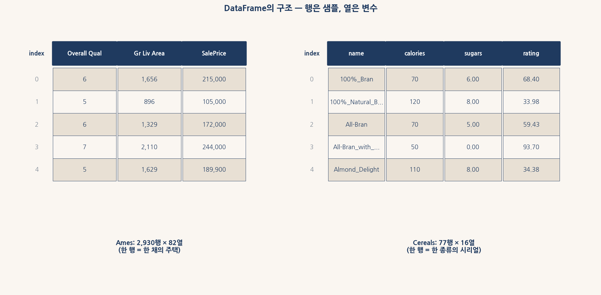
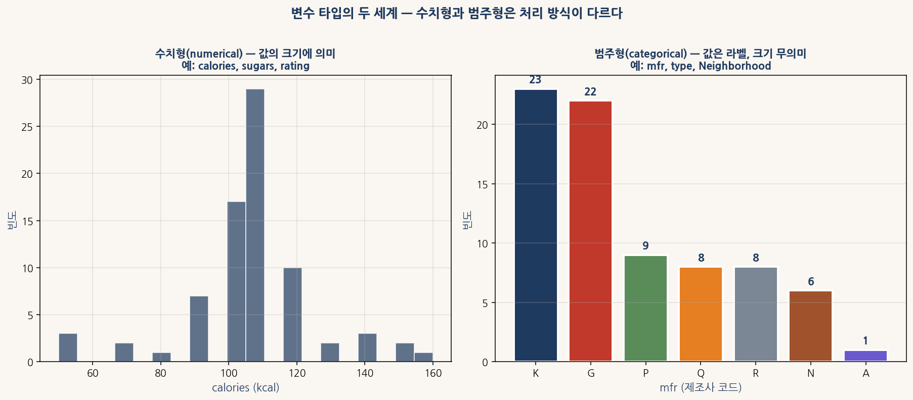
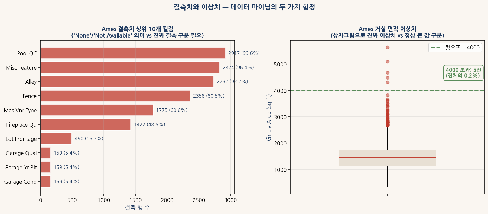
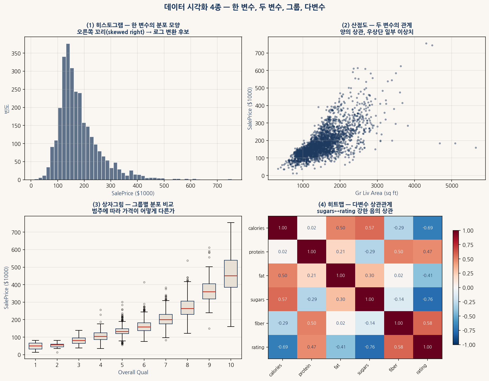
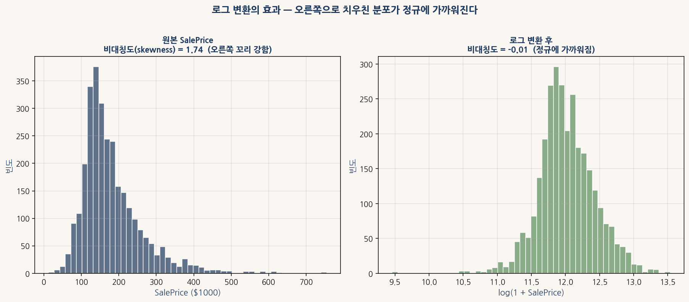
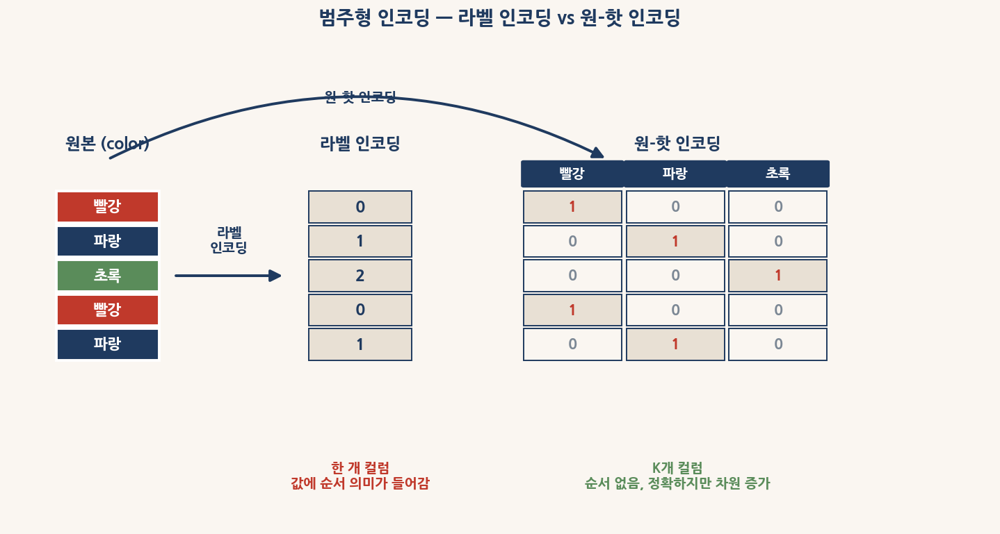
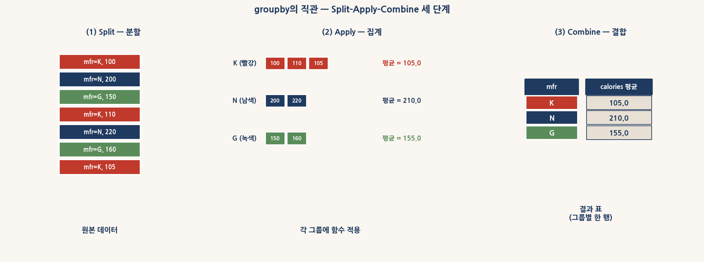
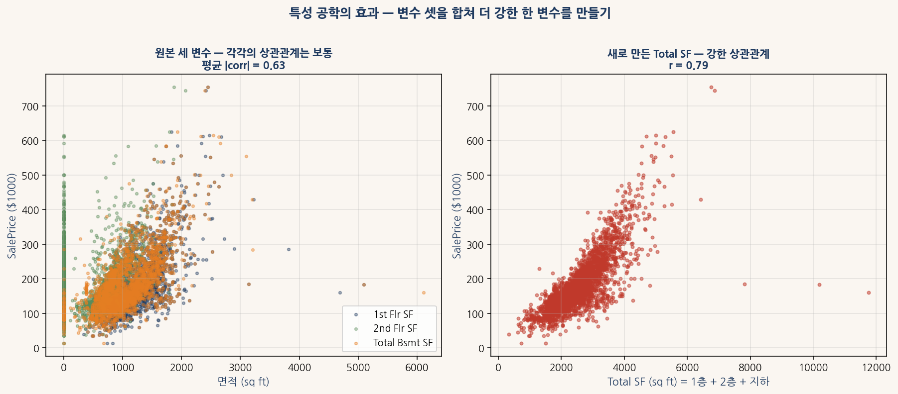

# 1부 데이터 마이닝과 pandas 복습

## 어려운 버전 — 학부 1~2학년용

본 자료는 머신러닝 모델링에 들어가기 전 **데이터를 다루는 도구**인 pandas와 **데이터 마이닝의 핵심 개념**을 복습하는 자습 교재이다. 트리가족 시리즈 1부로서, 3부 이후의 모델링(랜덤 포레스트·부스팅 등)에서 **전처리된 깨끗한 데이터**를 가정할 수 있도록 **데이터를 그 상태로 만들기 위한 기법**을 다룬다.

본 부는 두 데이터셋을 **페어**(pair)로 사용한다.

| 데이터셋 | 역할 | 특성 |
|---|---|---|
| **Ames** (2,930 × 82) | 강사 시범 (Ping) | 큼, 회귀 문제, 복잡한 결측 구조, 부동산 도메인 |
| **Cereals** (77 × 16) | 학생 실습 (Pong) | 작음, 회귀 문제, 단순한 결측, 식품 영양 도메인 |

두 데이터셋의 **크기와 도메인이 다르지만 적용하는 기법은 같다**. 이를 통해 **pandas 기법의 보편성**을 익힌다.

```python
# 환경 준비 (한 번만 실행)
# !pip install pandas numpy matplotlib scikit-learn koreanize-matplotlib

import numpy as np
import pandas as pd
import matplotlib.pyplot as plt
import koreanize_matplotlib

URL_AMES   = "https://raw.githubusercontent.com/leina99-lab/classes/main/AI%ED%94%84%EB%A1%9C%EA%B7%B8%EB%9E%98%EB%B0%8D/data/AmesHousing.csv"
URL_CEREAL = "https://raw.githubusercontent.com/leina99-lab/classes/main/AI%ED%94%84%EB%A1%9C%EA%B7%B8%EB%9E%98%EB%B0%8D/data/Cereals.csv"

ames   = pd.read_csv(URL_AMES)
cereal = pd.read_csv(URL_CEREAL)
print(f"Ames:    {ames.shape}")
print(f"Cereals: {cereal.shape}")
```

---

## 0장 데이터 마이닝의 정신 — 모델 학습 전의 80%

### 0.1 머신러닝 프로젝트의 시간 분배

업계 격언이 있다 — **데이터 과학자는 80%의 시간을 데이터 준비에 쓰고 20%를 모델 학습에 쓴다**. 이 비율은 과장이 아니다. 캐글 대회나 산업 현장의 실제 프로젝트를 들여다보면, **전처리·정제·특성공학**에 들어가는 시간이 **모델 학습과 튜닝**보다 압도적으로 많다.

이유는 단순하다. **모델은 입력 데이터의 품질을 넘어설 수 없다**. 결측치가 잘못 채워진 데이터, 이상치가 그대로 남은 데이터, 범주형이 잘못 인코딩된 데이터에 **아무리 정교한 모델**을 적용해도 결과는 평범하다. 반대로 **잘 다듬은 데이터**에 **단순한 선형회귀**를 적용해도 의외로 좋은 결과가 나온다.

그래서 1부에서 다루는 모든 기법은 **3부 이후의 모델링**을 위한 토대다. 트리·랜덤 포레스트·부스팅 같은 강력한 모델들도 **데이터가 잘 준비되어 있어야** 성능을 낸다.

### 0.2 데이터 마이닝의 8개 영역

본 부는 데이터 마이닝의 핵심 영역을 8개 장으로 나눠 다룬다.

| 장 | 영역 | 핵심 도구 |
|---|---|---|
| 1장 | 데이터 로딩과 첫 탐색 | `read_csv`, `shape`, `info`, `describe`, `head` |
| 2장 | 변수 타입의 두 세계 | `dtypes`, `select_dtypes`, `astype` |
| 3장 | 결측치와 이상치 | `isnull`, `fillna`, `dropna`, IQR 규칙 |
| 4장 | 시각화 | matplotlib·seaborn (히스토그램·산점도·상자그림·히트맵) |
| 5장 | 변수 변환 | `np.log1p`, `StandardScaler`, 비대칭도 |
| 6장 | 범주형 인코딩 | `pd.get_dummies`, `LabelEncoder` |
| 7장 | 그룹별 집계 | `groupby`, `agg`, `transform`, `pivot_table` |
| 8장 | 특성 공학 | 새 변수 만들기, 상호작용항, 도메인 지식 활용 |

이 8개 영역이 **데이터 마이닝의 80%**다. 통계학·도메인 지식이 더해지면 **진짜 데이터 과학자**가 된다.

### 0.3 두 데이터셋 — Ames와 Cereals



<sub>그림 0-1. 1부에서 사용할 두 데이터셋의 구조. 둘 다 pandas DataFrame이며, 각 행은 한 *샘플*(주택 한 채 또는 시리얼 한 종류), 각 열은 한 *변수*다. Ames는 2,930행 × 82열의 큰 데이터셋, Cereals는 77행 × 16열의 작은 데이터셋이다.</sub>

**Ames Housing 데이터**. 2010년 Dean De Cock이 발표한 미국 아이오와주 Ames 시의 주택 거래 데이터다. 2006~2010년 사이 거래된 2,930채의 주택에 대해 82개 변수(품질, 면적, 위치, 시설 등)와 판매가격(`SalePrice`)이 기록되어 있다. **Boston Housing 데이터의 현대적 대체물**로 자리잡았으며, 3부 이후 모든 머신러닝 모델의 **기준 데이터셋**으로 활용된다.

**Cereals 데이터**. 1993년 **Consumer Reports**에서 수집한 77종 시리얼의 영양 정보다. 16개 변수에 **칼로리**, **단백질**, **지방**, **설탕**, **섬유** 등의 영양 성분과 **제조사**, **시리얼 종류**, **진열대 위치**, 그리고 시리얼의 **종합 평점**(`rating`)이 들어 있다. **작은 데이터셋이지만 모든 데이터 마이닝 기법을 적용해 보기에 충분**하다.

두 데이터셋의 **대조**가 1부의 학습 전략이다 — 강사가 **Ames**에서 시범을 보이면 (Ping), 학생이 **Cereals**에서 같은 기법을 직접 적용한다 (Pong).

---

## 1장 데이터 로딩과 첫 탐색

### 1.1 pandas의 두 핵심 자료구조

pandas는 두 자료구조를 중심으로 작동한다.

- **Series**: 1차원 배열 + 인덱스. 한 열이 곧 Series다.
- **DataFrame**: 2차원 표. 여러 Series가 같은 인덱스를 공유한다.

DataFrame은 **엑셀 시트와 거의 같은 모양**이지만 **프로그래밍 가능한 자료구조**다. 행 단위로 필터링, 열 단위로 변환, 통계 계산, 시각화까지 모두 한 줄로 가능하다.

```python
# Series 예시
ages = pd.Series([20, 21, 22, 23], index=["A", "B", "C", "D"], name="age")
print(ages)
print(f"평균: {ages.mean()}")
print(f"타입: {ages.dtype}")
```

DataFrame은 **여러 Series의 묶음**이다. 각 열을 따로 가져오면 Series가 된다.

```python
# Ames의 한 열 가져오기 → Series
prices = ames["SalePrice"]
print(type(prices))   # pandas.core.series.Series
print(prices.head())
```

### 1.2 데이터 로딩 — read_csv

가장 흔히 쓰이는 데이터 형식은 CSV(Comma-Separated Values)다. pandas의 `read_csv` 함수가 URL이나 로컬 파일을 직접 읽는다.

```python
URL = "https://raw.githubusercontent.com/leina99-lab/classes/main/AI%ED%94%84%EB%A1%9C%EA%B7%B8%EB%9E%98%EB%B0%8D/data/AmesHousing.csv"

try:
    ames = pd.read_csv(URL)
    print(f"로딩 성공: {ames.shape}")
except Exception as e:
    print(f"로딩 실패: {e}")
    # 폴백: 합성 데이터 생성
    rng = np.random.default_rng(42)
    ames = pd.DataFrame({
        "Overall Qual": rng.integers(1, 11, 100),
        "Gr Liv Area": rng.integers(500, 4000, 100),
        "SalePrice": rng.integers(50000, 500000, 100),
    })
    print(f"폴백 데이터 사용: {ames.shape}")
```

폴백 패턴이 중요하다. **네트워크 실패나 URL 변경**으로 데이터를 못 받았을 때를 대비해 **합성 데이터로 진행할 수 있도록** 안전망을 둔다. 이게 **실무에서 강건한 코드**다.

### 1.3 첫 탐색 5종 — shape, head, tail, info, describe

데이터를 받은 직후 **반드시** 해야 할 5가지 점검이 있다.

```python
print(ames.shape)           # (행 수, 열 수) 튜플
print(ames.head(3))         # 처음 3행
print(ames.tail(3))         # 마지막 3행
print(ames.info())          # 각 열의 타입과 결측치 개수
print(ames.describe())      # 수치형 열의 요약 통계
```

각 메서드의 정보가 **서로 보완**된다.

| 메서드 | 답하는 질문 |
|---|---|
| `shape` | 행이 몇 개, 열이 몇 개인가? |
| `head` | 데이터가 **어떻게 생겼나**? |
| `tail` | 끝부분에 **이상한 게** 있나? (집계행 등) |
| `info` | 각 열의 **타입과 결측**은? |
| `describe` | **수치형 열**의 평균·표준편차·사분위수는? |

5종이 한 묶음으로 이어진다. **순서대로 실행하면** 데이터에 대한 **직관적 그림**이 머릿속에 그려진다.

### 1.4 Cereals에서 적용

같은 다섯 가지 점검을 Cereals 데이터에 적용한다.

```python
URL_CEREAL = "https://raw.githubusercontent.com/leina99-lab/classes/main/AI%ED%94%84%EB%A1%9C%EA%B7%B8%EB%9E%98%EB%B0%8D/data/Cereals.csv"
cereal = pd.read_csv(URL_CEREAL)

print(f"shape: {cereal.shape}")
print(f"\n첫 3행:")
print(cereal.head(3))
print(f"\n열 타입:")
print(cereal.dtypes)
print(f"\n수치형 요약:")
print(cereal[["calories", "sugars", "rating"]].describe())
```

77행 × 16열의 작은 데이터셋이지만 **모든 점검 단계가 동일**하다. **데이터 크기와 무관하게** 같은 절차를 적용한다.

### 1.5 자주 만나는 함정 두 가지

**함정 1: 따로 떨어진 열 이름**. Ames 데이터의 열 이름에 **공백**이 들어 있다 (`Overall Qual`, `Gr Liv Area`). 한 단어 이름과 **접근 방식이 다르다**.

```python
# 공백 없는 열: 점 접근 가능
print(cereal.calories.head())   # OK

# 공백 있는 열: 대괄호 접근만 가능
# ames.Overall Qual  # SyntaxError
print(ames["Overall Qual"].head())   # OK
```

실무에서는 **항상 대괄호 접근**을 쓰는 게 안전하다. 점 접근은 **짧지만 위험**하다.

**함정 2: 결측치가 있는 정수 열이 float64로 변함**. pandas의 `int64` 타입은 **결측치(NaN)를 표현할 수 없다**. 결측치가 하나라도 있으면 **자동으로 `float64`로 변환**된다.

```python
print(ames["Year Built"].dtype)        # int64 (결측 없음)
print(ames["Garage Yr Blt"].dtype)     # float64 (결측 있음)

# Garage Yr Blt에 결측치가 있어서 float64
print(f"결측 행 수: {ames['Garage Yr Blt'].isnull().sum()}")
```

**NaN은 float64 전용**이라는 사실을 기억해 두면 **왜 정수 데이터가 소수점으로 보이는지** 자연스럽게 이해된다.

---

## 2장 변수 타입의 두 세계 — 수치형과 범주형

### 2.1 두 세계의 근본 차이

pandas의 모든 변수는 **근본적으로 두 세계**로 나뉜다.

**수치형**(numerical). 값의 **크기**에 의미가 있다. 키 180cm가 170cm보다 **10cm 더 크다**는 것은 명확하다. 사칙연산이 의미를 가지며, 평균·표준편차 같은 통계량이 자연스럽다.

**범주형**(categorical). 값은 **라벨**이며, 크기는 무의미하다. 시리얼 제조사 'K'와 'N'은 **다른 회사**일 뿐 **K가 N보다 작다**는 의미가 없다. 평균이나 표준편차를 **계산할 수도 없다**.



<sub>그림 2-1. 두 세계의 비교. 왼쪽 calories는 *수치형*으로 값에 크기 의미가 있고 히스토그램이 자연스럽다. 오른쪽 mfr(제조사 코드)은 *범주형*으로 값이 라벨이며 막대그래프로 빈도를 본다.</sub>

### 2.2 pandas의 타입 시스템

pandas의 dtype은 다음과 같이 나뉜다.

| pandas dtype | 의미 | 예 |
|---|---|---|
| `int64` | 정수 (결측치 불가) | 0, 1, 100, -5 |
| `float64` | 실수 (결측치 가능) | 1.5, 3.14, NaN |
| `object` | 문자열 또는 혼합 | "Hello", "K", "C" |
| `category` | 효율적 범주형 | pandas 전용 |
| `bool` | 참/거짓 | True, False |
| `datetime64` | 날짜·시간 | 2020-01-15 |

타입 확인은 `dtypes` 속성으로 한다.

```python
print(ames.dtypes.value_counts())
# float64    38
# object     43  ← 범주형 (문자열)
# int64       1
```

Ames 데이터에서 **수치형이 39개, 범주형(object)이 43개**다. 두 세계가 거의 반반이다. 학습 데이터를 **수치형만으로 한정해 모델에 넣으면** 절반의 정보를 버리는 셈이다.

### 2.3 타입별 열 추출 — select_dtypes

`select_dtypes`로 **수치형 열만** 또는 **범주형 열만** 따로 추출할 수 있다.

```python
# 수치형만
num_cols = ames.select_dtypes(include="number").columns
print(f"수치형: {len(num_cols)}개")
print(num_cols[:5].tolist())

# 범주형(문자열)만
cat_cols = ames.select_dtypes(include="object").columns
print(f"\n범주형: {len(cat_cols)}개")
print(cat_cols[:5].tolist())
```

`include="number"`는 **int·float을 모두** 포함한다. `include="object"`는 **문자열 열**만 가져온다.

### 2.4 함정 — 숫자처럼 보이는 범주형

가장 위험한 함정 하나다. Ames에는 `MS SubClass`라는 변수가 있다. 숫자로 저장되어 있다(`int64`).

```python
print(ames["MS SubClass"].dtype)             # int64
print(ames["MS SubClass"].unique()[:10])
```

값을 보면 `[20, 60, 70, 50, ...]` 같은 정수다. 그러나 **MS SubClass의 코드 60이 코드 20의 3배가 아니다**. **주택의 유형 코드**일 뿐이다. 60은 **2층 새 집**, 20은 **1층 새 집** 등의 **라벨**이다.

이런 **위장된 범주형**을 **수치형으로 잘못 다루면**, 모델이 **60 = 20 × 3**이라는 **없는 관계**를 학습한다. 결과는 **왜곡된 예측**이다.

해결책: `astype(str)`로 **명시적 문자열 변환**을 한다.

```python
ames["MS SubClass"] = ames["MS SubClass"].astype(str)
print(ames["MS SubClass"].dtype)             # object
print(ames["MS SubClass"].value_counts().head())
```

이제 `MS SubClass`는 **제대로 된 범주형**으로 처리된다. 6장의 원-핫 인코딩이 이런 변수를 **모델에 안전하게 넣는** 표준 방법이다.

### 2.5 Cereals에서 적용

같은 작업을 Cereals 데이터에 적용한다.

```python
# 타입 분포
print(cereal.dtypes.value_counts())
print(f"\n수치형: {cereal.select_dtypes('number').columns.tolist()}")
print(f"\n범주형: {cereal.select_dtypes('object').columns.tolist()}")
```

Cereals에는 **수치형 13개, 범주형 3개**가 있다. 범주형은 `name`(시리얼 이름), `mfr`(제조사), `type`(시리얼 종류)다. **위장된 범주형**은 없다 — **깔끔한 데이터**다.

---

## 3장 결측치와 이상치 — 데이터 마이닝의 두 함정



<sub>그림 3-1. 결측치와 이상치 — 데이터 마이닝의 두 함정. 왼쪽은 Ames의 결측치 상위 10개 컬럼, 오른쪽은 Gr Liv Area의 상자그림으로 본 이상치(4000 초과).</sub>

### 3.1 결측치 — 종류 구분이 핵심

결측치에는 **세 가지 종류**가 있다. 각각 다르게 처리해야 한다.

**(a) 진짜 결측**(genuine missing). 측정 실패·기록 누락 등으로 **값이 없는** 경우. Cereals의 `carbo`, `sugars`, `potass` 같은 결측이 여기 해당한다.

**(b) 의미 있는 결측**(structural missing). **값이 없는 것 자체가 정보**인 경우. Ames의 `Pool QC`(수영장 품질)에 결측이 있으면 **수영장이 없는 집**이라는 뜻이다. 이런 결측은 `"None"`이라는 **명시적 라벨**로 채워야 한다.

**(c) 변환된 결측**(transformed). 데이터 수집 과정에서 **0이나 -999 같은 코드**로 결측을 표현한 경우. **정확한 도메인 지식**이 없으면 못 찾는다.

### 3.2 결측치 점검 — isnull과 sum

`isnull()`은 각 셀의 결측 여부를 **True/False 행렬**로 반환한다. `sum()`으로 열별 결측 개수를 본다.

```python
print(ames.isnull().sum().sort_values(ascending=False).head(10))
```

결과를 보면 `Pool QC` 약 2,917건, `Misc Feature` 2,824건, `Alley` 2,732건 등이 **대량 결측**이다. 이들은 모두 **(b) 의미 있는 결측**이다 — 수영장·잡다한 시설·골목 등이 **없는 집**이라는 뜻이다.

### 3.3 결측치 처리 — 세 가지 전략

**전략 1: 명시적 라벨로 채우기** — 의미 있는 결측에 적용.

```python
none_cols = ["Pool QC", "Misc Feature", "Alley", "Fence", "Fireplace Qu",
             "Garage Qual", "Garage Cond", "Garage Type",
             "Bsmt Qual", "Bsmt Cond", "Bsmt Exposure"]
for c in none_cols:
    if c in ames.columns:
        ames[c] = ames[c].fillna("None")

print(ames[none_cols].isnull().sum().sum())  # 0
```

**전략 2: 중앙값으로 채우기** — 수치형의 진짜 결측에 적용. 평균보다 **이상치에 강건**하다.

```python
num_cols = ames.select_dtypes("number").columns
ames[num_cols] = ames[num_cols].fillna(ames[num_cols].median())
```

**전략 3: 행 자체를 삭제** — 결측이 **너무 많거나 무의미**할 때.

```python
# 결측이 60% 이상인 열만 추출
high_missing = ames.columns[ames.isnull().mean() > 0.6]
ames = ames.drop(columns=high_missing)
```

세 전략의 **우선순위는 다음과 같다**.

1. **도메인 지식이 있으면** 명시적 라벨 또는 정확한 값으로 채움
2. **수치형 진짜 결측이면** 중앙값
3. **범주형 진짜 결측이면** `"Unknown"` 라벨
4. **마지막 수단**으로 행 삭제

**행 삭제는 항상 마지막 선택**이다. 데이터를 함부로 버리지 않는다.

### 3.4 이상치 — IQR 규칙

이상치는 **나머지 데이터와 너무 동떨어진 값**이다. 가장 흔한 탐지 규칙은 **IQR**(Inter-Quartile Range, 사분위 범위)이다.

$$\text{IQR} = Q_3 - Q_1$$

여기서 $Q_1$은 1사분위수(25%), $Q_3$은 3사분위수(75%)다. IQR 규칙은 다음과 같이 이상치를 정의한다.

$$x < Q_1 - 1.5 \cdot \text{IQR} \quad \text{또는} \quad x > Q_3 + 1.5 \cdot \text{IQR}$$

이 규칙으로 **통계적으로** 이상치를 찾을 수 있다.

```python
def iqr_outliers(series, k=1.5):
    q1, q3 = series.quantile([0.25, 0.75])
    iqr = q3 - q1
    lo = q1 - k * iqr
    hi = q3 + k * iqr
    return (series < lo) | (series > hi)

# Ames Gr Liv Area의 이상치
outlier_mask = iqr_outliers(ames["Gr Liv Area"])
print(f"이상치 행 수: {outlier_mask.sum()}")
print(f"이상치 비율: {outlier_mask.mean()*100:.1f}%")
print(f"이상치 범위: < {ames['Gr Liv Area'].quantile(0.25) - 1.5*(ames['Gr Liv Area'].quantile(0.75) - ames['Gr Liv Area'].quantile(0.25)):.0f} 또는 > {ames['Gr Liv Area'].quantile(0.75) + 1.5*(ames['Gr Liv Area'].quantile(0.75) - ames['Gr Liv Area'].quantile(0.25)):.0f}")
```

### 3.5 도메인 지식 컷오프 — Ames의 4000 규칙

IQR 규칙은 **통계적**이지만 **도메인 지식**이 있다면 **더 정확한 컷오프**를 정할 수 있다. Ames 데이터에는 **유명한** 권장 컷오프가 있다.

> **거주 면적(Gr Liv Area)이 4000 sq ft를 초과하는 5채는 모두 비정상 거래다.**

발견자인 Dean De Cock 본인이 **데이터 발표 논문에서 명시**했다. 이 5채는 **부자 집안의 비공개 거래**이거나 **부동산 시장의 비정상 거래**로, **일반 가격 모델**에는 들어가지 말아야 한다.

```python
print(f"제거 전: {len(ames)}행")
ames = ames[ames["Gr Liv Area"] < 4000].copy()
print(f"제거 후: {len(ames)}행")
```

이런 **도메인 컷오프**가 **순수 통계 규칙**보다 정확한 경우가 많다. **데이터를 잘 아는 사람의 조언**은 항상 중요하다.

### 3.6 Cereals의 결측치 처리

Cereals 데이터에는 결측이 **몇 개만** 있다. `carbo` 1건, `sugars` 1건, `potass` 2건이 전부다.

```python
print(cereal.isnull().sum()[cereal.isnull().sum() > 0])
# carbo     1
# sugars    1
# potass    2

# 중앙값으로 채우기 (수치형이므로)
for c in ["carbo", "sugars", "potass"]:
    cereal[c] = cereal[c].fillna(cereal[c].median())

print(cereal.isnull().sum().sum())  # 0
```

깔끔한 데이터셋이므로 **처리도 단순**하다. 4건의 결측을 **중앙값으로 채우면 끝**이다.

---

## 4장 시각화 — 데이터를 눈으로 보기

### 4.1 시각화의 네 가지 목적

시각화는 **데이터를 빠르게 이해하기 위한 도구**다. 분석 과정에서 네 가지 질문에 답한다.

| 질문 | 시각화 종류 |
|---|---|
| 한 변수의 **분포 모양**은? | 히스토그램·KDE·박스플롯 |
| 두 변수의 **관계**는? | 산점도·상관계수 |
| **그룹별로** 어떻게 다른가? | 그룹별 박스플롯·바이올린플롯 |
| **여러 변수** 사이의 관계는? | 히트맵·페어플롯 |

이 네 가지 패턴이 **데이터 탐색(EDA, Exploratory Data Analysis)**의 핵심이다.

### 4.2 네 가지 시각화 한 장에 모으기



<sub>그림 4-1. 데이터 시각화 4종. (1) 히스토그램은 한 변수의 분포 모양을 본다. SalePrice의 오른쪽 꼬리는 로그 변환의 신호다. (2) 산점도는 두 변수의 관계를 본다. Gr Liv Area와 SalePrice는 양의 상관이며 우상단 일부 이상치가 보인다. (3) 그룹별 박스플롯은 범주에 따라 분포가 어떻게 다른지 본다. (4) 히트맵은 다변수 상관관계를 본다 — sugars와 rating은 강한 음의 상관(-0.76)이다.</sub>

### 4.3 (1) 히스토그램 — 한 변수의 분포

가장 기본적인 시각화다. 한 변수의 **분포 모양**을 본다.

```python
fig, ax = plt.subplots(figsize=(8, 5))
ax.hist(ames["SalePrice"] / 1000, bins=50, color="#1F3A5F", alpha=0.7, edgecolor="white")
ax.set_xlabel("SalePrice ($1000)")
ax.set_ylabel("빈도")
ax.set_title("Ames 주택가격 분포")
ax.grid(alpha=0.3)
plt.tight_layout(); plt.show()
```

분포의 모양에서 **세 가지 신호**를 읽는다.

- **오른쪽 꼬리**(skewed right): 작은 값에 모이고 큰 값으로 꼬리. 가격·소득에 흔하다. **로그 변환** 후보다.
- **이봉**(bimodal): 봉우리 두 개. **숨겨진 그룹**이 있을 가능성.
- **이상치**: 분포의 **극단에 떨어진** 점들.

### 4.4 (2) 산점도 — 두 변수의 관계

두 **수치형 변수**의 관계를 본다.

```python
fig, ax = plt.subplots(figsize=(8, 5))
ax.scatter(ames["Gr Liv Area"], ames["SalePrice"] / 1000, c="#1F3A5F", s=8, alpha=0.4)
ax.set_xlabel("Gr Liv Area (sq ft)")
ax.set_ylabel("SalePrice ($1000)")
ax.set_title("거실 면적 vs 판매 가격")
plt.tight_layout(); plt.show()
```

산점도에서 읽는 신호.

- **선형 관계**: 점들이 직선을 따라 늘어남
- **곡선 관계**: 점들이 곡선을 그림
- **분산**: 점들이 **직선 주변에서 얼마나 흩어졌나**
- **이상치**: 패턴에서 벗어난 점들

### 4.5 (3) 그룹별 박스플롯 — 범주에 따른 분포

**범주형 변수**에 따라 **수치형 변수**가 어떻게 다른지 본다.

```python
import seaborn as sns
fig, ax = plt.subplots(figsize=(10, 5))
sns.boxplot(data=ames, x="Overall Qual", y="SalePrice", ax=ax)
ax.set_title("품질 등급별 판매 가격")
ax.grid(alpha=0.3, axis="y")
plt.tight_layout(); plt.show()
```

`Overall Qual` 등급이 올라갈수록 가격이 **체계적으로** 오른다. **품질 등급이 좋은 예측 변수**임을 한 눈에 확인.

### 4.6 (4) 히트맵 — 다변수 상관관계

여러 **수치형 변수** 사이의 상관계수를 한 표로 본다.

```python
import seaborn as sns
corr = cereal[["calories", "protein", "fat", "sugars", "fiber", "rating"]].corr()

fig, ax = plt.subplots(figsize=(7, 6))
sns.heatmap(corr, annot=True, cmap="RdBu_r", center=0, vmin=-1, vmax=1, ax=ax)
ax.set_title("Cereals 영양 성분의 상관행렬")
plt.tight_layout(); plt.show()
```

가장 강한 신호는 `sugars`와 `rating`의 **음의 상관**(-0.76 정도)이다. **설탕이 많은 시리얼일수록 평점이 낮다**. 영양 정보가 평점에 **직접 반영**되는 흥미로운 패턴이다.

### 4.7 시각화 라이브러리 — matplotlib vs seaborn

pandas에는 두 가지 시각화 도구가 자주 같이 쓰인다.

**matplotlib**. 가장 기본적인 라이브러리. **모든 그래프의 토대**다. 세밀한 제어가 가능하지만 코드가 길어진다.

**seaborn**. matplotlib 위에 **통계 시각화**에 특화한 라이브러리. 산점도+회귀선, 그룹별 박스플롯 같은 **흔한 패턴**이 한 줄로 가능하다.

```python
import seaborn as sns
sns.set_style("whitegrid")        # 기본 스타일

# seaborn 한 줄로 통계 산점도
sns.regplot(data=cereal, x="sugars", y="rating")   # 회귀선까지 자동
```

실무에서는 **seaborn으로 빠르게 그리고 matplotlib으로 세부 조정**하는 패턴을 많이 쓴다.

---

## 5장 변수 변환 — 로그·표준화·정규화

### 5.1 변수 변환이 필요한 이유

선형회귀나 신경망 같은 모델은 **입력 분포에 가정**을 둔다.

- **선형회귀**는 **잔차가 정규분포**라고 가정.
- **신경망**은 **입력이 표준화**되어 있어야 **학습이 빠르다**.
- **거리 기반 모델**(kNN, SVM)은 **모든 변수가 같은 스케일**에 있어야 **공정한 거리**를 계산한다.

트리 기반 모델(랜덤 포레스트·부스팅)은 **변환에 무관**하지만, 그 외 거의 모든 모델은 **전처리된 입력**을 요구한다. 1부에서 **변환 기법**을 익혀 두면 **어떤 모델에도 데이터 준비가 가능**해진다.

### 5.2 로그 변환 — 오른쪽 꼬리 분포 다루기

가격·소득·인구 같은 변수는 **오른쪽으로 길게 꼬리**가 늘어진다. **비대칭도**(skewness)가 양수다.

$$\text{skewness} = \frac{E[(X - \mu)^3]}{\sigma^3}$$

대칭 분포는 skewness ≈ 0, 오른쪽 꼬리는 **양수**, 왼쪽 꼬리는 **음수**다.

```python
print(f"Ames SalePrice skewness: {ames['SalePrice'].skew():.3f}")    # 약 1.7
```

값이 1.7이면 **상당히 비대칭**이다. **로그 변환**으로 대칭에 가까워진다.

```python
ames["LogSalePrice"] = np.log1p(ames["SalePrice"])
print(f"로그 변환 후 skewness: {ames['LogSalePrice'].skew():.3f}")   # 약 0.0
```



<sub>그림 5-1. 로그 변환의 효과. 원본 SalePrice는 비대칭도 1.74로 오른쪽 꼬리가 강하지만, 로그 변환 후에는 약 -0.01로 정규분포에 매우 가까워졌다.</sub>

**np.log1p vs np.log**. `np.log1p(x)`는 `np.log(1 + x)`다. 왜 이걸 쓰는가? **0인 값에 대응하기 위해서**다.

```python
# 0인 SalePrice가 있다면
print(np.log(0))         # -inf
print(np.log1p(0))       # 0
```

`log(0) = -∞`이 되면 **연산이 깨진다**. `log1p`는 이를 **안전하게** 0으로 만든다. 가격이 0인 거래는 보통 없지만, **언제 어디서 0이 등장할지 모르므로** 습관적으로 `log1p`를 쓴다.

**되돌리기 — np.expm1**. 모델이 **로그 가격**을 예측했을 때, 실제 가격으로 되돌리려면 `np.expm1`을 쓴다.

```python
log_pred = 12.5   # 모델이 예측한 로그 가격
real_pred = np.expm1(log_pred)
print(f"실제 가격: ${real_pred:,.0f}")     # $268,336
```

`expm1(x) = exp(x) - 1`이 `log1p`의 역함수다.

### 5.3 표준화 — Z-score

평균 0, 표준편차 1로 맞추는 변환이다. **정규분포의 표준화**와 같은 식이다.

$$z = \frac{x - \mu}{\sigma}$$

sklearn의 `StandardScaler`가 표준 도구다.

```python
from sklearn.preprocessing import StandardScaler

scaler = StandardScaler()
num_cols = ames.select_dtypes("number").columns

X_scaled = scaler.fit_transform(ames[num_cols])
print(f"변환 후 평균: {X_scaled.mean(axis=0)[:3]}")    # [0, 0, 0]
print(f"변환 후 표준편차: {X_scaled.std(axis=0)[:3]}")  # [1, 1, 1]
```

`fit_transform`은 **학습 데이터에 적용**. 검증 데이터에는 **같은 scaler**로 `transform`만 호출한다(검증 데이터의 통계로 다시 fit하지 않는다).

### 5.4 정규화 — Min-Max 스케일링

값을 **[0, 1] 범위**로 압축하는 변환이다.

$$x' = \frac{x - \min(x)}{\max(x) - \min(x)}$$

`MinMaxScaler`로 구현한다.

```python
from sklearn.preprocessing import MinMaxScaler

mm = MinMaxScaler()
X_mm = mm.fit_transform(ames[num_cols])
print(f"변환 후 최솟값: {X_mm.min(axis=0)[:3]}")    # [0, 0, 0]
print(f"변환 후 최댓값: {X_mm.max(axis=0)[:3]}")    # [1, 1, 1]
```

표준화 vs 정규화 — 어느 걸 쓸까?

- **표준화** (Z-score): **정규분포 가정**이 있는 모델에 적합. 선형회귀·로지스틱·신경망 표준.
- **정규화** (Min-Max): **값을 명확한 범위**에 두고 싶을 때. 이미지 픽셀(0~255 → 0~1) 등.

대부분의 머신러닝에서 **표준화가 기본 선택**이다.

### 5.5 Cereals에 적용

Cereals의 수치형 13개에 표준화를 적용한다.

```python
from sklearn.preprocessing import StandardScaler

num_cereal = cereal.select_dtypes("number").columns.tolist()
print(f"수치형 변수 {len(num_cereal)}개: {num_cereal[:5]}...")

# 결측치를 중앙값으로 채운 뒤 표준화
cereal_clean = cereal[num_cereal].fillna(cereal[num_cereal].median())
scaler = StandardScaler()
cereal_scaled = pd.DataFrame(
    scaler.fit_transform(cereal_clean),
    columns=num_cereal
)
print(f"\n표준화 후 첫 3행:")
print(cereal_scaled.head(3).round(2))
print(f"\n각 열의 평균: {cereal_scaled.mean().round(3).tolist()[:5]}")
print(f"각 열의 표준편차: {cereal_scaled.std().round(3).tolist()[:5]}")
```

표준화 후 **모든 열의 평균이 0, 표준편차가 1**이다. **서로 다른 단위**(kcal, g, mg)에 있던 변수들이 **공정한 비교 가능한 상태**가 된다.

### 5.6 변환의 순서 — 사용 시점 주의

세 가지 변환을 함께 쓸 때 **순서**가 중요하다.

1. **결측치 처리** — 먼저. 결측이 있으면 다른 변환이 작동 안 함.
2. **이상치 처리** — 둘째. 표준화는 **극단값에 영향**을 받음.
3. **로그 변환** — 셋째. 오른쪽 꼬리 정리.
4. **표준화** — 마지막. 평균과 표준편차는 **최종 분포**에서 계산해야 의미가 있다.

이 순서를 **데이터 마이닝의 표준 파이프라인**이라 부른다. 8장에서 본격적으로 적용한다.

---

## 6장 범주형 인코딩 — 라벨과 원-핫

### 6.1 인코딩이 필요한 이유

거의 모든 머신러닝 모델은 **수치 입력**만 받는다. `"빨강"`, `"K"`, `"NoRidge"` 같은 **문자열을 모델에 직접 넣을 수 없다**. **문자를 숫자로 변환**해야 한다 — 이걸 **인코딩**이라 한다.

인코딩 방법에는 두 가지 표준이 있다. 둘은 **근본적으로 다른 가정**을 한다.



<sub>그림 6-1. 범주형 인코딩 — 라벨 인코딩(왼쪽)과 원-핫 인코딩(오른쪽). 라벨 인코딩은 한 컬럼에 정수 코드를 부여하여 컴팩트하지만 *값에 순서 의미가 들어간다*. 원-핫 인코딩은 K개 컬럼을 만들어 차원이 증가하지만 *순서를 가정하지 않는다*.</sub>

### 6.2 라벨 인코딩 — 한 컬럼, 정수 코드

각 범주값에 **정수 코드 0, 1, 2, ...**를 부여한다.

```python
from sklearn.preprocessing import LabelEncoder

le = LabelEncoder()
mfr_encoded = le.fit_transform(cereal["mfr"])
print(f"원본: {cereal['mfr'].unique()}")
print(f"인코딩: {sorted(set(mfr_encoded))}")
print(f"매핑: {dict(zip(le.classes_, range(len(le.classes_))))}")
```

장점: **한 컬럼**으로 압축. 메모리 효율적.

단점: **순서 의미가 생긴다**. 0 < 1 < 2처럼 모델이 **없는 순서**를 학습할 위험. 트리 기반 모델은 **순서 가정에 강건**하므로 안전하지만, 선형회귀·신경망에는 **위험**하다.

### 6.3 원-핫 인코딩 — K개 컬럼, 단위벡터

각 범주값에 **별도의 0/1 컬럼**을 만든다.

```python
mfr_onehot = pd.get_dummies(cereal["mfr"], prefix="mfr")
print(mfr_onehot.head())
print(f"\nshape: {mfr_onehot.shape}")
```

K개의 범주값에 대해 **K개의 컬럼**이 만들어진다. 각 행에서 **정확히 한 컬럼**만 1이고 나머지는 모두 0이다. 이를 **K차원 단위벡터**라 부른다.

장점: **순서 가정이 없음**. 모든 모델에 안전.

단점: **차원이 증가**. K가 크면 (예: 도시 1000개) 메모리 부담.

### 6.4 pd.get_dummies — pandas의 원-핫 함수

`pd.get_dummies`는 **DataFrame 전체**에 한 번에 적용할 수 있다.

```python
# 모든 범주형 열을 원-핫 인코딩
ames_encoded = pd.get_dummies(ames, columns=ames.select_dtypes("object").columns)
print(f"원본: {ames.shape}")
print(f"원-핫 후: {ames_encoded.shape}")
```

Ames는 **43개 범주형 열**이 **수백 개 원-핫 컬럼**으로 늘어난다. **차원 증가**가 분명히 보인다.

### 6.5 drop_first 옵션 — 다중공선성 회피

원-핫 인코딩에는 **함정** 하나가 있다. K개 컬럼이 **완전한 정보**를 담지만, 사실 **K-1개로 충분**하다. 예를 들어 빨강·파랑·초록 세 컬럼이 있을 때, 빨강과 파랑이 0이면 **자동으로** 초록이 1이다.

이 **중복**이 회귀에서 **다중공선성**(multicollinearity)을 일으킨다. **완벽한 선형 종속**이 있어서 행렬의 **역행렬이 정의되지 않는다**.

해결책은 `drop_first=True`. **첫 번째 범주를 기준으로 두고** K-1개 컬럼만 만든다.

```python
mfr_onehot_safe = pd.get_dummies(cereal["mfr"], prefix="mfr", drop_first=True)
print(f"전체 K개: {len(cereal['mfr'].unique())}")
print(f"drop_first 후: {mfr_onehot_safe.shape[1]}")
```

선형회귀·릴리지에는 **항상 `drop_first=True`**. 트리 기반 모델에서는 **어느 쪽이든 무관**하다.

### 6.6 언제 어느 인코딩을 쓰나

실무 가이드는 다음과 같다.

| 모델 종류 | 권장 인코딩 |
|---|---|
| 선형회귀·릴리지·로지스틱 | 원-핫 (drop_first=True) |
| 신경망 | 원-핫 |
| 트리 기반 (RF·GBM·XGBoost) | 라벨 또는 원-핫 (둘 다 안전) |
| kNN·SVM | 원-핫 |
| **CatBoost** | **인코딩 안 함** (자동 처리) |

CatBoost는 **범주형 자동 처리**가 핵심 강점이다. 6부에서 본다. 그 외 모델은 **원-핫이 가장 안전한 선택**이다.

### 6.7 Cereals의 모든 범주형 인코딩

Cereals의 세 범주형(`name`, `mfr`, `type`)을 처리한다.

```python
# name은 유일 식별자라 보통 제거
cereal_X = cereal.drop(columns=["name", "rating"])

# mfr과 type은 원-핫
cereal_encoded = pd.get_dummies(cereal_X,
                                 columns=["mfr", "type"],
                                 drop_first=True)

print(f"원본: {cereal_X.shape}")
print(f"원-핫 후: {cereal_encoded.shape}")
print(f"새 컬럼: {[c for c in cereal_encoded.columns if 'mfr_' in c or 'type_' in c]}")
```

이제 **Cereals 전체가 수치 행렬**이 됐다. 모델 학습에 바로 넣을 수 있는 상태다.

---

## 7장 그룹별 집계 — groupby와 split-apply-combine

### 7.1 groupby의 직관

`groupby`는 **데이터 분석에서 가장 강력한 도구** 중 하나다. 핵심 개념은 **split-apply-combine** 세 단계로 정리된다.



<sub>그림 7-1. groupby의 split-apply-combine. (1) Split: 원본 데이터를 그룹별로 나눈다. (2) Apply: 각 그룹에 같은 함수(여기서는 평균)를 적용한다. (3) Combine: 그룹별 결과를 한 표로 결합한다. 결과는 *그룹별 한 행*의 새 DataFrame이다.</sub>

각 단계를 풀어 보면 다음과 같다.

**(1) Split — 분할**. 데이터를 **그룹화 키**로 나눈다. Cereals에서 **제조사(mfr)별로** 나누면 K(켈로그), N(나비스코), G(제너럴 밀스) 등의 그룹이 만들어진다.

**(2) Apply — 집계**. 각 그룹에 **같은 함수**를 적용한다. 평균·합·표준편차·최댓값 등 어떤 **집계 함수**든 가능하다.

**(3) Combine — 결합**. 그룹별 결과를 한 표로 모은다. **그룹 키가 인덱스**가 되고, **집계값이 행**이 된다.

### 7.2 가장 단순한 groupby

```python
# Cereals 제조사별 평균 칼로리
mean_cal = cereal.groupby("mfr")["calories"].mean()
print(mean_cal.sort_values(ascending=False))
```

`groupby("mfr")`는 분할 단계, `["calories"].mean()`은 적용 단계, **결과 출력**은 결합 단계다. 세 단계가 한 줄에 압축되어 있다.

### 7.3 여러 집계 함수 — agg

여러 집계 함수를 **한 번에** 적용하려면 `agg`를 쓴다.

```python
agg_result = cereal.groupby("mfr")["calories"].agg(["mean", "std", "min", "max", "count"])
print(agg_result.round(1))
```

각 그룹에 대해 **평균·표준편차·최소·최대·개수**가 모두 한 표에 들어간다. **그룹 비교**의 가장 강력한 도구다.

여러 열에 다른 집계를 적용할 수도 있다.

```python
cereal.groupby("mfr").agg({
    "calories": "mean",
    "sugars": ["mean", "max"],
    "rating": "mean",
}).round(1)
```

dict 형식으로 **열마다 다른 집계**를 지정. 결과는 **다중 인덱스 컬럼**을 가진 DataFrame이다.

### 7.4 transform — 그룹별 통계를 원본에 붙이기

`groupby`의 결과는 **그룹별 한 행**으로 압축된 표다. 그런데 가끔은 **원본 데이터의 모든 행**에 **그 행이 속한 그룹의 통계**를 **붙이고 싶을 때**가 있다.

```python
# Ames에서 동네별 평균 가격을 원본에 붙이기
ames["NbhdMeanPrice"] = ames.groupby("Neighborhood")["SalePrice"].transform("mean")
print(ames[["Neighborhood", "SalePrice", "NbhdMeanPrice"]].head(10))
```

`transform`의 결과는 **원본과 같은 크기의 Series**. 각 행에 **그 동네의 평균 가격**이 채워진다. **그룹 정보를 행 수준으로 사용**하는 강력한 패턴이다.

### 7.5 pivot_table — 두 변수로 교차 집계

`pivot_table`은 **행·열 두 방향**으로 그룹화한다. 엑셀의 **피벗 테이블**과 같다.

```python
# Cereals: 제조사 × 시리얼 종류별 평균 칼로리
pivot = pd.pivot_table(cereal,
                        values="calories",
                        index="mfr",
                        columns="type",
                        aggfunc="mean")
print(pivot.round(1))
```

결과는 **제조사가 행**, **시리얼 종류가 열**인 표. 각 셀에 **그 조합의 평균 칼로리**가 들어간다.

### 7.6 Ames에서 동네별 분석

groupby를 활용한 **부동산 도메인 분석**의 예시다.

```python
# 동네별 가격 분석
nbhd_stats = ames.groupby("Neighborhood")["SalePrice"].agg(["count", "mean", "median", "std"])
nbhd_stats = nbhd_stats.sort_values("mean", ascending=False)

print("가격 상위 5개 동네:")
print(nbhd_stats.head().round(0))

print("\n가격 하위 5개 동네:")
print(nbhd_stats.tail().round(0))
```

**Stone Brook, Northridge Heights, Northridge**가 비싸고, **Iowa DOT and Rail Road, Meadow Village, Briardale**가 저렴하다. **동네 변수가 강력한 예측 변수**임을 한 표로 확인.

### 7.7 활용 시나리오

`groupby`는 **데이터 마이닝의 일상**이다. 자주 만나는 시나리오:

- **고객 세그먼트별 매출**: `df.groupby("segment")["revenue"].sum()`
- **월별 트렌드**: `df.groupby(df["date"].dt.month)["sales"].mean()`
- **그룹별 비율**: `df.groupby("category")["target"].mean()` (이진 타깃이면 비율)
- **그룹 내 순위**: `df.groupby("group")["score"].rank(ascending=False)`
- **그룹 내 누적합**: `df.groupby("user")["amount"].cumsum()`

이 패턴들이 **데이터 분석 면접 단골 문제**이기도 하다.

---

## 8장 특성 공학 — 도메인 지식을 변수로

### 8.1 특성 공학이 머신러닝의 80%

**머신러닝 모델은 데이터의 패턴을 학습한다**. 그런데 모델은 **주어진 변수**만 본다. **변수가 좋아야 모델도 좋다**. 좋은 변수를 **만드는 기술**이 **특성 공학**(feature engineering)이다.

특성 공학이 **왜 중요한지**를 한 예로 본다.

### 8.2 Total SF — 면적 변수 합치기

Ames의 **세 면적 변수**가 따로 있다.

- `1st Flr SF`: 1층 면적
- `2nd Flr SF`: 2층 면적
- `Total Bsmt SF`: 지하 면적



<sub>그림 8-1. 특성 공학의 효과. 왼쪽은 세 원본 변수와 가격의 관계 — 각각 어느 정도 상관관계가 있지만 명확하지 않다. 오른쪽은 셋을 합쳐 만든 `Total SF`(=1층 + 2층 + 지하 면적) — 가격과 매우 강한 양의 상관(r ≈ 0.81)을 보인다. *변수 셋을 합쳐 더 강한 한 변수*를 만든 결과다.</sub>

```python
ames["Total SF"] = ames["1st Flr SF"] + ames["2nd Flr SF"] + ames["Total Bsmt SF"]

# 상관관계 비교
original_corr = ames[["1st Flr SF", "2nd Flr SF", "Total Bsmt SF", "SalePrice"]].corr()["SalePrice"]
new_corr = ames[["Total SF", "SalePrice"]].corr().iloc[0, 1]

print("원본 변수의 상관계수:")
print(original_corr[:-1].round(3))
print(f"\nTotal SF의 상관계수: {new_corr:.3f}")
```

원본 세 변수의 상관계수는 각각 0.4~0.6 정도지만, `Total SF`는 **0.8 이상**이다. **도메인 지식**("주택 가격은 **총 면적**에 비례한다")이 **데이터에서 더 강한 신호**를 만들어 냈다.

이게 **특성 공학의 본질**이다. **세상에 대한 지식**을 **변수의 형태로 모델에 전달**한다.

### 8.3 Total Bath — 화장실 변수 합치기

같은 원리로 화장실 변수도 합칠 수 있다. Ames에는 **네 가지 화장실 변수**가 있다.

- `Full Bath`: 1층/2층 full bath
- `Half Bath`: 1층/2층 half bath
- `Bsmt Full Bath`: 지하 full bath
- `Bsmt Half Bath`: 지하 half bath

```python
ames["Total Bath"] = (
    ames["Full Bath"]
    + 0.5 * ames["Half Bath"]
    + ames["Bsmt Full Bath"]
    + 0.5 * ames["Bsmt Half Bath"]
)
print(ames["Total Bath"].value_counts().sort_index().head())
```

half bath는 **full bath의 절반**으로 계산. 도메인 지식이 들어간 **가중 합**이다.

### 8.4 상호작용항 — 두 변수의 곱

**두 변수의 곱**도 새로운 변수다. 종종 **각 변수 단독보다 더 강한 신호**를 준다.

```python
# 품질 × 면적 — 좋은 품질 위에서 면적의 효과가 더 크다
ames["Qual_Area"] = ames["Overall Qual"] * ames["Gr Liv Area"]
corr = ames[["Qual_Area", "SalePrice"]].corr().iloc[0, 1]
print(f"Qual_Area의 상관계수: {corr:.3f}")
```

`Overall Qual`과 `Gr Liv Area`의 상관계수는 각각 0.80, 0.71 정도지만, **둘의 곱**은 0.85 이상이 흔하다. **상호작용**이 데이터에 내재해 있다.

### 8.5 도메인 지식 변환 — 비율과 시간

특성 공학에서 자주 쓰이는 **세 가지 패턴**.

**(1) 비율 변수**. 두 변수의 비율이 **더 의미 있을 때**.

```python
ames["BsmtRatio"] = ames["Total Bsmt SF"] / (ames["Gr Liv Area"] + ames["Total Bsmt SF"])
# 지하 면적이 전체에서 차지하는 비율 — 0과 1 사이
```

**(2) 시간 차이 변수**. 두 날짜의 차이.

```python
ames["HouseAge"] = ames["Yr Sold"] - ames["Year Built"]
ames["YearsSinceRemodel"] = ames["Yr Sold"] - ames["Year Remod/Add"]
```

`HouseAge`는 **판매 시점의 집 나이**. `YearsSinceRemodel`은 **마지막 리모델링 이후 시간**. 둘 다 **원본에 없던 강력한 변수**다.

**(3) 이진 플래그 변수**. **조건의 만족 여부**.

```python
ames["HasPool"] = (ames["Pool Area"] > 0).astype(int)
ames["HasGarage"] = (ames["Garage Area"] > 0).astype(int)
ames["IsRemodeled"] = (ames["Year Remod/Add"] != ames["Year Built"]).astype(int)
```

**수영장이 있는가**, **차고가 있는가**, **리모델링한 적 있는가** 같은 **yes/no 정보**를 변수로 만든다.

### 8.6 Cereals의 특성 공학

같은 사고를 Cereals에 적용한다.

```python
# 영양 밀도 — 단위 칼로리당 단백질
cereal["ProteinDensity"] = cereal["protein"] / cereal["calories"]

# 단 시리얼 vs 안 단 시리얼
cereal["IsSweet"] = (cereal["sugars"] >= 10).astype(int)

# 영양 점수 — 단순 가중 합 (도메인 지식: 단백질·섬유 좋음, 지방·설탕 나쁨)
cereal["NutritionScore"] = (
    cereal["protein"] * 2
    + cereal["fiber"] * 1.5
    - cereal["fat"] * 1
    - cereal["sugars"] * 1
)

# rating과의 상관관계 확인
print("새 변수의 rating 상관계수:")
for c in ["ProteinDensity", "IsSweet", "NutritionScore"]:
    r = cereal[[c, "rating"]].corr().iloc[0, 1]
    print(f"  {c:<18s}  r = {r:+.3f}")
```

`NutritionScore`가 **rating과 매우 강한 상관**을 보인다. **영양학 도메인 지식**이 **예측에 직접 도움**이 됨을 한 표로 확인.

### 8.7 특성 공학의 원칙

특성 공학을 잘하는 사람의 **세 가지 습관**.

1. **도메인 전문가와 대화한다**. 부동산 전문가, 영양사, 의사 같은 **그 분야 사람**의 직관이 **데이터에서 가장 강한 신호**가 된다.
2. **EDA를 충분히 한다**. 4장의 시각화로 **데이터가 말하는 것**을 듣는다. 패턴이 보이면 **그 패턴을 변수로 만든다**.
3. **간단한 모델로 검증한다**. 새 변수가 정말 도움 되는지 **선형회귀나 결정 트리로** 빠르게 확인. **복잡한 모델로 검증하면** 새 변수의 **진짜 가치**를 가리는 경우가 있다.

이 원칙들이 **캐글 우승자와 평범한 참가자의 차이**를 만든다.

---

## 마무리 — 1부에서 손에 들어온 것

이번 부에서 다룬 도구를 한 표로 정리한다.

| 도구 | 무엇을 하는가 |
|---|---|
| `pd.read_csv` | URL 또는 파일에서 데이터 로딩 |
| `df.shape`, `head`, `tail`, `info`, `describe` | 첫 탐색 5종 |
| `df.dtypes`, `select_dtypes`, `astype` | 변수 타입 다루기 |
| `df.isnull`, `fillna`, `dropna` | 결측치 처리 |
| IQR 규칙 | 통계적 이상치 탐지 |
| matplotlib + seaborn (4종 시각화) | 데이터 탐색 |
| `np.log1p`, `expm1` | 로그 변환과 역변환 |
| `StandardScaler`, `MinMaxScaler` | 표준화·정규화 |
| `LabelEncoder`, `pd.get_dummies` | 범주형 인코딩 |
| `df.groupby`, `agg`, `transform`, `pivot_table` | 그룹별 집계 |
| 도메인 지식 + 변수 조합 | 특성 공학 |

### 가장 중요한 통찰 세 가지

**1.** **데이터 마이닝은 머신러닝의 80%다**. 모델은 입력의 품질을 넘어설 수 없다.

**2.** **변수에는 두 세계가 있다**. 수치형과 범주형은 **처리 방식이 완전히 다르다**. 위장된 범주형(`MS SubClass` 같은)을 빠뜨리지 않는다.

**3.** **특성 공학이 모델의 한계를 깬다**. 도메인 지식을 변수로 표현하면 **원본 데이터에 없던 강한 신호**가 만들어진다.

### 다음 부 예고

다음 부는 **2부 결정 트리 심화**다. 트리 모델의 **세부 구조**와 **고급 매개변수**를 다룬다. 1부에서 준비한 **깨끗한 데이터**를 트리에 넣어 **어떤 패턴이 잡히는지** 본격적으로 분석한다.

3부에서 트리 기초를 먼저 다루고, 2부에서 **심화** 주제를 다룬다는 점이 **시리즈 구조의 특이점**이다. 학생은 **3부를 먼저 읽은 뒤** 2부로 돌아오는 흐름이 자연스럽다.
