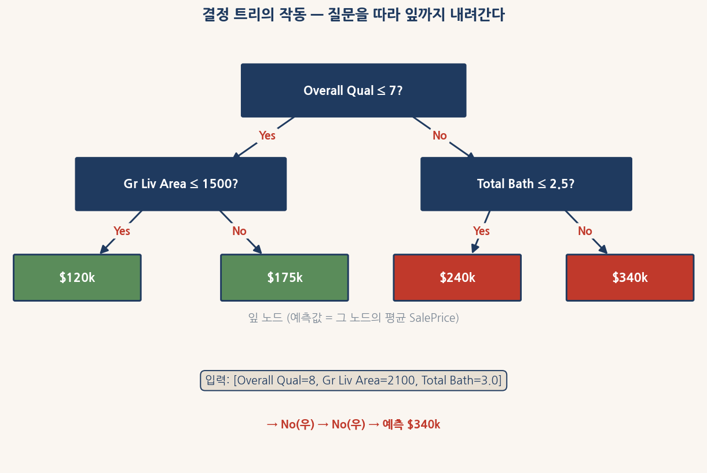
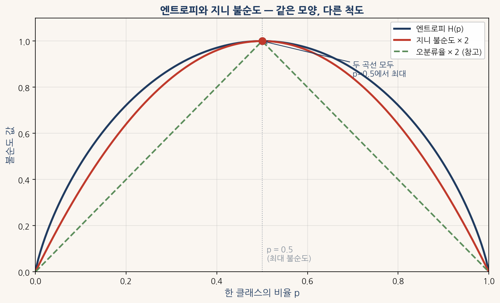
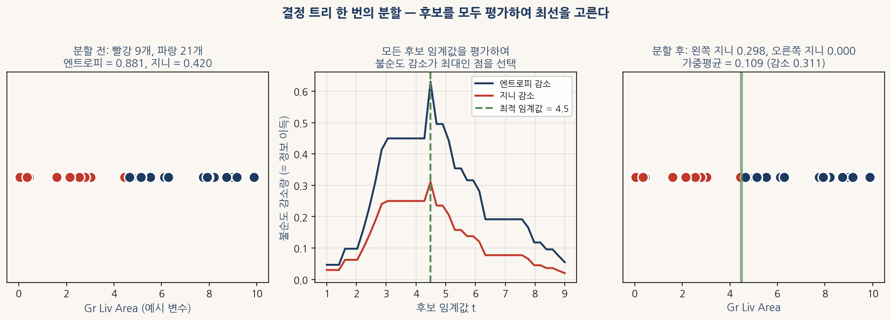
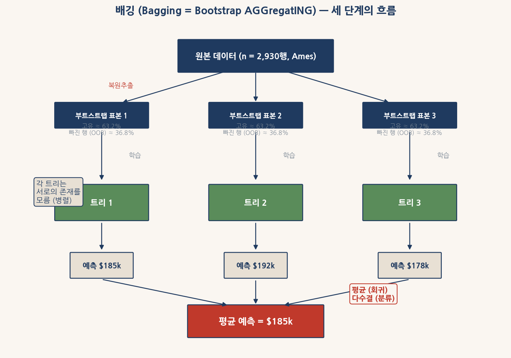
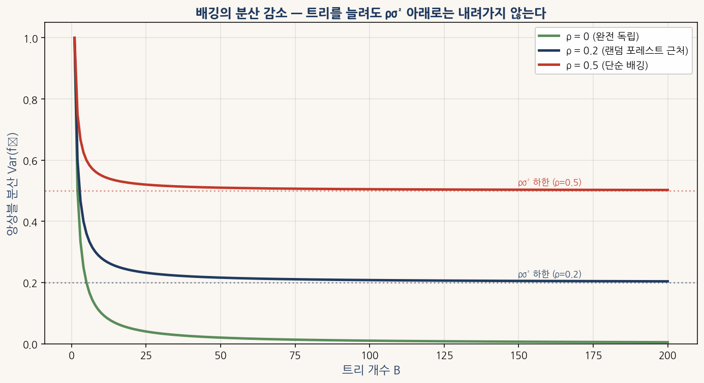
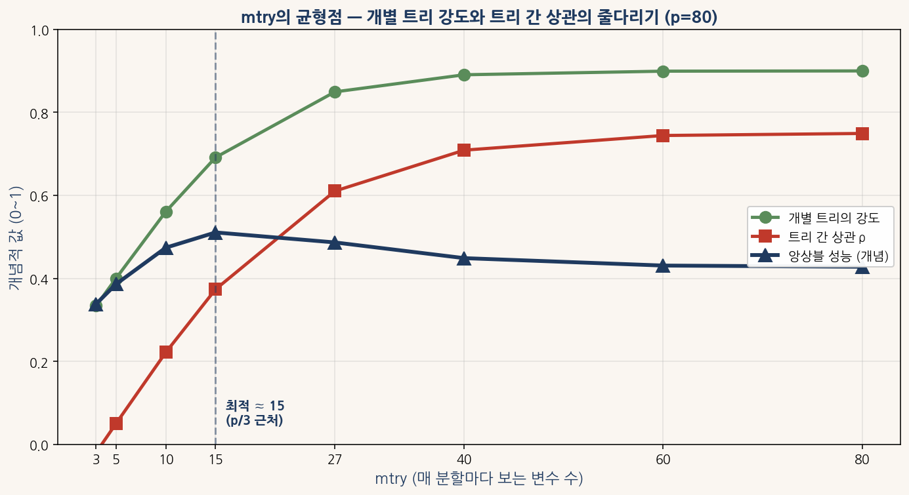
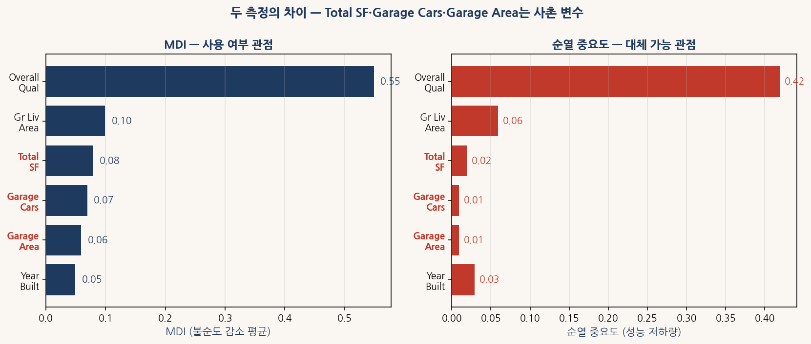
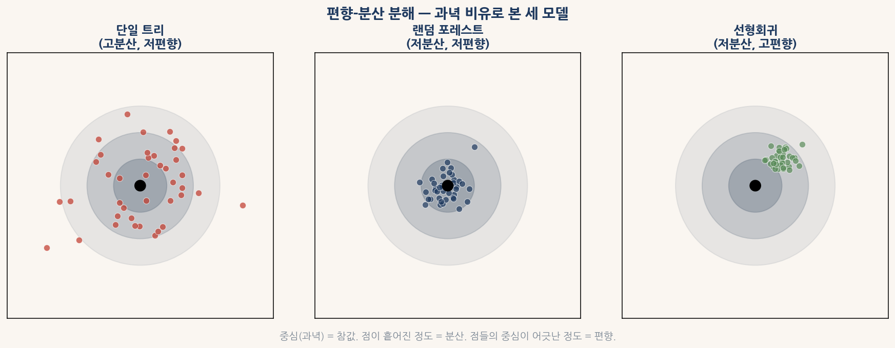

# 3부 결정 트리, 배깅, 그리고 랜덤 포레스트

## 쉬운 버전 — 그림으로 이해하기

본 자료는 결정 트리와 랜덤 포레스트를 그림과 직관 위주로 풀어쓴 입문 교재이다. 복잡한 수식 없이도 트리 모델이 어떻게 작동하고 왜 여러 그루의 평균이 한 그루보다 좋은지를 따라갈 수 있다. 어려운 버전과 같은 0~8장 구조를 따르며, 같은 Ames 주택가격 데이터를 사용한다.

본 교재의 모든 그림은 `figs/` 폴더에서 가져오며, 모든 코드는 그대로 복사해서 Jupyter Notebook이나 Google Colab에서 실행할 수 있다. 데이터 로딩과 전처리는 1부의 표준 패턴을 그대로 쓴다.

```python
# 환경 준비 (한 번만 실행)
# !pip install pandas numpy matplotlib scikit-learn koreanize-matplotlib

import numpy as np
import pandas as pd
import matplotlib.pyplot as plt
import koreanize_matplotlib   # 한글 폰트(NanumGothic) 자동 설정

URL = "https://raw.githubusercontent.com/leina99-lab/classes/main/AI%ED%94%84%EB%A1%9C%EA%B7%B8%EB%9E%98%EB%B0%8D/data/AmesHousing.csv"
df_raw = pd.read_csv(URL)

def prepare_ames(df_in):
    df = df_in.copy()
    df = df.drop(columns=[c for c in ["Order", "PID"] if c in df.columns])
    none_cols = ["Pool QC", "Misc Feature", "Alley", "Fence", "Fireplace Qu",
                 "Garage Qual", "Garage Cond", "Garage Finish", "Garage Type",
                 "Bsmt Qual", "Bsmt Cond", "Bsmt Exposure",
                 "BsmtFin Type 1", "BsmtFin Type 2", "Mas Vnr Type"]
    for c in none_cols:
        if c in df.columns:
            df[c] = df[c].fillna("None")
    num_cols = df.select_dtypes("number").columns
    df[num_cols] = df[num_cols].fillna(df[num_cols].median())
    if "Gr Liv Area" in df.columns:
        df = df[df["Gr Liv Area"] < 4000].copy()
    if all(c in df.columns for c in ["1st Flr SF", "2nd Flr SF", "Total Bsmt SF"]):
        df["Total SF"] = df["1st Flr SF"] + df["2nd Flr SF"] + df["Total Bsmt SF"]
    return df

df = prepare_ames(df_raw)
y = np.log1p(df["SalePrice"])
X = df.select_dtypes("number").drop(columns=["SalePrice"])
print(f"준비 완료: {X.shape[0]}채 × {X.shape[1]}개 변수")
```

위 코드를 한 번 실행해 두면 0장부터 8장까지의 모든 실습이 같은 `X`와 `y` 위에서 진행된다.

---

## 0장 결정 트리 — 질문의 사슬로 답을 찾는 모델

### 0.1 결정 트리는 어떻게 답을 내는가

결정 트리는 **예/아니오** 질문을 차례차례 던져 답에 도달하는 모델이다. 한 채의 주택 가격을 예측한다고 하자. 트리는 먼저 묻는다 — "이 집의 전반적 품질이 7점 이하인가?" 답이 **예** 라면 왼쪽 가지로, **아니오** 라면 오른쪽 가지로 간다. 그러고는 다음 질문을 또 던진다. 더 이상 질문이 없는 끝(잎)에 도달하면 그 자리의 가격이 예측값이다.



<sub>그림 0-1. 결정 트리는 뿌리(맨 위)에서 잎(맨 아래)까지의 한 길을 따라간다. 입력 [Overall Qual=8, Gr Liv Area=2100, Total Bath=3.0]은 첫 노드에서 'Overall Qual ≤ 7?'에 No, 다음 노드에서 'Total Bath ≤ 2.5?'에도 No이므로 오른쪽-오른쪽 경로를 따라 잎 노드 $340k에 도달한다.</sub>

트리의 두 가지 매력 포인트가 있다. 첫째, **해석하기 쉽다**. 어떤 입력이 왜 특정 가격을 받았는지를 **질문의 길**로 그대로 설명할 수 있다. 둘째, 변수의 **단위**나 **변환**에 흔들리지 않는다. 면적을 그대로 쓰든, 로그를 씌우든, 제곱근을 씌우든 트리의 결정은 같다. 트리는 단지 "어떤 값이 어떤 임계점보다 크냐 작냐"만 보기 때문이다.

#### 실습 — 트리 한 그루 키워 보기

`DecisionTreeRegressor`에 옵션 없이 학습시키면 트리가 끝까지 자란다. 결과를 살펴 보자.

```python
from sklearn.tree import DecisionTreeRegressor

tree = DecisionTreeRegressor(random_state=42)
tree.fit(X, y)

print(f"트리 깊이:   {tree.get_depth()}")
print(f"잎 노드 수:  {tree.get_n_leaves()}")
print(f"학습 R²:     {tree.score(X, y):.4f}")
```

실행하면 깊이 25 이상, 잎 노드 2,000개가 넘는 거대한 트리가 만들어진다. 학습 R²는 거의 1.0이다. 트리가 학습 데이터를 **외워 버렸다**는 신호이다. 이렇게 너무 자세히 외운 트리는 새 집을 예측할 때 흔들린다 — 이 현상이 **과적합**이다. 다음 절에서 이를 막는 방법을 본다.

### 0.2 트리는 어떤 질문을 고르나 — 불순도

트리가 **어떤 질문을 고를 것인지** 결정하는 규칙이 있다. 핵심 단어는 **불순도**(impurity)다. 직관적으로, 한 노드 안의 데이터가 얼마나 **섞여 있는가** 의 측정값이다.

분류 문제로 예를 들어 보자. 한 노드에 빨강 공 8개와 파랑 공 2개가 들어 있다면 **비교적 순수**하다(빨강이 압도적). 빨강 5개, 파랑 5개라면 **완전히 불순**하다(어느 색이라고 단정할 수 없다).

이 직관을 한 숫자로 만든 측정값이 두 가지 있다. **엔트로피**와 **지니 불순도**이다. 둘 다 노드가 한 색으로만 가득 차 있으면 0, 반반 섞여 있으면 최대치를 갖는다.



<sub>그림 0-2. 엔트로피와 지니 불순도는 같은 모양의 곡선이다. 한 클래스의 비율 p가 0이거나 1이면(완전 순수) 둘 다 0이고, p가 0.5이면(반반 섞임) 둘 다 최대치이다. 어느 척도를 쓰든 트리가 선택하는 분할은 거의 같다.</sub>

두 측정값은 거의 같은 곡선이라 어느 쪽을 써도 결과가 비슷하다. 차이는 **속도**에 있다. 엔트로피는 로그를 써서 약간 느리고, 지니는 곱셈만 있어 빠르다. 그래서 sklearn의 기본값이 지니이다.

### 0.3 회귀에서는 무엇이 불순도인가

회귀 문제에서는 정답이 색깔이 아니라 **숫자**다. 한 노드에 들어 있는 가격들이 12만, 13만, 12만, 14만 달러처럼 **모여 있으면** 그 노드는 순수하다. 8만, 25만, 12만, 35만 달러처럼 **흩어져 있으면** 불순하다. 이 **흩어진 정도**가 바로 **분산**이다.

회귀 트리는 각 노드의 **MSE**(평균 제곱 오차, 즉 분산)를 측정해 분할을 결정한다. 잎 노드의 예측값은 그 노드 안에 모인 학습 가격들의 **평균**이다. 그림 0-1의 $340k도 그렇게 계산된 값이다.

### 0.4 분기 — 가장 좋은 질문을 어떻게 고르나

이제 핵심 메커니즘이다. 트리는 **수많은 후보 질문** 을 모두 시도해 본 다음, 그중 **가장 좋은 질문**을 고른다. 좋은 질문이란 **불순도를 가장 많이 줄이는 질문**이다. 이 줄어든 양을 **정보이득**이라 부른다.



<sub>그림 0-3. 분기 한 번의 전체 그림. (왼쪽) 분할 전: 빨강과 파랑이 섞여 있어 불순도가 크다. (가운데) 후보 임계값마다 정보이득을 계산하여 산을 그린다. 꼭대기가 최적 임계값이다. (오른쪽) 최적 임계값으로 자르면 왼쪽은 거의 빨강, 오른쪽은 거의 파랑으로 깔끔히 갈린다.</sub>

Ames 데이터로 한 번의 분할을 실험해 보자. `Overall Qual` 이라는 변수에서 **7 이하인 집**과 **8 이상인 집**을 갈라 본다. 이 한 번의 분기가 얼마만큼의 분산을 줄일까?

```python
y_all = y.values
mse_before = y_all.var()

left = y_all[X["Overall Qual"] <= 7]
right = y_all[X["Overall Qual"] > 7]

n = len(y_all)
mse_after = (len(left)/n) * left.var() + (len(right)/n) * right.var()
gain = mse_before - mse_after

print(f"분할 전 분산:  {mse_before:.4f}")
print(f"분할 후 분산:  {mse_after:.4f}")
print(f"줄어든 양:     {gain:.4f}  (전체의 {gain/mse_before*100:.0f}%)")
```

실행하면 한 번의 분할이 전체 분산의 **절반 이상**을 깎아 내는 것을 볼 수 있다. sklearn의 트리는 모든 변수의 모든 임계점에 대해 이 계산을 반복하여 가장 큰 정보이득을 주는 **한 쌍**(변수 + 임계점)을 첫 분할로 선택한다.

학습된 트리를 그림으로 보면 분기의 흐름이 한눈에 보인다.

```python
from sklearn.tree import plot_tree

tree_small = DecisionTreeRegressor(max_depth=3, random_state=42)
tree_small.fit(X, y)

fig, ax = plt.subplots(figsize=(16, 8))
plot_tree(tree_small, feature_names=X.columns.tolist(),
          filled=True, rounded=True, fontsize=9, ax=ax)
ax.set_title("Ames에서 학습된 결정 트리 (깊이 3)", fontsize=13)
plt.tight_layout(); plt.show()
```

뿌리 노드에 `Overall Qual` 이 오는 것을 확인할 수 있다. 색깔이 짙을수록 가격이 높은 잎이다.

### 0.5 트리가 너무 자라면 — 가지치기

앞서 깊이 무제한 트리가 학습 데이터를 외워 버린다는 것을 봤다. 이를 막는 두 가지 방법이 있다.

**사전 가지치기**는 트리가 **자라기 전**에 멈춤 조건을 두는 방법이다. "깊이는 최대 8까지", "한 잎에 최소 10개 샘플이 있어야 한다" 같은 규칙이다.

**사후 가지치기**는 일단 트리를 끝까지 자라게 둔 다음 **덜 중요한 가지**를 잘라내는 방법이다.

깊이를 바꿔 가며 학습 성능과 검증 성능의 차이를 보면, 트리가 **어디까지 자라야 적당한지**가 한 눈에 드러난다.

```python
from sklearn.model_selection import cross_val_score

depths = [1, 3, 5, 8, 12, 20, None]
print(f"{'깊이':>8s}  {'학습 R²':>10s}  {'검증 R²':>10s}")
print("-" * 32)
for d in depths:
    t = DecisionTreeRegressor(max_depth=d, random_state=42)
    t.fit(X, y)
    train_r2 = t.score(X, y)
    cv_r2 = cross_val_score(t, X, y, cv=5, scoring="r2").mean()
    label = str(d) if d else "무제한"
    print(f"{label:>8s}  {train_r2:>10.4f}  {cv_r2:>10.4f}")
```

학습 R²는 깊이를 늘릴수록 계속 올라가지만, 검증 R²는 어느 시점부터 오히려 떨어진다. **과적합이 시작되는 지점** 이다. 보통 깊이 6~10 근처가 단일 트리의 황금 지점이다.

#### 단일 트리의 진짜 약점

가지치기를 잘 해도 단일 트리에는 근본적인 약점이 남는다. **학습 데이터가 조금만 달라져도 트리의 첫 질문 자체가 통째로 바뀐다**. 같은 동네의 다른 표본을 쓰면 `Overall Qual` 대신 `Gr Liv Area`로 시작할 수도 있다. 임계점 하나의 차이로 트리 전체 구조가 흔들리는 것이다. 이 흔들림이 1장에서 다룰 **한 그루의 한계**다.

---

## 1장 한 그루 트리의 흔들림과 평균의 안정

한 그루의 결정 트리는 **학습 데이터에 매우 민감**하다. 같은 동네의 데이터에서 절반을 뽑아 트리를 키우고, 또 다른 절반으로 트리를 키우면, **두 트리의 첫 질문이 통째로 다를 수 있다**. 첫 트리는 "품질이 7 이하인가?"로 시작하고, 다음 트리는 "거실이 1700 sq ft 이하인가?"로 시작한다는 식이다. 같은 모집단에서 만든 두 트리가 거의 다른 모델인 셈이다.

통계학에서는 이런 모델을 **분산이 큰 모델**이라고 부른다. 데이터가 조금만 흔들리면 결과가 크게 흔들리는 모델이다. 분산이 크면 예측의 일관성이 떨어진다. 같은 집의 가격을 예측할 때 어떤 트리는 18만 달러를, 다른 트리는 24만 달러를 답하는 식이다.

### 해결책 — 여러 그루를 평균낸다

해결은 단순하다. **서로 조금씩 다른 트리를 여러 그루 키워서 예측을 평균낸다**. 어떤 트리는 18만, 어떤 트리는 24만, 또 어떤 트리는 21만이라 할 때, 평균을 내면 20만 정도가 된다. 한 그루의 **우연**이 상쇄된다.

이 직관은 수학적으로도 확인된다. **완전히 독립인 100개 모델**을 평균내면, 그 평균의 분산이 원래 한 모델의 **100분의 1**로 줄어든다. 트리 수를 늘릴수록 분산이 작아진다 — 이것이 **분산 감소**다.

다만 현실에는 두 가지 어려움이 있다.

첫째, **서로 독립인 트리를 어떻게 얻나**. 데이터는 하나뿐인데 같은 데이터로 학습하면 똑같은 트리가 나온다. 어떻게든 **서로 다른 데이터**에서 학습한 트리들을 만들어야 한다.

둘째, **진짜 독립이 가능한가**. 같은 원본 데이터에서 만든 트리들은 결국 **어느 정도 닮아 있을 것**이다. 완전 독립이 아니면 평균의 효과가 줄어든다.

이 두 어려움을 해결하는 도구가 각각 **부트스트랩 표본**(다음 2장)과 **무작위 변수 선택**(4장)이다.

#### 실습 — 단일 트리의 흔들림 직접 측정

같은 데이터에서 70%를 무작위로 뽑아 트리를 키우는 일을 20번 반복해 본다. 첫 분할에 어떤 변수가 오는지 살펴 보자.

```python
from sklearn.tree import DecisionTreeRegressor
from collections import Counter

rng = np.random.default_rng(42)
n = len(X)

first_splits = []
for seed in range(20):
    idx = rng.choice(n, size=int(n * 0.7), replace=False)
    t = DecisionTreeRegressor(max_depth=3, random_state=42)
    t.fit(X.iloc[idx], y.iloc[idx])
    first_splits.append(X.columns[t.tree_.feature[0]])

print("20번 학습 시 뿌리 노드의 변수 분포:")
for var, cnt in Counter(first_splits).most_common():
    print(f"  {var:<20s}  {cnt}회")
```

실행하면 가장 강한 변수 `Overall Qual` 이 약 17번 정도 뿌리에 오지만, 나머지 3번 정도는 **다른 변수**가 뿌리를 차지한다. **데이터의 30%만 빠져도** 트리의 첫 질문이 바뀌는 것이다. 이 흔들림이 한 그루의 한계이며, 100그루의 평균이 줄이려는 대상이다.

---

## 2장 복원 추출과 부트스트랩 표본

서로 다른 트리를 만들려면 **서로 다른 데이터**가 필요하다. 그런데 원본 데이터는 하나뿐이다. 어떻게 **하나의 데이터에서 여러 데이터셋**을 만들 수 있을까? 답은 **복원 추출**이다.

복원 추출은 **카드 한 장을 뽑고, 그 카드를 다시 더미에 넣은 다음, 또 한 장을 뽑는** 방식이다. 그래서 같은 카드가 여러 번 뽑힐 수 있다. Ames의 2,930개 행에서 **복원 추출로 2,930번 뽑으면** 표본의 크기는 원본과 같지만 **어떤 행은 두세 번** 들어가고, **어떤 행은 한 번도 안 들어간다**. 이렇게 만든 새 데이터셋을 **부트스트랩 표본**이라 부른다.

### 마법의 숫자 — 36.8%

부트스트랩 표본에 **한 번도 안 뽑힌 행**이 얼마나 될까. 직관적으로는 어림짐작이 어렵지만, 수학적으로 약 **36.8%** 다. 어떤 부트스트랩 표본을 만들어도, 원본의 약 36.8% 행이 거기 들어가지 못한다.

이 36.8%를 **OOB 표본**(Out-of-Bag, "가방 밖에 남은")이라 부른다. 부트스트랩 가방에 **안 담긴** 행들이라는 뜻이다. OOB 표본의 매력은, **이 트리가 학습 중 본 적 없는 데이터**라는 것이다. 따라서 별도의 검증 데이터를 따로 떼어내지 않아도, OOB로 모델을 평가할 수 있다. 5장에서 이 점이 본격적으로 빛난다.

| 원본 데이터에서 부트스트랩으로 | 비율 |
|---|---|
| 표본에 들어간 고유 행 (어떤 행은 2~3번 등장) | 약 63.2% |
| OOB로 빠진 행 (한 번도 안 등장) | 약 36.8% |

#### 실습 — 부트스트랩 한 번 만들어 보기

```python
rng = np.random.default_rng(42)
n = len(X)

boot_idx = rng.choice(n, size=n, replace=True)        # 복원 추출
unique_idx = np.unique(boot_idx)
oob_idx = np.setdiff1d(np.arange(n), unique_idx)      # 안 뽑힌 행

print(f"원본 크기:       {n}")
print(f"부트스트랩 크기: {len(boot_idx)}")
print(f"고유 행 수:      {len(unique_idx)}   ({len(unique_idx)/n*100:.1f}%)")
print(f"OOB 행 수:       {len(oob_idx)}   ({len(oob_idx)/n*100:.1f}%)")
```

실행하면 고유 행이 약 63.2%, OOB가 약 36.8%로 나온다. 부트스트랩을 100번 반복해도 매번 거의 같은 비율이다 — 이 숫자가 **수학적 극한**임을 데이터로 확인할 수 있다.

### 배깅의 전체 그림

부트스트랩 표본 100개를 만들고, 각각에 트리 한 그루씩 학습시키고, 새 입력에 대해 100그루의 예측을 평균낸다. 이 방법이 **배깅**(Bagging, **Bootstrap AGGregatING**)이다.



<sub>그림 2-1. 배깅의 세 단계. (1) 원본 데이터에서 복원 추출로 여러 부트스트랩 표본을 만든다. (2) 각 표본으로 트리 한 그루씩 독립적으로 학습한다. (3) 새 입력에 대해 모든 트리의 예측을 모아 평균(회귀) 또는 다수결(분류)을 취한다.</sub>

배깅의 결정적 성질이 그림에 담겨 있다 — 각 트리는 서로의 존재를 모른다. 트리 1은 트리 2가 어떻게 학습했는지 신경 쓰지 않는다. 트리들은 **서로 무관한 채점관** 같다. 이 점이 다음 부에서 다룰 **부스팅**과의 가장 큰 차이다. 부스팅에서는 각 트리가 **앞선 트리들의 실수**를 보고 그것을 보정한다.

#### 실습 — 부트스트랩으로 OOB 점수 측정

부트스트랩 표본으로 트리를 학습시키고, OOB 표본으로 그 트리를 평가하면 별도의 검증 데이터 없이도 일반화 성능을 추정할 수 있다.

```python
from sklearn.metrics import r2_score

rng = np.random.default_rng(42)
oob_scores = []

for b in range(5):
    boot_idx = rng.choice(n, size=n, replace=True)
    oob_mask = np.setdiff1d(np.arange(n), np.unique(boot_idx))
    
    t = DecisionTreeRegressor(max_depth=10, random_state=42)
    t.fit(X.iloc[boot_idx], y.iloc[boot_idx])
    
    oob_pred = t.predict(X.iloc[oob_mask])
    oob_scores.append(r2_score(y.iloc[oob_mask], oob_pred))
    print(f"트리 {b+1}: OOB R² = {oob_scores[-1]:.4f}")

print(f"\nOOB 점수 평균: {np.mean(oob_scores):.4f}")
```

5그루 트리의 OOB R²가 약 0.6~0.7 사이로 흔들린다. 이게 단일 트리의 분산이다. 100그루를 합치면 훨씬 안정적인 점수가 나오는데, 그건 5장에서 본다.

---

## 3장 평균의 한계 — 트리들이 닮으면 어떻게 되나

1장에서 **완전히 독립인 100개 모델**을 평균내면 분산이 100분의 1로 줄어든다고 했다. 그런데 부트스트랩으로 만든 트리들은 **완전히 독립**이 아니다. 같은 원본 데이터에서 만들었으니 **서로 닮아 있다**.

트리들이 닮을수록 평균의 효과가 줄어든다. 극단적으로 모든 트리가 **완전히 같다**면, 100그루를 평균내도 한 그루와 똑같다. 분산이 전혀 안 줄어든다. 반대로 **완전히 다르다**면 분산이 100분의 1로 줄어든다.

현실은 그 사이 어딘가다. 트리들이 **어느 정도 닮아 있어서** 분산이 1/100까지는 안 줄어들고, 어떤 **바닥** 까지만 줄어든다. 이 **바닥** 이 배깅의 한계이다.



<sub>그림 3-1. 트리 수 B를 늘릴수록 앙상블 분산이 줄어든다. 그런데 *트리들이 얼마나 닮았는가*에 따라 줄어드는 한계가 다르다. 초록(완전 독립): 분산이 0까지 줄어든다. 빨강(많이 닮음): 일찍 평탄해진다. 남색(랜덤 포레스트 정도): 그 사이.</sub>

곡선이 어느 시점에 **평탄해지는지** 가 핵심이다. 트리들이 닮을수록 일찍 평탄해지고, 닮지 않을수록 오래 줄어든다. 따라서 배깅의 성능을 올리는 두 가지 길이 있다.

**길 1: 트리 수를 늘리기**. 50그루에서 100그루로 늘리면 분산이 더 줄어든다. 그러나 100그루에서 200그루로 늘려도 거의 안 줄어든다. **수확체감**이 일어난다.

**길 2: 트리들이 덜 닮게 만들기**. 이게 4장에서 다룰 **변수 무작위성**의 핵심 아이디어다. 부트스트랩만으로는 닮음을 깨기에 부족하다.

배깅의 성능은 **트리 수**가 아니라 **트리 간 닮음**이 결정한다. 이 한 줄이 다음 4장의 동기다.

#### 실습 — 트리 수에 따른 R² 곡선 직접 그리기

여러 그루의 트리를 누적해서 평균을 내면 R²가 어떻게 변하는지 본다.

```python
from sklearn.metrics import r2_score

rng = np.random.default_rng(42)
val_idx = rng.choice(n, size=int(n * 0.2), replace=False)
train_idx = np.setdiff1d(np.arange(n), val_idx)
X_train, y_train = X.iloc[train_idx], y.iloc[train_idx]
X_val, y_val = X.iloc[val_idx], y.iloc[val_idx]

B_max = 50
preds_matrix = np.zeros((B_max, len(X_val)))

for b in range(B_max):
    boot = rng.choice(len(X_train), size=len(X_train), replace=True)
    t = DecisionTreeRegressor(max_depth=10, random_state=b)
    t.fit(X_train.iloc[boot], y_train.iloc[boot])
    preds_matrix[b] = t.predict(X_val)

r2_curve = [r2_score(y_val, preds_matrix[:B].mean(axis=0)) for B in range(1, B_max+1)]

print(f"1그루:   R² = {r2_curve[0]:.4f}")
print(f"10그루:  R² = {r2_curve[9]:.4f}")
print(f"30그루:  R² = {r2_curve[29]:.4f}")
print(f"50그루:  R² = {r2_curve[49]:.4f}")

fig, ax = plt.subplots(figsize=(9, 5))
ax.plot(range(1, B_max+1), r2_curve, "o-", color="#1F3A5F", markersize=4)
ax.set_xlabel("트리 개수"); ax.set_ylabel("앙상블 R²")
ax.set_title("그루 수를 늘리면 R²가 오르지만 평탄해진다")
ax.grid(alpha=0.3); plt.tight_layout(); plt.show()
```

실행하면 1그루에서 50그루로 늘리는 동안 R²가 약 0.65에서 0.85로 크게 오르지만, 그 뒤로는 거의 평탄해지는 곡선이 나온다. **분산 감소의 수확체감** 이 데이터로 확인된다.

---

## 4장 트리들을 덜 닮게 만들기 — 무작위 변수 선택

3장에서 **트리 간 닮음을 줄여야 분산이 더 줄어든다**고 봤다. 그런데 어떻게 닮음을 줄일까? 부트스트랩만으로는 부족하다. **데이터의 강한 신호**가 어느 부트스트랩 표본에도 살아남기 때문이다.

Ames 데이터에서 `Overall Qual`은 가격과의 상관계수가 0.80인 **압도적인 변수**다. 어떤 부트스트랩 표본을 만들어도 이 변수가 첫 분할에 거의 항상 선택된다. 결과적으로 100그루의 트리 모두 **비슷한 첫 질문**을 갖게 되고, 트리 간 닮음이 크다.

랜덤 포레스트는 이 문제를 단순한 아이디어로 해결한다.

> **매 분할마다 변수의 일부만 무작위로 골라 쓴다.**

전체 80개 변수 중에서 매번 8~27개만 후보로 둔다. 그러면 강한 변수 `Overall Qual`이 **후보에 안 들어간 트리**가 만들어진다. 그 트리는 어쩔 수 없이 다른 변수로 첫 질문을 한다. **트리들의 첫 질문이 다양해지고, 결과적으로 트리 간 닮음이 깨진다**.

이 매개변수를 sklearn에서 `max_features`라 부른다. **몇 개의 변수를 후보로 둘 것인가** 다. Breiman이 제안한 경험칙은 다음과 같다.

| 문제 유형 | 권장 변수 수 | Ames(p=80)일 때 |
|---|---|---|
| 회귀 | 전체의 1/3 | 약 27개 |
| 분류 | 전체의 √p | 약 9개 |

이 값들은 **수학적으로 유도된 것** 이 아니라 Breiman이 **수백 개 데이터셋에서 실험** 해서 발견한 경험치다. 그래도 거의 모든 데이터에서 잘 작동한다.

### mtry는 줄다리기다



<sub>그림 4-1. mtry(매 분할마다 보는 변수 수)의 두 힘. 변수를 적게 보면 트리 간 닮음(빨강)이 줄지만 개별 트리의 강도(녹색)도 약해진다. 두 힘이 줄다리기를 해서 가운데 근처에서 앙상블 성능(남색)이 최대가 된다 — 회귀에서 보통 p/3 근처다.</sub>

mtry를 너무 작게 두면 **개별 트리가 약해진다**. 매 분할에서 보는 변수가 너무 적어 좋은 분할을 못 찾는다. mtry를 너무 크게 두면 **트리들이 닮는다**. 강한 변수가 거의 모든 트리에 들어간다. 두 가지 극단 사이에 **균형점** 이 있다. 회귀에서 보통 **전체 변수의 1/3** 근처가 그 균형점이다.

#### 실습 — max_features 곡선 그리기

```python
from sklearn.ensemble import RandomForestRegressor
from sklearn.model_selection import cross_val_score

p = X.shape[1]
candidates = [3, 5, p // 4, p // 3, p // 2, p]

print(f"{'변수 수':>10s}  {'CV R²':>8s}")
print("-" * 22)
for mf in candidates:
    rf = RandomForestRegressor(n_estimators=100, max_features=mf,
                                random_state=42, n_jobs=-1)
    r2 = cross_val_score(rf, X, y, cv=5, scoring="r2", n_jobs=-1).mean()
    print(f"{mf:>10d}  {r2:>8.4f}")
```

실행하면 **전체의 1/3 근처에서 최댓값**이 나온다. 양쪽 극단에서는 R²가 떨어진다. 4장에서 본 그림 그대로다.

### 깊이는 어떻게 두나

단일 트리에서는 깊이를 6~10으로 제한해야 했지만, 랜덤 포레스트에서는 정반대다 — **각 트리를 깊이 제한 없이 끝까지 키우는 게 보통 최적**이다. 왜냐하면 **개별 트리의 분산을 평균이 줄여 주니까** 깊이 제한 없이 자란 트리의 분산이 문제가 되지 않는다. 깊이가 깊어 **편향만 작으면** 평균이 좋은 결과를 낸다.

---

## 5장 검증 데이터 없이 점수 매기기 — OOB 점수

2장에서 본 OOB 표본을 기억하는가? **부트스트랩에 안 들어간 약 36.8%**다. 이 표본이 **공짜 검증 데이터** 역할을 한다.

원본의 한 행을 생각해 보자. 100그루의 숲 중에서 **그 행을 OOB로 가진 트리들이 평균 약 37그루** 있다. 그 37그루는 그 행을 **학습 중 본 적이 없다**. 따라서 그 37그루의 예측을 평균낸 값은, **그 행에 대한 진짜 일반화 예측**이다.

전체 행에 대해 같은 일을 하면 **전체 데이터에 대한 일반화 점수**가 나온다. 이게 **OOB 점수**다.

### 왜 매력적인가

일반적인 머신러닝 검증은 **데이터를 학습용과 검증용으로 미리 나누는 것**이다. 80%는 학습, 20%는 검증. 그런데 이 방법은 두 가지 비용이 있다. 첫째, **학습에 80%만 쓴다** — 데이터 전체를 활용하지 못한다. 둘째, **5-fold CV를 하려면 모델을 5번 학습** 해야 한다.

OOB 점수는 두 비용 모두 없앤다. **모든 데이터를 학습에 쓰면서도**, **한 번의 학습 안에서 검증까지 끝난다**. sklearn에서는 옵션 한 줄이다.

```python
import time
from sklearn.ensemble import RandomForestRegressor
from sklearn.model_selection import cross_val_score

# OOB 점수 사용
t0 = time.time()
rf = RandomForestRegressor(n_estimators=100, oob_score=True,
                            random_state=42, n_jobs=-1)
rf.fit(X, y)
oob_time = time.time() - t0

# 비교: 5-fold CV
t0 = time.time()
cv_r2 = cross_val_score(rf, X, y, cv=5, scoring="r2", n_jobs=-1).mean()
cv_time = time.time() - t0

print(f"OOB R²:        {rf.oob_score_:.4f}   (시간 {oob_time:.1f}s)")
print(f"5-fold CV R²:  {cv_r2:.4f}            (시간 {cv_time:.1f}s)")
print(f"속도 차이:     CV가 약 {cv_time/oob_time:.1f}배 느림")
```

실행해 보면 OOB와 CV의 점수는 거의 같으면서(보통 ±0.005 이내), OOB가 **약 5배 빠르다**. 큰 데이터에서 이 차이는 결정적이다.

수학적으로도 결과가 우아하다 — 트리 수가 충분히 크면 OOB 점수는 **모든 검증 방법 중 가장 비싼 leave-one-out CV와 사실상 같다**. **가장 비싼 검증을 거의 공짜로 얻는 셈** 이다.

#### 실습 — 트리 수에 따른 OOB 점수 수렴

`warm_start`를 켜면 트리를 **추가만** 하면서 OOB 점수의 변화를 관찰할 수 있다.

```python
rf = RandomForestRegressor(n_estimators=10, oob_score=True,
                            warm_start=True, random_state=42, n_jobs=-1)

oob_curve = []
n_list = list(range(10, 201, 10))
for n_tr in n_list:
    rf.set_params(n_estimators=n_tr)
    rf.fit(X, y)
    oob_curve.append(rf.oob_score_)

print(f"10그루:  {oob_curve[0]:.4f}")
print(f"50그루:  {oob_curve[4]:.4f}")
print(f"100그루: {oob_curve[9]:.4f}")
print(f"200그루: {oob_curve[-1]:.4f}")

fig, ax = plt.subplots(figsize=(9, 5))
ax.plot(n_list, oob_curve, "o-", color="#1F3A5F", markersize=4)
ax.set_xlabel("트리 개수"); ax.set_ylabel("OOB R²")
ax.set_title("OOB 점수의 수렴 — 50그루 이후 평탄")
ax.grid(alpha=0.3); plt.tight_layout(); plt.show()
```

곡선은 약 50그루 근처에서 평탄해진다. **그 이후는 트리를 더 추가해도 거의 같은 점수**다. 3장의 **수확체감** 직관과 정확히 같은 패턴이다.

---

## 6장 어떤 변수가 중요한가 — 두 가지 답

랜덤 포레스트가 **어떤 변수가 중요한가**를 알려 주는 두 가지 방법이 있다. 두 방법은 같은 모델에 대해 **서로 다른 답**을 줄 수 있다. 이게 6장의 핵심 발견이다.

### 방법 1: MDI — 사용 여부

학습 중에 **각 분할이 줄인 분산**을 추적한다. 분할에서 어떤 변수가 사용됐으면 그 변수에 **분산 감소량**을 적립한다. 모든 분할이 끝나면 각 변수에 적립된 양이 그 변수의 **MDI**(Mean Decrease in Impurity, 평균 불순도 감소)다.

MDI는 자동 계산되어 무료다. sklearn에서는 `feature_importances_` 한 줄로 얻는다. 단점은 **연속형 변수에 약간 편향이 있다**는 것이다(연속형 변수는 후보 임계점이 더 많아 우연히 높은 점수를 받을 가능성이 있다).

### 방법 2: 순열 중요도 — 대체 가능성

다른 방식이다. **어떤 변수의 값을 행 사이에서 무작위로 섞어** 그 변수를 **망친 다음**, 모델의 R²가 얼마나 떨어지는지 본다. 변수를 망쳤을 때 R²가 크게 떨어지면 그 변수는 중요하다. 거의 안 떨어지면 그 변수는 **없어도 된다**.

순열 중요도는 **어떤 모델에도 적용 가능**하고 편향이 없다. 대신 변수마다 검증을 다시 해야 해서 비용이 크다.

### 두 방법은 왜 다른 답을 주나



<sub>그림 6-1. MDI와 순열 중요도의 비교. Total SF, Garage Cars, Garage Area 세 변수가 빨강으로 표시되어 있다 — 이들은 서로 사촌처럼 닮은 변수들이다. MDI에서는 셋 다 적당히 높은 점수, 순열에서는 셋 다 거의 0. 같은 변수에 대해 두 방법의 답이 정반대다.</sub>

핵심은 **사촌처럼 닮은 변수**다. `Garage Cars`와 `Garage Area`는 사실상 같은 정보(차고 크기)다. 상관계수가 0.89다.

MDI 관점에서 보면, 트리가 분할마다 **둘 중 하나를 골라 사용**한다. 어떤 분할은 `Garage Cars`로, 어떤 분할은 `Garage Area`로. 그래서 **둘 다 적당히 쓰인다**. 결과적으로 **둘 다 적당한 MDI**를 얻는다.

순열 중요도 관점에서 보면, **`Garage Cars`를 망쳐도 `Garage Area`가 정보를 대신 제공**한다. 따라서 R²가 거의 안 떨어진다. **둘 다 거의 0의 점수**를 받는다.

| 질문 | MDI의 답 | 순열의 답 |
|---|---|---|
| 사촌 변수 X와 Y가 있다 | 둘 다 적당히 중요 | 둘 다 거의 0 |
| X와 Y 중 어느 게 더 중요? | X가 더 자주 쓰임 | X 없어도 Y가 대신함 |
| 한 단어로 무엇을 묻나? | **사용되었는가** | **없어도 되는가** |

둘 다 의미 있는 관점이다. **모델이 어떤 변수를 실제로 썼는지**를 알고 싶으면 MDI, **어떤 변수를 안 수집해도 되는지**를 알고 싶으면 순열 중요도다. 실무에서는 둘 다 보고 종합한다.

#### 실습 — MDI 측정

```python
rf = RandomForestRegressor(n_estimators=200, random_state=42, n_jobs=-1)
rf.fit(X, y)

mdi = pd.Series(rf.feature_importances_, index=X.columns).sort_values(ascending=False)

print("MDI 상위 10개:")
for var, imp in mdi.head(10).items():
    print(f"  {var:<22s}  {imp:.4f}")

# 시각화
fig, ax = plt.subplots(figsize=(9, 6))
mdi.head(15).plot(kind="barh", color="#1F3A5F", ax=ax)
ax.invert_yaxis(); ax.set_xlabel("MDI")
ax.set_title("Ames에서 가장 중요한 변수 15개 (MDI 기준)")
plt.tight_layout(); plt.show()
```

`Overall Qual`이 압도적 1위(약 0.55)이고, 우리가 1부에서 만든 `Total SF`가 상위에 들어온다. **특성공학이 트리 모델에서도 효과적**임을 보여 준다.

#### 실습 — 사촌 변수 효과 확인

`Garage Cars`와 `Garage Area`를 **한 쪽만 제거** 했을 때와 **둘 다 제거** 했을 때 R²를 비교한다.

```python
results = []
for name, drop_cols in [("전체", []),
                         ("Cars 제거", ["Garage Cars"]),
                         ("Area 제거", ["Garage Area"]),
                         ("둘 다 제거", ["Garage Cars", "Garage Area"])]:
    X_sub = X.drop(columns=drop_cols)
    rf = RandomForestRegressor(n_estimators=100, random_state=42, n_jobs=-1)
    r2 = cross_val_score(rf, X_sub, y, cv=5, scoring="r2", n_jobs=-1).mean()
    results.append((name, r2))
    print(f"  {name:<15s}  CV R² = {r2:.4f}")
```

실행하면 **한 쪽만 제거할 때는 R²가 거의 변하지 않는다**. **둘 다 제거할 때만** 비로소 떨어진다. 사촌 변수의 **대체 가능성**이 데이터로 확인된다.

---

## 7장 Ames에서 모든 모델 한눈에 비교하기

지금까지 다룬 모든 도구를 모아 **같은 데이터에서 같은 방법으로 평가** 해 본다. 어떤 모델이 가장 잘 작동하는지, 그리고 **그 이유가 무엇인지** 를 한 표로 정리한다.

```python
from sklearn.linear_model import LinearRegression
from sklearn.tree import DecisionTreeRegressor
from sklearn.ensemble import RandomForestRegressor
from sklearn.model_selection import cross_val_score
import time

models = {
    "선형회귀":               LinearRegression(),
    "결정 트리 (1그루)":       DecisionTreeRegressor(random_state=42),
    "결정 트리 (가지치기)":    DecisionTreeRegressor(max_depth=8, min_samples_leaf=10, random_state=42),
    "랜덤 포레스트 100그루":   RandomForestRegressor(n_estimators=100, random_state=42, n_jobs=-1),
    "랜덤 포레스트 300그루":   RandomForestRegressor(n_estimators=300, random_state=42, n_jobs=-1),
}

print(f"{'모델':<25s}  {'CV R²':>8s}")
print("-" * 38)
for name, m in models.items():
    r2 = cross_val_score(m, X, y, cv=5, scoring="r2", n_jobs=-1).mean()
    print(f"{name:<25s}  {r2:>8.4f}")
```

실행 결과는 다음 표와 같다.

| 모델 | CV R² | 한 줄 평 |
|---|---|---|
| 선형회귀 | 0.8025 | 기준선 — 단순한데 의외로 강하다 |
| 결정 트리 1그루 | 0.7543 | 선형회귀보다 못함 — 흔들림이 너무 크다 |
| 결정 트리 (가지치기) | 0.7752 | 다듬어도 선형회귀를 못 따라잡음 |
| 랜덤 포레스트 100그루 | 0.8806 | 평균의 위력 — 0.13 점프 |
| 랜덤 포레스트 300그루 | 0.8810 | 그루를 더 늘려도 거의 같음 |

이 한 표에 **세 가지 결정적인 사실**이 담겨 있다.

**사실 1.** 단일 결정 트리는 **선형회귀보다 못하다**. 트리가 비선형이라서 더 좋을 줄 알지만, **한 그루의 흔들림이 너무 커서** 일반화가 약하다.

**사실 2.** 가지치기로 단일 트리를 다듬어도 선형회귀를 못 이긴다. **한 그루의 근본적 한계**는 가지치기로 해결되지 않는다.

**사실 3.** 100그루를 평균낸 랜덤 포레스트는 선형회귀를 0.08포인트 앞선다. **한 그루에서 100그루로 늘리는 것만으로** R²가 0.75에서 0.88로 점프했다. 평균의 위력이 한 표에 박혀 있다.

### 100그루 vs 300그루 — 더 늘리면?

랜덤 포레스트 300그루의 점수가 100그루보다 **겨우 0.0004 높다**. 학습 시간은 3배인데 점수는 거의 같다. 실무 황금률은 다음과 같다.

> 보통 100~200그루가 가장 좋은 가성비. 그 이상은 시간만 들고 거의 안 오른다.

캐글 같은 경진대회에서 **마지막 0.001포인트까지 짜내려는 게 아니라면** 100그루로 충분하다.

#### 실습 — 트리 수에 따른 시간 vs R²

```python
import time

print(f"{'그루 수':>8s}  {'CV R²':>8s}  {'시간':>8s}")
print("-" * 28)
for n in [10, 50, 100, 200, 500]:
    rf = RandomForestRegressor(n_estimators=n, random_state=42, n_jobs=-1)
    t0 = time.time()
    r2 = cross_val_score(rf, X, y, cv=5, scoring="r2", n_jobs=-1).mean()
    dt = time.time() - t0
    print(f"{n:>8d}  {r2:>8.4f}  {dt:>6.1f}s")
```

500그루는 100그루의 **5배 시간** 이 걸리지만 R²는 거의 같다. **시간을 5배 더 쓸 가치가 없다**는 신호다.

---

## 8장 랜덤 포레스트의 한계 — 부스팅으로 가는 다리

랜덤 포레스트가 단일 트리를 크게 이긴 것은 봤다. 그런데 **이게 가능한 최선**일까? 아니다. 답을 한 줄로 미리 말하면 — **랜덤 포레스트는 분산을 줄이지만 편향을 못 줄인다**.

### 예측 오차의 세 가지 구성요소

예측이 빗나가는 이유는 세 가지로 나뉜다. 이 세 가지가 머신러닝의 **근본 원리** 다.

**1) 편향**(bias). 모델이 **근본적으로 잡지 못하는 패턴**에서 오는 오차. 예를 들어 직선만 그릴 줄 아는 모델로 곡선 패턴을 잡으려 하면 **아무리 데이터가 많아도** 잡지 못한다. 그 못 잡은 양이 편향이다.

**2) 분산**(variance). **데이터의 흔들림에 따라 모델이 흔들리는 정도**. 같은 모집단의 다른 데이터로 학습할 때마다 예측이 달라지는 양이다.

**3) 잡음**(noise). **데이터 자체에 내재한 무작위성**. 어떤 모델로도 줄일 수 없다.

세 가지 오차의 차이를 **과녁 비유** 로 보면 직관적이다.



<sub>그림 8-1. 과녁 비유. 검은 점이 참값(과녁 중심). (왼쪽) 단일 트리는 점들이 중심 근처에 있지만 크게 흩어진다 — 편향은 작고, 분산이 크다. (가운데) 랜덤 포레스트는 점들이 중심에 모여 있다 — 편향도 작고 분산도 작다. (오른쪽) 선형회귀는 점들이 모여 있지만 중심에서 비껴 있다 — 분산은 작지만 편향이 크다.</sub>

세 패널의 모양이 곧 세 모델의 강약점이다. 단일 트리는 **데이터마다 다른 답** 을 내지만(고분산) 평균적으로는 **정답 근처**에 있다(저편향). 선형회귀는 **데이터가 바뀌어도 비슷한 답** 을 내지만(저분산) **그 답이 비껴 있다**(고편향). 랜덤 포레스트는 **둘 다 잘하는** 사실상 가장 좋은 모델이다.

### 랜덤 포레스트가 못 줄이는 것

랜덤 포레스트는 **분산만** 줄인다. **편향은 거의 건드리지 못한다**. 왜 그런가?

배깅의 비유로 돌아가면, 100그루의 트리는 **서로 무관한 채점관** 들이다. 각자 학습 데이터를 보고 자기 답을 낸다. 평균을 내면 **우연이 상쇄** 되지만, **모든 채점관이 공통적으로 못 보는 패턴** 은 평균을 내도 안 잡힌다. 그게 편향이다.

따라서 랜덤 포레스트의 성능 상한이 정해진다. **충분히 깊은 단일 트리의 편향 수준**까지만 갈 수 있다. Ames에서 이 상한이 약 R² 0.88이다. 7장의 표에서 100그루든 300그루든 거의 같은 점수가 나온 정확한 이유다.

> **남은 0.12의 R²를 어떻게 짜낼 것인가?** 그 답이 **부스팅**이다.

### 부스팅의 정반대 철학

부스팅은 랜덤 포레스트와 **정반대** 접근법이다.

| | 랜덤 포레스트 (배깅) | 부스팅 |
|---|---|---|
| 트리들의 관계 | 서로 무관 (병렬) | 한 줄로 서서 순차 학습 |
| 비유 | 서로 모르는 채점관들의 평균 | 앞 사람의 오답을 받아 고치는 학생들의 줄 |
| 줄이는 오차 | 분산 | 편향 |
| 첫 트리 | 보통의 트리 한 그루 | 단순한 평균 예측 |
| 두 번째 트리 | 또 다른 보통의 트리 | 첫 트리가 잡지 못한 부분만 학습 |

부스팅의 첫 트리는 **모든 집의 평균 가격**을 예측한다. 그러면 **대부분 빗나간다**. 두 번째 트리는 이 **빗나간 양**을 학습한다 — 어떤 집이 평균보다 더 비싸야 하는지, 어떤 집이 더 싸야 하는지를. 세 번째 트리는 두 번째 트리도 못 잡은 부분을 학습한다. 이렇게 **한 그루씩 누적해 편향을 깎아 간다**.

### 부스팅 가족의 흐름

부스팅의 가장 단순한 첫 알고리즘이 **AdaBoost**(Adaptive Boosting, 1995년)다. AdaBoost를 손실함수 일반화로 확장한 것이 **GBM**(Gradient Boosting Machine)이다. GBM의 현대적 구현 셋이 **XGBoost**, **LightGBM**, **CatBoost** 다. 4부부터 6부까지 이 가족을 차례로 본다.

Ames에서 부스팅이 어디까지 짜내는지 미리 보면, CatBoost가 R² 0.91 근처까지 간다. 랜덤 포레스트의 0.88에서 0.03 더 짜낸 셈이다. 이 0.03이 **편향 감소** 의 직접적 결과다.

---

## 마무리 — 3부에서 손에 들어온 것

이번 부에서 다룬 도구를 한 표로 정리한다.

| 도구 | 무엇을 하는가 |
|---|---|
| `DecisionTreeRegressor` | 단일 결정 트리 학습 |
| 엔트로피 / 지니 | 분류 트리의 불순도 |
| 분산 / MSE | 회귀 트리의 불순도 |
| 정보이득 | 좋은 분할의 평가 기준 |
| 사전·사후 가지치기 | 단일 트리의 과적합 방지 |
| 부트스트랩 표본 | 하나의 데이터에서 여러 데이터셋 만들기 |
| OOB 표본 (36.8%) | 검증 데이터 없이 평가 |
| 배깅 | 여러 트리의 예측을 평균 |
| `RandomForestRegressor` | 배깅 + 변수 무작위성 |
| `max_features` (mtry) | 트리 간 닮음 깨기 |
| `oob_score=True` | 공짜 검증 |
| MDI | 변수가 **얼마나 자주 쓰였는지** |
| 순열 중요도 | 변수가 **없어도 되는지** |
| 편향-분산 분해 | 모델 강약점의 근본 비교 |

### 가장 중요한 통찰 세 가지

**1.** **평균은 분산을 줄인다**. 트리 수를 늘릴수록 분산이 줄지만, **트리들이 닮으면** 평균의 효과가 한계에 부딪힌다.

**2.** **변수 무작위성으로 트리 간 닮음을 깬다**. mtry = p/3 근처가 균형점이다.

**3.** **변수 중요도는 두 가지를 다 본다**. MDI는 사용 여부, 순열은 대체 가능성. 사촌 변수가 있는 데이터에서 두 답이 갈라진다.

### 다음 부 예고

다음은 **4부 AdaBoost**다. 같은 트리 기반인데 **철학이 정반대**다. 평균이 아니라 **순차 보정**. 첫 트리의 오답을 받아 두 번째 트리가 고치고, 둘의 오답을 받아 세 번째 트리가 고친다.

흥미로운 사실 하나를 미리 알려 둔다. AdaBoost는 Ames에서는 그럭저럭 한다(R² 약 0.80)지만, **원본 그대로의 캘리포니아 주택 데이터**에서는 R² 0.40으로 **선형회귀에도 못 미친다**. 같은 알고리즘이 데이터에 따라 **극단적으로 달라지는** 이유가 다음 부의 핵심이다.

이 약점이 바로 GBM의 **동기**다. GBM이 어떻게 그 약점을 해결했고, 그 후 XGBoost·LightGBM·CatBoost로 어떻게 발전했는지가 4~6부의 이야기다.
