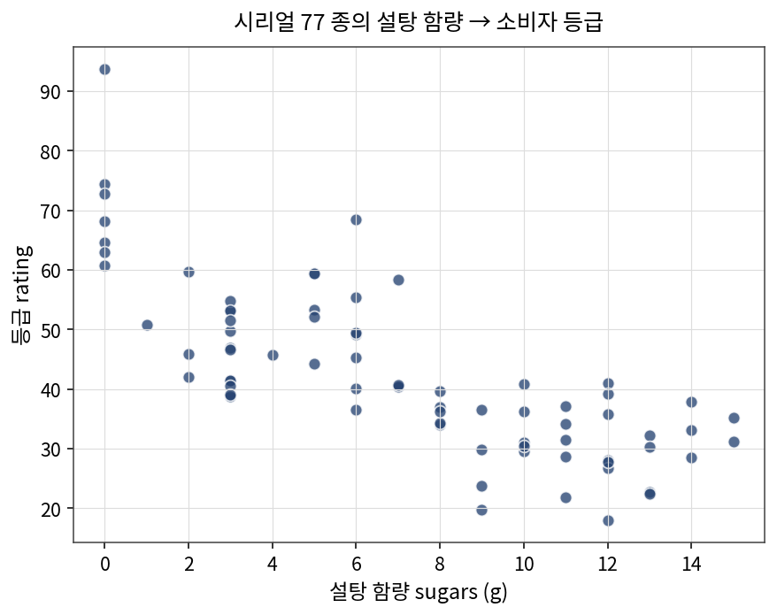
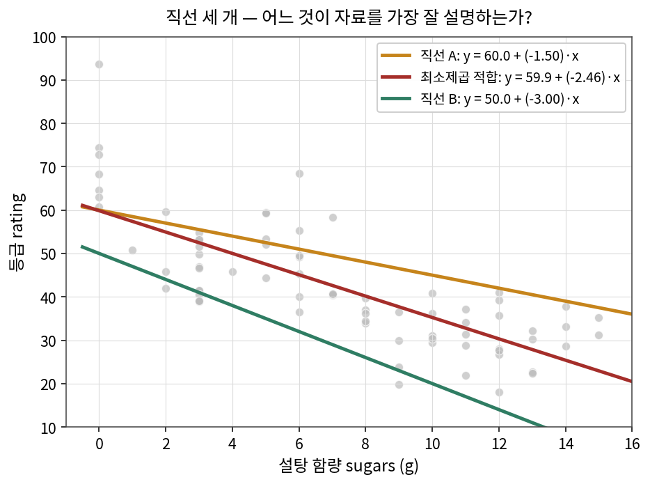
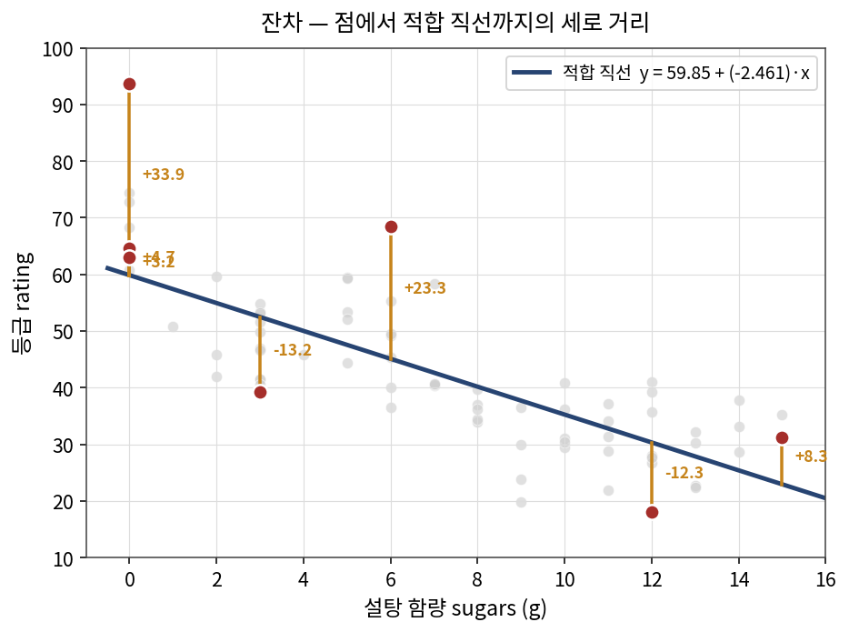
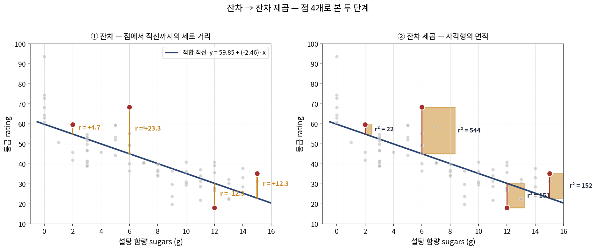
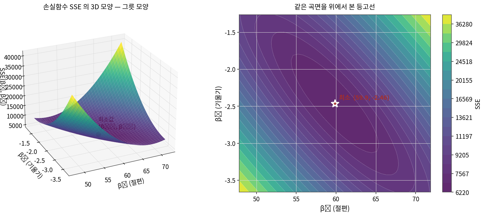

# 회귀분석 — 한 권의 학습자료

| 부 | 다루는 것 |
|---|---|
| 1 부 | 회귀의 의미와 단순선형회귀 |
| 2 부 | 최소제곱법 — 손실함수와 정규방정식 |
| 3 부 | 단순선형회귀 — 다섯 가지 풀이법 |
| 4 부 | 다중회귀 — 행렬로 한 줄에 |
| 5 부 | 회귀의 진단 — 잔차·R²·다중공선성 |
| 6 부 | 규제화의 동기 — 왜 계수를 작게 만드는가 |
| 7 부 | 릿지 회귀 — L² 규제와 닫힌 해 |
| 8 부 | 라소 회귀 — L¹ 규제와 변수 선택 |
| 9 부 | 엘라스틱넷 — 두 규제의 합 |
| 10 부 | PCR — PCA 와 회귀의 결합 |
| 11 부 | 회귀 가족의 한 자리 |

---

# 1 부. 회귀의 의미와 단순선형회귀

## 1 장. 회귀란 무엇이며, 어디서 왔는가

회귀분석(regression analysis) 의 핵심 질문은 단순하다 — **한 변수의 값을 알 때, 다른 변수의 값을 어떻게 예측·설명할 수 있는가**.  시리얼의 설탕 함량을 알면 소비자 등급이 어느 정도일지 짐작할 수 있다.  학생의 공부 시간을 알면 시험 점수가 어느 정도일지 짐작할 수 있다.  주택의 면적을 알면 가격이 어느 정도일지 짐작할 수 있다.  회귀는 이런 "한 변수로 다른 변수를 짐작하는 일" 을 한 직선의 식으로 옮기는 도구다.

### 1.1  르장드르와 가우스 — 최소제곱법의 탄생 (1805–1809)

회귀의 수학적 뼈대 — 최소제곱법(method of least squares) — 은 1800 년대 초의 두 수학자에게서 출발했다.

**1805 년**, 프랑스의 르장드르(Adrien-Marie Legendre, 1752–1833) 가 천체역학 책의 부록에서 혜성과 행성의 궤도 자료에서 "가장 잘 맞는 곡선" 을 찾는 방법을 처음으로 발표했다.  관측 자료가 잡음을 가지고 있을 때, 곡선과 자료 점 사이의 거리의 **제곱의 합** 을 최소화한다는 아이디어였다.

**1809 년**, 독일의 가우스(Carl Friedrich Gauss, 1777–1855) 가 "천체운동론" 에서 같은 방법을 더 깊이 다듬었다.  가우스는 자신이 1795 년부터 이 방법을 사용해 왔다고 주장했고, 더 중요하게는 — 측정 오차가 정규분포(이른바 "가우스 분포") 를 따른다고 가정하면 최소제곱 추정값이 곧 최대우도 추정값과 일치한다는 사실을 증명했다.  최소제곱법이 단순한 "좋은 방법" 이 아니라 통계적으로 **최적의** 방법임이 이때 드러났다.

두 사람의 작업은 서로 거의 같은 시기에, 서로 모르게 이루어졌지만, 결과는 본질적으로 같았다.  오늘날 최소제곱법은 두 사람 모두의 이름으로 기억된다.

### 1.2  갈튼과 "회귀" 라는 용어 (1885)

"회귀(regression)" 라는 단어 자체는 르장드르도 가우스도 쓰지 않았다.  이 용어는 그로부터 약 80 년 뒤, 영국의 통계학자 골튼(Francis Galton, 1822–1911) 이 처음 사용했다.

1885 년, 갈튼은 부모와 자녀의 키 자료를 분석하면서 흥미로운 현상을 발견했다.  매우 큰 부모에게서 태어난 자녀는 평균적으로 부모보다 작았고, 매우 작은 부모에게서 태어난 자녀는 평균적으로 부모보다 컸다.  즉 자녀의 키가 "평균 쪽으로 되돌아가는(regression toward the mean)" 경향이 있었다.  갈튼은 이 현상을 묘사하기 위해 "평균으로의 회귀(regression to the mean)" 라는 표현을 썼고, 부모 키 → 자녀 키 의 관계를 직선으로 적합한 그 직선을 "회귀선(regression line)" 이라 불렀다.

본래 "회귀" 는 "되돌아간다" 라는 갈튼의 발견에 붙은 이름이었지만, 그 직선이 만들어지는 수학적 절차 — 두 변수 사이의 관계를 직선으로 모형화하는 절차 — 가 점차 일반화되면서 "회귀" 라는 단어가 그 절차 자체를 가리키는 표준 용어로 자리잡았다.

오늘날 회귀분석이라 부르면, 그것은 갈튼이 발견한 "평균으로 되돌아감" 의 현상이 아니라, **르장드르·가우스의 최소제곱법으로 두 변수 사이의 직선을 찾는 일** 을 가리킨다.  단어는 갈튼에게서 왔지만 알맹이는 르장드르·가우스에게서 왔다.

### 1.3  회귀가 답하는 세 가지 질문

회귀분석은 자료에 한 직선을 적합한 뒤, 그 직선으로 세 가지 질문에 답한다.

1. **예측** — *x* 의 값을 알 때, *y* 의 값은 얼마쯤 될까?  설탕이 8 g 인 새로운 시리얼이 있다면, 그 등급은 얼마로 짐작되는가?
2. **설명** — *x* 가 *y* 를 얼마나 "설명" 하는가?  설탕만 가지고 시리얼 등급의 변동을 몇 퍼센트나 잡아낼 수 있는가?
3. **관계의 방향과 강도** — *x* 가 1 단위 증가하면 *y* 는 평균적으로 얼마나 증가(또는 감소) 하는가?  설탕이 1 g 늘 때 등급이 몇 점 떨어지는가?

이 세 질문 모두에 대한 답이 적합된 직선의 "두 수" — 절편과 기울기 — 에 압축되어 있다.


## 2 장. 두 변수의 산점도

이제 본격적으로 자료를 본다.  시리얼 한 종은 영양 성분과 소비자 등급으로 묘사된다.  77 종의 시리얼 자료 중에서 두 변수 — **설탕 함량**(sugars, g) 과 **소비자 등급**(rating) — 만 골라 좌표평면에 찍어 본다.



점들이 "왼쪽 위에서 오른쪽 아래로 비스듬히 내려오는 띠" 처럼 모인다.  설탕 함량이 많은 시리얼일수록 소비자 등급이 낮다는 경향이 한눈에 보인다.  설탕이 0 g 인 시리얼들은 등급이 60 점 이상, 설탕이 12 g 을 넘으면 등급이 30 점 아래로 떨어진다.

이 "비스듬히 내려가는 띠" 의 모양을 한 줄로 요약하고 싶다.  점들의 한가운데를 지나는 한 직선 — 그 직선의 식이 곧 자료의 한 줄짜리 요약이다.


## 3 장. 직선의 식과 두 모수

자료를 지나는 직선의 식을 다음과 같이 쓴다.


여기서 *y*ᵢ 는 *i* 번째 시리얼의 실제 등급, *x*ᵢ 는 같은 시리얼의 설탕 함량이다.  *β*₀ 는 직선이 *y* 축과 만나는 자리 — **절편**(intercept) 이고, *β*₁ 은 직선의 기울기 — **회귀계수**(regression coefficient) 다.  *ε*ᵢ 는 직선이 점들과 정확히 일치하지 않을 때 생기는 **오차**(error) 항이다.

이 식이 가지는 의미를 한 줄씩 풀어 본다.

- *β*₀ 는 *x* = 0 일 때의 *y* 의 평균값이다.  설탕이 0 g 인 시리얼의 평균 등급에 해당한다.
- *β*₁ 은 *x* 가 1 단위 늘 때 *y* 가 평균적으로 변하는 양이다.  설탕이 1 g 늘 때 등급이 평균적으로 몇 점 변하는지를 가리킨다.
- *ε*ᵢ 는 모든 자료점이 한 직선 위에 정확히 놓이지 않는다는 사실을 인정하는 항이다.  영양 외의 다른 요인(시리얼 브랜드, 시판 시기, 광고, 측정 잡음) 들이 이 ε 에 모두 흡수된다.

직선 하나는 (*β*₀, *β*₁) 단 두 수로 완전히 결정된다.  자료에서 가장 잘 어울리는 한 직선을 찾는다는 것은 결국 가장 잘 어울리는 (*β*₀, *β*₁) 두 수를 찾는 일이다.


## 4 장. 어느 직선이 가장 좋은가 — 잔차의 정의

같은 산점도 위에 세 가지 직선을 그려 본다.  하나는 절편 60, 기울기 −1.5 인 직선 A.  하나는 (지금은 어떻게 구했는지 모르지만 가장 잘 맞는) 최소제곱 적합 직선.  하나는 절편 50, 기울기 −3.0 인 직선 B.



세 직선 모두 "왼쪽 위에서 오른쪽 아래로 내려가는" 추세는 잡고 있다.  그러나 자세히 보면 — A 는 점들의 위쪽으로 살짝 떠 있고, B 는 너무 가파르게 내려가고, 가운데 빨간 직선이 점들의 한가운데를 가장 잘 지나간다.

"가장 잘 어울리는" 이라는 직관을 수학적으로 옮기려면 "점과 직선 사이의 거리" 를 수로 표현해야 한다.  자료의 한 점 (*x*ᵢ, *y*ᵢ) 가 직선 위에서 가지는 "예상값" 은 다음과 같다.


이 예측값과 실제 *y*ᵢ 의 차이가 "점과 직선 사이의 세로 거리" 다.  이 차이를 **잔차**(residual) 라 부른다.


잔차가 양수이면 점이 직선보다 위에 있다는 뜻이고, 음수이면 직선보다 아래에 있다는 뜻이며, 0 이면 점이 직선 위에 정확히 놓였다는 뜻이다.



위 그림은 적합 직선과 시리얼 일곱 종의 잔차를 노란 세로선으로 보여준다.  100% Bran 시리얼은 적합 직선보다 약 34 점 더 높은 자리에 있고, Cap'n'Crunch 는 직선보다 12.3 점 아래에 있다.


## 5 장. 잔차 제곱 — 왜 절댓값이 아니라 제곱인가

좋은 직선이란 "모든 점이 가까이 있는 직선" 이다.  즉 잔차의 절댓값이 전체적으로 작은 직선이다.  잔차를 그대로 더하면 양수와 음수가 상쇄돼 0 에 가까워지므로 좋은 척도가 못 된다.  두 가지 표준 대안이 있다.

1. **잔차의 절댓값을 더한다** — L¹ 손실, 절댓값 회귀(absolute deviation regression).
2. **잔차를 제곱해서 더한다** — L² 손실, 최소제곱법.

가우스가 1809 년에 선택한 방법이 후자다.  최소제곱법이 표준이 된 이유는 세 가지가 겹쳐서다.  첫째, 제곱은 모든 자리에서 미분 가능해서 수학적으로 다루기 쉽다.  절댓값은 0 에서 미분이 정의되지 않아 답을 닫힌 형태로 못 구한다.  둘째, 측정 오차가 정규분포를 따른다는 가정 아래에서 최소제곱이 최대우도 추정과 일치한다.  셋째, 답이 행렬 식 하나로 깔끔히 떨어진다.

따라서 "가장 좋은 직선" 은 잔차의 제곱의 합 — **잔차 제곱합**(Sum of Squared Errors, SSE) — 이 가장 작은 직선으로 정의된다.



왼쪽 패널은 점에서 직선까지의 세로 거리(잔차) 를 노란 세로선으로, 오른쪽 패널은 각 잔차의 제곱을 그 한 변으로 하는 사각형의 면적으로 보여준다.  사각형이 클수록 점이 직선에서 멀다는 뜻이고, 자료 전체의 "사각형 면적의 총합" 이 곧 SSE 다.

SSE 를 작게 만드는 (*β*₀, *β*₁) 한 쌍이 곧 최소제곱 적합 직선의 절편과 기울기다.  그 한 쌍을 어떻게 구하는지가 2 부의 주제다.


---

# 2 부. 최소제곱법 — 손실함수와 정규방정식

## 1 장. 손실함수 SSE 의 정의

자료 *n* 개의 점에 대해, 직선 (*β*₀, *β*₁) 이 만드는 잔차 제곱의 합을 손실함수로 본다.


SSE 는 (*β*₀, *β*₁) 의 함수다 — 직선을 어떻게 잡느냐에 따라 값이 달라진다.  좋은 직선을 찾는 일이란, SSE 를 가장 작게 만드는 (*β*₀, *β*₁) 한 쌍을 찾는 일과 같다.

(*β*₀, *β*₁) 의 평면 위에서 SSE 가 어떻게 변하는지를 그려 보면 다음과 같다.



왼쪽이 3 차원 곡면, 오른쪽이 그 곡면을 위에서 본 등고선이다.  곡면의 모양이 "그릇" 처럼 한 점에서 가장 깊게 내려가고, 그 자리 외에서는 어디로 가든 위로 올라간다.  최솟값을 갖는 단 하나의 자리가 곧 최적의 (*β̂*₀, *β̂*₁) 이다.

본 자료에서는 그 자리가 약 (59.85, −2.46) 부근이다.


## 2 장. 편미분 = 0 — 정규방정식의 유도

SSE 가 그릇 모양의 곡면이라면, 그릇의 가장 깊은 자리에서는 어느 방향으로 살짝 움직여도 SSE 값이 변하지 않는다 — 그 자리에서 곡면의 "기울기" 가 모든 방향으로 0 이라는 뜻이다.  SSE 가 *β*₀ 와 *β*₁ 의 함수이므로, "모든 방향의 기울기가 0" 이라는 조건은 두 변수에 대한 **편미분**(partial derivative) 이 각각 0 이라는 식으로 옮겨진다.

먼저 *β*₀ 에 대한 편미분.


다음 *β*₁ 에 대한 편미분.


각각 식의 양변을 2 로 나누고 합 기호 안의 항들을 분배하면 두 식이 깔끔하게 정리된다.


이 두 식을 **정규방정식**(normal equations) 이라 부른다.  미지수 두 개 (*β*₀, *β*₁) 에 대한 일차연립방정식이다.


## 3 장. 정규방정식의 행렬 표기

정규방정식 두 줄을 한 줄로 묶으려면 행렬을 쓴다.  자료의 모든 점을 한 행렬에 담는다.

자료행렬 *X* 는 두 열로 구성된다.  첫 열은 모두 1, 둘째 열은 *x*ᵢ 값들이다.  반응벡터 *y* 는 *y*ᵢ 값들을 세로로 늘어놓은 것이다.

```
        ┌1   x₁┐               ┌y₁┐
        │1   x₂│               │y₂│
   X =  │ ⋮    ⋮│        y  =  │ ⋮│
        │1   xₙ│               │yₙ│
        └      ┘               └  ┘
```

회귀계수도 벡터 *β* = (*β*₀, *β*₁)ᵀ 로 묶는다.  그러면 정규방정식 두 줄이 다음 한 줄로 떨어진다.


*X*ᵀ*X* 가 2×2 행렬, *X*ᵀ*y* 가 길이 2 인 벡터다.  *X*ᵀ*X* 가 정칙(가역) 이라는 조건 하에서, 양변에 그 역행렬을 곱하면 한 줄짜리 닫힌 해가 나온다.


이 한 줄이 회귀분석의 모든 식의 출발점이다.  단순선형회귀에서나 다중회귀에서나 — 변수가 한 개든 백 개든 — 같은 식이 똑같이 적용된다.  차이는 단지 *X* 의 열 수가 늘어나고 *β* 의 길이가 길어진다는 것뿐이다.


## 4 장. 단순회귀의 깔끔한 공식

변수가 한 개인 경우(단순선형회귀) 에는, 정규방정식 두 줄을 손으로 풀어 *β*₀ 와 *β*₁ 의 닫힌 공식을 얻을 수 있다.  결과는 다음과 같다.


위쪽 식이 기울기, 아래쪽 식이 절편이다.  기울기는 "*x* 와 *y* 의 공분산" 을 "*x* 의 분산" 으로 나눈 것에 정확히 비례한다 — 분자에는 두 변수가 함께 움직이는 정도가 들어가고, 분모에는 *x* 가 혼자 흩어진 정도가 들어간다.  *x* 의 흩어짐에 비해 *y* 가 같이 흩어지는 정도가 곧 직선의 기울기다.

절편은 두 평균점 (*x̄*, *ȳ*) 을 적합 직선이 항상 지나가도록 잡힌다.  *x* = *x̄* 일 때 *y* = *ȳ* 가 되도록 *β*₀ 가 결정된다는 뜻이다.


---

# 3 부. 단순선형회귀 — 다섯 가지 풀이법

같은 자료, 같은 식, 같은 답을 다섯 가지 다른 방법으로 풀어 본다.  각 방법이 "무엇을 어떻게 한다" 의 한 단계 한 단계를 끝까지 따라가며, 마지막에 다섯 답이 정확히 일치함을 확인한다.

사용하는 자료는 1 부에서 본 시리얼 자료다 — 설탕 함량 *x* (sugars) 에서 등급 *y* (rating) 을 예측하는 문제.  결측치를 제거한 *n* = 76 개 시리얼.

## 1 장. 자료 준비

```python
import pandas as pd
import numpy as np

# Drive 에서 받은 Cereals.csv 를 pandas 로 읽는다
df = pd.read_csv('Cereals.csv')

# sugars 와 rating 두 열만 사용하고, 결측치가 있는 행은 제거
df = df.dropna(subset=['sugars', 'rating'])

x = df['sugars'].values      # 설탕 함량 (g)
y = df['rating'].values      # 소비자 등급
n = len(x)

print(f'표본 수 n = {n}')
print(f'설탕 평균 x̄ = {x.mean():.4f}')
print(f'등급 평균 ȳ = {y.mean():.4f}')
```

```
표본 수 n = 76
설탕 평균 x̄ = 7.0263
등급 평균 ȳ = 42.5583
```

평균 설탕 7.03 g, 평균 등급 42.56 점이다.  이 두 평균점 (*x̄*, *ȳ*) 은 적합 직선이 반드시 지나가는 자리다.


## 2 장. ① 공식법 — 손으로 한 줄씩

2 부 4 장의 공식 두 줄을 그대로 코드로 옮긴다.

```python
xm, ym = x.mean(), y.mean()
Sxx = ((x - xm) ** 2).sum()             # Σ(xᵢ − x̄)²
Sxy = ((x - xm) * (y - ym)).sum()       # Σ(xᵢ − x̄)(yᵢ − ȳ)

b1 = Sxy / Sxx                          # 기울기
b0 = ym - b1 * xm                       # 절편

print(f'Σ(xᵢ−x̄)² = {Sxx:.4f}')
print(f'Σ(xᵢ−x̄)(yᵢ−ȳ) = {Sxy:.4f}')
print(f'β̂₁ = {b1:.6f}')
print(f'β̂₀ = {b0:.6f}')
```

```
Σ(xᵢ−x̄)² = 1437.9474
Σ(xᵢ−x̄)(yᵢ−ȳ) = -3539.3927
β̂₁ = -2.461420
β̂₀ = 59.853017
```

### 2.1  결과 해석

설탕 함량이 1 g 늘어날 때마다 시리얼 등급은 약 **2.46 점 떨어진다**.  설탕이 0 g 인 가상의 시리얼이 있다면 그 등급은 약 **59.85 점** 이 될 것으로 예측된다.  음의 기울기 −2.46 은 "설탕은 등급의 적" 이라는 자료의 메시지를 한 수로 압축한 것이다.

분자 Σ(*xᵢ* − *x̄*)(*yᵢ* − *ȳ*) 가 음수(−3539) 라는 사실이 곧 두 변수의 공분산이 음수라는 뜻이고, 그것이 "두 변수가 반대 방향으로 함께 움직인다" 라는 의미다.  분모 Σ(*xᵢ* − *x̄*)² = 1437.95 가 *x* 의 흩어짐의 정도이고, 분자를 분모로 나누어 단위를 "등급 / 설탕g" 로 맞춘 것이 기울기다.


## 3 장. ② 행렬 곱셈 — β̂ = (XᵀX)⁻¹Xᵀy 를 손으로

같은 자료에 2 부 3 장의 행렬 공식을 그대로 적용한다.  열의 처음을 1 로 둔 자료행렬 *X* 를 만들고, *X*ᵀ*X* 의 역행렬을 직접 계산한다.

```python
# 1 열은 모두 1 (절편 항), 2 열은 x
X = np.column_stack([np.ones(n), x])   # 형태 (76, 2)

XtX = X.T @ X                          # (2, 2) 행렬
Xty = X.T @ y                          # (2,) 벡터

print('XᵀX =')
print(XtX)
print('Xᵀy =', Xty)

XtX_inv = np.linalg.inv(XtX)
beta = XtX_inv @ Xty

print(f'\nβ̂ = ({beta[0]:.6f}, {beta[1]:.6f})')
```

```
XᵀX =
[[  76.  534.]
 [ 534. 5190.]]
Xᵀy = [ 3234.4309 19186.7401]

β̂ = (59.853017, -2.461420)
```

### 3.1  결과 해석

*X*ᵀ*X* 의 (1,1) 원소가 76 — 표본 수 *n* — 이고, (1,2) 원소가 534 — Σ*x*ᵢ — 이고, (2,2) 원소가 5190 — Σ*x*ᵢ² — 이다.  즉 *X*ᵀ*X* 는 "*x* 의 기본 통계량 네 가지" 를 한 행렬에 담은 것이다.

같은 식으로 *X*ᵀ*y* 의 첫 원소는 Σ*y*ᵢ, 둘째 원소는 Σ*x*ᵢ*y*ᵢ 다.  자료의 모든 정보가 이 작은 두 행렬·벡터에 압축되어 있고, 그 한 줄의 역행렬 곱셈으로 답이 떨어진다.  공식법과 정확히 같은 (59.853017, −2.461420) 이 나온다.


## 4 장. ③ Cramer 법칙 — 행렬식으로 푸는 일차연립방정식

*X*ᵀ*X* *β* = *X*ᵀ*y* 는 미지수 두 개에 대한 일차연립방정식이다.  연립방정식을 푸는 고전적 방법이 Cramer 법칙이다.  계수행렬의 행렬식을 분모로, 각 열을 우변으로 교체한 행렬의 행렬식을 분자로 두면 각 미지수가 떨어진다.

```python
# 계수행렬의 행렬식
det_XtX = XtX[0,0] * XtX[1,1] - XtX[0,1] * XtX[1,0]

# β̂₀ 를 풀기 위한 행렬 — XᵀX 의 0 번 열을 Xᵀy 로 바꾼다
M0 = XtX.copy()
M0[:, 0] = Xty
det_M0 = M0[0,0] * M0[1,1] - M0[0,1] * M0[1,0]

# β̂₁ 을 풀기 위한 행렬 — XᵀX 의 1 번 열을 Xᵀy 로 바꾼다
M1 = XtX.copy()
M1[:, 1] = Xty
det_M1 = M1[0,0] * M1[1,1] - M1[0,1] * M1[1,0]

b0 = det_M0 / det_XtX
b1 = det_M1 / det_XtX

print(f'det(XᵀX) = {det_XtX:.4f}')
print(f'β̂₀ = det(M₀)/det(XᵀX) = {b0:.6f}')
print(f'β̂₁ = det(M₁)/det(XᵀX) = {b1:.6f}')
```

```
det(XᵀX) = 109284.0000
β̂₀ = det(M₀)/det(XᵀX) = 59.853017
β̂₁ = det(M₁)/det(XᵀX) = -2.461420
```

### 4.1  결과 해석

det(*X*ᵀ*X*) = 109284 이 0 이 아니라는 사실이 곧 *X*ᵀ*X* 가 가역이고 답이 유일하게 존재한다는 보장이다.  설탕 함량 *x* 가 모든 시리얼에서 같은 값이었다면 두 열이 선형종속이 되어 행렬식이 0 이 되고, 직선의 기울기를 정할 수 없어진다.  자료의 변동(분산) 이 회귀분석을 가능하게 하는 근본 조건임이 이 행렬식 한 수에 압축되어 있다.

Cramer 법칙은 2×2 와 3×3 까지는 손으로도 풀 만하지만, 변수가 많아지면 행렬식 자체의 계산이 매우 많아지기 때문에 실용성이 떨어진다.  답이 같다는 사실을 "보여주기" 위한 도구로서의 의미가 더 크다.


## 5 장. ④ NumPy 의 lstsq — 수치선형대수의 표준 도구

`np.linalg.lstsq` 는 "최소제곱 문제 *X*β ≈ *y* 를 풀어라" 라는 한 줄짜리 명령이다.  내부적으로는 QR 분해 또는 SVD 를 써서 (*X*ᵀ*X*)⁻¹ 을 명시적으로 계산하지 않고도 답을 구한다 — 수치적으로 더 안정적이다.

```python
beta, residuals_sse, rank, sv = np.linalg.lstsq(X, y, rcond=None)

print(f'β̂ = ({beta[0]:.6f}, {beta[1]:.6f})')
print(f'잔차 제곱합 SSE = {residuals_sse[0]:.4f}')
print(f'X 의 랭크 = {rank}')
print(f'X 의 특이값 = {sv}')
```

```
β̂ = (59.853017, -2.461420)
잔차 제곱합 SSE = 6217.3615
X 의 랭크 = 2
X 의 특이값 = [72.79  6.39]
```

### 5.1  결과 해석

`lstsq` 가 한꺼번에 네 가지를 돌려준다 — 회귀계수, 잔차 제곱합 SSE, *X* 의 랭크, *X* 의 특이값.  랭크가 2 라는 것은 "두 열(상수열, 설탕열) 이 서로 독립이다" 라는 뜻이고, 그것이 곧 유일한 최소제곱해가 존재한다는 보장이다.

특이값 72.79 와 6.39 — 두 값의 비율(약 11배) 이 자료의 "조건수" 와 관련이 있다.  비율이 클수록 *X*ᵀ*X* 의 역행렬이 수치적으로 불안정해진다.  본 자료에서는 안정적이지만, 다중회귀로 가면 이 비율이 매우 커져 "다중공선성" 문제가 발생한다 — 5 부에서 다시 본다.


## 6 장. ⑤ scikit-learn 의 LinearRegression — 고수준 ML 인터페이스

scikit-learn 은 머신러닝 라이브러리지만, 단순선형회귀도 같은 패턴 `fit → predict` 로 제공한다.

```python
from sklearn.linear_model import LinearRegression

# sklearn 은 X 를 2 차원 배열로 받는다 — (n, 1)
reg = LinearRegression()
reg.fit(x.reshape(-1, 1), y)

print(f'β̂₀ (intercept_) = {reg.intercept_:.6f}')
print(f'β̂₁ (coef_[0])  = {reg.coef_[0]:.6f}')

# 예측
y_pred = reg.predict(x.reshape(-1, 1))
print(f'\n첫 시리얼 예측값: {y_pred[0]:.4f},  실제값: {y[0]:.4f}')

# 적합도 R²
r2 = reg.score(x.reshape(-1, 1), y)
print(f'R² = {r2:.4f}')
```

```
β̂₀ (intercept_) = 59.853017
β̂₁ (coef_[0])  = -2.461420

첫 시리얼 예측값: 45.0844,  실제값: 68.4030
R² = 0.5835
```

### 6.1  결과 해석

sklearn 도 같은 답을 준다.  내부적으로 NumPy 의 `lstsq` 와 비슷한 수치 선형대수를 사용하지만, "학습된 모형 객체" 라는 개념을 제공한다는 차이가 있다.  같은 모형을 새 자료에 `predict` 로 즉시 적용할 수 있고, 회귀와 분류·정규화·교차검증 같은 다른 도구들과 같은 인터페이스로 묶일 수 있다.

**R² = 0.5835** 는 본 모형이 설탕 함량 한 변수만으로 시리얼 등급의 변동을 약 **58.4% 설명한다** 는 뜻이다.  나머지 41.6% 의 변동은 단백질, 식이섬유, 나트륨, 칼륨, 비타민 같은 다른 영양 변수와 측정 잡음에서 온다.  이 점이 4 부에서 다중회귀로 넘어가야 할 동기를 만든다.


## 7 장. 다섯 답의 비교 — 정확히 같다

같은 자료에 다섯 가지 방법을 적용한 결과를 한 표에 모은다.

| 방법 | β̂₀ (절편) | β̂₁ (기울기) |
|---|---|---|
| ① 공식법 | 59.853017 | −2.461420 |
| ② 행렬 곱셈 (*X*ᵀ*X*)⁻¹*X*ᵀ*y* | 59.853017 | −2.461420 |
| ③ Cramer 법칙 | 59.853017 | −2.461420 |
| ④ NumPy `lstsq` | 59.853017 | −2.461420 |
| ⑤ scikit-learn `LinearRegression` | 59.853017 | −2.461420 |

소수점 여섯째 자리까지 정확히 같다.  같은 최소제곱 문제의 답을 다섯 가지 다른 길로 구했지만, 모두 "SSE 가 최소가 되는 단 하나의 자리" 에 도달했다는 뜻이다.

### 7.1  방법 선택의 기준 — 어느 것을 언제 쓰는가

| 상황 | 권장 방법 |
|---|---|
| 변수가 1 개, 손으로 풀이 과정을 보여줄 때 | ① 공식법 |
| 변수가 2~5 개, 행렬 곱셈을 직접 보여줄 때 | ② 행렬 곱셈 |
| 행렬식의 의미를 강조할 때 (교육용) | ③ Cramer 법칙 |
| 변수가 많거나 *X*ᵀ*X* 가 거의 비가역일 때 | ④ NumPy `lstsq` |
| 다른 ML 모형과 같은 인터페이스로 묶을 때 | ⑤ scikit-learn |

실용에서는 ④ 와 ⑤ 가 표준이다.  ① ~ ③ 은 "왜 답이 그런 모양으로 나오는가" 를 설명하는 도구로서의 가치가 크다.  답이 같음을 한 번 확인하고 나면, 그 다음부터는 어느 도구를 쓰든 같은 결과가 나온다는 사실을 잊지 않는 것이 중요하다.

### 7.2  적합 직선의 한 줄 요약

다섯 풀이법이 모두 다음 한 줄을 가리킨다.

> **rating ≈ 59.85 − 2.46 × sugars** &nbsp; (R² = 0.58, *n* = 76)

설탕이 1 g 늘 때마다 등급이 2.46 점 떨어지고, 모형이 자료의 약 58% 를 설명한다는 한 줄 요약이다.  나머지 42% 를 잡으려면 변수를 추가해야 한다 — 그 자리가 4 부 다중회귀다.


---

# 4 부. 다중회귀 — 행렬로 한 줄에

## 1 장. 왜 변수를 늘리는가 — 한 변수의 한계

3 부에서 설탕(sugars) 한 변수만으로 시리얼 등급을 설명했다.  결과는 R² = 0.58 — 자료의 약 58% 를 잡았다는 뜻이지만, 뒤집어 말하면 **42% 의 변동을 설명하지 못했다**.  적합 직선에서 30 점 이상 벗어나는 시리얼이 여럿이고, 같은 설탕 함량(예: 3 g) 을 가진 시리얼들의 등급도 30 점 ~ 65 점 사이로 크게 다르다.

설탕 외에 또 무엇이 등급에 영향을 줄까?  자료에는 13 개의 영양 변수가 더 있다 — calories, protein, fat, sodium, fiber, carbo, potass, vitamins, weight, cups, shelf 등.  이들 중 어느 것이 설탕과 별도로 등급에 추가 정보를 주는지 모른다.  설탕 한 변수만 가지고는 "설탕이 같아도 식이섬유가 많은 시리얼은 등급이 높다" 같은 사실을 잡아낼 수 없다.

**다중회귀**(multiple regression) 는 여러 변수를 한꺼번에 고려해서, 각 변수의 "독립적인 기여도" 를 분리해 낸다.  설탕이 1 g 늘 때 등급이 떨어지는 정도를 — **다른 영양 성분이 모두 같다는 가정 아래** — 따로 잰다.  이 "다른 변수를 고정한 상태에서의 효과" 라는 개념이 다중회귀의 핵심이다.

## 2 장. 변수 두 개 — 평면이 된다

먼저 변수를 한 개 늘려서 두 변수의 경우부터 본다.  설탕과 식이섬유(fiber) 두 변수로 등급을 설명하는 모형은 다음과 같다.

> *y*ᵢ = *β*₀ + *β*₁ · sugarsᵢ + *β*₂ · fiberᵢ + *ε*ᵢ

기하적으로 보면 — 이 식은 (*x*₁, *x*₂, *y*) 의 3 차원 공간에서 한 **평면**의 식이다.  단순회귀가 (*x*, *y*) 평면에서의 한 직선이었다면, 변수가 둘이면 그 "직선" 이 한 차원 올라간 "평면" 이 된다.  자료의 점들이 3 차원 공간에 흩어져 있고, 그 점들 한가운데를 지나는 평면 한 장의 식을 찾는 일이다.

평면의 식은 세 수 (*β*₀, *β*₁, *β*₂) 로 결정된다.  *β*₁ 은 "설탕이 1 g 늘 때 등급이 변하는 양 — 단, 식이섬유가 같다는 조건 아래" 이고, *β*₂ 는 "식이섬유가 1 g 늘 때 등급이 변하는 양 — 단, 설탕이 같다는 조건 아래" 다.  두 변수의 효과가 서로 분리되어 있다.

## 3 장. 변수 p 개 — 같은 식이 행렬로 한 줄에

변수가 *p* 개로 늘어나면 식은 다음과 같다.

> *y*ᵢ = *β*₀ + *β*₁*x*ᵢ₁ + *β*₂*x*ᵢ₂ + … + *β*ₚ*x*ᵢₚ + *ε*ᵢ

미지수 (*β*₀, *β*₁, …, *β*ₚ) 가 *p* + 1 개로 늘어났다.  변수가 백 개라면 *β* 가 백한 개다.  손으로 적기에는 너무 길다.

이때 행렬 표기가 모든 것을 한 줄로 바꾼다.  자료행렬 *X* 의 첫 열은 모두 1 (절편 항), 나머지 *p* 열은 각 설명변수의 값이다.  반응벡터 *y*, 계수벡터 *β* 도 같이 묶는다.

```
        ┌1   x₁₁   x₁₂  ⋯  x₁ₚ┐               ┌y₁┐               ┌β₀┐
        │1   x₂₁   x₂₂  ⋯  x₂ₚ│               │y₂│               │β₁│
   X =  │ ⋮    ⋮     ⋮       ⋮ │      y  =  │ ⋮│      β  =  │ ⋮│
        │1   xₙ₁   xₙ₂  ⋯  xₙₚ│               │yₙ│               │βₚ│
        └                      ┘               └  ┘               └  ┘
```

그러면 모든 *n* 개의 관측식이 한 줄로 묶인다.

> *y* = *X* *β* + *ε*

변수가 한 개든 백 개든 식이 정확히 같다.  단순회귀와 다중회귀가 같은 기하학적 문제 — "평면(혹은 초평면) 으로 자료 점을 설명하는 일" — 임이 이 한 줄의 표기에서 분명해진다.

## 4 장. 다중회귀의 정규방정식과 닫힌 해

손실함수 SSE 의 정의도 그대로다 — 잔차 벡터의 제곱합.

> SSE(*β*) = ‖*y* − *X**β*‖² = (*y* − *X**β*)ᵀ(*y* − *X**β*)

이것을 *β* 에 대해 미분해서 0 으로 두면, 단순회귀의 정규방정식과 똑같은 모양이 나온다.


그리고 닫힌 해도 정확히 같은 식이다.


차이는 단 하나 — *X*ᵀ*X* 가 2×2 가 아니라 (*p*+1)×(*p*+1) 의 더 큰 행렬이고, *β* 가 길이 2 가 아니라 길이 *p*+1 의 더 긴 벡터다.  같은 식, 더 큰 행렬.

## 5 장. Cereals 13 영양 변수로 다중회귀

Drive 에서 받은 같은 자료에 13 영양 변수를 모두 넣고 다중회귀를 돌린다.  결측치가 있는 행은 제거.

```python
import pandas as pd
import numpy as np
from sklearn.linear_model import LinearRegression

df = pd.read_csv('Cereals.csv').dropna()        # 결측 모두 제거
features = ['calories', 'protein', 'fat', 'sodium', 'fiber',
            'carbo', 'sugars', 'potass', 'vitamins',
            'shelf', 'weight', 'cups']
X = df[features].values                          # (n, 12)
y = df['rating'].values
n, p = X.shape
print(f'표본 수 n = {n}, 변수 수 p = {p}')

# 행렬 곱셈으로 직접
X_design = np.column_stack([np.ones(n), X])      # (n, p+1)
beta = np.linalg.inv(X_design.T @ X_design) @ X_design.T @ y
print(f'\nβ̂ (절편 포함):')
print(f'  intercept = {beta[0]:.4f}')
for name, b in zip(features, beta[1:]):
    print(f'  {name:10s} = {b:+.4f}')

# sklearn 으로
reg = LinearRegression()
reg.fit(X, y)
y_pred = reg.predict(X)
sst = ((y - y.mean())**2).sum()
sse = ((y - y_pred)**2).sum()
r2 = 1 - sse / sst
print(f'\nSST = {sst:.2f},  SSE = {sse:.2f},  R² = {r2:.4f}')
```

```
표본 수 n = 74, 변수 수 p = 12

β̂ (절편 포함):
  intercept = 54.9264
  calories   = -0.2226
  protein    = +3.2729
  fat        = -1.6914
  sodium     = -0.0543
  fiber      = +3.4439
  carbo      = +1.0922
  sugars     = -0.7244
  potass     = -0.0341
  vitamins   = -0.0512
  shelf      = -0.0143
  weight     = -0.4664
  cups       = +0.0173

SST = 14470.04,  SSE = 50.65,  R² = 0.9965
```

### 5.1  결과 해석

**전체 적합도**.  R² = **0.9965** — 시리얼 등급의 99.6% 가 13 개 영양 변수로 설명된다.  단순회귀의 R² = 0.58 에서 거의 1.0 까지 올라갔다.  잃어버린 변동의 거의 전부가 다른 변수들에 흩어져 있었다는 뜻이다.

**개별 계수의 해석**.  계수의 부호와 크기를 한 줄씩 읽으면 자료가 무엇을 말하고 있는지가 드러난다.

- **단백질** *β* = +3.27, **식이섬유** *β* = +3.44 — 두 변수가 가장 강한 "등급 상승" 효과를 가진다.  다른 영양 성분이 같다면 단백질 1 g 증가가 등급 3.3 점 상승과 연결된다.
- **설탕** *β* = −0.72 — 단순회귀에서 −2.46 이었던 설탕의 계수가 다중회귀에서는 −0.72 로 작아졌다.  단순회귀의 "설탕 효과" 중 일부가 다른 변수(식이섬유 부족, 칼로리 과다 등) 와의 상관 때문이었음을 의미한다.  설탕 자체의 "순수한" 효과는 −0.72 정도다.
- **지방** *β* = −1.69 — 지방이 1 g 늘 때 등급이 1.69 점 떨어진다.
- **칼로리, 나트륨, 칼륨, 비타민** 의 계수는 −0.05 ~ −0.22 정도로 작다.  계수가 작은 이유는 두 가지가 가능하다 — (1) 그 변수의 실제 영향이 작거나, (2) 단위가 커서 "1 단위 증가" 가 자료의 정상 범위 밖이기 때문.  나트륨의 범위(0~320 mg) 를 생각하면 −0.054 × 320 = −17 점 정도이므로 작지 않다.  계수만 보고 "중요도" 를 판단할 수 없다는 사실이 5 부의 핵심 주제이다.

**조심할 점**.  다중회귀의 계수는 "다른 변수가 모두 같다는 가정 아래" 의 효과다.  본 자료에서 칼로리와 단백질이 강한 상관을 가지므로, "칼로리는 같지만 단백질만 다른" 시리얼이 실제로는 거의 없다.  그런 자료에서 다중회귀 계수를 단독으로 해석하면 **다중공선성**(multicollinearity) 의 함정에 빠지기 쉽다.  이 문제와 그 해결책이 5 부와 6 부의 주제다.

### 5.2  단순회귀 vs 다중회귀 — 한눈에

| 비교 항목 | 단순회귀 (sugars만) | 다중회귀 (13 변수) |
|---|---|---|
| 변수 수 *p* | 1 | 12 |
| 절편 β₀ | 59.85 | 54.93 |
| sugars 계수 | **−2.46** | **−0.72** |
| R² | 0.583 | **0.997** |
| 잔차 표준오차 | 9.17 | 0.91 |

같은 "sugars 의 효과" 가 단순회귀에서 −2.46, 다중회귀에서 −0.72 로 크게 다르다.  단순회귀의 −2.46 은 "설탕의 직접 효과 + 설탕과 상관된 다른 변수의 간접 효과" 가 모두 섞인 값이고, 다중회귀의 −0.72 는 "다른 변수를 일정하게 두었을 때의 설탕의 순수한 효과" 다.  어느 것이 옳은 답인가는 "무엇을 묻고 있는가" 에 달려 있다.

- **"설탕을 많이 먹는 시리얼은 등급이 낮은가?"** — 단순회귀가 답한다 (−2.46).
- **"같은 영양 조건에서 설탕만 늘리면 등급이 어떻게 변하는가?"** — 다중회귀가 답한다 (−0.72).

두 답이 다르다는 사실이 곧 자료에 변수 간 상관이 존재한다는 증거다.  이 "상관된 변수들의 효과를 어떻게 깔끔히 분리할 것인가" 가 다중회귀의 가장 어려운 부분이고, 다중공선성·R²·잔차 진단·규제화로 이어지는 모든 길의 출발점이다.
