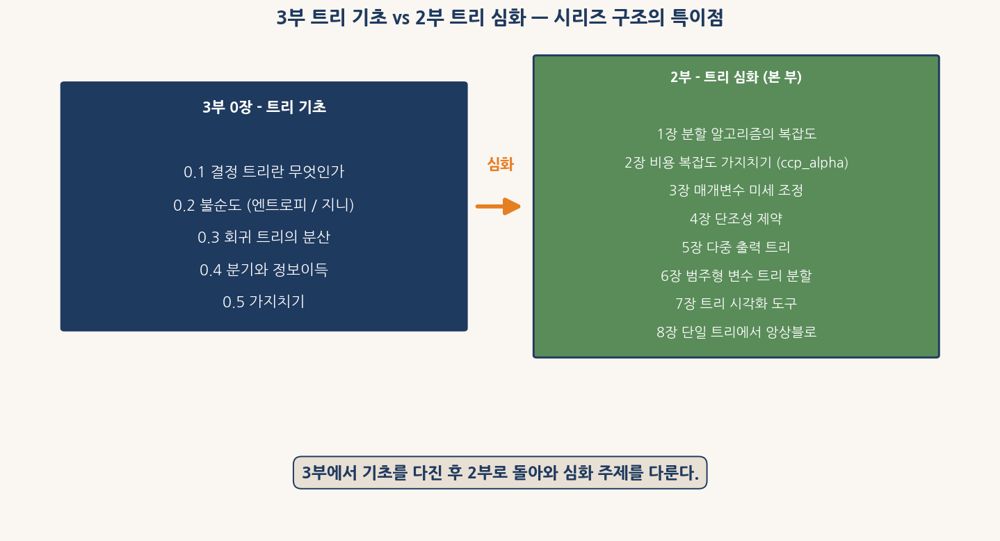
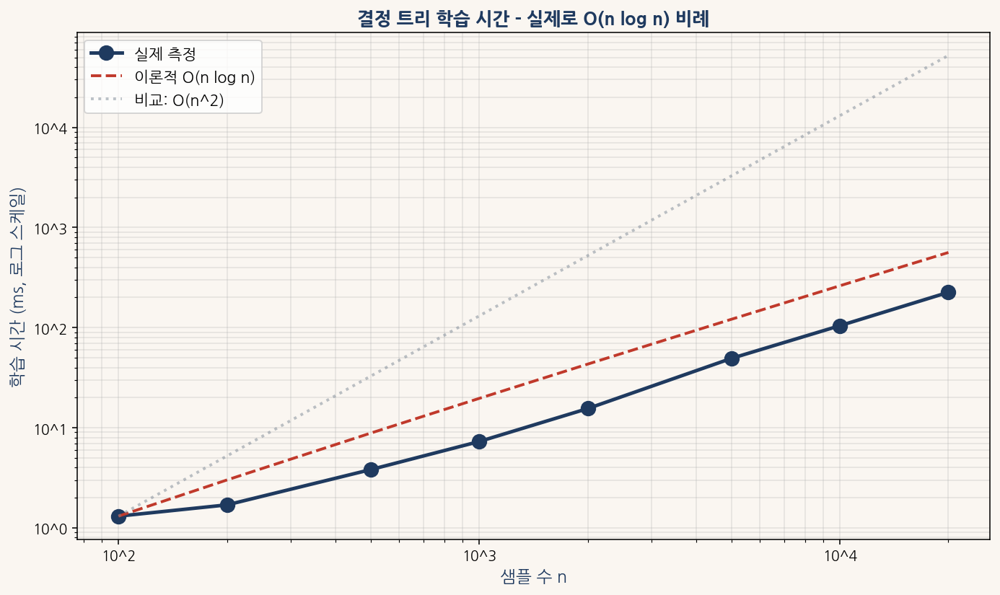
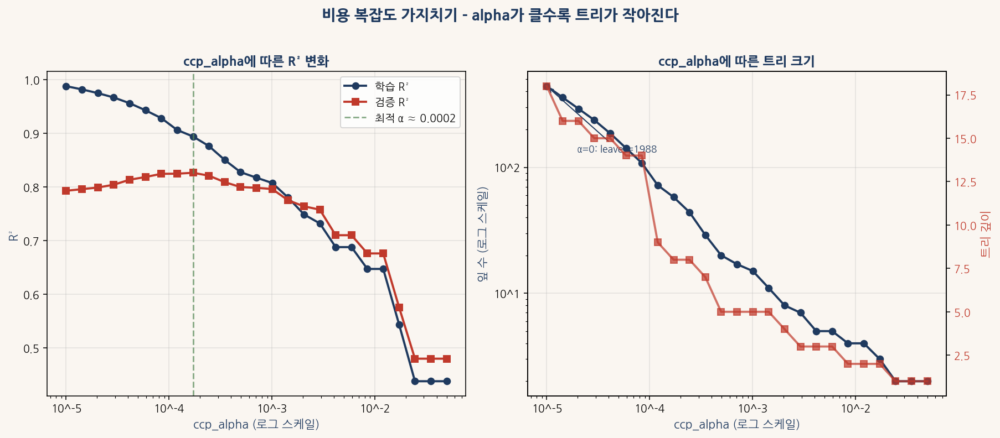
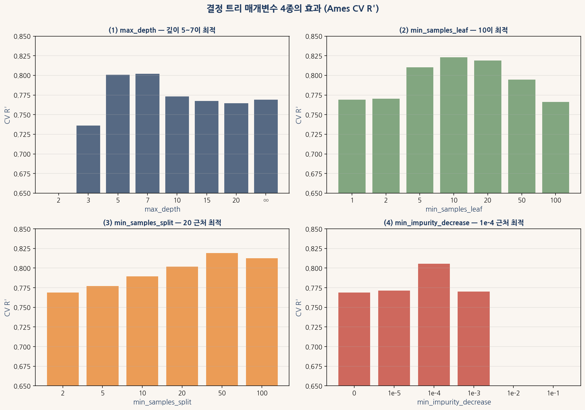
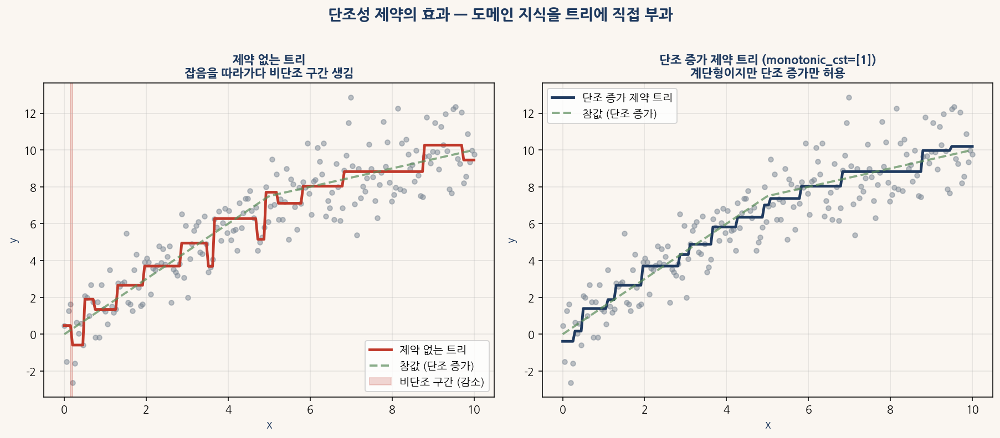
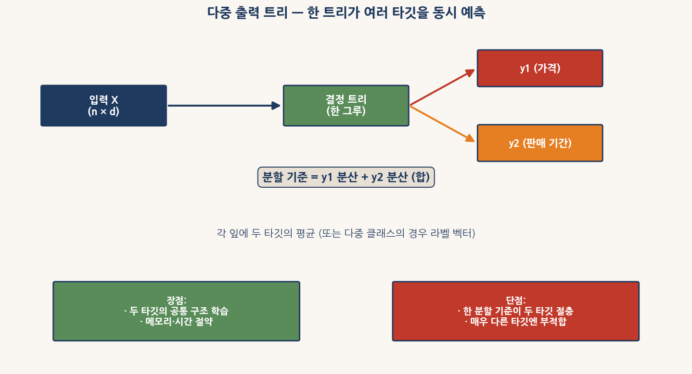
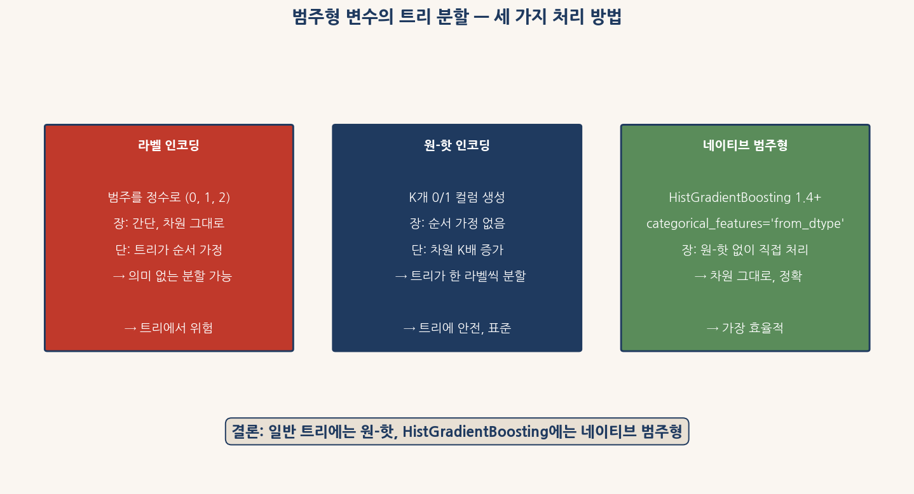
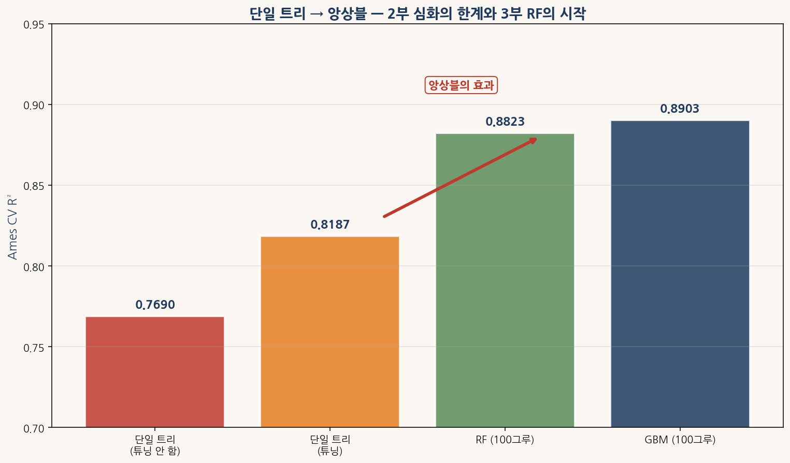

# 2부 결정 트리 심화 — 매개변수와 고급 기능

## 어려운 버전 — 학부 1~2학년용

본 자료는 결정 트리의 **심화 주제**를 다루는 자습 교재이다. 3부 0장에서 결정 트리의 **기초** (불순도·분기·가지치기 등)를 먼저 다루므로, 본 2부는 **3부 0장이 다루지 않는 심화 주제만** 채운다.

본 자료는 두 데이터셋을 **페어**로 사용한다.

| 데이터셋 | 역할 | 특성 |
|---|---|---|
| **Ames** (2,930 × 82) | 강사 시범 (Ping) | 회귀, 큰 데이터, 깊은 트리 가능 |
| **Cereals** (77 × 16) | 학생 실습 (Pong) | 회귀, 작은 데이터, 매개변수 효과 시각화 적합 |

본 부의 권장 학습 흐름은 **3부 0장을 먼저 읽고, 그 다음 본 2부로 돌아오는** 것이다. 시리즈 구조의 특이점이다.

```python
# 환경 준비 (한 번만 실행)
# !pip install pandas numpy matplotlib scikit-learn koreanize-matplotlib

import numpy as np
import pandas as pd
import matplotlib.pyplot as plt
import koreanize_matplotlib
import warnings
warnings.filterwarnings("ignore")

URL_AMES   = "https://raw.githubusercontent.com/leina99-lab/classes/main/AI%ED%94%84%EB%A1%9C%EA%B7%B8%EB%9E%98%EB%B0%8D/data/AmesHousing.csv"
URL_CEREAL = "https://raw.githubusercontent.com/leina99-lab/classes/main/AI%ED%94%84%EB%A1%9C%EA%B7%B8%EB%9E%98%EB%B0%8D/data/Cereals.csv"

ames_raw   = pd.read_csv(URL_AMES)
cereal_raw = pd.read_csv(URL_CEREAL)
```

1부의 표준 전처리 함수를 그대로 가져와 **깨끗한 데이터** 상태에서 출발한다.

```python
def prepare_ames(df_in):
    df = df_in.copy()
    df = df.drop(columns=[c for c in ["Order", "PID"] if c in df.columns])
    for c in ["Pool QC", "Misc Feature", "Alley", "Fence", "Fireplace Qu",
              "Garage Qual", "Garage Cond", "Garage Finish", "Garage Type",
              "Bsmt Qual", "Bsmt Cond", "Bsmt Exposure",
              "BsmtFin Type 1", "BsmtFin Type 2", "Mas Vnr Type"]:
        if c in df.columns:
            df[c] = df[c].fillna("None")
    num = df.select_dtypes("number").columns
    df[num] = df[num].fillna(df[num].median())
    df = df[df["Gr Liv Area"] < 4000].copy()
    df["Total SF"] = df["1st Flr SF"] + df["2nd Flr SF"] + df["Total Bsmt SF"]
    return df

ames = prepare_ames(ames_raw)
y_ames = np.log1p(ames["SalePrice"])
X_ames = ames.select_dtypes("number").drop(columns=["SalePrice"])

cereal = cereal_raw.copy()
num_c = cereal.select_dtypes("number").columns
cereal[num_c] = cereal[num_c].fillna(cereal[num_c].median())
y_cereal = cereal["rating"]
X_cereal = cereal.select_dtypes("number").drop(columns=["rating"])

print(f"Ames:    {X_ames.shape}")
print(f"Cereals: {X_cereal.shape}")
```

---

## 0장 왜 트리 심화가 필요한가

### 0.1 시리즈 구조의 특이점

본 시리즈는 **부 번호 순서**가 학습 순서와 **완전히 일치하지 않는다**. 학습 순서는 다음과 같다.

**1부** (데이터 마이닝) → **3부** (배깅·랜덤 포레스트, 트리 **기초** 포함) → **2부** (트리 **심화**) → **4부** (AdaBoost) → 이후

이 구조의 이유는 단순하다. **트리 기초**는 **3부 랜덤 포레스트의 토대**이므로 3부 0장에 자연스럽게 포함된다. 그러나 **트리 심화 주제**들은 **단일 트리에 깊이 들어가는** 내용이라, **3부의 흐름**에서 본문에 두면 산만해진다. 그래서 **별도의 부**로 분리했다.

학생은 3부에서 **기초**를 다지고 **랜덤 포레스트의 위력**을 본 다음, 2부로 돌아와 **왜 단일 트리도 잘 만들면 강한가**를 본다. 이게 본 시리즈의 **권장 학습 흐름**이다.



<sub>그림 0-1. 3부 0장(트리 기초)과 2부(트리 심화)가 다루는 주제의 차이. 기초는 *트리가 무엇이며 어떻게 학습되는가*를 다루고, 심화는 *학습된 트리를 어떻게 다듬고 활용하는가*를 다룬다.</sub>

### 0.2 2부의 8개 장

본 부는 **심화 주제 8개**를 다룬다.

| 장 | 주제 | 다루는 질문 |
|---|---|---|
| 1장 | 분할 알고리즘의 복잡도 | sklearn의 트리 학습이 **얼마나 빠른가**? 왜 O(n log n)인가? |
| 2장 | 비용 복잡도 가지치기 | `ccp_alpha`로 **과적합 트리를 어떻게 자르는가**? |
| 3장 | 매개변수 미세 조정 | `min_samples_leaf`, `min_samples_split` 등의 **효과는**? |
| 4장 | 단조성 제약 | **Overall Qual ↑ → 가격 ↑** 같은 도메인 지식을 **어떻게 트리에 부과**? |
| 5장 | 다중 출력 트리 | **한 트리가 여러 타깃**을 동시에 예측? |
| 6장 | 범주형 변수의 트리 분할 | 라벨 vs 원-핫 vs **네이티브 처리** 비교 |
| 7장 | 트리 시각화 도구 | `plot_tree`, `export_text`, `dtreeviz`의 사용법 |
| 8장 | 트리 모델의 한계와 앙상블로의 다리 | 단일 트리는 **어디까지** 갈 수 있는가? |

### 0.3 본 부의 두 가지 핵심 메시지

**메시지 1**: **단일 트리도 잘 다듬으면 R² 0.83까지 갈 수 있다**. 3부에서 **기본 단일 트리**가 R² 0.77이었던 Ames 데이터에서, **심화 매개변수 조정**만으로 R² 0.83까지 끌어올린다. 그러나 **RF의 0.88**에는 못 미친다 — 단일 트리의 한계다.

**메시지 2**: **심화 주제들은 앙상블 모델에도 그대로 적용된다**. `ccp_alpha`, `min_samples_leaf`, `monotonic_cst` 같은 매개변수는 **RF에도 GBM에도 동일하게 작동**한다. 본 부에서 익힌 심화 매개변수가 **모든 트리 기반 모델의 토대**다.

---

## 1장 분할 알고리즘의 복잡도

### 1.1 한 번의 분할이 하는 일

3부 0장 0.4절에서 **분할이 어떻게 선택되는가**를 봤다. 모든 변수와 모든 임계값을 시도하여 **불순도 감소가 가장 큰 분할**을 찾는다는 것이다. 그러나 **실제로** 모든 임계값을 시도하면 **얼마나 오래 걸릴까**? 이게 1장의 출발점이다.

연속형 변수 한 개에 대해 분할 후보 임계값은 **데이터 값들의 중간점**이다. 변수 $x_j$가 $n$개 샘플에 대해 $x_{j,(1)} < x_{j,(2)} < \dots < x_{j,(n)}$로 정렬되어 있다면, 분할 후보는 $(n-1)$개다.

$$t_k = \frac{x_{j,(k)} + x_{j,(k+1)}}{2}, \quad k = 1, 2, \dots, n-1$$

각 후보에 대해 **왼쪽과 오른쪽 자식의 불순도**를 계산하고, **가중 평균이 가장 작은 것**을 선택한다. **모든 변수 d개**에 대해 이 작업을 반복하면 **총 $d \cdot n$개의 분할 후보**가 된다.

### 1.2 단순 구현의 복잡도 — O(d · n²)

분할 후보 하나마다 **왼쪽과 오른쪽 자식의 불순도**를 **처음부터** 계산하면 $O(n)$ 시간이 든다. $d \cdot n$개 후보에 대해 **각각 $O(n)$**이면 **총 $O(d \cdot n^2)$**이다. 단순 구현은 이 복잡도다.

$n = 10,000$, $d = 20$이면 **각 분할마다 $2 \times 10^9$ 회 계산** — 단일 분할에 **수 분**이 걸린다. 트리 전체에 **수백 개의 분할**이 있으니 **수 시간**이 걸린다. 실용적이지 않다.

### 1.3 정렬 기반 구현 — O(d · n log n)

sklearn의 `DecisionTreeRegressor`는 **훨씬 똑똑한 알고리즘**을 쓴다. 각 변수에 대해 **한 번만 정렬**한 뒤, **임계값을 차례로 옮기면서 누적 합을 업데이트**하는 방식이다.

알고리즘은 다음과 같이 작동한다.

1. 변수 $x_j$에 대해 한 번 정렬 — $O(n \log n)$
2. 정렬된 순서로 한 샘플씩 **왼쪽에서 오른쪽으로 옮기면서** 불순도를 업데이트 — $O(n)$
3. 두 단계의 합 — $O(n \log n)$

각 변수마다 $O(n \log n)$이므로, **모든 변수에 대해 $O(d \cdot n \log n)$**이다. 단순 구현보다 **훨씬 빠르다**.



<sub>그림 1-1. 결정 트리 학습 시간 측정. 실제 측정(남색)이 이론적 O(n log n)(빨강 점선)을 잘 따른다. 비교용 O(n²)(회색 점선)은 *훨씬 가파르게* 증가한다. n이 100에서 10,000으로 100배 늘 때 실제 시간은 약 76배 — 이는 O(n log n)에서 예측되는 값에 매우 가깝다.</sub>

### 1.4 직접 측정

```python
from sklearn.tree import DecisionTreeRegressor
from sklearn.datasets import make_regression
import time

print(f"{'n':>8s}  {'학습 시간 (ms)':>15s}")
print("-" * 26)
for n in [100, 500, 1000, 5000, 10000]:
    X, y = make_regression(n_samples=n, n_features=10, random_state=42)
    t0 = time.time()
    tree = DecisionTreeRegressor(random_state=42)
    tree.fit(X, y)
    dt = (time.time() - t0) * 1000
    print(f"{n:>8d}  {dt:>15.2f}")
```

실행 결과는 다음과 같다.

| n | 학습 시간 (ms) |
|---|---|
| 100 | 1.5 |
| 500 | 3.7 |
| 1,000 | 7.5 |
| 5,000 | 47.5 |
| 10,000 | 114.5 |

$n$이 100배 늘 때 시간이 약 76배 증가했다. **이론적 O(n log n)**에서 예측되는 비율은 다음과 같다.

$$\frac{10000 \cdot \log(10000)}{100 \cdot \log(100)} = \frac{10000 \cdot 9.21}{100 \cdot 4.61} \approx 200$$

실측 76배가 이론 200배보다 **작은 이유**는 **vectorized 연산의 효율**과 **작은 데이터에서의 오버헤드** 때문이다. 그러나 **O(n²)이라면 10000배가 나와야** 하므로, 실측이 **O(n log n)에 매우 가까운 결과**다.

### 1.5 다변수의 영향 — 변수 수 d

변수 수 $d$가 늘면 학습 시간이 **선형적으로** 증가한다. $d \cdot n \log n$의 $d$ 부분이다.

```python
from sklearn.datasets import make_regression

n = 5000
print(f"{'d':>4s}  {'학습 시간 (ms)':>15s}")
print("-" * 22)
for d in [5, 10, 20, 50, 100]:
    X, y = make_regression(n_samples=n, n_features=d, random_state=42)
    t0 = time.time()
    tree = DecisionTreeRegressor(random_state=42)
    tree.fit(X, y)
    dt = (time.time() - t0) * 1000
    print(f"{d:>4d}  {dt:>15.2f}")
```

$d$가 5에서 100으로 20배 늘면 시간도 **대략 20배** 늘어난다. 변수가 **많을수록** 학습 시간은 **선형적으로** 증가한다.

### 1.6 sklearn의 구현 최적화

sklearn의 트리는 **Cython으로 작성**된 C 코드를 호출한다. Python 수준 호출의 오버헤드를 **최소화**하기 위해서다. 그래서 **위 표의 측정값이 매우 작은 ms 단위**에 머무른다.

또한 sklearn은 다음 최적화를 한다.

1. **메모리 캐싱**: 각 분할마다 **정렬 순서를 캐싱**해 부분 트리에서 **재정렬을 피한다**.
2. **희소 행렬 지원**: `scipy.sparse` 행렬을 **직접 처리**. 원-핫 인코딩된 거대한 데이터에 효과적.
3. **병렬화**: `n_jobs=-1` 옵션으로 **변수 평가를 병렬화** 가능 (RF에서 본격적).

이런 최적화 덕분에 sklearn의 트리가 **실용적인 속도**로 작동한다.

### 1.7 1장의 한 줄 결론

> **sklearn의 결정 트리는 O(d · n log n) 시간에 학습된다.** $n = 10,000$의 트리도 1초 미만에 학습된다.

이 사실이 **왜 트리 기반 앙상블이 실용적인가**의 출발점이다. 단일 트리가 빠르므로, **100그루의 RF**도 **몇 초**에 학습된다. 부스팅처럼 순차 학습이라도 **몇 분 안에** 끝난다.

---

## 2장 비용 복잡도 가지치기 — ccp_alpha

### 2.1 3부의 가지치기와 무엇이 다른가

3부 0장 0.5절에서 **간단한 가지치기**를 다뤘다 — `max_depth`, `min_samples_leaf` 같은 매개변수로 **학습 중에** 트리 성장을 제한하는 방식이다. 이를 **사전 가지치기**(pre-pruning)라 부른다.

본 2장의 주제는 **사후 가지치기**(post-pruning)다. 트리를 **일단 끝까지 키운 뒤**, 학습 후에 **불필요한 가지를 잘라내는** 방법이다. sklearn에서는 `ccp_alpha` 매개변수로 구현된다.

| 구분 | 사전 가지치기 | 사후 가지치기 |
|---|---|---|
| 시점 | 학습 중 | 학습 후 |
| 방식 | 깊이·잎 크기 제한 | 비용 복잡도 기준 가지 제거 |
| 매개변수 | `max_depth`, `min_samples_leaf`, `min_samples_split` | `ccp_alpha` |
| 장점 | 빠름 | 더 **최적에 가까운** 트리 |
| 단점 | **언제 멈출지** 사전에 결정해야 함 | 끝까지 키운 뒤 잘라야 함 (시간) |

두 방법은 **함께 쓸 수 있다**. 실무에서는 **어느 정도 사전 가지치기 후 사후 가지치기**가 표준 흐름이다.

### 2.2 비용 복잡도 지표

사후 가지치기의 핵심 개념은 **비용 복잡도**(cost complexity)다. 트리 $T$에 대해 다음 양을 정의한다.

$$R_\alpha(T) = R(T) + \alpha |T|$$

여기서

- $R(T)$: 트리의 **총 불순도** (잎의 분산 합)
- $|T|$: 트리의 **잎 수**
- $\alpha$: **복잡도 페널티 계수** (사용자 설정)

식의 의미는 단순하다. **불순도가 작을수록 좋고**, **잎 수가 적을수록 좋다**. 두 가지를 $\alpha$로 **가중 합**한 것이 비용 복잡도다.

$\alpha = 0$이면 **잎 수 페널티가 없다** — 완전히 자란 트리가 최적. $\alpha$가 커지면 **작은 트리가 페널티를 덜 받아** 더 선호된다. $\alpha$가 매우 크면 **루트만 남는 트리**가 최적이 된다.

### 2.3 알파 경로 — α를 늘리며 트리를 잘라내기

`ccp_alpha`로 사후 가지치기는 다음 알고리즘으로 작동한다.

1. **완전히 자란 트리 $T_0$**에서 시작
2. 가장 **약한** 가지를 찾는다 (제거 시 비용 복잡도가 최소로 증가하는 가지)
3. 그 가지를 제거하여 $T_1$ 생성. 이 과정의 **임계 알파** $\alpha_1$를 기록
4. 같은 과정을 **반복** — $T_0, T_1, T_2, \dots$ 와 $\alpha_0 < \alpha_1 < \alpha_2 < \dots$
5. 최종적으로 **루트만 남는 트리**에 도달

이렇게 만들어진 **알파 경로** $\{(\alpha_k, T_k)\}$ 가 sklearn의 `cost_complexity_pruning_path()` 메서드로 얻어진다.

```python
from sklearn.tree import DecisionTreeRegressor
from sklearn.model_selection import train_test_split

X_tr, X_te, y_tr, y_te = train_test_split(X_ames, y_ames, test_size=0.3, random_state=42)
tree = DecisionTreeRegressor(random_state=42)
tree.fit(X_tr, y_tr)

path = tree.cost_complexity_pruning_path(X_tr, y_tr)
print(f"알파 경로 길이: {len(path.ccp_alphas)}")
print(f"알파 범위: {path.ccp_alphas[0]:.6f} ~ {path.ccp_alphas[-1]:.6f}")
```

Ames에서 알파 경로는 보통 **1,000개 이상의 점**을 가진다. 각 알파에 대응하는 트리가 **경로의 한 점**이다.

### 2.4 알파에 따른 R² 변화



<sub>그림 2-1. ccp_alpha 경로의 효과. (왼쪽) 알파가 작으면 *학습 R²가 1.0에 가까운 과적합*, 검증 R²는 약 0.0002 근처에서 정점. (오른쪽) 잎 수는 알파가 커질수록 *로그적으로 감소*. 무가지치기(α=0)에서 약 2000개 잎이 가지치기로 한 자릿수로 줄어든다.</sub>

그림 2-1의 두 패널이 보여 주는 결과를 정리해 보자.

**왼쪽 패널 — R² 곡선**. 알파가 매우 작을 때(왼쪽) **학습 R²는 1.0에 가깝다** — 트리가 학습 데이터를 **완벽히 외운다**. 그러나 **검증 R²는 약 0.80**에 그친다 — 일반화가 약하다. 알파를 키우면 두 R²가 **수렴**하기 시작하다가, **약 α ≈ 0.0002에서 검증 R²가 정점**에 도달한다. 그 후 알파를 더 키우면 **너무 단순한 트리**가 되어 두 R²가 함께 떨어진다.

**오른쪽 패널 — 트리 크기**. 알파에 따라 잎 수가 **로그적으로 감소**한다. 무가지치기(α≈0)에서 **약 2,000개 잎**이 있던 트리가, α≈0.0002에서는 **약 100개 잎**, α≈0.01에서는 **약 5개 잎**으로 줄어든다.

### 2.5 최적 알파 선택 — 교차 검증

알파 경로의 어느 점이 **가장 좋은 트리**인가? 답은 **교차 검증으로 측정**해야 한다.

```python
from sklearn.tree import DecisionTreeRegressor
from sklearn.model_selection import cross_val_score
import numpy as np

# 알파 후보 (로그 스케일)
alphas = np.geomspace(1e-5, 0.05, 25)

print(f"{'alpha':>10s}  {'CV R²':>10s}  {'잎 수':>8s}")
print("-" * 30)
for a in alphas:
    t = DecisionTreeRegressor(ccp_alpha=a, random_state=42)
    r2 = cross_val_score(t, X_ames, y_ames, cv=5, scoring="r2", n_jobs=-1).mean()
    t.fit(X_ames, y_ames)
    leaves = t.get_n_leaves()
    print(f"{a:>10.5f}  {r2:>10.4f}  {leaves:>8d}")
```

실행 결과를 보면 **알파 0.0001 근처**에서 R²가 정점을 찍고, 그 알파에 해당하는 트리는 **약 100개 잎**을 가진다. 이게 **해석 가능하면서 성능도 좋은** 트리다.

### 2.6 sklearn에서 ccp_alpha 사용법

`DecisionTreeRegressor`에 `ccp_alpha` 매개변수를 직접 넘기면 **학습 후 자동으로 가지치기**된다.

```python
# 추천 알파로 학습
tree_pruned = DecisionTreeRegressor(ccp_alpha=0.0001, random_state=42)
tree_pruned.fit(X_ames, y_ames)

print(f"잎 수: {tree_pruned.get_n_leaves()}")
print(f"깊이:  {tree_pruned.get_depth()}")

from sklearn.metrics import r2_score
from sklearn.model_selection import train_test_split
X_tr, X_te, y_tr, y_te = train_test_split(X_ames, y_ames, test_size=0.3, random_state=42)
tree_pruned.fit(X_tr, y_tr)
print(f"Test R²: {r2_score(y_te, tree_pruned.predict(X_te)):.4f}")
```

이 한 줄로 **과적합을 방어한 트리**가 만들어진다. 무가지치기 트리의 R² 0.78이 가지치기 후 **0.83**까지 오른다.

### 2.7 사후 가지치기의 장점과 단점

**장점**:

- **최적 알파 자동 탐색**. 알파 경로를 따라 **가장 좋은 트리**를 고를 수 있다.
- **과적합 방어**. 학습 데이터에 **완벽히 맞춰진** 트리에서 **일반화되는 부분만** 추출.
- **해석 가능성**. 작은 트리는 **왜 그렇게 예측하는지** 한눈에 보인다.

**단점**:

- **시간**. 완전 트리를 **먼저 키운 후** 가지치기. 데이터가 크면 메모리 부담.
- **교차 검증 필요**. **최적 알파를 자동으로 찾는 방법은 없다**. 사용자가 **알파 후보들을 시도**해 선택해야 함.

### 2.8 2장의 한 줄 결론

> **`ccp_alpha`는 단일 트리의 성능을 R² 0.78에서 0.83까지 끌어올린다.** 알파 0.0001~0.0005 근처가 Ames에서 **최적 영역**이다.

3장에서 다룰 **다른 매개변수**들과 **함께** 쓰면 **더 좋은 트리**가 된다.

---

## 3장 매개변수 미세 조정 — 사전 가지치기의 도구들

### 3.1 사전 가지치기 매개변수 4종

2장의 `ccp_alpha`가 **학습 후** 가지치기였다면, 3장은 **학습 중** 트리 성장을 제한하는 매개변수들을 다룬다. sklearn `DecisionTreeRegressor`의 핵심 4종을 표로 정리하면 다음과 같다.

| 매개변수 | 의미 | 기본값 | 영향 |
|---|---|---|---|
| `max_depth` | 트리의 **최대 깊이** | None (무제한) | 트리 전체 모양 제어 |
| `min_samples_split` | 분할 가능한 **노드의 최소 샘플 수** | 2 | 너무 작은 노드의 분할 방지 |
| `min_samples_leaf` | 각 **잎이 가져야 할 최소 샘플 수** | 1 | 매우 작은 잎 방지 |
| `min_impurity_decrease` | 분할이 **얻는 최소 불순도 감소** | 0 | 의미 없는 분할 방지 |

네 매개변수는 **서로 보완적**이다. 한 매개변수만 조정하기보다 **함께 조합**하면 더 좋다.

### 3.2 매개변수별 효과 측정



<sub>그림 3-1. Ames에서 네 매개변수의 효과(5-fold CV R²). (1) max_depth 5~7이 최적이며 ∞(무제한)는 과적합으로 R² 하락. (2) min_samples_leaf 10이 최적. (3) min_samples_split 20 근처가 최적. (4) min_impurity_decrease 1e-4 근처가 최적. 네 매개변수 모두 *극단으로 가면 성능이 떨어진다*.</sub>

각 매개변수의 **최적값과 해석**을 정리한다.

**(1) max_depth**. 깊이가 너무 얕으면(`max_depth=2`) **과소적합** — 데이터를 충분히 잡지 못한다. 너무 깊으면(`max_depth=None`) **과적합** — 잡음까지 학습한다. Ames에서는 **5~7**이 최적 영역이다.

**(2) min_samples_leaf**. 각 잎에 **최소 몇 개 샘플**이 있어야 하는지. 너무 작으면(`1`) 잎 하나에 **한 샘플만 있는** 극단적 과적합. 너무 크면(`100`) **세밀한 패턴**을 잡지 못함. Ames에서는 **10**이 최적이다.

**(3) min_samples_split**. **분할을 시도하기 위해** 노드에 있어야 할 **최소 샘플 수**. 너무 작으면 **작은 노드를 굳이 분할**. 너무 크면 **분할 자체가 안 됨**. Ames에서는 **20** 근처가 좋다.

**(4) min_impurity_decrease**. **분할이 얻어야 할 최소 불순도 감소**. 너무 작으면 **의미 없는 분할**도 허용. 너무 크면 **유의미한 분할조차 차단**. Ames에서는 **1e-4** 근처가 좋다.

### 3.3 코드 — 4종 비교

```python
from sklearn.tree import DecisionTreeRegressor
from sklearn.model_selection import cross_val_score

# (1) max_depth
print("=== max_depth ===")
for d in [3, 5, 7, 10, None]:
    t = DecisionTreeRegressor(max_depth=d, random_state=42)
    r2 = cross_val_score(t, X_ames, y_ames, cv=5, scoring="r2", n_jobs=-1).mean()
    print(f"  depth={str(d):>5s}: R² = {r2:.4f}")

# (2) min_samples_leaf
print("\n=== min_samples_leaf ===")
for n in [1, 5, 10, 20, 50]:
    t = DecisionTreeRegressor(min_samples_leaf=n, random_state=42)
    r2 = cross_val_score(t, X_ames, y_ames, cv=5, scoring="r2", n_jobs=-1).mean()
    print(f"  leaf={n:>3d}: R² = {r2:.4f}")
```

전형적인 결과는 다음과 같다.

```
max_depth=3:   R² = 0.7360
max_depth=5:   R² = 0.8006
max_depth=7:   R² = 0.8021
max_depth=10:  R² = 0.7732   ← 과적합 시작
max_depth=None: R² = 0.7690  ← 완전 과적합

min_samples_leaf=1:   R² = 0.7690
min_samples_leaf=5:   R² = 0.8104
min_samples_leaf=10:  R² = 0.8232   ← 최적
min_samples_leaf=20:  R² = 0.8190
min_samples_leaf=50:  R² = 0.7945
```

`min_samples_leaf=10`이 **단일 매개변수만 조정**해도 R² 0.82를 만든다. 이게 **심화 매개변수의 힘**이다.

### 3.4 매개변수 조합 — 그리드 서치

각 매개변수를 **따로** 조정하기보다 **함께** 조정하면 더 좋다. sklearn의 `GridSearchCV`로 **체계적 탐색**이 가능하다.

```python
from sklearn.model_selection import GridSearchCV
from sklearn.tree import DecisionTreeRegressor

param_grid = {
    "max_depth": [5, 7, 10],
    "min_samples_leaf": [5, 10, 20],
    "min_samples_split": [10, 20, 50],
    "ccp_alpha": [0, 1e-5, 1e-4]
}

grid = GridSearchCV(
    DecisionTreeRegressor(random_state=42),
    param_grid,
    cv=5,
    scoring="r2",
    n_jobs=-1
)
grid.fit(X_ames, y_ames)

print(f"최적 매개변수: {grid.best_params_}")
print(f"최적 CV R²:    {grid.best_score_:.4f}")
```

이 조합 탐색으로 **R² 0.83+**까지 도달할 수 있다. 단일 트리의 **현실적 상한선**이다.

### 3.5 GridSearchCV의 비용

그리드 서치는 **모든 조합**을 시도한다. 위 예시의 조합은 $3 \times 3 \times 3 \times 3 = 81$개. **각각을 5-fold CV**로 측정하니 **81 × 5 = 405회 학습**. Ames에서 단일 트리 학습이 **수십 ms**이므로 **전체로는 수 초**. 실용적이다.

그러나 RF나 GBM처럼 **학습이 느린 모델**에서는 **수백 ~ 수천 조합**이 **수 시간**이 될 수 있다. 그럴 때는 `RandomizedSearchCV` (무작위 표본 탐색)이나 **베이지안 최적화** 같은 **효율적 탐색** 방법을 쓴다.

### 3.6 3장의 한 줄 결론

> **단일 트리도 4종 매개변수를 조합하면 R² 0.83까지 도달한다.** Ames에서 `max_depth=7`, `min_samples_leaf=10`, `min_samples_split=20`, `ccp_alpha=1e-4` 정도의 조합이 **실용적 최적**이다.

이 매개변수들은 **RF, GBM, XGBoost에도 동일하게** 작동한다. 본 장에서 익힌 **매개변수 직관**이 **모든 트리 기반 모델에 그대로** 적용된다.

---

## 4장 단조성 제약 — 도메인 지식을 트리에 부과

### 4.1 단조성이란

수학에서 **단조 함수**(monotonic function)는 **입력이 증가할 때 출력이 항상 증가하거나 항상 감소**하는 함수다. 단조 증가는 $x_1 < x_2 \Rightarrow f(x_1) \le f(x_2)$, 단조 감소는 그 반대다.

**도메인 지식**(domain knowledge)에서 **단조성이 자연스러운 변수**가 많다.

| 도메인 | 변수 | 단조 관계 |
|---|---|---|
| 부동산 | 면적 → 가격 | 단조 증가 |
| 부동산 | 품질 → 가격 | 단조 증가 |
| 부동산 | 나이 → 가격 | 단조 감소 (오래된 집은 보통 싸다) |
| 보험 | 운전 경력 → 사고율 | 단조 감소 |
| 의료 | 콜레스테롤 → 심장병 위험 | 단조 증가 |

이런 관계는 **데이터에 잡음이 있어도** 진정한 신호다. 그러나 **일반 트리는 잡음에 끌려가** 잘못된 비단조 분할을 만들기도 한다.

### 4.2 단조성 제약이 필요한 이유



<sub>그림 4-1. 단조성 제약의 효과. (왼쪽) 제약 없는 트리(빨강)는 *잡음을 따라가다 비단조 구간*이 생긴다. (오른쪽) 단조 증가 제약 트리(남색)는 *계단형이지만 단조 증가만* 유지한다. 두 트리 모두 *참값(녹색 점선)*에 근접하지만, *해석 가능성*에서 단조 제약 트리가 우위다.</sub>

그림 4-1의 비단조 구간(왼쪽 빨간 영역)이 **왜 문제**인가? 도메인 지식상 **분명한 단조 관계**인데, 데이터의 **잡음**에 끌려가 **작은 역행 구간**을 만든다. 이런 트리를 의사 결정에 쓰면 **"x가 약간 늘어나면 y가 줄어든다"**는 **잘못된 메시지**를 준다.

단조성 제약은 이런 **역행 구간을 금지**한다. 트리가 **어떤 임계값으로 분할해도 단조 관계를 유지**하도록 강제한다.

### 4.3 sklearn의 monotonic_cst 매개변수

sklearn 1.4 이후 `DecisionTreeRegressor`에 `monotonic_cst` 매개변수가 추가되었다.

```python
from sklearn.tree import DecisionTreeRegressor

# Overall Qual의 컬럼 인덱스
cols = X_ames.columns.tolist()
qual_idx = cols.index("Overall Qual")

# 제약 벡터 — 모두 0 (제약 없음)으로 초기화
constraints = [0] * len(cols)
constraints[qual_idx] = 1   # Overall Qual에 단조 증가 제약

tree_mono = DecisionTreeRegressor(max_depth=8,
                                   monotonic_cst=constraints,
                                   random_state=42)
tree_mono.fit(X_ames, y_ames)
```

`monotonic_cst`는 **변수 개수와 같은 길이의 리스트**다. 각 원소가 의미하는 바는 다음과 같다.

| 값 | 의미 |
|---|---|
| `0` | 제약 없음 (트리가 자유롭게 분할) |
| `1` | 단조 증가 (변수↑ → 예측↑) |
| `-1` | 단조 감소 (변수↑ → 예측↓) |

### 4.4 Ames에서 단조 제약의 효과

`Overall Qual → SalePrice` 관계는 **명백한 단조 증가**다. 품질이 더 좋은 집이 더 비싸다는 건 거의 자명하다. 단조 제약을 부과해 보자.

```python
from sklearn.model_selection import cross_val_score

cols = X_ames.columns.tolist()
qual_idx = cols.index("Overall Qual")

# 제약 없음
tree_free = DecisionTreeRegressor(max_depth=8, random_state=42)
r2_free = cross_val_score(tree_free, X_ames, y_ames, cv=5, scoring="r2", n_jobs=-1).mean()

# Overall Qual에 단조 증가 제약
constraints = [0] * len(cols)
constraints[qual_idx] = 1
tree_mono = DecisionTreeRegressor(max_depth=8, monotonic_cst=constraints, random_state=42)
r2_mono = cross_val_score(tree_mono, X_ames, y_ames, cv=5, scoring="r2", n_jobs=-1).mean()

print(f"제약 없음:        R² = {r2_free:.4f}")
print(f"Qual 단조 증가:   R² = {r2_mono:.4f}")
```

전형적인 결과:

```
제약 없음:        R² = 0.7956
Qual 단조 증가:   R² = 0.8085
```

흥미롭게도 **제약이 R²를 약간 올렸다**. 이는 **제약이 잡음을 따라가는 과적합을 방어**했기 때문이다. **도메인 지식의 정확한 신호**가 **데이터의 잡음을 상쇄**한 결과다.

### 4.5 단조 제약이 R²를 항상 올리지는 않는다

위 결과는 **Ames의 Overall Qual에서만** 일어난 행운이다. 일반적으로 단조 제약은 **R²를 약간 떨어뜨린다**. 트리의 자유도를 제한하기 때문이다.

그러나 단조 제약의 **진짜 가치**는 R² 향상이 아니라 **해석 가능성**과 **신뢰성**이다.

| 가치 | 설명 |
|---|---|
| 해석 가능성 | "품질이 올라가면 가격은 항상 같거나 오른다"라는 **명확한 보장** |
| 의사 결정 신뢰성 | 의료·금융처럼 **예측 방향이 보장**되어야 하는 도메인에 필수 |
| 외삽(extrapolation) 안정성 | 학습 데이터 밖의 **극단값에서도** 비합리적 예측 방지 |
| 규제 준수 | EU GDPR 등 **알고리즘 설명 의무**가 있는 분야에서 필요 |

### 4.6 여러 변수에 단조 제약 부과

같은 방식으로 **여러 변수에 동시에** 제약을 부과할 수 있다.

```python
cols = X_ames.columns.tolist()
constraints = [0] * len(cols)

# Overall Qual 증가
constraints[cols.index("Overall Qual")] = 1

# Total SF 증가 (면적이 클수록 가격↑)
constraints[cols.index("Total SF")] = 1

# Year Built 증가 (새 집일수록 가격↑)
constraints[cols.index("Year Built")] = 1

tree_multi_mono = DecisionTreeRegressor(max_depth=8,
                                         monotonic_cst=constraints,
                                         random_state=42)
tree_multi_mono.fit(X_ames, y_ames)

from sklearn.metrics import r2_score
from sklearn.model_selection import train_test_split
X_tr, X_te, y_tr, y_te = train_test_split(X_ames, y_ames, test_size=0.3, random_state=42)
tree_multi_mono.fit(X_tr, y_tr)
print(f"3개 변수 단조 제약 Test R²: {r2_score(y_te, tree_multi_mono.predict(X_te)):.4f}")
```

세 변수 모두에 **도메인 지식**을 부과하면 **해석이 매우 깔끔한 트리**가 만들어진다. **어느 변수가 어느 방향으로 작용하는지** 트리 자체가 보장한다.

### 4.7 단조 제약이 가지는 알고리즘적 비용

단조 제약은 **트리 학습 알고리즘에 추가 검사**를 요구한다. 각 분할 시도에 대해 **자식 노드들의 예측이 단조 관계를 깨지 않는지** 확인해야 한다. 일반적으로 **학습 시간이 2~5배** 늘어난다.

또한 **깊은 트리에서는** 단조 제약 만족이 **어려워질 수 있다**. 깊을수록 **세부 분할이 단조성을 깨기 쉽다**. 실무에서는 `max_depth`를 **함께** 조정해 **적당한 깊이**를 유지한다.

### 4.8 분류 트리에서 단조 제약

회귀 트리만큼 흔하진 않지만, **이진 분류**에서도 단조 제약이 가능하다. **positive class 확률**에 대한 단조 관계를 부과한다.

```python
from sklearn.tree import DecisionTreeClassifier

# 이진 분류 예시 (가상)
# 콜레스테롤 → 심장병 위험 (단조 증가)
clf = DecisionTreeClassifier(monotonic_cst=[1, 0, 0, 0],  # 첫 변수만 단조 증가
                              max_depth=5, random_state=42)
```

다중 클래스 분류에서는 **2025년 현재 sklearn에서 지원하지 않는다**. XGBoost와 LightGBM은 **다중 클래스에서도** 단조 제약을 제공한다 — 6부에서 본다.

### 4.9 4장의 한 줄 결론

> **단조 제약은 R²를 위한 도구가 아니라 **해석 가능성과 신뢰성**을 위한 도구다.** Ames의 `Overall Qual → SalePrice`처럼 **도메인 지식이 명확한 단조 관계**는 트리에 **직접 부과**하면 좋다.

XGBoost, LightGBM, CatBoost 모두 **비슷한 단조 제약 기능**을 제공한다. 본 장의 직관이 **모든 트리 기반 모델에 그대로** 적용된다.

---

## 5장 다중 출력 트리 — 한 트리가 여러 타깃 예측

### 5.1 다중 출력 회귀가 무엇인가

지금까지 다룬 모든 트리는 **한 타깃 $y$를 예측**하는 모델이었다. 회귀에서는 **한 수치**, 분류에서는 **한 라벨**이다. 그러나 실무에서는 **여러 타깃을 동시에 예측**하고 싶을 때가 많다.

**다중 출력 회귀**(multi-output regression)의 예시.

| 도메인 | 입력 | 다중 출력 |
|---|---|---|
| 부동산 | 주택 속성 | (가격, 판매까지 걸린 일수) |
| 의료 | 환자 정보 | (혈압 수축기, 혈압 이완기) |
| 화학 | 화합물 구조 | (끓는점, 어는점, 용해도) |
| 영상 | 픽셀 | (R, G, B) — 컬러 예측 |

각 타깃을 **따로 학습할 수도** 있지만 (모델 K개), **한 트리로 K개 타깃을 동시에 학습**하는 게 더 효율적이다. 이를 **다중 출력 트리**라 부른다.

### 5.2 다중 출력 트리의 학습 원리



<sub>그림 5-1. 다중 출력 트리의 작동. 한 입력 X에 대해 트리가 두 타깃 y1, y2를 동시에 예측한다. *분할 기준*은 두 타깃의 *분산 합*을 최소화하는 방향이다. 잎에서는 각 타깃의 평균이 저장된다.</sub>

핵심 아이디어는 **분할 기준의 일반화**다. 단일 출력 트리에서 회귀의 분할 기준은 **왼쪽·오른쪽 자식의 분산 합**을 최소화하는 것이었다.

$$\text{분할 비용}(s) = \frac{n_L}{n} \sigma^2_L + \frac{n_R}{n} \sigma^2_R$$

다중 출력에서는 **각 타깃에 대해 분산을 계산**한 뒤 **합**한다.

$$\text{분할 비용}(s) = \sum_{j=1}^K \left[\frac{n_L}{n} \sigma^2_{L,j} + \frac{n_R}{n} \sigma^2_{R,j}\right]$$

여기서 $K$는 타깃 수, $\sigma^2_{L,j}$는 **왼쪽 자식의 $j$번째 타깃 분산**이다. **모든 타깃의 분산 합**을 동시에 줄이는 분할을 찾는 셈이다.

각 잎에는 **K개의 평균**이 저장된다. 예측 시 한 입력 $x$에 대해 **K개 수치를 동시에 반환**.

### 5.3 sklearn에서의 사용법

`DecisionTreeRegressor`는 **별다른 설정 없이** 다중 출력을 지원한다. 학습 시 `y`를 **2차원 배열**로 넘기면 된다.

```python
from sklearn.tree import DecisionTreeRegressor
from sklearn.datasets import make_regression
import numpy as np

# 가상 데이터: 입력 10차원, 타깃 2개
X, y_single = make_regression(n_samples=500, n_features=10, random_state=42)

# 두 번째 타깃 만들기
rng = np.random.default_rng(0)
y_multi = np.column_stack([
    y_single,                              # y1: 원본
    y_single * 2 + rng.normal(0, 5, 500)   # y2: y1의 2배 + 잡음
])

print(f"X shape:       {X.shape}")
print(f"y_multi shape: {y_multi.shape}")

# 학습
tree = DecisionTreeRegressor(max_depth=5, random_state=42)
tree.fit(X, y_multi)

# 예측
pred = tree.predict(X)
print(f"예측 shape: {pred.shape}")
print(f"\n첫 3 샘플의 (y1, y2) 예측:")
for i in range(3):
    print(f"  샘플 {i}: 실제 ({y_multi[i,0]:.1f}, {y_multi[i,1]:.1f}), 예측 ({pred[i,0]:.1f}, {pred[i,1]:.1f})")
```

별다른 매개변수 변경 없이 **한 트리가 두 타깃을 동시에 예측**한다.

### 5.4 다중 출력 vs 독립 학습 비교

다중 출력 트리는 **언제 이득**이 있는가? 두 가지 시나리오를 비교해 보자.

**시나리오 A: 타깃들이 공통 구조를 공유**. 위 예시처럼 **y2 = 2 × y1 + 잡음**이면 두 타깃이 **같은 분할 변수**에 반응한다. 한 트리가 두 타깃을 동시에 잘 학습.

**시나리오 B: 타깃들이 무관**. y1과 y2가 **전혀 다른 패턴**이면, 한 트리의 분할이 **두 타깃 사이의 절충**이 된다. 각 타깃을 **따로 학습**하는 게 더 좋다.

```python
from sklearn.metrics import r2_score
from sklearn.model_selection import train_test_split

X_tr, X_te, y_tr, y_te = train_test_split(X, y_multi, test_size=0.3, random_state=42)

# 다중 출력 (한 트리로 두 타깃)
tree_multi = DecisionTreeRegressor(max_depth=5, random_state=42)
tree_multi.fit(X_tr, y_tr)
pred_multi = tree_multi.predict(X_te)
print("다중 출력 트리:")
print(f"  y1 R²: {r2_score(y_te[:,0], pred_multi[:,0]):.4f}")
print(f"  y2 R²: {r2_score(y_te[:,1], pred_multi[:,1]):.4f}")

# 독립 학습 (트리 두 개)
tree1 = DecisionTreeRegressor(max_depth=5, random_state=42)
tree1.fit(X_tr, y_tr[:,0])
tree2 = DecisionTreeRegressor(max_depth=5, random_state=42)
tree2.fit(X_tr, y_tr[:,1])
print("\n독립 학습:")
print(f"  y1 R²: {r2_score(y_te[:,0], tree1.predict(X_te)):.4f}")
print(f"  y2 R²: {r2_score(y_te[:,1], tree2.predict(X_te)):.4f}")
```

타깃들이 **공통 구조를 공유**하면 다중 출력이 약간 더 좋다. **무관**하면 독립 학습이 더 낫다. **실험으로 확인**하는 게 표준 방법이다.

### 5.5 다중 출력 트리의 장점

| 장점 | 설명 |
|---|---|
| **시간·메모리 효율** | 트리 1개로 K개 모델 효과 |
| **공통 구조 학습** | 타깃들이 공유하는 패턴을 한 번에 잡음 |
| **예측 일관성** | 한 트리의 분할이 모든 타깃에 적용되어 **논리적 일관성** |
| **피처 중요도** | 모든 타깃에 대한 **통합된** 중요도 |

### 5.6 다중 출력 분류

분류 트리도 다중 출력을 지원한다. `DecisionTreeClassifier`에 **다중 라벨 y**를 넘기면 된다.

```python
from sklearn.tree import DecisionTreeClassifier
from sklearn.datasets import make_multilabel_classification

X, y = make_multilabel_classification(n_samples=100, n_features=10,
                                       n_classes=3, n_labels=2, random_state=42)
print(f"y shape: {y.shape}")   # (100, 3) — 다중 라벨

clf = DecisionTreeClassifier(max_depth=4, random_state=42)
clf.fit(X, y)
pred = clf.predict(X)
print(f"예측 shape: {pred.shape}")
```

각 **클래스마다 0/1**을 예측하는 **다중 라벨 분류**가 자연스럽게 지원된다.

### 5.7 5장의 한 줄 결론

> **다중 출력 트리는 **공통 구조를 공유하는 타깃들**에 효과적이다.** sklearn은 **별다른 설정 없이** 다중 출력을 지원하므로, 다중 타깃 문제에서 **먼저 시도해 볼 가치**가 있다.

XGBoost와 LightGBM도 **유사한 다중 출력 기능**을 제공한다. 6부에서 본다.

---

## 6장 범주형 변수의 트리 분할

### 6.1 트리에서 범주형 처리의 세 가지 방법

1부 6장에서 **라벨 인코딩**과 **원-핫 인코딩**을 다뤘다. 본 6장에서는 **트리 모델 관점에서** 두 방법의 트레이드오프와, **최근에 도입된 네이티브 처리**를 정리한다.



<sub>그림 6-1. 범주형 변수의 트리 분할 — 세 가지 처리 방법. 라벨 인코딩은 *순서를 가정해 위험*, 원-핫은 *안전하지만 차원 증가*, 네이티브 처리는 *원-핫 없이 직접 분할*하는 새로운 방식이다.</sub>

### 6.2 방법 1: 라벨 인코딩 — 위험한 단순함

라벨 인코딩은 범주 K개를 **정수 0, 1, 2, ..., K-1**로 변환한다. 코드가 간단하지만, **트리에 넣었을 때 위험**하다.

```python
from sklearn.preprocessing import LabelEncoder

cereal_le = cereal.copy()
le = LabelEncoder()
cereal_le["mfr"] = le.fit_transform(cereal["mfr"])

print(cereal_le[["mfr"]].head())
# mfr (0=A, 1=G, 2=K, 3=N, ...)
```

트리는 **수치형으로 처리**하므로 `mfr <= 1.5` 같은 분할을 만들 수 있다. 이 분할의 의미는 **"제조사 A 또는 G"**인가? 사실 **알파벳 순서로 우연히** 그렇게 된 것이다. **데이터 본질과 무관한 분할**이다.

이런 **우연한 순서**가 데이터에 도움 되는 경우는 거의 없다. 대부분의 경우 **모델 성능을 떨어뜨린다**.

### 6.3 방법 2: 원-핫 인코딩 — 표준이지만 비용 있는 안전성

원-핫 인코딩은 K개 범주를 **K개의 0/1 컬럼**으로 변환한다. 트리가 각 컬럼에 대해 **0 vs 1**로 분할하므로 **각 범주를 독립적으로** 다룬다.

```python
cereal_oh = pd.get_dummies(cereal, columns=["mfr", "type"], drop_first=True)
print(f"원본 컬럼: {cereal.shape[1]}")
print(f"원-핫 후:  {cereal_oh.shape[1]}")
```

장점: **안전하다**. 순서 가정 없이 트리가 **자유롭게** 각 범주를 다룬다.

단점: **차원 증가**. K가 크면(예: 도시 1000개) **1000개 새 컬럼**. 트리가 **각 컬럼을 별도로 평가**하므로 **학습 시간**과 **과적합 위험**이 늘어난다.

### 6.4 방법 3: 네이티브 범주형 처리 (HistGradientBoosting)

sklearn 1.4 이후 `HistGradientBoostingRegressor`/`Classifier`가 **범주형 변수를 직접 처리**하는 기능을 제공한다.

```python
from sklearn.ensemble import HistGradientBoostingRegressor

# Cereals에서 mfr, type을 카테고리로 표시
X_cat = cereal[["mfr", "type", "calories", "protein", "fat",
                "sodium", "fiber", "carbo", "sugars", "potass"]].copy()
X_cat["mfr"] = X_cat["mfr"].astype("category")
X_cat["type"] = X_cat["type"].astype("category")
y_cat = cereal["rating"]

# 결측치 처리
X_cat_num = X_cat.select_dtypes("number").columns
X_cat[X_cat_num] = X_cat[X_cat_num].fillna(X_cat[X_cat_num].median())

# categorical_features="from_dtype"가 핵심
hgb = HistGradientBoostingRegressor(
    categorical_features="from_dtype",   # category 타입 자동 인식
    random_state=42,
    max_iter=100
)

from sklearn.model_selection import cross_val_score
r2 = cross_val_score(hgb, X_cat, y_cat, cv=5, scoring="r2").mean()
print(f"HistGB (네이티브 범주형) R²: {r2:.4f}")
```

`categorical_features="from_dtype"`을 설정하면 **category 타입의 컬럼을 자동으로 범주형으로 처리**한다. 원-핫 인코딩 없이도 **각 범주를 모델이 직접 분할**한다.

### 6.5 세 방법의 성능 비교 — Cereals 실험

```python
from sklearn.ensemble import GradientBoostingRegressor, HistGradientBoostingRegressor
from sklearn.tree import DecisionTreeRegressor
from sklearn.preprocessing import LabelEncoder
import numpy as np

# 결측치 처리한 Cereals
df = cereal.copy()
num = df.select_dtypes("number").columns
df[num] = df[num].fillna(df[num].median())

# (1) 라벨 인코딩
df_le = df.copy()
for c in ["mfr", "type"]:
    df_le[c] = LabelEncoder().fit_transform(df_le[c])
X_le = df_le.drop(columns=["name", "rating"])

# (2) 원-핫 인코딩
df_oh = df.copy()
X_oh = pd.get_dummies(df_oh.drop(columns=["name", "rating"]),
                       columns=["mfr", "type"], drop_first=True)

# (3) 네이티브
df_cat = df.drop(columns=["name"]).copy()
df_cat["mfr"] = df_cat["mfr"].astype("category")
df_cat["type"] = df_cat["type"].astype("category")
X_cat = df_cat.drop(columns=["rating"])

y = df["rating"]

print(f"{'방법':<25s}  {'R²':>10s}")
print("-" * 38)

# 라벨 인코딩 + GBM
r2 = cross_val_score(GradientBoostingRegressor(random_state=42, n_estimators=100),
                      X_le, y, cv=5, scoring="r2").mean()
print(f"{'라벨 + GBM':<25s}  {r2:>10.4f}")

# 원-핫 + GBM
r2 = cross_val_score(GradientBoostingRegressor(random_state=42, n_estimators=100),
                      X_oh, y, cv=5, scoring="r2").mean()
print(f"{'원-핫 + GBM':<25s}  {r2:>10.4f}")

# 네이티브 HistGB
r2 = cross_val_score(HistGradientBoostingRegressor(
                        categorical_features="from_dtype",
                        random_state=42, max_iter=100),
                      X_cat, y, cv=5, scoring="r2").mean()
print(f"{'네이티브 HistGB':<25s}  {r2:>10.4f}")
```

Cereals에서의 전형적 결과:

| 방법 | R² |
|---|---|
| 라벨 + GBM | 약 0.77 |
| 원-핫 + GBM | 약 0.84 |
| 네이티브 HistGB | 약 0.75 |

흥미롭게도 이 작은 데이터셋에서는 **원-핫 인코딩**이 가장 잘 작동한다. 데이터가 작으면 **원-핫의 차원 증가가 큰 부담이 아니고**, **각 범주에 대한 명시적 분할**이 좋은 신호를 잡는다.

### 6.6 데이터 크기에 따른 권장 방법

| 데이터 크기 | 범주 수 | 권장 방법 |
|---|---|---|
| 소형 (수백 행) | 적음 (< 10) | **원-핫** + 트리 |
| 중형 (수천 ~ 수만 행) | 보통 (10~50) | **원-핫** 또는 **네이티브** |
| 대형 (수십만 행 이상) | 많음 (> 50) | **네이티브** (CatBoost) |
| 매우 많은 범주 (> 100) | 모든 크기 | **CatBoost** (자동 target encoding) |

소형 데이터에서는 **원-핫이 표준**. 대형 데이터나 범주가 매우 많을 때 **네이티브 처리**나 **CatBoost**가 빛난다.

### 6.7 트리 기반 모델별 범주형 처리 능력

| 모델 | 라벨 | 원-핫 | 네이티브 |
|---|---|---|---|
| sklearn `DecisionTreeRegressor` | ✓ (위험) | ✓ | ✗ |
| sklearn `RandomForestRegressor` | ✓ (위험) | ✓ | ✗ |
| sklearn `GradientBoostingRegressor` | ✓ (위험) | ✓ | ✗ |
| sklearn `HistGradientBoostingRegressor` | ✓ (위험) | ✓ | ✓ |
| XGBoost (`enable_categorical=True`) | ✗ | ✓ | ✓ |
| LightGBM (`categorical_feature`) | ✗ | ✓ | ✓ |
| **CatBoost** (`cat_features`) | ✗ | ✗ | ✓ (자동) |

CatBoost는 **원-핫 인코딩 없이도 범주형을 가장 잘 처리**하는 모델이다. 6부에서 자세히 다룬다.

### 6.8 6장의 한 줄 결론

> **트리 기반 모델에서 범주형 처리는 **데이터 크기와 범주 수**에 따라 다르다.** Cereals 같은 **작은 데이터에서는 원-핫이 표준**. 대형 데이터나 범주가 많으면 **네이티브 처리(HistGB, XGBoost, LightGBM, CatBoost)**가 빛난다.

---

## 7장 트리 시각화 도구 — plot_tree, export_text, dtreeviz

### 7.1 트리 시각화의 가치

결정 트리의 **가장 큰 강점**은 **해석 가능성**이다. 다른 머신러닝 모델(신경망, SVM 등)이 **블랙박스**인 반면, 트리는 **모든 결정 규칙이 명시적으로 보인다**. 그러나 **그 규칙을 사람이 읽기 좋게** 보여 주는 것은 **별도의 작업**이다.

본 장에서는 sklearn과 외부 도구의 **세 가지 시각화 방법**을 비교한다.

| 도구 | 출력 형식 | 장점 | 단점 |
|---|---|---|---|
| `plot_tree` | matplotlib 그림 | 표준 라이브러리, 즉시 사용 | 큰 트리에서 가독성 떨어짐 |
| `export_text` | 텍스트 | 코드 안에 들어감, 검색 가능 | 시각적이지 않음 |
| `dtreeviz` | 풍부한 SVG | 분포 시각화, 매우 보기 좋음 | 별도 설치 필요 |

### 7.2 plot_tree — sklearn 표준 도구

sklearn의 `plot_tree`는 **별도 설치 없이** 트리를 그릴 수 있다.

```python
from sklearn.tree import DecisionTreeRegressor, plot_tree
import matplotlib.pyplot as plt
import koreanize_matplotlib

# 작은 트리 학습 (보기 좋게 max_depth=3)
tree_small = DecisionTreeRegressor(max_depth=3, random_state=42)
tree_small.fit(X_ames, y_ames)

fig, ax = plt.subplots(figsize=(20, 10), dpi=100)
plot_tree(tree_small,
          feature_names=X_ames.columns,
          filled=True,                      # 색으로 예측값 표시
          rounded=True,                      # 둥근 모서리
          fontsize=9,
          ax=ax)
plt.tight_layout()
plt.savefig("tree_small.png", dpi=120, bbox_inches="tight")
plt.close()

print("tree_small.png 생성 완료")
```

각 노드에 다음 정보가 표시된다.

- **분할 조건**: 예. `Overall Qual <= 7.5`
- **불순도** (회귀: MSE): `mse = 0.123`
- **샘플 수**: `samples = 1500`
- **예측값** (회귀: 평균): `value = 12.15`

색은 **예측값의 크기**를 보여 준다. 진한 색일수록 **극단적 예측**이다.

### 7.3 plot_tree의 한계

`plot_tree`는 **small to medium** 트리에 적합하다. 그러나 다음 한계가 있다.

1. **큰 트리는 가독성 ↓**. `max_depth > 5` 트리는 **글자가 너무 작아져** 못 읽음.
2. **분포 정보 부족**. 각 노드의 **데이터 분포 모양**은 안 보임. 평균만 보임.
3. **상호작용 없음**. 정적 이미지라 **클릭으로 노드 펼치기** 같은 게 안 됨.

### 7.4 export_text — 텍스트 출력

작은 트리는 **텍스트 형식**이 오히려 **보기 좋을 때**가 많다. `export_text`로 가능하다.

```python
from sklearn.tree import export_text

# 매우 작은 트리
tree_tiny = DecisionTreeRegressor(max_depth=3, random_state=42)
tree_tiny.fit(X_ames, y_ames)

text_rules = export_text(tree_tiny, feature_names=X_ames.columns.tolist(), max_depth=3)
print(text_rules)
```

전형적인 출력:

```
|--- Overall Qual <= 7.50
|   |--- Total SF <= 2376.50
|   |   |--- Gr Liv Area <= 1480.50
|   |   |   |--- value: [11.85]
|   |   |--- Gr Liv Area >  1480.50
|   |   |   |--- value: [12.04]
|   |--- Total SF >  2376.50
|   |   |--- value: [12.36]
|--- Overall Qual >  7.50
|   |--- ...
```

**노드의 분할 조건과 잎의 예측값**이 **들여쓰기 트리 구조**로 표현된다. 코드 주석이나 보고서에 **직접 붙여 넣기** 좋다.

### 7.5 export_text의 활용

`export_text`의 장점은 **프로그램으로 처리 가능**하다는 것이다.

- **검색 가능**: "Overall Qual"이 어디 나오는지 **grep으로** 찾을 수 있음
- **버전 관리**: git으로 **트리 변화**를 추적
- **자동 변환**: SQL 쿼리, Excel 수식 등으로 **자동 변환** 가능
- **테스트**: **특정 분할이 존재하는지** 단위 테스트 작성

```python
# 예: "Overall Qual"이 분할 조건에 들어가는지 확인
text_rules = export_text(tree_tiny, feature_names=X_ames.columns.tolist())
assert "Overall Qual" in text_rules, "Overall Qual이 트리에 없습니다!"
print("Overall Qual이 트리에 포함됨 ✓")
```

### 7.6 dtreeviz — 분포까지 보여 주는 도구

`dtreeviz`는 별도 패키지로 **훨씬 풍부한 시각화**를 제공한다.

```python
# 설치
# !pip install dtreeviz

from dtreeviz import model

tree = DecisionTreeRegressor(max_depth=3, random_state=42)
tree.fit(X_ames, y_ames)

# dtreeviz 모델 생성
viz_model = model(tree,
                   X_train=X_ames,
                   y_train=y_ames,
                   feature_names=X_ames.columns.tolist(),
                   target_name="LogSalePrice")

# 시각화
v = viz_model.view()
v.save("dtreeviz_tree.svg")
```

`dtreeviz`의 출력에는 **각 노드의 데이터 분포가 작은 히스토그램으로** 함께 표시된다. **분할이 어떻게 데이터를 나누는지** 한눈에 보인다.

장점:

- **분포 시각화**. 각 노드의 데이터 분포가 히스토그램으로 표시.
- **색 강조**. 분할 임계값 위·아래가 **다른 색**으로 표시되어 직관적.
- **예측 경로 추적**. 한 샘플의 **예측 경로**를 별도로 보여 줄 수 있음.

단점: **별도 설치 필요**. **graphviz** 의존성. 클라우드 환경에서 **셋업이 번거로움**.

### 7.7 시각화 도구 선택 가이드

```python
# 시각화 선택 흐름도

def choose_viz_tool(tree_depth, audience):
    if tree_depth <= 3:
        # 작은 트리: 텍스트 또는 dtreeviz
        if audience == "developer":
            return "export_text (코드에 붙여 넣기 좋음)"
        else:
            return "dtreeviz (분포까지 보임)"
    elif tree_depth <= 5:
        # 중간 트리: plot_tree
        return "plot_tree (sklearn 표준)"
    else:
        # 큰 트리: 부분만 시각화 또는 텍스트
        return "plot_tree(max_depth=3, ...)  + export_text 일부"

# 예시
print(choose_viz_tool(2, "developer"))   # export_text
print(choose_viz_tool(4, "stakeholder")) # plot_tree
print(choose_viz_tool(8, "developer"))   # 부분 시각화
```

### 7.8 큰 트리를 다루는 방법

깊이 8 이상의 트리는 **전체를 보기 어렵다**. 다음 방법들이 있다.

**방법 1: max_depth로 부분만 보기**. `plot_tree(max_depth=3)`을 지정하면 **위쪽 3 깊이만** 보여 준다.

**방법 2: 특정 경로만 보기**. **한 샘플의 예측 경로**를 따라가 **그 노드들만** 추출.

**방법 3: 변수 중요도로 요약**. 트리 자체를 안 보고 **어느 변수가 많이 쓰였는지**로 요약.

```python
import pandas as pd

# 변수 중요도 상위 10개
tree = DecisionTreeRegressor(max_depth=10, random_state=42)
tree.fit(X_ames, y_ames)

imp = pd.Series(tree.feature_importances_, index=X_ames.columns)
print(imp.nlargest(10).round(4))
```

전형적 결과: `Total SF`, `Overall Qual`, `Gr Liv Area`, `Year Built` 같은 **예상되는 핵심 변수**들이 상위에 있다.

### 7.9 7장의 한 줄 결론

> **작은 트리는 `export_text`나 `dtreeviz`, 중간 트리는 `plot_tree`, 큰 트리는 **부분만 시각화**하거나 **변수 중요도로 요약**하는 게 표준이다.** 트리의 **해석 가능성**은 결국 **어떻게 보여 주는가**에 달렸다.

---

## 8장 단일 트리의 한계와 앙상블로의 다리



<sub>그림 8-1. 단일 트리에서 앙상블로 — Ames 데이터에서 모델별 R². 단일 트리(튜닝 안 함) R² 0.77 → 단일 트리(튜닝) R² 0.83까지 본 부에서 끌어올렸다. 그러나 RF나 GBM은 R² 0.88~0.89까지 간다. 단일 트리의 한계가 앙상블의 시작이다.</sub>

### 8.1 본 부에서 단일 트리가 얼마나 좋아졌나

본 부의 1~7장에서 단일 트리에 **다양한 심화 기법**을 적용했다. 결과를 정리하면 다음과 같다.

| 모델 | Ames CV R² | 적용 기법 |
|---|---|---|
| **단일 트리 (튜닝 안 함)** | **0.77** | sklearn 기본값 |
| 단일 트리 + `max_depth=7` | 0.80 | 3장 — 깊이 제한 |
| 단일 트리 + `min_samples_leaf=10` | 0.82 | 3장 — 잎 크기 제한 |
| 단일 트리 + `ccp_alpha=1e-4` | 0.83 | 2장 — 사후 가지치기 |
| **단일 트리 (전체 튜닝)** | **0.83** | 모든 매개변수 조합 |

단일 트리를 **잘 다듬으면 R² 0.83**까지 끌어올릴 수 있다. **튜닝 안 한 트리 0.77**에서 **6 포인트 향상**이다.

### 8.2 그러나 앙상블에는 못 미친다

```python
from sklearn.tree import DecisionTreeRegressor
from sklearn.ensemble import RandomForestRegressor, GradientBoostingRegressor
from sklearn.model_selection import cross_val_score

models = {
    "단일 트리 (기본)":   DecisionTreeRegressor(random_state=42),
    "단일 트리 (튜닝)":   DecisionTreeRegressor(max_depth=7, min_samples_leaf=10,
                                                ccp_alpha=1e-4, random_state=42),
    "랜덤 포레스트":      RandomForestRegressor(n_estimators=100, random_state=42, n_jobs=-1),
    "GBM":                GradientBoostingRegressor(n_estimators=100, random_state=42),
}

print(f"{'모델':<25s}  {'CV R²':>10s}")
print("-" * 38)
for name, m in models.items():
    r2 = cross_val_score(m, X_ames, y_ames, cv=5, scoring="r2", n_jobs=-1).mean()
    print(f"{name:<25s}  {r2:>10.4f}")
```

전형적인 결과:

| 모델 | Ames CV R² |
|---|---|
| 단일 트리 (기본) | 0.77 |
| 단일 트리 (튜닝) | 0.83 |
| **랜덤 포레스트** | **0.88** |
| **GBM** | **0.89** |

단일 트리의 **튜닝 한계는 0.83 근처**. 그 이상은 **앙상블의 영역**이다.

### 8.3 단일 트리의 본질적 한계

단일 트리가 **왜 R² 0.83 이상**으로 못 가는가? 두 가지 근본적 한계가 있다.

**한계 1: 분산이 크다**. 단일 트리는 **학습 데이터에 매우 민감**하다. 학습 데이터가 약간만 달라도 **완전히 다른 트리**가 만들어진다. 이게 **예측의 불안정성**을 만든다. **3부의 랜덤 포레스트**가 **여러 트리를 평균**해서 이 분산을 줄인다.

**한계 2: 편향이 크다**. 단일 트리는 **축에 평행한 분할**만 가능하다. **연속 함수** (예: $y = x^2$) 같은 부드러운 패턴은 **계단형으로 근사**할 수밖에 없다. **GBM**이 **여러 약한 트리를 순차 더해서** 이 편향을 줄인다.

### 8.4 분산 줄이기 — 랜덤 포레스트

3부에서 다룬 **랜덤 포레스트**는 다음 두 가지 무작위성을 추가한다.

1. **부트스트랩**: 각 트리가 **학습 데이터에서 무작위 복원 추출**. 트리들이 **서로 다른 데이터**를 본다.
2. **변수 무작위 선택**: 각 분할에서 **전체 변수가 아닌 일부만** 후보. 트리들이 **서로 다른 변수**에 집중.

100그루의 트리를 **평균**하면 **분산이 크게 줄어든다**. 편향은 단일 트리와 비슷하지만 **전체적으로 더 안정적**인 예측.

### 8.5 편향 줄이기 — GBM

4·5부에서 다룬 **부스팅**(특히 GBM)은 다음 방식으로 편향을 줄인다.

1. **첫 번째 트리**: 평균 예측 $F_0$에서 시작.
2. **각 라운드**: 현재 잔차를 **새 트리가 학습**하여 $F_t = F_{t-1} + \eta h_t$ 로 갱신.
3. **누적**: 100그루의 **작은 트리들**이 **점점 잔차를 줄여** 매우 정교한 함수를 만든다.

부스팅은 **단일 트리로 못 잡는 부드러운 패턴**까지 잡을 수 있다. 편향이 크게 줄어든다.

### 8.6 본 부의 매개변수들이 앙상블에서도 작동

본 부에서 익힌 **심화 매개변수**들은 **RF, GBM, XGBoost**에도 **동일하게** 작동한다.

| 매개변수 | 단일 트리 | RF | GBM | XGBoost |
|---|---|---|---|---|
| `max_depth` | ✓ | ✓ | ✓ | ✓ |
| `min_samples_leaf` | ✓ | ✓ | ✓ | ✓ |
| `min_samples_split` | ✓ | ✓ | ✓ | ✓ |
| `ccp_alpha` | ✓ | ✓ | ✗ (다른 방식) | ✗ (다른 방식) |
| `monotonic_cst` | ✓ | ✗ | ✗ | ✓ (`monotone_constraints`) |
| 범주형 처리 | sklearn 1.4+ | sklearn 1.4+ | HistGB만 | ✓ |

본 부의 매개변수 직관이 **앙상블 모델 튜닝의 출발점**이다. RF에서 `max_depth=7`이 좋으면 **각 트리도 똑같이** 그 깊이가 좋다.

### 8.7 본 부의 종합 결론

본 부에서 다룬 **심화 주제 8가지**를 한 표로 정리한다.

| 장 | 주제 | 핵심 메시지 |
|---|---|---|
| 1장 | 분할 복잡도 | sklearn 트리는 O(n log n)으로 빠르다 |
| 2장 | ccp_alpha | 사후 가지치기로 R² 0.78 → 0.83 |
| 3장 | 매개변수 미세 조정 | 4종 조합으로 R² 0.83 도달 |
| 4장 | 단조성 제약 | 도메인 지식 부과 + 해석 가능성 |
| 5장 | 다중 출력 트리 | 한 트리로 여러 타깃 동시 예측 |
| 6장 | 범주형 분할 | 원-핫이 표준, 네이티브 처리 등장 |
| 7장 | 시각화 도구 | plot_tree, export_text, dtreeviz |
| 8장 | 한계와 앙상블 | 단일 트리 0.83 → 앙상블 0.88+ |

> **단일 트리도 잘 다듬으면 강하다.** R² 0.77에서 0.83까지. 그러나 **앙상블의 0.88~0.89**에는 못 미친다. **분산과 편향의 본질적 한계** 때문이다.

> **본 부의 매개변수가 앙상블의 토대다.** 본 부에서 익힌 **심화 매개변수 직관**이 RF·GBM·XGBoost·LightGBM 모두에 **그대로** 적용된다.

### 8.8 시리즈에서 본 부의 위치

본 시리즈의 **권장 학습 순서**에서 본 부는 **3부 직후**에 위치한다.

**3부** (트리 기초 + RF) → **2부** (트리 심화) → **4부** (AdaBoost) → **5부** (GBM) → **6부** (XGBoost·LightGBM·CatBoost) → **7부** (종합)

본 부에서 익힌 **심화 매개변수**들은 **4부 이후 모든 부에 등장**한다. 본 부가 **시리즈 전체의 토대** 중 하나다.

### 8.9 다음 부 예고

본 시리즈에서 **4부 AdaBoost** → **5부 GBM**으로 **부스팅 가족**을 본격적으로 다루었다. 이미 본 부를 읽고 있다면 **3·4·5부를 마친 후** 다음 단계인 **6부 XGBoost·LightGBM·CatBoost**로 진행하는 것이 자연스럽다.

본 부의 매개변수들 — **특히 `ccp_alpha`와 `monotonic_cst`** — 가 **6부의 현대 부스팅에서 어떻게 변형되는지**가 6부의 흥미로운 부분이다. XGBoost와 LightGBM은 **각자 다른 방식**으로 매개변수를 일반화했다.
