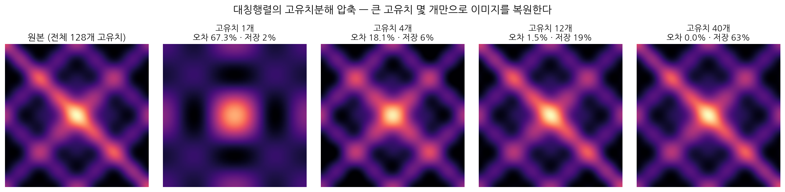
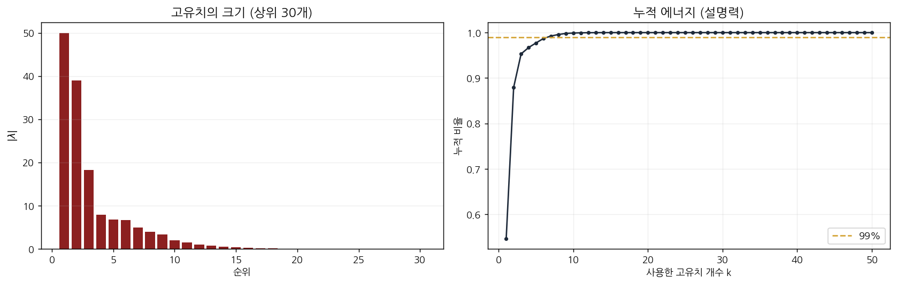

# NumPy 선형대수 —
## 회귀 풀이 · 고유치 분해

방금 배운 **전치**(`.T`) · **행렬곱**(`@`) · **행렬식**(det) · **역행렬**(inv)이 그대로 쓰이는 두 응용을 한 자리에 모았다. 특히 **직교행렬에서는 역행렬이 곧 전치**(Q⁻¹=Qᵀ)라는 점이 1부의 (XᵀX)⁻¹ 와 2부의 분해를 잇는다.

> 그림 파일을 `figs/` 폴더(이 md 파일과 같은 위치)에 두어야 2부의 그림이 보인다.

---

# 1부 · 회귀 풀이 — NumPy로 직접 푸는 선형회귀

선형회귀의 최적 계수는 한 줄로 구해진다.

> **β = (XᵀX)⁻¹ Xᵀy**

이 한 줄에 전치(Xᵀ), 행렬곱(XᵀX·Xᵀy), 역행렬((XᵀX)⁻¹)이 모두 들어 있다. 같은 문제를 **행렬식**으로 푸는 Cramer 법칙도 함께 본다.

## 0. 문제 설정

광고비 x 에 따른 매출 y 를 직선 ŷ = β₀ + β₁x 로 설명한다.

```python
import numpy as np
np.set_printoptions(suppress=True)

x = np.array([1, 2, 3, 4, 5], dtype=float)
y = np.array([3, 4, 6, 5, 7], dtype=float)
```

## 1. 행렬로 세우기 — 설계행렬 X

절편 β₀ 를 위해 **1 로 채운 열**을 앞에 붙인다. 그러면 ŷ = Xβ 로 한 번에 쓸 수 있다.

```python
X = np.column_stack([np.ones_like(x), x])   # 절편 열 + x 열
# X =
# [[1. 1.]  [1. 2.]  [1. 3.]  [1. 4.]  [1. 5.]]   shape (5, 2)
```

## 2. 풀이 1 — 정규방정식 β = (XᵀX)⁻¹Xᵀy

전치 → 행렬곱 → 역행렬을 차례로 적용한다.

```python
Xt  = X.T            # (1) 전치: (5,2) → (2,5)
XtX = Xt @ X         # (2) 행렬곱: (2,5)@(5,2) = (2,2)
Xty = Xt @ y         #     행렬곱: (2,5)@(5,)  = (2,)
# XᵀX = [[ 5. 15.]      Xᵀy = [25. 84.]
#        [15. 55.]]

beta = np.linalg.inv(XtX) @ Xty      # (3) 역행렬  (4) 곱
# β = [2.3 0.9]   →   ŷ = 2.3 + 0.9 x
```

## 3. 풀이 2 — Cramer 법칙 (행렬식의 비율)

역행렬 대신 **행렬식**으로 같은 답을 얻는다. 2×2 행렬식은 ad − bc 다.

> β₀ = det(M₀) / det(XᵀX),  β₁ = det(M₁) / det(XᵀX)

M₀ 는 XᵀX 의 0번 열을 Xᵀy 로, M₁ 은 1번 열을 Xᵀy 로 바꾼 행렬이다.

```python
def det2(A):                       # 2x2 행렬식
    return A[0,0]*A[1,1] - A[0,1]*A[1,0]

D  = det2(XtX)                     # det(XᵀX) = 50.0
M0 = XtX.copy(); M0[:, 0] = Xty    # 0번 열 교체
M1 = XtX.copy(); M1[:, 1] = Xty    # 1번 열 교체
b0 = det2(M0) / D;  b1 = det2(M1) / D
# det(M₀)=115.0  det(M₁)=45.0  →  β₀ = 115/50 = 2.3,  β₁ = 45/50 = 0.9
```

두 방법의 답이 β = [2.3, 0.9] 로 같다. 행렬식이 0 이 아니므로(det=50) 역행렬이 존재하고, 두 풀이가 일치한다.

## 4. 예측과 결정계수 R²

> R² = 1 − Σ(y − ŷ)² / Σ(y − ȳ)²

```python
yhat = X @ beta                    # 예측 ŷ = Xβ
r2 = 1 - ((y-yhat)**2).sum() / ((y-y.mean())**2).sum()
# ŷ = [3.2 4.1 5.0 5.9 6.8]    잔차제곱합=1.9   전체제곱합=10.0
# R² = 0.81   (직선이 분산의 81%를 설명)
```

## 5. 다중회귀로 확장 — 공식은 그대로

변수가 둘(x₁, x₂)이어도 정규방정식 β = (XᵀX)⁻¹Xᵀy 는 **그대로** 쓴다. 설계행렬에 열만 하나 더 붙인다.

```python
x1 = np.array([10, 20, 30, 40, 50, 60], dtype=float)
x2 = np.array([ 1,  1,  2,  2,  3,  3], dtype=float)
ym = np.array([15, 28, 46, 58, 79, 90], dtype=float)

Xb   = np.column_stack([np.ones_like(x1), x1, x2])   # 절편 + x1 + x2, (6,3)
beta = np.linalg.inv(Xb.T @ Xb) @ Xb.T @ ym
# β = [-4.3333  1.2  7.5]      R² = 0.9994
```

## 6. 정리 — NumPy 연산과 회귀의 대응

| 회귀의 한 조각 | NumPy 연산 |
|---|---|
| 설계행렬 세우기 | `np.column_stack([np.ones_like(x), x])` |
| Xᵀ (전치) | `X.T` |
| XᵀX, Xᵀy (행렬곱) | `X.T @ X`, `X.T @ y` |
| (XᵀX)⁻¹ (역행렬) | `np.linalg.inv(...)` |
| Cramer 분모·분자 (행렬식) | `a*d - b*c` |
| 예측 ŷ | `X @ beta` |

정규방정식과 Cramer 법칙은 **같은 답**을 준다. 변수가 늘어도 β = (XᵀX)⁻¹Xᵀy 한 줄은 변하지 않는다.

---

# 2부 · 고유치 분해 — 대칭행렬의 분해와 이미지 압축

핵심 흐름은 하나다. **대칭행렬**은 고유벡터가 서로 직교하므로, 단위벡터로 맞추면 직교행렬 Q(즉 Q⁻¹=Qᵀ)가 되어 A = QΛQᵀ 로 깔끔하게 분해된다. 큰 고유치 몇 개만 남기면 **압축**이 되고, 이미지가 어떻게 달라지는지 직접 본다.

## 1. 고유치와 고유벡터 — A v = λ v

행렬 A 를 곱해도 **방향이 바뀌지 않고 크기만 λ배** 되는 벡터 v 가 **고유벡터**, 그 배율 λ 가 **고유치**다.

> A v = λ v

```python
A = np.array([[2, 1],
              [1, 2]], dtype=float)     # 대칭행렬
w, Q = np.linalg.eigh(A)   # eigh: 대칭 전용 (고유치 오름차순 + 정규직교 고유벡터)
# 고유치 λ = [1. 3.]
# A·v = λ·v 가 성립
```

## 2. 대칭행렬의 특별함 — 정규직교 고유벡터

대칭행렬(A = Aᵀ)은 고유치가 모두 **실수**이고 고유벡터가 서로 **직교**한다(스펙트럼 정리). 고유벡터를 **단위벡터로 정규화**(normalize)하면 Q 의 열이 정규직교가 되어 Q 는 직교행렬이 된다. 직교행렬의 핵심 성질은 **역행렬이 곧 전치**라는 것이다.

> QᵀQ = I  ⟹  Q⁻¹ = Qᵀ

```python
# 각 고유벡터 길이(노름) = [1. 1.]   (이미 정규화됨)
# QᵀQ = [[1. 0.],[0. 1.]]  → 직교행렬 → Q⁻¹ = Qᵀ
```

## 3. 고유치 분해 A = Q Λ Qᵀ 와 복원

고유벡터를 열로 모은 Q 와 고유치를 대각에 놓은 Λ 로 분해한다. 직교행렬이라 Q⁻¹ 대신 Qᵀ 를 쓴다. 거꾸로 되곱하면 **원행렬이 정확히 복원**된다.

> A = Q Λ Qᵀ

```python
recon = Q @ np.diag(w) @ Q.T
# [[2. 1.],[1. 2.]]  =  원래 A  (복원 성공)
```

## 4. 스펙트럼 — 고유치별 기여의 합

고유치 분해를 풀어 쓰면 행렬은 **각 고유치가 만든 랭크-1 조각들의 합**이다. 큰 고유치가 큰 골격을, 작은 고유치가 세부를 담당한다.

> A = Σ λᵢ qᵢ qᵢᵀ

## 5. 이미지 압축 — 고유치 개수에 따라 이미지가 달라진다

이미지를 **대칭행렬**로 만들어, 큰 고유치 k 개만 남긴 랭크-k 근사 `A_k = Σ(i≤k) λᵢ qᵢqᵢᵀ` 로 복원한다. k 가 작으면 골격만, k 가 커지면 세부까지 살아난다.

```python
import koreanize_matplotlib
import matplotlib.pyplot as plt

# 대칭 이미지 구성 (X<->Y 교환에 불변 → 대칭행렬)
n = 128
x = np.linspace(-3, 3, n); X, Y = np.meshgrid(x, x)
img = (np.exp(-(X**2 + Y**2)/2)
       + 0.6*np.cos(2*X)*np.cos(2*Y)
       + 0.45*np.exp(-((X-Y)**2)/0.25)
       + 0.25*np.cos(4*X)*np.cos(4*Y))
# |A - Aᵀ| 최대값 = 0  (대칭 확인)

w_img, Q_img = np.linalg.eigh(img)              # 대칭이므로 eigh
order = np.argsort(np.abs(w_img))[::-1]         # 고유치 크기 내림차순
w_img, Q_img = w_img[order], Q_img[:, order]

def rank_k(k):
    return (Q_img[:, :k] * w_img[:k]) @ Q_img[:, :k].T   # 큰 고유치 k개만
```



고유치 1개로는 중앙의 큰 덩어리만, 4개에서 격자 무늬가, 12개에서 거의 원본과 구분되지 않는다(오차 1.5%). 즉 **큰 고유치 몇 개가 이미지의 대부분을 설명**한다.



고유치 크기는 빠르게 감소하고, 12개로 누적 에너지(설명력)가 약 99.98%에 이른다.

> 대칭행렬에서는 고유치분해와 **SVD**(특이값 분해)가 일치한다. 일반(직사각) 이미지의 압축은 SVD로 같은 원리를 쓰며, 특이값은 대칭행렬 AᵀA 의 고유치의 제곱근이다.

## 6. 정리

| 단계 | 식 / 함수 | 뜻 |
|---|---|---|
| 고유치·고유벡터 | `A v = λ v`, `np.linalg.eigh` | 방향 불변, 크기만 λ배 |
| 대칭행렬 | Q 정규직교 → `Q⁻¹ = Qᵀ` | 고유벡터 직교, 정규화하면 직교행렬 |
| 고유치분해 | `A = Q Λ Qᵀ` | 되곱하면 원행렬 복원 |
| 스펙트럼 | `A = Σ λᵢ qᵢqᵢᵀ` | 큰 고유치가 큰 골격 |
| 압축 | `A_k = Σ(i≤k) λᵢ qᵢqᵢᵀ` | 큰 고유치 k개 → 근사 |

오늘 배운 **전치·행렬곱·역행렬**이 여기서도 그대로 쓰였다. 직교행렬에서 역행렬이 전치가 된다는 점이 분해를 깔끔하게 만든다.
