# 10장 그래프 (Graphs)

그래프는 **꼭지점**(vertex, node)들과 이 꼭지점들을 연결하는 **모서리**(edge)들로 구성된 이산구조이다. 모서리가 방향을 갖는지, 같은 꼭지점 쌍을 여러 번 연결하는지, 한 꼭지점을 자기 자신에 연결하는지에 따라 여러 유형이 나뉜다. 본 장에서는 그래프의 기본 개념과 모델, 그리고 그래프로 해결할 수 있는 대표적 문제들을 다룬다.

---

## 10.1 그래프와 그래프 모델들

### 10.1.1 그래프의 정의

> **정의 1.** **그래프**(graph) $G=(V,E)$는 공집합이 아닌 **꼭지점**(vertex)들의 집합 $V$와 **모서리**(edge)들의 집합 $E$로 구성된다. 각 모서리는 하나 또는 두 개의 꼭지점을 **끝점**(endpoint)으로 가지며, 모서리는 그 끝점들을 연결한다.

꼭지점 집합 $V$가 유한집합인 그래프를 **유한 그래프**(finite graph), 무한집합인 그래프를 **무한 그래프**(infinite graph)라 한다. 본 강의에서 다루는 그래프는 모두 유한 그래프이다.

그래프는 꼭지점을 점으로, 모서리를 두 점을 잇는 선으로 그려 표현한다. 모서리를 나타내는 선들이 서로 교차하지 않도록 그리려 노력하지만, 교차 여부 자체는 그래프의 정의에 영향을 주지 않는다. 중요한 것은 어떤 꼭지점 쌍이 연결되어 있는가뿐이다.

### 10.1.2 그래프의 종류

모서리에 방향이 있는지, 같은 꼭지점 쌍 사이에 모서리가 여럿 있는지, 한 꼭지점을 자기 자신에 잇는 모서리가 있는지에 따라 그래프를 분류한다.

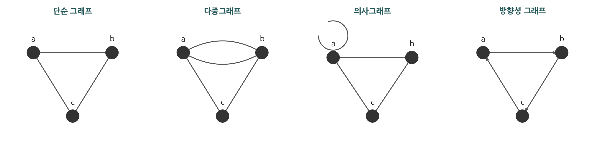

- **단순 그래프**(simple graph): 각 모서리가 서로 다른 두 꼭지점을 연결하고, 같은 꼭지점 쌍을 연결하는 모서리가 둘 이상 존재하지 않는 그래프이다. 단순 그래프의 모서리는 순서 없는 꼭지점 쌍 $\{u,v\}$이며, 한 쌍 사이에는 모서리가 최대 하나이다.
- **다중모서리**(multiple edges): 같은 꼭지점 쌍 $\{u,v\}$를 연결하는 둘 이상의 모서리를 가리킨다. 다중모서리를 허용하는 그래프를 **다중그래프**(multigraph)라 한다.
- **루프**(loop): 한 꼭지점을 자기 자신에 연결하는 모서리이다. 루프와 다중모서리를 모두 허용하는 그래프를 **의사그래프**(pseudograph)라 한다.

지금까지의 그래프는 모서리에 방향이 없는 **비방향성 그래프**(undirected graph)이다. 모서리에 방향이 필요한 경우 방향성 그래프를 사용한다.

> **정의 2.** **방향성 그래프**(directed graph, digraph) $(V,E)$는 공집합이 아닌 꼭지점 집합 $V$와 **방향모서리**(directed edge)들의 집합 $E$로 구성된다. 각 방향모서리는 꼭지점들의 순서쌍이다. 순서쌍 $(u,v)$에 관련된 방향모서리는 $u$에서 **시작**(start)하여 $v$에서 **끝난다**(end).

- **단순방향성 그래프**(simple directed graph): 루프와 다중 방향모서리가 하나도 없는 방향성 그래프이다.
- **방향성 다중 그래프**(directed multigraph): 같은 순서쌍 $(u,v)$에 대응하는 방향모서리를 여럿 가질 수 있다.
- **혼합그래프**(mixed graph): 방향성 모서리와 비방향성 모서리를 함께 가지는 그래프이다.

여섯 종류의 그래프를 다음 표에 정리한다.

| 종류 | 모서리 | 다중모서리 | 루프 |
|---|---|---|---|
| 단순 그래프 | 비방향성 | 허용 안 함 | 허용 안 함 |
| 다중그래프 | 비방향성 | 허용 | 허용 안 함 |
| 의사그래프 | 비방향성 | 허용 | 허용 |
| 단순방향성 그래프 | 방향성 | 허용 안 함 | 허용 안 함 |
| 방향성 다중 그래프 | 방향성 | 허용 | 허용 |
| 혼합그래프 | 방향성·비방향성 | 허용 | 허용 |

### 10.1.3 그래프 모델

그래프는 다양한 분야의 관계 구조를 모델링한다. 대표적 모델을 정리한다.

- **소셜 네트워크 그래프**: 사람을 꼭지점으로, 친구·교우·협력 관계를 모서리로 표현한다. 친구 관계처럼 대칭인 관계는 비방향성 모서리로, 영향력처럼 한쪽 방향인 관계는 방향모서리로 표현한다. 현재 페이스북, 인스타그램, 링크드인 같은 서비스의 사용자 연결망이 모두 거대한 소셜 네트워크 그래프이며, 친구 추천과 커뮤니티 탐지가 이 그래프 위에서 이루어진다.
- **영향력 그래프**(influence graph): 사람을 꼭지점으로, $a$가 $b$의 판단에 영향을 준다는 사실을 방향모서리 $(a,b)$로 표현한 방향성 그래프이다.
- **공동작업(협력) 그래프**(collaboration graph): 함께 작업한 두 사람을 모서리로 연결한다. 배우들의 공동 출연을 나타내는 **할리우드 그래프**(Hollywood graph), 논문 공저를 나타내는 학술 공동연구 그래프가 예이다.
- **통화 그래프**(call graph): 전화번호를 꼭지점으로, 호출을 방향모서리로 표현한다.
- **웹 그래프**(web graph): 웹 페이지를 꼭지점으로, 하이퍼링크를 방향모서리로 표현한다. 검색 엔진의 페이지 순위 계산이 이 그래프 구조를 이용한다.
- **우선순위 그래프**(precedence graph): 동시 실행 프로그램에서 문장을 꼭지점으로, "문장 $S_i$가 $S_j$보다 먼저 실행되어야 함"을 방향모서리로 표현한다.
- **생태학 지위 중복 그래프**(niche overlap graph): 종을 꼭지점으로, 두 종이 먹이·자원을 두고 경쟁하면 모서리로 연결한다.
- **단백질 상호작용 그래프**(protein interaction graph): 단백질을 꼭지점으로, 두 단백질이 결합하여 생물학적 기능을 수행하면 모서리로 연결한다.

이러한 모델에서 모델링 대상의 성질에 따라 (1) 모서리에 방향이 필요한가, (2) 다중모서리를 허용해야 하는가, (3) 루프를 허용해야 하는가를 먼저 판단하여 적절한 그래프 종류를 선택한다.

**예제 1.** 데이터 센터들이 통신망으로 연결된 컴퓨터 네트워크를 모델링한다. 각 데이터 센터를 꼭지점으로, 통신망을 모서리로 둔다. 두 센터 사이에 통신망이 하나뿐이고 자기 자신으로 가는 통신망이 없다면 **단순 그래프**가 적절하다. 두 센터 사이에 통신망이 여러 개 있을 수 있다면 **다중그래프**가, 진단용 자기 연결(루프)까지 있다면 **의사그래프**가 필요하다. 통신망이 한 방향으로만 동작한다면 **방향성 그래프**를 사용한다.

**예제 2 (영향력 그래프 읽기).** 네 사람 $a,b,c,d$ 사이의 영향 관계를 방향모서리로 표현한 그래프에서 모서리가 $(a,b)$, $(a,c)$, $(b,c)$, $(d,c)$라 하자. 방향모서리 $(a,b)$는 $a$가 $b$에게 영향을 준다는 뜻이다. 꼭지점 $c$는 $a,b,d$ 세 사람으로부터 영향을 받으므로 입력차수가 $3$으로 가장 크다. 반면 $a$는 누구에게도 영향을 받지 않아 입력차수가 $0$이고, $d$도 입력차수가 $0$이다. 이처럼 방향성 그래프에서는 한 꼭지점이 받는 영향과 주는 영향이 입력차수·출력차수로 구분되며, 영향력의 비대칭성을 그대로 담을 수 있다. 친구 관계처럼 대칭인 관계였다면 방향이 없는 단순 그래프로 충분하다.

### 자기 점검 (10.1)

다음 질문에 한 줄로 답해 보라.

1. 단순 그래프와 다중그래프를 구분하는 기준은 무엇인가?
2. 루프를 허용하는 비방향성 그래프의 이름은 무엇인가?
3. $a$가 $b$에게 영향을 준다는 비대칭 관계를 모델링하려면 어떤 종류의 그래프가 필요한가?

<details>
<summary>정답</summary>

1. 같은 꼭지점 쌍을 연결하는 모서리가 둘 이상 존재할 수 있는가(다중모서리 허용 여부)이다. 단순 그래프는 허용하지 않고, 다중그래프는 허용한다.
2. 의사그래프(pseudograph)이다.
3. 방향성 그래프(directed graph, digraph)이다.

</details>

---

## 10.2 그래프 용어와 특별한 그래프

### 10.2.1 기본 용어

> **정의 1.** 비방향성 그래프 $G$에서 두 꼭지점 $u$와 $v$가 한 모서리의 두 끝점이면 $u$와 $v$는 **인접한다**(adjacent, neighbor)고 한다. 모서리 $e=\{u,v\}$에 대해 "모서리 $e$는 꼭지점 $u$와 $v$에 **붙어 있다**(incident)"고 하며, $e$는 $u$와 $v$를 **연결한다**(connect)고 말한다.

> **정의 2.** 그래프 $G=(V,E)$의 꼭지점 $v$의 모든 이웃들의 집합을 $N(v)$로 표기하고 $v$의 **이웃집합**(neighborhood)이라 한다. $A\subseteq V$이면 $N(A)$는 $A$의 어떤 꼭지점과 인접한 모든 꼭지점의 집합이다. 즉 $N(A)=\bigcup_{v\in A}N(v)$이다.

> **정의 3.** 비방향성 그래프에서 꼭지점 $v$의 **차수**(degree) $\deg(v)$는 그 꼭지점에 붙어 있는 모서리의 개수이다. 단, 루프 하나는 차수에 $2$를 더한다.

차수가 $0$인 꼭지점을 **고립**(isolated)된 꼭지점이라 하며, 인접한 꼭지점을 갖지 않는다. 차수가 $1$인 꼭지점을 **늘어진**(pendant) 꼭지점이라 하며, 정확히 하나의 다른 꼭지점과 인접한다.

**예제 1.** 다음 그래프 $G$에서 각 꼭지점의 이웃과 차수를 구한다.

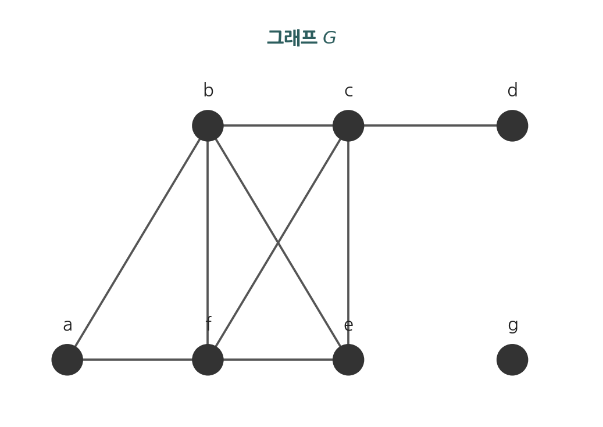

이웃집합은
$$N(a)=\{b,f\},\quad N(b)=\{a,c,e,f\},\quad N(c)=\{b,d,e,f\},\quad N(d)=\{c\},\quad N(e)=\{b,c,f\},\quad N(f)=\{a,b,c,e\}$$
이고, 차수는
$$\deg(a)=2,\ \deg(b)=4,\ \deg(c)=4,\ \deg(d)=1,\ \deg(e)=3,\ \deg(f)=4$$
이다. 여기서 $d$는 늘어진 꼭지점이다. (그림에 표시되지 않은 고립 꼭지점 $g$가 있다면 $\deg(g)=0$이다.)

### 10.2.2 악수정리

> **정리 1 (악수정리, Handshaking Theorem).** $G=(V,E)$가 $m$개의 모서리를 갖는 비방향성 그래프이면
> $$2m=\sum_{v\in V}\deg(v)$$
> 이다. 이 결과는 다중모서리와 루프를 갖는 그래프에서도 성립한다.

**증명.** 모든 꼭지점의 차수의 합 $\sum_{v\in V}\deg(v)$를 모서리 단위로 다시 센다. 모서리 하나는 정확히 두 개의 끝점을 가지므로, 그 모서리는 두 끝점 각각의 차수에 $1$씩, 합하여 $2$를 기여한다. 루프는 한 꼭지점에 차수 $2$를 기여하므로 마찬가지로 그 모서리 하나가 차수합에 $2$를 기여한다. 따라서 모든 모서리에 걸쳐 합하면 차수합은 모서리 수의 두 배가 된다. 즉 $\sum_{v\in V}\deg(v)=2m$이다. $\blacksquare$

이 정리의 이름은 한 모서리가 두 끝점을 가지는 것을, 악수가 두 손을 필요로 하는 것에 대응시킨 데서 유래한다.

**예제 2.** 각 꼭지점의 차수가 $6$인 꼭지점 $10$개짜리 그래프의 모서리 수를 구한다. 차수의 합은 $6\cdot 10=60$이므로 악수정리에 의해 $2m=60$, 즉 $m=30$이다.

악수정리는 차수의 합이 항상 짝수임을 보여 준다. 여기서 다음 결과가 따라온다.

> **정리 2.** 비방향성 그래프에서 홀수 차수의 꼭지점의 개수는 짝수이다.

**증명.** 꼭지점 집합 $V$를 짝수 차수 꼭지점의 집합 $V_1$과 홀수 차수 꼭지점의 집합 $V_2$로 나눈다. 악수정리에 의해
$$2m=\sum_{v\in V}\deg(v)=\sum_{v\in V_1}\deg(v)+\sum_{v\in V_2}\deg(v)$$
이다. 우변 첫 항 $\sum_{v\in V_1}\deg(v)$는 짝수들의 합이므로 짝수이다. 또한 좌변 $2m$은 짝수이다. 따라서 둘째 항 $\sum_{v\in V_2}\deg(v)$도 짝수이다. 그런데 이 항은 모두 홀수인 차수들의 합이므로, 홀수를 짝수 개 더해야만 짝수가 된다. 그러므로 $V_2$의 원소 수, 즉 홀수 차수 꼭지점의 개수는 짝수이다. $\blacksquare$

### 10.2.3 방향성 그래프의 차수

> **정의 4.** $(u,v)$가 방향모서리일 때 $u$는 $v$에 **인접한다**(adjacent to)고 하고, $v$는 $u$로부터 **인접된다**(adjacent from)고 한다. $u$를 $(u,v)$의 **시작 꼭지점**(initial vertex), $v$를 **끝 꼭지점**(terminal vertex)이라 한다.

> **정의 5.** 방향성 그래프에서 꼭지점 $v$의 **입력차수**(in-degree) $\deg^-(v)$는 $v$를 끝 꼭지점으로 갖는 모서리의 수이다. **출력차수**(out-degree) $\deg^+(v)$는 $v$를 시작 꼭지점으로 갖는 모서리의 수이다. 루프는 그 꼭지점의 입력차수와 출력차수에 각각 $1$을 더한다.

> **정리 3.** 방향성 그래프 $G=(V,E)$에서
> $$\sum_{v\in V}\deg^-(v)=\sum_{v\in V}\deg^+(v)=|E|$$
> 이다.

**증명.** 각 방향모서리는 정확히 하나의 시작 꼭지점과 하나의 끝 꼭지점을 가진다. 그러므로 모든 모서리에 걸쳐 시작 꼭지점을 세면 출력차수의 합 $\sum_v\deg^+(v)$가 정확히 모서리 수 $|E|$가 된다. 마찬가지로 끝 꼭지점을 세면 입력차수의 합 $\sum_v\deg^-(v)$가 $|E|$가 된다. $\blacksquare$

모서리의 방향을 무시하여 얻는 비방향성 그래프를 **비방향성 근저 그래프**(underlying undirected graph)라 한다. 방향성 그래프와 그 근저 그래프는 같은 수의 모서리를 가진다.

**예제 (입력차수와 출력차수 계산).** 꼭지점이 $a,b,c$이고 방향모서리가 $(a,b)$, $(b,c)$, $(c,a)$, $(a,c)$인 방향성 그래프를 생각한다. 각 꼭지점의 입력차수와 출력차수를 센다. $a$를 끝 꼭지점으로 갖는 모서리는 $(c,a)$ 하나이므로 $\deg^-(a)=1$이고, $a$를 시작 꼭지점으로 갖는 모서리는 $(a,b)$와 $(a,c)$이므로 $\deg^+(a)=2$이다. 같은 방식으로 $\deg^-(b)=1$, $\deg^+(b)=1$, $\deg^-(c)=2$, $\deg^+(c)=1$을 얻는다. 입력차수의 합은 $1+1+2=4$, 출력차수의 합도 $2+1+1=4$로 모서리 수 $4$와 모두 같다. 이는 정리 3을 그대로 확인한 것이다.

### 10.2.4 특수한 단순 그래프

다음 단순 그래프들은 예와 모델에서 자주 사용된다.

**완전 그래프**(complete graph) $K_n$은 꼭지점 $n$개를 가지며, 서로 다른 두 꼭지점의 모든 쌍 사이에 정확히 하나의 모서리를 갖는 단순 그래프이다.

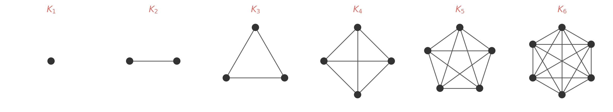

$K_n$의 각 꼭지점은 나머지 $n-1$개 꼭지점과 모두 인접하므로 모든 꼭지점의 차수가 $n-1$이다. 악수정리에 의해 모서리 수는
$$m=\frac{1}{2}\sum_{v}\deg(v)=\frac{n(n-1)}{2}=\binom{n}{2}$$
이다. 모서리로 연결되지 않은 꼭지점 쌍이 적어도 하나 있는 그래프를 **불완전 그래프**(noncomplete graph)라 한다.

**사이클**(cycle) $C_n$ ($n\ge 3$)은 꼭지점 $v_1,v_2,\dots,v_n$과 모서리 $\{v_1,v_2\},\{v_2,v_3\},\dots,\{v_{n-1},v_n\},\{v_n,v_1\}$으로 구성된다. 모든 꼭지점의 차수가 $2$이고 모서리 수는 $n$이다.

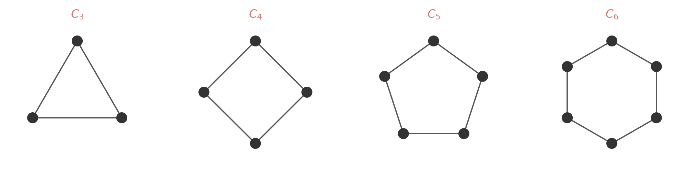

**휠**(wheel) $W_n$ ($n\ge 3$)은 사이클 $C_n$의 중앙에 꼭지점 하나를 추가하고 이 새 꼭지점을 $C_n$의 모든 꼭지점과 연결하여 얻는다. 꼭지점 수는 $n+1$, 모서리 수는 $2n$이다.

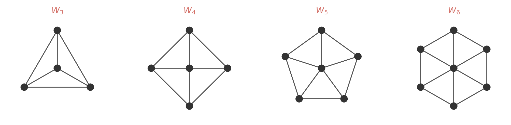

**$n$-큐브**(n-cube) $Q_n$은 길이 $n$의 비트 스트링 $2^n$개를 꼭지점으로 갖는 그래프이다. 두 꼭지점이 인접할 필요충분조건은 두 비트 스트링이 정확히 한 비트 위치에서만 다른 것이다. 꼭지점 수는 $2^n$, 각 꼭지점의 차수는 $n$이며, 악수정리에 의해 모서리 수는 $n\cdot 2^{n-1}$이다.

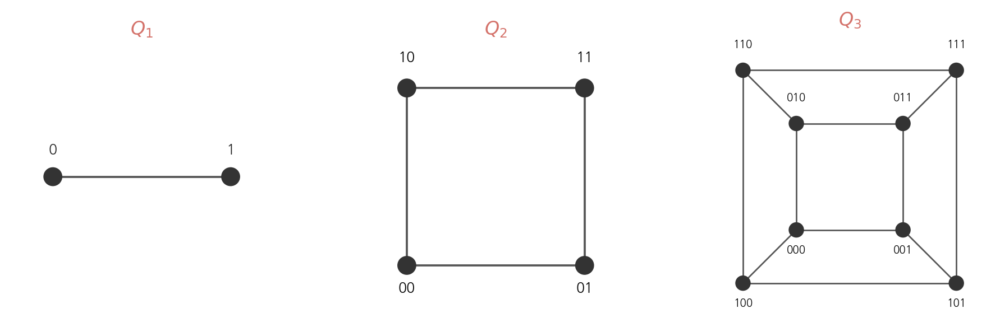

### 10.2.5 이분 그래프

> **정의 6.** 단순 그래프 $G$의 꼭지점 집합 $V$가 겹치지 않는 두 집합 $V_1$과 $V_2$로 나뉘고, 그래프의 모든 모서리가 $V_1$의 한 꼭지점과 $V_2$의 한 꼭지점만을 연결하면, $G$를 **이분 그래프**(bipartite graph)라 한다. 이때 쌍 $(V_1,V_2)$를 $V$의 **이분**(bipartition)이라 한다.

이분 그래프에서는 $V_1$ 내부의 두 꼭지점 사이, 또는 $V_2$ 내부의 두 꼭지점 사이를 연결하는 모서리가 존재하지 않는다.

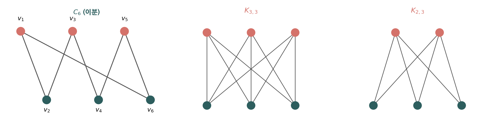

**예제 3.** $C_6$은 이분 그래프이다. 꼭지점을 $V_1=\{v_1,v_3,v_5\}$와 $V_2=\{v_2,v_4,v_6\}$으로 나누면 모든 모서리가 $V_1$의 꼭지점과 $V_2$의 꼭지점을 연결한다.

**예제 4.** $K_3$은 이분 그래프가 아니다. $K_3$의 세 꼭지점을 두 집합으로 나누면 한 집합은 반드시 두 꼭지점을 포함하는데, $K_3$에서는 모든 꼭지점이 서로 인접하므로 그 두 꼭지점이 한 모서리로 연결되어 이분의 정의를 위배한다.

> **정리 4 (이분 판정).** 단순 그래프가 이분 그래프일 필요충분조건은 각 꼭지점에 두 색 중 하나를 할당하여 인접한 두 꼭지점이 같은 색을 갖지 않도록 할 수 있는 것이다.

즉 이분 그래프는 **2-채색 가능**(2-colorable) 그래프이다. 색 두 가지가 두 부분집합 $V_1$, $V_2$에 대응한다. (그래프 채색은 10.8절에서 다룬다.) 또한 그래프가 이분일 필요충분조건은 홀수 길이의 순환을 갖지 않는 것이며, 이는 10.4절의 경로·순환 개념으로 명확히 다룬다.

**완전 이분 그래프**(complete bipartite graph) $K_{m,n}$은 꼭지점 집합이 각각 $m$개, $n$개인 두 부분집합으로 나뉘고, 한 부분집합의 꼭지점과 다른 부분집합의 꼭지점 사이에만 모서리가 존재할 때, 그러한 모든 쌍이 모서리로 연결된 그래프이다. 모서리 수는 $mn$이다.

### 10.2.6 매칭과 홀의 정리

> **정의.** 단순 그래프 $G=(V,E)$에서 **매칭**(matching) $M$은 두 모서리가 같은 꼭지점에 붙지 않도록 고른 모서리들의 집합($E$의 부분집합)이다. 매칭의 모서리에 끝점으로 포함된 꼭지점은 $M$에서 **매칭되었다**(matched)고 하고, 그렇지 않으면 **매칭되지 않았다**(unmatched)고 한다. 모서리 수가 최대인 매칭을 **최대 매칭**(maximum matching)이라 한다. $(V_1,V_2)$로 이분된 이분 그래프에서 $V_1$의 모든 꼭지점이 매칭되는 매칭, 즉 $|M|=|V_1|$인 매칭을 $V_1$에서 $V_2$로의 **완전 매칭**(complete matching)이라 한다.

매칭은 한 집합의 원소를 다른 집합의 원소에 짝짓는 문제(작업 배정, 결혼 짝짓기 등)를 모델링한다. 완전 매칭의 존재 여부는 다음 정리가 결정한다.

> **정리 5 (홀의 결혼정리, Hall's Marriage Theorem).** 이분 $(V_1,V_2)$를 갖는 이분 그래프 $G=(V,E)$가 $V_1$에서 $V_2$로 완전 매칭일 필요충분조건은 $V_1$의 모든 부분집합 $A$에 대해 $|N(A)|\ge|A|$인 것이다.

**증명 (필요조건).** $V_1$에서 $V_2$로의 완전 매칭 $M$이 존재한다고 하자. 임의의 $A\subseteq V_1$에 대해, $A$의 각 꼭지점은 $M$에서 $V_2$의 서로 다른 꼭지점과 짝지어진다. 그 짝들은 모두 $A$의 이웃이므로 $N(A)$에 속하고 서로 다르다. 따라서 $|N(A)|\ge|A|$이다.

**증명 (충분조건).** 조건 $|N(A)|\ge|A|$가 모든 $A\subseteq V_1$에 대해 성립한다고 가정하고, $|V_1|$에 대한 강한 수학적 귀납법으로 완전 매칭의 존재를 보인다.

기저 단계. $|V_1|=1$이면 $V_1=\{v_0\}$이다. 조건에서 $|N(\{v_0\})|\ge 1$이므로 $v_0$은 적어도 한 이웃 $w_0$을 가진다. 모서리 하나 $\{v_0,w_0\}$이 곧 $V_1$에서 $V_2$로의 완전 매칭이다.

귀납 단계. $k$를 양의 정수라 하자. $|V_1|=j\le k$인 모든 이분 그래프에서 홀의 조건이 성립하면 완전 매칭이 존재한다고 가정한다(강한 귀납 가정). 이제 $(W_1,W_2)$로 이분되고 $|W_1|=k+1$인 이분 그래프 $H=(W,F)$를 생각한다. 다음 두 경우 가운데 하나는 반드시 성립하므로, 두 경우만 다루면 된다.

**경우 (i).** $1\le j\le k$인 모든 $j$에 대해, $W_1$의 $j$개짜리 모든 부분집합이 $W_2$의 적어도 $j+1$개 원소와 인접하는 경우. $W_1$의 꼭지점 $v$와 그 이웃 $w\in N(\{v\})$를 고른다($|N(\{v\})|\ge 1$이므로 $w$가 존재한다). $H$에서 $v$와 $w$, 그리고 그 둘에 붙은 모서리를 모두 제거하여 $(W_1-\{v\},\ W_2-\{w\})$로 이분되는 그래프 $H'$를 만든다. $H'$의 임의의 부분집합 $A\subseteq W_1-\{v\}$는 $H$에서 적어도 $|A|+1$개의 이웃을 가졌고 그중 사라진 것은 많아야 $w$ 하나이므로, $H'$에서 적어도 $|A|$개의 이웃을 가진다. 따라서 $H'$도 홀의 조건을 만족한다. $|W_1-\{v\}|=k$이므로 귀납 가정에 의해 $H'$는 $W_1-\{v\}$에서 $W_2-\{w\}$로의 완전 매칭을 가지며, 여기에 모서리 $\{v,w\}$를 더하면 $W_1$에서 $W_2$로의 완전 매칭이 된다.

**경우 (ii).** 어떤 $j$($1\le j\le k$)에 대해, $W_1$의 어떤 $j$개짜리 부분집합 $W_1'$이 $W_2$에서 정확히 $j$개의 이웃만 갖는 경우. 그 이웃 집합을 $W_2'$라 하자($|W_2'|=j$). $W_1'$의 임의의 부분집합은 $W_1$의 부분집합이기도 하여 홀의 조건을 만족하므로, $|W_1'|=j\le k$에서 귀납 가정에 의해 $W_1'$에서 $W_2'$로의 완전 매칭이 존재한다. 이제 $H$에서 $W_1'$과 $W_2'$의 꼭지점 $2j$개와 그에 붙은 모서리를 모두 제거하여 $(W_1-W_1',\ W_2-W_2')$로 이분되는 그래프 $K$를 만든다.

$K$가 홀의 조건을 만족함을 보인다. 그렇지 않다면, $W_1-W_1'$의 어떤 $t$개짜리 부분집합($1\le t\le k+1-j$)이 $W_2-W_2'$에서 $t$보다 적은 이웃을 가진다. 그러면 이 $t$개의 꼭지점과 $W_1'$의 $j$개의 꼭지점을 합친 $W_1$의 $j+t$개짜리 부분집합은, $H$에서 이웃이 $W_2'$의 $j$개와 $W_2-W_2'$ 쪽의 $t$개 미만을 합쳐 $j+t$개보다 적어진다. 이는 $W_1$의 모든 부분집합 $A$에 대해 $|N(A)|\ge|A|$라는 가정에 모순이다. 그러므로 $K$는 홀의 조건을 만족하고, 귀납 가정에 의해 $K$에 완전 매칭이 존재한다. 이 완전 매칭과 앞서 얻은 $W_1'$에서 $W_2'$로의 완전 매칭을 합치면 $W_1$에서 $W_2$로의 완전 매칭이 된다.

두 경우 모두 $W_1$에서 $W_2$로의 완전 매칭이 존재하므로 귀납 단계가 완성되고, 강한 귀납법에 의해 정리가 증명된다. $\blacksquare$

이 증명을 처음 읽으면 경우 (ii)의 반증 논증이 한눈에 들어오지 않으므로, 아래에서 각 단계를 자세히 풀어 설명한다.

먼저 강한 귀납법의 인덱싱이다. 가정은 크기 $k$ 이하인 모든 그래프에서 명제가 참이라는 것이고, 증명 목표는 한 칸 큰 크기 $k+1$짜리 그래프이다. 그래서 $|W_1|=k+1$로 둔다. 여기서 $k+1$은 어떤 진부분집합의 크기가 아니라, 지금 완전 매칭을 새로 보이려는 전체 그래프의 왼쪽 집합 크기임에 주의한다. 경우 (i)에서 $v$와 $w$를 짝지어 지우면 왼쪽 집합이 하나 줄어 크기가 $k$가 되고, 바로 이 $k$가 가정이 닿는 크기여서 귀납 가정을 적용할 수 있다. 곧 목표를 $k+1$로 잡는 까닭은, 하나를 지웠을 때 정확히 가정이 닿는 $k$가 되도록 하기 위해서이다.


경우 (i)은 "여유가 있는 경우"이다. 모든 진부분집합이 자기 크기보다 이웃을 적어도 하나 더 가지므로($j$개짜리가 $j+1$개 이상), 꼭지점 하나와 그 이웃을 짝지어 떼어 내도 남은 그래프에서 홀의 조건이 깨지지 않는다. 이웃이 많아야 하나($w$) 줄어드는데, 원래 하나의 여유가 있었으니 $|A|+1-1=|A|$로 조건이 그대로 유지되는 것이다. 그래서 한 칸 작은 그래프에 귀납 가정을 쓰고, 떼어 둔 짝을 도로 붙여 완전 매칭을 완성한다.

경우 (ii)은 "빠듯한 경우"이다. 어떤 부분집합 $W_1'$이 이웃을 정확히 자기 크기만큼만($j$개) 가져 여유가 전혀 없다. 이때는 그래프를 두 조각으로 나눈다. 하나는 $W_1'$과 그 이웃 $W_2'$로 된 조각, 다른 하나는 나머지로 된 조각 $K$이다. 빠듯한 $W_1'$ 조각은 크기가 $j\le k$라 귀납 가정으로 곧장 완전 매칭을 얻는다.

남은 일은 나머지 조각 $K$도 홀의 조건을 지키는지 확인하는 것이다. 교재는 이를 반증법으로 보인다. 만약 $K$에서 조건이 깨진다고 하자. 곧 $W_1-W_1'$ 안의 어떤 $t$개짜리 집합이 $K$ 안에서 이웃을 $t$개보다 적게 가진다고 하자. 이 집합을 빠듯한 $W_1'$과 합치면, 합친 $j+t$개짜리 집합의 이웃은 $W_1'$이 차지한 $W_2'$의 $j$개와 $K$ 쪽의 $t$개 미만을 더한 것뿐이라 $j+t$개에 못 미친다. 그런데 이는 $W_1$의 모든 부분집합에서 $|N(A)|\ge|A|$라는 원래 가정을 어긴다. 가정에 모순이므로, $K$에서 조건이 깨진다는 가정이 틀렸다. 곧 $K$는 홀의 조건을 만족한다. 그러면 $K$도 크기가 $k$ 이하라 귀납 가정으로 완전 매칭을 얻고, 두 조각의 매칭을 합쳐 전체 완전 매칭을 완성한다.

핵심은 "왜 빠듯한 $W_1'$과 합쳐서 보는가"이다. 나머지 조각 $K$의 어떤 집합 $B$만 따로 떼어서는, 우리가 가진 도구인 원래 그래프 $H$의 홀 조건을 적용해도 $H$ 전체에서의 이웃만 나올 뿐 $W_2'$ 바깥의 이웃을 분리해 주지 못한다. 게다가 $K$의 홀 조건은 지금 증명하려는 목표라 미리 쓸 수 없다. 그래서 $B$를 빠듯한 $W_1'$과 합쳐 $H$의 가정이 닿는 큰 집합으로 만든 뒤, 빠듯함($W_1'$이 이웃을 정확히 $j$개만 씀)을 이용해 나머지 이웃을 정확히 떼어 내는 것이다. 아래 그림은 빠듯한 $A_0$(곧 $W_1'$)을 기준으로 그래프가 두 조각으로 갈리고, 합쳐 본 집합의 이웃이 $N(A_0)$ 부분과 그 바깥 부분으로 정확히 나뉘는 모습을 보여 준다.


위 그림에서 $A_0$의 이웃(빨강)은 모두 $N(A_0)$ 안에 있고, 나머지 조각 쪽 집합 $B$의 이웃은 $N(A_0)$ 안으로 가는 것(회색)과 그 바깥으로 가는 것(초록)으로 갈린다. 바깥으로 가는 초록이 바로 나머지 조각 안에서의 $B$의 이웃이다. 합쳐 본 집합 $A_0\cup B$의 이웃이 $N(A_0)$ 부분과 그 바깥 부분으로 정확히 나뉘기에, 빠듯함을 이용해 나머지 조각에서도 홀의 조건이 성립함을 끌어낼 수 있다.

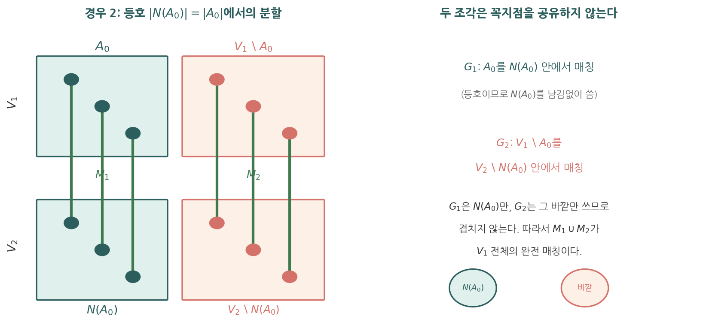

위 그림이 경우 (ii)의 분할을 한눈에 보여 준다. 빠듯한 $A_0$을 기준으로 그래프가 두 조각으로 갈린다. 왼쪽 조각은 $A_0$과 그 이웃 $N(A_0)$만으로, 오른쪽 조각은 나머지로 이루어진다. 왼쪽은 $N(A_0)$ 안에서만, 오른쪽은 그 바깥에서만 짝을 찾으므로 두 매칭이 쓰는 꼭지점이 겹칠 수 없고, 그래서 두 매칭을 그냥 합치기만 해도 전체 완전 매칭이 된다.

이 증명에서 약한 귀납법이 아니라 강한 귀납법이 필요한 까닭은 경우 (ii)에 있다. 거기서는 크기가 $j$와 $(k+1)-j$인 두 조각에 귀납 가정을 적용하는데, 이 두 크기는 바로 앞 단계인 $k$로 고정되지 않고 $1$ 이상 $k$ 이하의 어떤 값도 될 수 있다. 따라서 바로 앞 단계만 가정하는 약한 귀납법으로는 부족하고, $k$ 이하의 모든 크기에 대해 가정하는 강한 귀납법이 필요하다.


위 그림이 경우 (ii)의 분할을 한눈에 보여 준다. 빠듯한 $A_0$을 기준으로 그래프가 두 조각으로 갈린다. 왼쪽 조각은 $A_0$과 그 이웃 $N(A_0)$만으로, 오른쪽 조각은 나머지로 이루어진다. 왼쪽은 $N(A_0)$ 안에서만, 오른쪽은 그 바깥에서만 짝을 찾으므로 두 매칭이 쓰는 꼭지점이 겹칠 수 없고, 그래서 두 매칭을 그냥 합치기만 해도 전체 완전 매칭이 된다.

이 증명에서 약한 귀납법이 아니라 강한 귀납법이 필요한 까닭은 경우 (ii)에 있다. 거기서는 크기가 $j$와 $(k+1)-j$인 두 조각에 귀납 가정을 적용하는데, 이 두 크기는 바로 앞 단계인 $k$로 고정되지 않고 $1$ 이상 $k$ 이하의 어떤 값도 될 수 있다. 따라서 바로 앞 단계만 가정하는 약한 귀납법으로는 부족하고, $k$ 이하의 모든 크기에 대해 가정하는 강한 귀납법이 필요하다.


이 증명은 존재성을 보장하지만 그 자체로 효율적인 알고리즘을 주지는 않는다. 실제 매칭을 찾는 데에는 증대 경로(augmenting path)를 반복적으로 찾는 별도의 구성적 알고리즘을 사용한다.

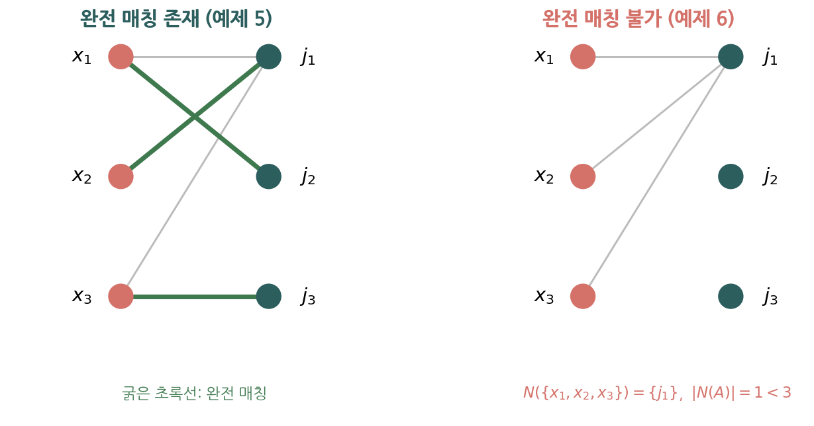

**예제 5 (홀의 정리 적용).** 세 명의 지원자 $V_1=\{x_1,x_2,x_3\}$를 세 직무 $V_2=\{j_1,j_2,j_3\}$에 배정하려 한다. 각 지원자가 수행 가능한 직무가 다음과 같다고 하자.

$$N(x_1)=\{j_1,j_2\},\quad N(x_2)=\{j_1\},\quad N(x_3)=\{j_1,j_3\}$$

완전 매칭, 곧 세 지원자 모두에게 서로 다른 직무를 배정하는 것이 가능한지 홀의 조건으로 판정한다. 홀의 조건은 $V_1$의 모든 부분집합에서 성립해야 하므로, 한 부분집합만 보아서는 안 되고 가능한 모든 부분집합을 점검해야 한다. $V_1$의 공집합이 아닌 부분집합은 일곱 개이며, 각각의 이웃 집합은 다음과 같다.

$$|N(\{x_1\})|=2\ge 1,\quad |N(\{x_2\})|=1\ge 1,\quad |N(\{x_3\})|=2\ge 1$$
$$|N(\{x_1,x_2\})|=|\{j_1,j_2\}|=2\ge 2,\quad |N(\{x_1,x_3\})|=|\{j_1,j_2,j_3\}|=3\ge 2$$
$$|N(\{x_2,x_3\})|=|\{j_1,j_3\}|=2\ge 2,\quad |N(\{x_1,x_2,x_3\})|=|\{j_1,j_2,j_3\}|=3\ge 3$$

일곱 부분집합 모두에서 $|N(A)|\ge|A|$가 성립하므로 완전 매칭이 존재한다. 실제 배정의 한 예는 $x_2\to j_1$, $x_1\to j_2$, $x_3\to j_3$이다. 위 그림 왼쪽이 이 완전 매칭을 굵은 선으로 보여 준다.

**예제 6 (조건 위배로 매칭 불가).** 같은 세 지원자가 모두 직무 $j_1$ 하나에만 지원하여 $N(x_1)=N(x_2)=N(x_3)=\{j_1\}$이라 하자. 부분집합 $A=\{x_1,x_2,x_3\}$를 보면 $N(A)=\{j_1\}$이므로 $|N(A)|=1<3=|A|$이다. 세 지원자가 모두 같은 직무 하나에 의존하므로 서로 다른 직무를 동시에 배정할 수 없고, 홀의 조건이 이 부분집합에서 위배되어 완전 매칭이 존재하지 않는다. 위 그림 오른쪽이 이 경우이다. 홀의 정리에서 조건이 단 하나의 부분집합에서만 깨져도 완전 매칭이 불가능함에 유의한다.

**예제 7 (완전 이분 그래프의 모서리 수).** $K_{3,4}$의 모서리 수를 구한다. 한쪽 부분집합의 꼭지점 $3$개 각각이 다른 쪽 $4$개 모두와 연결되므로 모서리 수는 $3\cdot 4=12$이다. 일반적으로 $K_{m,n}$의 모서리 수는 $mn$이다. 완전 이분 그래프 $K_{m,n}$은 $m\le n$일 때 항상 한쪽에서 다른 쪽으로의 완전 매칭을 가지는데, $V_1$의 어떤 부분집합 $A$를 잡아도 그 이웃이 $V_2$ 전체이므로 $|N(A)|=n\ge|A|$가 자동으로 성립하기 때문이다.

### 10.2.7 새 그래프 만들기

> **정의 7.** 그래프 $G=(V,E)$의 **부분그래프**(subgraph)는 $W\subseteq V$이고 $F\subseteq E$인 그래프 $H=(W,F)$이다. 단, $F$의 모서리는 끝점이 모두 $W$에 속해야 한다. $H\ne G$이면 $H$를 $G$의 **진부분그래프**(proper subgraph)라 한다.

> **정의 8.** 단순 그래프 $G=(V,E)$에서 꼭지점 부분집합 $W$에 의해 **유도된 부분그래프**(subgraph induced by $W$)는 그래프 $(W,F)$이며, 여기서 $F$는 두 끝점이 모두 $W$에 속하는 $E$의 모든 모서리를 포함한다.

모서리·꼭지점을 더하거나 빼서 새 그래프를 만들 수 있다.

- $G-e=(V,E-\{e\})$: 모서리 $e$를 제거한 그래프(꼭지점은 그대로).
- $G+e=(V,E\cup\{e\})$: 새 모서리 $e$를 추가한 그래프.
- $G-v=(V-\{v\},E')$: 꼭지점 $v$와 그에 붙은 모든 모서리를 제거한 부분그래프.
- **모서리 축약**(edge contraction): 모서리의 두 끝점 $u,v$를 하나의 새 꼭지점 $w$로 합쳐 얻는 그래프.

> **정의 9.** 두 단순 그래프 $G_1=(V_1,E_1)$과 $G_2=(V_2,E_2)$의 **합집합**(union)은 꼭지점 집합 $V_1\cup V_2$와 모서리 집합 $E_1\cup E_2$를 갖는 단순 그래프이며 $G_1\cup G_2$로 표기한다.

### 10.2.8 Python으로 차수 계산하고 악수정리 확인하기

인접 리스트로 표현한 그래프에서 차수를 계산하고 악수정리를 직접 확인한다.

```python
# 그래프를 인접 리스트(딕셔너리)로 표현
G = {
    'a': ['b', 'f'],
    'b': ['a', 'c', 'e', 'f'],
    'c': ['b', 'd', 'e', 'f'],
    'd': ['c'],
    'e': ['b', 'c', 'f'],
    'f': ['a', 'b', 'c', 'e'],
}

# 각 꼭지점의 차수 = 인접 리스트의 길이 (루프 없음 가정)
degrees = {v: len(neighbors) for v, neighbors in G.items()}
print("차수:", degrees)
# 차수: {'a': 2, 'b': 4, 'c': 4, 'd': 1, 'e': 3, 'f': 4}

deg_sum = sum(degrees.values())     # 차수의 합
m = deg_sum // 2                    # 악수정리: 2m = 차수합  ->  m = 차수합/2
print("차수의 합:", deg_sum)         # 18
print("모서리 수 m:", m)             # 9
print("악수정리 성립:", deg_sum == 2 * m)   # True

# 홀수 차수 꼭지점의 개수 (정리 2: 짝수여야 함)
odd = [v for v, d in degrees.items() if d % 2 == 1]
print("홀수 차수 꼭지점:", odd, "개수:", len(odd))   # ['d', 'e'] 개수: 2
```

### 자기 점검 (10.2)

다음 질문에 한 줄로 답해 보라.

1. 악수정리 $2m=\sum_v\deg(v)$에서 좌변이 모서리 수의 두 배인 핵심 이유는 무엇인가?
2. $K_5$의 모서리 수는 몇 개인가?
3. $Q_4$의 꼭지점 수와 각 꼭지점의 차수는 얼마인가?
4. 그래프가 이분일 필요충분조건을 채색의 언어로 진술하라.

<details>
<summary>정답</summary>

1. 모서리 하나가 두 끝점의 차수에 $1$씩, 합하여 정확히 $2$를 기여하기 때문이다.
2. $\binom{5}{2}=\dfrac{5\cdot4}{2}=10$개이다.
3. 꼭지점 수 $2^4=16$개, 각 꼭지점의 차수는 $4$이다.
4. 두 색만으로 인접한 두 꼭지점이 다른 색을 갖도록 채색할 수 있는 것, 즉 2-채색이 가능한 것이다.

</details>

---

## 10.3 그래프 표현방법과 동형 그래프

### 10.3.1 인접 리스트

**인접 리스트**(adjacency list)는 그래프의 한 정점에 연결된 정점들을 하나의 연결 리스트(linked list)로 표현하는 방법이다. 쉽게 말해, 정점마다 "내 이웃은 누구누구다"라는 명단을 하나씩 들고 있는 것이다. 정점의 개수만큼 인접 리스트가 필요하며, 각 리스트에는 그 정점에 인접한 정점들이 담긴다.

> **정의.** 그래프 $G=(V,E)$의 인접 리스트 표현은, 각 정점 $v\in V$에 대해 $v$에 인접한 정점들의 목록 $\text{adj}(v)$를 대응시킨 것이다. 비방향성 그래프에서 $\text{adj}(v)$는 $v$와 모서리로 이어진 모든 정점이고, 방향성 그래프에서 $\text{adj}(v)$는 $v$에서 나가는 모서리의 끝점, 곧 $v$의 후속 정점(out-neighbor)들이다.

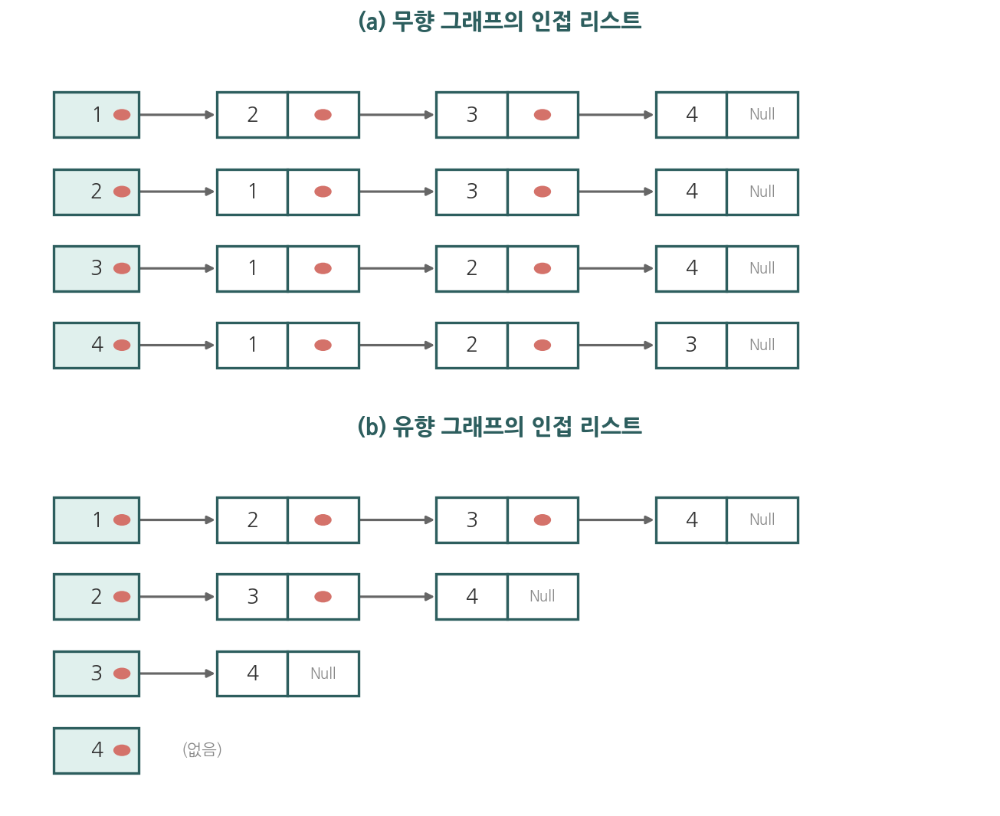

**유향과 무향의 차이.** 위 그림에서 두 표현의 결정적 차이가 드러난다. 무향 그래프에서는 모서리 $\{u,v\}$ 하나가 양방향이므로 $v$는 $u$의 리스트에, $u$는 $v$의 리스트에 함께 나타난다. 곧 **모서리 하나가 인접 리스트에 두 번 기록된다.** 그림 (a)에서 모서리 $\{1,2\}$는 정점 $1$의 리스트와 정점 $2$의 리스트 양쪽에 들어 있다. 따라서 모든 리스트의 길이를 합하면 차수의 총합과 같고, 악수정리에 의해 이는 모서리 수의 두 배 $2m$이다.

반면 방향성 그래프에서는 모서리 $(u,v)$가 $u$에서 $v$로 가는 한 방향이므로 $v$는 $u$의 리스트에만 나타나고 $u$는 $v$의 리스트에 나타나지 않는다. 곧 **모서리 하나가 인접 리스트에 정확히 한 번만 기록된다.** 그림 (b)에서 모서리 $(1,2)$는 정점 $1$의 리스트에만 있고, 정점 $4$는 나가는 모서리가 없어 리스트가 비어 있다. 따라서 모든 리스트의 길이를 합하면 출력차수의 총합과 같고, 이는 모서리 수 $|E|$와 같다.

인접 리스트는 한 정점에 연결된 정점들을 찾기 쉽고, 모서리 수에 비례하는 공간만 사용하므로 모서리가 적은 그래프에서 기억 공간을 절약한다. 다만 두 정점이 인접한지 확인하려면 리스트를 처음부터 훑어야 해서 그 검사는 느리다.

### 10.3.2 인접 행렬

> **정의.** 꼭지점 $v_1,v_2,\dots,v_n$을 갖는 단순 그래프 $G$의 **인접 행렬**(adjacency matrix) $\mathbf{A}=[a_{ij}]$는 $n\times n$ 행렬로, $v_i$와 $v_j$가 인접하면 $a_{ij}=1$, 그렇지 않으면 $a_{ij}=0$이다.

비방향성 그래프의 인접 행렬은 항상 대칭, 즉 $a_{ij}=a_{ji}$이다. 단순 그래프에서는 대각 성분이 모두 $0$이다(루프 없음). 다중그래프나 의사그래프에서는 $a_{ij}$를 $v_i$와 $v_j$를 잇는 모서리의 개수로 두어 확장한다(루프는 대각 성분으로 표시).

꼭지점이 $n$개인 그래프의 인접 행렬은 $n^2$개의 성분을 가진다. 모서리가 적은 **희소 그래프**(sparse graph)에서는 인접 리스트가, 모서리가 많은 **조밀 그래프**(dense graph)에서는 인접 행렬이 공간 면에서 유리하다.

### 10.3.3 결합 행렬

> **정의.** 꼭지점 $v_1,\dots,v_n$과 모서리 $e_1,\dots,e_m$을 갖는 그래프의 **결합 행렬**(incidence matrix) $\mathbf{M}=[m_{ij}]$는 $n\times m$ 행렬로, 모서리 $e_j$가 꼭지점 $v_i$에 붙어 있으면 $m_{ij}=1$, 아니면 $m_{ij}=0$이다. 루프는 해당 꼭지점의 열에 $1$로 표시한다.

### 10.3.4 그래프 동형

두 그래프가 그림의 모양이 달라도 연결 구조가 본질적으로 같을 수 있다. 이를 정확히 정의한다.

> **정의.** 단순 그래프 $G_1=(V_1,E_1)$과 $G_2=(V_2,E_2)$가 **동형**(isomorphic)일 필요충분조건은, 모든 $a,b\in V_1$에 대해 $a$와 $b$가 $G_1$에서 인접하는 것과 $f(a)$와 $f(b)$가 $G_2$에서 인접하는 것이 서로 동치가 되는 일대일 대응(전단사) $f:V_1\to V_2$가 존재하는 것이다. 이러한 함수 $f$를 **동형사상**(isomorphism)이라 한다.

두 그래프가 동형이면 인접 관계가 그대로 보존되므로, 한쪽 그래프의 모든 구조적 성질을 다른 쪽도 가진다.

### 10.3.5 그래프 불변량

**그래프 불변량**(graph invariant)은 동형인 두 그래프가 반드시 공유하는 성질이다. 대표적 불변량은 다음과 같다.

- 꼭지점의 수
- 모서리의 수
- **차수 수열**(degree sequence): 차수를 비내림차순으로 나열한 수열
- 특정 길이의 순환의 개수, 연결성분의 수 등

두 그래프가 어떤 불변량에서 다르면 **동형이 아니다**. 그러나 모든 위의 불변량이 같아도 동형이 아닐 수 있으므로, 동형임을 증명하려면 실제 동형사상 $f$를 제시해야 한다.

**예제 1.** 두 그래프 $G$와 $H$가 모두 꼭지점 $5$개, 모서리 $6$개를 가져도, $G$의 차수 수열이 $(1,2,2,3,4)$이고 $H$의 차수 수열이 $(2,2,2,3,3)$이면 두 그래프는 동형이 아니다. 차수 수열은 불변량이기 때문이다.

**예제 2 (인접 행렬과 결합 행렬 직접 작성).** 꼭지점이 $a,b,c,d$이고 모서리가 $e_1=\{a,b\}$, $e_2=\{a,c\}$, $e_3=\{b,c\}$, $e_4=\{c,d\}$인 단순 그래프를 생각한다. 꼭지점 순서를 $a,b,c,d$로 고정하면 인접 행렬은 다음과 같다. 성분 $a_{ij}$는 $i$번째 꼭지점과 $j$번째 꼭지점이 인접하면 $1$, 아니면 $0$이다.

$$\mathbf{A}=\begin{bmatrix} 0 & 1 & 1 & 0 \\ 1 & 0 & 1 & 0 \\ 1 & 1 & 0 & 1 \\ 0 & 0 & 1 & 0 \end{bmatrix}$$

행 $a$를 보면 $a$는 $b,c$와 인접하므로 둘째·셋째 성분이 $1$이다. 대각 성분이 모두 $0$인 것은 루프가 없기 때문이고, $\mathbf{A}=\mathbf{A}^{\mathsf T}$로 대칭인 것은 비방향성이기 때문이다. 각 행의 합이 그 꼭지점의 차수이므로 $\deg(a)=2$, $\deg(b)=2$, $\deg(c)=3$, $\deg(d)=1$이고, 합 $8$의 절반인 $4$가 모서리 수와 일치한다.

같은 그래프의 결합 행렬은 행이 꼭지점, 열이 모서리이며 성분 $m_{ij}$는 모서리 $e_j$가 꼭지점 $v_i$에 붙어 있으면 $1$이다. 모서리 순서를 $e_1,e_2,e_3,e_4$로 두면 다음과 같다.

$$\mathbf{M}=\begin{bmatrix} 1 & 1 & 0 & 0 \\ 1 & 0 & 1 & 0 \\ 0 & 1 & 1 & 1 \\ 0 & 0 & 0 & 1 \end{bmatrix}$$

각 열은 정확히 두 개의 $1$을 가진다. 모서리 하나가 두 끝점에 붙기 때문이다. 각 행의 합은 다시 그 꼭지점의 차수와 같다.

**예제 3 (동형사상 직접 구성).** 다음 두 단순 그래프가 동형임을 보인다.

- $G$: 꼭지점 $\{u_1,u_2,u_3,u_4\}$, 모서리 $\{u_1,u_2\}$, $\{u_2,u_3\}$, $\{u_3,u_4\}$, $\{u_4,u_1\}$ (길이 $4$ 사이클).
- $H$: 꼭지점 $\{w_1,w_2,w_3,w_4\}$, 모서리 $\{w_1,w_3\}$, $\{w_3,w_2\}$, $\{w_2,w_4\}$, $\{w_4,w_1\}$.

먼저 불변량을 확인한다. 두 그래프 모두 꼭지점 $4$개, 모서리 $4$개, 모든 차수가 $2$인 차수 수열 $(2,2,2,2)$를 가진다. 불변량이 일치하므로 동형의 가능성이 있다. 이제 실제 대응을 구성한다. $G$의 사이클 순서 $u_1,u_2,u_3,u_4$를 $H$의 사이클 순서 $w_1,w_3,w_2,w_4$에 차례로 대응시키는 일대일 대응

$$f(u_1)=w_1,\quad f(u_2)=w_3,\quad f(u_3)=w_2,\quad f(u_4)=w_4$$

를 정한다. $G$의 네 모서리가 $H$의 모서리로 옮겨지는지 확인한다. $\{u_1,u_2\}$는 $\{w_1,w_3\}$으로, $\{u_2,u_3\}$은 $\{w_3,w_2\}$로, $\{u_3,u_4\}$는 $\{w_2,w_4\}$로, $\{u_4,u_1\}$은 $\{w_4,w_1\}$으로 옮겨지며 모두 $H$의 모서리이다. 인접 관계가 양방향으로 보존되므로 $f$는 동형사상이고 두 그래프는 동형이다.

**예제 4 (동형이 아님을 불변량으로 판정).** 꼭지점 $5$개, 모서리 $6$개를 갖는 두 그래프 $G$와 $H$를 생각한다. $G$에는 길이 $3$인 사이클(삼각형)이 하나 있고 $H$에는 삼각형이 하나도 없다고 하자. 삼각형의 개수는 불변량이므로, 한쪽은 $1$이고 다른 쪽은 $0$으로 서로 다르다. 따라서 어떤 일대일 대응으로도 인접 관계를 보존할 수 없어 두 그래프는 동형이 아니다. 동형이 아님은 이렇게 불변량 하나의 차이만으로 결론지을 수 있다.

### 10.3.6 Python으로 인접 행렬·동형 다루기

```python
import numpy as np
import networkx as nx

# 꼭지점 순서 [a, b, c, d]에 대한 인접 행렬
A = np.array([
    [0, 1, 1, 0],   # a - b, a - c
    [1, 0, 1, 1],   # b - a, b - c, b - d
    [1, 1, 0, 0],   # c - a, c - b
    [0, 1, 0, 0],   # d - b
])
print("대칭 여부(비방향성 확인):", np.array_equal(A, A.T))   # True

# 차수 = 각 행의 합
print("차수:", A.sum(axis=1))        # [2 3 2 1]
print("모서리 수:", A.sum() // 2)     # 4

# 동형 판정: networkx 사용
G1 = nx.from_numpy_array(A)
G2 = nx.cycle_graph(4)               # C4
print("G1 ≅ C4 ?", nx.is_isomorphic(G1, G2))   # False (G1은 C4가 아님)
```

### 자기 점검 (10.3)

다음 질문에 한 줄로 답해 보라.

1. 비방향성 단순 그래프의 인접 행렬이 항상 가지는 두 가지 성질은 무엇인가?
2. 차수 수열이 다른 두 그래프는 동형일 수 있는가?
3. 모든 불변량이 일치하면 두 그래프는 반드시 동형인가?

<details>
<summary>정답</summary>

1. 대칭이고($a_{ij}=a_{ji}$), 대각 성분이 모두 $0$이다(루프 없음).
2. 동형일 수 없다. 차수 수열은 불변량이므로 동형이면 반드시 일치한다.
3. 그렇지 않다. 불변량이 모두 같아도 동형이 아닐 수 있으므로, 동형임을 보이려면 동형사상을 직접 제시해야 한다.

</details>

---

## 10.4 연결성

### 10.4.1 경로

> **정의.** 비방향성 그래프에서 $u$에서 $v$로의 **경로**(path)는 꼭지점들의 열 $u=x_0,x_1,\dots,x_n=v$이며, 연속한 두 꼭지점 $x_{i-1},x_i$가 모두 모서리로 연결되는 것이다. $n$을 경로의 **길이**(length)라 한다. 시작 꼭지점과 끝 꼭지점이 같은($u=v$) 길이 $\ge 1$의 경로를 **순환**(circuit) 또는 **회로**라 한다. 같은 모서리를 두 번 지나지 않는 경로를 **단순 경로**(simple path)라 한다.

### 10.4.2 연결성

> **정의.** 비방향성 그래프가 **연결되어 있다**(connected)는 것은 서로 다른 임의의 두 꼭지점 사이에 경로가 존재하는 것이다. 연결되어 있지 않은 그래프는 **연결성분**(connected component)이라 부르는, 극대 연결 부분그래프들로 나뉜다.

> **정리.** 임의의 두 꼭지점 사이에 경로가 있는 그래프에서는, 그 두 꼭지점 사이에 단순 경로가 존재한다.

**증명.** $u$에서 $v$로의 경로 중 길이가 최소인 경로를 택한다. 만약 그 경로에서 어떤 꼭지점이 두 번 나타난다면, 두 출현 사이의 구간을 잘라내어 더 짧은 경로를 얻을 수 있어 최소성에 모순이다. 따라서 최소 길이 경로에는 꼭지점이 중복되지 않으며, 특히 모서리도 중복되지 않아 단순 경로이다. $\blacksquare$

### 10.4.3 절단점과 다리

연결 그래프에서 어떤 꼭지점이나 모서리를 제거하면 연결성이 깨질 수 있다.

- **절단점**(cut vertex, 또는 articulation point): 그 꼭지점(과 붙은 모서리들)을 제거하면 연결성분의 수가 늘어나는 꼭지점.
- **다리**(bridge, 또는 cut edge): 그 모서리를 제거하면 연결성분의 수가 늘어나는 모서리.

절단점과 다리는 네트워크의 취약점에 해당한다. 통신망에서 절단점은 고장 시 전체 망을 분리시키는 핵심 노드이다.

### 10.4.4 방향성 그래프의 연결성

> **정의.** 방향성 그래프가 **강하게 연결**(strongly connected)되어 있다는 것은 임의의 두 꼭지점 $a,b$에 대해 $a$에서 $b$로, 그리고 $b$에서 $a$로 가는 방향 경로가 모두 존재하는 것이다. 모서리의 방향을 무시한 근저 그래프가 연결되어 있으면 **약하게 연결**(weakly connected)되어 있다고 한다.

강하게 연결되면 약하게 연결되지만, 그 역은 성립하지 않는다.

### 10.4.5 경로의 수와 인접 행렬

인접 행렬의 거듭제곱은 경로의 개수를 센다.

> **정리.** $\mathbf{A}$가 꼭지점 $v_1,\dots,v_n$(이 순서)에 대한 그래프 $G$의 인접 행렬이면, $v_i$에서 $v_j$로의 길이 $r$짜리 (서로 다른 경로의) 개수는 행렬 거듭제곱 $\mathbf{A}^r$의 $(i,j)$ 성분과 같다.

**증명.** $r$에 대한 수학적 귀납법으로 증명한다. $r=1$일 때 $\mathbf{A}^1=\mathbf{A}$의 $(i,j)$ 성분은 정의상 $v_i$에서 $v_j$로의 길이 $1$ 경로(즉 모서리)의 수이다. 귀납 단계에서 $\mathbf{A}^{r}=\mathbf{A}^{r-1}\mathbf{A}$의 $(i,j)$ 성분은
$$[\mathbf{A}^r]_{ij}=\sum_{k=1}^{n}[\mathbf{A}^{r-1}]_{ik} [\mathbf{A}]_{kj}$$
이며, 이는 $v_i$에서 길이 $r-1$로 어떤 중간 꼭지점 $v_k$에 도달한 뒤 모서리 하나로 $v_j$에 도달하는 경로 수를 모든 $v_k$에 걸쳐 합한 것이다. 이는 정확히 $v_i$에서 $v_j$로의 길이 $r$ 경로의 수이다. $\blacksquare$

이 정리로부터, 두 꼭지점이 연결되었는지(어떤 길이의 경로가 존재하는지)를 $\mathbf{A},\mathbf{A}^2,\dots,\mathbf{A}^{n-1}$의 합을 통해 판정할 수 있다.

**예제 1 (연결성분 찾기).** 꼭지점이 $a,b,c,d,e,f$이고 모서리가 $\{a,b\}$, $\{b,c\}$, $\{a,c\}$, $\{d,e\}$인 그래프를 생각한다. $a$에서 출발하면 모서리를 따라 $b,c$에 도달하지만 $d,e,f$에는 도달할 수 없다. $d$에서 출발하면 $e$에만 도달하고, $f$는 어떤 모서리에도 붙어 있지 않다. 따라서 연결성분은 $\{a,b,c\}$, $\{d,e\}$, $\{f\}$의 세 개이다. 연결성분이 둘 이상이므로 이 그래프는 연결되어 있지 않다.

**예제 2 (인접 행렬 거듭제곱으로 경로 세기).** 삼각형 $C_3$의 꼭지점을 $v_1,v_2,v_3$으로 두면 인접 행렬과 그 제곱은 다음과 같다.

$$\mathbf{A}=\begin{bmatrix} 0 & 1 & 1 \\ 1 & 0 & 1 \\ 1 & 1 & 0 \end{bmatrix},\qquad \mathbf{A}^2=\begin{bmatrix} 2 & 1 & 1 \\ 1 & 2 & 1 \\ 1 & 1 & 2 \end{bmatrix}$$

$\mathbf{A}^2$의 $(1,1)$ 성분 $2$는 $v_1$에서 출발하여 길이 $2$로 $v_1$에 돌아오는 경로의 수이다. 실제로 $v_1\to v_2\to v_1$과 $v_1\to v_3\to v_1$의 두 경로가 있어 이웃 수 $\deg(v_1)=2$와 일치한다. $(1,2)$ 성분 $1$은 $v_1$에서 $v_2$로 가는 길이 $2$ 경로가 $v_1\to v_3\to v_2$ 하나뿐임을 뜻한다. 이렇게 행렬 곱의 각 성분이 경로의 개수를 정확히 센다.

**예제 3 (절단점과 다리).** 꼭지점이 $a,b,c,d$이고 모서리가 $\{a,b\}$, $\{b,c\}$, $\{c,d\}$인 경로 모양 그래프를 생각한다. 이 그래프는 연결되어 있다. 꼭지점 $b$를 제거하면 $a$가 나머지와 분리되어 연결성분이 둘로 늘어나므로 $b$는 절단점이다. 같은 이유로 $c$도 절단점이다. 한편 모서리 $\{b,c\}$를 제거하면 $\{a,b\}$ 부분과 $\{c,d\}$ 부분이 분리되어 연결성분이 늘어나므로 $\{b,c\}$는 다리이다. 끝의 꼭지점 $a$나 $d$는 제거해도 나머지가 연결을 유지하므로 절단점이 아니다.

### 10.4.6 그래프 탐색: 깊이 우선 탐색과 너비 우선 탐색

그래프 탐색이란 한 정점에서 출발하여 그래프의 모든 정점을 한 번씩 빠짐없이 방문하는 것이다. 대표적인 두 방법이 깊이 우선 탐색과 너비 우선 탐색이며, 둘은 다음에 어디를 갈지 정하는 방식에서 갈린다.

두 탐색을 이해하려면 **큐**(queue)와 **스택**(stack)이라는 두 자료구조를 먼저 알아야 한다. 둘 다 데이터를 한 줄로 쌓아 두고 하나씩 꺼내 쓰는 통이지만, 꺼내는 순서가 반대이다. 큐는 먼저 넣은 것을 먼저 꺼낸다(선입선출, first-in first-out). 매표소 앞에 선 줄을 떠올리면 된다. 먼저 줄을 선 사람이 먼저 표를 산다. 스택은 나중에 넣은 것을 먼저 꺼낸다(후입선출, last-in first-out). 접시를 차곡차곡 쌓아 둔 더미를 떠올리면 된다. 맨 나중에 올린 접시를 맨 먼저 집어 든다. 이 꺼내는 순서의 차이 하나가 아래 두 탐색의 성격을 통째로 가른다.

**깊이 우선 탐색**(depth-first search), 줄여서 DFS는 한 길을 갈 수 있는 데까지 끝까지 파고든 뒤, 막히면 되돌아와 다른 길을 시도하는 탐색이다. 쉽게 말해 미로에서 한 방향으로 계속 가다가 막다른 길을 만나면 갈림길로 돌아와 다른 방향을 택하는 것과 같다. 막다른 곳에서 갈림길로 되돌아오는 동작을 **백트래킹**(backtracking)이라 한다.

> **정의.** DFS는 출발 정점을 방문한 뒤, 아직 방문하지 않은 인접 정점이 있으면 그 정점으로 이동하여 거기서 다시 같은 방식으로 탐색을 이어 간다. 더 이상 방문할 인접 정점이 없으면 직전 정점으로 백트래킹하며, 이를 모든 정점을 방문할 때까지 반복한다. 가장 최근에 방문한 정점으로 되돌아가는 구조이므로 **스택**(stack)으로 구현된다.

**너비 우선 탐색**(breadth-first search), 줄여서 BFS는 출발 정점에서 가까운 정점부터 한 겹씩 차례로 방문하는 탐색이다. 쉽게 말해 잔잔한 물에 돌을 던졌을 때 물결이 동심원으로 퍼지듯, 출발점에서 한 걸음 거리의 정점을 모두 방문한 뒤 두 걸음 거리, 그다음 세 걸음 거리로 퍼져 나간다.

> **정의.** BFS는 출발 정점을 방문한 뒤 그 인접 정점들을 모두 차례로 방문하고, 이어서 그 인접 정점들의 아직 방문하지 않은 인접 정점들을 다시 차례로 방문한다. 먼저 발견한 정점을 먼저 방문하는 구조이므로 **큐**(queue)로 구현된다.

같은 그래프를 같은 정점에서 출발해도 DFS와 BFS의 방문 순서는 다르다. 정점 $v_1$에서 출발하여 인접 정점 중 첨자가 작은 것부터 택한다고 하자. 트리 모양 그래프에서 DFS는 한 가지를 끝까지 내려갔다가 백트래킹하므로 방문 순서가 깊이 방향으로 이어지고, BFS는 같은 깊이의 정점을 모두 방문한 뒤 다음 깊이로 내려가므로 방문 순서가 층별로 이어진다. 두 탐색의 차이는 자료구조 하나, 곧 스택을 쓰느냐 큐를 쓰느냐에서 비롯한다. 아래 도구로 같은 그래프에 두 탐색을 직접 돌려 보며 큐와 스택의 동작을 확인하라.

### 10.4.7 Python으로 연결성 판정하기

너비 우선 탐색(BFS)으로 연결성분을 구하고, 인접 행렬 거듭제곱으로 경로 수를 센다.

```python
from collections import deque
import numpy as np

def connected_components(G):
    """인접 리스트 G에서 연결성분 목록을 반환한다."""
    seen = set()
    components = []
    for start in G:
        if start in seen:
            continue
        # start가 속한 성분을 BFS로 수집
        comp, queue = set(), deque([start])
        while queue:
            u = queue.popleft()
            if u in comp:
                continue
            comp.add(u)
            for w in G[u]:
                if w not in comp:
                    queue.append(w)
        seen |= comp
        components.append(comp)
    return components

G = {
    'a': ['b', 'c'], 'b': ['a', 'c'], 'c': ['a', 'b'],   # 성분 1
    'd': ['e'],      'e': ['d'],                          # 성분 2
    'f': [],                                              # 고립 (성분 3)
}
comps = connected_components(G)
print("연결성분 수:", len(comps))        # 3
print("연결성분:", comps)
print("전체 연결 여부:", len(comps) == 1) # False

# 인접 행렬 거듭제곱으로 길이 2 경로 수 세기 (성분 1만)
A = np.array([[0,1,1],[1,0,1],[1,1,0]])   # 삼각형 (C3)
print("A^2 =\n", A @ A)
# 대각 성분 = 각 꼭지점에서 자기 자신으로 돌아오는 길이 2 경로 수
```

### 자기 점검 (10.4)

다음 질문에 한 줄로 답해 보라.

1. 단순 경로와 일반 경로의 차이는 무엇인가?
2. 방향성 그래프에서 강한 연결과 약한 연결의 차이는 무엇인가?
3. 인접 행렬 $\mathbf{A}$의 $\mathbf{A}^r$ 거듭제곱이 세는 것은 무엇인가?

<details>
<summary>정답</summary>

1. 단순 경로는 같은 모서리를 두 번 지나지 않는 경로이다.
2. 강한 연결은 두 꼭지점 사이를 방향을 지킨 채 양방향으로 오갈 수 있는 것이고, 약한 연결은 방향을 무시한 근저 그래프가 연결된 것이다.
3. $[\mathbf{A}^r]_{ij}$는 $v_i$에서 $v_j$로의 길이 $r$짜리 경로의 개수이다.

</details>

---

## 10.5 오일러 경로와 해밀턴 경로

### 10.5.1 쾨니히스베르크 다리 문제

프로이센의 도시 쾨니히스베르크에는 강으로 나뉜 네 지역을 잇는 일곱 개의 다리가 있었다. 모든 다리를 정확히 한 번씩만 건너 출발점으로 돌아올 수 있는가 하는 물음이 1736년 오일러가 그래프 이론을 창시하는 계기가 되었다. 네 지역을 꼭지점으로, 일곱 다리를 모서리로 두면 다음 다중그래프를 얻는다.

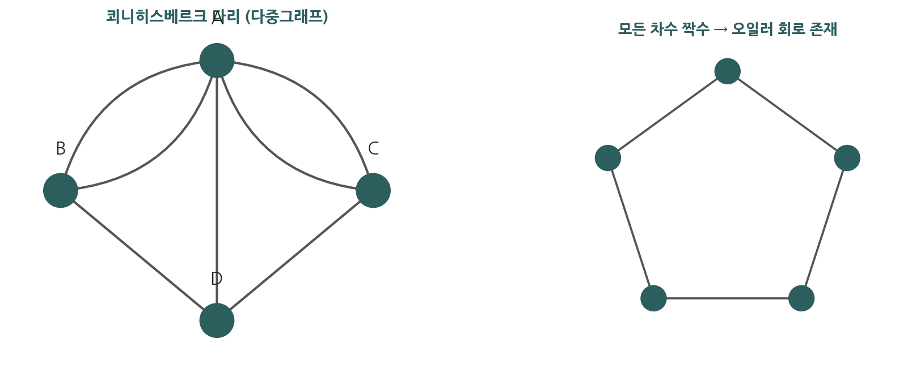

### 10.5.2 오일러 경로와 회로

> **정의.** 그래프의 **오일러 회로**(Euler circuit)는 모든 모서리를 정확히 한 번씩 지나 출발 꼭지점으로 돌아오는 단순 회로이다. **오일러 경로**(Euler path)는 모든 모서리를 정확히 한 번씩 지나는 (출발점으로 돌아올 필요는 없는) 단순 경로이다.

오일러 회로의 존재 여부는 차수만으로 완전히 판정된다.

> **정리 1.** 꼭지점이 둘 이상인 연결 다중그래프가 오일러 회로를 가질 필요충분조건은 모든 꼭지점의 차수가 짝수인 것이다.

**증명 (필요조건).** 오일러 회로 $C$가 존재한다고 하자. 회로가 한 꼭지점 $v$를 지날 때마다 들어오는 모서리 하나와 나가는 모서리 하나, 즉 모서리 두 개를 사용한다. 출발 꼭지점도 마지막에 돌아와 닫히므로 마찬가지이다. 모든 모서리가 정확히 한 번씩만 쓰이므로, $v$에 붙은 모서리들은 $C$가 $v$를 지난 횟수의 두 배로 짝지어진다. 따라서 $\deg(v)$는 짝수이다.

**증명 (충분조건, 구성적).** 모든 꼭지점의 차수가 짝수인 연결 다중그래프라 하자. 임의의 꼭지점 $x$에서 출발하여, 아직 쓰지 않은 모서리를 따라 계속 이동하는 경로를 만든다. 각 꼭지점의 차수가 짝수이므로, $x$가 아닌 꼭지점에 들어오면 나가는 미사용 모서리가 항상 남아 있어 막히지 않는다. 그러므로 이 경로는 반드시 출발점 $x$로 되돌아와 회로 $C$를 이룬다. 만약 $C$가 모든 모서리를 쓰지 않았다면, $C$가 지난 어떤 꼭지점 $w$에 아직 쓰지 않은 모서리가 붙어 있다(연결성 때문에 그런 $w$가 존재한다). $C$의 모서리를 제거한 부분그래프에서도 각 꼭지점의 차수는 여전히 짝수이므로, $w$에서 시작하는 또 다른 회로 $C'$를 같은 방식으로 만들 수 있다. $C$의 $w$ 지점에 $C'$를 삽입하여 더 긴 회로를 얻는다. 이 과정을 반복하면 결국 모든 모서리를 포함하는 오일러 회로를 얻는다. $\blacksquare$

> **정리 2.** 연결 다중그래프가 오일러 경로(회로는 아님)를 가질 필요충분조건은 정확히 두 개의 꼭지점만 홀수 차수를 갖는 것이다. 이때 오일러 경로는 한 홀수 차수 꼭지점에서 시작하여 다른 홀수 차수 꼭지점에서 끝난다.

쾨니히스베르크 다중그래프는 네 꼭지점이 모두 홀수 차수($3,3,3,5$)이므로 오일러 경로도 회로도 갖지 않는다. 따라서 모든 다리를 한 번씩만 건너는 산책은 불가능하다.

**예제 (오일러 회로 직접 구성).** 꼭지점이 $1,2,3,4,5$이고 모서리가 $\{1,2\}$, $\{2,3\}$, $\{3,1\}$, $\{3,4\}$, $\{4,5\}$, $\{5,3\}$인 연결 그래프를 생각한다. 이는 삼각형 $1,2,3$과 삼각형 $3,4,5$가 꼭지점 $3$을 공유하는 모양이다. 차수를 세면 $\deg(1)=2$, $\deg(2)=2$, $\deg(3)=4$, $\deg(4)=2$, $\deg(5)=2$로 모두 짝수이므로 정리 1에 의해 오일러 회로가 존재한다. 정리 1의 충분조건 증명이 알려 주는 절차를 그대로 따라 구성한다. 먼저 꼭지점 $3$에서 출발하여 아직 쓰지 않은 모서리를 따라 이동하면 $3\to 1\to 2\to 3$의 회로가 만들어진다(모서리 $\{3,1\}$, $\{1,2\}$, $\{2,3\}$ 사용). 이 회로는 출발점 $3$으로 돌아왔지만 모서리 $\{3,4\}$, $\{4,5\}$, $\{5,3\}$이 아직 남아 있다. 남은 모서리가 닿는 꼭지점 $3$에서 새 회로 $3\to 4\to 5\to 3$을 같은 방식으로 만든다. 이제 첫 회로의 $3$ 지점에 둘째 회로를 끼워 넣으면

$$3\to 1\to 2\to 3\to 4\to 5\to 3$$

이 되어 여섯 모서리를 정확히 한 번씩 지나는 오일러 회로가 완성된다. 핵심은 차수가 모두 짝수라는 조건이, 매 꼭지점에서 들어온 만큼 나갈 모서리를 항상 남겨 주어 중간에 막히지 않게 한다는 점이다.

**예제 (홀수 차수 꼭지점이 둘인 경우).** 꼭지점이 $a,b,c,d$이고 모서리가 $\{a,b\}$, $\{b,c\}$, $\{c,d\}$, $\{b,d\}$인 그래프에서 차수는 $\deg(a)=1$, $\deg(b)=3$, $\deg(c)=2$, $\deg(d)=2$이다. 홀수 차수 꼭지점이 $a$와 $b$의 정확히 두 개이므로 정리 2에 의해 오일러 회로는 없고 오일러 경로만 존재하며, 그 경로는 홀수 차수 꼭지점 $a$에서 시작하여 다른 홀수 차수 꼭지점 $b$에서 끝난다. 실제 경로의 한 예는 $a\to b\to d\to c\to b$이다.

### 10.5.3 해밀턴 경로와 회로

오일러가 모든 모서리를 한 번씩 지나는 문제였다면, 해밀턴은 모든 꼭지점을 한 번씩 지나는 문제이다.

> **정의.** 단순 그래프의 **해밀턴 경로**(Hamilton path)는 모든 꼭지점을 정확히 한 번씩 지나는 경로이다. **해밀턴 회로**(Hamilton circuit)는 모든 꼭지점을 정확히 한 번씩 지나 출발 꼭지점으로 돌아오는 회로이다.

오일러 회로와 달리, 해밀턴 회로의 존재를 차수만으로 간단히 판정하는 필요충분조건은 알려져 있지 않다. 다만 충분조건들이 알려져 있다.

> **정리 3 (Dirac).** $n\ge 3$인 단순 그래프의 모든 꼭지점의 차수가 $\dfrac{n}{2}$ 이상이면 해밀턴 회로를 가진다.

> **정리 4 (Ore).** $n\ge 3$인 단순 그래프에서 인접하지 않은 모든 꼭지점 쌍 $u,v$에 대해 $\deg(u)+\deg(v)\ge n$이면 해밀턴 회로를 가진다.

Dirac의 조건은 Ore의 조건의 특수한 경우이다(모든 차수가 $n/2$ 이상이면 인접하지 않은 두 꼭지점의 차수 합이 $n$ 이상). 이 조건들은 충분조건일 뿐 필요조건이 아니다. 조건을 만족하지 않아도 해밀턴 회로를 가질 수 있다.

**예제 (Dirac 정리 적용).** 꼭지점 $5$개를 갖는 단순 그래프에서 모든 꼭지점의 차수가 $3$이라 하자. $n=5$이므로 Dirac 조건은 모든 차수가 $n/2=2.5$ 이상일 것을 요구한다. 모든 차수가 $3\ge 2.5$이므로 조건을 만족하여 해밀턴 회로가 존재한다고 결론지을 수 있다. 또한 인접하지 않은 임의의 두 꼭지점 $u,v$에 대해 $\deg(u)+\deg(v)=3+3=6\ge 5=n$이므로 Ore 조건도 자동으로 성립한다. 이처럼 Dirac 조건을 만족하면 Ore 조건도 따라온다.

**예제 (조건을 만족하지 않아도 존재하는 경우).** 사이클 $C_5$는 모든 꼭지점의 차수가 $2$이다. $n=5$에서 Dirac 조건 $n/2=2.5$를 만족하지 못하므로 두 정리로는 아무 결론도 내릴 수 없다. 그러나 $C_5$ 자체가 다섯 꼭지점을 한 번씩 지나 돌아오는 해밀턴 회로이다. 이는 두 정리가 충분조건일 뿐임을, 곧 조건 위배가 해밀턴 회로의 부재를 뜻하지는 않음을 보여 준다.

### 10.5.4 응용과 현대적 연결

- **외판원 문제**(traveling salesman problem, TSP): 모든 도시를 한 번씩 방문하고 출발지로 돌아오는 최소 비용의 해밀턴 회로를 찾는 문제이다. 10.6절의 가중 그래프 위에서 정의되며, 물류·배송 경로 최적화의 핵심 모델이다.
- **DNA 단편 조립**: 유전체 시퀀싱에서 짧은 단편들을 겹치는 부분을 따라 이어 붙이는 과정은 오일러 경로 문제로 환원된다.
- **회로 검사·배선**: 모든 연결을 한 번씩 점검하는 경로 설계가 오일러 경로에 대응한다.

### 10.5.5 Python으로 오일러 회로 판정하기

```python
def has_euler_circuit(G):
    """인접 리스트 G가 (연결되어 있다는 가정 하에) 오일러 회로를 갖는지 판정.
    정리 1: 모든 꼭지점의 차수가 짝수이면 오일러 회로 존재."""
    degrees = {v: len(neigh) for v, neigh in G.items()}
    odd_count = sum(1 for d in degrees.values() if d % 2 == 1)
    if odd_count == 0:
        return "오일러 회로 존재 (모든 차수 짝수)"
    elif odd_count == 2:
        return "오일러 경로만 존재 (홀수 차수 꼭지점 정확히 2개)"
    else:
        return f"오일러 경로·회로 모두 없음 (홀수 차수 꼭지점 {odd_count}개)"

# C5 (오각형): 모든 차수 2 -> 짝수
C5 = {i: [(i - 1) % 5, (i + 1) % 5] for i in range(5)}
print("C5:", has_euler_circuit(C5))     # 오일러 회로 존재

# 쾨니히스베르크 다중그래프 (차수 3,3,3,5)
deg_konig = {'A': 5, 'B': 3, 'C': 3, 'D': 3}
odd = sum(1 for d in deg_konig.values() if d % 2 == 1)
print("쾨니히스베르크 홀수차수 꼭지점:", odd, "-> 경로·회로 없음")  # 4
```

### 자기 점검 (10.5)

다음 질문에 한 줄로 답해 보라.

1. 연결 다중그래프가 오일러 회로를 가질 필요충분조건은 무엇인가?
2. 쾨니히스베르크 다리 문제의 답이 "불가능"인 이유를 차수로 설명하라.
3. Dirac 정리와 Ore 정리는 해밀턴 회로의 필요조건인가, 충분조건인가?

<details>
<summary>정답</summary>

1. 모든 꼭지점의 차수가 짝수인 것이다.
2. 네 꼭지점이 모두 홀수 차수이기 때문이다. 오일러 경로는 홀수 차수 꼭지점이 정확히 $0$개 또는 $2$개일 때만 존재한다.
3. 충분조건이다. 조건을 만족하면 해밀턴 회로가 보장되지만, 만족하지 않아도 존재할 수 있다.

</details>

---

## 10.6 최단경로 문제

### 10.6.1 가중 그래프

> **정의.** **가중 그래프**(weighted graph)는 각 모서리에 수(가중치, weight)가 할당된 그래프이다. 가중치는 거리·비용·시간 등을 나타낸다. 경로의 **길이**(length)는 그 경로에 포함된 모서리들의 가중치의 합이다.

**최단경로 문제**(shortest-path problem)는 두 꼭지점 사이에서 길이가 최소인 경로를 찾는 문제이다.

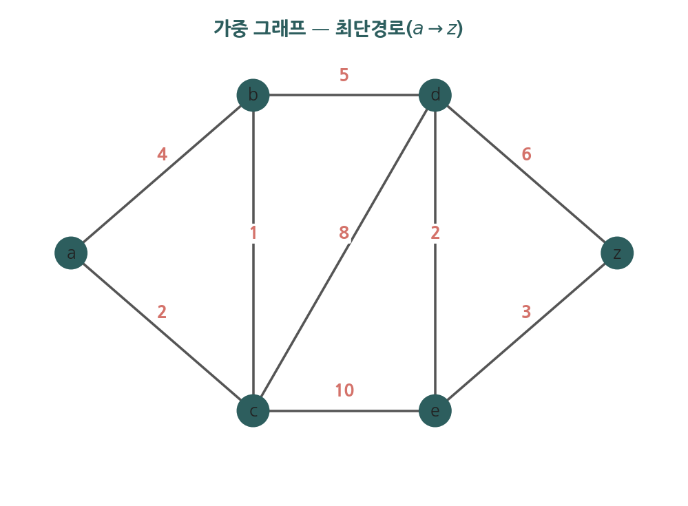

### 10.6.2 다익스트라 알고리즘

다익스트라 알고리즘은 가중치가 음이 아닌 그래프에서 한 출발 꼭지점 $a$로부터 다른 모든 꼭지점까지의 최단 거리를 구한다. 핵심은 거리가 확정된 꼭지점 집합 $S$를 한 꼭지점씩 키워 나가는 것이다.

**알고리즘 (개요).**
1. 모든 꼭지점에 임시 거리 표를 둔다. 출발 꼭지점 $a$는 $L(a)=0$, 나머지는 $L(v)=\infty$.
2. 아직 확정되지 않은 꼭지점 중 $L$ 값이 최소인 꼭지점 $u$를 골라 확정 집합 $S$에 넣는다.
3. $u$에 인접한 미확정 꼭지점 $v$마다 $L(v)$를 $\min\bigl(L(v), L(u)+w(u,v)\bigr)$로 갱신한다(완화, relaxation).
4. 모든 꼭지점이 확정될 때까지 2–3을 반복한다.

> **정리.** 다익스트라 알고리즘은 가중치가 음이 아닌 연결 단순 그래프에서 출발 꼭지점으로부터 다른 모든 꼭지점까지의 최단 거리를 정확히 구한다.

**정확성의 핵심.** 어떤 꼭지점 $u$가 확정 집합 $S$에 추가되는 시점의 $L(u)$ 값은 이미 그 꼭지점까지의 진짜 최단 거리이다. 만약 더 짧은 경로가 있다면 그 경로는 $S$ 바깥의 어떤 꼭지점 $x$를 먼저 지나야 하는데, 가중치가 음이 아니므로 $x$까지의 거리는 $L(u)$보다 작아야 하고, 그렇다면 $u$ 대신 $x$가 먼저 선택되었어야 하므로 모순이다.

**예제 (다익스트라 거리표 단계별 계산).** 위 그림의 가중 그래프에서 출발 꼭지점 $a$로부터 $z$까지의 최단 거리를 표를 채우며 구한다. 모서리와 가중치는 $a\text{-}b$가 $4$, $a\text{-}c$가 $2$, $b\text{-}c$가 $1$, $b\text{-}d$가 $5$, $c\text{-}d$가 $8$, $c\text{-}e$가 $10$, $d\text{-}e$가 $2$, $d\text{-}z$가 $6$, $e\text{-}z$가 $3$이다.

처음에는 $L(a)=0$이고 나머지는 모두 무한대이다. 확정 집합 $S$는 비어 있다.

1. 미확정 중 $L$ 값이 가장 작은 꼭지점은 $a$($L=0$)이다. $a$를 확정한다. $a$의 이웃을 완화한다. $L(b)=\min(\infty,0+4)=4$, $L(c)=\min(\infty,0+2)=2$.
2. 미확정 중 최소는 $c$($L=2$)이다. $c$를 확정한다. $c$의 이웃을 완화한다. $L(b)=\min(4,2+1)=3$, $L(d)=\min(\infty,2+8)=10$, $L(e)=\min(\infty,2+10)=12$.
3. 미확정 중 최소는 $b$($L=3$)이다. $b$를 확정한다. $b$의 이웃을 완화한다. $L(d)=\min(10,3+5)=8$.
4. 미확정 중 최소는 $d$($L=8$)이다. $d$를 확정한다. $d$의 이웃을 완화한다. $L(e)=\min(12,8+2)=10$, $L(z)=\min(\infty,8+6)=14$.
5. 미확정 중 최소는 $e$($L=10$)이다. $e$를 확정한다. $e$의 이웃을 완화한다. $L(z)=\min(14,10+3)=13$.
6. 마지막으로 $z$($L=13$)를 확정한다.

따라서 $a$에서 $z$까지의 최단 거리는 $13$이고, 그 경로는 갱신을 거꾸로 따라가면 $a\to c\to b\to d\to e\to z$이다. 각 단계에서 가장 작은 임시 거리를 가진 꼭지점을 확정하고, 그 이웃의 임시 거리를 완화하는 두 동작만 반복한다는 점에 주목한다.

### 10.6.3 외판원 문제

외판원 문제는 가중 완전 그래프에서 모든 꼭지점을 한 번씩 지나는 최소 가중치 해밀턴 회로를 찾는 문제이다. 꼭지점 수가 늘면 가능한 회로의 수가 폭발적으로 증가하여, 효율적인(다항 시간) 정확 알고리즘이 알려져 있지 않다. 실무에서는 근사 알고리즘과 휴리스틱을 사용한다.

### 10.6.4 Python으로 다익스트라 구현하기

```python
import heapq

def dijkstra(graph, start):
    """graph: {꼭지점: [(이웃, 가중치), ...]}, 가중치는 음이 아님.
    start로부터 각 꼭지점까지의 최단 거리를 반환한다."""
    dist = {v: float('inf') for v in graph}
    dist[start] = 0
    pq = [(0, start)]            # (현재 거리, 꼭지점) 최소 힙
    while pq:
        d, u = heapq.heappop(pq)
        if d > dist[u]:          # 이미 더 짧은 거리로 확정됨
            continue
        for v, w in graph[u]:    # 완화 단계
            nd = d + w
            if nd < dist[v]:
                dist[v] = nd
                heapq.heappush(pq, (nd, v))
    return dist

graph = {
    'a': [('b', 4), ('c', 2)],
    'b': [('a', 4), ('c', 1), ('d', 5)],
    'c': [('a', 2), ('b', 1), ('d', 8), ('e', 10)],
    'd': [('b', 5), ('c', 8), ('e', 2), ('z', 6)],
    'e': [('c', 10), ('d', 2), ('z', 3)],
    'z': [('d', 6), ('e', 3)],
}
dist = dijkstra(graph, 'a')
print("a로부터의 최단 거리:", dist)
print("a -> z 최단 거리:", dist['z'])
```

### 자기 점검 (10.6)

다음 질문에 한 줄로 답해 보라.

1. 가중 그래프에서 경로의 길이는 어떻게 정의되는가?
2. 다익스트라 알고리즘이 음이 아닌 가중치를 요구하는 이유는 무엇인가?
3. 외판원 문제와 최단경로 문제의 핵심 차이는 무엇인가?

<details>
<summary>정답</summary>

1. 경로에 포함된 모서리들의 가중치의 합이다.
2. 음의 가중치가 있으면 이미 확정한 꼭지점의 거리가 나중에 더 줄어들 수 있어, 한 번 확정하면 갱신하지 않는 알고리즘의 정확성이 깨지기 때문이다.
3. 최단경로는 두 꼭지점 사이의 최소 길이 경로를, 외판원 문제는 모든 꼭지점을 한 번씩 지나는 최소 가중치 해밀턴 회로를 찾는다.

</details>

---

## 10.7 평면 그래프

### 10.7.1 평면성

> **정의.** 그래프를 평면 위에 모서리들이 서로 교차하지 않도록 그릴 수 있으면 그 그래프를 **평면 그래프**(planar graph)라 한다. 그렇게 그린 그림을 그 그래프의 **평면 표현**(planar representation)이라 한다.

평면 표현은 평면을 여러 **영역**(region) 또는 **면**(face)으로 나눈다. 둘러싸이지 않은 바깥 영역도 하나의 영역(무한 영역)으로 센다.

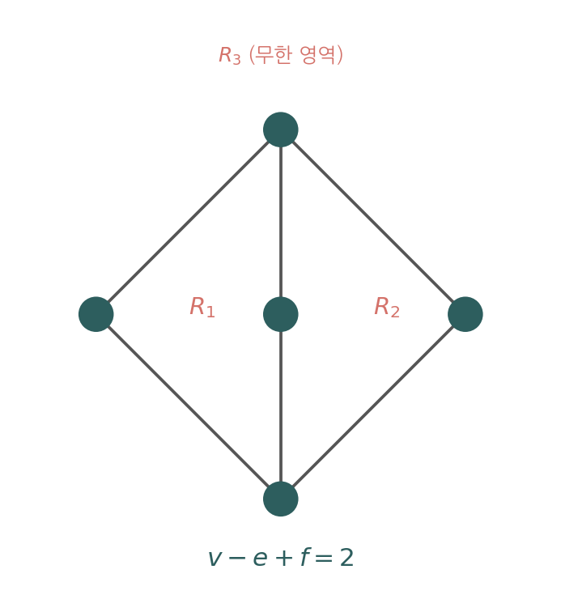

### 10.7.2 오일러 공식

> **정리 1 (오일러 공식, Euler's Formula).** $G$가 $v$개의 꼭지점과 $e$개의 모서리를 갖는 연결 평면 단순 그래프이면, 임의의 평면 표현에서 영역의 수 $f$는
> $$v-e+f=2$$
> 를 만족한다.

**증명.** 모서리 수 $e$에 대한 수학적 귀납법으로 증명한다. 그래프의 평면 표현을 모서리 하나씩 추가하며 만든다.

기저 단계: 꼭지점 $1$개, 모서리 $0$개인 그래프는 영역이 무한 영역 하나뿐이므로 $v=1,\ e=0,\ f=1$이고 $1-0+1=2$로 공식이 성립한다.

귀납 단계: 모서리 $n-1$개인 모든 연결 평면 그래프에서 공식이 성립한다고 가정하고, 모서리 $n$개인 연결 평면 그래프 $G_n$을 생각한다. 모서리 $\{a,b\}$ 하나를 골라 제거한 그래프를 $G_{n-1}$이라 하자. 두 경우로 나눈다.

경우 1: $\{a,b\}$의 양 끝점 $a,b$가 모두 $G_{n-1}$에도 남는 경우(즉 두 영역의 경계인 모서리). 이 모서리를 다시 추가하면 한 영역이 둘로 나뉜다. 따라서 $G_{n-1}$에 비해 $G_n$은 모서리가 $1$ 늘고 영역도 $1$ 늘며 꼭지점은 그대로이다. 귀납 가설 $v-(n-1)+f'=2$에서 $e$가 $1$, $f$가 $1$ 늘어 $v-n+(f'+1)=2$가 유지된다.

경우 2: $\{a,b\}$가 늘어진 모서리여서 한 끝점(예: $b$)이 $G_{n-1}$에 없던 새 꼭지점인 경우. 이 모서리를 추가하면 꼭지점과 모서리가 각각 $1$ 늘지만 영역은 늘지 않는다. 귀납 가설에서 $v$와 $e$가 동시에 $1$씩 늘어 $(v+1)-(n)+f=2$가 유지된다.

두 경우 모두 $v-e+f=2$가 보존되므로, 귀납법에 의해 모든 연결 평면 단순 그래프에서 성립한다. $\blacksquare$

**예제 (오일러 공식 직접 검증).** 정육면체의 꼭지점·모서리·면을 평면에 펼쳐 그린 그래프를 생각한다. 이 그래프는 꼭지점 $v=8$개, 모서리 $e=12$개를 가진다. 오일러 공식 $v-e+f=2$에 대입하면 $8-12+f=2$이므로 $f=6$이다. 실제로 정육면체는 여섯 면을 가지며, 평면 표현에서 다섯 개의 유한 영역과 바깥의 무한 영역 하나를 합쳐 정확히 $6$개의 영역이 되어 공식과 일치한다.

**예제 (사이클의 오일러 공식).** 사이클 $C_4$는 평면 그래프이며 $v=4$, $e=4$이다. 평면에 그리면 안쪽 영역 하나와 바깥의 무한 영역 하나로 $f=2$이다. $v-e+f=4-4+2=2$로 공식이 성립한다.

### 10.7.3 오일러 공식의 따름정리

> **따름정리 1.** $v\ge 3$인 연결 평면 단순 그래프에서 $e\le 3v-6$이다.

증명에 들어가기 전에 $2e\ge 3f$가 어디서 오는지 짚는다. 핵심은 **영역마다 그 영역을 둘러싼 모서리의 개수를 세어 모든 영역에 대해 더하는 것**이다. 이 총합을 두 가지 방식으로 본다.

첫째, 모서리 쪽에서 센다. 평면 그래프에서 모서리 하나는 양옆에 영역이 하나씩 있어 정확히 두 영역의 경계가 된다. 그러므로 위 총합에서 각 모서리는 정확히 두 번 세어지고, 따라서

$$\sum_{\text{영역 } R}(\,R\text{의 경계 모서리 수}\,) = 2e$$

이다. 둘째, 영역 쪽에서 센다. 단순 그래프에서 어떤 영역도 모서리 두 개 이하로는 닫히지 못하므로 각 영역은 적어도 세 개의 모서리로 둘러싸인다. 영역이 $f$개이니 위 총합은 적어도 $3f$이다. 두 사실을 합치면

$$2e = \sum_{\text{영역 } R}(\,R\text{의 경계 모서리 수}\,) \ge 3f$$

를 얻는다. 여기서 흔히 헷갈리는 점을 분명히 하자. $3f$의 인자 $3$과 $2e$의 인자 $2$는 영역 개수나 모서리 개수가 아니라, **세는 행위에서 나오는 곱셈 인자**이다. 우리가 세는 대상은 (영역, 그 영역을 둘러싼 모서리)라는 짝의 총수이고, 이를 두 방향에서 센다. 영역 기준으로 세면 영역이 $f$개이고 각 영역의 둘레에 모서리가 최소 3개이므로 짝의 총수는 최소 $3\times f$이다. 여기서 인자 $3$은 영역 하나의 둘레 모서리 수이다. 모서리 기준으로 세면 모서리 하나는 양옆에 영역이 하나씩 붙어 짝에 정확히 두 번 들어가므로 짝의 총수는 $2\times e$이다. 여기서 인자 $2$는 모서리 하나가 닿는 영역 수이다. 같은 짝을 센 것이므로 $2e=(\text{짝의 총수})\ge 3f$이다.

삼각형 한 개짜리 그래프로 확인하면 헷갈림이 풀린다. 이때 영역은 안쪽과 바깥쪽 둘, 곧 $f=2$이고 모서리는 $e=3$이다. 영역 기준: 안쪽 삼각형 영역의 둘레는 모서리 3개, 바깥 영역도 그 삼각형을 바깥에서 감싸므로 둘레가 똑같이 모서리 3개여서 짝의 총수는 $3+3=6=3f$이다. 모서리 기준: 모서리 하나하나가 안쪽 영역과 바깥 영역 사이에 있어 두 영역에 한 번씩 들어가므로 짝의 총수는 $2\times 3=6=2e$이다. 그래서 $2e=6=3f$로 등호가 맞는다. 바깥 영역도 똑같이 세 모서리로 둘러싸인다는 점이 핵심이다.


여기서 "각 영역이 최소 세 모서리"라는 말이 왜 성립하는지 짚어 두자. 영역이 닫히려면 모서리가 한 바퀴 돌아 순환을 이뤄야 하므로, 한 영역의 경계 모서리 수의 최솟값은 곧 그래프에 있을 수 있는 가장 짧은 순환의 길이와 같다. 모서리 하나로 영역을 닫으려면 한 꼭지점에서 자기 자신으로 돌아오는 루프가 있어야 하고, 모서리 둘로 닫으려면 같은 두 꼭지점을 잇는 다중 모서리가 있어야 한다. 그런데 단순 그래프에는 루프도 다중 모서리도 없으므로 길이 1, 2인 순환이 불가능하고, 가장 짧은 순환은 서로 다른 세 꼭지점을 잇는 삼각형, 곧 모서리 세 개짜리다. 그래서 각 영역은 최소 세 모서리로 둘러싸인다.

삼각형이 없는 경우는 여기서 한 칸 더 올라간다. 길이 3인 순환이 바로 삼각형인데 그것을 쓸 수 없으므로, 다음으로 짧은 순환은 서로 다른 네 꼭지점을 잇는 사각형, 곧 모서리 네 개짜리다. 그래서 삼각형이 없으면 각 영역은 최소 네 모서리로 둘러싸이고, 같은 셈으로 $2e\ge 4f$가 된다. 아래 그림이 모서리 한 개와 두 개로는 단순 그래프에서 영역을 닫을 수 없고, 삼각형에서 처음 닫히며, 삼각형이 없으면 사각형이 최소가 됨을 보여 준다.

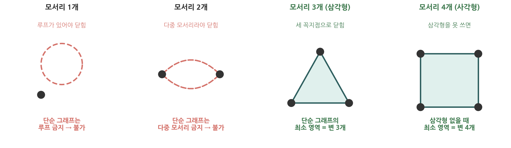

아래 그림은 위 셈을 실제 그래프에서 다시 확인시켜 준다. 왼쪽은 한 모서리가 두 영역의 경계가 되어 합에 두 번 기여함을, 오른쪽은 실제 그래프에서 영역별 경계 변 수의 합($3+3+4=10$)이 정확히 $2e$와 같고 각 영역이 변을 셋 이상 가져 $2e\ge 3f$가 됨을 보인다.

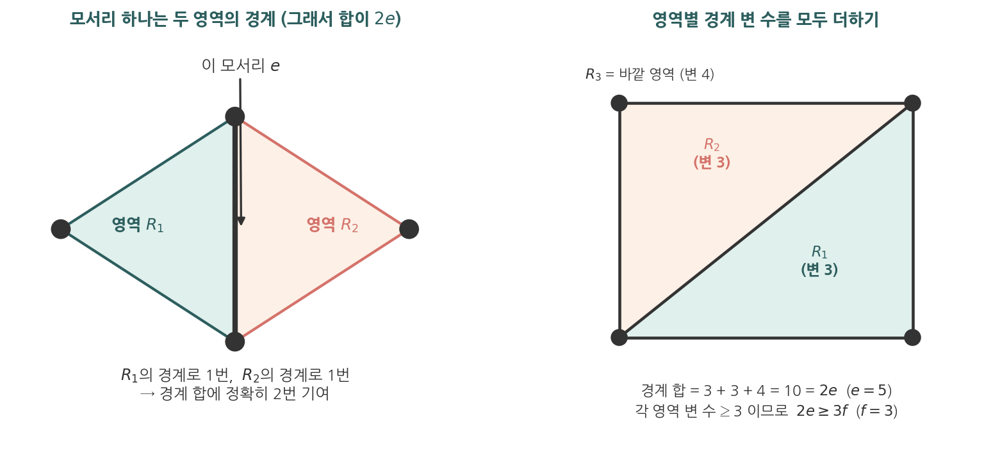

**증명.** 단순 그래프에서 각 영역은 적어도 세 개의 모서리로 둘러싸이고, 각 모서리는 많아야 두 영역의 경계가 된다. 영역–모서리 결합 관계를 세면 $2e\ge 3f$, 즉 $f\le \tfrac{2}{3}e$이다. 이를 오일러 공식 $f=2-v+e$에 넣으면 $2-v+e\le\tfrac{2}{3}e$이고 정리하면 $e\le 3v-6$이다. $\blacksquare$

> **따름정리 2.** 삼각형(길이 $3$ 순환)을 포함하지 않는 연결 평면 단순 그래프에서 $v\ge 3$이면 $e\le 2v-4$이다.

**증명.** 따름정리 1과 같은 방식이되, 영역을 둘러싸는 모서리의 최소 개수가 달라진다. 삼각형이 없으므로 어떤 영역도 세 모서리로 둘러싸일 수 없고, 각 영역은 적어도 네 개의 모서리로 둘러싸인다. 영역–모서리 결합 관계에서 각 모서리는 많아야 두 영역의 경계가 되므로 $2e\ge 4f$, 즉 $f\le\tfrac{1}{2}e$이다. 이를 오일러 공식 $f=2-v+e$에 넣으면 $2-v+e\le\tfrac{1}{2}e$이고, 정리하면 $e\le 2v-4$이다. $\blacksquare$

**일반화.** 두 따름정리는 "각 영역의 경계 모서리 수의 하한"만 다를 뿐 논리가 같다. 그 하한을 $g$로 두면 둘을 하나로 묶을 수 있다. 여기서 $g$는 그래프에서 가장 짧은 순환의 길이, 곧 **둘레**(girth)이며, 모서리가 둘 이상인 연결 단순 평면 그래프에서 각 영역은 적어도 $g$개의 모서리로 둘러싸인다. 같은 방식으로 $2e\ge g\cdot f$를 얻고, $f\le\tfrac{2e}{g}$를 오일러 공식에 넣으면

$$e \le \frac{g}{g-2}\,(v-2)$$

가 된다. 이 식에 $g=3$을 넣으면 $\tfrac{3}{1}(v-2)=3v-6$으로 따름정리 1이, $g=4$를 넣으면 $\tfrac{4}{2}(v-2)=2v-4$로 따름정리 2가 그대로 나온다. 둘레가 클수록(짧은 순환이 없을수록) 평면 그래프가 가질 수 있는 모서리 수의 상한이 작아진다는 것을 한눈에 보여 준다.

이 따름정리들은 **비평면 그래프**를 판정하는 데 쓰인다.

- $K_5$: $v=5,\ e=10$. 따름정리 1은 $e\le 3\cdot5-6=9$를 요구하는데 $10>9$이므로 $K_5$는 평면 그래프가 아니다.
- $K_{3,3}$: $v=6,\ e=9$. $K_{3,3}$은 이분 그래프여서 삼각형이 없으므로 따름정리 2가 $e\le 2\cdot6-4=8$을 요구하는데 $9>8$이므로 $K_{3,3}$도 평면 그래프가 아니다.

### 10.7.4 쿠라토프스키 정리

$K_5$와 $K_{3,3}$은 비평면 그래프의 근본 형태이다.

> **정리 2 (쿠라토프스키, Kuratowski).** 어떤 그래프가 비평면일 필요충분조건은 그 그래프가 $K_5$ 또는 $K_{3,3}$과 (세분에 의해) 동형인 부분그래프를 포함하는 것이다.

여기서 **세분**(subdivision)은 모서리 위에 차수 $2$의 꼭지점을 추가하는 연산이며, 평면성을 바꾸지 않는다.

### 자기 점검 (10.7)

다음 질문에 한 줄로 답해 보라.

1. 오일러 공식 $v-e+f=2$에서 $f$가 세는 것은 무엇인가(무한 영역 포함 여부 포함)?
2. $K_5$가 평면 그래프가 아님을 따름정리로 보이는 부등식은 무엇인가?
3. 쿠라토프스키 정리에서 비평면성을 특징짓는 두 그래프는 무엇인가?

<details>
<summary>정답</summary>

1. 평면 표현이 평면을 나누는 영역(면)의 수이며, 바깥의 무한 영역도 하나로 포함하여 센다.
2. $v\ge3$인 평면 단순 그래프는 $e\le 3v-6$을 만족해야 하는데, $K_5$는 $e=10>3\cdot5-6=9$이다.
3. $K_5$와 $K_{3,3}$이다.

</details>

---

## 10.8 그래프 채색

### 10.8.1 채색과 색수

지도에서 인접한 두 영역이 다른 색을 갖도록 칠하는 문제는 그래프 채색으로 환원된다. 각 영역을 꼭지점으로, 인접한 두 영역을 모서리로 두면 "인접 영역은 다른 색"이 곧 "인접 꼭지점은 다른 색"이 된다.

> **정의.** 단순 그래프의 **채색**(coloring)은 각 꼭지점에 색을 할당하되 인접한 두 꼭지점이 같은 색을 갖지 않도록 하는 것이다. 그래프 $G$를 채색하는 데 필요한 색의 최소 개수를 $G$의 **색수**(chromatic number)라 하고 $\chi(G)$로 표기한다.

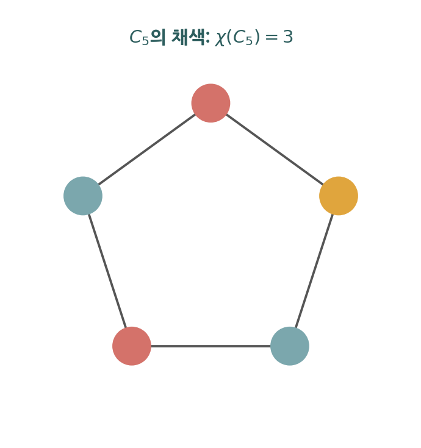

### 10.8.2 기본 색수

- **이분 그래프**: $\chi(G)\le 2$이다(모서리가 하나라도 있으면 정확히 $2$). 이는 10.2절의 이분 판정(2-채색 가능)과 같은 내용이다.
- **완전 그래프**: $\chi(K_n)=n$이다. $K_n$의 모든 꼭지점이 서로 인접하므로 같은 색을 둘 이상 쓸 수 없다.
- **사이클**: $\chi(C_n)=2$ ($n$이 짝수), $\chi(C_n)=3$ ($n$이 홀수)이다. 홀수 사이클은 두 색만으로 칠하면 시작과 끝에서 충돌이 생긴다.

> **정리 (이분 판정의 채색 형태).** 적어도 하나의 모서리를 갖는 그래프 $G$가 이분 그래프일 필요충분조건은 $\chi(G)=2$이다.

### 10.8.3 4색 정리

> **정리 (4색 정리, Four Color Theorem).** 모든 평면 그래프는 색수가 $4$ 이하이다. 즉 평면 지도의 영역은 인접 영역이 같은 색을 갖지 않도록 네 가지 색으로 칠할 수 있다.

4색 정리는 1852년 제기되어 1976년 아펠과 하켄이 컴퓨터의 도움으로 증명하였다. 수많은 경우를 컴퓨터로 검증한 최초의 대규모 사례로 기록된다.

### 10.8.4 탐욕 채색과 Brooks 정리

> **탐욕 채색 알고리즘**(greedy coloring): 꼭지점을 어떤 순서로 나열한 뒤, 각 꼭지점에 그 이웃들이 이미 사용한 색을 피한 가장 작은 번호의 색을 할당한다.

탐욕 채색은 항상 유효한 채색을 주지만, 꼭지점 순서에 따라 사용하는 색의 수가 달라져 최적(색수)을 보장하지는 않는다. 최대 차수 $\Delta$인 그래프는 탐욕 채색으로 $\Delta+1$색 이내로 칠해진다.

> **정리 (Brooks).** 완전 그래프도 홀수 사이클도 아닌 연결 그래프 $G$는 $\chi(G)\le\Delta(G)$를 만족한다. 여기서 $\Delta(G)$는 최대 차수이다.

**예제 (색수 계산).** 휠 $W_5$의 색수를 구한다. $W_5$는 사이클 $C_5$의 다섯 꼭지점과 그 모두에 연결된 중심 꼭지점 하나로 이루어진다. 중심 꼭지점은 바깥 다섯 꼭지점 모두와 인접하므로 바깥에서 쓰는 어떤 색도 쓸 수 없어 자기만의 색이 필요하다. 바깥의 $C_5$는 홀수 사이클이므로 $\chi(C_5)=3$이다. 따라서 바깥에 세 색, 중심에 네 번째 색이 필요하여 $\chi(W_5)=4$이다. 일반적으로 홀수 $n$에 대해 $\chi(W_n)=4$, 짝수 $n$에 대해 $\chi(W_n)=3$이다.

**예제 (탐욕 채색의 순서 의존성).** 탐욕 채색이 항상 최소 색 수를 주지는 않음을 두 그래프로 본다. 먼저 사이클 $C_4$, 곧 꼭지점 $v_1,v_2,v_3,v_4$가 $v_1-v_2-v_3-v_4-v_1$로 이어진 그래프를 보자. 이는 이분 그래프여서 색수가 $2$이다. 색은 $0,1,2,\dots$로 번호를 매긴다. 처리 순서를 $v_1,v_2,v_3,v_4$로 하면 $v_1$에 색 $0$, $v_2$는 이웃 $v_1$이 색 $0$이므로 색 $1$, $v_3$은 이웃 $v_2$가 색 $1$이므로 색 $0$, $v_4$는 이웃 $v_3(0)$과 $v_1(0)$을 피해 색 $1$이 되어 두 색을 쓴다. 사실 $C_4$는 어떤 순서로 처리해도 탐욕이 정확히 두 색만 쓴다.

그러나 더 큰 그래프에서는 순서가 나쁘면 색수보다 많은 색을 쓴다. 좌측 $x_1,x_2,x_3$과 우측 $y_1,y_2,y_3$의 여섯 꼭지점에서, 첨자가 다른 좌우 꼭지점만 잇는 그래프(곧 $x_i$와 $y_j$를 $i\ne j$일 때만 잇는 그래프)를 생각하자. 이는 좌측 전체를 한 색, 우측 전체를 다른 색으로 칠하면 되므로 색수가 $2$이다. 그런데 처리 순서를 좌우로 번갈아 $x_1,y_1,x_2,y_2,x_3,y_3$로 잡으면 탐욕은 다음과 같이 진행된다.

$$x_1\to 0,\quad y_1\to 0,\quad x_2\to 1,\quad y_2\to 1,\quad x_3\to 2,\quad y_3\to 2$$

여기서 $y_1$은 $x_1$과 인접하지 않아 같은 색 $0$을 받고, $x_2$는 이웃 $y_1(0)$을 피해 $1$, $y_2$는 이웃 $x_1(0)$을 피해 $1$, $x_3$은 이웃 $y_1(0)$과 $y_2(1)$을 피해 $2$, $y_3$은 이웃 $x_1(0)$과 $x_2(1)$을 피해 $2$가 된다. 그 결과 색수가 $2$인 그래프인데도 탐욕이 세 색을 쓴다. 이처럼 탐욕 채색의 결과는 꼭지점 처리 순서에 의존하며 최소 색 수를 보장하지 않는다. (이 그래프는 채색 인터랙티브 도구의 "탐욕이 손해 보는 예"와 같은 것이다.)

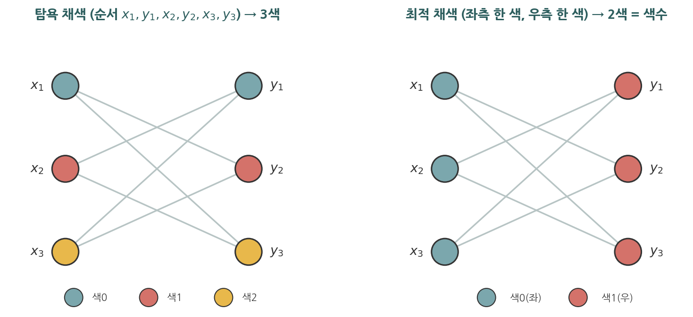

위 그림의 왼쪽이 그 탐욕 채색이다. 좌우를 번갈아 칠하다 보니 $x_3$과 $y_3$에서 앞의 두 색이 모두 막혀 세 번째 색을 쓰게 된다. 오른쪽은 같은 그래프의 최적 채색이다. 첨자가 다른 좌우만 이어져 있으므로 좌측 $x_1, x_2, x_3$을 한 색, 우측 $y_1, y_2, y_3$을 다른 색으로 칠하면 인접한 두 꼭지점이 같은 색이 되는 일이 없어 두 색으로 충분하다. 곧 색수는 $2$인데, 처리 순서가 나빠 탐욕은 $3$색을 쓴 것이다.

### 10.8.5 응용과 현대적 연결

- **시험 시간표 작성**: 과목을 꼭지점으로, 같은 학생이 수강하여 동시에 치를 수 없는 두 과목을 모서리로 둔다. 색이 시험 시간대에 대응하므로, 색수가 필요한 최소 시간대 수이다.
- **무선 주파수 할당**: 송신소를 꼭지점으로, 간섭이 생길 만큼 가까운 두 송신소를 모서리로 둔다. 색이 주파수 채널에 대응한다.
- **레지스터 할당**: 컴파일러가 변수의 생존 구간이 겹치는 변수들을 모서리로 잇고, 색(CPU 레지스터)을 할당한다. 그래프 채색이 컴파일러 최적화의 핵심 단계로 쓰인다.
- **스도쿠**: 각 칸을 꼭지점으로, 같은 행·열·블록의 두 칸을 모서리로 두면 $9$-채색 문제가 된다.

### 10.8.6 Python으로 탐욕 채색 구현하기

```python
def greedy_coloring(G, order=None):
    """인접 리스트 G를 탐욕 채색한다. order는 꼭지점 처리 순서."""
    if order is None:
        order = list(G.keys())
    color = {}                       # 꼭지점 -> 색 번호(0,1,2,...)
    for v in order:
        used = {color[w] for w in G[v] if w in color}   # 이웃이 쓴 색
        c = 0
        while c in used:             # 안 쓰인 최소 색 찾기
            c += 1
        color[v] = c
    return color

# C5 (홀수 사이클): 색수 3
C5 = {i: [(i - 1) % 5, (i + 1) % 5] for i in range(5)}
coloring = greedy_coloring(C5)
print("C5 채색:", coloring)
print("사용한 색 수:", max(coloring.values()) + 1)   # 순서에 따라 2~3

# K4 (완전 그래프): 색수 4
K4 = {i: [j for j in range(4) if j != i] for i in range(4)}
c4 = greedy_coloring(K4)
print("K4 채색:", c4, "-> 색 수:", max(c4.values()) + 1)   # 4
```

### 자기 점검 (10.8)

다음 질문에 한 줄로 답해 보라.

1. 그래프의 색수 $\chi(G)$의 정의는 무엇인가?
2. $\chi(K_n)$과 $\chi(C_n)$(홀수 $n$)은 각각 얼마인가?
3. 4색 정리는 어떤 그래프 집합에 대해 성립하는가?
4. 탐욕 채색이 항상 색수와 같은 수의 색을 사용하는가?

<details>
<summary>정답</summary>

1. 인접한 두 꼭지점이 같은 색을 갖지 않도록 채색하는 데 필요한 색의 최소 개수이다.
2. $\chi(K_n)=n$이고, 홀수 $n$에 대해 $\chi(C_n)=3$이다.
3. 모든 평면 그래프(평면 지도)에 대해 성립하며, 색수가 $4$ 이하이다.
4. 그렇지 않다. 꼭지점 처리 순서에 따라 색수보다 많은 색을 쓸 수 있다.

</details>

---

## 부록 A. 핵심 공식·정리 요약

| 항목 | 결과 |
|---|---|
| 악수정리 | $2m=\sum_{v}\deg(v)$ |
| 홀수 차수 꼭지점 | 항상 짝수 개 |
| 방향 그래프 차수 합 | $\sum\deg^-(v)=\sum\deg^+(v)=|E|$ |
| 완전 그래프 $K_n$ | 모서리 $\binom{n}{2}=\dfrac{n(n-1)}{2}$, 각 차수 $n-1$ |
| 사이클 $C_n$ | 모서리 $n$, 각 차수 $2$ |
| 휠 $W_n$ | 꼭지점 $n+1$, 모서리 $2n$ |
| $n$-큐브 $Q_n$ | 꼭지점 $2^n$, 모서리 $n\cdot 2^{n-1}$, 각 차수 $n$ |
| 완전 이분 $K_{m,n}$ | 모서리 $mn$ |
| 오일러 회로 존재 | 연결 + 모든 차수 짝수 |
| 오일러 경로 존재 | 연결 + 홀수 차수 꼭지점 정확히 $2$개 |
| 오일러 공식(평면) | $v-e+f=2$ |
| 평면 단순 그래프 ($v\ge3$) | $e\le 3v-6$ (삼각형 없으면 $e\le 2v-4$) |
| 비평면 판정 | $K_5$, $K_{3,3}$ 포함 여부(쿠라토프스키) |
| 4색 정리 | 모든 평면 그래프 $\chi\le 4$ |
| 색수 기본값 | $\chi(K_n)=n$, $\chi(C_n)=2$(짝수)/$3$(홀수), 이분 $\le2$ |

## 부록 B. 핵심 용어 한·영 대조

| 한국어 | 영어 |
|---|---|
| 꼭지점 | vertex (node) |
| 모서리 | edge |
| 차수 | degree |
| 단순 그래프 | simple graph |
| 다중그래프 | multigraph |
| 의사그래프 | pseudograph |
| 방향성 그래프 | directed graph (digraph) |
| 인접 행렬 | adjacency matrix |
| 결합 행렬 | incidence matrix |
| 동형 | isomorphism |
| 경로 | path |
| 순환·회로 | circuit |
| 연결성분 | connected component |
| 오일러 회로 | Euler circuit |
| 해밀턴 회로 | Hamilton circuit |
| 가중 그래프 | weighted graph |
| 평면 그래프 | planar graph |
| 색수 | chromatic number |
