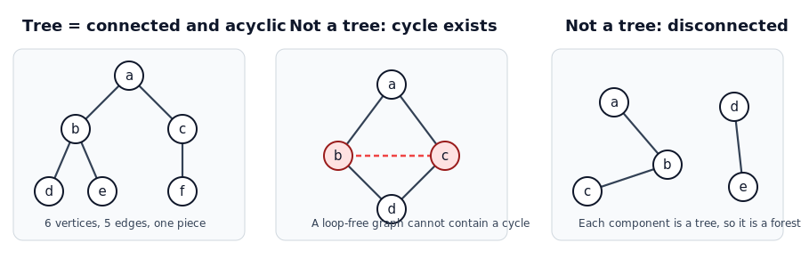
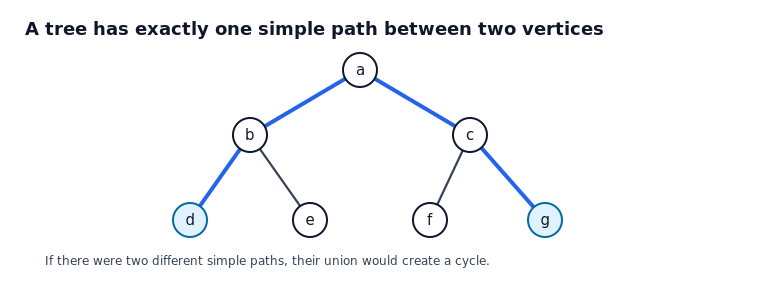
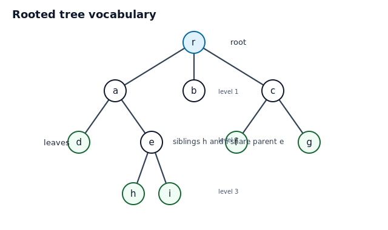
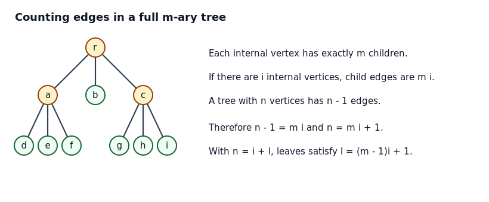
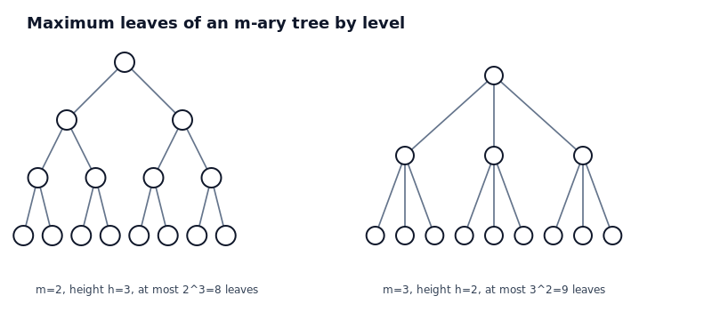
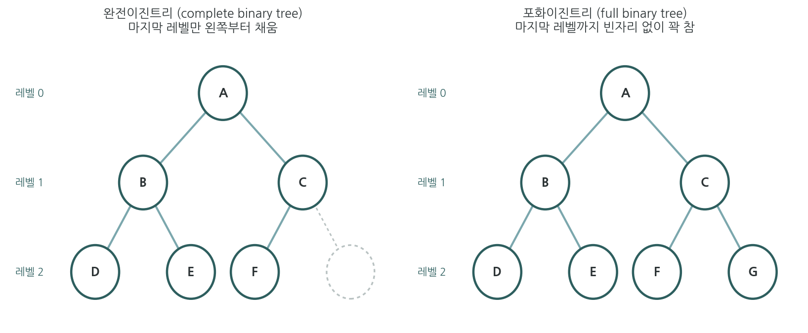

# 11.1 트리 소개

## 학습 목표

이 절의 목표는 트리가 단순히 나무처럼 생긴 그림이 아니라 연결성과 순환 없음이라는 두 조건을 동시에 만족하는 그래프라는 점을 이해하는 것이다. 또한 루트 트리에서 부모, 자식, 형제, 조상, 자손, 잎, 내부 정점, 부분트리, 높이 같은 용어를 정확히 사용할 수 있어야 한다. 마지막으로 트리의 간선 수 공식과 $m$-항 트리의 개수 공식을 예제에 적용할 수 있어야 한다.

## 핵심 그림 1. 트리, 순환이 있는 그래프, 숲

트리는 연결되어 있고 순환이 없는 단순 그래프이다. 연결되어 있다는 말은 임의의 두 정점 사이에 경로가 존재한다는 뜻이다. 순환이 없다는 말은 어떤 정점에서 출발하여 서로 다른 간선들을 따라 움직인 뒤 다시 출발점으로 돌아오는 닫힌 경로가 없다는 뜻이다. 따라서 연결은 되어 있지만 순환이 있으면 트리가 아니고, 순환은 없지만 여러 조각으로 떨어져 있으면 트리가 아니다. 여러 조각 각각이 트리이면 전체 그래프는 숲이라 부른다.

## 핵심 개념

### 트리와 숲

그래프 $G$가 트리라는 것은 다음 두 조건을 동시에 만족한다는 뜻이다.

- $G$는 연결 그래프이다.
- $G$는 순환을 포함하지 않는다.

숲은 순환이 없는 그래프이다. 숲은 여러 개의 연결 성분으로 나뉠 수 있고, 각 연결 성분은 트리이다. 학생들이 자주 놓치는 지점은 숲도 순환이 없다는 사실이다. 다만 숲은 반드시 연결되어 있을 필요가 없다.

### 트리에서 경로가 하나뿐인 이유

트리에서는 서로 다른 두 정점 사이의 단순 경로가 정확히 하나 존재한다. 연결 그래프이므로 적어도 하나의 경로가 존재한다. 만약 서로 다른 단순 경로가 두 개 존재한다고 가정하면, 두 경로를 합쳐서 한 바퀴 도는 순환을 만들 수 있다. 그러나 트리에는 순환이 없으므로 그런 일이 불가능하다. 이 생각은 트리 문제의 핵심 직관이다.

### 루트 트리의 용어

루트 트리는 정점 하나를 루트로 지정한 트리이다. 루트를 정하면 모든 간선은 루트에서 멀어지는 방향으로 읽을 수 있다. 어떤 정점 바로 아래에 붙은 정점은 자식이고, 바로 위에 붙은 정점은 부모이다. 같은 부모를 가진 정점들은 형제이다. 루트에서 어떤 정점으로 가는 유일 경로 위에 있는 정점들은 그 정점의 조상이고, 그 정점 아래에 있는 정점들은 자손이다. 자식이 없는 정점은 잎이고, 자식이 하나 이상인 정점은 내부 정점이다.

## 핵심 정리

### 정리 1. 정점이 $n$개인 트리는 간선이 $n-1$개이다

루트를 하나 정하고 생각하면 루트를 제외한 모든 정점은 부모로부터 오는 간선 하나를 정확히 하나씩 가진다. 루트는 부모가 없으므로 이런 간선을 가지지 않는다. 따라서 간선 수는 루트가 아닌 정점의 수와 같고, 그 값은 $n-1$이다.

이 설명이 중요한 이유는 간선을 하나씩 세지 않아도 된다는 점이다. 트리인지 이미 알고 있고 정점 수가 $n$이면 간선 수는 자동으로 $n-1$이다. 반대로 단순 연결 그래프에서 정점 수가 $n$이고 간선 수가 $n-1$이면 순환이 없으므로 트리이다.

### 정리 2. 완전 $m$-항 트리의 개수 공식

완전 $m$-항 트리는 모든 내부 정점이 정확히 $m$개의 자식을 가지는 루트 트리이다. 이때 내부 정점의 자식 수만 따지며 잎의 레벨은 보지 않으므로, 뒤에 나오는 포화이진트리(모든 잎이 같은 레벨에 있는 트리)와는 다른 개념이다. 내부 정점 수를 $i$, 잎 수를 $L$, 전체 정점 수를 $n$이라 하자. 내부 정점마다 자식 간선이 $m$개씩 나오므로 간선 수는 $mi$이다. 한편 트리는 간선이 $n-1$개이므로 $n-1=mi$이다. 따라서 다음 공식이 나온다.

$$
 n = mi + 1
$$

또한 모든 정점은 내부 정점이거나 잎이므로 $n=i+L$이다. 이를 결합하면 다음 식이 나온다.

$$
 L = (m-1)i + 1
$$

학생들이 어려워하는 부분은 왜 $mi$가 간선 수인지이다. 내부 정점 하나가 자식으로 내려보내는 간선이 정확히 $m$개이고, 모든 간선은 어떤 내부 정점에서 자식으로 내려가는 간선으로 정확히 한 번 세어진다. 그래서 중복도 빠짐도 없이 $mi$개가 된다.

### 정리 3. 높이와 잎의 최대 수

각 내부 정점이 최대 $m$개의 자식을 가질 수 있고 높이가 $h$인 루트 트리에서 잎의 수는 최대 $m^h$개이다. 루트가 레벨 0에 있고, 레벨 1에는 최대 $m$개, 레벨 2에는 최대 $m^2$개가 올 수 있다. 같은 방식으로 레벨 $h$에는 최대 $m^h$개가 올 수 있다.

따라서 잎이 $L$개인 $m$-항 트리의 높이 $h$는 다음을 만족한다.

$$
 L \le m^h, \qquad h \ge \lceil \log_m L \rceil
$$

이 부등식은 잎이 많을수록 어느 정도 깊이가 필요하다는 뜻이다. 한 층에 담을 수 있는 잎 수가 제한되어 있기 때문이다.

## 이진트리의 종류

지금까지 다룬 것은 일반적인 $m$-항 트리이다. $m$이 2인 이진트리에서는 노드가 채워진 모양에 따라 종류를 따로 구분한다. 아래 정의는 교재의 문장을 그대로 옮긴 것이다.

**이진트리**(binary tree): 트리인 그래프 $T$를 구성하는 각 노드의 최대 차수가 2인 트리.

**완전이진트리**(complete binary tree): 높이가 $h$일 때 레벨 0부터 $h-1$까지의 모든 부모노드의 차수가 2이고, 레벨 $h$는 레벨 $h-1$의 왼쪽부터 노드가 2개씩 채워져 있는 트리.

**포화이진트리**(full binary tree): 높이가 $h$일 때 레벨 0부터 $h-1$까지의 모든 노드의 차수가 2인 트리.

두 정의의 차이는 마지막 레벨에 있다. 완전이진트리는 레벨 0부터 $h-1$까지는 빈자리 없이 차 있고, 마지막 레벨 $h$만 왼쪽부터 채워진다. 곧 마지막 레벨은 일부만 채워져 있어도 된다. 포화이진트리는 레벨 0부터 $h-1$까지 모든 노드의 차수가 2이므로 마지막 레벨까지 빈자리 없이 완전히 꽉 찬다. 따라서 포화이진트리에서는 모든 잎이 레벨 $h$에 있다.

### 포화이진트리의 노드 수

포화이진트리는 레벨마다 노드가 빈자리 없이 채워진다. 레벨 0에 1개, 레벨 1에 2개, 레벨 2에 4개, 이렇게 레벨 $h$까지 $2^h$개가 채워진다. 따라서 높이가 $h$인 포화이진트리의 전체 노드 수는 다음과 같다.

$$
 n = 2^0 + 2^1 + \cdots + 2^h = 2^{h+1} - 1
$$

잎은 마지막 레벨 $h$에만 있으므로 $2^h$개이고, 내부 노드는 전체에서 잎을 뺀 $2^h - 1$개이다.

## 예제 6. 포화이진트리의 노드 수 판정

### 문제

노드가 10개인 포화이진트리가 있는가? 노드가 15개인 경우는 어떤가? 있다면 잎 수와 내부 노드 수를 구하라.

### 풀이

포화이진트리의 노드 수는 항상 $2^{h+1}-1$ 꼴이다. 곧 1, 3, 7, 15, 31과 같은 값만 가능하다. 10은 이 꼴이 아니므로 노드가 10개인 포화이진트리는 없다. 15는 $2^4-1$이므로 높이가 3인 포화이진트리가 있다. 이때 잎은 $2^3=8$개이고 내부 노드는 $8-1=7$개이다.

### 왜 홀짝만으로는 판정할 수 없는가

$2^{h+1}-1$은 항상 홀수이다. 그러나 홀수라고 해서 모두 포화이진트리의 노드 수가 되는 것은 아니다. 예를 들어 5, 9, 11, 13은 홀수이지만 $2^{h+1}-1$ 꼴이 아니므로 포화이진트리가 될 수 없다. 따라서 포화이진트리인지 판정할 때는 노드 수가 $2^{h+1}-1$ 꼴인지를 확인해야 한다.

## 예제 1. 그래프가 트리인지 판정하기

### 문제

정점이 7개이고 간선이 6개인 단순 그래프 $G$가 연결되어 있다고 하자. $G$가 트리인지 판단하라.

### 풀이

연결 그래프에서 순환이 없으면 트리이다. 그런데 정점이 7개인 트리는 반드시 간선이 $7-1=6$개이어야 한다. $G$는 이미 연결되어 있고 간선이 6개이다.

만약 $G$에 순환이 있다고 가정하자. 순환 안의 간선 하나를 제거해도 순환의 나머지 경로가 두 끝점을 계속 연결하므로 그래프 전체의 연결성은 유지된다. 그러면 연결 그래프에서 간선을 하나 제거하여 정점 7개, 간선 5개인 연결 그래프가 된다. 하지만 정점 7개를 연결하려면 적어도 6개의 간선이 필요하다. 모순이다. 따라서 $G$에는 순환이 없고, $G$는 트리이다.

### 왜 이렇게 생각하는가

정점 수와 간선 수가 $n$과 $n-1$로 맞는 것만으로는 항상 트리라고 결론낼 수 없다. 연결성도 필요하다. 이 문제에서는 연결성이 주어졌으므로 간선 수 조건과 합쳐서 트리라고 판단할 수 있다.

## 예제 2. 루트 트리의 용어 읽기

### 문제

다음 루트 트리에서 루트는 $r$이다. 정점 $e$의 부모, 자식, 형제, 조상, 자손을 구하라.

### 풀이

정점 $e$는 $a$의 아래에 있으므로 부모는 $a$이다. $e$ 아래에 $h$와 $i$가 있으므로 자식은 $h,i$이다. $e$와 같은 부모 $a$를 가진 다른 정점은 $d$이므로 형제는 $d$이다.

조상은 루트에서 $e$로 내려오는 유일 경로 위에서 $e$보다 위에 있는 정점들이다. 경로가 $r \to a \to e$이므로 조상은 $r,a$이다. 자손은 $e$ 아래쪽에 있는 모든 정점이므로 $h,i$이다.

### 왜 학생들이 헷갈리는가

부모와 조상은 다르다. 부모는 바로 한 단계 위의 정점 하나만 뜻한다. 조상은 바로 위의 부모뿐 아니라 그 위의 부모, 다시 그 위의 부모를 모두 포함한다. 자식과 자손도 같은 방식으로 구분된다.

## 예제 3. 메시지 전달 트리의 최대 인원 수

### 문제

한 학생이 메시지를 시작한다. 메시지를 받은 학생은 다음 단계에서 각각 3명에게만 메시지를 보낼 수 있다. 처음 학생을 레벨 0으로 두고 레벨 4까지 메시지를 보낼 수 있을 때, 메시지를 받을 수 있는 학생 수의 최댓값을 구하라.

### 풀이

각 학생이 최대 3명에게 보낼 수 있으므로 최대한 많이 보내려면 매 단계에서 모든 학생이 3명씩에게 보낸다고 생각한다.

레벨별 학생 수는 다음과 같다.

$$
1, 3, 3^2, 3^3, 3^4
$$

따라서 전체 학생 수의 최댓값은 다음 합이다.

$$
1+3+9+27+81=121
$$

### 왜 등비수열이 나오는가

레벨이 하나 내려갈 때마다 가능한 학생 수가 최대 3배가 된다. 그래서 각 레벨의 최대 정점 수가 $3^k$ 꼴로 나타난다. 트리에서 높이와 분기 수가 주어지면 보통 레벨별로 세는 방법이 가장 자연스럽다.

## 예제 4. 완전 3-항 트리에서 잎 수 구하기

### 문제

완전 3-항 트리의 전체 정점 수가 40개이다. 내부 정점 수와 잎 수를 구하라.

### 풀이

완전 $m$-항 트리에서는 $n=mi+1$이다. 여기서는 $m=3$, $n=40$이므로 다음과 같다.

$$
40=3i+1
$$

따라서 $3i=39$이고 $i=13$이다. 잎 수는 $L=n-i$로 구할 수 있다.

$$
 L=40-13=27
$$

또는 $L=(m-1)i+1$을 사용해도 된다.

$$
 L=(3-1)13+1=27
$$

### 왜 $40=3i+1$인가

내부 정점이 13개라면 내부 정점에서 아래로 내려가는 간선은 $3 \cdot 13=39$개이다. 트리에서 간선 수는 정점 수보다 하나 적으므로 정점 수는 $39+1=40$이다. 여기서 하나 더해지는 정점은 특정한 하나의 잎을 뜻하는 것이 아니라 트리 전체의 기본 관계 $e=n-1$에서 온 것이다.

## 예제 5. 높이의 하한 구하기

### 문제

각 내부 정점이 최대 4개의 자식을 가질 수 있는 루트 트리에 잎이 70개 있다. 이 트리의 높이는 적어도 얼마인가.

### 풀이

높이가 $h$이고 각 정점의 자식 수가 최대 4개이면 잎 수는 최대 $4^h$개이다. 잎이 70개이므로 다음이 필요하다.

$$
70 \le 4^h
$$

$4^3=64$이고 $4^4=256$이다. $h=3$이면 최대 64개의 잎만 가능하므로 70개를 담을 수 없다. $h=4$이면 충분히 가능하다. 따라서 높이는 적어도 4이다.

$$
 h \ge \lceil \log_4 70 \rceil = 4
$$

### 왜 로그가 필요한가

분기 수가 일정할 때 잎 수는 높이에 대해 지수적으로 증가한다. 거꾸로 잎 수가 주어지고 필요한 높이를 찾으려면 지수 관계를 뒤집어야 하므로 로그가 등장한다.

## 자기 점검 문제

1. 정점이 10개인 트리의 간선 수를 구하라.
2. 간선이 15개인 트리의 정점 수를 구하라.
3. 완전 4-항 트리에서 내부 정점이 8개일 때 잎 수와 전체 정점 수를 구하라.
4. 높이가 3인 이진 트리의 잎 수는 최대 몇 개인가.
5. 숲이 3개의 연결 성분으로 이루어져 있고 전체 정점 수가 20개라면 전체 간선 수는 몇 개인가.

## 자기 점검 해설

1. 트리의 간선 수는 $n-1$이므로 9개이다.
2. $e=n-1$이므로 $n=e+1=16$개이다.
3. $L=(4-1)8+1=25$이고 $n=8+25=33$이다.
4. 최대 $2^3=8$개이다.
5. 각 연결 성분이 트리이므로 각 성분에서 간선 수는 정점 수보다 하나 적다. 성분이 3개이면 전체 간선 수는 $20-3=17$개이다.

## 흔한 오해 정리

- 간선이 $n-1$개인 모든 그래프가 트리인 것은 아니다. 연결성도 확인해야 한다.
- 연결된 모든 그래프가 트리인 것은 아니다. 순환이 있으면 트리가 아니다.
- 루트는 트리 구조의 일부가 아니라 해석을 위해 선택한 기준점이다. 같은 무방향 트리라도 루트를 다르게 잡으면 부모와 자식 관계가 달라진다.
- 완전 $m$-항 트리와 단순히 자식 수가 최대 $m$개인 트리는 다르다. 완전 $m$-항 트리는 모든 내부 정점이 정확히 $m$개의 자식을 가진다는 뜻이다.
- 완전 $m$-항 트리와 포화이진트리는 다르다. 완전 $m$-항 트리는 내부 정점마다 자식이 $m$개라는 조건만 보고, 포화이진트리는 모든 잎이 같은 레벨에 있어 완전히 꽉 찬 트리를 뜻한다.
