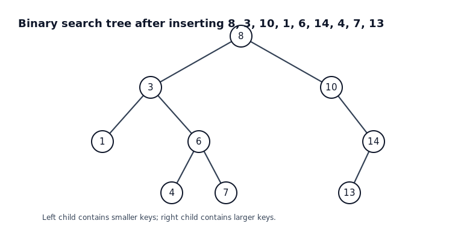
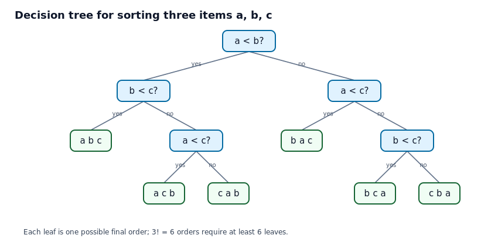
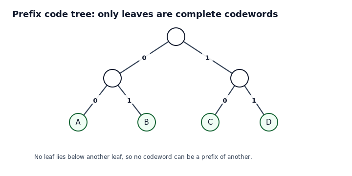
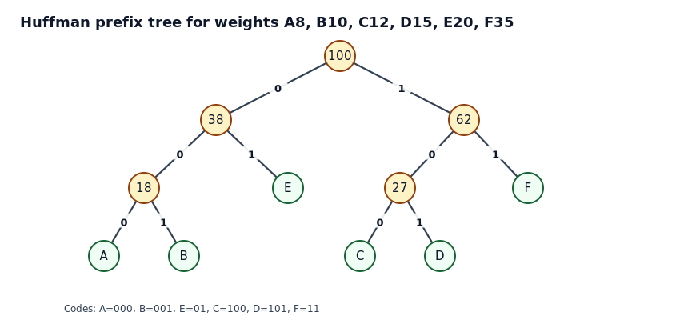
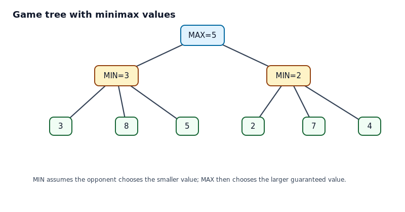

# 11.2 트리의 응용

## 학습 목표

이 절의 목표는 트리가 추상적인 그래프 개념을 넘어 정보 저장, 의사 결정, 압축, 게임 분석에 어떻게 쓰이는지 이해하는 것이다. 트리는 선택의 과정을 단계별로 분해해 주기 때문에 알고리즘의 구조를 눈으로 볼 수 있게 한다.

## 한눈에 보는 응용 지도

| 응용 | 트리의 의미 | 핵심 질문 |
|---|---|---|
| 이진 탐색 트리 | 키를 빠르게 찾기 위한 저장 구조 | 찾을 때 왼쪽으로 갈지 오른쪽으로 갈지 어떻게 정하는가 |
| 결정 트리 | 비교나 질문의 순서 | 최악의 경우 몇 번의 질문이 필요한가 |
| 접두어 코드 | 0과 1의 경로가 문자 코드 | 어떤 코드가 모호하지 않게 해독되는가 |
| 허프만 코드 | 빈도가 높은 문자를 짧게 배치한 트리 | 평균 코드 길이를 어떻게 줄이는가 |
| 게임 트리 | 가능한 수와 결과의 전체 구조 | 상대가 최선으로 둔다면 어떤 수가 좋은가 |

## 1. 이진 탐색 트리

이진 탐색 트리는 각 정점에 키가 저장된 이진 트리이다. 어떤 정점의 왼쪽 부분트리에 있는 키는 그 정점의 키보다 작고, 오른쪽 부분트리에 있는 키는 그 정점의 키보다 크다. 이 규칙 덕분에 탐색할 때 매 단계에서 후보 영역을 한쪽으로 줄일 수 있다.

학생들이 가장 자주 놓치는 점은 이진 탐색 트리의 모양이 삽입 순서에 의존한다는 사실이다. 같은 키 집합이라도 삽입 순서가 달라지면 트리 높이가 달라질 수 있다. 높이가 작으면 탐색이 빠르고, 한쪽으로 길게 기울면 연결 리스트처럼 느려진다.

### 예제 1. 이진 탐색 트리에서 탐색하기

#### 문제

그림의 이진 탐색 트리에서 키 7을 찾는 과정을 설명하라.

#### 풀이

루트 8에서 시작한다. 7은 8보다 작으므로 왼쪽 자식 3으로 이동한다. 7은 3보다 크므로 오른쪽 자식 6으로 이동한다. 7은 6보다 크므로 오른쪽 자식 7로 이동한다. 목표 키를 찾았다.

이 과정을 비교식으로 쓰면 다음과 같다.

$$
7 < 8, \quad 7 > 3, \quad 7 > 6, \quad 7=7
$$

#### 왜 이렇게 되는가

이진 탐색 트리는 각 정점에서 작은 값은 왼쪽, 큰 값은 오른쪽이라는 규칙을 전체 부분트리에 적용한다. 따라서 7이 8보다 작다는 사실만으로 8의 오른쪽 부분트리 전체를 버릴 수 있다. 그 안에는 8보다 큰 값만 있기 때문이다.

### 예제 2. 새 키 삽입하기

#### 문제

위 이진 탐색 트리에 키 5를 삽입하라.

#### 풀이

삽입도 탐색과 같은 길을 따른다. 5는 8보다 작으므로 3으로 간다. 5는 3보다 크므로 6으로 간다. 5는 6보다 작으므로 6의 왼쪽 자식 4로 간다. 5는 4보다 크다. 4의 오른쪽 자식이 비어 있으므로 그 자리에 5를 새 정점으로 넣는다.

#### 왜 빈 자리까지 내려가는가

이진 탐색 트리의 규칙은 모든 정점에서 동시에 지켜져야 한다. 중간에 마음대로 넣으면 어떤 부분트리의 모든 원소가 부모보다 작거나 커야 한다는 조건이 깨질 수 있다. 탐색 규칙을 따라 내려가서 처음 만나는 빈 자리가 정확히 규칙을 깨지 않는 자리이다.

## 2. 결정 트리와 비교 기반 정렬

결정 트리는 질문 또는 비교를 내부 정점에 놓고, 가능한 답을 간선에 놓고, 최종 결과를 잎에 놓은 트리이다. 비교 기반 정렬 알고리즘은 입력 원소의 대소 비교만으로 순서를 결정하므로 결정 트리로 나타낼 수 있다.

$n$개의 서로 다른 원소를 정렬하려면 가능한 최종 순서가 $n!$개이다. 결정 트리의 잎은 가능한 최종 순서를 구별해야 하므로 적어도 $n!$개의 잎이 필요하다. 한 번의 비교는 보통 두 가지 결과를 낳으므로 높이 $h$인 이진 결정 트리는 최대 $2^h$개의 잎을 가진다. 따라서 최악의 경우 비교 횟수 $h$는 다음을 만족한다.

$$
2^h \ge n!, \qquad h \ge \lceil \log_2(n!) \rceil
$$

### 예제 3. 다섯 개 원소 정렬의 최소 비교 횟수 하한

#### 문제

서로 다른 원소 5개를 비교 기반 방법으로 정렬한다. 어떤 알고리즘이든 최악의 경우 최소 몇 번의 비교가 필요한가.

#### 풀이

5개의 서로 다른 원소는 가능한 순서가 $5!=120$개이다. 결정 트리의 잎이 적어도 120개 필요하다. 높이가 $h$인 이진 트리의 잎 수는 최대 $2^h$개이므로 다음이 필요하다.

$$
2^h \ge 120
$$

$2^6=64$이고 $2^7=128$이므로 $h$는 적어도 7이다.

$$
\lceil \log_2 120 \rceil = 7
$$

따라서 어떤 비교 기반 정렬 알고리즘도 최악의 경우 7번보다 적은 비교로 항상 정렬할 수 없다.

#### 왜 잎을 세는가

정렬 결과는 가능한 순서 중 하나이다. 알고리즘이 끝난 뒤 같은 잎에 두 가지 다른 순서가 함께 들어가 있으면 알고리즘은 그 둘을 구별하지 못한다. 따라서 각 가능한 순서는 서로 다른 잎으로 분리되어야 한다. 이것이 결정 트리에서 잎의 수를 세는 이유이다.

## 3. 접두어 코드

접두어 코드는 어떤 코드워드도 다른 코드워드의 앞부분이 되지 않는 코드이다. 이 조건이 있으면 0과 1의 문자열을 왼쪽에서 오른쪽으로 읽을 때 모호성 없이 해독할 수 있다. 코드워드를 이진 트리의 잎에 배치하면 접두어 조건이 자연스럽게 보장된다.

예를 들어 $A=00$, $B=01$, $C=10$, $D=11$이면 모든 문자가 길이 2의 잎에 놓인다. 어떤 코드도 다른 코드의 앞부분이 아니므로 문자열 `000110`은 $00|01|10$으로 잘라 $ABC$로 해독된다.

### 예제 4. 접두어 코드인지 판단하기

#### 문제

다음 코드가 접두어 코드인지 판단하라.

$$
A=0, \quad B=10, \quad C=110, \quad D=111
$$

#### 풀이

각 코드가 다른 코드의 앞부분인지 확인한다. $A=0$으로 시작하는 다른 코드는 없다. $B=10$으로 시작하는 다른 코드도 없다. $C=110$과 $D=111$은 길이가 같고 서로 다르므로 서로의 접두어가 아니다. 따라서 이 코드는 접두어 코드이다.

#### 왜 $A=0$이 문제가 되지 않는가

$A=0$이 짧기 때문에 위험해 보일 수 있다. 하지만 다른 코드가 $0$으로 시작하지 않으므로 $0$을 읽는 순간 곧바로 $A$라고 판단해도 된다. 접두어 문제는 짧은 코드 자체가 아니라 짧은 코드가 긴 코드의 앞부분으로 쓰일 때 생긴다.

## 4. 허프만 코드

허프만 알고리즘은 빈도가 낮은 두 기호를 반복해서 묶는 방식으로 접두어 코드를 만든다. 빈도가 높은 기호는 루트에 가까운 잎이 되어 짧은 코드워드를 얻고, 빈도가 낮은 기호는 상대적으로 긴 코드워드를 얻는다. 이렇게 하면 평균 코드 길이를 줄일 수 있다.

### 예제 5. 허프만 코드 만들기

#### 문제

기호의 빈도가 다음과 같다고 하자.

| 기호 | A | B | C | D | E | F |
|---|---:|---:|---:|---:|---:|---:|
| 빈도 | 8 | 10 | 12 | 15 | 20 | 35 |

허프만 알고리즘으로 접두어 코드를 만들고 평균 코드 길이를 구하라.

#### 풀이

가장 작은 두 빈도부터 묶는다.

1. $8$과 $10$을 묶어 $18$을 만든다.
2. $12$와 $15$를 묶어 $27$을 만든다.
3. $18$과 $20$을 묶어 $38$을 만든다.
4. $27$과 $35$를 묶어 $62$를 만든다.
5. $38$과 $62$를 묶어 루트 $100$을 만든다.

그림에서 왼쪽 간선을 0, 오른쪽 간선을 1로 두면 다음 코드가 얻어진다.

| 기호 | 코드 | 길이 |
|---|---|---:|
| A | 000 | 3 |
| B | 001 | 3 |
| E | 01 | 2 |
| C | 100 | 3 |
| D | 101 | 3 |
| F | 11 | 2 |

평균 코드 길이는 빈도로 가중한 길이의 합을 전체 빈도 100으로 나누어 구한다.

$$
\frac{8\cdot3+10\cdot3+12\cdot3+15\cdot3+20\cdot2+35\cdot2}{100}=2.45
$$

따라서 평균적으로 한 기호를 약 2.45비트로 표현한다.

#### 왜 작은 빈도끼리 먼저 묶는가

트리에서 깊이가 깊을수록 코드 길이가 길어진다. 긴 코드를 받아도 손해가 작은 기호는 빈도가 낮은 기호이다. 그래서 가장 작은 두 빈도를 가장 깊은 형제 잎으로 놓는 전략이 합리적이고, 이 선택을 반복하면 전체 평균 길이가 작아진다.

## 5. 게임 트리와 미니맥스

게임 트리는 현재 상태에서 가능한 모든 수를 자식으로 펼친 트리이다. 두 사람이 번갈아 최선의 수를 둔다고 가정하면, 내 차례는 가능한 결과 중 최댓값을 고르고 상대 차례는 가능한 결과 중 최솟값을 고른다. 이 원리가 미니맥스이다.

### 예제 6. 미니맥스 값 계산하기

#### 문제

그림의 게임 트리에서 루트의 값을 구하고, 첫 수로 왼쪽과 오른쪽 중 어느 쪽을 선택해야 하는지 판단하라.

#### 풀이

루트의 자식은 상대 차례인 MIN 정점이다. 왼쪽 MIN 정점의 잎 값은 $3,8,5$이므로 상대는 가장 작은 3을 선택한다. 따라서 왼쪽 정점의 값은 3이다. 오른쪽 MIN 정점의 잎 값은 $2,7,4$이므로 상대는 2를 선택한다. 따라서 오른쪽 정점의 값은 2이다.

루트는 내 차례인 MAX 정점이므로 $3$과 $2$ 중 더 큰 $3$을 선택한다. 따라서 루트의 값은 3이고, 첫 수로는 왼쪽을 선택하는 것이 더 낫다.

#### 왜 상대가 최솟값을 고르는가

점수는 나에게 좋은 정도를 나타낸다. 상대는 나의 점수를 낮추려고 한다고 가정한다. 그래서 상대 차례의 정점에서는 가능한 결과 중 나에게 가장 불리한 값, 즉 최솟값을 선택한다. 미니맥스는 상대가 실수하지 않는다는 보수적인 분석이다.

## 자기 점검 문제

1. 이진 탐색 트리에서 키 13을 찾는 비교 과정을 쓰라.
2. 서로 다른 원소 4개를 정렬하는 비교 기반 알고리즘의 최악 비교 횟수 하한을 구하라.
3. 코드 $A=0$, $B=01$, $C=11$이 접두어 코드인지 판단하라.
4. 빈도가 높은 기호를 짧은 코드로 배치하는 이유를 한 문장으로 설명하라.
5. MIN 정점의 자식 값이 $6,2,9$이면 그 정점의 값은 얼마인가.

## 자기 점검 해설

1. $13>8$, $13>10$, $13<14$, $13=13$이므로 경로는 $8 \to 10 \to 14 \to 13$이다.
2. 가능한 순서가 $4!=24$개이므로 $\lceil \log_2 24 \rceil=5$이다.
3. $A=0$이 $B=01$의 접두어이므로 접두어 코드가 아니다.
4. 빈도가 높은 기호가 자주 등장하므로 그 코드 길이를 줄이면 전체 평균 길이가 크게 줄어든다.
5. MIN 정점은 최솟값을 고르므로 값은 2이다.

## 흔한 오해 정리

- 이진 트리와 이진 탐색 트리는 다르다. 이진 탐색 트리는 왼쪽이 작고 오른쪽이 크다는 순서 조건을 추가로 가진다.
- 결정 트리의 높이는 평균 비교 횟수가 아니라 최악의 경우 비교 횟수를 나타낸다.
- 접두어 코드는 모든 코드 길이가 같아야 한다는 뜻이 아니다. 짧은 코드가 긴 코드의 앞부분이 되지만 않으면 된다.
- 허프만 알고리즘에서 왼쪽에 0을 붙일지 1을 붙일지는 관례이다. 좌우를 바꾸어도 평균 길이는 변하지 않는다.
- 미니맥스 값은 실제 상대가 항상 그렇게 둘 것이라는 예측이 아니라, 상대가 최선으로 둘 때 보장되는 값이다.
