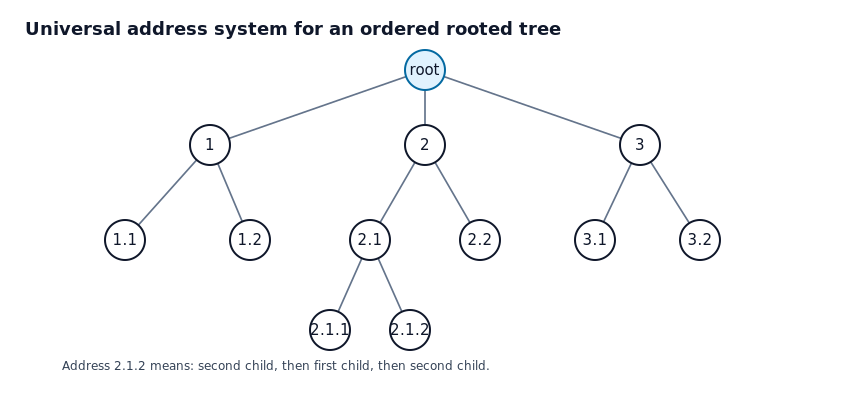
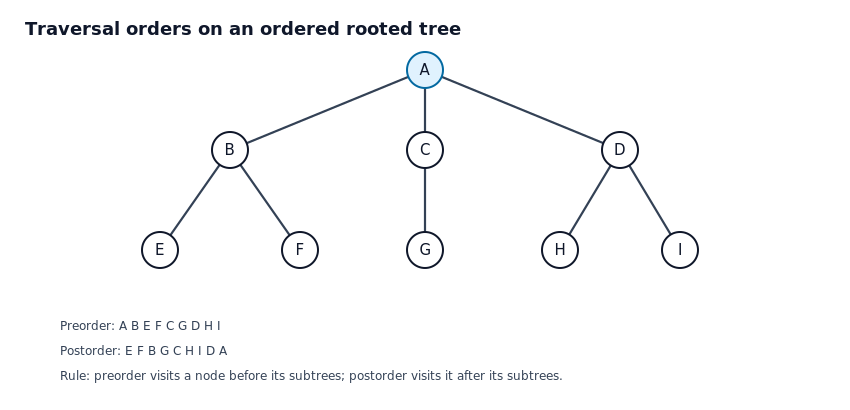
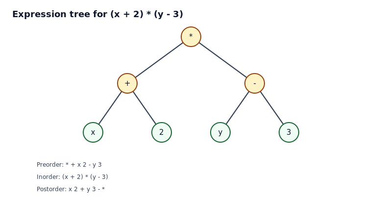
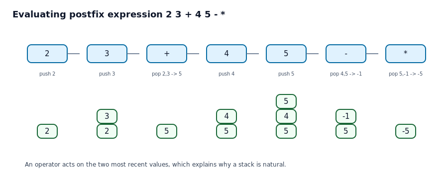
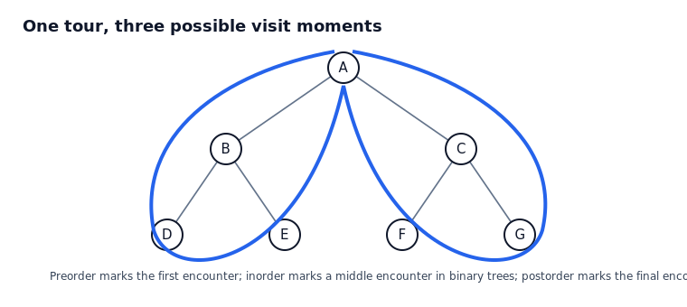

# 11.3 트리 탐방

## 학습 목표

이 절의 목표는 루트 트리의 정점을 일정한 규칙에 따라 방문하는 방법을 이해하는 것이다. 순서가 있는 루트 트리에서는 자식의 왼쪽에서 오른쪽 순서가 의미를 가진다. 이 순서를 바탕으로 전위 탐방, 중위 탐방, 후위 탐방을 정의하고, 수식 트리와 전위/중위/후위 표기법을 연결할 수 있어야 한다.

## 1. 순서 있는 루트 트리와 주소 체계



순서 있는 루트 트리에서는 각 정점의 자식이 첫째, 둘째, 셋째처럼 순서를 가진다. 이때 루트에서 어떤 정점까지 내려가는 자식 번호의 열을 그 정점의 주소로 사용할 수 있다. 예를 들어 주소 $2.1.2$는 루트의 둘째 자식으로 간 뒤, 그 정점의 첫째 자식으로 가고, 다시 그 정점의 둘째 자식으로 간다는 뜻이다.

이 주소 체계는 파일 시스템, 조직도, 목차 번호처럼 계층 구조를 표현할 때 자연스럽다. 주소가 길수록 루트에서 더 멀리 떨어진 정점이다.

### 예제 1. 주소 읽기

#### 문제

그림에서 주소 $2.1.2$가 뜻하는 정점을 말로 설명하라.

#### 풀이

주소의 첫 숫자 2는 루트의 둘째 자식으로 이동하라는 뜻이다. 다음 숫자 1은 그 정점의 첫째 자식으로 이동하라는 뜻이다. 마지막 숫자 2는 다시 그 정점의 둘째 자식으로 이동하라는 뜻이다. 따라서 $2.1.2$는 루트에서 둘째, 첫째, 둘째 방향으로 내려간 정점이다.

#### 왜 주소가 유일한가

트리에서는 루트에서 각 정점으로 가는 단순 경로가 유일하다. 따라서 그 경로에서 몇 번째 자식을 선택했는지 기록하면 정점 하나가 정확히 결정된다.

## 2. 전위 탐방과 후위 탐방



전위 탐방은 정점을 먼저 방문한 뒤 그 정점의 자식 부분트리들을 왼쪽에서 오른쪽으로 방문한다. 후위 탐방은 자식 부분트리들을 먼저 모두 방문한 뒤 마지막에 그 정점을 방문한다.

전위 탐방은 상위 항목을 먼저 보여 주는 목차와 비슷하다. 후위 탐방은 하위 작업을 모두 끝낸 뒤 상위 작업을 처리하는 계산 과정과 비슷하다.

### 전위 탐방 의사코드

```text
preorder(T):
    visit root of T
    for each subtree S from left to right:
        preorder(S)
```

### 후위 탐방 의사코드

```text
postorder(T):
    for each subtree S from left to right:
        postorder(S)
    visit root of T
```

### 예제 2. 전위와 후위 순서 구하기

#### 문제

그림의 트리에서 전위 탐방 순서와 후위 탐방 순서를 구하라.

#### 풀이

전위 탐방은 먼저 루트 $A$를 방문한다. 그 다음 왼쪽 자식 $B$의 부분트리를 방문한다. $B$를 먼저 방문하고, $E$, $F$를 차례로 방문한다. 다음으로 $C$와 그 자식 $G$를 방문한다. 마지막으로 $D$와 그 자식 $H,I$를 방문한다. 따라서 전위 순서는 다음과 같다.

$$
A, B, E, F, C, G, D, H, I
$$

후위 탐방은 각 부분트리를 먼저 끝낸 뒤 부모를 방문한다. $B$의 부분트리에서는 $E,F$를 먼저 방문하고 $B$를 방문한다. $C$의 부분트리에서는 $G$를 먼저 방문하고 $C$를 방문한다. $D$의 부분트리에서는 $H,I$를 먼저 방문하고 $D$를 방문한다. 마지막에 루트 $A$를 방문한다. 따라서 후위 순서는 다음과 같다.

$$
E, F, B, G, C, H, I, D, A
$$

#### 왜 부모의 위치가 달라지는가

전위에서는 부모가 자식보다 먼저 나온다. 그래서 위에서 아래로 구조를 소개할 때 좋다. 후위에서는 부모가 자식보다 나중에 나온다. 그래서 자식들의 결과가 있어야 부모의 결과를 계산할 수 있는 상황에 좋다.

## 3. 중위 탐방과 이진 트리

중위 탐방은 주로 이진 트리에서 사용한다. 왼쪽 부분트리를 먼저 방문하고, 루트를 방문한 뒤, 오른쪽 부분트리를 방문한다. 이 규칙은 수식 트리를 사람이 익숙한 중위 표기식으로 바꿀 때 중요하다.

```text
inorder(T):
    inorder(left subtree)
    visit root
    inorder(right subtree)
```

일반적인 $m$-항 트리에서도 중위 탐방을 확장할 수 있지만, 이산수학의 기본 문맥에서는 이진 트리에서의 중위 탐방을 가장 많이 사용한다.

## 4. 수식 트리와 세 가지 표기법



수식 트리는 연산자를 내부 정점에 놓고 피연산자를 잎에 놓은 트리이다. 같은 수식 트리를 어떤 순서로 탐방하느냐에 따라 전위 표기, 중위 표기, 후위 표기가 나온다.

- 전위 표기: 연산자가 피연산자보다 먼저 나온다.
- 중위 표기: 연산자가 두 피연산자 사이에 나온다.
- 후위 표기: 연산자가 피연산자 뒤에 나온다.

### 예제 3. 수식 트리의 탐방 결과

#### 문제

그림의 수식 트리에 대해 전위, 중위, 후위 표기를 구하라.

#### 풀이

루트는 곱셈 연산자 `*`이다. 왼쪽 부분트리는 `x + 2`이고 오른쪽 부분트리는 `y - 3`이다.

전위 탐방은 루트부터 방문하므로 다음과 같다.

$$
*\ +\ x\ 2\ -\ y\ 3
$$

중위 탐방은 왼쪽, 루트, 오른쪽 순서이므로 다음과 같다.

$$
(x+2)*(y-3)
$$

후위 탐방은 자식들을 먼저 방문하고 루트를 마지막에 방문하므로 다음과 같다.

$$
x\ 2\ +\ y\ 3\ -\ *
$$

#### 왜 괄호가 필요한가

중위 표기에서는 연산자의 우선순위 때문에 원래 트리 구조가 모호해질 수 있다. 수식 트리는 어떤 연산이 먼저 계산되는지 정확히 담고 있다. 그 구조를 중위 표기로 옮길 때 괄호를 넣으면 트리의 구조가 보존된다.

## 5. 후위 표기 계산과 스택



후위 표기식은 괄호 없이도 계산 순서가 정해진다. 왼쪽에서 오른쪽으로 읽으면서 피연산자는 스택에 넣고, 연산자를 만나면 스택에서 최근 두 값을 꺼내 연산한 뒤 결과를 다시 넣는다.

### 예제 4. 후위 표기식 계산하기

#### 문제

후위 표기식 `2 3 + 4 5 - *`의 값을 구하라.

#### 풀이

먼저 2와 3을 스택에 넣는다. `+`를 만나면 2와 3을 꺼내 $2+3=5$를 계산하고 5를 넣는다. 다음으로 4와 5를 넣는다. `-`를 만나면 4와 5를 꺼내 $4-5=-1$을 계산하고 $-1$을 넣는다. 마지막으로 `*`를 만나면 5와 $-1$을 꺼내 $5 \cdot (-1)=-5$를 계산한다.

따라서 값은 $-5$이다.

#### 왜 스택을 쓰는가

후위 표기에서 연산자는 바로 앞에 준비된 두 값을 사용한다. 가장 최근에 등장한 값 두 개가 먼저 쓰이므로 후입선출 구조인 스택이 정확히 맞다. 이 때문에 후위 표기 계산은 컴파일러와 계산기 구현에서 유용하다.

## 6. 오일러 투어 관점



트리의 바깥을 한 바퀴 도는 것처럼 생각하면 전위, 중위, 후위 탐방을 하나의 관점에서 이해할 수 있다. 어떤 정점을 처음 만날 때 기록하면 전위, 왼쪽과 오른쪽 사이에서 기록하면 중위, 마지막으로 떠날 때 기록하면 후위가 된다. 이 관점은 암기보다 구조 이해에 도움이 된다.

## 자기 점검 문제

1. 전위 탐방은 부모와 자식 중 어느 쪽을 먼저 방문하는가.
2. 후위 탐방이 계산 트리에 잘 맞는 이유를 설명하라.
3. 이진 수식 트리에서 중위 탐방이 자연스럽게 주는 표기법은 무엇인가.
4. 후위 표기식 `6 2 / 3 +`의 값을 구하라.
5. 주소 $3.2.1$은 어떤 이동을 뜻하는가.

## 자기 점검 해설

1. 전위 탐방은 부모를 먼저 방문한 뒤 자식 부분트리를 방문한다.
2. 부모 연산을 계산하려면 자식 부분식의 값이 먼저 필요하므로 후위 탐방이 적합하다.
3. 사람이 흔히 쓰는 중위 표기식을 준다.
4. $6/2=3$이고 $3+3=6$이므로 값은 6이다.
5. 루트의 셋째 자식, 그 정점의 둘째 자식, 다시 그 정점의 첫째 자식으로 이동한다.

## 흔한 오해 정리

- 전위, 중위, 후위는 정점의 좌표가 아니라 방문 시점의 규칙이다.
- 중위 탐방은 이진 트리에서 특히 자연스럽다. 자식이 여러 개인 트리에서는 별도 규칙을 정해야 한다.
- 후위 표기식은 읽기 어려워 보이지만 괄호가 없어도 계산 순서가 완전히 정해진다.
- 같은 트리라도 자식의 왼쪽-오른쪽 순서를 바꾸면 탐방 순서가 달라진다.
