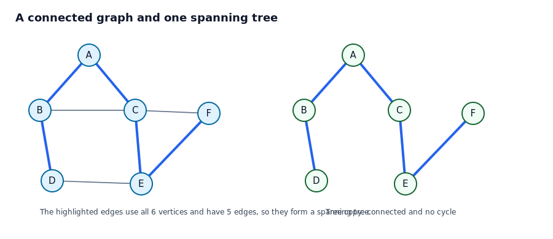
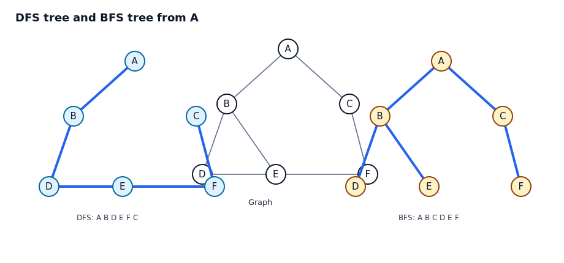
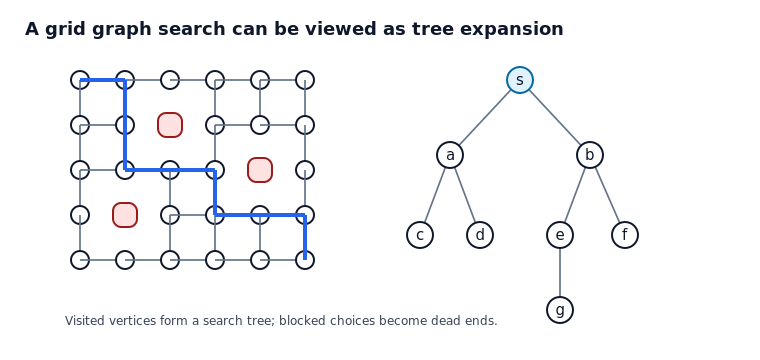
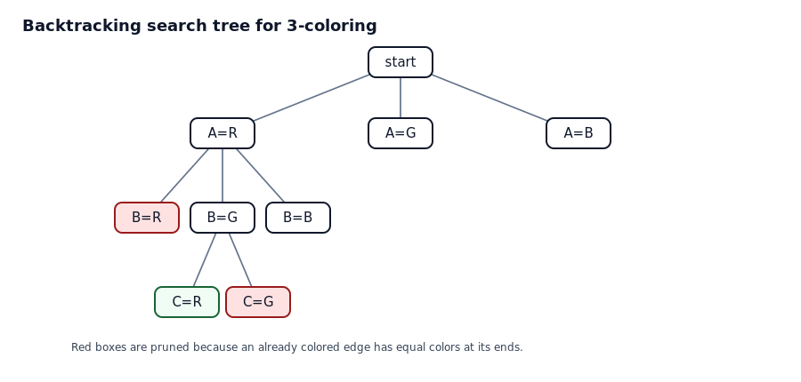
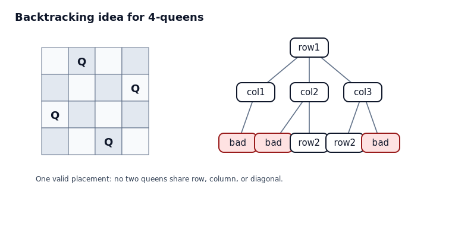

# 11.4 신장 트리

## 학습 목표

이 절의 목표는 연결 그래프에서 모든 정점을 포함하는 트리를 뽑아내는 방법을 이해하는 것이다. 신장 트리는 그래프 전체의 연결성을 유지하면서 불필요한 순환을 제거한 뼈대이다. 깊이 우선 탐색과 너비 우선 탐색을 통해 신장 트리를 만들고, 탐색 트리가 문제 풀이와 백트래킹에 어떻게 쓰이는지 볼 수 있어야 한다.

## 1. 신장 트리의 의미



연결 그래프 $G$의 신장 트리는 $G$의 모든 정점을 포함하고, $G$의 간선 일부만 사용하여 만든 트리이다. 따라서 정점이 $n$개이면 신장 트리는 반드시 간선 $n-1$개를 가진다. 원래 그래프에 순환이 있다면 순환 위의 간선 중 일부를 제거해도 연결성을 유지할 수 있다. 이 과정을 반복하면 결국 신장 트리가 남는다.

### 예제 1. 신장 트리 확인하기

#### 문제

그림에서 파란 간선들이 신장 트리인지 확인하라.

#### 풀이

먼저 모든 정점 $A,B,C,D,E,F$가 파란 간선 중 적어도 하나와 연결되어 있는지 확인한다. 모두 포함되어 있다. 다음으로 파란 간선 수를 센다. 정점이 6개이므로 트리라면 간선이 5개이어야 한다. 파란 간선은 5개이다. 마지막으로 파란 간선들만 보았을 때 한 조각으로 연결되어 있고 순환이 없는지 확인한다. 그림의 오른쪽 복사본은 파란 간선만 남긴 구조이고, 한 조각으로 이어진 트리이다.

따라서 파란 간선들은 원래 그래프의 신장 트리이다.

#### 왜 모든 정점을 포함해야 하는가

신장이라는 말은 원래 그래프의 정점 전체를 덮는다는 뜻이다. 일부 정점만 연결하면 단순히 부분트리일 수는 있지만 신장 트리는 아니다.

## 2. 깊이 우선 탐색

깊이 우선 탐색은 가능한 한 깊이 내려간 뒤 더 이상 갈 곳이 없으면 되돌아오는 방식이다. 탐색 중 처음으로 어떤 정점을 발견하게 만든 간선을 모으면 깊이 우선 신장 트리가 된다.

```text
DFS(v):
    mark v as visited
    for each neighbor w of v in chosen order:
        if w is unvisited:
            add edge (v, w) to the search tree
            DFS(w)
```

깊이 우선 탐색은 미로 탐색처럼 한 경로를 끝까지 파고드는 상황에 잘 맞다. 그러나 방문 순서는 인접 정점을 어떤 순서로 보느냐에 따라 달라질 수 있다.

## 3. 너비 우선 탐색

너비 우선 탐색은 시작 정점에서 거리가 1인 정점들을 먼저 방문하고, 그 다음 거리가 2인 정점들을 방문하는 방식이다. 큐를 사용하면 이 순서를 자연스럽게 구현할 수 있다.

```text
BFS(s):
    mark s as visited
    put s into a queue
    while the queue is not empty:
        remove front vertex v
        for each neighbor w of v in chosen order:
            if w is unvisited:
                mark w as visited
                add edge (v, w) to the search tree
                put w into the queue
```

너비 우선 탐색 트리에서 시작 정점으로부터 각 정점까지의 트리 경로 길이는 원래 그래프에서의 최단 간선 수와 같다.

## 4. DFS와 BFS 비교 예제



### 예제 2. 탐색 순서 구하기

#### 문제

그림의 그래프에서 $A$에서 시작하고, 인접 정점은 알파벳 순서로 확인한다고 하자. DFS 방문 순서와 BFS 방문 순서를 구하라.

#### 풀이

DFS는 한 길을 가능한 깊게 따라간다. $A$에서 $B$로 가고, $B$에서 $D$로 간다. $D$에서 아직 방문하지 않은 $E$로 가고, $E$에서 $F$로 간다. $F$에서 아직 방문하지 않은 $C$로 간다. 따라서 DFS 순서는 다음과 같다.

$$
A, B, D, E, F, C
$$

BFS는 $A$의 이웃을 먼저 모두 방문한다. $A$의 이웃은 $B,C$이므로 먼저 $B,C$를 발견한다. 그 다음 $B$에서 $D,E$를 발견하고, $C$에서 $F$를 발견한다. 따라서 BFS 순서는 다음과 같다.

$$
A, B, C, D, E, F
$$

#### 왜 결과가 다른가

DFS는 현재 선택한 길의 끝을 먼저 본다. BFS는 시작점에서 가까운 정점들을 층별로 본다. 그래서 같은 그래프라도 탐색의 목적에 따라 다른 신장 트리가 만들어진다.

## 5. 탐색 트리와 경로 찾기



그래프 탐색은 지도, 네트워크, 퍼즐, 미로 문제를 해결하는 기본 도구이다. 탐색이 진행될 때 새로 발견된 정점과 그 정점을 발견하게 한 간선을 기록하면 탐색 트리가 만들어진다. 이 탐색 트리를 부모 포인터로 저장하면 시작점에서 목표점까지의 경로를 역추적할 수 있다.

### 예제 3. 부모 포인터로 경로 복원하기

#### 문제

BFS 중 목표 정점 $t$를 발견했다. 각 정점에 자신을 처음 발견하게 한 부모 정점을 저장해 두었다고 하자. 시작 정점 $s$에서 $t$까지의 경로를 어떻게 구하는가.

#### 풀이

$t$에서 시작하여 부모를 계속 따라 올라간다. 그러면 $t$, parent$(t)$, parent(parent$(t))$, ... 와 같은 순서로 정점이 나온다. 결국 시작 정점 $s$에 도착한다. 이 순서는 목표에서 시작점으로 거꾸로 가는 순서이므로, 뒤집으면 $s$에서 $t$까지의 경로가 된다.

#### 왜 BFS 경로가 최단인가

BFS는 시작점에서 거리 1인 정점, 거리 2인 정점, 거리 3인 정점의 순서로 발견한다. 따라서 어떤 정점을 처음 발견한 순간의 경로 길이가 그 정점까지 갈 수 있는 가장 짧은 간선 수이다. 더 짧은 경로가 있었다면 더 앞선 층에서 이미 발견되었어야 한다.

## 6. 백트래킹과 탐색 트리



백트래킹은 가능한 선택을 트리로 펼치되, 이미 조건을 위반한 가지는 더 내려가지 않고 잘라내는 방법이다. 그래프 색칠, 퍼즐, 부분집합 합, 퀸 배치 같은 문제에서 자주 사용된다.

가지치기가 안전한 이유는 이미 위반한 조건이 뒤에서 회복되지 않기 때문이다. 예를 들어 인접한 두 정점이 같은 색으로 칠해졌다면, 나머지 정점을 어떻게 칠해도 그 두 정점 사이의 위반은 사라지지 않는다.

### 예제 4. 그래프 색칠에서 가지치기

#### 문제

삼각형 그래프의 정점 $A,B,C$를 빨강, 초록, 파랑 중 하나로 칠하되 인접한 정점은 서로 다른 색이어야 한다. $A$를 빨강으로 칠한 뒤 $B$도 빨강으로 칠하는 가지를 계속 탐색할 필요가 있는가.

#### 풀이

삼각형에서는 $A$와 $B$가 인접해 있다. 이미 $A$와 $B$가 같은 빨강이 되었으므로 색칠 조건을 위반했다. 이후 $C$에 어떤 색을 칠하더라도 $A$와 $B$ 사이의 위반은 고쳐지지 않는다. 따라서 이 가지는 즉시 잘라낼 수 있다.

#### 왜 이것이 효율적인가

전체 선택을 모두 펼치면 색이 3개이고 정점이 3개이므로 $3^3=27$가지가 가능하다. 하지만 조건을 위반하는 순간 가지를 잘라내면 실제로 확인해야 할 경우가 크게 줄어든다. 백트래킹은 답이 될 수 없는 부분을 일찍 버리는 전략이다.

## 7. 4-퀸 문제의 탐색 트리



4-퀸 문제는 $4 \times 4$ 체스판에 네 개의 퀸을 서로 공격하지 않게 놓는 문제이다. 각 행에 퀸을 하나씩 놓는다고 정하면, 첫째 행의 선택, 둘째 행의 선택, 셋째 행의 선택이 차례로 탐색 트리의 레벨이 된다. 같은 열이나 같은 대각선에 퀸이 놓이는 순간 그 가지를 더 탐색하지 않는다.

이 예시는 트리가 실제 그림으로 주어져 있지 않아도 선택의 구조가 트리임을 보여 준다. 알고리즘을 분석할 때는 가능한 실행 경로를 트리로 상상하는 습관이 중요하다.

## 자기 점검 문제

1. 정점이 12개인 연결 그래프의 신장 트리는 간선을 몇 개 가지는가.
2. 원래 그래프의 간선이 20개이고 정점이 8개인 연결 그래프에서 신장 트리를 얻으려면 적어도 몇 개의 간선을 제거해야 하는가.
3. DFS가 BFS보다 먼저 깊은 정점을 방문하는 이유를 설명하라.
4. BFS가 최단 경로 문제에 유리한 이유를 설명하라.
5. 백트래킹에서 가지치기가 안전하려면 어떤 성질이 필요하다고 볼 수 있는가.

## 자기 점검 해설

1. 신장 트리는 트리이므로 $12-1=11$개이다.
2. 신장 트리는 간선이 $8-1=7$개이므로 $20-7=13$개의 간선을 제거해야 한다.
3. DFS는 한 정점의 이웃 중 아직 방문하지 않은 정점을 발견하면 즉시 그 정점으로 재귀적으로 내려가기 때문이다.
4. BFS는 시작점에서 거리별로 정점을 발견하므로 처음 발견된 경로가 간선 수 기준 최단 경로이다.
5. 이미 위반한 조건이 이후 선택으로 회복될 수 없어야 한다.

## 흔한 오해 정리

- 신장 트리는 원래 그래프의 모든 간선을 포함하지 않는다. 모든 정점을 포함할 뿐이다.
- 연결 그래프에는 항상 신장 트리가 존재한다.
- DFS와 BFS는 둘 다 신장 트리를 만들 수 있지만 보통 서로 다른 트리를 만든다.
- DFS 방문 순서와 BFS 방문 순서는 인접 정점을 나열하는 순서에 영향을 받을 수 있다.
- 백트래킹은 무작정 모든 경우를 보는 방법이 아니다. 조건 위반을 만나면 그 아래를 통째로 버린다.
