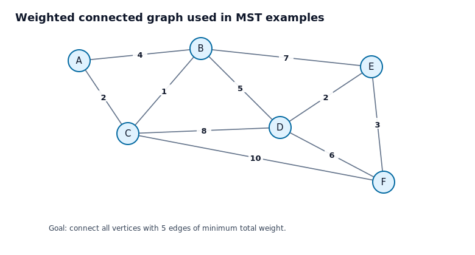
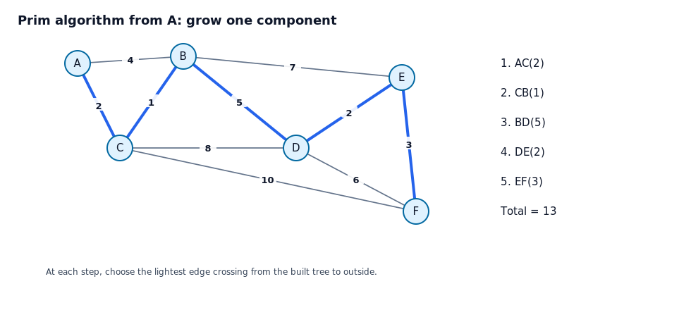
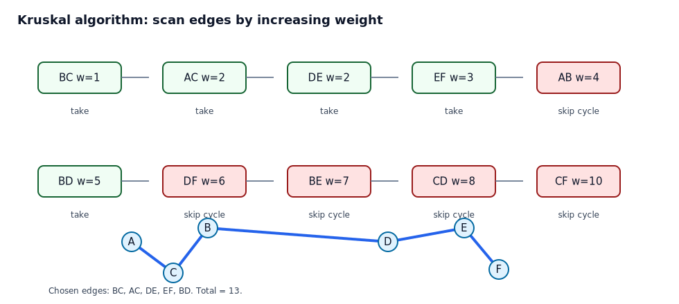
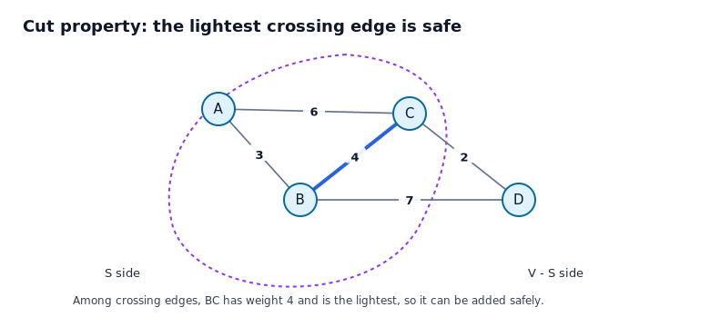
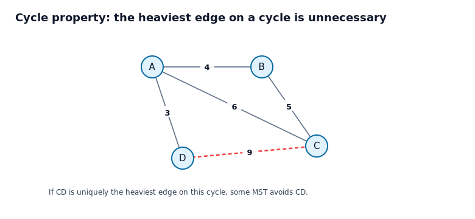

# 11.5 최소 신장 트리

## 학습 목표

이 절의 목표는 가중 연결 그래프에서 모든 정점을 연결하되 전체 가중치 합이 최소가 되는 신장 트리를 찾는 방법을 이해하는 것이다. 프림 알고리즘과 크루스칼 알고리즘은 모두 탐욕 알고리즘이지만, 간선을 선택하는 관점이 다르다. 안전한 간선이라는 개념을 통해 왜 탐욕 선택이 옳은지 설명할 수 있어야 한다.

## 1. 최소 신장 트리의 문제 설정



가중 연결 무방향 그래프에서 신장 트리는 모든 정점을 연결하는 간선 집합 중 순환이 없는 것이다. 신장 트리의 비용은 그 안에 들어 있는 간선 가중치의 합이다. 최소 신장 트리는 가능한 모든 신장 트리 중 비용이 가장 작은 신장 트리이다.

최소 신장 트리는 통신망, 도로망, 배관망처럼 모든 지점을 연결해야 하지만 설치 비용을 줄이고 싶은 상황의 기본 모델이다.

## 2. 프림 알고리즘

프림 알고리즘은 정점 하나에서 시작하여 현재까지 만든 트리와 바깥 정점을 잇는 간선 중 가장 가벼운 간선을 반복해서 추가한다. 매 단계에서 트리는 항상 한 덩어리로 유지된다.

```text
Prim(G, start):
    T = tree with only start
    while T does not contain all vertices:
        choose a minimum-weight edge crossing from T to outside
        add that edge and the new vertex to T
    return T
```

### 예제 1. 프림 알고리즘 수행하기

#### 문제

다음 그래프에서 $A$를 시작 정점으로 하여 프림 알고리즘을 수행하라.



#### 풀이

시작 트리는 정점 $A$ 하나만 가진다.

1. $A$에서 바깥으로 나가는 간선은 $AB(4)$와 $AC(2)$이다. 더 가벼운 $AC(2)$를 선택한다.
2. 현재 트리 정점은 $A,C$이다. 바깥으로 나가는 간선 중 가장 가벼운 것은 $CB(1)$이다. 이를 선택한다.
3. 현재 트리 정점은 $A,B,C$이다. 바깥으로 나가는 간선 중 $BD(5)$가 가장 가볍다. 이를 선택한다.
4. 현재 트리 정점은 $A,B,C,D$이다. 바깥 정점으로 가는 가장 가벼운 간선은 $DE(2)$이다. 이를 선택한다.
5. 마지막으로 바깥 정점 $F$를 연결해야 한다. $EF(3)$이 가장 가벼우므로 이를 선택한다.

선택된 간선은 다음과 같다.

$$
AC,\ CB,\ BD,\ DE,\ EF
$$

총 비용은 다음과 같다.

$$
2+1+5+2+3=13
$$

#### 왜 매번 바깥으로 나가는 간선만 보는가

이미 트리 안에 있는 두 정점을 잇는 간선을 추가하면 순환이 생긴다. 신장 트리는 순환이 없어야 하므로 그런 간선은 선택할 수 없다. 따라서 현재 트리와 아직 포함되지 않은 정점을 잇는 간선만 후보가 된다.

## 3. 크루스칼 알고리즘

크루스칼 알고리즘은 모든 간선을 가중치 오름차순으로 정렬한 뒤, 순환을 만들지 않는 간선만 차례로 선택한다. 처음에는 각 정점이 따로 떨어진 성분이고, 간선을 고를 때마다 성분들이 합쳐진다.

```text
Kruskal(G):
    T = empty set
    sort all edges by nondecreasing weight
    for each edge e in sorted order:
        if adding e does not create a cycle:
            add e to T
    return T
```

### 예제 2. 크루스칼 알고리즘 수행하기

#### 문제

같은 그래프에서 크루스칼 알고리즘으로 최소 신장 트리를 구하라.



#### 풀이

간선을 가중치가 작은 순서로 본다.

| 순서 | 간선 | 가중치 | 판단 |
|---:|---|---:|---|
| 1 | $BC$ | 1 | 선택한다 |
| 2 | $AC$ | 2 | 선택한다 |
| 3 | $DE$ | 2 | 선택한다 |
| 4 | $EF$ | 3 | 선택한다 |
| 5 | $AB$ | 4 | $A,B,C$ 안에서 순환을 만들므로 버린다 |
| 6 | $BD$ | 5 | 두 성분을 연결하므로 선택한다 |

이 시점에 정점 6개를 연결하는 간선 5개가 선택되었으므로 신장 트리가 완성된다. 선택 간선은 다음과 같다.

$$
BC,\ AC,\ DE,\ EF,\ BD
$$

총 비용은 다음과 같다.

$$
1+2+2+3+5=13
$$

#### 왜 $AB$를 버리는가

$BC$와 $AC$가 이미 선택되어 있으면 $A$와 $B$는 이미 $A-C-B$ 경로로 연결되어 있다. 여기에 $AB$를 추가하면 $A-B-C-A$ 순환이 생긴다. 신장 트리는 순환을 가질 수 없으므로 $AB$는 선택하지 않는다.

## 4. 프림과 크루스칼의 차이

| 알고리즘 | 유지하는 구조 | 간선 선택 기준 | 잘 맞는 직관 |
|---|---|---|---|
| 프림 | 항상 하나의 트리 | 현재 트리에서 바깥으로 나가는 가장 가벼운 간선 | 한 도시에서 도로망을 확장한다 |
| 크루스칼 | 여러 성분의 숲 | 전체 간선 중 순환을 만들지 않는 가장 가벼운 간선 | 가장 싼 부품부터 연결한다 |

두 알고리즘은 선택 순서가 다를 수 있지만, 모두 최소 신장 트리를 만든다. 가중치가 같은 간선이 여러 개 있으면 최소 신장 트리가 하나가 아닐 수도 있다.

## 5. 안전한 간선과 컷 성질



정점 집합을 두 부분 $S$와 $V-S$로 나누었을 때, 두 부분을 가로지르는 간선을 컷을 가로지르는 간선이라고 한다. 어떤 컷을 가로지르는 간선 중 가중치가 가장 작은 간선은 최소 신장 트리에 넣어도 안전하다. 이것이 컷 성질이다.

### 예제 3. 컷 성질로 프림 선택 설명하기

#### 문제

프림 알고리즘에서 현재 선택된 정점 집합이 $S$라고 하자. 왜 $S$와 $V-S$를 잇는 가장 가벼운 간선을 선택해도 되는가.

#### 풀이

최소 신장 트리는 모든 정점을 연결해야 하므로 $S$와 $V-S$ 사이를 적어도 하나의 간선으로 연결해야 한다. 그중 가장 가벼운 간선 $e$를 선택한다고 하자. 어떤 최소 신장 트리 $T$가 $e$를 포함하지 않는다고 해도, $T$는 두 부분을 연결하는 다른 간선 $f$를 포함한다. $e$는 가장 가벼운 컷 간선이므로 $w(e) \le w(f)$이다. $T$에서 $f$를 빼고 $e$를 넣으면 연결성은 유지되고 비용은 늘지 않는다. 따라서 $e$를 포함하는 최소 신장 트리가 존재한다.

#### 왜 이것이 탐욕 선택의 근거인가

탐욕 알고리즘은 지금 가장 좋아 보이는 선택을 한다. 그 선택이 미래의 최적해를 망치지 않는다는 보장이 필요하다. 컷 성질은 프림 알고리즘의 현재 선택이 어떤 최소 신장 트리와 양립할 수 있음을 보장한다.

## 6. 순환 성질



어떤 순환에서 가중치가 유일하게 가장 큰 간선은 최소 신장 트리에 포함될 필요가 없다. 그 간선을 포함하면 순환의 다른 간선을 통해 두 끝점이 이미 연결될 수 있으므로, 더 가벼운 간선들로 대체할 수 있기 때문이다.

### 예제 4. 순환 성질로 간선 버리기

#### 문제

그림의 순환에서 간선 $CD$의 가중치가 9이고, 순환의 다른 간선 가중치가 모두 9보다 작다. $CD$를 최소 신장 트리에 반드시 넣어야 하는가.

#### 풀이

넣을 필요가 없다. 만약 어떤 신장 트리가 $CD$를 포함한다고 하자. 순환에서 $CD$를 제외한 나머지 간선들을 따라가면 $C$와 $D$를 연결하는 다른 경로가 있다. 따라서 $CD$ 대신 그 경로 위의 적절한 간선 하나를 사용하면 연결성을 유지하면서 비용을 줄이거나 적어도 늘리지 않을 수 있다. 특히 $CD$가 유일한 최댓값이면 $CD$를 피하는 것이 더 낫다.

#### 왜 크루스칼에서 무거운 순환 간선이 늦게 버려지는가

크루스칼은 가벼운 간선을 먼저 선택한다. 어느 순간 무거운 간선이 이미 같은 성분 안의 두 정점을 잇게 되면, 그 간선은 기존 선택 간선들과 함께 순환을 만든다. 이 경우 그 간선은 선택하지 않는 것이 맞다.

## 7. 최소 신장 트리 풀이 절차 요약

1. 정점 수를 세어 최종 간선 수가 $n-1$개임을 기억한다.
2. 프림을 쓸 때는 현재 트리와 바깥을 잇는 후보 간선만 본다.
3. 크루스칼을 쓸 때는 간선을 오름차순으로 보고, 같은 성분 안을 잇는 간선은 버린다.
4. 선택한 간선 수가 $n-1$개가 되면 멈춘다.
5. 총 비용은 선택한 간선 가중치의 합으로 계산한다.

## 자기 점검 문제

1. 정점이 9개인 그래프의 최소 신장 트리는 간선을 몇 개 가지는가.
2. 프림 알고리즘에서 현재 트리 내부의 두 정점을 잇는 간선을 선택하면 왜 안 되는가.
3. 크루스칼 알고리즘에서 간선을 버리는 유일한 이유는 무엇인가.
4. 최소 신장 트리의 총 비용이 유일하면 최소 신장 트리 자체도 반드시 유일한가.
5. 모든 간선 가중치가 서로 다르면 최소 신장 트리는 유일하다고 볼 수 있는가.

## 자기 점검 해설

1. 신장 트리는 트리이므로 $9-1=8$개이다.
2. 내부 두 정점은 이미 트리 안에서 경로로 연결되어 있으므로 간선을 추가하면 순환이 생긴다.
3. 그 간선을 추가하면 순환이 생기기 때문이다.
4. 반드시 그렇지는 않다. 서로 다른 신장 트리가 같은 최소 비용을 가질 수 있다.
5. 그렇다. 모든 간선 가중치가 서로 다르면 컷과 순환에서 선택의 동률이 사라져 최소 신장 트리가 유일해진다.

## 흔한 오해 정리

- 최소 신장 트리는 최단 경로 트리와 다르다. 전체 연결 비용을 최소화하는 것이지 시작점에서 각 정점까지의 거리 합을 최소화하는 것이 아니다.
- 프림 알고리즘은 시작 정점에 따라 선택 순서가 달라질 수 있다. 그러나 총 결과는 최소 신장 트리이다.
- 크루스칼 알고리즘은 그래프가 한 덩어리로 유지될 필요가 없다. 중간 과정은 숲이다.
- 가중치가 같은 간선이 있으면 알고리즘의 선택이 여러 갈래가 될 수 있다.
- 간선 수가 $n-1$개가 되기 전에 멈추면 모든 정점이 연결되지 않았을 수 있다.
