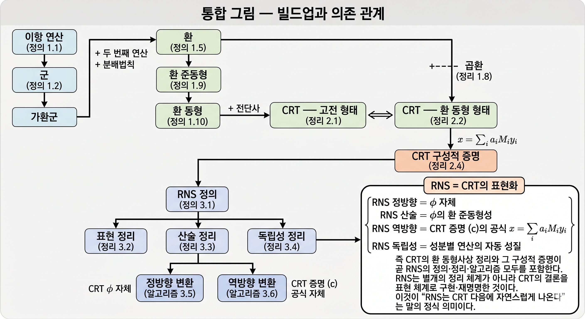

# 군, 환, CRT, 그리고 RNS — 정식 정리

> 본 문서는 다음 순서로 정의 → 정리 → 증명의 형식으로 서술한다.
>
> 1. **이항 연산**(binary operation)
> 2. **군**(group)
> 3. **환**(ring), **곱환**(product ring), **환 준동형**(ring homomorphism), **환 동형**(ring isomorphism)
> 4. **중국인의 나머지 정리**(Chinese Remainder Theorem, CRT) — 정식 진술과 증명
> 5. **잉여수계**(Residue Number System, RNS) — 정식 정의와 정리
>
> 핵심 관찰은 다음이다.
>
> **RNS의 모든 알고리즘은 CRT의 환 동형사상 증명에서 직접 도출된다.** RNS는 CRT의 결론을 표현 체계로 구현한 것이며, CRT의 구성적 증명이 곧 RNS의 정방향/역방향 변환 알고리즘이다.

---

## 1. 사전 — 군과 환

### 1.1 이항 연산

**정의 1.1** ([이항 연산](#)). 집합 $S$ 위의 **이항 연산**(binary operation)이란 함수

```math
* : S \times S \longrightarrow S
```

를 말한다. 즉 임의의 $a, b \in S$에 대해 $a * b \in S$가 정의되어 있어야 한다. 결과가 다시 $S$ 안에 있다는 사실을 **닫힘**(closure)이라 부른다.

### 1.2 군

**정의 1.2** ([군](#)). 집합 $G$와 그 위의 이항 연산 $*$의 쌍 $(G, *)$가 **군**(group)이라는 것은 다음 세 공리가 모두 성립함을 뜻한다.

| 공리 | 내용 |
|---|---|
| (G1) 결합법칙 | $\forall a, b, c \in G,\; (a * b) * c = a * (b * c)$ |
| (G2) 항등원 | $\exists e \in G,\; \forall a \in G,\; e * a = a * e = a$ |
| (G3) 역원 | $\forall a \in G,\; \exists a^{-1} \in G,\; a * a^{-1} = a^{-1} * a = e$ |

추가로 $\forall a, b \in G,\; a * b = b * a$가 성립하면 $(G, *)$를 **가환군**(commutative group) 또는 **아벨군**(abelian group)이라 부른다.

**예시 1.3**. $(\mathbb{Z}, +)$는 가환군이다. 항등원 $0$, $a$의 역원 $-a$.

**예시 1.4**. $(\mathbb{Z}/n\mathbb{Z}, +)$는 가환군이다. 항등원 $[0]$, $[a]$의 역원 $[-a] = [n - a]$.

### 1.3 환

**정의 1.5** ([환](#)). 집합 $R$과 그 위의 두 이항 연산 $+, \cdot$의 쌍 $(R, +, \cdot)$이 **환**(ring)이라는 것은 다음 네 공리가 모두 성립함을 뜻한다.

| 공리 | 내용 |
|---|---|
| (R1) 덧셈 가환군 | $(R, +)$가 가환군 |
| (R2) 곱셈 결합법칙 | $\forall a, b, c \in R,\; (a \cdot b) \cdot c = a \cdot (b \cdot c)$ |
| (R3) 곱셈 항등원 | $\exists 1 \in R,\; \forall a \in R,\; 1 \cdot a = a \cdot 1 = a$ |
| (R4) 분배법칙 | $\forall a, b, c \in R,\; a \cdot (b + c) = a \cdot b + a \cdot c$ 및 $(a + b) \cdot c = a \cdot c + b \cdot c$ |

추가로 $\forall a, b \in R,\; a \cdot b = b \cdot a$가 성립하면 $(R, +, \cdot)$을 **가환환**(commutative ring)이라 부른다.

**예시 1.6**. $(\mathbb{Z}, +, \cdot)$은 가환환이다.

**예시 1.7**. 임의의 양의 정수 $n$에 대해 $(\mathbb{Z}/n\mathbb{Z}, +, \cdot)$은 가환환이다. 여기서 연산은 잉여류 대표자의 정수 연산을 통한 잘 정의된 사상이다.

### 1.4 곱환

**정리 1.8** ([곱환](#)). 두 환 $(R, +_R, \cdot_R)$과 $(S, +_S, \cdot_S)$의 곱집합 $R \times S$에 다음과 같이 성분별 연산을 부여하자.

```math
(r_1, s_1) + (r_2, s_2) := (r_1 +_R r_2,\; s_1 +_S s_2)
```

```math
(r_1, s_1) \cdot (r_2, s_2) := (r_1 \cdot_R r_2,\; s_1 \cdot_S s_2)
```

이때 $(R \times S, +, \cdot)$도 환이며, 단위원은 $(1_R, 1_S)$이고 영원은 $(0_R, 0_S)$이다.

**증명 스케치**. 환의 네 공리 (R1)–(R4)가 모두 성분별로 자동 성립한다. 예를 들어 분배법칙은 다음과 같이 확인된다.

```math
(r_1, s_1) \cdot ((r_2, s_2) + (r_3, s_3)) = (r_1, s_1) \cdot (r_2 + r_3, s_2 + s_3) = (r_1 \cdot (r_2 + r_3), s_1 \cdot (s_2 + s_3))
```

각 성분에서 $R, S$ 각각의 분배법칙을 쓰면 결론. ■

**귀결**. $k$개의 환 $R_1, \ldots, R_k$에 대해 곱환 $R_1 \times \cdots \times R_k$도 환이다.

### 1.5 환 준동형

**정의 1.9** ([환 준동형](#)). 두 환 $(R, +_R, \cdot_R)$과 $(S, +_S, \cdot_S)$ 사이의 사상 $\phi : R \to S$가 **환 준동형**(ring homomorphism)이라는 것은 다음 세 조건을 모두 만족함을 뜻한다.

| 조건 | 내용 |
|---|---|
| (H1) 덧셈 보존 | $\phi(a +_R b) = \phi(a) +_S \phi(b)$ |
| (H2) 곱셈 보존 | $\phi(a \cdot_R b) = \phi(a) \cdot_S \phi(b)$ |
| (H3) 단위원 보존 | $\phi(1_R) = 1_S$ |

### 1.6 환 동형

**정의 1.10** ([환 동형사상](#)). 환 준동형 $\phi : R \to S$가 **전단사**(bijective)이면 $\phi$를 **환 동형사상**(ring isomorphism)이라 부른다. 이때 $R$과 $S$가 **동형**(isomorphic)이라 하고

```math
R \cong S
```

로 표기한다. Lean 4 Mathlib에서는 `≃+*` 기호로 표현한다.

**주석 1.11**. 환 동형 $\phi$가 전단사이므로 역함수 $\phi^{-1} : S \to R$이 존재하며, $\phi^{-1}$ 역시 자동으로 환 준동형이 된다. 따라서 동형 관계 $\cong$는 동치관계이다.

---

## 2. **중국인의 나머지 정리**(CRT) — 진술과 증명

### 2.1 두 가지 형태의 진술

**정리 2.1** ([CRT — 고전 형태](#)). $m_1, m_2, \ldots, m_k$가 둘씩 서로소인 양의 정수이고 $M = m_1 m_2 \cdots m_k$라 하자. 임의의 정수 $a_1, a_2, \ldots, a_k$에 대해 다음 합동방정식 시스템

```math
\begin{aligned}
x &\equiv a_1 \pmod{m_1} \\
x &\equiv a_2 \pmod{m_2} \\
&\vdots \\
x &\equiv a_k \pmod{m_k}
\end{aligned}
```


은 $M$을 법으로 하여 **유일한 해**를 가진다.


**정리 2.2** ([CRT — 환 동형 형태](#)). 위와 같은 조건에서 다음 사상


```math
\phi : \mathbb{Z}/M\mathbb{Z} \longrightarrow \mathbb{Z}/m_1\mathbb{Z} \times \mathbb{Z}/m_2\mathbb{Z} \times \cdots \times \mathbb{Z}/m_k\mathbb{Z}
```


```math
\phi([x]_M) := ([x]_{m_1},\; [x]_{m_2},\; \ldots,\; [x]_{m_k})
```


는 환 동형사상이다. 즉

```math
\mathbb{Z}/M\mathbb{Z} \;\cong\; \mathbb{Z}/m_1\mathbb{Z} \times \mathbb{Z}/m_2\mathbb{Z} \times \cdots \times \mathbb{Z}/m_k\mathbb{Z}
```

이 성립한다.


### 2.2 두 형태의 동치성

**명제 2.3**. 정리 2.1과 정리 2.2는 논리적으로 동치이다.

**증명**.

(2.2 → 2.1) $\phi$가 전사이므로 임의의 튜플 $([a_1], [a_2], \ldots, [a_k])$에 대해    

$$\phi([x]_M) = ([a_1], \ldots, [a_k])$$ 

를 만족하는 $[x]_M$이 존재한다. 이는 $$x \equiv a_i \pmod{m_i}$$를 모든 $i$에 대해 만족함을 의미하므로 **존재성** 확보.    

또한 $\phi$가 단사이므로 그러한 $[x]_M$은 유일, 즉 $M$을 법으로 해가 유일. **유일성** 확보.

(2.1 → 2.2) 정리 2.6의 (1), (2)에서 $\phi$의 잘 정의됨과 환 준동형성을 보인다.   

 (3) 단사성은 정리 2.1의 유일성으로부터,   
 
 (4) 전사성은 정리 2.1의 존재성으로부터 따라온다. ■
 

### 2.3 구성적 증명

**정리 2.4** ([CRT 구성적 증명](#)).

$m_1, \ldots, m_k$를 둘씩 서로소인 양의 정수, $M = \prod_{i=1}^k m_i$라 하자. 각 $i$에 대해

```math
M_i := M / m_i = \prod_{j \neq i} m_j
```

라 정의한다. 그러면 다음이 성립한다.

**(a)** 각 $i$에 대해 $\gcd(M_i, m_i) = 1$.

**(b)** 따라서 확장 유클리드 호제법(Extended Euclidean Algorithm)에 의해 다음을 만족하는 정수 $y_i$가 존재한다.

```math
M_i \cdot y_i \equiv 1 \pmod{m_i}
```

**(c)** 임의의 정수 튜플 $(a_1, a_2, \ldots, a_k)$에 대해

```math
x := \sum_{i=1}^k a_i \cdot M_i \cdot y_i
```

는 합동방정식 시스템

```math
x \equiv a_i \pmod{m_i}, \quad i = 1, 2, \ldots, k
```

의 해이며, $M$을 법으로 유일하다.

**증명**.

**(a)** $j \neq i$이면 $\gcd(m_j, m_i) = 1$ (가정). $M_i$는 그러한 $m_j$들의 곱이므로 $\gcd(M_i, m_i) = 1$.

**(b)** (a)와 베주 항등식(또는 확장 유클리드 호제법)에 의해 $M_i u + m_i v = 1$인 정수 $u, v$가 존재. $y_i := u$로 놓으면 $M_i y_i \equiv 1 \pmod{m_i}$.

**(c)** 임의의 $i$를 고정하자. 위 정의의 $x$에 대해

```math
x = \sum_{j=1}^k a_j M_j y_j
```

각 $j \neq i$에 대해, $m_i \mid M_j$ (왜냐하면 $M_j$의 정의에 $m_i$가 포함되어 있음). 따라서

```math
a_j M_j y_j \equiv 0 \pmod{m_i}, \quad j \neq i
```

한편 $j = i$에 대해서는 (b)에 의해

```math
a_i M_i y_i \equiv a_i \cdot 1 = a_i \pmod{m_i}
```

따라서

```math
x \equiv a_i \pmod{m_i}
```

이 모든 $i$에 대해 성립. **존재성** 증명 완료.

**유일성**.

**먼저 구체 수치로 무엇이 일어나는지 보자.** 손자 법 집합 $m_1 = 3, m_2 = 5, m_3 = 7$, $M = 105$에서 다음 시스템을 생각하자.

```math
x \equiv 2 \pmod 3, \quad x \equiv 3 \pmod 5, \quad x \equiv 2 \pmod 7
```

이 시스템의 해 한 후보는 $x_1 = 23$이다. 다른 후보가 있을까?   

$x_2 = 128 = 23 + 105$도 같은 합동식을 만족한다 (직접 확인 가능).   그러면 두 해는 정말 "다른" 해인가, 

아니면 mod 105에서 같은 해인가?

두 해의 차이를 보자. $x_2 - x_1 = 105$.

- $128 \bmod 3 = 23 \bmod 3 = 2$ → $3 \mid (128 - 23) = 105$ ✓

- $128 \bmod 5 = 23 \bmod 5 = 3$ → $5 \mid 105$ ✓

- $128 \bmod 7 = 23 \bmod 7 = 2$ → $7 \mid 105$ ✓

$3, 5, 7$이 모두 $105$를 나눈다. 그렇다면 그 곱 $3 \cdot 5 \cdot 7 = 105$도 $105$를 나누는가?   

그렇다 ($105 = 105 \cdot 1$).  

따라서 $x_2 \equiv x_1 \pmod{105}$.   

즉 "두 해처럼 보였던 것이 실은 mod 105에서 같은 해."

이 직관을 일반화하려면 "여러 서로소 수가 모두 어떤 수를 나누면 그 곱도 그 수를 나눈다"는 사실(보조정리 2.5)이 필요하다.

**일반 증명**. $x_1, x_2$가 모두 해라 하면 모든 $i$에 대해 $m_i \mid (x_1 - x_2)$.   

$m_i$들이 둘씩 서로소이므로, 보조정리 2.5에 의해 $M = \prod m_i$도 $(x_1 - x_2)$를 나눈다.    

따라서 $x_1 \equiv x_2 \pmod{M}$. ■

**보조정리 2.5** ([서로소 곱의 정리](#)). $m_1, \ldots, m_k$가 둘씩 서로소이고 모두 정수 $n$을 나누면 $\prod m_i$도 $n$을 나눈다.

**구체 예로 직관 잡기**. $m_1 = 3$, $m_2 = 5$, $n = 105$.

- $3 \mid 105$ → $105 = 3 \cdot 35$로 쓸 수 있다.
  
- $5 \mid 105$ → 즉 $5 \mid 3 \cdot 35$.
  
- 그런데 $5$는 $3$의 배수가 아니다 (서로소).
  
- 따라서 $5$가 $3 \cdot 35$를 나누려면 반드시 $35$를 나눠야 한다.
 
- 실제로 $35 = 5 \cdot 7$. 따라서 $105 = 3 \cdot 5 \cdot 7$. 결국 $15 = 3 \cdot 5$가 $105$를 나눈다 ✓.

핵심 논리는 "서로소 수가 곱을 나누면 그 곱의 한 인수를 나눠야 한다"는 것이다.

**일반 증명**. $k$에 대한 귀납. $k = 1$은 자명. $k = 2$의 경우, $m_1 \mid n$이므로 $n = m_1 t$로 쓸 수 있다.   

$m_2 \mid n = m_1 t$, 그리고 $\gcd(m_1, m_2) = 1$이므로 $m_2 \mid t$.  

따라서 $t = m_2 s$, $n = m_1 m_2 s$, 즉 $m_1 m_2 \mid n$. 일반 $k$는 귀납으로. ■


### 2.4 환 동형 진술의 증명

**정리 2.6** (정리 2.2의 증명). 정리 2.2의 사상 $\phi$는 환 동형사상이다.

**증명**. 네 단계로 보인다. 각 단계마다 손자 법 집합 $m_1 = 3, m_2 = 5, m_3 = 7$, $M = 105$로 구체 예시를 보이고, 그 단계가 RNS의 어느 의문/정리에 대응하는지도 명시한다.

---

**(1) 잘 정의됨** (대표자에 무관)

**무엇을 보일 것인가**. $\phi$의 입력은 잉여류 $[x]_M$이다. 같은 잉여류라도 대표자 $x$를 다르게 고르면 출력이 달라질 수 있다면 $\phi$는 잘 정의된 함수가 아니다.

**구체 예**. $[23]_{105}$의 대표자로 $23$과 $128$ ($= 23 + 105$)을 모두 쓸 수 있다.

- $\phi([23]) = (23 \bmod 3,\; 23 \bmod 5,\; 23 \bmod 7) = (2, 3, 2)$

- $\phi([128])$의 경우,
     $128 = 42 \cdot 3 + 2$
  
     $128 = 25 \cdot 5 + 3$,
  
     $128 = 18 \cdot 7 + 2$.
  
   따라서 $\phi([128]) = (2, 3, 2)$

같다. **대표자를 다르게 잡아도 $\phi$의 출력은 같다.** $\phi$는 잘 정의된다.

**일반 증명**   
 $[x]_M = [y]_M$ 이면 $M\mid (x - y)$.  

각 $i$에 대해 $m_i \mid M$ 이므로 $m_i \mid (x - y)$,  
즉  $[x]_{m_i} = [y] {m_i}$.   
따라서 $\phi([x]_M) = \phi([y]_M)$

**RNS와의 연결**. (1)이 보장하는 것은 RNS 정방향 변환의 안정성이다. mod $M$에서 같은 정수는 같은 RNS 표현을 가진다. 그래서 RNS는 $\{0, 1, \ldots, M-1\}$ 범위만 다루면 충분하다 — 다른 범위의 정수도 mod $M$로 줄이면 같은 RNS 표현이기 때문.

---

**(2) 환 준동형** (덧셈·곱셈·단위원 보존)

**구체 예**. $x = 23$, $y = 47$.

**H1 (덧셈 보존)**:
- 좌변: $\phi([23] + [47]) = \phi([70]) = (70 \bmod 3,\; 70 \bmod 5,\; 70 \bmod 7) = (1, 0, 0)$
- 우변: $\phi([23]) + \phi([47]) = (2, 3, 2) + (2, 2, 5) = ((2+2) \bmod 3,\; (3+2) \bmod 5,\; (2+5) \bmod 7) = (1, 0, 0)$
- 일치 ✓

**H2 (곱셈 보존)**:
- 좌변: $\phi([23] \cdot [47]) = \phi([23 \cdot 47 \bmod 105]) = \phi([31]) = (1, 1, 3)$ ($23 \cdot 47 = 1081 = 10 \cdot 105 + 31$)
- 우변: $\phi([23]) \cdot \phi([47]) = (2 \cdot 2 \bmod 3,\; 3 \cdot 2 \bmod 5,\; 2 \cdot 5 \bmod 7) = (1, 1, 3)$
- 일치 ✓

**H3 (단위원)**: $\phi([1]) = (1 \bmod 3,\; 1 \bmod 5,\; 1 \bmod 7) = (1, 1, 1)$ = 곱환의 단위원 ✓

**일반 증명**.

- (H1) 덧셈: $\phi([x] + [y]) = \phi([x + y]) = ([x+y]_{m_1}, \ldots) = ([x]_{m_1} + [y]_{m_1}, \ldots) = \phi([x]) + \phi([y])$.
- (H2) 곱셈: 동일한 방식으로 $\phi([x] \cdot [y]) = \phi([x]) \cdot \phi([y])$.
- (H3) 단위원: $\phi([1]_M) = ([1]_{m_1}, \ldots, [1]_{m_k}) = 1_{R_1 \times \cdots \times R_k}$.

**RNS와의 연결**. (2)가 RNS 산술 정리(정리 3.3)의 본질이다. **자리별 덧셈/곱셈의 결과 튜플이 진짜 덧셈/곱셈의 RNS 표현과 같다는 사실**이 (H1), (H2)이다. 단, (2)는 CRT가 새로 보장해 주는 것이 아니라 mod 산술의 자동 성질이다. CRT의 진짜 기여는 (3), (4)에 있다.

---

**(3) 단사** (다른 잉여류는 다른 튜플로 간다)

**무엇을 보일 것인가**. $\phi([x]) = \phi([y])$이면 $[x]_M = [y]_M$. 즉 같은 튜플로 가는 두 잉여류는 같다.

**구체 예**. 두 잉여류 $[x], [y]$가 모두 튜플 $(2, 3, 2)$로 간다고 가정하자.

- $x \bmod 3 = 2 = y \bmod 3$ → $3 \mid (x - y)$
- $x \bmod 5 = 3 = y \bmod 5$ → $5 \mid (x - y)$
- $x \bmod 7 = 2 = y \bmod 7$ → $7 \mid (x - y)$

$3, 5, 7$이 모두 $(x - y)$를 나눈다. 서로소이므로 보조정리 2.5에 의해 $105 \mid (x - y)$. 즉 $[x]_{105} = [y]_{105}$.

**$23$ 외에 다른 잉여류는 결코 튜플 $(2, 3, 2)$로 가지 않는다.** 라벨 충돌 불가능.

**일반 증명**. $\phi([x]_M) = \phi([y]_M)$이면 모든 $i$에 대해 $[x]_{m_i} = [y]_{m_i}$, 즉 $m_i \mid (x - y)$. 보조정리 2.5에 의해 $M \mid (x - y)$, 즉 $[x]_M = [y]_M$.

**RNS와의 연결**. (3)이 정확히 RNS 의문 (가)에 대한 답이다. "다른 정수가 같은 RNS 튜플을 가질 수 있는가?" 답: **절대 없다.** $m_i$들이 서로소이기 때문. 이것이 RNS 표현 정리(정리 3.2)의 **단사성** 부분이다.

---

**(4) 전사** (모든 튜플이 어떤 잉여류의 상이다)

**무엇을 보일 것인가**. 임의의 튜플 $(a_1, \ldots, a_k)$에 대해 $\phi([x]) = (a_1, \ldots, a_k)$인 $[x]$가 존재.

**구체 예**. 튜플 $(2, 3, 2)$가 주어졌다. 이게 어느 잉여류의 상인가? 정리 2.4 (c)의 공식을 쓰자.

- 전처리: $M_1 = 35, M_2 = 21, M_3 = 15$; $y_1 = 2, y_2 = 1, y_3 = 1$.
- $x = 2 \cdot 35 \cdot 2 + 3 \cdot 21 \cdot 1 + 2 \cdot 15 \cdot 1 = 140 + 63 + 30 = 233 \equiv 23 \pmod{105}$.

검증: $\phi([23]) = (2, 3, 2)$ ✓. **튜플 $(2, 3, 2)$는 $[23]$에서 왔다.**

같은 공식을 임의의 튜플에 적용할 수 있다. 즉 정리 2.4 (c)의 공식은 **"모든 튜플이 어떤 잉여류의 상"임을 단순히 주장하는 것이 아니라, 그 잉여류를 명시적으로 찾는 알고리즘**이다.

**일반 증명**. 임의의 튜플 $([a_1], [a_2], \ldots, [a_k])$가 주어지면, 정리 2.4 (c)에 의해 $x = \sum_i a_i M_i y_i$가 $x \equiv a_i \pmod{m_i}$를 만족. 따라서 $\phi([x]_M) = ([a_1], [a_2], \ldots, [a_k])$.

**RNS와의 연결**. (4)가 정확히 RNS 의문 (나)에 대한 답이다. "모든 튜플이 어떤 정수의 표현인가?" 답: **예, 그리고 그 정수를 찾는 명시 공식이 있다.** 이 공식이 그대로 **RNS 역방향 변환 알고리즘(알고리즘 3.6)**이다.

---

(1)–(4)에 의해 $\phi$는 환 동형사상. ■

**정리 — 네 단계가 RNS의 어디에 대응되는가**.

| 단계 | 내용 | RNS의 대응 부분 |
|---|---|---|
| (1) 잘 정의됨 | 대표자에 무관 | 정방향 변환의 안정성 |
| (2) 환 준동형 | 자리별 산술이 진짜 산술과 일치 | 산술 정리 (정리 3.3) |
| (3) 단사 | 다른 정수는 다른 튜플로 | 의문 (가)의 답, 표현 정리의 단사성 |
| (4) 전사 | 모든 튜플이 어떤 정수의 표현 | 의문 (나)의 답, 역방향 변환 알고리즘 |

---

## 3. **잉여수계**(RNS) — 정식 정의와 정리

### 3.1 RNS의 정의

**정의 3.1** ([잉여수계, RNS](#)).

다음 세 요소가 갖춰진 표현 체계를 **잉여수계**(Residue Number System, RNS)라 부른다.

| 요소 | 정의 |
|---|---|
| **법 집합**(moduli set, 기저 basis) | 둘씩 서로소인 양의 정수의 유한 집합 $\mathcal{B} = \{m_1, m_2, \ldots, m_k\}$ |
| **동적 범위**(dynamic range) | $M := m_1 m_2 \cdots m_k$ |
| **RNS 표현**(RNS representation) | 각 $x \in \{0, 1, \ldots, M-1\}$에 대해 튜플 $\mathrm{RNS}_{\mathcal{B}}(x) := (x_1, x_2, \ldots, x_k)$를 대응시키되, $x_i := x \bmod m_i$ |

이 표현 체계를 $\mathcal{B}$에 대한 RNS라 하고, 튜플 $(x_1, \ldots, x_k)$를 $x$의 RNS 표현이라 한다.

### 3.1.5 RNS 정의에서 자연스럽게 떠오르는 두 의문 — CRT가 등장하는 자리

정의 3.1에서 각 정수 $x \in \{0, 1, \ldots, M-1\}$에 튜플 $\mathrm{RNS}_{\mathcal{B}}(x) = (x_1, \ldots, x_k)$를 대응시켰다. 정의 자체는 어렵지 않다. 단순히 각 $m_i$로 나눈 나머지를 모은 것이다.

그러나 정의만으로는 이 표현이 **쓸 만한 표현**인지 알 수 없다. 다음 두 의문이 자연스럽게 떠오른다.

---

**의문 (가)**. 두 다른 정수 $x \neq y$ (둘 다 $\{0, 1, \ldots, M-1\}$에 속함)가 **같은 튜플**을 가질 수 있는가?

**구체 시나리오로 무엇이 문제인지 보자.** 누군가 책상 위에 종이쪽지를 놓고 갔다. 거기엔 $(2, 3, 2)$라고 적혀 있다. "이게 어느 사물함의 라벨이지?" 묻는다.

만약 사물함 23번과 87번이 둘 다 라벨 $(2, 3, 2)$을 가진다면, 우리는 답할 수 없다. **라벨이 사물함 식별자 역할을 못 한다.** RNS는 정수의 대용물이 될 자격을 잃는다.

**서로소이면 이 일은 일어나지 않는다.** 손자 법 집합 $\{3, 5, 7\}$로 확인해 보자. 0~104 사이의 105개 정수가 각각 어떤 튜플로 가는지 보자. 가능한 튜플 수는 $3 \cdot 5 \cdot 7 = 105$개. 정수도 105개. **수가 같다.** 그리고 다음에 (3) 단사 증명에서 보겠지만, 다른 정수는 다른 튜플로 간다. 즉 정확한 1:1 대응.

**서로소가 깨지면 어떤 일이 일어나는가 — 작은 반례**. $m_1 = 4$, $m_2 = 6$이라 하자. $\gcd(4, 6) = 2 \neq 1$이라서 서로소가 아니다. $M = 24$. 0~23의 정수 24개, 가능한 튜플 수 $4 \cdot 6 = 24$. 수는 여전히 같다. 그런데 일대일 대응이 깨진다.

| 정수 | mod 4 | mod 6 | 튜플 |
|---|---|---|---|
| $2$ | $2$ | $2$ | $(2, 2)$ |
| $14$ | $2$ | $2$ | $(2, 2)$ |
| $8$ | $0$ | $2$ | $(0, 2)$ |
| $20$ | $0$ | $2$ | $(0, 2)$ |

두 개의 다른 정수가 같은 튜플로 가는 일이 발생한다. **라벨 충돌 발생.** $\gcd \neq 1$인 순간 RNS가 무너진다.

따라서 의문 (가)의 답이 "다른 정수가 같은 튜플을 가지지 않는다"가 되어야 하는데, **이게 서로소 조건이 결정적으로 필요한 자리**이다.

---

**의문 (나)**. 임의의 튜플 $(a_1, a_2, \ldots, a_k) \in \prod_i \mathbb{Z}/m_i\mathbb{Z}$에 대해, 그 튜플을 자신의 RNS 표현으로 가지는 정수 $x \in \{0, 1, \ldots, M-1\}$가 **반드시 존재**하는가?

**구체 시나리오**. RNS 덧셈으로 계산한 결과 튜플 $(1, 0, 0)$을 얻었다 하자 (예시: $\mathrm{RNS}(23) + \mathrm{RNS}(47)$의 자리별 합). 이 결과 튜플이 어느 정수의 RNS 표현인가? 만약 어느 정수의 RNS 표현도 아니라면, 우리의 RNS 덧셈은 **"헛튜플"** 을 만든 셈이다. 답을 정수로 해독할 길이 없다.

**서로소이면 이 일은 일어나지 않는다.** 손자 법 집합에서 $(1, 0, 0)$이 어느 정수의 RNS 표현인가? CRT 공식으로 풀면 $x = 1 \cdot 35 \cdot 2 + 0 + 0 = 70$. 검증: $70 \bmod 3 = 1, 70 \bmod 5 = 0, 70 \bmod 7 = 0$ ✓. **모든 튜플이 어떤 정수에서 온다.**

**서로소가 깨지면 어떤 일이 일어나는가 — 같은 반례 계속**. $m_1 = 4, m_2 = 6$일 때 위 표를 보면 정수 24개가 튜플 24개에 모두 가지 않고 일부 튜플로 중복해서 간다. 그러면 다른 일부 튜플은 어느 정수에서도 안 온다. 

예: 튜플 $(0, 1)$은 어느 정수의 RNS 표현인가? $x \equiv 0 \pmod 4$이고 $x \equiv 1 \pmod 6$인 $x$가 존재하는가? $x = 4k$이고 $4k \equiv 1 \pmod 6$. 그러면 $4k - 1 = 6m$, 즉 $4k = 6m + 1$. 좌변은 짝수, 우변은 홀수. **불가능.** 

즉 튜플 $(0, 1)$은 어떤 정수의 RNS 표현도 아니다. **헛튜플 발생.** 만약 RNS 산술의 결과가 $(0, 1)$로 떨어진다면 정수로 해독할 길이 영영 없다.

따라서 의문 (나)의 답이 "모든 튜플이 어느 정수의 표현이다"가 되어야 하는데, **이 역시 서로소 조건에서만 성립한다.**

---

**두 의문을 종합하면**.

| 의문 | 필요한 답 | 답이 보장됨 |
|---|---|---|
| (가) 다른 정수가 같은 튜플을 가질 수 있나 | 아니다 (**단사성**) | 서로소 + 보조정리 2.5 |
| (나) 모든 튜플이 어느 정수의 표현인가 | 예 (**전사성**) | 서로소 + 정리 2.4 (c) 공식 |

두 답이 합쳐서 **전단사**(bijection), 정수와 튜플 사이의 완벽한 일대일 대응이다.

그런데 위의 두 답을 가만히 보면 다음과 같이 옮겨 적을 수 있다.

- **단사성** = 두 정수가 모든 $m_i$로 나눈 나머지가 같으면 두 정수는 ($M$을 법으로) 같다 = 합동방정식 시스템의 **유일성**.
- **전사성** = 임의의 나머지 튜플 $(a_1, \ldots, a_k)$에 대해 $x \equiv a_i \pmod{m_i}$인 $x$가 존재한다 = 합동방정식 시스템의 **존재성**.

**합동방정식 시스템의 존재와 유일성** — 이것이 정확히 정리 2.1 (CRT — 고전 형태)의 진술이다.

따라서 두 의문에 대한 긍정적 답은 **정확히 CRT가 보장해 주는 사실**이다. 정의 3.1을 마주한 순간 자연스럽게 떠오르는 의문에 CRT가 그대로 답을 준다.

이 관계를 정리한 것이 다음 정리 3.2 (RNS 표현 정리)이다. **정리 3.2는 새로운 사실이 아니라 CRT (정리 2.1 / 정리 2.2)를 RNS 언어로 옮긴 표현**이다.

### 3.2 RNS 표현 정리 (CRT의 환 동형 형태의 직접 응용)

**정리 3.2** ([RNS 표현 정리](#)).

법 집합 $\mathcal{B} = \{m_1, \ldots, m_k\}$의 RNS에 대해 다음이 성립한다.

대응 $\mathrm{RNS}_{\mathcal{B}}$는 집합

```math
\{0, 1, \ldots, M-1\}
```

과

```math
\mathbb{Z}/m_1\mathbb{Z} \times \mathbb{Z}/m_2\mathbb{Z} \times \cdots \times \mathbb{Z}/m_k\mathbb{Z}
```

사이의 **일대일대응**(bijection)이다. 즉 모든 $x \in \{0, 1, \ldots, M-1\}$에 대해 RNS 표현이 유일하게 결정되고, 역으로 모든 튜플 $(a_1, \ldots, a_k) \in \prod_i \mathbb{Z}/m_i\mathbb{Z}$에 대해 유일한 $x \in \{0, 1, \ldots, M-1\}$가 존재하여 $\mathrm{RNS}_{\mathcal{B}}(x) = ([a_1], \ldots, [a_k])$.

**증명**. $\{0, 1, \ldots, M-1\}$이 $\mathbb{Z}/M\mathbb{Z}$의 표준적 대표자 집합이므로, $\mathrm{RNS}_{\mathcal{B}}$는 본질적으로 정리 2.2의 환 동형사상 $\phi$와 동일하다. $\phi$가 전단사이므로 끝. ■

### 3.2.5 두 번째 자연스러운 의문 — 라벨끼리의 산술이 진짜 산술과 맞는가

정리 3.2로 알게 된 것: 정수와 RNS 튜플은 완벽히 일대일 대응한다. 그렇다면 다음 의문이 떠오른다.

**의문 (다)**. 두 정수 $x, y$의 RNS 표현 $\mathrm{RNS}_{\mathcal{B}}(x), \mathrm{RNS}_{\mathcal{B}}(y)$만 알고 있을 때, 그것만 가지고 $(x + y) \bmod M$과 $(x \cdot y) \bmod M$의 RNS 표현을 알아낼 수 있는가? 만약 가능하다면, **$x, y$를 직접 다루지 않고 RNS 표현 위에서 모든 산술을 끝낼 수 있다.** 이게 RNS의 실용 가치가 있는 진짜 이유이다.

가장 단순한 추측: 튜플끼리 자리별로 더하고 곱하면 되지 않을까? 즉

```math
(x_1, \ldots, x_k) + (y_1, \ldots, y_k) \stackrel{?}{=} ((x_1+y_1) \bmod m_1,\; \ldots,\; (x_k+y_k) \bmod m_k)
```

이 추측이 $\mathrm{RNS}_{\mathcal{B}}((x+y) \bmod M)$과 같은가?

답은 "그렇다"이다. 그리고 그 이유는 **CRT가 새로 보장해 주는 것이 아니라** 나머지 산술의 기본 성질에서 자동으로 나온다. 즉

```math
(x + y) \bmod m_i = ((x \bmod m_i) + (y \bmod m_i)) \bmod m_i
```

이건 누구나 아는 mod 산술의 기본 규칙이고, $m_i$들이 서로소이든 아니든 항상 성립한다.

따라서 **정리 3.3의 형태 자체는 CRT 없이도 성립한다.** 그러면 CRT는 산술과는 무관한가? 그렇지 않다. CRT의 역할은 다음에 있다.

> 자리별 산술의 **결과 튜플이 다시 유일한 정수로 해독된다**는 사실은 정리 3.2 (즉 CRT)에서 온다.

만약 CRT가 보장되지 않으면, 자리별로 계산은 할 수 있어도 그 결과 튜플이 어느 정수의 표현인지 알 수 없다. 그러면 RNS 산술의 결과를 정수로 해석할 길이 없다. **CRT가 RNS 산술을 "실제로 의미 있게" 만들어 주는 것이다.**

정리 3.3은 이 자리별 산술의 성립을 정식 진술로 적어 둔 것이다.

### 3.3 RNS 산술 정리 (CRT의 환 준동형 성질의 직접 응용)

**정리 3.3** ([RNS 산술 정리](#)).

$x, y \in \{0, 1, \ldots, M-1\}$이고 그 RNS 표현이 각각 $\mathrm{RNS}_{\mathcal{B}}(x) = (x_1, \ldots, x_k)$, $\mathrm{RNS}_{\mathcal{B}}(y) = (y_1, \ldots, y_k)$라 하자. 그러면 다음이 성립한다.

**(A) 덧셈**:

```math
\mathrm{RNS}_{\mathcal{B}}((x + y) \bmod M) = ((x_1 + y_1) \bmod m_1,\; (x_2 + y_2) \bmod m_2,\; \ldots,\; (x_k + y_k) \bmod m_k)
```

**(B) 곱셈**:

```math
\mathrm{RNS}_{\mathcal{B}}((x \cdot y) \bmod M) = ((x_1 \cdot y_1) \bmod m_1,\; (x_2 \cdot y_2) \bmod m_2,\; \ldots,\; (x_k \cdot y_k) \bmod m_k)
```

**증명**. 정리 2.6 (2) (H1), (H2)에 의해 $\phi$는 덧셈과 곱셈을 보존한다. 즉

```math
\phi([x] + [y]) = \phi([x]) + \phi([y]), \qquad \phi([x] \cdot [y]) = \phi([x]) \cdot \phi([y])
```

우변의 덧셈/곱셈은 곱환 $\prod_i \mathbb{Z}/m_i\mathbb{Z}$에서의 연산이며, 정리 1.8에 의해 성분별 연산이다. 좌변을 RNS 표현으로 옮겨 쓰면 결론 (A), (B). ■

### 3.4 RNS의 본질적 이점 — 자릿수 올림 부재 정리

**정리 3.4** ([RNS 독립성 정리, Independence](#)).

정리 3.3에서 $i$번째 컴포넌트의 결과 $(x_i \pm y_i) \bmod m_i$ 또는 $(x_i \cdot y_i) \bmod m_i$는 오로지 $x_i, y_i, m_i$에만 의존하며, 다른 $j \neq i$ 컴포넌트 $x_j, y_j, m_j$에 전혀 의존하지 않는다.

따라서 $k$개의 컴포넌트 연산은 **완전히 독립**이며, $k$개의 코어 또는 회로 단위가 동시에 병렬 수행 가능하다. 컴포넌트 사이에 **자릿수 올림**(carry)이 발생하지 않는다.

**증명**. 정리 3.3의 (A), (B) 진술 자체가 각 컴포넌트의 결과를 다른 컴포넌트와 독립적으로 정의하고 있으므로 자명. ■

### 3.5 정방향 변환 알고리즘

**알고리즘 3.5** ([정방향 변환 — 정수에서 RNS로](#)).

- **입력**: $x \in \{0, 1, \ldots, M-1\}$, 법 집합 $\mathcal{B} = \{m_1, \ldots, m_k\}$.
- **출력**: RNS 표현 $(x_1, x_2, \ldots, x_k)$.
- **계산**: 각 $i$에 대해 $x_i \leftarrow x \bmod m_i$.

이는 정의 3.1의 직접 적용이다. 즉 **정방향 변환은 CRT 사상 $\phi$의 정의 그 자체**이다.

### 3.6 역방향 변환 알고리즘 — CRT 증명에서 직접 도출

**알고리즘 3.6** ([역방향 변환 — RNS에서 정수로, CRT 공식](#)).

- **입력**: RNS 표현 $(a_1, a_2, \ldots, a_k)$, 법 집합 $\mathcal{B} = \{m_1, \ldots, m_k\}$.
- **출력**: $x \in \{0, 1, \ldots, M-1\}$ with $\mathrm{RNS}_{\mathcal{B}}(x) = (a_1, \ldots, a_k)$.
- **전처리**(법 집합마다 한 번):
  1. $M_i \leftarrow M / m_i$, $i = 1, \ldots, k$.
  2. 확장 유클리드 호제법으로 $y_i$ 계산: $M_i y_i \equiv 1 \pmod{m_i}$.
- **본 계산**:

```math
x \leftarrow \left( \sum_{i=1}^{k} a_i \cdot M_i \cdot y_i \right) \bmod M
```

**정당성**. 알고리즘 3.6이 올바른 출력을 내는 이유는 정리 2.4 (c)이다. **CRT 증명의 (c)에 등장한 공식이 정확히 알고리즘 3.6의 본 계산이다.**

### 3.7 RNS = CRT의 표현화 — 핵심 관찰

**관찰 3.7**.

표 3.7. CRT 증명과 RNS의 1대1 대응.

| CRT 증명의 구성 요소 | RNS의 대응 요소 |
|---|---|
| 사상 $\phi([x]_M) = ([x]_{m_1}, \ldots, [x]_{m_k})$ | 정방향 변환 (알고리즘 3.5) |
| $\phi$의 환 준동형성 (정리 2.6 (2)) | RNS 산술 정리 (정리 3.3) |
| $\phi$의 단사성 (정리 2.6 (3)) | RNS 표현의 유일성 (정리 3.2) |
| $\phi$의 전사성 (정리 2.6 (4)) | 임의의 RNS 표현이 정수로 복원 가능 (정리 3.2) |
| 정리 2.4 (c) 공식 $x = \sum_i a_i M_i y_i$ | 역방향 변환 (알고리즘 3.6) |
| $M_i y_i \equiv 1 \pmod{m_i}$ (정리 2.4 (b)) | 전처리 단계 |

**즉, RNS는 CRT의 결론을 표현 체계로 구현한 것**이다. CRT를 증명하는 순간, RNS의 모든 알고리즘과 정리가 동시에 증명된다.

### 3.8 구체 예제 — 손자 법 집합으로 RNS 동작 확인

법 집합 $\mathcal{B} = \{3, 5, 7\}$, $M = 105$.

**전처리**:

```math
M_1 = 35, \quad M_2 = 21, \quad M_3 = 15
```

확장 유클리드로:

- $35 y_1 \equiv 1 \pmod 3$. $35 \equiv 2 \pmod 3$이므로 $2 y_1 \equiv 1 \pmod 3$, $y_1 = 2$.
- $21 y_2 \equiv 1 \pmod 5$. $21 \equiv 1 \pmod 5$이므로 $y_2 = 1$.
- $15 y_3 \equiv 1 \pmod 7$. $15 \equiv 1 \pmod 7$이므로 $y_3 = 1$.

**정방향 (정수 → RNS)**:

```math
\mathrm{RNS}_{\mathcal{B}}(23) = (23 \bmod 3,\; 23 \bmod 5,\; 23 \bmod 7) = (2, 3, 2)
```

```math
\mathrm{RNS}_{\mathcal{B}}(47) = (2, 2, 5)
```

**RNS 덧셈 (정리 3.3 (A) 검증)**:

```math
\mathrm{RNS}_{\mathcal{B}}(23) + \mathrm{RNS}_{\mathcal{B}}(47) = (2+2 \bmod 3,\; 3+2 \bmod 5,\; 2+5 \bmod 7) = (1, 0, 0)
```

역방향 검증: $1 \cdot 35 \cdot 2 + 0 \cdot 21 \cdot 1 + 0 \cdot 15 \cdot 1 = 70$. 또한 $23 + 47 = 70$. ✓

**RNS 곱셈 (정리 3.3 (B) 검증)**:

```math
\mathrm{RNS}_{\mathcal{B}}(23) \cdot \mathrm{RNS}_{\mathcal{B}}(47) = (2 \cdot 2 \bmod 3,\; 3 \cdot 2 \bmod 5,\; 2 \cdot 5 \bmod 7) = (1, 1, 3)
```

역방향: $x = 1 \cdot 35 \cdot 2 + 1 \cdot 21 \cdot 1 + 3 \cdot 15 \cdot 1 = 70 + 21 + 45 = 136 \equiv 31 \pmod{105}$. 한편 $23 \cdot 47 = 1081 \equiv 31 \pmod{105}$. ✓

**역방향 변환 직접 예시 (알고리즘 3.6)**. 튜플 $(2, 3, 2)$로부터 $x$ 복원.

```math
x = 2 \cdot 35 \cdot 2 + 3 \cdot 21 \cdot 1 + 2 \cdot 15 \cdot 1 = 140 + 63 + 30 = 233 \equiv 23 \pmod{105}
```

손자 문제의 답과 일치. ✓

---

## 4. 통합 그림 — 빌드업과 의존 관계

흐름:



*그림 4.1. 이항 연산부터 RNS 알고리즘까지의 정의·정리 의존 관계. CRT의 환 동형사상 정리와 그 구성적 증명에서 RNS의 모든 정리·알고리즘이 직접 도출됨을 보여 준다.*

**핵심 명제**.

$$
\boxed{
\begin{aligned}
&\text{RNS 정방향} = \phi \text{ 자체} \\
&\text{RNS 산술} = \phi \text{의 환 준동형성} \\
&\text{RNS 역방향} = \text{CRT 증명 (c)의 공식 } x = \sum_i a_i M_i y_i \\
&\text{RNS 독립성} = \text{성분별 연산의 자동 성질}
\end{aligned}
}
$$

즉 **CRT의 환 동형사상 정리와 그 구성적 증명이 곧 RNS의 정의·정리·알고리즘 모두를 포함한다.** RNS는 별개의 정리 체계가 아니라 CRT의 결론을 표현 체계로 구현·재명명한 것이다.

이것이 "RNS는 CRT 다음에 자연스럽게 나온다"는 말의 정식 의미이다.
