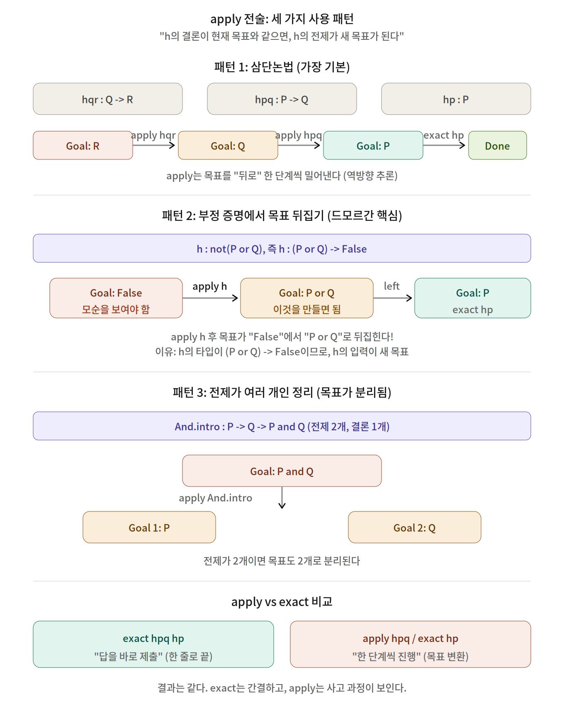
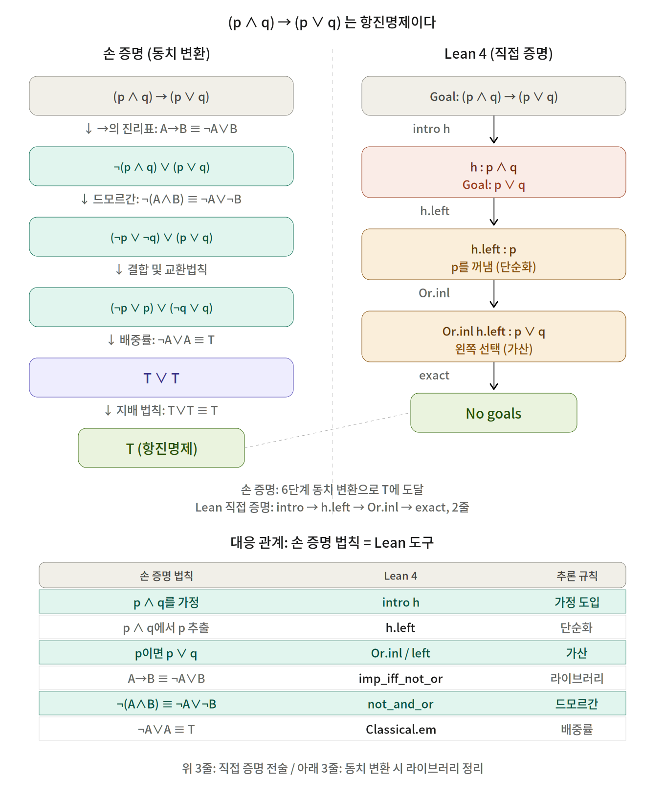
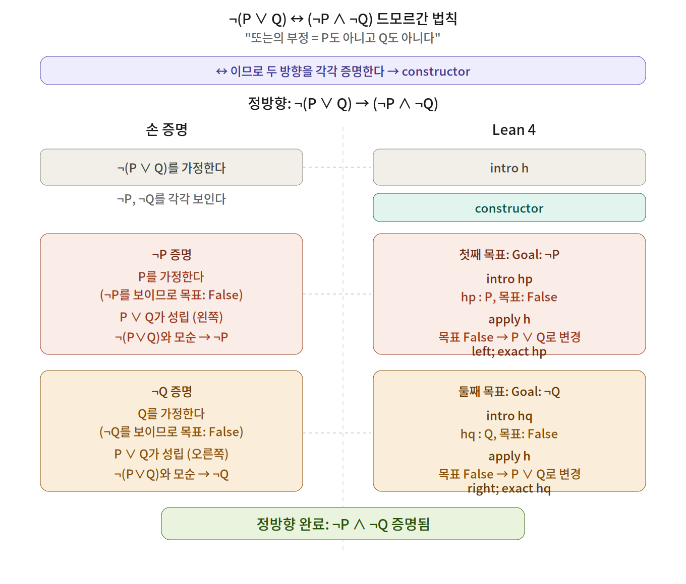
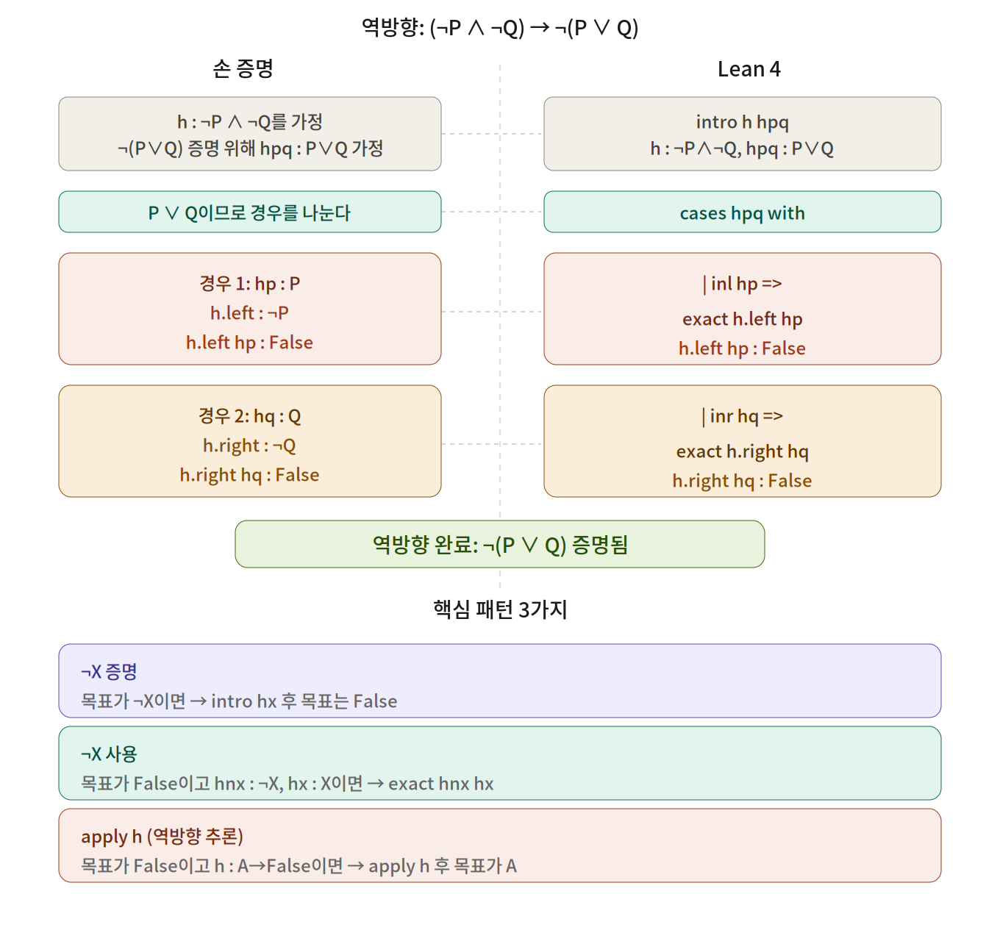

# 손 증명과 Lean 4 코드 1:1 대비 자료

> 이 문서에는 세 가지 내용이 포함되어 있다.
> - 제0부: apply 전술 완전 가이드 (드모르간 증명을 읽기 전에 먼저 볼 것)
> - 제1부: (p ∧ q) → (p ∨ q) 는 항진명제이다 (다이어그램 1개)
> - 제2부: 드모르간 법칙 ¬(P ∨ Q) ↔ (¬P ∧ ¬Q) (다이어그램 2개: 정방향, 역방향)

---

---

# 제0부: apply 전술 완전 가이드

> apply는 "이 가정/정리를 적용하겠다"는 전술이다.
> 목표를 더 작은 목표로 바꾸는 역방향 추론 도구이다.
> 제2부의 드모르간 증명에서 핵심적으로 쓰이므로, 먼저 읽어야 한다.

---

## 0-1. 세 가지 패턴 다이어그램



---

## 0-2. apply의 핵심 원리

```
h의 타입이 A → B이고, 현재 목표가 B이면:
  → apply h 후 목표가 A로 바뀐다.
  → "B를 증명하려면, h에 의해 A를 증명하면 된다."
```

exact와의 차이:

```
exact h hp  :  "h hp가 목표와 정확히 같다. 끝."     (증명 완성)
apply h     :  "h를 쓰겠다. 입력을 달라."           (증명 진행)
```

---

## 0-3. 패턴 1: 삼단논법 (가장 기본)

h : A → B가 있고, 목표가 B일 때.

```lean
example (P Q R : Prop) (hpq : P → Q) (hqr : Q → R) (hp : P) : R := by
  -- 목표: R
  apply hqr      -- hqr : Q → R. 결론 R = 목표 R. 목표가 Q로 변경.
  -- 목표: Q
  apply hpq      -- hpq : P → Q. 결론 Q = 목표 Q. 목표가 P로 변경.
  -- 목표: P
  exact hp       -- hp : P. 끝.
```

비유: 케이크를 만들려면(R) 반죽이 필요하고(Q), 반죽을 만들려면 밀가루가 필요하다(P). apply는 "이것을 만들려면 무엇이 필요한가?"를 묻는 것이다.

---

## 0-4. 패턴 2: 부정 증명에서 목표 뒤집기 (드모르간 핵심)

현재 목표가 False이고, h : A → False가 있을 때.

```lean
-- h : ¬(P ∨ Q), 즉 h : (P ∨ Q) → False
-- hp : P
-- 목표: False
example (P Q : Prop) (h : ¬(P ∨ Q)) (hp : P) : False := by
  apply h        -- h : (P∨Q) → False. 결론 False = 목표 False. 목표가 P ∨ Q로 변경.
  -- 목표: P ∨ Q
  left           -- 목표: P
  exact hp       -- 끝.
```

왜 이렇게 되는가?

```
¬(P ∨ Q) 는 (P ∨ Q) → False 로 정의되어 있다.
따라서 h의 타입은 (P ∨ Q) → False 이다.
apply h를 하면:
  h의 결론 = False
  현재 목표 = False
  일치하므로, h의 입력(P ∨ Q)이 새 목표가 된다.
```

이것이 드모르간 증명에서 apply h가 하는 일이다. "모순을 만들기 위해 P ∨ Q를 구성하자"라는 전략이다.

---

## 0-5. 패턴 3: 전제가 여러 개인 정리

h의 타입이 A → B → C이고, 목표가 C일 때. apply h 후 목표가 2개(A와 B)로 나뉜다.

```lean
example (P Q : Prop) (hp : P) (hq : Q) : P ∧ Q := by
  apply And.intro   -- 목표가 2개로 분리: Goal 1: P, Goal 2: Q
  · exact hp
  · exact hq
```

---

## 0-6. apply vs exact: 언제 어느 것을 쓰는가

```
목표가 Q이고, hpq : P → Q, hp : P 가 있을 때:

방법 1 (exact):  exact hpq hp     ← 한 줄로 끝. hpq에 입력까지 직접 넣음.
방법 2 (apply):  apply hpq        ← 목표가 P로 바뀜.
                 exact hp          ← 그 다음에 P를 제시.
```

둘 다 같은 결과이다. 입력이 단순하면 exact가 간결하고, 입력을 구성하는 데 여러 단계가 필요하면 apply가 편하다.

---

## 0-7. 요약

| 상황 | apply 후 목표 | 예시 |
|------|-------------|------|
| h : A → B, 목표: B | 목표가 A로 변경 | 삼단논법, 긍정 논법 |
| h : A → False, 목표: False | 목표가 A로 변경 | 부정 증명, 드모르간 |
| h : A → B → C, 목표: C | 목표가 A와 B 2개로 분리 | And.intro |

한 문장 정리: apply h는 "h의 결론이 현재 목표와 같으니, h의 전제(들)를 새 목표로 삼겠다"는 선언이다.

---

## 0-8. 학생 실습

### 실습 1: 기본 삼단논법

```lean
example (P Q R : Prop) (hpq : P → Q) (hqr : Q → R) (hp : P) : R := by
  apply ______
  apply ______
  exact ______
```
<details>
<summary>정답 보기</summary>
정답: `hqr`, `hpq`, `hp`
</details>

### 실습 2: 부정 증명에서 apply

```lean
-- h : ¬(P ∨ Q)일 때 ¬Q를 보여라
example (P Q : Prop) (h : ¬(P ∨ Q)) : ¬Q := by
  intro hq
  apply ______
  ______
  exact ______
```
<details>
<summary>정답 보기</summary>
정답: `h`, `right`, `hq`
</details>


---

# 제1부: (p ∧ q) → (p ∨ q) 는 항진명제이다

---

## 1-1. 전체 대비 다이어그램



---

## 1-2. 손 증명 (동치 변환)

| 단계 | 손 증명 | 사용한 법칙 | Lean 4 라이브러리 |
|------|---------|-----------|-----------------|
| 0 | (p ∧ q) → (p ∨ q) | 원래 명제 | -- |
| 1 | ≡ ¬(p ∧ q) ∨ (p ∨ q) | A → B ≡ ¬A ∨ B | `imp_iff_not_or` |
| 2 | ≡ (¬p ∨ ¬q) ∨ (p ∨ q) | ¬(A ∧ B) ≡ ¬A ∨ ¬B | `not_and_or` |
| 3 | ≡ (¬p ∨ p) ∨ (¬q ∨ q) | 결합 및 교환법칙 | `or_assoc`, `or_comm` |
| 4 | ≡ T ∨ T | 배중률: ¬A ∨ A ≡ T | `Classical.em` |
| 5 | ≡ T | T ∨ T ≡ T | `or_self` |

---

## 1-3. Lean 4 직접 증명

```lean
example (p q : Prop) : (p ∧ q) → (p ∨ q) := by
  intro h              -- p ∧ q를 가정한다 (h : p ∧ q)
  exact Or.inl h.left  -- h에서 p를 꺼내서 p ∨ q의 왼쪽에 넣는다
```

| 손 증명의 사고 과정 | Lean 4 코드 | 설명 |
|-------------------|------------|------|
| "p ∧ q가 참이라고 가정하자" | `intro h` | 조건문의 전제를 가정으로 도입 |
| "p ∧ q에서 p를 꺼낸다" | `h.left` | 단순화 논법: p ∧ q이면 p |
| "p가 참이면 p ∨ q도 참이다" | `Or.inl h.left` | 가산 논법: p이면 p ∨ q |
| (증명 완료) | `exact ...` | 목표와 일치하는 증거 제시 |

---

## 1-4. 각 동치 법칙의 Lean 대응물

```lean
-- 단계 1: A → B ≡ ¬A ∨ B
#check @imp_iff_not_or   -- (a → b) ↔ (¬a ∨ b)

example (p q : Prop) :
    ((p ∧ q) → (p ∨ q)) ↔ (¬(p ∧ q) ∨ (p ∨ q)) := by
  exact imp_iff_not_or

-- 단계 2: ¬(A ∧ B) ≡ ¬A ∨ ¬B (드모르간)
#check @not_and_or       -- ¬(a ∧ b) ↔ (¬a ∨ ¬b)

example (p q : Prop) :
    ¬(p ∧ q) ↔ (¬p ∨ ¬q) := by
  exact not_and_or

-- 단계 3: 결합 및 교환법칙
#check @or_assoc   -- (a ∨ b) ∨ c ↔ a ∨ (b ∨ c)
#check @or_comm    -- a ∨ b ↔ b ∨ a

-- 단계 4: 배중률
#check @Classical.em   -- ∀ (p : Prop), p ∨ ¬p

example (p : Prop) : ¬p ∨ p := by
  rcases Classical.em p with hp | hnp
  · right; exact hp
  · left; exact hnp

-- 단계 5: T ∨ T ≡ T
#check @or_self    -- a ∨ a ↔ a
```

---

## 1-5. 한 줄 자동 증명 / 학생 실습

```lean
-- 한 줄 자동 증명
example (p q : Prop) : (p ∧ q) → (p ∨ q) := by tauto

-- 학생 실습: 빈칸을 채우시오
example (p q : Prop) : (p ∧ q) → (p ∨ q) := by
  intro ______
  exact Or.inl ______
-- 정답: h, h.left
```

---

---

# 제2부: 드모르간 법칙 ¬(P ∨ Q) ↔ (¬P ∧ ¬Q)

"또는의 부정 = P도 아니고 Q도 아니다"

↔ 이므로 두 방향을 각각 증명한다. 전체 증명의 첫 줄: `constructor`

---

## 2-1. 정방향 다이어그램: ¬(P ∨ Q) → (¬P ∧ ¬Q)



---

## 2-2. 역방향 다이어그램: (¬P ∧ ¬Q) → ¬(P ∨ Q) + 핵심 패턴



---

## 2-3. 정방향 상세: ¬(P ∨ Q) → (¬P ∧ ¬Q)

### 손 증명

```
1. ¬(P ∨ Q)를 가정한다.                             ← 전제 가정
2. ¬P ∧ ¬Q를 보이기 위해 ¬P, ¬Q를 각각 보인다.      ← constructor로 분해
3. ¬P 증명:
   3a. P를 가정한다. (¬P를 보이기 위해 목표가 False가 됨)
   3b. 그러면 P ∨ Q가 성립한다. (왼쪽 경우)
   3c. 이는 가정 ¬(P ∨ Q)와 모순이다.
   3d. 따라서 ¬P.
4. ¬Q 증명:
   4a. Q를 가정한다. (¬Q를 보이기 위해 목표가 False가 됨)
   4b. 그러면 P ∨ Q가 성립한다. (오른쪽 경우)
   4c. 이는 가정 ¬(P ∨ Q)와 모순이다.
   4d. 따라서 ¬Q.
5. 그러므로 ¬P ∧ ¬Q.
```

### Lean 4 코드

```lean
· intro h           -- 1. h : ¬(P ∨ Q) 가정
  constructor       -- 2. 목표를 ¬P와 ¬Q 두 개로 분해
  · intro hp        -- 3a. hp : P 가정 (¬P = P → False이므로 목표: False)
    apply h         -- 3c. 목표 False, h : (P∨Q)→False이므로 목표가 P ∨ Q로 변경
    left            -- 3b. 왼쪽 선택, 목표: P
    exact hp        -- 3b. hp가 바로 P
  · intro hq        -- 4a. hq : Q 가정 (¬Q = Q → False이므로 목표: False)
    apply h         -- 4c. 목표가 P ∨ Q로 변경
    right           -- 4b. 오른쪽 선택, 목표: Q
    exact hq        -- 4b. hq가 바로 Q
```

### 1:1 대비표

| 단계 | 손 증명 | Lean 4 | InfoView 상태 변화 |
|------|---------|--------|-------------------|
| 1 | ¬(P ∨ Q)를 가정 | `intro h` | h : ¬(P ∨ Q) 등장, 목표: ¬P ∧ ¬Q |
| 2 | ¬P와 ¬Q를 각각 보인다 | `constructor` | 목표 2개로 분리: ⊢ ¬P, ⊢ ¬Q |
| 3a | P를 가정 (목표가 False) | `intro hp` | hp : P 등장, 목표: False |
| 3c | ¬(P∨Q)와 모순 유도 | `apply h` | 목표 False에서 P ∨ Q로 변경 |
| 3b | P → P ∨ Q (왼쪽) | `left; exact hp` | P 제시 → h가 받아서 False |
| 4a | Q를 가정 (목표가 False) | `intro hq` | hq : Q 등장, 목표: False |
| 4c | ¬(P∨Q)와 모순 유도 | `apply h` | 목표 False에서 P ∨ Q로 변경 |
| 4b | Q → P ∨ Q (오른쪽) | `right; exact hq` | Q 제시 → h가 받아서 False |

---

## 2-4. 역방향 상세: (¬P ∧ ¬Q) → ¬(P ∨ Q)

### 손 증명

```
1. h : ¬P ∧ ¬Q를 가정한다.                          ← 전제 가정
2. ¬(P ∨ Q)를 보이기 위해 hpq : P ∨ Q를 가정한다.   ← ¬의 정의: (P∨Q) → False
3. P ∨ Q이므로 경우를 나눈다.
   경우 1: hp : P
     h.left : ¬P
     따라서 h.left hp : False                        ← ¬P에 P를 대입
   경우 2: hq : Q
     h.right : ¬Q
     따라서 h.right hq : False                       ← ¬Q에 Q를 대입
4. 모든 경우에서 모순이므로 ¬(P ∨ Q).
```

### Lean 4 코드

```lean
· intro h hpq       -- 1. h : ¬P ∧ ¬Q,  2. hpq : P ∨ Q 가정 (목표: False)
  cases hpq with    -- 3. P ∨ Q를 경우별로 분해
  | inl hp =>       -- 경우 1: hp : P
    exact h.left hp --   h.left hp : False  (¬P에 P 대입)
  | inr hq =>       -- 경우 2: hq : Q
    exact h.right hq--   h.right hq : False (¬Q에 Q 대입)
```

### 1:1 대비표

| 단계 | 손 증명 | Lean 4 | InfoView 상태 변화 |
|------|---------|--------|-------------------|
| 1~2 | h : ¬P∧¬Q 가정, hpq : P∨Q 가정 | `intro h hpq` | h : ¬P ∧ ¬Q, hpq : P ∨ Q, 목표: False |
| 3 | P ∨ Q를 경우별로 나눔 | `cases hpq with` | 2개의 하위 목표로 분기 |
| 경우1 | h.left hp : False | `exact h.left hp` | h.left : ¬P, hp : P, 결과: False |
| 경우2 | h.right hq : False | `exact h.right hq` | h.right : ¬Q, hq : Q, 결과: False |

---

## 2-5. 전체 Lean 4 코드 (복사용)

```lean
example (P Q : Prop) :
    ¬(P ∨ Q) ↔ (¬P ∧ ¬Q) := by
  constructor
  -- 정방향: ¬(P ∨ Q) → (¬P ∧ ¬Q)
  · intro h
    constructor
    · intro hp
      apply h
      left
      exact hp
    · intro hq
      apply h
      right
      exact hq
  -- 역방향: (¬P ∧ ¬Q) → ¬(P ∨ Q)
  · intro h hpq
    cases hpq with
    | inl hp =>
        exact h.left hp
    | inr hq =>
        exact h.right hq
```

---

## 2-6. 핵심 패턴 3가지

### ¬X 증명하기

```
목표가 ¬X이면 → intro hx 후 목표는 False
```

¬X는 X → False로 정의되어 있으므로, intro로 X를 가정하면 목표가 자동으로 False가 된다.

### ¬X 사용하기

```
목표가 False이고, hnx : ¬X와 hx : X가 있으면 → exact hnx hx
```

¬X는 X → False이므로, hnx에 hx를 넣으면 False가 나온다. 목표가 False일 때 바로 닫힌다.

### apply h (역방향 추론)

```
현재 목표가 False이고, h : A → False이면 → apply h 후 목표가 A로 바뀜
```

apply h는 "h의 결론이 현재 목표와 같으므로, h의 입력을 제시하겠다"는 선언이다.

---

## 부록: ¬ 증명 vs 귀류법 -- 이 둘은 다르다

| | ¬X 증명 (부정의 정의) | X 증명 (귀류법) |
|---|---|---|
| 증명 대상 | ¬X | X |
| 가정하는 것 | X | ¬X |
| 모순 도출 후 | ¬X 성립 (정의 그대로) | X 성립 (배중률 필요) |
| Lean 전술 | `intro hx` | `by_contra hnx` |
| 논리 체계 | 직관주의에서도 가능 | 고전 논리 필요 |

이 문서의 모든 증명에서 "P를 가정한다 → 모순"은 귀류법이 아니라 ¬P의 정의(P → False)를 직접 사용하는 것이다.

---

## 참고: 드모르간 법칙 쌍

| 법칙 | 식 | 손 증명 핵심 | Lean 핵심 전술 |
|------|---|-----------|-------------|
| ¬(P∨Q) ↔ ¬P∧¬Q | 또는의 부정 | 각 원소를 가정 → P∨Q 만들어 모순 | intro + apply h + left/right |
| ¬(P∧Q) ↔ ¬P∨¬Q | 그리고의 부정 | by_cases로 P 여부 나눔 | by_cases + right/left |

---
