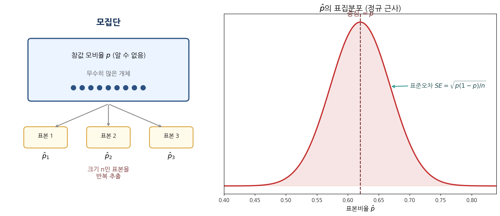
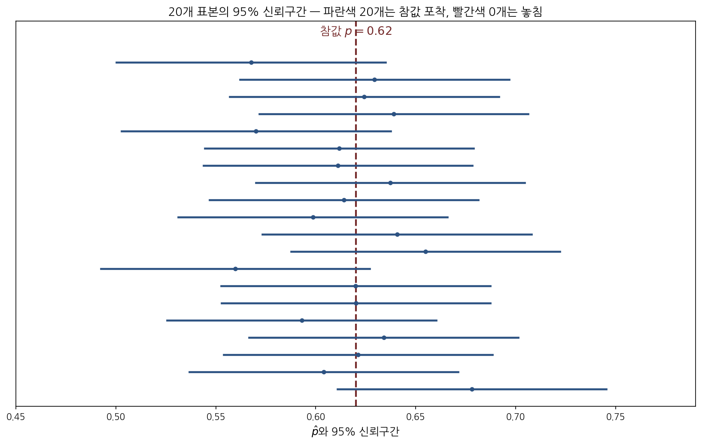
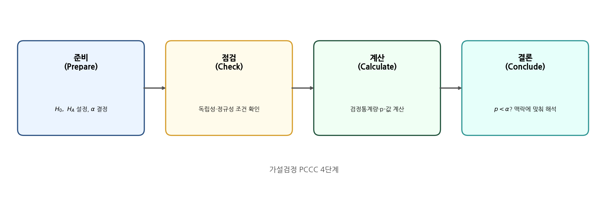
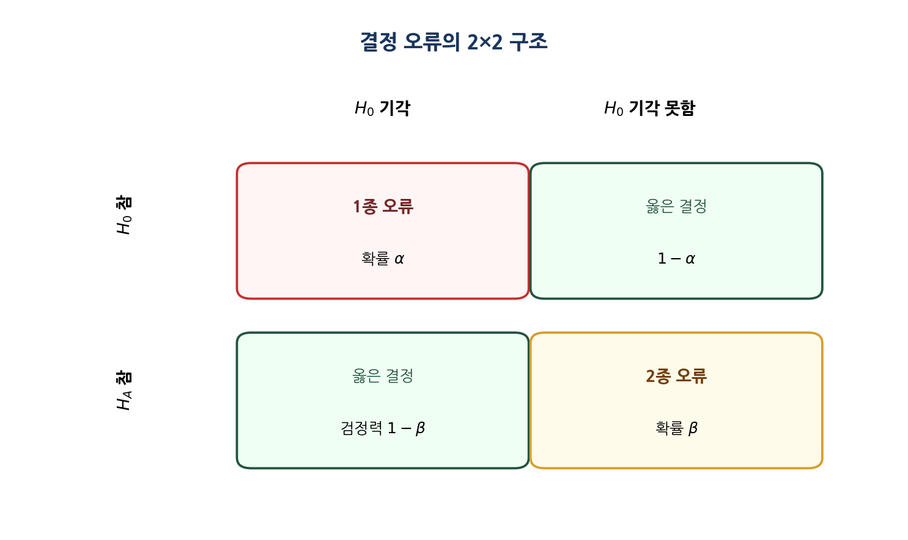

# 제5장 · 추론의 기초 — 학생 워크북

> **사용 안내.** 이 워크북은 직접 손으로 풀며 익히는 연습용 교재이다. 각 문제 아래의 빈 상자에 풀이 과정을 단계별로 적는다. 정답을 먼저 보지 말고, 충분히 고민한 뒤 본책·강의안·기말시험 해설과 대조하기를 권한다. 허용 도구는 계산기와 $Z$ 표이며, 유의수준이 명시되지 않으면 $\alpha = 0.05$를 사용한다.

---

## 학습 목표

이 장을 마치면 다음을 할 수 있어야 한다.

- **점추정값**(point estimate)과 **모수**(parameter)를 구별하고, 표본마다 추정값이 달라지는 이유를 설명한다.
- **중심극한정리**(Central Limit Theorem)의 조건과 결론을 진술하고, 표본비율 $\hat{p}$의 **표집분포**(sampling distribution)를 정규분포로 근사한다.
- **표준오차**(standard error)를 계산하고 그것이 무엇의 변동성을 재는 양인지 설명한다.
- 비율에 대한 **신뢰구간**(confidence interval)을 구성하고 빈도주의적으로 올바르게 해석한다.
- **가설검정**(hypothesis test)의 PCCC 4단계를 수행하고, **p-값**(p-value)·**유의수준**(significance level)·**1종 오류**(Type I error)·**2종 오류**(Type II error)·**검정력**(power)의 의미를 구별한다.

---

## 1. 핵심 개념 정리

### 1.1 점추정값과 변동성

모수는 모집단 전체를 설명하는 고정된 값이며 보통 알 수 없다. 점추정값은 표본으로부터 계산한 하나의 수치로, 모수에 대한 최선의 추측이다. 표본이 바뀌면 점추정값도 바뀌므로 추정값에는 **표본추출 변동**(sampling variability)이 따른다. 이 변동의 크기를 재는 양이 표준오차이다.



표본비율의 표준오차는 다음과 같다.
$$ SE_{\hat{p}} = \sqrt{\dfrac{p(1-p)}{n}} \;\approx\; \sqrt{\dfrac{\hat{p}(1-\hat{p})}{n}} $$

> **[새로운 시각]** 표준오차를 "표준편차의 사촌"으로만 외우면 둘을 자주 혼동한다. 한 문장으로 구별하면 이렇다. **표준편차는 개체가 흩어진 정도이고, 표준오차는 통계량이 흩어진 정도이다.** 분모의 $\sqrt{n}$이 그 차이를 만든다. 표본을 키우면 개체의 흩어짐(표준편차)은 그대로지만, 평균·비율 같은 요약값의 흩어짐(표준오차)은 $\sqrt{n}$에 반비례해 줄어든다. 그래서 표본을 4배로 키워야 표준오차가 절반이 된다 — 정밀도를 2배로 올리는 값이 생각보다 비싸다는 사실이 여기서 나온다. 이 진술은 $SE = \sigma/\sqrt{n}$에서 직접 확인되는 참인 관계이다.

### 1.2 중심극한정리와 정규 근사

**중심극한정리**는 다음을 보장한다. 관측이 독립이고 성공·실패 횟수가 각각 충분히 크면($np \ge 10$, $n(1-p) \ge 10$), $\hat{p}$의 표집분포는 평균이 $p$이고 표준편차가 $SE_{\hat{p}}$인 정규분포로 근사된다.

> **[새로운 시각]** 성공·실패 조건 $np \ge 10$의 "10"이 어디서 왔는지 궁금할 수 있다. 이것은 정리에서 도출되는 마법의 상수가 아니라 **경험적 안전선**이다. 비율이 0이나 1에 가까우면 표집분포가 한쪽으로 쏠려 정규 근사가 나빠지는데, 양쪽 꼬리에 각각 기댓값 10 이상의 사건이 들어가면 그 쏠림이 실용적으로 무시할 만해진다는 뜻이다. 즉 이 조건은 "근사가 깨지지 않을 만큼 자료가 양쪽 끝을 충분히 메웠는가"를 묻는 것이다. 그래서 9.7 같은 값에서 결과가 급변하지는 않는다 — 경계는 부드럽다.

### 1.3 신뢰구간

95% 신뢰구간은 점추정값을 중심으로 양옆에 **오차한계**(margin of error)를 더하고 뺀 구간이다.
$$ \hat{p} \pm z^{\star}\, SE_{\hat{p}}, \qquad z^{\star}_{95\%} = 1.96 $$



> **[새로운 시각]** "95% 신뢰"라는 말의 주어는 **구간**이지 **모수**가 아니다. 위 그림이 그 점을 그대로 보여 준다. 참값 $p$는 점선으로 고정되어 있고, 매번 흔들리는 것은 우리가 만든 구간 쪽이다. 따라서 "참값이 이 구간에 있을 확률이 95%"라는 표현은 어색하다 — 참값은 확률변수가 아니기 때문이다. 올바른 진술은 "이런 방식으로 구간을 무수히 만들면 그중 약 95%가 참값을 덮는다"이다. 시험에서 자주 갈리는 지점이므로 주어를 구간에 두는 습관을 들이자.

### 1.4 가설검정과 결정 오류



검정통계량은 $\displaystyle Z = \frac{\hat{p} - p_0}{SE_0}$이며, 귀무가설 하의 표준오차 $SE_0 = \sqrt{p_0(1-p_0)/n}$를 쓴다. p-값은 "귀무가설이 참일 때, 관측된 것만큼 또는 그보다 더 극단적인 결과가 나올 확률"이다. $p\text{-값} < \alpha$이면 귀무가설을 **기각한다**. 그렇지 않으면 귀무가설을 **기각하지 못한다**(이는 "대립가설을 채택한다"와 다르다).



> **[새로운 시각]** 1종·2종 오류를 법정 비유로 묶으면 한 번에 정리된다. 귀무가설은 "피고는 무죄"이다. **1종 오류는 무죄인 사람을 유죄로 판결하는 것**(거짓 경보, 확률 $\alpha$)이고, **2종 오류는 유죄인 사람을 놓아주는 것**(놓침, 확률 $\beta$)이다. 유죄 판결 기준($\alpha$)을 까다롭게 낮추면 무고한 사람을 가둘 위험은 줄지만 진짜 범인을 놓칠 위험은 커진다. 두 오류가 한쪽을 누르면 다른 쪽이 올라가는 상충 관계라는 점, 그리고 그 상충을 깨고 둘 다 줄이는 유일한 길이 표본을 늘리는 것($n \uparrow \Rightarrow$ 검정력 $\uparrow$)이라는 점이 이 비유의 핵심이다. 이는 검정력 함수가 $n$의 증가함수라는 사실과 일치하는 참인 직관이다.

---

## 2. 핵심 공식 모음

```{=latex}
\begin{tcolorbox}[colback=accent!4,colframe=accent,boxrule=0.8pt,title=\textbf{제5장 핵심 공식}]
```
- 표본비율의 표준오차: $\displaystyle SE_{\hat{p}} = \sqrt{\frac{\hat{p}(1-\hat{p})}{n}}$ (신뢰구간), $\displaystyle SE_0 = \sqrt{\frac{p_0(1-p_0)}{n}}$ (가설검정)
- 신뢰구간: $\displaystyle \hat{p} \pm z^{\star} SE_{\hat{p}}$, ($z^{\star}_{90\%}=1.645,\ z^{\star}_{95\%}=1.96,\ z^{\star}_{99\%}=2.576$)
- 검정통계량: $\displaystyle Z = \frac{\hat{p}-p_0}{SE_0}$
- 표본 크기 결정(오차한계 $m$ 이하): $\displaystyle n \ge \frac{(z^{\star})^2\, p(1-p)}{m^2}$ (보수적으로 $p=0.5$)
- 정규 근사 조건: $np \ge 10$ 그리고 $n(1-p) \ge 10$
```{=latex}
\end{tcolorbox}
```

---

## 3. 연습문제

> 각 문제의 빈 상자에 풀이 과정을 적는다. 최종 수치뿐 아니라 **어떤 공식을 왜 썼는지**까지 적는 연습을 한다.

### A부 · 개념 확인

**문제 5-A1.** 다음 각 상황에서 관심 모수가 **평균**인지 **비율**인지 판별하고, 그 이유를 한 문장으로 적어라.
(a) 대학생 100명에게 주당 인터넷 사용 시간을 묻는다.
(b) 대학생 100명에게 논문에서 위키백과를 인용한 적이 있는지 예/아니오로 묻는다.

```{=latex}
\worksp[3cm]
```

**문제 5-A2.** "표본을 크게 할수록 모집단의 표준편차가 작아진다"는 진술의 참·거짓을 판정하고, 표준편차와 표준오차의 차이를 들어 설명하라.

```{=latex}
\worksp[3.2cm]
```

**문제 5-A3.** 가설검정에서 p-값을 "귀무가설이 참일 확률"이라고 해석하면 왜 틀리는가? 올바른 정의를 적고 차이를 설명하라.

```{=latex}
\worksp[3.5cm]
```

**문제 5-A4.** 어떤 검정에서 $Z = 0.47$을 얻었다. 이 값의 의미로 가장 적절한 해석을 고르고 이유를 적어라.
(a) 귀무가설이 참일 확률이 0.47이다. (b) 표본비율이 가설값보다 표준오차의 0.47배만큼 위에 있다. (c) 표본비율이 0.47이다.

```{=latex}
\worksp[2.6cm]
```

### B부 · 계산 연습

**문제 5-B1.** 어느 공장의 시리얼 상자 무게가 평균 $20$온스, 표준편차 $2$온스인 정규분포를 따른다.
(a) 한 상자가 $21$온스보다 무거울 확률을 구하라.
(b) $25$개 상자의 표본평균이 $21$온스보다 무거울 확률을 구하라. (b)가 (a)보다 작은 이유를 설명하라.

```{=latex}
\worksp[4cm]
```

**문제 5-B2.** 한 여론조사에서 성인 $765$명 중 $322$명이 예상치 못한 지출에 대비한 저축이 없다고 답했다.
(a) 표본비율 $\hat{p}$과 표준오차를 구하라.
(b) 정규 근사 조건을 점검하라.
(c) 이 비율에 대한 95% 신뢰구간을 구하고 맥락에 맞게 해석하라.

```{=latex}
\worksp[5cm]
```

**문제 5-B3.** 2013년 한 조사에서 미국 성인의 $45\%$가 만성 질환을 가졌다고 보고되었고, 표준오차는 $1.2\%$였다.
(a) 95% 신뢰구간을 구하라.
(b) "참값이 이 구간 안에 있을 확률이 95%이다"라는 진술의 옳고 그름을 판정하고 바르게 고쳐라.

```{=latex}
\worksp[4cm]
```

**문제 5-B4.** 한 신약의 효과를 보려고 비율 $p$를 오차한계 $3\%$ 이내로 95% 신뢰도로 추정하려 한다. 사전 정보가 없을 때 필요한 최소 표본 크기를 구하라.

```{=latex}
\worksp[3.5cm]
```

**문제 5-B5.** 동전이 공정한지 보려고 $200$번 던져 앞면이 $114$번 나왔다. $\alpha = 0.05$에서 PCCC 4단계로 양측검정을 수행하라. (귀무가설: $p = 0.5$.)

```{=latex}
\worksp[5.5cm]
```

### C부 · 응용·도전

**문제 5-C1.** 같은 자료에서 95% 신뢰구간이 $p_0$를 포함하지 않으면, $\alpha = 0.05$ 양측검정은 반드시 귀무가설을 기각한다. 이 두 절차가 동치인 이유를 신뢰구간과 검정통계량의 관계로 설명하라.

```{=latex}
\worksp[4cm]
```

**문제 5-C2.** 한 연구자가 단측검정을 쓸지 양측검정을 쓸지 자료를 본 뒤에 결정했다. 이 절차가 1종 오류율을 어떻게 왜곡하는지, 그리고 검정 방향을 자료 수집 **전에** 정해야 하는 이유를 설명하라.

```{=latex}
\worksp[3.5cm]
```

**문제 5-C3.** "통계적 유의성"과 "실질적 중요성"이 어긋날 수 있는 상황을 표본 크기와 연결지어 구체적 예로 설명하라.

```{=latex}
\worksp[3.5cm]
```

### D부 · Python 실습

> 빈칸(`____`)을 채워 코드를 완성하고, 직접 실행한 결과를 아래 상자에 적어라. `scipy.stats`를 사용한다.

**문제 5-D1.** 표본비율의 95% 신뢰구간을 계산하는 함수를 완성하라.

```python
import numpy as np
from scipy import stats

def ci_proportion(x, n, conf=0.95):
    p_hat = x / n
    se = np.sqrt(____ * (1 - ____) / n)          # 신뢰구간용 SE
    z = stats.norm.ppf(1 - (1 - conf) / ____)    # 임계값 z*
    return (p_hat - z * se, p_hat + z * se)

print(ci_proportion(322, 765))
```

```{=latex}
\worksp[2.4cm]
```

**문제 5-D2.** 단일 비율 양측검정의 $Z$ 통계량과 p-값을 계산하라. (문제 5-B5의 동전 자료를 사용한다.)

```python
import numpy as np
from scipy import stats

x, n, p0 = 114, 200, 0.5
p_hat = x / n
se0 = np.sqrt(p0 * (1 - p0) / ____)              # 귀무가설용 SE
z = (p_hat - ____) / se0                          # 검정통계량
p_value = 2 * (1 - stats.norm.cdf(abs(z)))        # 양측 p-값
print(f"Z = {z:.3f},  p-value = {p_value:.4f}")
```

```{=latex}
\worksp[2.6cm]
```

---

## 4. 자기 점검 체크리스트

```{=latex}
\begin{tcolorbox}[colback=teal!4,colframe=teal,boxrule=0.7pt,title=\textbf{스스로 점검}]
```
- ☐ 모수와 점추정값을 구별하고, 표준편차와 표준오차의 차이를 설명할 수 있다.
- ☐ 정규 근사 조건($np \ge 10,\ n(1-p)\ge 10$)을 점검할 수 있다.
- ☐ 신뢰구간을 구성하고 "주어를 구간에 두는" 해석을 할 수 있다.
- ☐ PCCC 4단계로 단일 비율 검정을 수행할 수 있다.
- ☐ p-값·$\alpha$·1종·2종 오류·검정력을 혼동 없이 설명할 수 있다.
- ☐ "귀무가설을 기각하지 못함"과 "대립가설 채택"의 차이를 안다.
```{=latex}
\end{tcolorbox}
```
