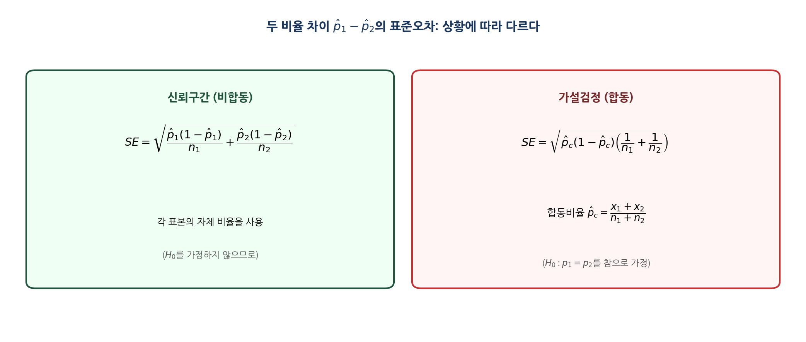
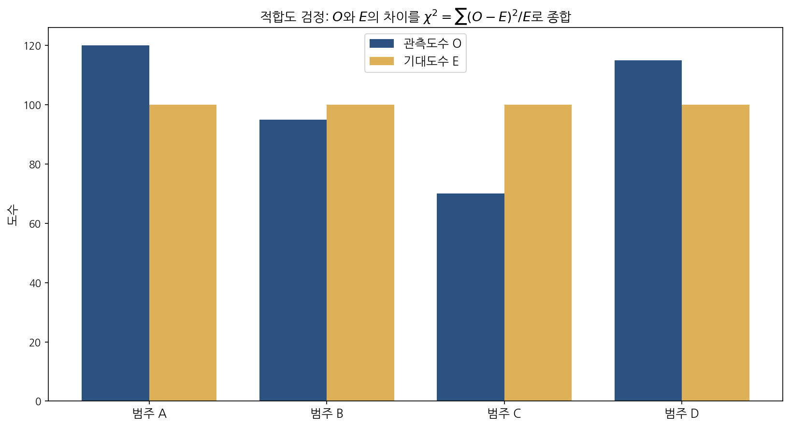
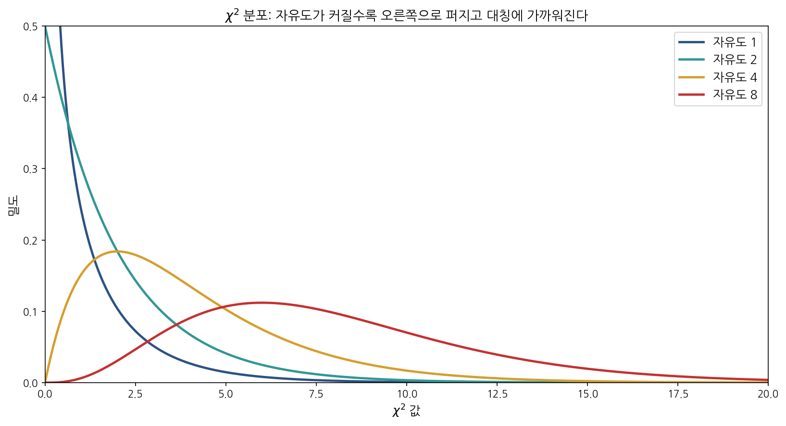
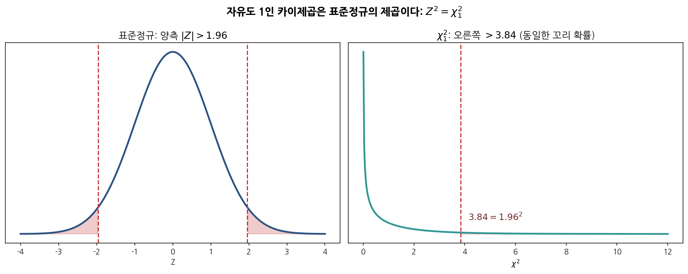

# 제6장 · 범주형 자료의 추론 — 학생 워크북

> **사용 안내.** 직접 손으로 풀며 익히는 연습용 교재이다. 빈 상자에 풀이 과정을 단계별로 적는다. 5장의 PCCC 4단계, p-값·유의수준·신뢰구간 해석을 그대로 사용하므로, 막히면 5장 워크북을 먼저 복습한다. 유의수준이 명시되지 않으면 $\alpha = 0.05$를 쓴다.

---

## 학습 목표

이 장을 마치면 다음을 할 수 있어야 한다.

- 단일 비율의 추론을 복습하고 **표본 크기**(sample size) 결정 문제를 푼다.
- **두 비율의 차이**($p_1 - p_2$)에 대한 신뢰구간과 가설검정을 수행하고, **합동 표준오차**(pooled standard error)와 **비합동 표준오차**(unpooled standard error)를 언제 쓰는지 구별한다.
- **카이제곱 적합도 검정**(chi-square goodness-of-fit test)으로 관측도수가 특정 분포에 맞는지 평가한다.
- **이원분할표**(two-way table)에서 **기대도수**(expected count)를 계산하고 **카이제곱 독립성 검정**(chi-square test of independence)을 수행한다.
- 카이제곱 분포의 모양과 자유도의 역할을 설명하고, $Z^2 = \chi^2_1$ 관계를 이해한다.

---

## 1. 핵심 개념 정리

### 1.1 두 비율의 차이

두 독립 표본의 비율 차이 $\hat{p}_1 - \hat{p}_2$의 표준오차는 **목적에 따라 다른 공식**을 쓴다. 이것이 6장에서 가장 자주 틀리는 지점이다.



- **신뢰구간(비합동):** $\displaystyle SE = \sqrt{\frac{\hat{p}_1(1-\hat{p}_1)}{n_1} + \frac{\hat{p}_2(1-\hat{p}_2)}{n_2}}$
- **가설검정(합동):** $\displaystyle SE = \sqrt{\hat{p}_c(1-\hat{p}_c)\!\left(\frac{1}{n_1}+\frac{1}{n_2}\right)}$, $\displaystyle \hat{p}_c = \frac{x_1+x_2}{n_1+n_2}$

> **[새로운 시각]** 왜 검정에서만 두 표본을 "합치는가"? 가설검정의 출발점은 귀무가설 $H_0: p_1 = p_2$, 즉 **두 모비율이 같다는 가정**이다. 둘이 같다면 그 공통값의 가장 좋은 추정은 두 표본을 한 솥에 부어 만든 합동비율 $\hat{p}_c$이다. 반면 신뢰구간은 "둘이 같다"는 가정 없이 차이 자체를 추정하므로 각 표본의 자기 비율을 그대로 쓴다. **즉 공식 선택은 암기가 아니라 "지금 $p_1 = p_2$를 가정하고 있는가?"라는 한 가지 질문으로 결정된다.** 검정이면 예(합동), 신뢰구간이면 아니오(비합동) — 이 한 줄로 정리된다. 이는 귀무분포를 귀무가설 하에서 구성한다는 추론의 일반 원칙에서 곧바로 따라 나오는 참인 규칙이다.

### 1.2 카이제곱 적합도 검정

범주가 셋 이상일 때는 $Z$ 대신 카이제곱 통계량으로 관측도수와 기대도수의 어긋남을 한꺼번에 잰다.
$$ \chi^2 = \sum_{i} \frac{(O_i - E_i)^2}{E_i}, \qquad \text{자유도 } df = k - 1 $$



> **[새로운 시각]** 분자가 왜 그냥 $(O-E)$가 아니라 $(O-E)^2/E$일까? 세 가지 설계가 숨어 있다. 첫째, **제곱**은 양·음의 어긋남이 상쇄되지 않게 한다(부호를 지운다). 둘째, **$E$로 나누는 것**은 어긋남을 상대화한다 — 기대 1000에서 10 벗어남은 사소하지만 기대 10에서 10 벗어남은 심각하다. 같은 절대 차이라도 작은 칸에서 더 큰 신호로 읽힌다. 셋째, 그렇게 정의해야 합이 카이제곱 분포를 따른다. 요약하면 카이제곱 통계량은 **"각 칸이 기대에서 몇 표준오차만큼 벗어났는가"를 제곱해 모두 더한 양**이다. 이 표준화 구조 때문에 단위·표본 크기에 휘둘리지 않는다는 점이 핵심이며, 이는 통계량의 정의에서 직접 확인되는 사실이다.

### 1.3 카이제곱 분포와 자유도



카이제곱 분포는 항상 0 이상이고 오른쪽으로 비대칭이며, 검정은 **언제나 단측(오른쪽 꼬리)** 으로 한다. 통계량이 클수록 관측이 기대에서 멀다는 뜻이기 때문이다.



> **[새로운 시각]** $Z^2 = \chi^2_1$이라는 등식은 단순한 수학 트릭이 아니라 두 검정이 같은 것을 보고 있다는 증거이다. 비율 하나를 양측 $Z$로 검정하든, $2$범주 적합도를 카이제곱으로 검정하든 **p-값이 정확히 같다.** 그림에서 $|Z| > 1.96$의 양측 넓이와 $\chi^2_1 > 1.96^2 = 3.84$의 오른쪽 넓이가 일치하는 것이 그 시각적 증명이다. 양측 $Z$가 부호를 버리고 거리만 보는 순간, 그것은 이미 제곱(=카이제곱)과 같아진다. 그래서 카이제곱은 "$Z$를 여러 범주로 확장한 것"이라고 이해하면 자연스럽다.

### 1.4 이원분할표의 독립성 검정

이원분할표의 각 칸 기대도수는 다음과 같고, 자유도는 $(\text{행 수}-1)(\text{열 수}-1)$이다.
$$ E_{ij} = \frac{(\text{행 } i \text{ 합계}) \times (\text{열 } j \text{ 합계})}{\text{전체 합계}} $$

> **[새로운 시각]** 기대도수 공식이 왜 "행합×열합÷총합"인가? 이것은 **독립일 때의 곱셈 법칙**을 도수로 옮긴 것이다. 두 사건이 독립이면 $P(A \cap B) = P(A)P(B)$이다. 칸의 기대 비율은 $\frac{\text{행합}}{\text{총합}} \times \frac{\text{열합}}{\text{총합}}$이고, 여기에 총합을 곱해 기대 도수로 바꾸면 약분되어 위 공식이 남는다. 따라서 카이제곱 독립성 검정은 **"독립을 가정하고 만든 표(기대도수)와 실제 표(관측도수)가 얼마나 어긋나는가"** 를 재는 것이다. 공식을 외우는 대신 "독립이라면 각 칸은 이만큼이어야 한다"는 그림으로 기억하면 잊히지 않는다.

---

## 2. 핵심 공식 모음

```{=latex}
\begin{tcolorbox}[colback=accent!4,colframe=accent,boxrule=0.8pt,title=\textbf{제6장 핵심 공식}]
```
- 두 비율 차이 신뢰구간: $\displaystyle (\hat{p}_1-\hat{p}_2) \pm z^{\star}\sqrt{\frac{\hat{p}_1(1-\hat{p}_1)}{n_1}+\frac{\hat{p}_2(1-\hat{p}_2)}{n_2}}$
- 두 비율 차이 검정통계량: $\displaystyle Z=\frac{\hat{p}_1-\hat{p}_2}{\sqrt{\hat{p}_c(1-\hat{p}_c)(1/n_1+1/n_2)}}$, $\displaystyle \hat{p}_c=\frac{x_1+x_2}{n_1+n_2}$
- 카이제곱 통계량: $\displaystyle \chi^2=\sum \frac{(O-E)^2}{E}$
- 적합도 검정 자유도: $df = k-1$ (범주 수 $k$)
- 독립성 검정 기대도수·자유도: $\displaystyle E_{ij}=\frac{R_i C_j}{N}$, $df=(r-1)(c-1)$
- 카이제곱 조건: 모든 칸의 기대도수 $E_{ij} \ge 5$
```{=latex}
\end{tcolorbox}
```

---

## 3. 연습문제

### A부 · 개념 확인

**문제 6-A1.** 두 비율의 차이를 다룰 때, 신뢰구간에서는 비합동 표준오차를, 가설검정에서는 합동 표준오차를 쓴다. 이 차이가 생기는 이유를 귀무가설과 연결지어 한 문단으로 설명하라.

```{=latex}
\worksp[3.2cm]
```

**문제 6-A2.** 카이제곱 검정이 항상 오른쪽 단측 검정인 이유를 통계량의 정의로 설명하라.

```{=latex}
\worksp[2.8cm]
```

**문제 6-A3.** 적합도 검정의 자유도가 $k-1$인데, $k$개의 범주에서 1을 빼는 이유는 무엇인가?

```{=latex}
\worksp[2.6cm]
```

### B부 · 계산 연습

**문제 6-B1.** 어떤 정책에 대한 지지율을 두 도시에서 조사했다. A시는 $250$명 중 $140$명, B시는 $300$명 중 $141$명이 지지했다.
(a) 각 표본비율을 구하라.
(b) 두 지지율 차이 $p_A - p_B$에 대한 95% 신뢰구간을 구하라. (비합동 SE 사용)
(c) 구간이 0을 포함하는지 보고 그 의미를 해석하라.

```{=latex}
\worksp[5cm]
```

**문제 6-B2.** 위 문제 6-B1의 자료로 $H_0: p_A = p_B$를 $\alpha = 0.05$에서 검정하라.
(a) 합동비율 $\hat{p}_c$를 구하라.
(b) 합동 표준오차와 $Z$ 통계량을 구하라.
(c) p-값을 구하고 PCCC 4단계로 결론을 적어라.

```{=latex}
\worksp[5.5cm]
```

**문제 6-B3.** 주사위가 공정한지 보려고 $120$번 던진 결과가 다음과 같다.

| 눈 | 1 | 2 | 3 | 4 | 5 | 6 |
|---|---|---|---|---|---|---|
| 관측도수 | 14 | 22 | 18 | 17 | 25 | 24 |

(a) 공정하다면 각 눈의 기대도수는 얼마인가?
(b) 카이제곱 통계량과 자유도를 구하라.
(c) $\alpha = 0.05$에서 결론을 내려라. (임계값 $\chi^2_{0.05,\,5} = 11.07$)

```{=latex}
\worksp[5.5cm]
```

**문제 6-B4.** 흡연 여부와 운동 습관의 연관을 보려고 $200$명을 조사해 다음 이원분할표를 얻었다.

| | 규칙적 운동 | 비규칙적 운동 | 합계 |
|---|---|---|---|
| 흡연 | 20 | 50 | 70 |
| 비흡연 | 60 | 70 | 130 |
| 합계 | 80 | 120 | 200 |

(a) 각 칸의 기대도수를 구하라.
(b) 카이제곱 통계량과 자유도를 구하라.
(c) 흡연과 운동이 독립이라고 할 수 있는지 $\alpha = 0.05$에서 판정하라. (임계값 $\chi^2_{0.05,\,1} = 3.84$)

```{=latex}
\worksp[6cm]
```

### C부 · 응용·도전

**문제 6-C1.** $2 \times 2$ 분할표의 독립성 검정(자유도 1)과, 같은 자료를 두 비율 차이의 양측 $Z$ 검정으로 분석한 결과가 항상 같은 p-값을 준다. 그 이유를 $Z^2 = \chi^2_1$ 관계로 설명하라.

```{=latex}
\worksp[3.5cm]
```

**문제 6-C2.** 한 칸의 기대도수가 5보다 작으면 카이제곱 근사가 나빠진다. 이때 취할 수 있는 대안(범주 병합, 정확검정 등)을 한 가지 들고, 왜 작은 기대도수가 문제인지 카이제곱 통계량의 분모를 들어 설명하라.

```{=latex}
\worksp[3.5cm]
```

### D부 · Python 실습

> 빈칸(`____`)을 채워 완성하고, 실행 결과를 아래 상자에 적어라.

**문제 6-D1.** 두 비율 차이의 가설검정(합동 SE)을 완성하라.

```python
import numpy as np
from scipy import stats

x1, n1 = 140, 250
x2, n2 = 141, 300
p1, p2 = x1 / n1, x2 / n2
p_pool = (x1 + x2) / (n1 + n2)                       # 합동비율
se = np.sqrt(p_pool * (1 - p_pool) * (1 / n1 + 1 / ____))
z = (p1 - p2) / se
p_value = 2 * (1 - stats.norm.cdf(abs(z)))           # 양측 p-값
print(f"p_pool={p_pool:.4f}, Z={z:.3f}, p-value={p_value:.4f}")
```

```{=latex}
\worksp[2.6cm]
```

**문제 6-D2.** 카이제곱 적합도 검정을 `scipy`로 수행하라. (문제 6-B3의 주사위 자료)

```python
from scipy import stats

observed = [14, 22, 18, 17, 25, 24]
n = sum(observed)
expected = [n / ____] * 6                            # 각 눈의 기대도수
chi2, p = stats.chisquare(f_obs=observed, f_exp=expected)
print(f"chi2={chi2:.3f}, df={len(observed)-1}, p-value={p:.4f}")
```

```{=latex}
\worksp[2.6cm]
```

**문제 6-D3.** 이원분할표의 독립성 검정을 완성하라. (문제 6-B4의 자료)

```python
import numpy as np
from scipy import stats

table = np.array([[20, 50],
                  [60, 70]])
chi2, p, dof, expected = stats.chi2_contingency(table, correction=____)  # 연속성 보정 끄기
print("기대도수:\n", expected)
print(f"chi2={chi2:.3f}, df={dof}, p-value={p:.4f}")
```

```{=latex}
\worksp[2.8cm]
```

---

## 4. 자기 점검 체크리스트

```{=latex}
\begin{tcolorbox}[colback=teal!4,colframe=teal,boxrule=0.7pt,title=\textbf{스스로 점검}]
```
- ☐ 두 비율 차이에서 신뢰구간(비합동)과 검정(합동) 공식을 구별해 쓸 수 있다.
- ☐ 합동비율 $\hat{p}_c$를 계산하고 그 의미를 설명할 수 있다.
- ☐ 카이제곱 통계량 $\sum (O-E)^2/E$를 손으로 계산할 수 있다.
- ☐ 적합도 검정($df=k-1$)과 독립성 검정($df=(r-1)(c-1)$)의 자유도를 구별한다.
- ☐ 이원분할표의 기대도수를 행합·열합·총합으로 계산할 수 있다.
- ☐ $Z^2 = \chi^2_1$ 관계와 카이제곱이 단측 검정인 이유를 설명할 수 있다.
```{=latex}
\end{tcolorbox}
```
