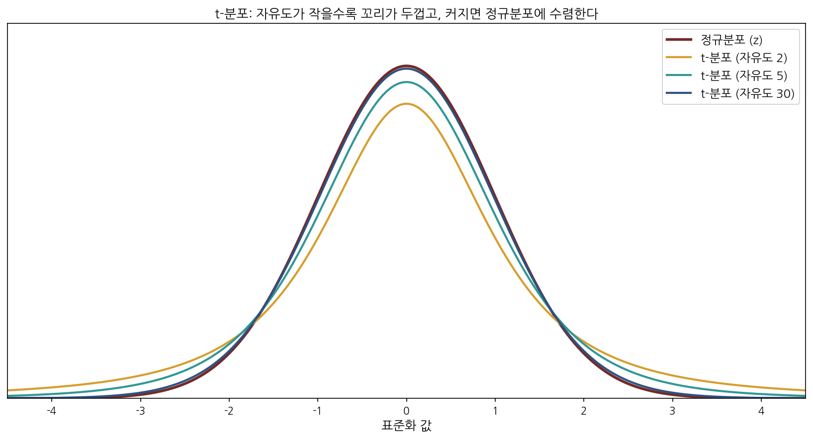
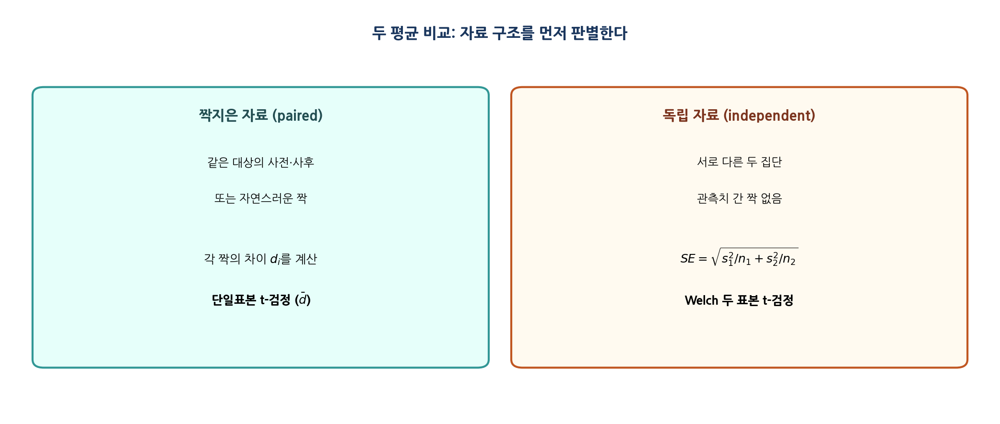
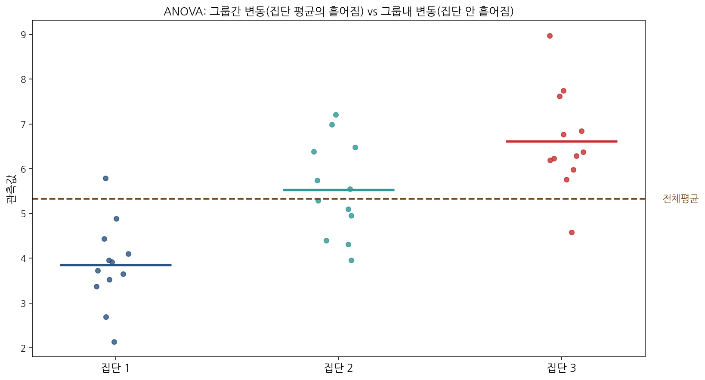
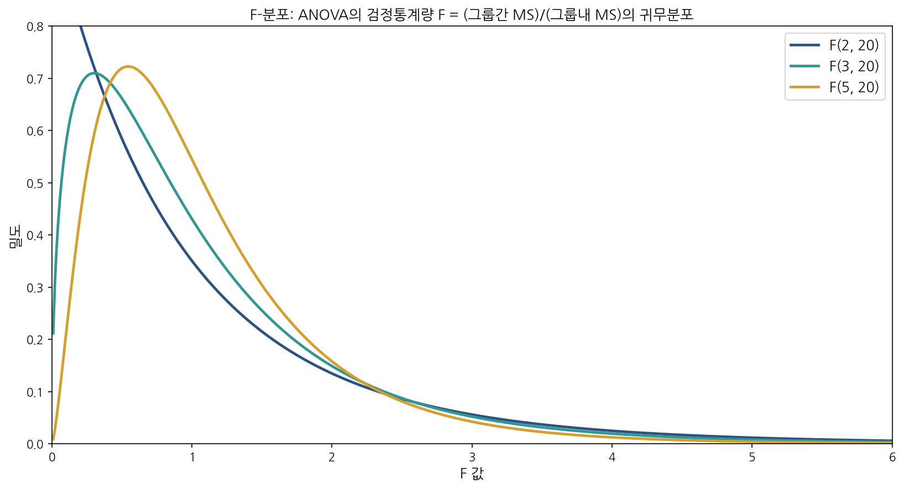

# 제7장 · 수치형 자료의 추론 — 학생 워크북

> **사용 안내.** 직접 손으로 풀며 익히는 연습용 교재이다. 빈 상자에 풀이 과정을 단계별로 적는다. 비율 대신 평균을 다루므로 정규분포가 $t$-분포로 바뀐다는 점이 핵심이며, 나머지 PCCC 4단계 논리는 5·6장과 같다. 유의수준이 명시되지 않으면 $\alpha = 0.05$를 쓴다. 허용 도구는 계산기와 $t$ 표이다.

---

## 학습 목표

이 장을 마치면 다음을 할 수 있어야 한다.

- 평균의 추론에서 정규분포 대신 **$t$-분포**(t-distribution)를 쓰는 이유를 설명하고, **자유도**(degrees of freedom)의 역할을 이해한다.
- **단일표본 $t$-검정**(one-sample t-test)과 신뢰구간을 수행한다.
- **짝지은 자료**(paired data)와 **독립 두 표본**(independent two samples)을 구별하고 각각에 맞는 검정을 선택한다.
- 두 평균 차이에 대한 **Welch $t$-검정**(Welch's t-test)을 수행한다.
- 셋 이상의 평균을 비교하는 **일원분산분석**(one-way ANOVA)의 논리(그룹간·그룹내 변동 분해)와 $F$ 통계량을 이해하고, 다중비교 문제를 설명한다.

---

## 1. 핵심 개념 정리

### 1.1 $t$-분포가 등장하는 이유

평균의 표준오차는 $SE_{\bar{x}} = s/\sqrt{n}$인데, 여기서 모표준편차 $\sigma$를 표본표준편차 $s$로 **추정**한다. 이 추가된 불확실성 때문에 표준정규보다 꼬리가 두꺼운 $t$-분포를 쓴다.



$$ T = \frac{\bar{x} - \mu_0}{s/\sqrt{n}}, \qquad df = n - 1 $$

> **[새로운 시각]** $t$-분포의 두꺼운 꼬리는 "벌금"이 아니라 **정직함**이다. $\sigma$를 안다고 가정하고 정규분포를 쓰면, 모르는 것을 아는 척하는 셈이라 신뢰구간이 실제보다 좁게 나와 과신하게 된다. $t$-분포는 "$s$로 $\sigma$를 추정했으니 그만큼 덜 확신한다"는 사실을 꼬리를 두껍게 만들어 정직하게 반영한다. 자유도가 커질수록(표본이 클수록) $s$가 $\sigma$에 가까워지므로 이 정직함의 대가가 줄어 정규분포에 수렴한다. 그림에서 자유도 30 곡선이 정규 곡선과 거의 겹치는 것이 그 증거이다. 이는 $t_{df} \to N(0,1)$ ($df \to \infty$)이라는 참인 극한 사실과 일치한다.

### 1.2 짝지은 자료 대 독립 자료



같은 대상의 사전·사후처럼 관측이 자연스럽게 짝지어지면 **차이** $d = x_{\text{전}} - x_{\text{후}}$를 만들어 단일표본 $t$-검정을 한다. 서로 다른 두 집단이면 독립 두 표본 검정을 한다.

> **[새로운 시각]** 짝짓기는 단순한 자료 정리가 아니라 **잡음을 제거하는 설계**이다. 사람마다 기본 혈압·체중·실력이 다른데, 같은 사람의 사전·사후를 빼면 그 개인차가 통째로 상쇄된다. 남는 것은 순수한 처치 효과뿐이다. 그래서 짝지은 설계는 같은 표본 크기에서 독립 설계보다 검정력이 높은 경우가 많다 — 분모(표준오차)에서 큰 개인차 변동이 사라지기 때문이다. **짝지은 자료를 독립 두 표본으로 잘못 분석하면 이 이점을 버리고 검정력을 스스로 떨어뜨린다.** 자료 구조를 먼저 판별하라는 조언은 단순한 절차가 아니라 통계적 효율을 지키는 핵심이다.

### 1.3 일원분산분석(ANOVA)



ANOVA는 셋 이상의 집단 평균이 모두 같은지($H_0: \mu_1 = \mu_2 = \cdots = \mu_k$) 검정한다. 핵심은 **그룹간 변동**(집단 평균들이 전체 평균에서 흩어진 정도)과 **그룹내 변동**(각 집단 안의 흩어짐)의 비교이다.



$$ F = \frac{\text{그룹간 평균제곱 (MSG)}}{\text{그룹내 평균제곱 (MSE)}} $$

> **[새로운 시각]** "평균을 비교하는데 왜 분산을 분석하는가?"라는 이름의 역설이 ANOVA의 핵심을 담고 있다. 집단 평균들이 서로 멀리 떨어져 있어도, 각 집단 내부가 매우 흩어져 있다면 그 차이는 우연일 수 있다. 반대로 평균 차이가 작아도 집단 내부가 촘촘하면 그 차이는 실재일 수 있다. 그래서 ANOVA는 평균 차이를 **그 자체로 보지 않고 내부 잡음 대비 얼마나 큰가**로 본다 — 그것이 $F$ 비율의 정체이다. $F$가 1 근처면 "집단 간 차이가 집단 내 잡음 수준"이라 귀무가설을 의심할 이유가 없고, $F$가 크면 "잡음으로 설명하기엔 평균 차이가 너무 크다"는 신호이다. 이름은 분산분석이지만 결론은 평균에 관한 것 — 모순이 아니라 설계의 핵심이다.

> **[새로운 시각]** ANOVA가 유의하다고 끝이 아니다. $F$ 검정은 "어느 집단이라도 다르다"만 말할 뿐 **어느 쌍이 다른지는 알려주지 않는다.** 그렇다고 모든 쌍을 그냥 $t$-검정으로 일일이 비교하면, 비교 횟수가 늘수록 1종 오류가 누적되어 거짓 양성이 폭증한다(예: 4개 집단이면 6번 비교 → 적어도 한 번 오류 날 확률이 $\alpha$를 훌쩍 넘는다). 그래서 Bonferroni 보정 같은 **다중비교 절차**로 $\alpha$를 나눠 통제한다. 이는 5장에서 본 1종 오류 통제 원칙이 "검정을 여러 번 하면 위험도 여러 배"라는 형태로 되돌아온 것이다.

---

## 2. 핵심 공식 모음

```{=latex}
\begin{tcolorbox}[colback=accent!4,colframe=accent,boxrule=0.8pt,title=\textbf{제7장 핵심 공식}]
```
- 단일표본: $\displaystyle T=\frac{\bar{x}-\mu_0}{s/\sqrt{n}}$, $df=n-1$; 신뢰구간 $\displaystyle \bar{x}\pm t^{\star}_{df}\frac{s}{\sqrt{n}}$
- 짝지은 자료: 차이 $d_i$에 대해 단일표본 검정, $\displaystyle T=\frac{\bar{d}-0}{s_d/\sqrt{n}}$, $df=n-1$
- 독립 두 표본(Welch): $\displaystyle T=\frac{\bar{x}_1-\bar{x}_2}{\sqrt{s_1^2/n_1+s_2^2/n_2}}$, 자유도는 Welch–Satterthwaite 근사
- ANOVA: $\displaystyle F=\frac{MSG}{MSE}=\frac{SSG/(k-1)}{SSE/(N-k)}$, 자유도 $(k-1,\ N-k)$
- 효과크기: $\displaystyle \eta^2=\frac{SSG}{SST}$
- 조건: 각 집단 독립·근사 정규(또는 큰 $n$), ANOVA는 등분산 가정 추가
```{=latex}
\end{tcolorbox}
```

---

## 3. 연습문제

### A부 · 개념 확인

**문제 7-A1.** 평균의 추론에서 정규분포 대신 $t$-분포를 쓰는 이유를 표준오차 $s/\sqrt{n}$의 $s$와 연결지어 설명하라. 표본이 커지면 두 분포가 가까워지는 이유도 함께 적어라.

```{=latex}
\worksp[3.2cm]
```

**문제 7-A2.** 다음 각 상황이 **짝지은 자료**인지 **독립 두 표본**인지 판별하라.
(a) 같은 환자 30명의 약 복용 전·후 혈압.
(b) 약을 받은 40명과 위약을 받은 38명의 혈압.
(c) 쌍둥이 25쌍에서 한 명씩 두 식단에 배정한 체중 변화.

```{=latex}
\worksp[3cm]
```

**문제 7-A3.** ANOVA가 유의하게 나왔을 때 곧바로 "1번 집단이 가장 높다"고 결론지으면 안 되는 이유를 다중비교 문제와 연결해 설명하라.

```{=latex}
\worksp[3cm]
```

### B부 · 계산 연습

**문제 7-B1.** 어떤 도시 성인의 수면 시간을 표본 $n = 25$명에서 조사해 $\bar{x} = 6.8$시간, $s = 1.5$시간을 얻었다.
(a) 평균 수면 시간의 95% 신뢰구간을 구하라. ($t^{\star}_{24} = 2.064$)
(b) "이 도시 성인의 평균 수면이 7시간이다"라는 주장을 $\alpha = 0.05$에서 양측검정하라.

```{=latex}
\worksp[5cm]
```

**문제 7-B2.** 어떤 훈련 프로그램의 효과를 보려고 참가자 $10$명의 사전·사후 점수 차이($d = \text{사후}-\text{사전}$)를 계산했더니 $\bar{d} = 4.2$, $s_d = 5.0$이었다.
(a) 이 자료가 짝지은 자료인 이유를 적어라.
(b) "프로그램이 효과가 없다($\mu_d = 0$)"를 $\alpha = 0.05$에서 검정하라. ($df = 9$)

```{=latex}
\worksp[5cm]
```

**문제 7-B3.** 두 교수법의 시험 점수를 비교한다. A반은 $n_1 = 30$, $\bar{x}_1 = 78$, $s_1 = 8$; B반은 $n_2 = 28$, $\bar{x}_2 = 73$, $s_2 = 10$이다.
(a) 두 평균 차이에 대한 Welch 표준오차를 구하라.
(b) $T$ 통계량을 구하라.
(c) 두 교수법에 차이가 있는지 검정하고, 이 자료에서 인과적 결론을 내릴 수 있는지 논하라.

```{=latex}
\worksp[5.5cm]
```

**문제 7-B4.** 세 비료의 작물 수확량을 비교하는 ANOVA에서 다음 부분 결과를 얻었다. $k = 3$개 집단, 전체 $N = 30$, $SSG = 48$, $SSE = 108$.
(a) 자유도 $(k-1,\ N-k)$를 구하라.
(b) MSG, MSE, $F$ 통계량을 구하라.
(c) 효과크기 $\eta^2$을 구하라. ($SST = SSG + SSE$)
(d) $\alpha = 0.05$에서 결론을 내려라. (임계값 $F_{0.05,\,2,\,27} \approx 3.35$)

```{=latex}
\worksp[6cm]
```

### C부 · 응용·도전

**문제 7-C1.** 짝지은 자료를 독립 두 표본 $t$-검정으로 잘못 분석하면 일반적으로 검정력이 떨어진다. 그 이유를 표준오차의 분모에서 무엇이 사라지는지를 들어 설명하라.

```{=latex}
\worksp[3.5cm]
```

**문제 7-C2.** "ANOVA는 평균을 비교하는데 왜 분산을 분석하는가?"라는 질문에 $F$ 비율의 분자·분모가 각각 무엇을 재는지로 답하라.

```{=latex}
\worksp[3.5cm]
```

### D부 · Python 실습

> 빈칸(`____`)을 채워 완성하고, 실행 결과를 아래 상자에 적어라.

**문제 7-D1.** 단일표본 $t$-검정과 신뢰구간을 완성하라. (문제 7-B1의 자료)

```python
import numpy as np
from scipy import stats

xbar, s, n, mu0 = 6.8, 1.5, 25, 7.0
se = s / np.sqrt(____)                               # 평균의 표준오차
t_stat = (xbar - mu0) / se
df = n - ____
p_value = 2 * (1 - stats.t.cdf(abs(t_stat), df))     # 양측 p-값
tstar = stats.t.ppf(0.975, df)
ci = (xbar - tstar * se, xbar + tstar * se)
print(f"T={t_stat:.3f}, df={df}, p={p_value:.4f}, 95% CI={ci}")
```

```{=latex}
\worksp[2.8cm]
```

**문제 7-D2.** Welch 두 표본 $t$-검정을 완성하라. (문제 7-B3의 자료)

```python
import numpy as np
from scipy import stats

x1bar, s1, n1 = 78, 8, 30
x2bar, s2, n2 = 73, 10, 28
se = np.sqrt(s1**2 / n1 + s2**2 / ____)              # Welch 표준오차
t_stat = (x1bar - x2bar) / se
print(f"SE={se:.3f}, T={t_stat:.3f}")
# 원자료가 있다면: stats.ttest_ind(g1, g2, equal_var=____)  ← Welch로 설정
```

```{=latex}
\worksp[2.8cm]
```

**문제 7-D3.** 일원분산분석을 `scipy`로 수행하라. (가상의 세 집단 자료)

```python
import numpy as np
from scipy import stats

g1 = [4.1, 3.8, 4.5, 4.0, 4.3]
g2 = [5.2, 5.5, 5.1, 5.8, 5.4]
g3 = [7.1, 6.8, 7.4, 7.0, 6.9]
F, p = stats.f_oneway(g1, g2, ____)                  # 세 집단 입력
print(f"F={F:.3f}, p-value={p:.4f}")
```

```{=latex}
\worksp[2.6cm]
```

---

## 4. 자기 점검 체크리스트

```{=latex}
\begin{tcolorbox}[colback=teal!4,colframe=teal,boxrule=0.7pt,title=\textbf{스스로 점검}]
```
- ☐ $t$-분포를 쓰는 이유와 자유도의 의미를 설명할 수 있다.
- ☐ 단일표본 $t$-검정과 신뢰구간을 수행할 수 있다.
- ☐ 짝지은 자료와 독립 두 표본을 정확히 구별해 검정을 선택할 수 있다.
- ☐ Welch 두 표본 $t$-검정의 표준오차를 계산할 수 있다.
- ☐ ANOVA의 $F$ 비율이 무엇 대 무엇의 비교인지 설명할 수 있다.
- ☐ ANOVA 이후 다중비교 문제와 그 통제 방법을 안다.
```{=latex}
\end{tcolorbox}
```
